# Project Chrono 게임 사양

경비 로봇 한 기의 다섯 패턴을 상대하는 오프라인 싱글 플레이 보스 러시 데모다. 처음 주어지는 검 하나로 일반 공격과 대시, Draw & Slash, 각성을 사용한다. 체크포인트와 조우를 거쳐 경비 로봇을 처치하면 데모가 끝난다. 이후 콘텐츠는 공통 전투·저장·연출 연결을 재사용해 Boss와 FX를 추가하는 것을 목표로 한다.

| 찾을 내용 | 절 또는 기능 |
| --- | --- |
| 조작·전투·부활 | [플레이어](#플레이어) · F-P01~11 |
| 보스 공통·경비 다섯 패턴 | [보스](#보스) · F-B01~07 |
| 타이틀·HUD·카메라·음향 | [화면과 음향](#화면과-음향) · F-U01~08 |
| 부팅·저장·재시작·엔딩 | [진행과 저장](#진행과-저장) · F-S01~07 |
| 그림 편집과 게임 연결 | [아트와 제작 기준](#아트와-제작-기준) · F-A01 |
| 관련 원작 코드·확인 범위 | [레퍼런스 코드](#레퍼런스-코드) · [검증과 후속 범위](#검증과-후속-범위) |
| 기능별 실제 호출 순서 | [Sequence Diagram](#sequence-diagram)에서 기능 ID와 Case 번호 검색 |

Unity 6000.3.21f1, Windows 10/11 키보드·마우스, 1920×1080·60 FPS 목표. 입력은 Unity Input System, 저장·Title 준비는 UniTask, Player 효과음은 Unity AudioSource를 사용한다. 실행 패키지와 설정의 기준은 [manifest.json](../project/Packages/manifest.json)과 [빌드 씬 목록](../project/ProjectSettings/EditorBuildSettings.asset)이다.

## 플레이어

담당 코드는 [Player](../project/Assets/Scripts/Player/), 피해 판정은 [Systems](../project/Assets/Scripts/Systems/)에 있다. 아래 값은 현재 [Player.prefab](../project/Assets/Prefabs/Startup/Player.prefab)에 연결한 조정값이다. 입력 맵의 실제 키는 [Input Actions](../project/Assets/InputSystem_Actions.inputactions)에 있다.

| 기능 | 동작과 경계 | 담당 |
| --- | --- | --- |
| F-P01 이동·조준 | WASD 대각은 정규화하고 반대 입력은 상쇄한다. 마우스 조준은 이동과 독립적이다. 벽·Boss 몸체에서 이동을 멈추거나 표면을 따라 미끄러진다. 몸체는 북 기준 0°~30° 미만 bw, 30°~90° 미만 upper, 90°~150° 미만 low, 150°~180° fw. 북·남은 공통, 사선은 좌우 반사해 6방향을 표시한다. Idle 12fps, Move 4×현재 SP fps, 뒷걸음은 역재생한다. | PlayerInputController → PlayerCharacter → PlayerBodyController·CharacterRendering |
| F-P02 대시 | Space를 누르면 이동 중에는 이동 방향, 정지 중에는 조준 방향으로 대시한다. 시작 속도 24 unit/s, 감속 87 unit/s², 이동 0.14초, Hitbox 회피 0.1초, 입력 차단 0.14초, 재사용 0.65초가 각각 진행된다. 벽과 Boss 몸체가 대시를 막는다. 실제 대시 방향의 독립 단일 프레임을 유지한다. | PlayerCharacter·PlayerBodyController·CharacterRendering |
| F-P03 일반 공격 | 좌클릭 홀드 또는 허용 구간에 예약한 클릭으로 3콤보를 잇는다. 타격 중 입력 이동은 0이며 시작 방향의 감속 전진만 허용한다. 무기 기준 타격 시점은 1타 11/30초, 2타 7/30초, 3타 22/60초다. 각 판정은 생성 후 0.15게임초 동안 유효하며 같은 수신자에게 한 번만 피해를 준다. 공격 중 대시·Draw·Slash 전환은 막고 차단·사망 시 중단한다. 무기 모션에는 AS, 몸체 3프레임에는 20fps를 적용한다. | AttackController·CharacterRendering·CollisionBox |
| F-P04 Draw | Shift로 진입·취소한다. 전용 입력 맵을 켜고 게임 시간을 멈춘 동안 커서·카메라·편집 UI는 작동한다. 기존 선이 있는 상태에서 취소하면 원래 선을 유지한다. 중단 시 자신이 건 시간 정지와 입력 전환만 해제한다. | SkillController·PlayerInputController·UI_Draw·GameCamera |
| F-P05 점 편집 | 좌클릭으로 시작점과 방향점을 찍는다. 같은 점은 무효이고 두 번째 유효 점 이후 추가 클릭을 무시한다. 길이 6, 선 폭 0.25로 고정한다. R은 편집점 초기화, F는 유효한 선을 확정한다. 벽이나 맵 경계에 맞추어 절단하지 않는다. | LineDrawer·Line |
| F-P06 선 수명 | 확정 원본은 `PlayerCharacter.CurrentLine`에 하나만 있다. 새 확정이 기존 선을 교체한다. 8게임초 후 자연 만료되며 소모 직전에도 만료 여부를 확인한다. 취소·확정·자연 만료 후 Draw 대기 0.35초, 확정 후 Slash 대기 0.15초, Slash 소모 후 Draw 대기 3초. | SkillController·DrawVfx·DrawLineVfx·DrawEvaporationVfx |
| F-P07 Slash | 일반 모드 F에서 유효한 선을 한 번 소비한다. 발도·납도 후 지연된 공간참이 선 방향의 직사각 영역을 한 번 조회한다. 시전 시 고정한 폭은 현재 오라 포함 0.75다. 같은 수신자 피해는 한 번, 부위 성공은 Boss가 같은 공격 ID로 집계한다. 일반탄은 제거하고 황금탄은 입사 방향을 선의 법선에 반사해 직진시킨다. 중단해도 이미 소비한 선은 돌아오지 않는다. | SkillController·LineSlasher·CollisionBox·SlashPresentationFx |
| F-P08 피격 | HP가 실제 감소하면 OnDamaged, 치명 피해면 OnDie를 한 번 통지한다. 피격 후 게임 시간 0.75초의 Hitbox 보호와 빨강 점멸을 적용한다. 대시 회피·피격 보호는 Hitbox 피해에, 전면 무적은 모든 피해에 적용된다. 피격 시 행동 경직은 없다. | Character·PlayerCharacter·Hitbox·CharacterRendering |
| F-P09 생성·사망·부활 | 계속하기는 저장 HP와 마지막 활성 수정 위치를 복원한다. 사망 횟수를 저장하고 연출 후 같은 Player 인스턴스를 최대 HP·기본 수치로 되살린다. 선·버프·쿨타임은 초기화하고 첫 조우·처치·수정 기록은 보존한다. Title 이탈 시 지연 실행을 취소한다. | PlayerSpawner·Character·StageManager·UI_Death |
| F-P10 체크포인트 | 범위에 들어가면 후보와 안내가 생긴다. 일반 F는 수정 상호작용을 Slash보다 우선한다. 완료 시 한 번 회복·활성·저장을 요청하고 문·배치를 갱신한다. 중간 이탈·사망·차단 때는 취소한다. | CrystalCheckPoint·MapManager·PlayerInputController |
| F-P11 각성·그로기 | 황금탄 반사로 각성을 얻는다. 기본 8초간 AD×1.5, AS·SP×1.25, 매 획득 HP+5, Draw 대기×0.5. 재획득은 기간 갱신과 회복이며 같은 배율을 재차 곱하지 않는다. 같은 프레임은 제거 우선이다. Slow는 독립 수명. 그로기 게이지 100 도달 즉시 현재 Boss에 적용하고 0으로 소모한다. | CharacterBuff·PlayerCharacter·FeverAuraFx·BossCharacter |

## 보스

[GuardRobot.prefab](../project/Assets/Prefabs/Startup/GuardRobot.prefab)의 Boss_01과 [Enemy 코드](../project/Assets/Scripts/Enemy/)가 현재 전투를 담당한다. 다음 시간은 게임 시간이며 정지 중에는 진행하지 않는다.

| 기능 | 규칙·현재 동작 |
| --- | --- |
| F-B01 생성·재도전 | StageManager가 Map → Boss → Player 순서로 생성하고 BossSpawner가 저장된 처치 여부를 적용한다. 재도전 시 같은 미처치 Boss의 위치·상태·패턴 이력을 초기화한다. 처치한 Boss는 사체 상태로 둔다. |
| F-B02 조우 | EncounterTrigger 진입 → 첫 조우/재조우 컷씬 → 정상 종료 시 문 닫힘·Boss HUD·전투 시작. 첫 조우는 저장한다. 취소·사망·Title 이탈은 늦은 전투 진입을 막는다. 조우 전에도 유효 피해는 받는다. |
| F-B03 패턴 선택 | BossPatternSelector가 조건 충족·직전 제외 후 양수 우선순위가 있으면 최고 우선 후보, 그 안에서 가중 추첨한다. 유효 후보가 없으면 Idle을 유지한다. |
| F-B04 그로기 | 게이지 충족 즉시 진행 패턴을 취소한다. 이미 발사된 탄환은 자체 수명을 계속한다. 경비의 3게임초 그로기가 끝나면 Idle로 돌아간다. |
| F-B05 처치 | 처치 기록·완료 판정은 한 번만 처리하고 전투 구독·Boss HUD를 해제한다. 통로 개방과 사체 상태는 저장 재진입에도 반영한다. 최종 경비의 화면 전환은 F-S06이 맡는다. |
| F-B06 탄환·충돌 | 일반탄은 Slash로 제거, 황금탄은 반사 후 소유자 피격 영역과 실제 충돌해야 피해를 준다. 벽과 대상 중 가까운 충돌을 우선한다. 맵 끝까지 가는 탄의 수명 0은 벽에 닿을 때까지를 뜻한다. 예고 도형과 실제 피해 판정은 분리한다. Boss 몸체는 진입을 막고 접촉 피해는 주지 않는다. |
| F-B07-01 복부 단발 | 사거리 4.5 안에서 0.8초 준비 뒤 복부 총구 하나에서 현재 Player 방향 황금탄 한 발. 속도 6, 수명 6초, 피해 10, 회복 1초. |
| F-B07-02 한 손 내려찍기 | 한 손을 선택해 그림자·원형 경고가 표적을 따라가며 안쪽부터 2.2초 충전한다. 충전 완료 위치에 고정하고 0.12초 낙하 후 반경 1.35에 한 번 피해 10. 이미 끝난 착지는 반복하지 않는다. |
| F-B07-03 중앙 내려찍기 | 중앙 큰 원을 1.2초 충전하고 양손을 내려친다. 원형 반경 3.5에 피해 15를 한 번 적용하고, 양옆으로 각각 6개의 일반탄을 세로로 발사한다. |
| F-B07-04 양눈 레이저 | 충전 뒤 0.4게임초 전의 Player 위치로 레이저 착탄점이 따라간다. 피해는 지면의 두 원 안에만 적용하고 양눈을 합쳐 한 번만 성공한다. 빔 몸통은 피해 영역에 포함되지 않는다. |
| F-B07-05 부채꼴 | 다섯 복부 총구를 두 바퀴 순회한다. 0.4초 준비 뒤 각 총구에서 60° 부채꼴 5발, 발사 간격 0.3초, 마지막 회복 0.5초. 중단하면 남은 발사만 취소한다. |

## 화면과 음향

| 기능 | 동작·연결 |
| --- | --- |
| F-U01 Title | 시작·설정·종료 메뉴와 가로 3슬롯. 빈 슬롯은 새 게임, 일반 슬롯은 계속, 완료 슬롯은 새 게임 확인을 거친다. Esc는 확인/슬롯 화면을 닫는다. 설정 버튼은 비활성이다. Title 로고 원본 위에 칼날 십자와 푸른 광을 별도 표시한다. `UI_Title` |
| F-U02 HUD | Player HP·그로기·Draw·Slash 상태, 수정 상호작용 F, 조우한 Boss HP를 현재 값으로 표시한다. 월드 진입과 Title 이탈 시 대상 구독·커서 표시를 교체한다. `UIController` |
| F-U03 컷씬 HUD | Draw·Slash·생성·사망·Boss 컷씬의 표시 상태를 따로 관리하고 취소 시 복구한다. Boss 사망 시 Boss HP부터 숨긴다. `UIController`, `CutsceneController` |
| F-U04 카메라 | 일반 상태는 Player 지연 추적, Draw는 Player 기준으로 거리에 제한을 둔 커서 오프셋을 즉시 적용한다. Slash 확대와 사망 초점은 이전 대상·줌으로 복귀한다. 맵의 수직 시야 경계를 지킨다. `GameCamera` |
| F-U05 로딩 | Title·MainWorld 준비 중 전환을 표시한다. Map/Boss/Player와 필수 참조가 준비돼야 입력을 열고, 실패하면 세션을 정리하고 Title로 복구한다. `UI_Loading`, `GameManager` |
| F-U06 공격 표현 | Attack1~3의 고정 무기·검흔은 `WeaponPivot`의 Animation 클립에서 조정한다. 무기·FX의 재생·종료는 공격에 연결되고 몸체의 고정 프레임 재생률은 독립이다. `AttackController`, `CharacterRendering` |
| F-U07 피드백 | 공격 A/B 및 3타 A→B, 유효 적중음과 적중 FX 7장, 실제 걷기 거리 기준 3발소리, Slash 발도·공간참 표현이 연결돼 있다. 최종 청감, BGM·전체 음량·나머지 음향은 후속이다. `PlayerFeedback`, `SlashPresentationFx` |
| F-U08 설정 | 음량·키 재지정·해상도/화면 모드와 비전투 Esc 설정은 후속 기능이다. 설정 저장은 슬롯 진행과 독립시키기로 했다. |

## 진행과 저장

| 기능 | 동작·실패 처리 |
| --- | --- |
| F-S01 부팅 | Title의 `UI_Title`은 자기 슬롯 UI와 입력, `GameManager`는 저장 준비·씬 전환, `StageManager`는 월드 생성을 맡는다. 필요한 서비스·대상 연결이 끝난 뒤 입력을 연다. 중복 서비스는 정상 Instance를 유지하고 실패하거나 Title로 돌아가면 세션 연결을 해제한다. |
| F-S02 저장 | `SaveManager.Current.Set`은 메모리 값을 바꾸고 명시적 `Save()`가 요청 당시 값의 사본을 순서대로 기록한다. 사용자 문서 폴더의 `Project_Chrono/slot1~3.sav`, 슬롯당 `.bak` 하나를 쓴다. 읽기는 sav → bak → 빈 슬롯. 쓰기·무결성 검사 실패 시 한 번 재시도하고 다시 실패하면 기존 유효 bak 복원을 시도한 뒤 그 요청을 종료한다. 다음 저장은 정상 시도하고 앱 종료는 진행 중인 처리 완료를 기다린다. |
| F-S03 진행 | 슬롯에는 PlayerHP·DeathCount·PlayTime·LastSavedAt·CheckpointId·ActivatedCheckpoints·EncounteredBosses·DefeatedBosses·EntranceCompleted를 둔다. 슬롯 선택부터 Title 복귀까지 플레이 시간을 합산한다. 진행률은 처치한 Boss 수로 계산한다. |
| F-S04 시간·입력 | 일반 정지와 Draw/Slash/사망/컷씬의 소유를 분리한다. 게임 시간 정지 시 이동·탄·쿨타임·선·버프를 멈추고, UI·카메라·지정 연출은 실제 시간으로 진행한다. 각 작업이 종료될 때 자기 정지만 해제한다. |
| F-S05 첫 입장 | 새 슬롯 최초 입장은 `TutorialController`가 문이 보이지 않는 고정 화면 아래에서 Player를 출발시킨다. 맵 안에서 위로 걸어 별도 중앙 마커에 닿으면 완료 저장 후 입력과 카메라를 넘긴다. 취소·이탈·경로 실패 시 완료 기록을 남기지 않는다. 구 저장에 EntranceCompleted 키가 없으면 이미 입장한 것으로 본다. 계속하기와 부활은 기존 체크포인트를 쓴다. 전체 안내·대사는 후속이다. |
| F-S06 데모 엔딩 | 마지막 경비 처치 → 입력 잠금·암전(기본 실제 2초) → 중앙 `Demo는 여기까지입니다..`(기본 3초) → Title. `TempDemoEnding`이 세션 중단 시 이전 실행을 해제한다. 정식 스탭롤은 후속이다. |
| F-S07 디버그 GUI | 현재 제출 범위에서 제외했다. |

## 아트와 제작 기준

- **F-A01 원본 동기화.** [Player 원본](../art/archive/player/)의 Idle·Move·Attack·Dash 각각 4개와 [검 원본](../art/archive/weapon/)의 `sword_0~3.aseprite`를 편집한다. [PlayerArtSourceSync.cs](../project/Assets/Editor/PlayerArtSourceSync.cs)의 `CreateSources`가 정확한 파일명 20개를 정한다. 각 Dash는 Attack 첫 프레임을 최초 한 번 복사한 독립 파일이다. 이후 Dash와 Attack은 별도로 수정한다.
- **Unity 연결.** 저장된 변경은 공식 Aseprite Importer를 통해 `Assets/Art/Player/Source/`, `Assets/Art/Weapons/Source/`에 반영된다. 안정된 파일만 복사하고 원래 그림·태그·GUID·기존 Inspector 조정을 보존한다. Aseprite 프레임 순서를 쓰되 임의 프레임 간격은 게임 재생에 적용하지 않는다. 기본 표시 검은 `sword_0`이다. 사망·기상·발도는 전용 이미지·데이터를 사용한다.
- **공격 편집.** 기본 Player 프리팹의 `WeaponPivot`을 Animation 창에 고정해 `WeaponMotion`·`AttackVfx`를 편집한다. Player·검·FX의 부모 기준 좌표를 함께 보고, 같은 Sorting Layer에서 검 최대 21, FX 22를 유지한다. 기본 레이아웃 이름은 `PlayerAttack`이다. 구형 Workbench는 폐기했다.
- **맵.** [실험실 제작 원본](../art/archive/environment/laboratory/final/)의 방 바닥은 400×288px(16px 셀 25×18), 기준 시야 320×180px를 6배 표시한다. 벽 16px, 통로 80px, 복도 바닥 80×464px, 팔레트 C를 사용한다. 16PPU·Point·무압축·밉맵 없음, 맵 Atlas 패딩 4px를 유지한다. 입구/출구 모션은 분리하고 `MapDoor`가 최종 개방을 확인한 뒤 Blocker를 해제한다. [자수정 원본](../art/archive/environment/amethyst/final/)은 비활성·활성의 수정 모양과 부유를 보존한다.
- **출처·편집 원본.** [경비 미술](../art/archive/boss/guard-r05/), [Draw·피격·각성 FX](../art/archive/fx/), [HUD·조준점·키보드](../art/archive/ui/final/), [Title 로고](../art/archive/title/title-screen-r02/), [음원](../art/archive/audio/)을 용도별로 사용한다. Title은 사용자가 수정한 Aseprite가 기준이다. PlayerFeedback의 검격·적중·발소리는 Sephiria 추출 WAV다. 사용자 원본은 자동 생성이나 일괄 내보내기로 덮어쓰지 않는다.

## 레퍼런스 코드

기능별로 아래 원작의 해당 파일·생성부·호출부를 찾아간다. 로컬 소스 루트는 [Sephiria](<reference/sephiria/code/ingame code/Assembly-CSharp/>), [Dungreed](<reference/dungreed/code/ingame code/Assembly-CSharp/>), [Enter the Gungeon](<reference/enter the gungeon/code/ingame code/Assembly-CSharp/>)이며 Git에서는 제외된다. 표의 파일명은 각 루트 바로 아래의 실제 `.cs` 파일이다.

| 우리 기능·담당 | 주 레퍼런스 (Sephiria) | 적용한 부분·다른 게임의 보조 근거 |
| --- | --- | --- |
| F-P01/02 PlayerCharacter·Input·Body·Rendering | UnitAvatar, PlayerInputController, CharacterDash_FastMove, TopdownRigidbody, PlayerAvatar | 입력과 이동·외형 책임을 나눈다. Enter the Gungeon의 PlayerController.HandleFlipping·GetBaseAnimationName와 DirectionalAnimation.GetInfo에서 6방향 반사를 참고했다. 각도는 우리 게임의 30/90/150°를 사용한다. |
| F-P03/U06/U07 AttackController·PlayerFeedback | WeaponSimple_GreatSword, WeaponControllerSimple, WeaponSimple, NewWeaponFireData, MeleeCollision, SpriteFx | 스윙·판정 생성·피드백의 호출 지점을 참고한다. 고정 검 한 개에서 무기·검흔 클립으로 편집한다. [대검 프레임·곡선 분석 데이터](archive/03_Analysis/Sephiria_GreatSword_Attacks_20261115/)가 남아 있고 원작의 추출 애니메이션 파일 일부는 현 로컬 트리에 없다. |
| F-P04~07 SkillController·LineDrawer·LineSlasher | SkillController, WeaponSkillController, MeleeCollision_Rectangle | 능력 수명과 사각 판정 책임을 참고한다. 두 점으로 그린 선을 유지했다가 소비하는 규칙은 Project Chrono 고유 사양이다. |
| F-P08~11 Character·Spawner·Buff·Hitbox | UnitAvatar, PlayerSpawner, CharacterBuff, Hitbox, Interactable, InteractableChecker | 피해 사건·재생성 경계·버프 수명·상호작용 후보를 참고한다. 현재 게임은 사망 후 같은 Player를 초기화한다. |
| F-B01~05 BossCharacter·Spawner·Selector·Encounter | BossSpawner, UnitAI_BossBasic, UnitAI_Askard, UnitAI_ArmadilloGolem | 조우·AI 활성화, 패턴 실행/중단·조건 추첨을 분리한다. 각 패턴의 구체 기하와 재도전 규칙은 경비 프리팹이 정한다. |
| F-B06/07 Projectile·GuardHandAttack·GuardEyeLaser | Bullet, BulletDestroyModule, Unit_ArmadilloGolem, AskardLaserWarning, BreakableProp | 탄환 수명·부위·패턴 전조를 참고한다. 경비의 금색 반사탄과 지면 레이저 착탄 판정은 독자 규칙이다. |
| F-U01~05 UI_Title·UIController·GameCamera·CutsceneController | UI_TitleLobby, UI_SaveProfilePanel, UIManager, UI_PlayerHP, GameCamera, TargetTracker, ScreenFader, CutScenePlayer | Dungreed의 TitleUIManager·GameCamera·PlayerTracker와 Enter the Gungeon의 CameraController를 보조로 쓴다. 시간 정지 중 화면 추적·복구를 월드 수명과 구분한다. |
| F-S01~06 GameManager·StageManager·MapManager·SaveData·TutorialController | GameTimeManager, DungeonManager, FloorGenerator, DungeonDoor, SaveManager, SaveData, CutSceneActorMoveNode | 저장/로드 요청과 슬롯 파일 처리를 나누고 고정 맵을 쓴다. Dungreed의 GameManager·SaveManager·TutorialManager는 씬 진입·안내 흐름의 보조 자료다. |

## 검증과 후속 범위

- 2026-11-16 Windows64 빌드는 성공했다. 기능별 검사에서 시작·재진입·피해·보스 패턴·종료 흐름을 각각 확인했다. 11월 22일 변경은 Editor 컴파일, Player 프리팹·Stage 참조, 독립 Dash 4개의 Sprite와 기존 16원본 보존을 확인했다. 새 Dash의 실제 Play와 현재 전체 빌드에서 새 게임 → 다섯 패턴 → 사망·재도전 → 엔딩·Title의 연속 회귀는 미확인이다.
- 현재 데모 이후의 후보는 군용 로봇(F-B08, 6패턴), 뱀(F-B09, 5), 꽃 봉오리(F-B10, 7), 슈트 맨(F-B11, 7), 최종 보스(F-B12, 8)다. 군용은 정적 시각 배치만 있다. 나머지 33패턴의 기획은 [개발자 보스 원문](<notes/notion 문서/Project Chrono/적 컨셉 40257a6d6d248023a8a7f063107b6b92.md>)에 있다. 8방향 아트와 일부 컷씬의 Esc 건너뛰기는 보류다. 구조 면에서는 사망 이벤트의 직접 구독과 중계, 처치한 Boss의 전체 생성과 사체만 생성, 컷씬 이벤트와 FSM, MapManager의 책임 분리를 후속 검토한다. 후속 보스·대사·전체 조작 튜토리얼·설정과 전체 음향은 제작 전이다.
- 현재 아트가 연결된 상태와 최종 배색·모션·청감 승인은 별개다. 환도·칼집 선택안과 추가 Player 배색은 미확정이다. 전체 플레이의 최종 가독성·밸런스·사용자 평가와 Unity Profiler A/B 성능 비교는 미실행이다. 맵 경계선의 예전 관찰 조건은 [사용자 첨부 화면](archive/03_Analysis/Tilemap_Texture_Bleeding_20261116/)에서 찾을 수 있다.

## Sequence Diagram

기능별 제목을 열면 Case 번호와 호출 흐름을 볼 수 있다. F-S02 저장 요청과 종료 대기는 F-S01의 ④·⑥을 함께 본다. [Notion 정리 페이지](https://app.notion.com/p/41857a6d6d24809a8d15f1a5aa34d48a) 2장에서 같은 기능 ID·Case 번호를 사용한다. 퇴역한 기능의 번호는 재사용하지 않는다.

F-P01 SequenceDiagram

**① WASD 입력 → 이동·충돌 처리**

입력 콜백이 보관한 일반 변위를 몸체에 전달하고 충돌 보정 뒤 걷기 프레임을 고른다.

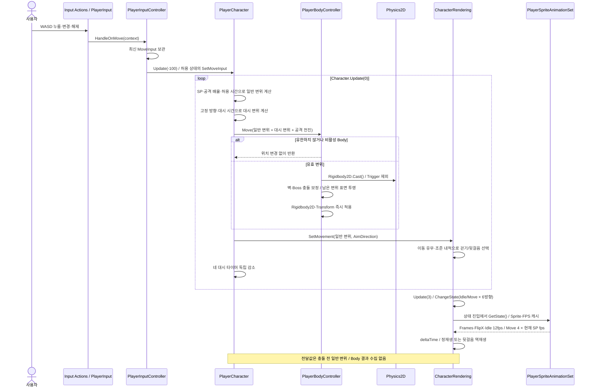
```mermaid
sequenceDiagram
    actor User as 사용자
    participant Actions as Input Actions / PlayerInput
    participant Input as PlayerInputController
    participant Player as PlayerCharacter
    participant Body as PlayerBodyController
    participant Physics as Physics2D
    participant Visual as CharacterRendering
    participant Set as PlayerSpriteAnimationSet
    User->>Actions: WASD 누름·변경·해제
    Actions->>Input: HandleOnMove(context)
    Input->>Input: 최신 MoveInput 보관
    Input->>Player: Update(-100) / 허용 상태의 SetMoveInput
    loop Character.Update(0)
        Player->>Player: SP·공격 배율·허용 시간으로 일반 변위 계산
        Player->>Player: 고정 방향·대시 시간으로 대시 변위 계산
        Player->>Body: Move(일반 변위 + 대시 변위 + 공격 전진)
        alt 유한하지 않거나 비활성 Body
            Body-->>Player: 위치 변경 없이 반환
        else 유효 변위
            Body->>Physics: Rigidbody2D.Cast() / Trigger 제외
            Body->>Body: 벽·Boss 충돌 보정 / 남은 변위 표면 투영
            Body->>Body: Rigidbody2D·Transform 즉시 적용
        end
        Player->>Visual: SetMovement(일반 변위, AimDirection)
        Visual->>Visual: 이동 유무·조준 내적으로 걷기/뒷걸음 선택
        Player->>Player: 네 대시 타이머 독립 감소
    end
    Visual->>Visual: Update(3) / ChangeState(Idle/Move × 6방향)
    Visual->>Set: 상태 진입에서 GetState() / Sprite·FPS 캐시
    Set-->>Visual: Frames·FlipX·Idle 12fps / Move 4 × 현재 SP fps
    Visual->>Visual: deltaTime / 정재생 또는 뒷걸음 역재생
    Note over Player,Visual: 전달값은 충돌 전 일반 변위 / Body 결과 수집 없음
```

**② 마우스 이동 → 몸체·무기 방향과 뒷걸음 표현**

화면 좌표를 월드 조준점으로 바꿔 몸체 6방향과 무기의 어깨 회전을 갱신한다.

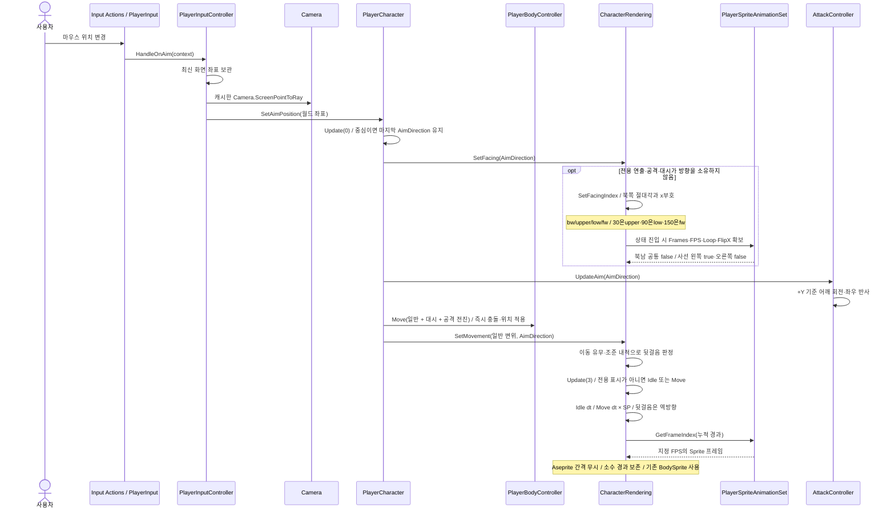
```mermaid
sequenceDiagram
    actor User as 사용자
    participant Actions as Input Actions / PlayerInput
    participant Input as PlayerInputController
    participant Camera
    participant Player as PlayerCharacter
    participant Body as PlayerBodyController
    participant Visual as CharacterRendering
    participant Set as PlayerSpriteAnimationSet
    participant Weapon as AttackController
    User->>Actions: 마우스 위치 변경
    Actions->>Input: HandleOnAim(context)
    Input->>Input: 최신 화면 좌표 보관
    Input->>Camera: 캐시한 Camera.ScreenPointToRay
    Input->>Player: SetAimPosition(월드 좌표)
    Player->>Player: Update(0) / 중심이면 마지막 AimDirection 유지
    Player->>Visual: SetFacing(AimDirection)
    opt 전용 연출·공격·대시가 방향을 소유하지 않음
        Visual->>Visual: SetFacingIndex / 북쪽 절대각과 x부호
        Note over Visual: bw/upper/low/fw / 30은upper·90은low·150은fw
        Visual->>Set: 상태 진입 시 Frames·FPS·Loop·FlipX 확보
        Set-->>Visual: 북남 공통 false / 사선 왼쪽 true·오른쪽 false
    end
    Player->>Weapon: UpdateAim(AimDirection)
    Weapon->>Weapon: +Y 기준 어깨 회전·좌우 반사
    Player->>Body: Move(일반 + 대시 + 공격 전진) / 즉시 충돌·위치 적용
    Player->>Visual: SetMovement(일반 변위, AimDirection)
    Visual->>Visual: 이동 유무·조준 내적으로 뒷걸음 판정
    Visual->>Visual: Update(3) / 전용 표시가 아니면 Idle 또는 Move
    Visual->>Visual: Idle dt / Move dt × SP / 뒷걸음은 역방향
    Visual->>Set: GetFrameIndex(누적 경과)
    Set-->>Visual: 지정 FPS의 Sprite 프레임
    Note over Visual: Aseprite 간격 무시 / 소수 경과 보존 / 기존 BodySprite 사용
```

**③ 씬 서비스 준비·입력 차단 → 멈춤과 재개·Title 정리**

서비스와 대상이 준비된 뒤 입력을 열고 세션 종료 시 참조를 해제한다.

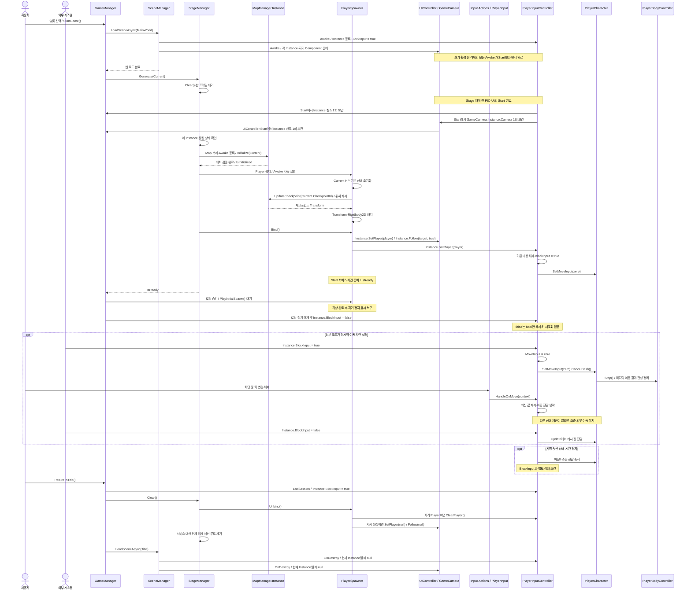
```mermaid
sequenceDiagram
    actor User as 사용자
    actor System as 외부 시스템
    participant GM as GameManager
    participant Scene as SceneManager
    participant Stage as StageManager
    participant Map as MapManager.Instance
    participant Spawner as PlayerSpawner
    participant Services as UIController / GameCamera
    participant Actions as Input Actions / PlayerInput
    participant Input as PlayerInputController
    participant Player as PlayerCharacter
    participant Body as PlayerBodyController
    User->>GM: 슬롯 선택 / StartGame()
    GM->>Scene: LoadSceneAsync(MainWorld)
    Scene->>Input: Awake / Instance 등록·BlockInput = true
    Scene->>Services: Awake / 각 Instance·자기 Component 준비
    Note over Services,Input: 초기 활성 씬 객체의 모든 Awake가 Start보다 먼저 완료
    Scene-->>GM: 씬 로드 완료
    GM->>Stage: Generate(Current)
    Stage->>Stage: Clear()·한 프레임 대기
    Note over Services,Input: Stage 재개 전 PIC·UI의 Start 완료
    Input->>GM: Start에서 Instance 참조 1회 보관
    Input->>Services: Start에서 GameCamera.Instance.Camera 1회 보관
    Services->>GM: UIController.Start에서 Instance 참조 1회 보관
    Stage->>Stage: 세 Instance·활성 상태 확인
    Stage->>Map: Map 복제·Awake 등록 / Initialize(Current)
    Map-->>Stage: 배치 검증 완료 / IsInitialized
    Stage->>Spawner: Player 복제 / Awake 자동 실행
    Spawner->>Spawner: Current HP·기본 상태 초기화
    Spawner->>Map: UpdateCheckpoint(Current.CheckpointId) / 위치 캐시
    Map-->>Spawner: 체크포인트 Transform
    Spawner->>Spawner: Transform·Rigidbody2D 배치
    Stage->>Spawner: Bind()
    Spawner->>Services: Instance.SetPlayer(player) / Instance.Follow(target, true)
    Spawner->>Input: Instance.SetPlayer(player)
    Input->>Input: 기존 대상 해제·BlockInput = true
    Input->>Player: SetMoveInput(zero)
    Note over Spawner: Start 서비스/사건 준비 / IsReady
    Stage-->>GM: IsReady
    GM->>Spawner: 로딩 숨김 / PlayInitialSpawn() 대기
    Note over Spawner: 기상 완료 후 자기 정지·표시 복구
    GM->>Input: 로딩·정지 해제 후 Instance.BlockInput = false
    Note over Input: false는 bool만 해제·키 재조회 없음
    opt 외부 코드가 명시적 이동 차단 설정
        System->>Input: Instance.BlockInput = true
        Input->>Input: MoveInput = zero
        Input->>Player: SetMoveInput(zero)·CancelDash()
        Player->>Body: Stop() / 마지막 이동 결과·관성 정리
        User->>Actions: 차단 중 키 변경·해제
        Actions->>Input: HandleOnMove(context)
        Input->>Input: 최신 값 캐시·이동 전달 생략
        Note over Input,Player: 다른 상태 제한이 없으면 조준·외부 이동 유지
        System->>Input: Instance.BlockInput = false
        Input->>Player: Update에서 캐시 값 전달
    end
    opt 사망·컷씬 상태·시간 정지
        Input->>Player: 이동0·조준 전달 중지
        Note over Input: BlockInput과 별도 상태 조건
    end
    User->>GM: ReturnToTitle()
    GM->>Input: EndSession / Instance.BlockInput = true
    GM->>Stage: Clear()
    Stage->>Spawner: Unbind()
    Spawner->>Input: 자기 Player이면 ClearPlayer()
    Spawner->>Services: 자기 대상이면 SetPlayer(null) / Follow(null)
    Stage->>Stage: 서비스 대상 전체 해제·세션 루트 제거
    GM->>Scene: LoadSceneAsync(Title)
    Scene->>Input: OnDestroy / 현재 Instance일 때 null
    Scene->>Services: OnDestroy / 현재 Instance일 때 null
```

**④ 외부 코드의 Player 재연결·중복 서비스 생성 → 현재 연결 보호**

이전 Player나 중복 서비스가 정리될 때 새 연결을 보존한다.

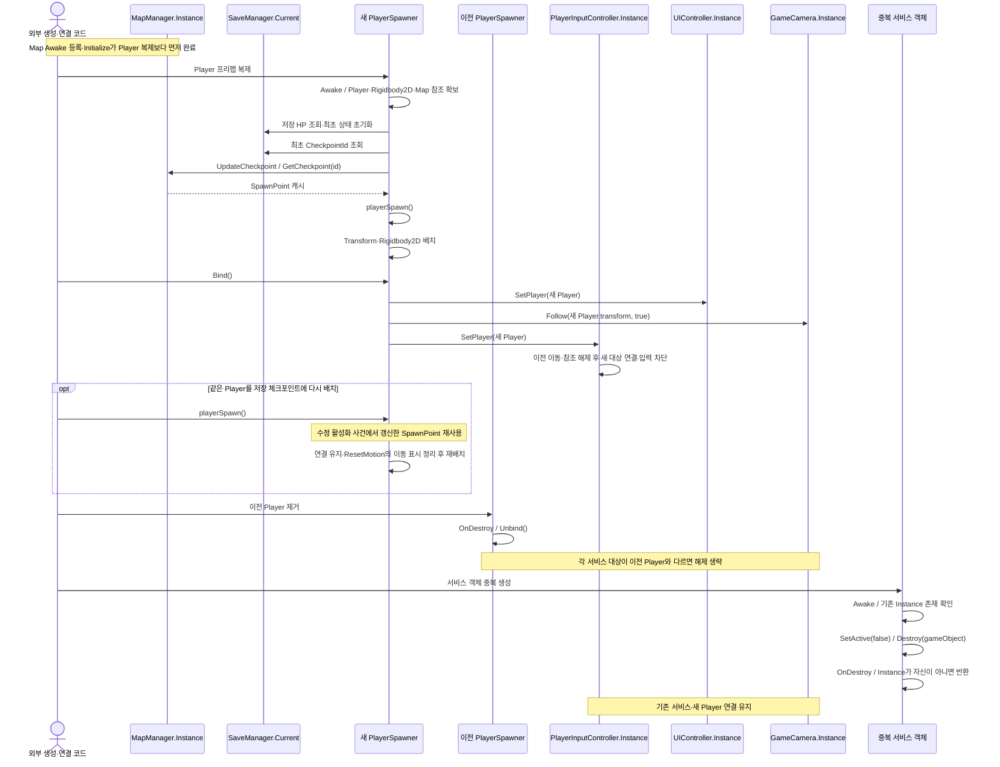
```mermaid
sequenceDiagram
    actor Caller as 외부 생성·연결 코드
    participant Map as MapManager.Instance
    participant Save as SaveManager.Current
    participant New as 새 PlayerSpawner
    participant Old as 이전 PlayerSpawner
    participant Input as PlayerInputController.Instance
    participant UI as UIController.Instance
    participant Camera as GameCamera.Instance
    participant Duplicate as 중복 서비스 객체
    Note over Caller,Map: Map Awake 등록·Initialize가 Player 복제보다 먼저 완료
    Caller->>New: Player 프리팹 복제
    New->>New: Awake / Player·Rigidbody2D·Map 참조 확보
    New->>Save: 저장 HP 조회·최초 상태 초기화
    New->>Save: 최초 CheckpointId 조회
    New->>Map: UpdateCheckpoint / GetCheckpoint(id)
    Map-->>New: SpawnPoint 캐시
    New->>New: playerSpawn()
    New->>New: Transform·Rigidbody2D 배치
    Caller->>New: Bind()
    New->>UI: SetPlayer(새 Player)
    New->>Camera: Follow(새 Player.transform, true)
    New->>Input: SetPlayer(새 Player)
    Input->>Input: 이전 이동·참조 해제 후 새 대상 연결·입력 차단
    opt 같은 Player를 저장 체크포인트에 다시 배치
        Caller->>New: playerSpawn()
        Note over New: 수정 활성화 사건에서 갱신한 SpawnPoint 재사용
        New->>New: 연결 유지·ResetMotion의 이동 표시 정리 후 재배치
    end
    Caller->>Old: 이전 Player 제거
    Old->>Old: OnDestroy / Unbind()
    Note over Old,Camera: 각 서비스 대상이 이전 Player와 다르면 해제 생략
    Caller->>Duplicate: 서비스 객체 중복 생성
    Duplicate->>Duplicate: Awake / 기존 Instance 존재 확인
    Duplicate->>Duplicate: SetActive(false) / Destroy(gameObject)
    Duplicate->>Duplicate: OnDestroy / Instance가 자신이 아니면 반환
    Note over Input,Camera: 기존 서비스·새 Player 연결 유지
```

F-P02 SequenceDiagram

**① Space 입력 → 이동 중/정지 중 방향 확정과 시작 허용**

Space 요청 시 이동 의도와 조준점으로 방향을 정하고 독립 Dash 자세를 고른다.

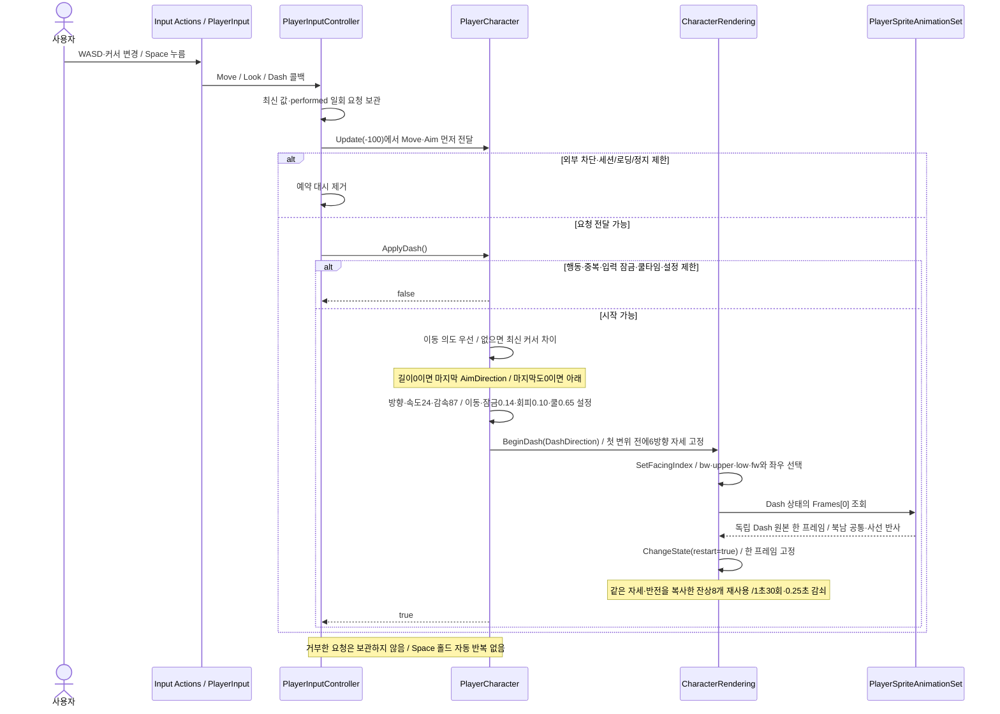
```mermaid
sequenceDiagram
    actor User as 사용자
    participant Actions as Input Actions / PlayerInput
    participant Input as PlayerInputController
    participant Player as PlayerCharacter
    participant Render as CharacterRendering
    participant Set as PlayerSpriteAnimationSet
    User->>Actions: WASD·커서 변경 / Space 누름
    Actions->>Input: Move / Look / Dash 콜백
    Input->>Input: 최신 값·performed 일회 요청 보관
    Input->>Player: Update(-100)에서 Move·Aim 먼저 전달
    alt 외부 차단·세션/로딩/정지 제한
        Input->>Input: 예약 대시 제거
    else 요청 전달 가능
        Input->>Player: ApplyDash()
        alt 행동·중복·입력 잠금·쿨타임·설정 제한
            Player-->>Input: false
        else 시작 가능
            Player->>Player: 이동 의도 우선 / 없으면 최신 커서 차이
            Note over Player: 길이0이면 마지막 AimDirection / 마지막도0이면 아래
            Player->>Player: 방향·속도24·감속87 / 이동·잠금0.14·회피0.10·쿨0.65 설정
            Player->>Render: BeginDash(DashDirection) / 첫 변위 전에6방향 자세 고정
            Render->>Render: SetFacingIndex / bw·upper·low·fw와 좌우 선택
            Render->>Set: Dash 상태의 Frames[0] 조회
            Set-->>Render: 독립 Dash 원본 한 프레임 / 북남 공통·사선 반사
            Render->>Render: ChangeState(restart=true) / 한 프레임 고정
            Note over Render: 같은 자세·반전을 복사한 잔상8개 재사용 /1초30회·0.25초 감쇠
            Player-->>Input: true
        end
    end
    Note over Input,Player: 거부한 요청은 보관하지 않음 / Space 홀드 자동 반복 없음
```

**② Character.Update → 대시 변위 계산·즉시 충돌 적용**

렌더 프레임의 게임 시간으로 감속 변위를 계산하고 벽·몸체 충돌을 즉시 반영한다.

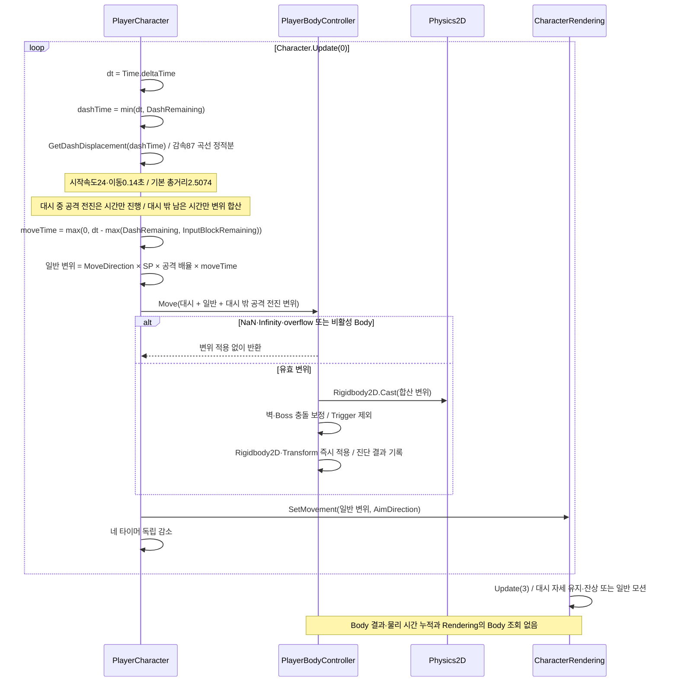
```mermaid
sequenceDiagram
    participant Player as PlayerCharacter
    participant Body as PlayerBodyController
    participant Physics as Physics2D
    participant Visual as CharacterRendering
    loop Character.Update(0)
        Player->>Player: dt = Time.deltaTime
        Player->>Player: dashTime = min(dt, DashRemaining)
        Player->>Player: GetDashDisplacement(dashTime) / 감속87 곡선 정적분
        Note over Player: 시작속도24·이동0.14초 / 기본 총거리2.5074
        Note over Player: 대시 중 공격 전진은 시간만 진행 / 대시 밖 남은 시간만 변위 합산
        Player->>Player: moveTime = max(0, dt - max(DashRemaining, InputBlockRemaining))
        Player->>Player: 일반 변위 = MoveDirection × SP × 공격 배율 × moveTime
        Player->>Body: Move(대시 + 일반 + 대시 밖 공격 전진 변위)
        alt NaN·Infinity·overflow 또는 비활성 Body
            Body-->>Player: 변위 적용 없이 반환
        else 유효 변위
            Body->>Physics: Rigidbody2D.Cast(합산 변위)
            Body->>Body: 벽·Boss 충돌 보정 / Trigger 제외
            Body->>Body: Rigidbody2D·Transform 즉시 적용 / 진단 결과 기록
        end
        Player->>Visual: SetMovement(일반 변위, AimDirection)
        Player->>Player: 네 타이머 독립 감소
    end
    Visual->>Visual: Update(3) / 대시 자세 유지·잔상 또는 일반 모션
    Note over Body,Visual: Body 결과·물리 시간 누적과 Rendering의 Body 조회 없음
```

**③ 키 유지·해제와 시간 경과 → 독립 타이머·일반 이동 복원·재사용**

이동·회피·입력 잠금·재사용 시간은 각각 만료된다.

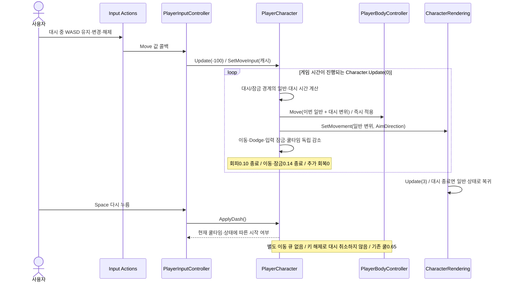
```mermaid
sequenceDiagram
    actor User as 사용자
    participant Actions as Input Actions
    participant Input as PlayerInputController
    participant Player as PlayerCharacter
    participant Body as PlayerBodyController
    participant Visual as CharacterRendering
    User->>Actions: 대시 중 WASD 유지·변경·해제
    Actions->>Input: Move 값 콜백
    Input->>Player: Update(-100) / SetMoveInput(캐시)
    loop 게임 시간이 진행되는 Character.Update(0)
        Player->>Player: 대시/잠금 경계의 일반·대시 시간 계산
        Player->>Body: Move(이번 일반 + 대시 변위) / 즉시 적용
        Player->>Visual: SetMovement(일반 변위, AimDirection)
        Player->>Player: 이동·Dodge·입력 잠금·쿨타임 독립 감소
        Note over Player: 회피0.10 종료 / 이동·잠금0.14 종료 / 추가 회복0
    end
    Visual->>Visual: Update(3) / 대시 종료면 일반 상태로 복귀
    User->>Input: Space 다시 누름
    Input->>Player: ApplyDash()
    Player-->>Input: 현재 쿨타임·상태에 따른 시작 여부
    Note over Player,Body: 별도 이동 큐 없음 / 키 해제로 대시 취소하지 않음 / 기존 쿨0.65
```

**④ 외부 차단·사망·컷씬·시간 정지·재배치 → 취소와 리셋**

사망·차단·재배치는 대시를 취소하고, 시간 정지는 진행 중인 타이머를 보존한다.

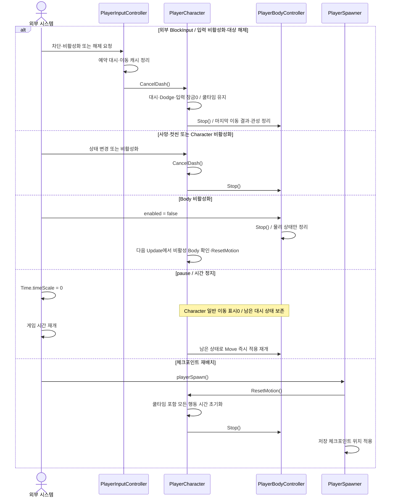
```mermaid
sequenceDiagram
    actor Caller as 외부 시스템
    participant Input as PlayerInputController
    participant Player as PlayerCharacter
    participant Body as PlayerBodyController
    participant Spawner as PlayerSpawner
    alt 외부 BlockInput / 입력 비활성화·대상 해제
        Caller->>Input: 차단·비활성화 또는 해제 요청
        Input->>Input: 예약 대시·이동 캐시 정리
        Input->>Player: CancelDash()
        Player->>Player: 대시·Dodge·입력 잠금0 / 쿨타임 유지
        Player->>Body: Stop() / 마지막 이동 결과·관성 정리
    else 사망·컷씬 또는 Character 비활성화
        Caller->>Player: 상태 변경 또는 비활성화
        Player->>Player: CancelDash()
        Player->>Body: Stop()
    else Body 비활성화
        Caller->>Body: enabled = false
        Body->>Body: Stop() / 물리 상태만 정리
        Player->>Player: 다음 Update에서 비활성 Body 확인·ResetMotion
    else pause / 시간 정지
        Caller->>Caller: Time.timeScale = 0
        Note over Player,Body: Character 일반 이동 표시0 / 남은 대시 상태 보존
        Caller->>Caller: 게임 시간 재개
        Player->>Body: 남은 상태로 Move 즉시 적용 재개
    else 체크포인트 재배치
        Caller->>Spawner: playerSpawn()
        Spawner->>Player: ResetMotion()
        Player->>Player: 쿨타임 포함 모든 행동 시간 초기화
        Player->>Body: Stop()
        Spawner->>Spawner: 저장 체크포인트 위치 적용
    end
```

F-P03 SequenceDiagram

**① 좌클릭 누름·해제 → 일회 눌림·홀드 전달과 공격 허용·방향 확정**

좌클릭 누름·홀드와 유효 조준 방향을 받아 같은 타격을 중복 시작하지 않는다.

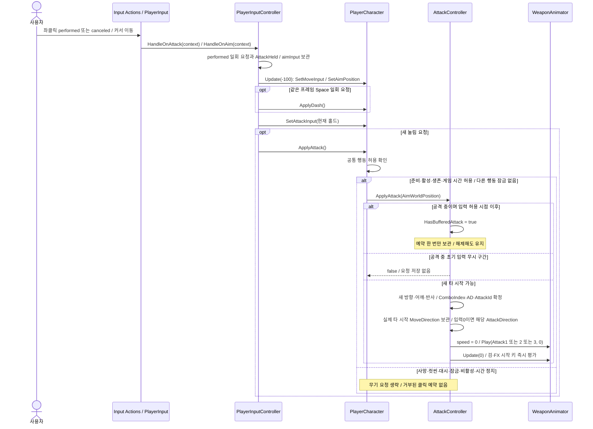
```mermaid
sequenceDiagram
    actor User as 사용자
    participant Actions as Input Actions / PlayerInput
    participant Input as PlayerInputController
    participant Player as PlayerCharacter
    participant Attack as AttackController
    participant Animator as WeaponAnimator
    User->>Actions: 좌클릭 performed 또는 canceled / 커서 이동
    Actions->>Input: HandleOnAttack(context) / HandleOnAim(context)
    Input->>Input: performed 일회 요청과 AttackHeld / aimInput 보관
    Input->>Player: Update(-100): SetMoveInput / SetAimPosition
    opt 같은 프레임 Space 일회 요청
        Input->>Player: ApplyDash()
    end
    Input->>Player: SetAttackInput(현재 홀드)
    opt 새 눌림 요청
        Input->>Player: ApplyAttack()
        Player->>Player: 공통 행동 허용 확인
        alt 준비·활성·생존·게임 시간 허용 / 다른 행동 잠금 없음
            Player->>Attack: ApplyAttack(AimWorldPosition)
            alt 공격 중이며 입력 허용 시점 이후
                Attack->>Attack: HasBufferedAttack = true
                Note over Attack: 예약 한 번만 보관 / 해제해도 유지
            else 공격 중 초기 입력 무시 구간
                Attack-->>Player: false / 요청 저장 없음
            else 새 타 시작 가능
                Attack->>Attack: 새 방향·어깨·반사 / ComboIndex·AD·AttackId 확정
            Attack->>Attack: 실제 타 시작 MoveDirection 보관 / 입력0이면 해당 AttackDirection
                Attack->>Animator: speed = 0 / Play(Attack1 또는 2 또는 3, 0)
                Attack->>Animator: Update(0) / 검·FX 시작 키 즉시 평가
            end
        else 사망·컷씬·대시·잠금·비활성·시간 정지
            Note over Player,Attack: 무기 요청 생략 / 거부된 클릭 예약 없음
        end
    end
```

**② 공격 중 이동·조준 변경 → 입력 이동 차단·강제 전진과 시작 방향 유지**

공격 도중 무기와 FX가 같은 AS 적용 클립을 따르고 몸체 프레임은 별도 재생한다.

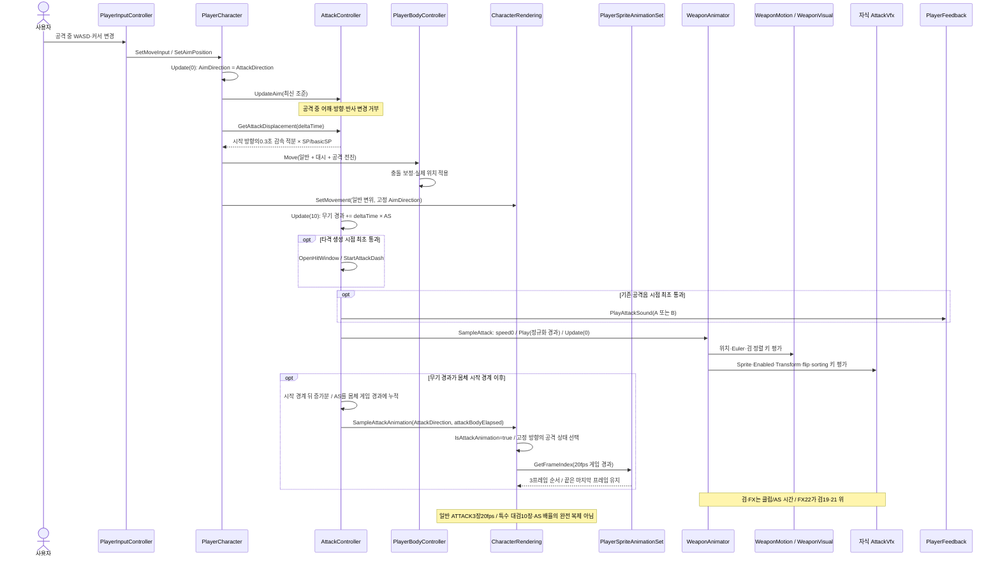
```mermaid
sequenceDiagram
    actor User as 사용자
    participant Input as PlayerInputController
    participant Player as PlayerCharacter
    participant Attack as AttackController
    participant Body as PlayerBodyController
    participant Visual as CharacterRendering
    participant Set as PlayerSpriteAnimationSet
    participant Animator as WeaponAnimator
    participant Motion as WeaponMotion / WeaponVisual
    participant Fx as 자식 AttackVfx
    participant Feedback as PlayerFeedback
    User->>Input: 공격 중 WASD·커서 변경
    Input->>Player: SetMoveInput / SetAimPosition
    Player->>Player: Update(0): AimDirection = AttackDirection
    Player->>Attack: UpdateAim(최신 조준)
    Note over Attack: 공격 중 어깨·방향·반사 변경 거부
    Player->>Attack: GetAttackDisplacement(deltaTime)
    Attack-->>Player: 시작 방향의0.3초 감속 적분 × SP/basicSP
    Player->>Body: Move(일반 + 대시 + 공격 전진)
    Body->>Body: 충돌 보정·실제 위치 적용
    Player->>Visual: SetMovement(일반 변위, 고정 AimDirection)
    Attack->>Attack: Update(10): 무기 경과 += deltaTime × AS
    opt 타격 생성 시점 최초 통과
        Attack->>Attack: OpenHitWindow / StartAttackDash
    end
    opt 기존 공격음 시점 최초 통과
        Attack->>Feedback: PlayAttackSound(A 또는 B)
    end
    Attack->>Animator: SampleAttack: speed0 / Play(정규화 경과) / Update(0)
    Animator->>Motion: 위치·Euler·검 정렬 키 평가
    Animator->>Fx: Sprite·Enabled·Transform·flip·sorting 키 평가
    opt 무기 경과가 몸체 시작 경계 이후
        Attack->>Attack: 시작 경계 뒤 증가분 / AS를 몸체 게임 경과에 누적
        Attack->>Visual: SampleAttackAnimation(AttackDirection, attackBodyElapsed)
        Visual->>Visual: IsAttackAnimation=true / 고정 방향의 공격 상태 선택
        Visual->>Set: GetFrameIndex(20fps 게임 경과)
        Set-->>Visual: 3프레임 순서 / 끝은 마지막 프레임 유지
    end
    Note over Animator,Fx: 검·FX는 클립/AS 시간 / FX22가 검19·21 위
    Note over Visual: 일반 ATTACK3장20fps / 특수 대검10장·AS 배율의 완전 복제 아님
```

**③ 판정 구간 도달 → 독립 수명·실제 Collider 조회·중복 방지·피해 적용**

타격 시점에 고정한 피해·방향·수신자 목록을 한 공격의 판정 수명 동안 유지한다.

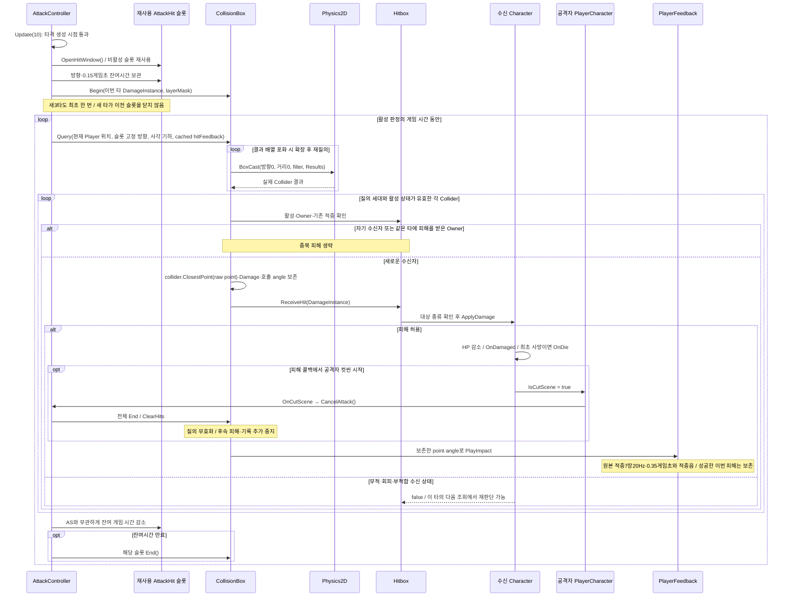
```mermaid
sequenceDiagram
    participant Attack as AttackController
    participant Hit as 재사용 AttackHit 슬롯
    participant HitQuery as CollisionBox
    participant Physics as Physics2D
    participant Hitbox
    participant Target as 수신 Character
    participant Player as 공격자 PlayerCharacter
    participant Feedback as PlayerFeedback
    Attack->>Attack: Update(10): 타격 생성 시점 통과
    Attack->>Hit: OpenHitWindow() / 비활성 슬롯 재사용
    Attack->>Hit: 방향·0.15게임초 잔여시간 보관
    Attack->>HitQuery: Begin(이번 타 DamageInstance, layerMask)
    Note over Attack,Hit: 새3타도 최초 한 번 / 새 타가 이전 슬롯을 닫지 않음
    loop 활성 판정의 게임 시간 동안
        Attack->>HitQuery: Query(현재 Player 위치, 슬롯 고정 방향, 사각 기하, cached hitFeedback)
        loop 결과 배열 포화 시 확장 후 재질의
            HitQuery->>Physics: BoxCast(방향0, 거리0, filter, Results)
            Physics-->>HitQuery: 실제 Collider 결과
        end
        loop 질의 세대와 활성 상태가 유효한 각 Collider
            HitQuery->>Hitbox: 활성·Owner·기존 적중 확인
            alt 자기 수신자 또는 같은 타에 피해를 받은 Owner
                Note over HitQuery,Hitbox: 중복 피해 생략
            else 새로운 수신자
                HitQuery->>HitQuery: collider.ClosestPoint(raw point)·Damage·호출 angle 보존
                HitQuery->>Hitbox: ReceiveHit(DamageInstance)
                Hitbox->>Target: 대상 종류 확인 후 ApplyDamage
                alt 피해 허용
                    Target->>Target: HP 감소 / OnDamaged / 최초 사망이면 OnDie
                    opt 피해 콜백에서 공격자 컷씬 시작
                        Target->>Player: IsCutScene = true
                        Player->>Attack: OnCutScene → CancelAttack()
                        Attack->>HitQuery: 전체 End / ClearHits
                        Note over HitQuery: 질의 무효화 / 후속 피해·기록 추가 중지
                    end
                    HitQuery->>Feedback: 보존한 point·angle로 PlayImpact
                    Note over Feedback: 원본 적중7장20Hz·0.35게임초와 적중음 / 성공한 이번 피해는 보존
                else 무적·회피·부적합 수신 상태
                    Target-->>Hitbox: false / 이 타의 다음 조회에서 재판단 가능
                end
            end
        end
        Attack->>Hit: AS와 무관하게 잔여 게임 시간 감소
        opt 잔여시간 만료
            Attack->>HitQuery: 해당 슬롯 End()
        end
    end
```

**④ 홀드·허용 클릭 예약·해제·시간 만료 →3콤보와 다음 공격**

허용 구간의 다음 클릭을 예약하거나 홀드 상태에서 연속 공격하고 시간이 지나면 콤보를 초기화한다.

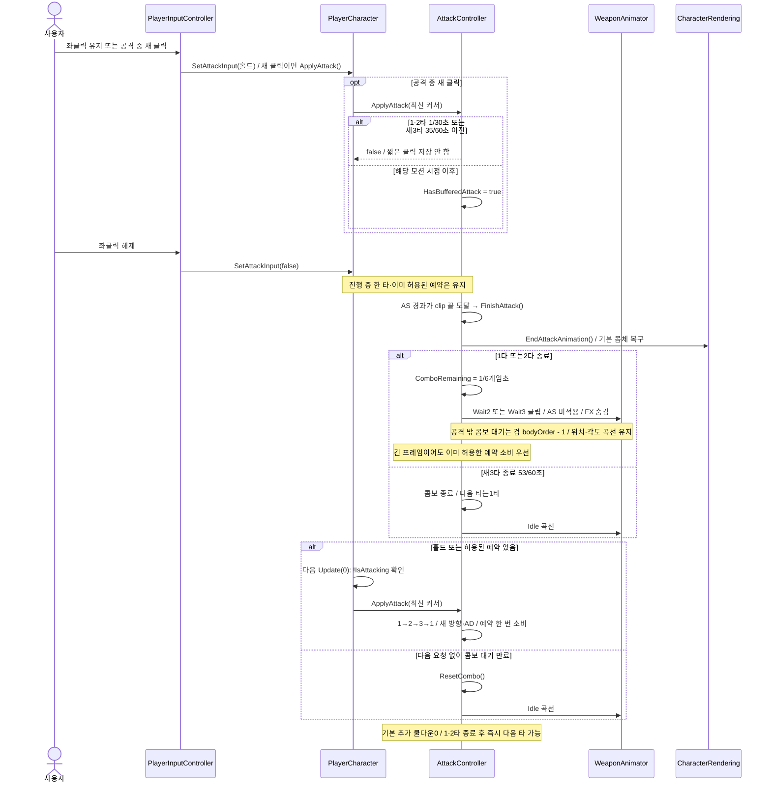
```mermaid
sequenceDiagram
    actor User as 사용자
    participant Input as PlayerInputController
    participant Player as PlayerCharacter
    participant Attack as AttackController
    participant Animator as WeaponAnimator
    participant Visual as CharacterRendering
    User->>Input: 좌클릭 유지 또는 공격 중 새 클릭
    Input->>Player: SetAttackInput(홀드) / 새 클릭이면 ApplyAttack()
    opt 공격 중 새 클릭
        Player->>Attack: ApplyAttack(최신 커서)
        alt 1·2타 1/30초 또는 새3타 35/60초 이전
            Attack-->>Player: false / 짧은 클릭 저장 안 함
        else 해당 모션 시점 이후
            Attack->>Attack: HasBufferedAttack = true
        end
    end
    User->>Input: 좌클릭 해제
    Input->>Player: SetAttackInput(false)
    Note over Player,Attack: 진행 중 한 타·이미 허용된 예약은 유지
    Attack->>Attack: AS 경과가 clip 끝 도달 → FinishAttack()
    Attack->>Visual: EndAttackAnimation() / 기본 몸체 복구
    alt 1타 또는2타 종료
        Attack->>Attack: ComboRemaining = 1/6게임초
        Attack->>Animator: Wait2 또는 Wait3 클립 / AS 비적용 / FX 숨김
        Note over Attack,Animator: 공격 밖 콤보 대기는 검 bodyOrder - 1 / 위치·각도 곡선 유지
        Note over Attack: 긴 프레임이어도 이미 허용한 예약 소비 우선
    else 새3타 종료 53/60초
        Attack->>Attack: 콤보 종료 / 다음 타는1타
        Attack->>Animator: Idle 곡선
    end
    alt 홀드 또는 허용된 예약 있음
        Player->>Player: 다음 Update(0): !IsAttacking 확인
        Player->>Attack: ApplyAttack(최신 커서)
        Attack->>Attack: 1→2→3→1 / 새 방향·AD / 예약 한 번 소비
    else 다음 요청 없이 콤보 대기 만료
        Attack->>Attack: ResetCombo()
        Attack->>Animator: Idle 곡선
    end
    Note over Attack: 기본 추가 쿨다운0 / 1·2타 종료 후 즉시 다음 타 가능
```

**⑤ 차단·사망·비활성화·시간 정지·재배치 → 중단 또는 상태 보존**

중단 경계에서 전진·판정·예약과 무기 표현을 정리한다.

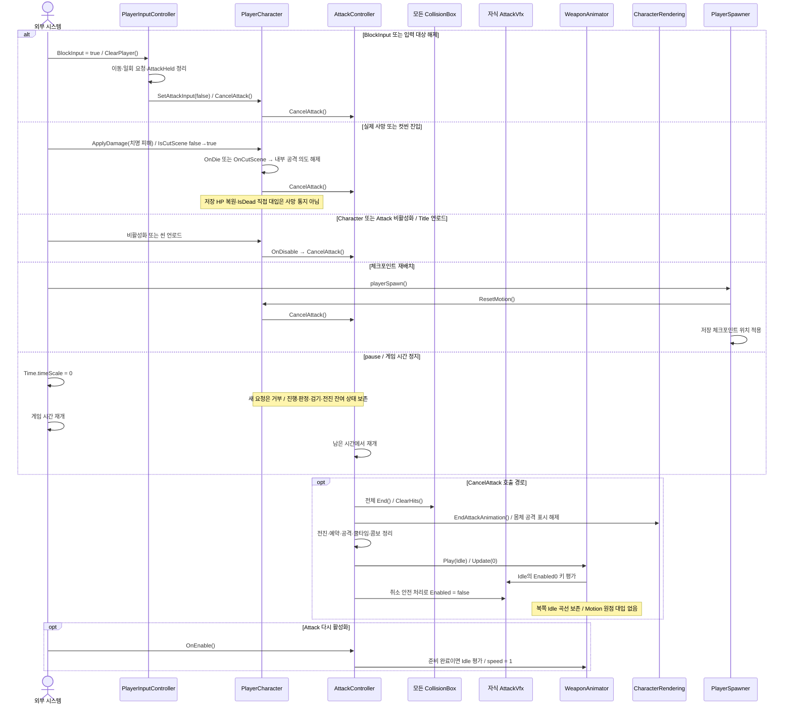
```mermaid
sequenceDiagram
    actor Caller as 외부 시스템
    participant Input as PlayerInputController
    participant Player as PlayerCharacter
    participant Attack as AttackController
    participant HitQuery as 모든 CollisionBox
    participant Fx as 자식 AttackVfx
    participant Animator as WeaponAnimator
    participant Visual as CharacterRendering
    participant Spawner as PlayerSpawner
    alt BlockInput 또는 입력 대상 해제
        Caller->>Input: BlockInput = true / ClearPlayer()
        Input->>Input: 이동·일회 요청·AttackHeld 정리
        Input->>Player: SetAttackInput(false) / CancelAttack()
        Player->>Attack: CancelAttack()
    else 실제 사망 또는 컷씬 진입
        Caller->>Player: ApplyDamage(치명 피해) / IsCutScene false→true
        Player->>Player: OnDie 또는 OnCutScene → 내부 공격 의도 해제
        Player->>Attack: CancelAttack()
        Note over Player: 저장 HP 복원·IsDead 직접 대입은 사망 통지 아님
    else Character 또는 Attack 비활성화 / Title 언로드
        Caller->>Player: 비활성화 또는 씬 언로드
        Player->>Attack: OnDisable → CancelAttack()
    else 체크포인트 재배치
        Caller->>Spawner: playerSpawn()
        Spawner->>Player: ResetMotion()
        Player->>Attack: CancelAttack()
        Spawner->>Spawner: 저장 체크포인트 위치 적용
    else pause / 게임 시간 정지
        Caller->>Caller: Time.timeScale = 0
        Note over Player,Attack: 새 요청은 거부 / 진행·판정·검기·전진 잔여 상태 보존
        Caller->>Caller: 게임 시간 재개
        Attack->>Attack: 남은 시간에서 재개
    end
    opt CancelAttack 호출 경로
        Attack->>HitQuery: 전체 End() / ClearHits()
        Attack->>Visual: EndAttackAnimation() / 몸체 공격 표시 해제
        Attack->>Attack: 전진·예약·공격·쿨타임·콤보 정리
        Attack->>Animator: Play(Idle) / Update(0)
        Animator->>Fx: Idle의 Enabled0 키 평가
        Attack->>Fx: 취소 안전 처리로 Enabled = false
        Note over Animator: 북쪽 Idle 곡선 보존 / Motion 원점 대입 없음
    end
    opt Attack 다시 활성화
        Caller->>Attack: OnEnable()
        Attack->>Animator: 준비 완료이면 Idle 평가 / speed = 1
    end
```

F-P04 SequenceDiagram

**① 일반 Shift → 공통 시작 허용·스킬 진입과 전용 맵 전환**

Shift가 들어오면 행동 가능 여부와 Draw 대기를 검사하고 전용 입력·화면·정지를 적용한다.

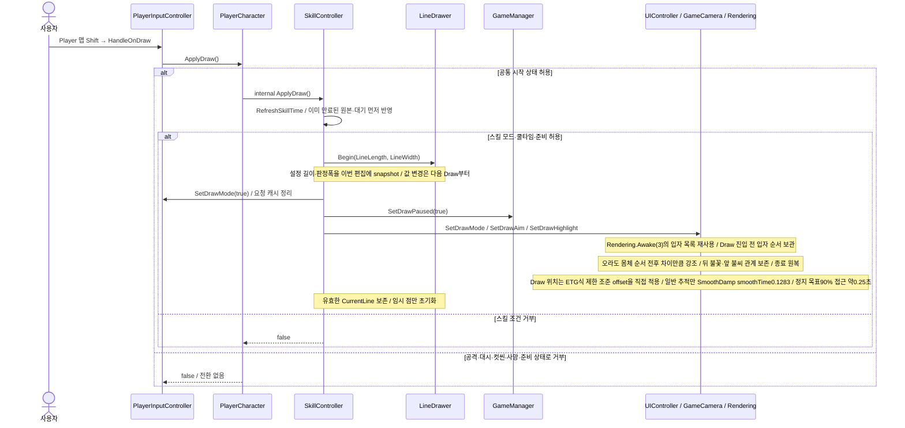
```mermaid
sequenceDiagram
    actor User as 사용자
    participant Input as PlayerInputController
    participant Player as PlayerCharacter
    participant Skill as SkillController
    participant Drawer as LineDrawer
    participant GM as GameManager
    participant View as UIController / GameCamera / Rendering
    User->>Input: Player 맵 Shift → HandleOnDraw
    Input->>Player: ApplyDraw()
    alt 공통 시작 상태 허용
        Player->>Skill: internal ApplyDraw()
        Skill->>Skill: RefreshSkillTime / 이미 만료된 원본·대기 먼저 반영
        alt 스킬 모드·쿨타임·준비 허용
            Skill->>Drawer: Begin(LineLength, LineWidth)
            Note over Skill,Drawer: 설정 길이·판정폭을 이번 편집에 snapshot / 값 변경은 다음 Draw부터
            Skill->>Input: SetDrawMode(true) / 요청 캐시 정리
            Skill->>GM: SetDrawPaused(true)
            Skill->>View: SetDrawMode / SetDrawAim / SetDrawHighlight
            Note over View: Rendering.Awake(3)의 입자 목록 재사용 / Draw 진입 전 입자 순서 보관
            Note over View: 오라도 몸체 순서 전후 차이만큼 강조 / 뒤 불꽃·앞 불씨 관계 보존 / 종료 원복
            Note over View: Draw 위치는 ETG식 제한 조준 offset을 직접 적용 / 일반 추적만 SmoothDamp smoothTime0.1283 / 정지 목표90% 접근 약0.25초
            Note over Skill,Drawer: 유효한 CurrentLine 보존 / 임시 점만 초기화
        else 스킬 조건 거부
            Skill-->>Player: false
        end
    else 공격·대시·컷씬·사망·준비 상태로 거부
        Player-->>Input: false / 전환 없음
    end
```

**② 정지 중 M1·커서·R·F → 임시 기하·표현과 확정 종료**

게임이 정지한 동안 마우스·R·F로 편집하고 확정 시 일반 입력으로 복귀한다.

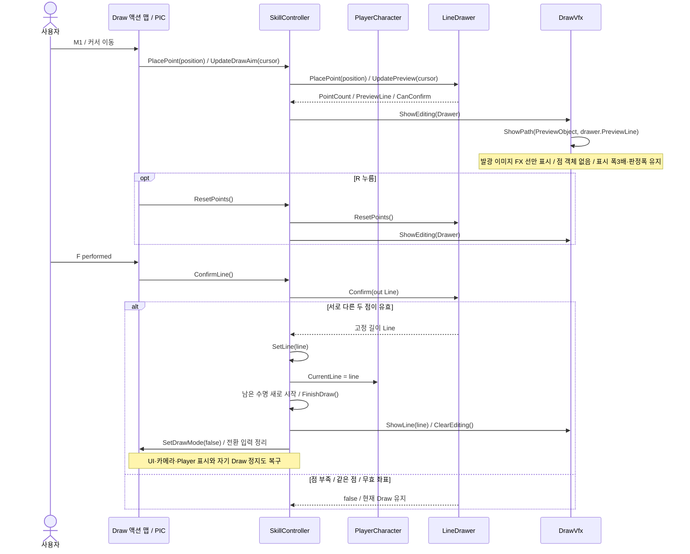
```mermaid
sequenceDiagram
    actor User as 사용자
    participant Input as Draw 액션 맵 / PIC
    participant Skill as SkillController
    participant Player as PlayerCharacter
    participant Drawer as LineDrawer
    participant Vfx as DrawVfx
    User->>Input: M1 / 커서 이동
    Input->>Skill: PlacePoint(position) / UpdateDrawAim(cursor)
    Skill->>Drawer: PlacePoint(position) / UpdatePreview(cursor)
    Drawer-->>Skill: PointCount / PreviewLine / CanConfirm
    Skill->>Vfx: ShowEditing(Drawer)
    Vfx->>Vfx: ShowPath(PreviewObject, drawer.PreviewLine)
    Note over Vfx: 발광 이미지 FX 선만 표시 / 점 객체 없음 / 표시 폭3배·판정폭 유지
    opt R 누름
        Input->>Skill: ResetPoints()
        Skill->>Drawer: ResetPoints()
        Skill->>Vfx: ShowEditing(Drawer)
    end
    User->>Input: F performed
    Input->>Skill: ConfirmLine()
    Skill->>Drawer: Confirm(out Line)
    alt 서로 다른 두 점이 유효
        Drawer-->>Skill: 고정 길이 Line
        Skill->>Skill: SetLine(line)
        Skill->>Player: CurrentLine = line
        Skill->>Skill: 남은 수명 새로 시작 / FinishDraw()
        Skill->>Vfx: ShowLine(line) / ClearEditing()
        Skill->>Input: SetDrawMode(false) / 전환 입력 정리
        Note over Skill,Input: UI·카메라·Player 표시와 자기 Draw 정지도 복구
    else 점 부족 / 같은 점 / 무효 좌표
        Drawer-->>Skill: false / 현재 Draw 유지
    end
```

**③ 기존 Line이 있는 재Draw·Shift 취소 → 임시 편집만 정리**

편집 중 Shift 취소는 기존 확정 선을 보존한다.

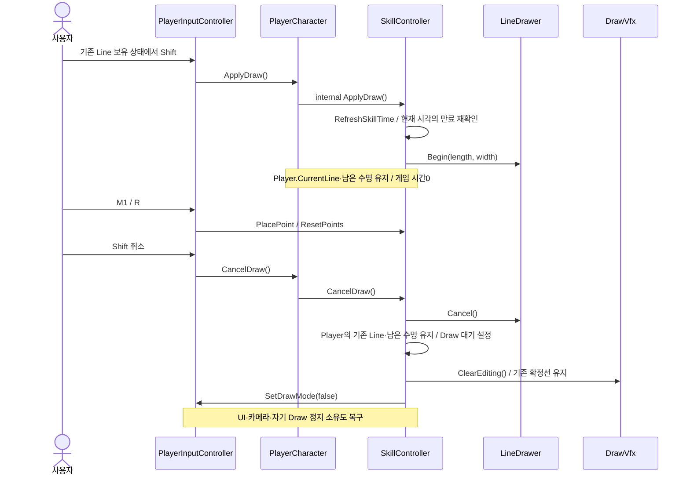
```mermaid
sequenceDiagram
    actor User as 사용자
    participant Input as PlayerInputController
    participant Player as PlayerCharacter
    participant Skill as SkillController
    participant Drawer as LineDrawer
    participant Vfx as DrawVfx
    User->>Input: 기존 Line 보유 상태에서 Shift
    Input->>Player: ApplyDraw()
    Player->>Skill: internal ApplyDraw()
    Skill->>Skill: RefreshSkillTime / 현재 시각의 만료 재확인
    Skill->>Drawer: Begin(length, width)
    Note over Player,Skill: Player.CurrentLine·남은 수명 유지 / 게임 시간0
    User->>Input: M1 / R
    Input->>Skill: PlacePoint / ResetPoints
    User->>Input: Shift 취소
    Input->>Player: CancelDraw()
    Player->>Skill: CancelDraw()
    Skill->>Drawer: Cancel()
    Skill->>Skill: Player의 기존 Line·남은 수명 유지 / Draw 대기 설정
    Skill->>Vfx: ClearEditing() / 기존 확정선 유지
    Skill->>Input: SetDrawMode(false)
    Note over Skill,Input: UI·카메라·자기 Draw 정지 소유도 복구
```

**④ 사망·컷씬·차단·비활성화 → 명시적 중단과 상태 복구**

차단·사망·비활성화 시 중단 원인에 맞춰 편집 상태와 입력을 정리한다.

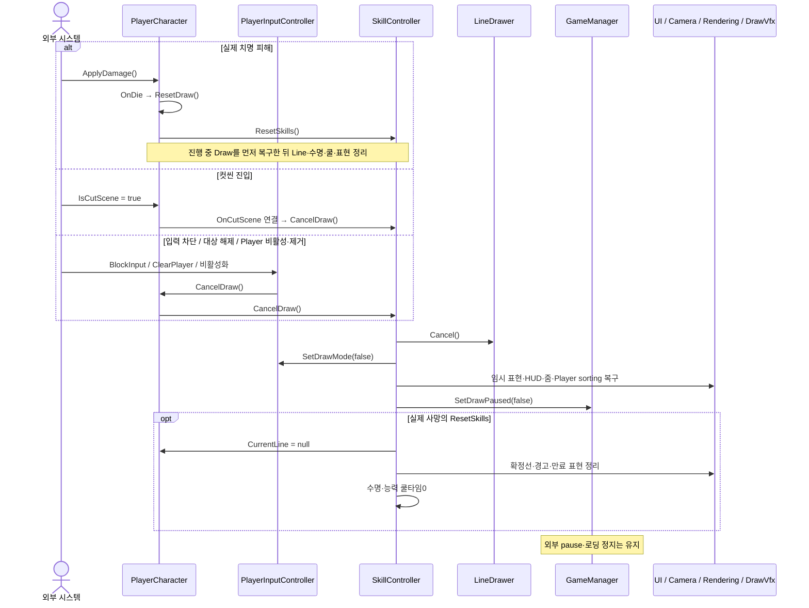
```mermaid
sequenceDiagram
    actor Caller as 외부 시스템
    participant Player as PlayerCharacter
    participant Input as PlayerInputController
    participant Skill as SkillController
    participant Drawer as LineDrawer
    participant GM as GameManager
    participant View as UI / Camera / Rendering / DrawVfx
    alt 실제 치명 피해
        Caller->>Player: ApplyDamage()
        Player->>Player: OnDie → ResetDraw()
        Player->>Skill: ResetSkills()
        Note over Player,Skill: 진행 중 Draw를 먼저 복구한 뒤 Line·수명·쿨·표현 정리
    else 컷씬 진입
        Caller->>Player: IsCutScene = true
        Player->>Skill: OnCutScene 연결 → CancelDraw()
    else 입력 차단 / 대상 해제 / Player 비활성·제거
        Caller->>Input: BlockInput / ClearPlayer / 비활성화
        Input->>Player: CancelDraw()
        Player->>Skill: CancelDraw()
    end
    Skill->>Drawer: Cancel()
    Skill->>Input: SetDrawMode(false)
    Skill->>View: 임시 표현·HUD·줌·Player sorting 복구
    Skill->>GM: SetDrawPaused(false)
    opt 실제 사망의 ResetSkills
        Skill->>Player: CurrentLine = null
        Skill->>View: 확정선·경고·만료 표현 정리
        Skill->>Skill: 수명·능력 쿨타임0
    end
    Note over GM: 외부 pause·로딩 정지는 유지
```

**⑤ 시간0의 커서·ETG식 제한 조준 카메라와 외부 pause 중첩 → 자기 소유만 복구**

조준 카메라는 실제 시간으로 반응하고 외부 정지와 Draw 정지는 독립적으로 해제한다.

```mermaid
sequenceDiagram
    actor User as 사용자
    actor Caller as 외부 시스템
    participant Input as PlayerInputController
    participant Skill as SkillController
    participant GM as GameManager
    participant Camera as GameCamera
    participant View as DrawVfx
    Note over GM: IsDrawPaused = true / 게임 시간0
    Note over Skill,View: 저장된 Line의 수명·경고 phase·만료 꼬리도 정지
    User->>Input: 화면 커서 이동 / Draw 전용 입력
    Input->>Input: UpdateAimPosition / 현재 Camera로 Player 평면 투영
    Input->>Skill: UpdateDrawAim(AimWorldPosition)
    Skill->>Skill: Drawer.UpdatePreview(position)
    Skill->>View: ShowEditing(Drawer)
    Skill->>Camera: SetDrawAim(true, position)
    Note over Camera: 최초 진입에서만 대상·줌 보관 / 전환 추적 속도0 / 무효 좌표 거부
    Camera->>Camera: LateUpdate / GetDrawOffset
    Note over Camera: Player 기준 변위 / X 종횡비 보정 / 축별 ±1.5h 제한
    Note over Camera: 거리1 deadzone / sqrt 가중0~0.33333 / 1/64 미만0
    Camera->>Camera: Player+offset 직접 배치 / Draw 위치 SmoothDamp 없음
    Camera->>Camera: unscaled 줌6.5 접근 / 줌 반영 뒤 ClampY
    Caller->>GM: SetGameplayPaused(true)
    Caller->>Skill: CancelDraw()
    Skill->>Camera: Restore / 원래 대상·줌·일반 추적 복구
    Skill->>GM: SetDrawPaused(false)
    Note over GM: 일반 pause가 남아 게임 시간0 유지
    Caller->>GM: SetGameplayPaused(false)
    GM->>GM: 모든 정지 소유가 해제되어 게임 시간 재개
```

F-P05 SequenceDiagram

**① 첫 클릭·커서 이동 → 시작점과 고정 길이 미리보기**

첫 점을 둔 뒤 커서 방향에 고정 길이의 선을 미리 표시한다.

```mermaid
sequenceDiagram
    actor User as 사용자
    participant Input as Draw 액션 맵 / PIC
    participant Skill as SkillController
    participant Drawer as LineDrawer
    participant Vfx as DrawVfx
    participant Unity as Unity 표현 갱신
    participant FX as DrawLineVfx
    User->>Input: M1 / Look
    Input->>Skill: PlacePoint(position) / UpdateDrawAim(cursor)
    Skill->>Drawer: PlacePoint / UpdatePreview
    alt 점0개에서 유효 첫 클릭
        Drawer->>Drawer: StartPoint 저장 / PointCount1
    else 한 점 이후 유효한 커서 방향
        Drawer->>Drawer: Begin의 길이·폭으로 PreviewLine 계산
    else 같은 점의 커서
        Drawer->>Drawer: PreviewLine 없음 / PointCount1 유지
    else 유한하지 않은 좌표
        Note over Drawer: 기존 점·미리보기 보존
    end
    Skill->>Vfx: ShowEditing(Drawer)
    Vfx->>Vfx: ShowPath(PreviewObject, drawer.PreviewLine)
    Note over Vfx: 논리 점 보존 / 발광 FX·표시3배 / Line.Length 메시·양끝 halo 유지
    Unity->>FX: OnEnable() / LateUpdate()
    FX->>FX: ApplyWidth()
    Note over FX: abs(lossyScale.y)×Max(0,WidthMultiplier) / 미리보기3배·Line.Width 원본 유지 / Slash HitWidth 별도
```

**② 두 번째 클릭 → 방향 고정·추가 클릭 무시**

둘째 유효 점이 방향을 고정한다. 같은 점과 이후 추가 입력은 무시한다.

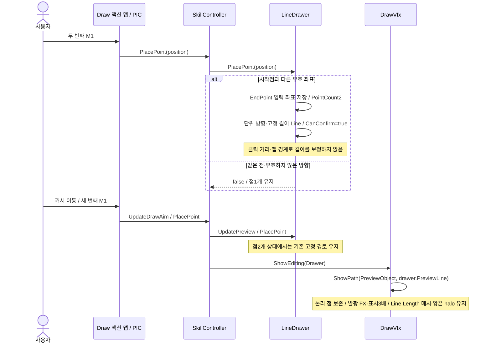
```mermaid
sequenceDiagram
    actor User as 사용자
    participant Input as Draw 액션 맵 / PIC
    participant Skill as SkillController
    participant Drawer as LineDrawer
    participant Vfx as DrawVfx
    User->>Input: 두 번째 M1
    Input->>Skill: PlacePoint(position)
    Skill->>Drawer: PlacePoint(position)
    alt 시작점과 다른 유효 좌표
        Drawer->>Drawer: EndPoint 입력 좌표 저장 / PointCount2
        Drawer->>Drawer: 단위 방향·고정 길이 Line / CanConfirm=true
        Note over Drawer: 클릭 거리·맵 경계로 길이를 보정하지 않음
    else 같은 점·유효하지 않은 방향
        Drawer-->>Skill: false / 점1개 유지
    end
    User->>Input: 커서 이동 / 세 번째 M1
    Input->>Skill: UpdateDrawAim / PlacePoint
    Skill->>Drawer: UpdatePreview / PlacePoint
    Note over Drawer: 점2개 상태에서는 기존 고정 경로 유지
    Skill->>Vfx: ShowEditing(Drawer)
    Vfx->>Vfx: ShowPath(PreviewObject, drawer.PreviewLine)
    Note over Vfx: 논리 점 보존 / 발광 FX·표시3배 / Line.Length 메시·양끝 halo 유지
```

**③ 미완 F·R → Draw와 기존 원본 보존**

R은 편집점만 지우고 두 점이 없는 F는 Draw를 계속한다.

```mermaid
sequenceDiagram
    actor User as 사용자
    participant Input as Draw 액션 맵 / PIC
    participant Skill as SkillController
    participant Drawer as LineDrawer
    participant Player as PlayerCharacter
    participant Vfx as DrawVfx
    User->>Input: 점0/1개에서 F
    Input->>Skill: ConfirmLine()
    Skill->>Drawer: Confirm(out Line)
    Drawer-->>Skill: false / Draw 유지
    User->>Input: 점0/1/2개에서 R
    Input->>Skill: ResetPoints()
    Skill->>Drawer: ResetPoints()
    Drawer->>Drawer: 점0개·미리보기 제거 / Draw 유지
    Skill->>Vfx: ShowEditing(Drawer)
    Note over Player,Skill: 기존 CurrentLine·남은 수명 유지
```

**④ 유효 F 확정·Shift 취소 → 저장 교체와 임시 폐기**

두 점을 확정할 때에만 Player의 선을 교체한다.

```mermaid
sequenceDiagram
    actor User as 사용자
    participant Input as Draw 액션 맵 / PIC
    participant Skill as SkillController
    participant Drawer as LineDrawer
    participant Player as PlayerCharacter
    participant Vfx as DrawVfx
    alt 유효한 두 점에서 F
        User->>Input: F performed
        Input->>Skill: ConfirmLine()
        Skill->>Drawer: Confirm(out Line)
        Drawer-->>Skill: Line 값 / 임시 편집 종료
        Skill->>Skill: SetLine(line)
        Skill->>Player: CurrentLine = line
        Skill->>Vfx: 새 Line·새 수명 표시
    else Shift 취소
        User->>Input: Shift performed
        Input->>Player: CancelDraw()
        Player->>Skill: CancelDraw()
        Skill->>Drawer: Cancel()
        Note over Player,Skill: 기존 Line·남은 수명 보존
    end
    Skill->>Input: FinishDraw / Player 맵 복귀
    Skill->>Vfx: 편집 미리보기 숨김 / 표시 점 없음
```

F-P06 SequenceDiagram

**① Draw F 확정 → Player 원본 저장과 수명 시작**

Player가 확정 선을 보유하고 SkillController가 게임 시각 기준 수명을 시작한다.

```mermaid
sequenceDiagram
    actor User as 사용자
    participant Input as Draw 액션 맵 / PIC
    participant Drawer as LineDrawer
    participant Skill as SkillController
    participant Player as PlayerCharacter
    participant Vfx as DrawVfx
    User->>Input: F performed
    Input->>Skill: ConfirmLine()
    Skill->>Drawer: Confirm(out Line)
    alt 두 점의 기하 유효
        Drawer-->>Skill: 확정 Line
        Skill->>Skill: SetLine(line)
        Skill->>Player: CurrentLine = line
        Skill->>Skill: 시작 총수명 snapshot / LineRemaining 초기화
        Skill->>Vfx: 이전 경고·만료 꼬리 정리 / 새 Line 표시
        Vfx->>Vfx: ShowLine(line) / ShowPath(LineObject, line, false)
        Note over Vfx: LifePhase0·LineOpacity1·이전 입자 Clear / 새 수명 표현 초기화
        Note over Player,Vfx: 저장·표시·후속 Slash는 같은 Line.Length / 표시 배율만3
        Skill->>Input: FinishDraw / Player 맵 복귀
        Note over Vfx: 중앙 발광 유지 / 양끝 둥근 흰 광원·바깥 cyan-blue halo / 고정 검은 외곽 없음
    else 무효 기하
        Drawer-->>Skill: false
        Note over Player,Skill: 기존 Line·남은 수명 유지
    end
```

**② 게임 시간 경과 → 남은 수명과 연속 알파 왕복 경고**

남은 게임 시간에 맞춰 만료 예고의 밝기와 주기를 조절한다.

```mermaid
sequenceDiagram
    participant Unity as 게임 갱신
    participant Player as PlayerCharacter
    participant Skill as SkillController
    participant Vfx as DrawVfx
    participant FX as DrawLineVfx
    participant Renderer as LineRenderer
    Unity->>Skill: Update / RefreshSkillTime()
    Skill->>Skill: Time.timeAsDouble 샘플 / 게임 경과시간 계산
    alt 비활성 또는 경과시간0
        Note over Skill,Vfx: 논리 수명·alpha 위상·입자 진행 없이 반환
    else 게임 시간 진행
        Skill->>Skill: Draw/Slash 쿨타임 진행
        Skill->>Vfx: TickVisuals(elapsed)
        Skill->>Player: CurrentLine 조회
        alt 확정 Line 존재
            Skill->>Skill: LineRemaining 감소
            alt 남은 수명0
                Skill->>Skill: ExpireLine / 자연 만료 Case④
            else 수명 남음
                Skill->>Vfx: UpdateLineLifetime(remaining, total, elapsed)
                alt 경고 비율 이전
                    Vfx->>Vfx: LineOpacity=1 / LifePhase=0
                else 후반 경고 구간
                    Vfx->>Vfx: BlinkInterval 단축 / LifePhase 진행
                    Vfx->>Vfx: cos 왕복 alpha0~1 / 경고 마지막12%는 원본으로 복귀
                end
                Vfx->>FX: SetOpacity(LineOpacity)
                FX->>Renderer: cached MaterialPropertyBlock의 _Opacity 전달
                Note over Vfx,Renderer: 객체 활성 유지 / 원본 PNG alpha×LineOpacity
            end
        else 원본 없음
            Note over Skill: 논리 수명 진행 없음
        end
    end
```

**③ 재Draw·pause·새 확정 → 보존·정지·수명 교체**

재편집 중 기존 선을 보관하고, 새 선을 확정할 때 수명을 다시 시작한다.

```mermaid
sequenceDiagram
    actor User as 사용자
    actor Caller as 외부 시간 시스템
    participant Input as PlayerInputController
    participant Skill as SkillController
    participant Player as PlayerCharacter
    participant GM as GameManager
    participant Vfx as DrawVfx
    User->>Input: 재Draw Shift
    Input->>Player: ApplyDraw()
    Player->>Skill: internal ApplyDraw()
    Skill->>Skill: RefreshSkillTime / Draw 전 만료 재확인
    Note over Player,Skill: 유효한 CurrentLine·남은 수명 보존
    Caller->>GM: Draw 또는 일반 pause 소유 추가
    GM->>GM: 게임 시간0
    Note over Skill: 공유 시각의 경과시간0이면 진행 없이 반환
    Note over Skill,Vfx: 논리 수명·alpha phase·입자 이동/수명 정지
    Caller->>GM: 정지 소유 해제
    Skill->>Skill: 보존한 수명에서 재개
    User->>Input: 새 F 확정
    Input->>Skill: ConfirmLine()
    Skill->>Player: CurrentLine 교체
    Skill->>Skill: 새 총수명·남은 수명 초기화
    Skill->>Vfx: 낡은 경고/만료 꼬리 정리 / 새 표현
```

**④ 자연 수명0 → 원본 제거·실제 빛 조각의 증발 이동**

자연 만료 시 원본을 비우고 선에서 분리된 입자가 사라진다.

```mermaid
sequenceDiagram
    participant Unity as 게임 갱신
    participant Skill as SkillController
    participant Player as PlayerCharacter
    participant Vfx as DrawVfx
    participant FX as DrawLineVfx
    participant Particles as DrawEvaporationVfx
    participant PS as ParticleSystem
    Unity->>Skill: Update / LineRemaining이0에 도달
    Skill->>Player: 마지막 CurrentLine 기하 조회
    Skill->>Skill: SetLine(null)
    Skill->>Player: CurrentLine = null
    Skill->>Vfx: ShowLine(null) / 이전 alpha·입자 정리
    Skill->>Skill: 짧은 Draw 대기
    Skill->>Vfx: PlayLineExpiration(line)
    Vfx->>FX: SetOpacity(1)
    Vfx->>Vfx: ShowPath(ExpiryObject, line, false)
    Vfx->>Particles: Play(line, expiryTotal)
    Particles->>PS: Emit(EmitParams, 1) / Pause(false)
    Note over Vfx,Particles: Setup에서 _LinePaletteTex에 LineVFX.mainTexture 연결 / RGB만 참조
    Note over Particles: 원형·PS직경0.045~0.085 유지 / 화면 외곽1px·AA0.5px / 기존 이동·크기 고정
    loop 소멸 시간이 남고 같은 게임 시간이 진행
        Skill->>Vfx: TickVisuals(deltaTime)
        Vfx->>Vfx: ExpiryProgress=1-remaining/total
        Vfx->>FX: SetOpacity(1-SmoothStep(progress/0.25))
        Vfx->>Particles: Tick(deltaTime)
        Particles->>PS: Simulate(deltaTime, false, false, false) / Pause(false)
        Note over Particles: world 위/양옆으로 퍼짐 / 입자 alpha로 소멸
        Vfx->>Particles: SetVisible(visible and IsExpiryPlaying)
    end
    Vfx->>Particles: Clear()
    Particles->>PS: Stop(false, StopEmittingAndClear) / Simulate(0) / Pause(false)
    Vfx->>Vfx: ExpiryObject 숨김
    Note over Player,Skill: 원본은 이미 null / 같은 자연 만료 중복 발행 없음
```

**⑤ 사망·명시적 제거·표현/능력 비활성화 → 원본과 표현 수명 구분**

사망과 명시적 제거, 표시 컴포넌트 비활성화의 수명 경계를 나눈다.

```mermaid
sequenceDiagram
    actor Caller as 외부 시스템
    participant Player as PlayerCharacter
    participant Skill as SkillController
    participant Vfx as DrawVfx
    alt 실제 사망 또는 명시적 Line 제거
        Caller->>Skill: ResetSkills() / SetLine(null)
        Skill->>Player: CurrentLine = null
        Skill->>Skill: 남은 수명·관련 상태 정리
        Skill->>Vfx: ClearLineEffects()
        Note over Vfx: phase·opacity 초기화 / Evaporation.Clear / 자연 증발을 새로 재생하지 않음
    else Skill 비활성화
        Caller->>Skill: 컴포넌트 비활성화
        Skill->>Vfx: 표현 숨김
        Note over Player,Skill: 원본·남은 수명 보존 / 논리 진행 정지
        Caller->>Skill: 재활성화
        Skill->>Vfx: 같은 수명 단계 복구
    else VFX만 비활성화
        Caller->>Vfx: 표현 비활성화
        Skill->>Skill: Player 원본의 논리 수명은 계속 진행
        Skill->>Vfx: 최신 비율·표현 상태 갱신 / 표시는 숨김
        Caller->>Vfx: 재활성화
        Vfx->>Vfx: OnEnable / 최신 LineOpacity·입자 표시 상태 복구
    end
```

**⑥ 소비 요청 → 같은 게임 시각의 만료 재확인·한 번 전달**

소비 직전 현재 게임 시각으로 만료를 확인하고 같은 선은 한 번만 넘긴다.

```mermaid
sequenceDiagram
    actor Caller as 후속 Line 소비자
    participant Skill as SkillController
    participant Player as PlayerCharacter
    participant Vfx as DrawVfx
    Caller->>Skill: ConsumeLine(out Line)
    Skill->>Skill: 현재 게임 시각까지 수명 갱신
    Note over Skill: Update와 같은 시각은 중복 차감하지 않음
    Skill->>Player: CurrentLine 확인
    alt 갱신 결과 이미 만료
        Skill->>Skill: 자연 만료 / 짧은 Draw 대기
        Skill->>Player: CurrentLine = null
        Skill->>Vfx: 같은 FX 조각의 자연 증발 재생
        Skill-->>Caller: false
    else 유효한 Line 존재
        Skill->>Skill: 반환할 기하 보관 / SetLine(null)
        Skill->>Player: CurrentLine = null
        Skill->>Vfx: 확정선·경고·꼬리 정리
        Skill->>Skill: 일반 Draw 대기 설정
        Skill-->>Caller: true / 한 번 전달한 Line
    else 원본 없음
        Skill-->>Caller: false
    end
    Note over Player,Skill: 반복 요청으로 같은 Line을 다시 소비하지 않음
    Note over Caller,Vfx: Slash 소비자는 반환 snapshot을 ShowSlashLine으로 시전 동안 별도 표시
```

F-P07 SequenceDiagram

⑦ 조정창은 폐기되어 현재 실행 경로가 없다.

**① Player F → 공통 허용·Line 1회 소모·Slash 전환**

F를 받으면 유효한 선을 소비하고 이번 Slash의 기하와 공격 ID를 고정한다.

```mermaid
sequenceDiagram
    actor User as 사용자
    participant Input as PlayerInputController
    participant Player as PlayerCharacter
    participant Skill as SkillController
    participant Slasher as LineSlasher
    participant GM as GameManager
    participant View as UI / GameCamera / Rendering / FX
    User->>Input: Player 맵 Slash F performed
    alt 수정 후보 있음
        Input->>Player: ApplyInteraction(InteractionTarget)
        Note over Input,Player: 거부해도 Slash 재전달 없음 / F-P10
    else 후보 없음
        Input->>Player: ApplySlash()
        alt 공통 행동 허용
            Player->>Skill: ApplySlash()
            Skill->>Skill: 자체 모드·Slash 대기·수치 / 현재 시각 갱신
            alt 유효한 저장 Line과 자체 조건
                Skill->>View: BeginSlashAnimation / 준비 실패면 소비 전 거부
                Skill->>Skill: ConsumeLine(out Line) / 긴 Draw 대기
                Skill->>Player: CurrentLine = null
                Skill->>View: DrawVfx.GetLineEffectWidth(Line)
                View-->>Skill: HitWidth = Line.Width × Max(1,표시 배율)
                Skill->>Slasher: Execute(Line snapshot, HitWidth, damage, mask)
                Skill->>View: DrawVfx.ShowSlashLine(snapshot) / 맵 선 알파1 유지
                Skill->>GM: Slash 전용 정지 소유 설정
                Skill->>View: HUD 숨김·암전·Player 중심 줌
                Skill->>Skill: 시간·배속·줌 목표 snapshot / FastZoom 시작
                Note over Player,View: CurrentLine은 공개 필드 / 카메라 일반 추적 기준0.5초
                Note over Player,Skill: Slash 전면 보호·행동 잠금 / 기존 무적 보존
            else Line 없음·만료·대기·수치 거부
                Skill-->>Player: false / Slash 시작 없음
            end
        else 공통 상태 거부
            Player-->>Input: false / Line 소비 없음
        end
    end
```

**② unscaled 빠른/느린 확대·발도·납도 → 지연 공간참 순간 한 번 판정·복구**

실제 시간 기준 줌·발도·납도 후 공간참 시점에 단 한 번 판정한다.

```mermaid
sequenceDiagram
    participant Unity as Unity 갱신
    participant Skill as SkillController
    participant Slasher as LineSlasher
    participant Query as CollisionBox
    participant Hitbox as Hitbox / 수신 대상
    participant GM as GameManager
    participant Camera as GameCamera
    participant Render as CharacterRendering
    participant FX as SlashPresentationFx / world pass
    participant View as UI / DrawVfx
    Unity->>Skill: Update / Time.unscaledTimeAsDouble
    Skill->>Skill: unscaled 실제 경과 × 시작 배속 / 단계 시각 샘플
    Note over GM: 게임 시간0 / 행동·탄환·버프·쿨 정지
    Note over Skill,View: CurrentLine은 이미 소비 / 이번 snapshot 선은 전 시전 구간 맵에 유지
    alt 빠른 확대 구간
        Skill->>Render: SetSlashDrawProgress(progress)
        Skill->>Camera: SetSlashZoom(빠른 곡선 / FastZoom 목표)
    else 느린 확대·발도 유지 / 기본0.7초
        Skill->>Render: HoldSlashAnimation()
        Skill->>Camera: SetSlashZoom(느린 곡선 / 최종 줌)
    else 칼날 빛·납도 구간
        Skill->>FX: 경계에서 PlayBladeGlint(칼날 중앙) 한 번
        Skill->>Render: 빛 동안 Hold / 뒤에 SetSlashSheatheProgress
        Skill->>Camera: 느린 확대 계속
    else 납도 닫힘·공간참 대기 / 기본0.5초
        Skill->>Render: 닫힘 progress1
        Skill->>FX: 경계에서 PlaySheathSound 한 번 / 탁
        Skill->>Camera: 복귀 곡선으로 진입 전 줌 / 기본0.18초
        Note over Skill,GM: 판정·전투시간·입력·HUD는 공간참까지 대기
    end
    alt 납도 뒤 지연 공간참 시점 도달
        Skill->>Slasher: ApplyHits(Player, Boss)
        Slasher->>Query: QuerySlash(center, (ActiveLine.Length, HitWidth), angle)
        Note over Slasher,Query: 시전 폭0.75 snapshot / Line.Width0.25 원본·길이/방향 유지
        Query->>Hitbox: 같은 AttackId의 피해·Slash 수신
        Note over Query,Hitbox: 벽 무관 / 수신자1회·고유 부위 별도 전달
        Skill->>Slasher: Complete() / HitWidth0·후속 질의 없음
        Skill->>View: ShowLine(CurrentLine) / 시전 snapshot 표시 종료
        Skill->>FX: EndPreparation / 준비 섬광 종료·납도음 꼬리 보존
        Skill->>Render: EndSlashAnimation / 별도 검 복구
        Skill->>Camera: SetSlashMode(false) / 원래 대상·줌
        Skill->>View: HUD·암전·입력 복구
        Skill->>GM: 자기 Slash 정지 해제
        Skill->>FX: PlaySpaceSlash(Line snapshot) / 절단음·노란 피해 경로
        FX->>Camera: 어긋난 월드의 Line 경로에 걸친 황금 검격 잔광 VFX / 검은 틈·막대 없음 / UI 제외
        Note over FX,View: 시전선 종료 / 검격 VFX만 unscaled 진행·레거시 막대 없음 / 전투 재개
    else 공간참 시점 전
        Note over Skill,Slasher: 실제 타격 대기 / 반복 피해 없음
    end
```

**③ 일반탄·금색탄 → 제거/반사·게이지·Fever**

일반탄은 제거하고 금색탄은 선의 법선에 반사해 날아간다. 게이지와 각성은 유효한 상호작용에만 적용한다.

```mermaid
sequenceDiagram
    participant Query as CollisionBox
    participant Projectile as Projectile
    participant Player as PlayerCharacter
    participant Boss as BossCharacter
    participant Buff as CharacterBuff
    participant Skill as SkillController
    participant Unity as 다음 프레임
    Query->>Query: angle에서 Line 접선(cos,sin) 한 번 계산
    Query->>Projectile: OnSlashed(Player, Boss, DamageInstance, lineDirection)
    alt 아직 처리하지 않은 일반탄
        Projectile->>Projectile: 판정·표시 종료
        Projectile->>Player: GroggyGain 전달
    else 아직 처리하지 않은 금색탄
        Projectile->>Projectile: Reflect(Boss, Player, lineDirection)
        Note over Projectile: 입사Direction을 Line 수직법선에 반사 / 위치·접촉gate 없음 / Player 무해
        Projectile->>Player: GroggyGain 전달
        Projectile->>Buff: ApplyFever() / 획득 수 예약
    else 이미 처리한 탄
        Note over Projectile,Player: 중복 반응·보상 없음
    end
    opt 반사된 금색탄의 이후 scaled 갱신
        Unity->>Projectile: UpdateReflection(dt) / 고정 Direction CircleCast
        alt 실제 Owner Boss Hitbox가 벽보다 앞
            Projectile->>Boss: Hitbox.ReceiveHit / Slash 피해1회
            Projectile->>Projectile: Despawn
        else 벽이 앞/동거리 또는 양수 수명 만료
            Projectile->>Projectile: Despawn
        else 빗나감
            Projectile->>Projectile: 같은 방향 직진 / Lifetime0 시간 만료 없음
        end
    end
    opt 게이지100 도달
        Player->>Boss: EnterGroggy()
        Player->>Player: 게이지0 소모
    end
    Unity->>Buff: 이전 프레임의 획득 예약 적용
    Buff->>Player: 기본 AD·AS·SP 배율 / 획득마다 Heal
    Buff->>Buff: 기간 갱신 / 동일 프레임 Remove 우선
    Buff->>Skill: RefreshDrawCooldown / 정상 길이 기준 반값 상한
```

**④ 같은 Slash의 여러 부위 → 피해 중복 방지·Boss 집계**

부위별 보고와 같은 수신자의 피해 중복 방지를 분리한다.

```mermaid
sequenceDiagram
    participant Slasher as LineSlasher
    participant Query as CollisionBox
    participant Hitbox as Hitbox
    participant Structure as BossStructure
    participant Boss as BossCharacter
    Slasher->>Query: QuerySlash(AttackId)
    loop 조회한 고유 피격 영역
        Query->>Hitbox: 대상·PartId 확인
        alt 독립 구조물
            Query->>Structure: HandleSlash(DamageInstance)
            Structure->>Boss: ReportSlashPart(AttackId, PartId)
            Structure->>Structure: 독립 HP에 피해1회
        else Boss 피격 영역
            Query->>Boss: ReportSlashPart(AttackId, PartId)
            opt 아직 피해를 받지 않은 수신자
                Query->>Hitbox: ReceiveHit(DamageInstance)
                Hitbox->>Boss: ApplyDamage(Slash)
                Boss->>Boss: 최종 피해 허용 / HP 반영
            end
        end
    end
    Query->>Boss: CompleteSlash(AttackId)
    Note over Boss: 고유 기믹·동시 타격 성공 판단은 Boss 책임
```

**⑤ 사망·외부 차단·비활성화 → 명시적 중단·잔류 판정 제거**

시전 중 중단되면 늦은 판정과 보상을 막고 소비한 선은 복원하지 않는다.

```mermaid
sequenceDiagram
    actor Caller as 외부 시스템
    participant Player as PlayerCharacter
    participant Input as PlayerInputController
    participant Skill as SkillController
    participant Slasher as LineSlasher
    participant Query as CollisionBox
    participant GM as GameManager
    participant View as UI / Camera / DrawVfx
    alt 실제 사망·외부 컷씬
        Caller->>Player: ApplyDamage / IsCutScene 진입
        Player->>Skill: 사건 연결 / ResetSkills 또는 CancelSlash
    else 외부 입력 차단
        Caller->>Input: BlockInput=true
        Input->>Input: StopInput()
        Input->>Player: CancelSlash()
        Player->>Skill: CancelSlash()
    else 재배치·Player/Skill 비활성화
        Caller->>Skill: 명시적 CancelSlash / OnDisable 정리
    end
    Skill->>Slasher: Complete() → Cancel()
    Slasher->>Query: End / 적중 기록 정리
    Note over Slasher,Query: 콜백 취소도 남은 대상 처리 즉시 중단
    Skill->>View: 시전 snapshot 종료·현재 원본 표시 / 발도·섬광·음원·공간참 취소·입력/HUD/줌 복구
    Skill->>GM: 자기 Slash 정지 해제
    Note over Player,Skill: 소모 Line 복원 없음 / 지연 판정·보상 없음
```

**⑥ 외부 pause·기존 무적 → 자기 소유만 해제**

종료·취소 시 시전 전의 외부 정지와 전면 무적을 보존한다.

```mermaid
sequenceDiagram
    actor Caller as 외부 시스템
    participant GM as GameManager
    participant Player as PlayerCharacter
    participant Skill as SkillController
    Note over Skill: 이미 시작한 Slash에 외부 pause가 겹치는 경우
    Caller->>GM: 일반 pause 설정
    Caller->>Player: 기존 전면 무적 설정
    Note over Player,Skill: Slash 실행 중이면 전면 보호는 기존 무적 OR Slash
    Skill->>Skill: unscaled 연출 완료 또는 취소
    Skill->>GM: Slash 정지 소유만 해제
    Note over GM: 일반 pause가 남아 게임 시간0 유지
    Note over Player: Slash 보호만 끝나고 기존 무적 유지
    Caller->>GM: 일반 pause 해제
    GM->>GM: 다른 정지 소유가 없으면 게임 시간 재개
```

F-P08 SequenceDiagram

**① 실제 HP 감소 → 보호 상태와 표시의 사건 구독**

HP가 실제 줄었을 때만 피해 사건을 보내 보호와 색 표시를 시작한다.

```mermaid
sequenceDiagram
    actor Attack as 외부 공격
    participant Hitbox as Hitbox
    participant Character as Character
    participant Player as PlayerCharacter
    participant View as CharacterRendering
    Attack->>Hitbox: ReceiveHit(DamageInstance)
    Hitbox->>Character: ApplyDamage(damage)
    alt 피해 허용 / HP 실제 감소
        Character->>Character: HP·IsDead·이 호출의 치명 여부 확정
        Character-->>Player: OnDamaged(damage)
        alt 생존 / 보호 길이 유효
            Player->>Player: 보호 종료 기한·시작 기간 갱신
            Player-->>View: 새 진입의 OnHitProtectionChanged(true)
            View->>View: 원본 tint/알파 한 번 보관 / 빨강 표시
        else 치명 피해
            Note over Player,View: 새 보호를 열지 않고 사망 Case⑤로 정리
        end
        Note over Character,View: 각 구독자가 자기 책임 처리 / 직접 렌더 호출 없음
    else 피해 거부
        Character-->>Hitbox: false
        Note over Player,View: 새 보호·피격 표시 없음
    end
```

**② 대시·피격 보호·전면 무적·효과 피해 → 최종 허용 구분**

대시 회피·피격 보호·전면 무적을 피해 출처에 맞게 검사한다.

```mermaid
sequenceDiagram
    actor Source as 외부 피해
    participant Character as Character
    participant Player as PlayerCharacter
    participant View as CharacterRendering
    Source->>Character: ApplyDamage(damage)
    alt 외부/Slash 전면 무적·컷씬·사망 또는 무효 피해
        Character-->>Source: false / 사건 없음
    else Hitbox 피해 + 대시 Dodge 또는 피격 보호
        Character-->>Source: false / 사건 없음
    else IsHitboxDamage=false 효과 또는 허용된 Hitbox 피해
        Character->>Character: HP 감소 확정
        Character-->>Player: OnDamaged(damage)
        Player->>Player: 종료 기한 재설정 / Elapsed0
        opt 새 보호 진입
            Player-->>View: OnHitProtectionChanged(true)
        end
        View->>Player: 현재 Elapsed 조회
        View->>View: 원본색 재캡처 없이 빨강 위상 시작
    end
```

**③ 게임 시간 경과 → 빨강/원본 전환·보호 만료**

보호의 게임 시간 경과로 빨강·원래 색을 교대하고 만료 때 복원한다.

```mermaid
sequenceDiagram
    participant Unity as Unity 게임 갱신
    participant Player as PlayerCharacter
    participant View as CharacterRendering
    Unity->>Player: Update / 현재 scaled 시각
    alt 보호 기한이 남음
        Unity->>View: LateUpdate()
        View->>Player: HitProtectionElapsed 조회
        View->>View: 0.08초 위상으로 빨강 또는 원본 tint
        Note over Player,View: 이동·공격·대시와 표시/보호 책임 분리
    else 보호 기한 만료
        Player->>Player: 보호 상태 종료
        Player-->>View: OnHitProtectionChanged(false)
        View->>View: 원본색·알파 복원
    end
```

**④ Draw/Slash/pause·Update 이전 피해 → 동일 시각 기준**

정지 중 보호는 진행하지 않으며 다음 피해 허용 여부는 현재 게임 시각에서 계산한다.

```mermaid
sequenceDiagram
    actor Caller as 외부 시스템
    participant GM as GameManager
    participant Player as PlayerCharacter
    participant Character as Character
    participant View as CharacterRendering
    Caller->>GM: Draw / Slash / 일반 pause 소유 설정
    GM->>GM: 게임 시각 정지
    View->>Player: 같은 Elapsed 조회
    Note over Player,View: 보호 남은 시간·색 위상 유지
    Caller->>GM: 정지 소유 해제
    GM->>GM: 다른 정지가 없으면 게임 시각 재개
    Caller->>Character: Player.Update보다 먼저 새 Hitbox 피해
    Character->>Player: 현재 IsHitProtected 조회
    alt 현재 시각이 이미 기한 이후
        Player-->>Character: false
        Character->>Character: 허용된 피해 적용 / OnDamaged
    else 아직 기한 이전
        Player-->>Character: true
        Character-->>Caller: 보호로 피해 거부
    end
```

**⑤ 치명 피해·비활성화·명시 초기화 → 보호/원본색 정리**

치명 피해·비활성화·재초기화 때 남은 표시를 정리한다.

```mermaid
sequenceDiagram
    actor Caller as 외부 시스템
    participant Character as Character
    participant Player as PlayerCharacter
    participant View as CharacterRendering
    alt 실제 치명 피해
        Caller->>Character: ApplyDamage()
        Character->>Character: HP0·IsDead / fatal snapshot
        Character-->>Player: OnDamaged()
        Character-->>Player: OnDie()
        Player->>Player: ResetHitProtection()
    else Player 비활성화·재배치/명시 초기화
        Caller->>Player: OnDisable / ResetMotion / ResetHitProtection
        Player->>Player: 보호 기한/상태 정리
    else 저장 HP 복원 또는 Heal
        Caller->>Character: InitializeHealth / Heal
        Note over Character,View: OnDamaged·새 보호·새 flash 없음
    end
    opt 기존 보호가 종료됨
        Player-->>View: OnHitProtectionChanged(false)
        View->>View: 원래 tint/알파 복원
    end
    Note over Character,Player: 피격·사망 알림이 Save를 직접 호출하지 않음
    Note over Character: 비치명 OnDamaged 안의 중첩 치명 피해도 각 호출의 snapshot으로 OnDie 중복 방지
```

**⑥ Rendering 비활성화·재활성화 → 표시 수명과 논리 보호 분리**

렌더러 재활성화 시 실제 보호 상태에 맞춰 표시를 복구한다.

```mermaid
sequenceDiagram
    actor Caller as 외부 시스템
    participant Player as PlayerCharacter
    participant View as CharacterRendering
    Caller->>View: 컴포넌트 비활성화
    View->>View: 원본색 복원 / 상태 사건 구독 해제
    Note over Player: 독립 보호 기한은 게임 시간으로 계속 진행
    Caller->>View: 재활성화
    View->>Player: OnHitProtectionChanged 구독
    View->>Player: 현재 보호 상태·Elapsed 조회
    alt 아직 보호 중
        View->>View: 현재 위상으로 빨강/원본 표시
    else 이미 만료
        View->>View: 원본색 유지
    end
    Note over Player,View: 매 프레임 객체 재검색·별도 보호 타이머 없음
```

F-P09 SequenceDiagram

**① 슬롯 진입 → 최초 저장 상태·입장/기상 준비 후 입력 허용**

최초 입장이나 저장 재개에 맞춰 지점·체력·입력 인계를 준비한다.

```mermaid
sequenceDiagram
    actor User as 사용자
    participant GM as GameManager
    participant Stage as StageManager
    participant Tutorial as TutorialController
    participant Map as MapManager
    participant Spawn as PlayerSpawner
    participant Render as CharacterRendering
    participant Player as PlayerCharacter
    participant AnimationSet as PlayerSpriteAnimationSet
    participant Input as PlayerInputController
    participant View as UI_Death / GameCamera
    User->>GM: StartGame(slot, newGame)
    GM->>Stage: Generate(selectedSave)
    Stage->>Map: 복제 / Initialize(save)
    Stage->>Player: Map 준비 후 복제
    Player->>Spawn: Awake()
    Spawn->>Player: InitializeHealth(saved PlayerHP)
    Spawn->>Map: GetCheckpoint(saved CheckpointId)
    Map-->>Spawn: SpawnPoint 캐시
    Spawn->>Spawn: playerSpawn()
    Stage->>Spawn: Bind() / Input·UI·Camera의 Player 연결
    Stage->>Tutorial: Prepare() / 미완 최초 입장만 화면 아래 배치·도착점 카메라 고정
    Note over Spawn,Tutorial: PlacePlayer(EntrySpawn)·별도 StopPoint는 저장 SpawnPoint를 바꾸지 않음
    Note over Tutorial,View: Bind가 연결한 이전 Player 초점 보관 / 숨은 위쪽 pose 준비
    Note over Spawn: Start에서 서비스 캐시 / 사건 구독 / IsReady
    Stage-->>GM: 세션·Spawner 준비 완료
    GM->>GM: Loading.Hide()
    alt Tutorial.HasPendingEntrance
        GM->>GM: IsLoading=false / 일반 pause 해제·입력 차단 유지
        Note over View: Stage가 Player HUD를 숨긴 상태 유지
        GM->>Tutorial: PlayEntrance()
        Tutorial->>Tutorial: 첫 빈 화면1프레임
        Tutorial->>Player: SetCutsceneMoveTarget(stopPoint)
        Note over Player,Render: 기존 Body.Move·SP·보행/실제 발소리 / F-S05 Case②
        Tutorial-->>GM: root 중앙 도착·완료 키 Set/Save 요청·이전 Player 추적/권한 복구
    else 기존 저장의 체크포인트 기상
        GM->>Spawn: PlayInitialSpawn()
        Spawn->>Input: 이전 차단 보관 / BlockInput=true
        Spawn->>GM: SetDeathPaused(true)
        Spawn->>View: 생성 표시·Player 초점
        Note over Player,Spawn: IsSpawning 전면 보호
        opt 최초 저장 HP0
            Spawn->>Player: Revive() / OnRevive 구독 처리
            Note over Spawn: 새 OnDie / DeathCount 증가 없음
        end
        Spawn->>Spawn: 콜백 이후 세대 번호·표시 소유 재확인
        Spawn->>Render: BeginLifecycleAnimation(false,SpawnDuration)
        Render->>AnimationSet: GetState(Spawn) / 프레임·개별 유지시간 조회
        AnimationSet-->>Render: StateData / 전체 길이 캐시
        Render->>Render: Update(3) / unscaled 경과를 지정 길이에 정규화해 프레임 선택
        Note over Spawn,View: Spawn6프레임·검 숨김 / MessageVisible=false
        Note over Spawn: 취소되지 않은 실행만 unscaled SpawnDuration 대기
        Spawn->>View: 자기 표시·초점 복구
        Spawn->>Render: EndLifecycleAnimation() / 검·Idle 복구
        Render->>AnimationSet: GetState(현재 방향 Idle)
        Render->>Render: 첫 프레임·반전 적용 / 일반 게임시간 재생 복귀
        Spawn->>GM: SetDeathPaused(false)
        Spawn-->>GM: 생성 표현 완료
    end
    GM->>GM: 같은 세션·Player 및 입장/기상 정상 완료 확인
    GM->>View: Player HUD 표시
    GM->>Input: 월드 준비 후 BlockInput=false
```

**② 치명 피해 → 사망 사건·횟수 저장·사망 표현**

치명 피해를 받은 Player가 사망을 한 번 알리고 사망 횟수와 표시를 갱신한다.

```mermaid
sequenceDiagram
    participant Hit as 피해 수신
    participant Base as Character
    participant Player as PlayerCharacter
    participant Buff as CharacterBuff
    participant Spawn as PlayerSpawner
    participant Render as CharacterRendering
    participant Save as SaveManager
    participant AnimationSet as PlayerSpriteAnimationSet
    participant Input as PlayerInputController
    participant GM as GameManager
    participant View as UI_Death / GameCamera
    participant Stage as StageManager
    Hit->>Base: ApplyDamage(damage)
    Base->>Base: HP / IsDead / 이번 치명 여부 확정
    Base-->>Player: OnDamaged(damage)
    Base-->>Player: OnDie
    Player->>Player: 자기 행동·Line·보호 정리
    Base-->>Buff: OnDie
    Buff->>Buff: RemoveAll()
    Base-->>Spawn: OnDie
    alt 연결된 Player의 최초 사망 실행
        Spawn->>Save: Current.DeathCount + 1 / Save()
        Save-->>Spawn: 저장 요청 반환
        Spawn->>Input: 기존 차단 보관 / BlockInput=true
        Spawn->>GM: SetDeathPaused(true)
        Spawn->>View: 텍스처 흑백 재질·암전·Player 강조 / 죽음 초점
        Spawn->>View: MessageVisible=false
        Spawn->>Render: BeginLifecycleAnimation(true,DeathAnimationDuration)
        Render->>AnimationSet: GetState(Death) / 프레임·개별 유지시간 조회
        AnimationSet-->>Render: StateData / 전체 길이 캐시
        Render->>Render: Update(3) / unscaled 경과로 프레임 선택·마지막 자세 유지
        Note over Spawn: unscaled1.42초 / 느린1~3·빠른4~6·엎드림 유지
        Spawn->>View: MessageVisible=true / Death 문구
        Note over Spawn: unscaled DeathDuration0.8초 대기
        Note over Render: 여기서 Idle로 복귀하지 않음 / ③의 Spawn 전환·종료 또는 ④의 취소에서 복구
    else 이미 진행 중이거나 세션 대상 아님
        Spawn-->>Spawn: 중복 실행·저장 없음
    end
    Base-->>Stage: 전투 중 구독한 OnDie
    Stage->>Stage: HandlePlayerDeath → 연출 취소·전투 구독 해제·Owner 위험물 정리
```

**③ 사망 표현 완료 → 전투 복구·같은 인스턴스 부활**

사망 연출 후 같은 Player와 생존 Boss를 재배치하고 다음 시도를 연다.

```mermaid
sequenceDiagram
    participant Spawn as PlayerSpawner
    participant Render as CharacterRendering
    participant Stage as StageManager
    participant AnimationSet as PlayerSpriteAnimationSet
    participant Boss as BossSpawner / BossCharacter
    participant Map as MapManager
    participant Base as Character
    participant Player as PlayerCharacter
    participant Buff as CharacterBuff
    participant View as UI_Death / GameCamera
    participant GM as GameManager
    participant Input as PlayerInputController
    Spawn->>Stage: ResetEncounter()
    Stage->>Stage: 연출/전투 종료·Owner 위험물 정리
    Stage->>Boss: 같은 전투 상태·HP·위치·부위·패턴 이력 복구
    Note over Boss: 처치된 Boss와 처치 기록 보존
    Stage->>Map: RestoreCheckpointDoors()
    Spawn->>Base: Revive()
    Base->>Base: maxHP / 기본 수치 / 생존 확정
    Base-->>Player: OnRevive
    Player->>Player: ResetForRevive()
    Base-->>Buff: OnRevive
    Buff->>Buff: RemoveAll()
    Base-->>Spawn: OnRevive
    Spawn->>Spawn: playerSpawn() / 캐시 SpawnPoint 적용
    Spawn->>Spawn: OnRevive 이후 세대 번호·presentationActive 확인
    alt 콜백에서 생명주기 취소됨
        Note over Spawn,View: 뒤늦은 기상 UI 재열림 없음
    else 같은 실행이 표시를 소유
        Spawn->>View: 기상 표시
        Spawn->>View: MessageVisible=false
        Spawn->>Render: BeginLifecycleAnimation(false,SpawnDuration)
        Render->>AnimationSet: GetState(Spawn) / Death 데이터에서 새 상태로 교체
        AnimationSet-->>Render: StateData / 개별 유지시간·전체 길이 캐시
        Render->>Render: unscaled 경과를 지정 길이에 정규화 / Spawn 프레임 선택
        Note over Spawn: unscaled SpawnDuration 대기
        Spawn->>Render: EndLifecycleAnimation() / 검·Idle 복구
        Render->>AnimationSet: GetState(현재 방향 Idle)
        Render->>Render: 첫 프레임·반전 적용 / 일반 게임시간 재생 복귀
        Spawn->>View: 원본 재질·강조·HUD·초점 복구
        Spawn->>GM: SetDeathPaused(false)
        Spawn->>Input: 진입 전 BlockInput 복구
    end
    Note over Player,Input: 같은 Player / Input·UI·Camera 연결 유지
```

**④ Title 복귀·비활성화 → 지연 실행 중단과 외부 정지 보존**

세션 이탈 시 코루틴·표시를 정리하고 기존 외부 정지는 유지한다.

```mermaid
sequenceDiagram
    actor User as 사용자 / Unity
    participant Stage as StageManager
    participant Spawn as PlayerSpawner
    participant Render as CharacterRendering
    participant View as UI_Death / GameCamera
    participant GM as GameManager
    participant Input as PlayerInputController
    User->>Stage: Title 복귀 / 세션 Clear
    Stage->>Stage: Boss 연출 취소·전투 구독 해제·Owner 위험물 정리
    Stage->>Spawn: Unbind() 또는 OnDisable
    Spawn->>Spawn: CancelLifecycle()
    Spawn->>Spawn: 세대 번호 변경 / 자기 코루틴 중단
    Spawn->>Render: EndLifecycleAnimation() / 검·Idle 복구
    Spawn->>View: 자기 표시·원본 재질·초점 복구
    Spawn->>GM: SetDeathPaused(false)
    GM->>GM: 일반 / Draw / Slash / Death OR 적용
    Spawn->>Input: 자기 대상일 때만 기존 차단 복구
    Stage->>Input: 세션 종료 차단·대상 해제
    Note over Spawn: 취소된 실행의 후속 Revive 없음
```

F-P10 SequenceDiagram

**① 수정 범위 진입·이탈 → 후보와 안내만 변경**

수정 영역에서 후보·안내를 갱신하며 접촉만으로 활성화하지 않는다.

```mermaid
sequenceDiagram
    actor Unity
    participant Crystal as CrystalCheckPoint
    participant Input as PlayerInputController
    participant UI as UIController
    Unity->>Crystal: OnTriggerEnter2D(playerCollider)
    Crystal->>Crystal: 접촉 HashSet 추가 / Player·활성 상태 확인
    Crystal->>Input: SetInteraction(this, true)
    Input-->>UI: OnInteractionChanged(target)
    UI->>UI: 현재 후보·IsInteractionVisible 갱신
    Crystal->>UI: LateUpdate에서 같은 후보·표시 허용 읽기
    Crystal->>Crystal: 미활성·미진행이면 F Sprite 표시
    Unity->>Crystal: OnTriggerExit2D(playerCollider)
    alt 다른 Player Collider 접촉이 남음
        Crystal->>Crystal: 현재 후보 유지
    else 마지막 접촉 종료
        Crystal->>Crystal: CancelActivation()
        Crystal->>Input: SetInteraction(this, false)
        Input-->>UI: OnInteractionChanged(null)
        Note over Crystal: 회복·저장·활성화 없음
    end
```

**② 공통 F → 후보 우선 요청·거부 시 Slash 누출 방지**

F는 수정 후보에 먼저 전달하고 거절되더라도 같은 입력으로 Slash를 쏘지 않는다.

```mermaid
sequenceDiagram
    actor User as 사용자
    participant Actions as Input Actions
    participant Input as PlayerInputController
    participant Player as PlayerCharacter
    participant Crystal as CrystalCheckPoint
    participant Skill as SkillController
    User->>Actions: F performed
    alt Draw 액션 맵
        Actions->>Input: HandleOnDrawConfirm()
        Input->>Player: Draw 확정 요청
    else Player 액션 맵
        Actions->>Input: HandleOnSlash()
        Input->>Input: 세션·UI·외부 입력 게이트
        alt InteractionTarget 있음
            Input->>Player: ApplyInteraction(target)
            Player->>Player: 공통 시작 상태 확인
            alt 허용
                Player->>Crystal: activateCheckPoint(this)
                Crystal-->>Player: 지연 실행 시작 여부
                Player->>Player: 완료 구독 / 이동 정리 / 진행 상태 통지
            else 공통 상태 또는 수정 조건 거부
                Player-->>Input: false / 요청 종료
                Note over Input: 같은 F를 Slash로 전달하지 않음
            end
        else 후보 없음
            Input->>Player: ApplySlash()
            Player->>Skill: Slash 자체 조건 요청
        end
    end
```

**③ 연출 완료 → 회복·데이터 저장 요청·문과 배치 갱신**

상호작용 완료 때 회복과 저장을 요청하고 문과 배치 상태를 갱신한다.

```mermaid
sequenceDiagram
    participant Player as PlayerCharacter
    participant Crystal as CrystalCheckPoint
    participant Save as SaveManager
    participant Map as MapManager
    participant Spawn as PlayerSpawner
    participant UI as UIController
    participant Door as MapDoor
    participant Animator as 문 Animator
    Player->>Crystal: activateCheckPoint(player)
    Crystal->>Crystal: IsActivating=true / unscaled 대기
    Crystal-->>Player: 시작 true
    Note over Player: IsInteracting / 전면 보호 / 다른 행동 잠금
    Note over Crystal: 최소 한 프레임 + ActivationDuration 완료
    Crystal->>Crystal: Player·실제 범위 재확인 / IsActivated=true
    Crystal->>Crystal: CrystalAnimator.Active=true / F Sprite 숨김
    Crystal->>Player: Heal(maxHP) / Groggy=0
    Crystal->>Save: Current.Set(ActivatedCheckpoints, CheckpointId, PlayerHP)
    Crystal->>Save: Save()
    Save-->>Crystal: 요청 반환 / 디스크 처리는 내부
    Crystal->>Crystal: IsActivating=false / Trigger·후보 정리
    Crystal-->>Map: OnActivated(this)
    Map->>Spawn: UpdateCheckpoint(CheckpointId)
    Spawn->>Map: GetCheckpoint(id)
    Map-->>Spawn: 새 SpawnPoint 캐시
    Map->>Map: SetEntryDoorOpen(BossId, true) / 자기 구독 해제
    Map->>Door: 캐시 EntryMotion.SetOpen(true)
    Door->>Door: WantsOpen=true / Collider 차단 유지
    Door->>Animator: Play(opening)
    Crystal-->>Player: OnActivationFinished(this)
    Player->>Player: activeInteraction / 자기 구독 정리
    Note over Door,Animator: 문이 열리는 동안 Player 통과 불가
    Animator-->>Door: LateUpdate에서 open 상태·전이 없음 확인
    Door->>Door: IsOpen=true / Blocker.enabled=false
```

**④ 지연 중 차단·사망·이탈 → 취소·자기 보호 복구**

대기 중 차단·사망·이탈이면 미완료 처리하고 자신이 건 보호만 해제한다.

```mermaid
sequenceDiagram
    actor External as 외부 상태 / Unity
    participant Player as PlayerCharacter
    participant Crystal as CrystalCheckPoint
    participant UI as UIController
    External->>Player: OnDie / OnCutScene / BlockInput / ResetMotion
    Player->>Player: CancelInteraction()
    Player->>Crystal: CancelActivation()
    Crystal->>Crystal: 대기 중단 / IsActivating=false
    Crystal-->>Player: OnActivationFinished(this)
    Player->>Player: 자기 진행 상태·구독 정리
    Note over Crystal: HP·이력·Save·입구 변경 없음
    External->>Crystal: 이미 활성 / 중복 / 범위 밖 요청
    Crystal-->>External: false
    Note over Player: 기존 외부 무적·다른 소유 상태 유지
```

**⑤ 저장 재로드·재도전 → 활성 수정·문·캐시 재구성**

재로드와 재도전 때 저장된 수정·문의 상태를 복원한다.

```mermaid
sequenceDiagram
    participant Stage as StageManager
    participant Map as MapManager
    participant Save as SaveData
    participant Crystal as CrystalCheckPoint
    participant Spawn as PlayerSpawner
    Stage->>Map: Initialize(save)
    alt ActivatedCheckpoints key 없음
        Map->>Save: 기존 CheckpointId를 목록에 메모리 이관
        Note over Save: 이관만으로 Save 요청하지 않음
    end
    Map->>Crystal: Initialize(map, save)
    Crystal->>Save: 활성 이력 조회
    Crystal->>Crystal: CrystalAnimator.Active=저장 이력
    alt 이미 활성
        Crystal->>Crystal: Trigger·후보 제거
    else 미활성
        alt Trigger 있음
            Map->>Crystal: OnActivated 자기 구독
        else Trigger 누락
            break 월드 생성 중단
                Crystal-->>Map: 초기화 오류
                Map-->>Stage: 기존 실패 복구 경로로 전달
            end
        end
    end
    Map->>Map: RestoreCheckpointDoors()
    Note over Map: 처치 Boss의 양쪽 문 / 활성 수정의 입구를 MapDoor.SetOpen(open,true)로 즉시 복구
    Stage->>Spawn: Player 복제 / Awake()
    Spawn->>Map: 저장 CheckpointId 위치 조회·캐시
    Stage->>Map: BindPlayer(spawner)
    Note over Spawn: 수정 OnActivated에서만 새 캐시로 갱신
    Stage->>Map: 재도전 RestoreCheckpointDoors()
    Spawn->>Spawn: playerSpawn() / SpawnPoint 재사용
```

F-P11 SequenceDiagram

**① 효과 요청 → 다음 프레임 적용·획득별 회복**

효과 적용 요청을 모아 다음 프레임에 적용하고 유효한 각성 획득마다 회복한다.

```mermaid
sequenceDiagram
    actor Caller as 외부 효과 요청자
    participant Character as Character
    participant Effects as CharacterBuff
    participant Unity as 다음 프레임
    participant Skill as SkillController
    participant Aura as FeverAuraFx
    Caller->>Character: ApplyBuff(Fever / Slow)
    Character->>Effects: Apply(type)
    Effects->>Effects: 획득 수 또는 적용 예약
    Note over Character,Effects: Has는 아직 적용되지 않은 예약과 구분
    Unity->>Effects: Update / 이전 프레임 예약 처리
    Effects->>Effects: 기간 갱신 / 기본 수치에 한 번 합성
    opt Fever 획득
        Effects->>Skill: RefreshDrawCooldown()
        opt 실제 false에서 true로 진입
            Effects-->>Aura: OnFeverChanged(true)
            Aura->>Aura: SetAura(true) / 자기 입자 Play
        end
        loop 획득 수
            Effects->>Character: Heal(획득별 회복량)
        end
        Note over Skill: 기본 대기 길이 기준 cap / 반복 반감 없음
    end
```

**② Fever·Slow 공존·재적용·만료 → 남은 효과 보존**

각성·슬로우는 독립적으로 갱신하고 제거돼도 남은 효과를 재계산한다.

```mermaid
sequenceDiagram
    actor Caller as 외부 효과 요청자
    participant Effects as CharacterBuff
    participant Character as Character
    participant Aura as FeverAuraFx
    Caller->>Effects: Apply(Slow) / ApplyFever()
    Effects->>Effects: 다음 프레임에 각 효과 적용
    Effects->>Character: SP = 기본SP × Fever × Slow
    Effects->>Character: AD / AS = 기본값 × Fever
    Caller->>Effects: 같은 효과 재적용
    Effects->>Effects: 기간 갱신 / 배율 중첩 없음
    alt Slow만 만료 또는 제거
        Effects->>Effects: Slow/예약 해제
        Effects->>Character: Fever를 유지한 SP/AD/AS 합성
    else Fever만 만료 또는 제거
        Effects->>Effects: Fever/예약 해제
        Effects->>Character: Slow SP 유지 / 기본 AD·AS
        Effects-->>Aura: 실제 해제면 OnFeverChanged(false)
        Aura->>Aura: 자기 입자 StopEmittingAndClear
    end
```

**③ 같은 프레임 Remove·ClearDebuffs → 제거 우선·유익 효과 보존**

같은 프레임에는 제거 요청을 우선하고 디버프 정리는 유익 효과를 보존한다.

```mermaid
sequenceDiagram
    actor Caller as 외부 시스템
    participant Effects as CharacterBuff
    participant Character as Character
    Caller->>Effects: Apply(type)
    Caller->>Effects: Remove(type)
    Effects->>Effects: 적용 상태·예약 제거 / 이번 프레임 제거 기록
    Caller->>Effects: 같은 프레임 Apply(type)
    Effects-->>Caller: false / 제거 우선
    Caller->>Effects: ClearDebuffs()
    Effects->>Effects: Slow·Groggy와 예약만 제거
    Effects->>Character: 남은 Fever 기준 수치 유지
```

**④ 시간 정지·사망·부활 → 수명 보존과 전체 정리**

시간 정지는 남은 수명을 보존하고 사망·부활은 기본 상태를 회복한다.

```mermaid
sequenceDiagram
    actor Caller as 외부 시스템
    participant GM as GameManager
    participant Character as Character
    participant Effects as CharacterBuff
    participant Aura as FeverAuraFx
    Caller->>GM: Draw / Slash / Death / BossCutscene / 일반 pause 설정
    Note over Effects,Aura: 게임 시간0 / 효과 기간·scaled 오라 입자 함께 정지
    Caller->>Character: 치명 피해 또는 Revive()
    Character-->>Effects: OnDie / OnRevive
    Effects->>Effects: RemoveAll() / 예약·효과 제거
    Effects->>Character: 기본 AD·AS·SP 복귀
    opt 실제 Fever가 해제됨
        Effects-->>Aura: OnFeverChanged(false)
        Aura->>Aura: 자기 입자 StopEmittingAndClear
    end
    Note over Character,Effects: Character는 효과 내부를 직접 조작하지 않음
```

**⑤ 일반 그로기 효과·게이지100 → Boss 원본 위임**

그로기는 현재 Boss가 소유하며 게이지 100에서 즉시 위임한다.

```mermaid
sequenceDiagram
    actor Caller as 외부 요청자
    participant Effects as Boss의 CharacterBuff
    participant Player as PlayerCharacter
    participant Boss as BossCharacter
    participant Pattern as 현재 BossPattern
    alt 일반 효과 API
        Caller->>Effects: Apply(Groggy)
        Effects->>Boss: 다음 프레임 EnterGroggy()
    else Player 게이지100
        Caller->>Player: AddGroggy()
        Player->>Player: 상한100 도달 / 게이지0 소모
        Player->>Boss: 즉시 EnterGroggy()
    end
    Boss->>Boss: 자기 기간 설정 또는 갱신
    Boss->>Pattern: CurrentPattern 참조를 먼저 비우고 Cancel
    Caller->>Effects: Has(Groggy) 조회
    Effects->>Boss: IsGroggy 조회
    Caller->>Boss: GroggyRemaining 조회
    Note over Boss,Effects: 타이머 중복 없음 / 이미 발사된 탄 정리 없음
```

**⑥ Player 준비·각성 전환 → 몸에서 상승하는 황금 오라와 표시 정리**

버프 사건을 구독한 입자 효과가 황금 오라를 켜고 종료 때 정리한다.

```mermaid
sequenceDiagram
    actor Caller as 생성·효과 요청자
    participant Unity
    participant Character as PlayerCharacter
    participant Buff as CharacterBuff
    participant Aura as FeverAuraFx
    participant View as CharacterRendering
    participant Fx as 자기 ParticleSystem들
    Caller->>Unity: Player 프리팹 생성
    Unity->>View: Awake(3): 자식 입자 Renderer 목록·순서 보관 배열 캐시
    Unity->>Buff: Awake(30): 자기 대상 준비
    Unity->>Aura: Awake(40): Buff 한 번 캐시·Emitters 검사
    Unity->>Aura: OnEnable()
    Aura->>Buff: OnFeverChanged 구독 / IsFever 한 번 동기화
    Aura->>Aura: SetAura(현재 상태)
    Caller->>Character: ApplyBuff(Fever)
    Character->>Buff: Apply(Fever) / 다음 프레임 예약
    Buff->>Buff: Update(30): IsFever·기간·스탯·Draw대기 갱신
    opt 실제 false에서 true로 진입
        Buff-->>Aura: OnFeverChanged(true)
        Aura->>Fx: Play(false)
    end
    Note over Aura,Fx: local simulation·scaled loop / 별도 Aura.Update 없음
    Note over View,Fx: Draw 강조는 몸체와 같은 순서 차이 적용·복원 / 뒤 불꽃·앞 불씨 관계 유지
    opt 각성 중 재획득
        Caller->>Character: ApplyBuff(Fever)
        Buff->>Buff: 다음 프레임 기간·획득 회복 갱신
        Note over Buff,Fx: OnFeverChanged 재발행 없음 / 기존 오라 계속 재생
    end
    alt 만료·명시 Remove·실제 사망/부활
        Buff->>Buff: Remove(Fever): 상태 false·기간0·스탯 복구
        Buff-->>Aura: OnFeverChanged(false)
        Aura->>Fx: Stop(false, StopEmittingAndClear)
    else Player 또는 오라 비활성화
        Unity->>Aura: OnDisable()
        Aura->>Buff: OnFeverChanged 구독 해제
        Aura->>Fx: Stop(false, StopEmittingAndClear)
        opt 같은 Player/오라 재활성화
            Unity->>Aura: OnEnable()
            Aura->>Buff: 다시 구독 / 현재 IsFever 동기화
            Aura->>Fx: 유지된 각성이면 Play(false)
        end
    end
    Note over Buff,Aura: Buff 컴포넌트만 비활성화하면 기존 IsFever·표시 유지
```

F-B01 SequenceDiagram

**① 슬롯 선택 → 생존/처치 Boss 생성**

저장된 처치 여부에 따라 경비를 전투 가능 또는 사체 상태로 생성한다.

```mermaid
sequenceDiagram
    actor User as 사용자
    participant GM as GameManager
    participant Stage as StageManager
    participant Map as MapManager
    participant Boss as BossCharacter
    participant Spawn as BossSpawner
    participant Save as SaveManager.Current
    User->>GM: 슬롯 선택·MainWorld 진입
    GM->>Stage: Generate(save)
    Stage->>Map: CreateMap·Initialize(save)
    Stage->>Boss: Instantiate → Awake
    Boss->>Boss: 자기 효과·Selector·패턴 등록
    Stage->>Spawn: Initialize(Map,save)
    Spawn->>Map: GetBossPosition·GetEncounterArea
    Spawn->>Save: DefeatedBosses 조회
    alt 미처치
        Spawn->>Boss: 최대 HP·ResetCombatState·기본 위치
        Stage->>Spawn: 월드 준비 뒤 EncounterTrigger 활성
    else 처치
        Spawn->>Boss: HP0·ShowDefeated
        Spawn->>Spawn: 몸체·부위·Trigger 닫기·회색 표시
    end
```

**② Player 사망 → 같은 Boss 초기 상태 복구**

Player 사망 시 살아 있는 Boss는 같은 인스턴스에서 초기 상태로 돌아간다.

```mermaid
sequenceDiagram
    participant Player as PlayerCharacter
    participant Stage as StageManager
    participant Boss as BossCharacter
    participant Spawn as BossSpawner
    participant Hazard as Projectile 파생형
    participant Map as MapManager
    Player->>Stage: OnDie → HandlePlayerDeath
    Stage->>Stage: CancelBossSequence·EndEncounter
    Stage->>Boss: EndEncounter → CancelPattern
    Stage->>Hazard: 소유 위험물 Despawn
    Player->>Stage: 부활 과정 ResetEncounter
    Stage->>Spawn: ResetEncounter
    Spawn->>Boss: ResetCombatState·저장 처치 상태별 HP
    Boss->>Boss: 패턴 쿨타임·횟수·직전 이력 초기화
    Spawn->>Spawn: 같은 위치·Collider·부위 HP·표시 복원
    Stage->>Map: RestoreCheckpointDoors
```

F-B02 SequenceDiagram

**① 실제 구역 진입 → 첫/재조우 완료 후 전투**

조우 트리거 진입 후 컷씬 정상 완료를 기다려 문·HUD·전투를 전환한다.

```mermaid
sequenceDiagram
    actor User as 사용자
    participant Trigger as EncounterTrigger
    participant Stage as StageManager
    participant Cutscene as CutsceneController
    participant Save as SaveManager
    participant Map as MapManager
    participant UI as UIController
    participant Boss as BossCharacter
    User->>Trigger: Player를 구역 안으로 이동
    Trigger->>Stage: BeginEncounter(boss)
    Stage->>Stage: 대상·중복 검증·양쪽 OnDie 구독·Trigger 닫기
    Stage->>Save: Current.EncounteredBosses 조회
    alt 첫 조우
        Stage->>Cutscene: Play(BossEncounter,첫 연출 시간)
    else 재조우
        Stage->>Cutscene: Play(BossReencounter,재연출 시간)
    end
    Cutscene->>Cutscene: 기존 Draw/Slash 종료 → 복원 상태 보관 → 자기 차단·표시·정지
    Note over Cutscene: Follow(boss)와 Follow(previousTarget)는 snap=false / 속도0 / 같은 smoothTime0.1283
    Note over Cutscene: 정지 목표90% 접근 약0.25초 / 게임 정지 중에도 unscaled 이동
    Note over Cutscene: 실제 시간 대기 후 원래 표시·차단 복원
    Cutscene-->>Stage: 정상 완료
    opt 첫 조우
        Stage->>Save: EncounteredBosses 추가·Save 요청
    end
    Stage->>Map: 입구·출구 닫기
    Map->>Map: 캐시 MapDoor.SetOpen(false) / Collider 즉시 차단·closing 모션
    Stage->>UI: SetBoss
    UI->>UI: 준비된 Boss HP Sprite 표시 / 현재 체력 조회
    Stage->>Boss: BeginEncounter(Player)
```

**② 연출 중단·Title 이탈·사망 → 후속 전투 시작 차단**

중단·이탈·사망은 컷씬의 지연된 전투 시작을 취소한다.

```mermaid
sequenceDiagram
    actor External as 연출 중단·Title 이탈·사망
    participant Stage as StageManager
    participant Cutscene as CutsceneController
    participant Boss as BossCharacter
    participant Save as SaveManager
    External->>Stage: Clear 또는 HandlePlayerDeath
    Stage->>Stage: CancelBossSequence·실행 번호 변경·코루틴 중단
    Stage->>Cutscene: Cancel
    Cutscene->>Cutscene: 자기 입력·HUD·초점·정지 복원
    Note over Cutscene: Follow(previousTarget) / snap=false·속도0 / 같은 smoothTime0.1283
    Note over Cutscene: 기존 재조우0.2초는90% 접근 약0.25초 전에 복귀 가능하며 이번 왕복 측정은1초짜리 Play의 결과
    Stage->>Stage: EndEncounter·양쪽 OnDie 해제
    Stage->>Boss: EndEncounter·현재 패턴 취소
    opt 같은 세션의 미처치 Boss 조우를 중단
        Stage->>Stage: EncounterTrigger 재무장
    end
    Note over Stage,Save: 미완료 첫 조우는 기록하지 않음
```

**③ 조우 전 일반 공격 → 유효 피해 수신**

조우 전 일반 공격도 유효 피해 여부를 정상 판정한다.

```mermaid
sequenceDiagram
    actor User as 사용자
    participant Attack as AttackController
    participant Query as CollisionBox
    participant Hit as Hitbox
    participant Boss as BossCharacter
    User->>Attack: 일반 공격 입력
    Attack->>Query: Query(공격 사각)
    Query->>Hit: ReceiveHit(damage)
    Hit->>Boss: Character.ApplyDamage(damage)
    alt 생존·무적 아님·유효 피해
        Boss->>Boss: HP 차감·OnDamaged
    else 무효 상태
        Boss-->>Hit: false
    end
```

F-B03 SequenceDiagram

②·③은 제출 대상에서 제거된 시험 패턴이다.

**① 전투 Idle → 조건·우선값·가중 추첨**

조건·직전 패턴·우선값을 반영한 후보 가운데 가중 추첨한다.

```mermaid
sequenceDiagram
    participant Unity
    participant Boss as BossCharacter
    participant Selector as BossPatternSelector
    participant Pattern as BossPattern 파생형
    Unity->>Boss: Update(game deltaTime)
    Boss->>Selector: Idle → GetNextPattern(this)
    loop 등록 목록의 재사용 순회
        Selector->>Pattern: CanRun·GetWeight·GetPriority
        Note over Selector: 직전 제외·유효 가중치·최고 양수 우선값
    end
    alt 후보 없음
        Selector-->>Boss: null → Idle 유지
    else 후보 있음
        Selector->>Selector: 최고 우선값 후보의 누적 가중 추첨
        Selector-->>Boss: 선택 패턴
        Boss->>Boss: ApplyPattern
        Boss->>Pattern: Begin(this)
        Pattern->>Pattern: 실제 사용 시각 기록
        Pattern->>Boss: HandlePatternStarted
        Boss->>Selector: HandlePatternStarted
        Pattern->>Pattern: OnBegin
    end
```

F-B04 SequenceDiagram

**① Slash 게이지100 → 즉시 그로기·현재 패턴만 중단**

게이지를 소비해 그로기를 시작하고 현재 패턴의 남은 실행을 막는다.

```mermaid
sequenceDiagram
    actor User as 사용자
    participant Skill as SkillController
    participant Projectile as Projectile 파생형
    participant Player as PlayerCharacter
    participant Boss as BossCharacter
    participant Pattern as 현재 BossPattern
    User->>Skill: F → 실제 Slash 판정
    Skill->>Projectile: CollisionBox → OnSlashed
    Projectile->>Player: AddGroggy(GroggyGain,Owner)
    alt 게이지100 도달
        Player->>Player: 게이지0으로 소비
        Player->>Boss: EnterGroggy
        Boss->>Boss: IsGroggy·GroggyRemaining 설정
        Boss->>Pattern: CurrentPattern 먼저 비우기·Cancel
    else 100 미만
        Player->>Player: 누적 게이지 유지
    end
    Note over Projectile,Pattern: 기존 필드 위험물은 유지 / 이후 발사만 중단
```

**② 그로기 재요청·게임 정지·기간 만료 → Idle 재개**

정지 중에는 그로기 시간을 보존하며 회복하면 Idle에서 다시 선택한다.

```mermaid
sequenceDiagram
    participant External as 효과·고유 기믹
    participant Boss as BossCharacter
    participant Unity
    participant Selector as BossPatternSelector
    External->>Boss: 그로기 중 EnterGroggy
    Boss->>Boss: 기간 갱신
    Unity->>Boss: Update(deltaTime)
    alt 게임 시간0
        Boss->>Boss: 타이머·행동 보존
    else 기간 남음
        Boss->>Boss: GroggyRemaining 차감
    else 기간 만료
        Boss->>Boss: ExitGroggy
        Note over Boss: 다음 Idle 프레임
        Boss->>Selector: GetNextPattern
    end
```

F-B05 SequenceDiagram

**① 치명 피해 → 진행 저장·연출 뒤 문 열림**

치명 피해를 한 번 기록하고 사망 연출 뒤 통로를 개방한다.

```mermaid
sequenceDiagram
    participant Attack as Player 공격 또는 반사탄
    participant Boss as BossCharacter
    participant Stage as StageManager
    participant Save as SaveManager
    participant Spawn as BossSpawner
    participant Cutscene as CutsceneController
    participant Map as MapManager
    participant Door as MapDoor
    participant Animator as 문 Animator
    participant Ending as TempDemoEnding
    Attack->>Boss: ApplyDamage(치명 피해)
    Boss->>Boss: HP0·일회 OnDie·현재 패턴 종료
    Boss->>Stage: HandleBossDeath
    Stage->>Stage: 처치 기록 중복 확인·연출/전투 구독 종료
    Stage->>Stage: Owner 위험물 정리·Player 디버프 해제
    Stage->>Save: DefeatedBosses·PlayerHP 갱신·Save 요청
    Stage->>Spawn: DisableCombatColliders
    Stage->>Cutscene: Play(BossDeath)
    alt TempDemoEnding에 연결한 제출 경비
        Boss->>Ending: OnDie / HandleBossDeath
        Ending->>Stage: CancelBossSequence
        Stage->>Cutscene: Cancel / 이전 잠금·표시 복구
        Stage->>Spawn: ShowDefeated
        Stage->>Map: 입구·출구 개방
        Note over Ending,Stage: F-S06 암전·안내·Title 복귀로 인계
    else 임시 엔딩에 연결하지 않은 Boss
        Cutscene-->>Stage: 실제 시간 연출 완료·상태 복원
        Stage->>Spawn: ShowDefeated
        Stage->>Map: 입구·출구 개방
    end
    Map->>Door: SetOpen(true) / 양쪽 문 캐시 사용
    Door->>Animator: 입구 opening / 출구 activation부터 재생
    Note over Door,Animator: 출구 점멸·점등·상승 중 Collider 유지
    Animator-->>Door: LateUpdate에서 open 상태·전이 없음 확인
    Door->>Door: IsOpen=true / Blocker.enabled=false
```

**② 처치 후 추가 피해·Title 재진입 → 처치 상태 유지**

처치 후 추가 피해는 무시하며 새 세션에서 저장된 처치 상태를 복구한다.

```mermaid
sequenceDiagram
    actor User as 사용자
    participant Boss as BossCharacter
    participant Stage as StageManager
    participant Save as SaveManager.Current
    participant Spawn as BossSpawner
    participant Map as MapManager
    User->>Boss: 처치 뒤 추가 피해
    Boss-->>User: 죽은 상태의 피해 거부·OnDie 재발행 없음
    User->>Stage: Title 복귀 후 MainWorld 재진입
    Stage->>Map: Initialize(save) → 처치 구역 통로 복구
    Map->>Map: 캐시 MapDoor.SetOpen(true,true) / 완전 개방 상태·Collider 해제
    Stage->>Spawn: Initialize(Map,save)
    Spawn->>Save: DefeatedBosses 확인
    Spawn->>Boss: HP0·ShowDefeated·Trigger 닫기
```

F-B06 SequenceDiagram

②·③은 제출 대상에서 제거된 시험 위험물·더미 보스의 Case다.

**① 실제 Slash 사각 → 일반탄 제거·금색탄 반사와 보상**

Slash의 실제 사각이 닿은 탄환만 반응하며 일반탄과 반사 가능한 금색탄을 구분한다.

```mermaid
sequenceDiagram
    actor User as 사용자
    participant Skill as SkillController
    participant Query as CollisionBox
    participant Projectile as Projectile 파생형
    participant Player as PlayerCharacter
    participant Boss as 발사 Owner Boss
    User->>Skill: F → Line 소비·Slash 연출 완료
    Skill->>Query: QuerySlash(마지막 사각)
    Query->>Query: Query angle에서 Line 접선(cos,sin) 계산
    Query->>Projectile: 탄환별 OnSlashed(Player,Boss,Slash,lineDirection)
    alt 일반탄
        Projectile->>Projectile: Despawn·추가 판정 닫기
        Projectile->>Player: AddGroggy
    else 금색탄과 유효 목표
        Projectile->>Projectile: Reflect(Boss,Player,lineDirection) / 입사Direction 반사
        Projectile->>Player: ApplyFever·AddGroggy
        Note over Projectile: 중심 위치 무관 / 고정 직진·Player 무해 / scaled 정지
        Projectile->>Projectile: 이후 고정 방향 CircleCast / nearestWall 비교
        alt 실제 Owner Boss Hitbox가 벽보다 앞
            Projectile->>Boss: 실제 Hitbox.ReceiveHit / Slash 피해1회
            Projectile->>Projectile: Despawn
        else 벽이 앞/동거리 또는 양수 수명 만료
            Projectile->>Projectile: Despawn
        else 빗나감
            Projectile->>Projectile: 같은 방향 직진 / Lifetime0 시간 만료 없음
        end
    else 레이저·장판 또는 무효 반사 목표
        Projectile-->>Query: false·보상 없음
    end
```

**④ Player 이동 → Boss 몸체 진입 차단·접촉 피해 없음**

경비 몸체는 Player의 변위를 막으며 접촉 피해를 주지 않는다.

```mermaid
sequenceDiagram
    actor User as 사용자
    participant Input as PlayerInputController
    participant Player as PlayerCharacter
    participant Body as PlayerBodyController
    participant BossBody as Boss non-trigger Collider
    participant Visual as CharacterRendering
    User->>Input: Boss 방향 이동 입력
    Input->>Player: SetMoveInput
    Player->>Body: Update(0) / Move(일반 + 대시 변위)
    Body->>BossBody: 즉시 Rigidbody2D.Cast
    BossBody-->>Body: 충돌 거리·법선
    Body->>Body: 몸 안 진입 보정·위치 적용
    Player->>Visual: SetMovement(충돌 전 일반 변위, AimDirection)
    Visual->>Visual: Update(3) / 일반 이동 모션
    Note over Player,BossBody: 몸 접촉은 DamageInstance를 생성하지 않음
```

**⑤ 순수 예고 프리팹 생성·Inspector 수정 → 4종 표시·자기 Mesh 정리**

예고 반경·형태·색은 위험을 표시하고 피해 처리는 공격이 소유한다.

```mermaid
sequenceDiagram
    actor User as 제작자
    participant Unity
    participant Warning as AreaWarningVfx
    participant Fill as MeshFilter와 MeshRenderer
    User->>Unity: 순수 예고 프리팹 생성
    Unity->>Warning: Awake → PrepareVisuals
    Unity->>Warning: OnEnable → Configure(Shape, WarningColor, SectorAngle)
    alt Circle 또는 Rectangle
        Warning->>Fill: 공유 단위 원/사각 Mesh 연결
    else Sector 각도360 미만
        Warning->>Warning: 자기 Mesh 최초1회 생성·이후 재사용
        Warning->>Fill: 반경0.5·중심각 원판/경계 적용
    else Sector 각도360
        Warning->>Fill: 공유 원판·방사 경계 없는 원 테두리
    else OpenStrip
        Warning->>Fill: 사각 채움·긴 양쪽 열린 선2개
        Note over Warning: loop=false·cap=0 / 짧은 양끝 선 없음
    end
    Warning->>Warning: SetColor → 경계색·MPB 내부색
    opt Inspector 경고 설정 수정
        User->>Warning: OnValidate
        Warning->>Warning: 유효값 보정·refreshRequested=true
        Unity->>Warning: Update의 dirty 분기 → Configure
    end
    User->>Unity: rootScale XY·회전 변경
    Unity->>Fill: 현재 Transform으로 타원/직사각 등 렌더
    User->>Unity: 표시 객체 제거
    Unity->>Warning: OnDestroy
    Warning->>Warning: 자기 Sector Mesh만 제거·공유 에셋 유지
    Note over Warning,Fill: Collider/Projectile 없음 / 공격 판정·수명 타이머 없음
```

**⑥ 실제 탄환 생성 → Halo pulse·정지 유지·비활성화 복원**

비행 중인 탄환의 광륜은 게임 시간에 맞춰 변화하고 표시 종료 시 원래 상태로 돌아간다.

```mermaid
sequenceDiagram
    participant Pattern as 기존 BossPattern 발사
    participant Unity
    participant Projectile as Normal 또는 GoldProjectile
    participant Vfx as ProjectileVfx
    participant Halo as 자식 SpriteRenderer
    Pattern->>Unity: Normal 또는 Gold 프리팹 Instantiate
    Unity->>Vfx: Awake → PrepareHalo
    Vfx->>Vfx: Halo 참조·원색 한 번 캐시
    Unity->>Vfx: OnEnable → ResetPulse
    Vfx->>Halo: phase0·opacity1·원색 복원
    loop 활성 표시 프레임
        Unity->>Vfx: Update
        alt 게임 시간 정지
            Vfx->>Vfx: 현재 phase·alpha 유지
        else 양수 game deltaTime
            Vfx->>Vfx: phase Repeat·cosine opacity0.7~1
            Vfx->>Halo: 원본색 alpha만 곱해 적용
        end
    end
    Projectile->>Unity: Despawn → 비활성화·제거
    Unity->>Vfx: OnDisable
    Vfx->>Halo: 원색 복원
    Vfx->>Vfx: phase0·opacity1 복원
    Note over Projectile,Halo: 몸체·피해·반사/Fever 변경 없음
```

**⑦ 맵 벽 준비·발사 참조 확보 → 가까운 벽/대상 순서와0수명**

비행 경로의 벽과 대상을 비교해 가까운 실제 충돌을 반영한다.

```mermaid
sequenceDiagram
    participant Stage as StageManager
    participant Map as MapManager
    participant Pattern as BossPattern
    participant Bullet as Projectile 파생형
    participant Physics as Physics2D
    participant Hit as Player Hitbox
    participant Target as ReflectionTarget 실제 Boss Hitbox
    Stage->>Map: Initialize(save)
    Map->>Map: inactive 포함 non-trigger Collider HashSet 준비
    Pattern->>Bullet: Instantiate → Initialize
    Bullet->>Bullet: map=MapManager.Instance 한 번 캐시
    loop 양수 게임 시간의 이동
        opt Lifetime 양수
            Bullet->>Bullet: RemainingLifetime 감소·만료 시 Despawn
        end
        Bullet->>Physics: CollectFlightHits / 이동 CircleCast
        loop 수집 Collider
            Bullet->>Map: IsWall(collider)
        end
        Bullet->>Bullet: GetNearestWallDistance
        alt 일반 비행
            opt 가장 가까운 벽보다 앞의 Player
                Bullet->>Hit: ReceiveHit
                Hit-->>Bullet: 성공하면 Despawn
            end
            opt 아직 활성·벽 도달
                Bullet->>Bullet: 벽 접촉 거리까지 이동·Despawn
            end
        else Gold 반사 비행
            alt 벽보다 앞의 실제 Target Hitbox
                Bullet->>Target: ReceiveHit(Slash)
                Bullet->>Bullet: Despawn
            else 벽 먼저/동거리 또는 Target 빗나간 뒤 벽
                Bullet->>Bullet: 벽 접촉에서 Despawn
            end
        end
    end
    Note over Map,Bullet: Lifetime0은 시간 만료 없음 / 문 활성 상태는 Physics 질의에 반영
    Note over Bullet,Target: Gold6초·Slash 보상 유지 / 반사 방향 규칙은 별도 반사 작업 기록 참조
    Note over Bullet: Area와 Laser0수명 거부
```

F-B07-01 SequenceDiagram

**① 전투 진입 → 준비·현재 Player 방향 Gold1발 → 회복·Idle**

준비 끝의 Player 방향으로 금색탄 하나를 발사하고 회복 뒤 Idle로 돌아간다.

```mermaid
sequenceDiagram
    participant Stage as StageManager
    participant Boss as Boss_01과 BossCharacter
    participant Selector as BossPatternSelector
    participant Pattern as GoldShotPattern
    participant Player as PlayerCharacter
    participant Gold as GoldProjectile
    Stage->>Boss: BeginEncounter(Player)
    Boss->>Boss: Target 캐시·IsInCombat=true
    Boss->>Selector: Idle Update / GetNextPattern(this)
    Selector->>Pattern: CanRun·총구와 Player 거리·직전 제외·가중 조건
    alt ActivationRange 밖
        Selector-->>Boss: Gold 제외·다른02/03/04/05 후보 선택 가능
    else ActivationRange 안의 유효 후보
    Selector-->>Boss: F-B07-01
    Boss->>Pattern: ApplyPattern → Begin
    Pattern->>Boss: HandlePatternStarted
    Boss->>Selector: 실제 시작 이력 기록
    Pattern->>Pattern: OnBegin / fired=false·fireAt·completeAt=+Infinity
    loop 게임 시간이 흐르는 현재 패턴
        Boss->>Pattern: Tick(Time.deltaTime) → OnTick
        opt Elapsed가 fireAt 도달·아직 미발사
            Pattern->>Pattern: fired=true 먼저 설정
            Pattern->>Player: 현재 위치 조회
            Pattern->>Pattern: 총구 world위치·방향 snapshot
            Pattern->>Gold: 세션 부모에 Instantiate
            Pattern->>Gold: Initialize(Boss_01, direction, speed, lifetime, damage)
    Pattern->>Pattern: 실제 발사 뒤 completeAt=Elapsed+Recovery
        end
        opt Elapsed가 completeAt 도달
            Pattern->>Boss: Complete → HandlePatternCompleted
            Boss->>Boss: CurrentPattern=null
        end
    end
    Boss->>Selector: 다음 Idle의 GetNextPattern
    alt 다른 손 패턴이 실행 조건 충족
        Selector-->>Boss: F-B07-02 또는03 후보
    else 현재 실행 가능한 다른 후보 없음
        Selector-->>Boss: null·Idle
    end
    Note over Boss,Gold: 다음 조건 선택과 별개로 Gold는 자체 비행·수명 진행
    end
```

**② 준비/회복 중 그로기·전투 종료 → 미래 발사 취소**

그로기·전투 종료는 예정된 발사를 취소하고 발사된 탄의 수명은 유지한다.

```mermaid
sequenceDiagram
    participant External as 그로기 또는 전투 종료
    participant Boss as Boss_01과 BossCharacter
    participant Pattern as GoldShotPattern
    participant Gold as 이미 생성한 GoldProjectile
    External->>Boss: EnterGroggy 또는 EndEncounter
    Boss->>Boss: CancelPattern·CurrentPattern 참조 해제
    Boss->>Pattern: Cancel
    Pattern->>Boss: HandlePatternCompleted
    Pattern->>Pattern: OnCancel / fired=true
    alt 준비 중 취소
        Note over Pattern: Fire를 실행하지 않고 후속 Tick 차단
    else 발사 뒤 그로기
        Note over Gold: 기존 탄은 자체 비행·수명 유지
    end
    Note over Boss,Pattern: 게임 시간0은 Elapsed/발사/회복을 진행하지 않음
```

**③ Player 재도전 → 같은 Boss 패턴 이력 복구·재발사 가능**

재도전 시 패턴 이력을 초기화하고 같은 Boss가 다시 선택할 수 있다.

```mermaid
sequenceDiagram
    participant Stage as StageManager 재도전
    participant Spawner as BossSpawner
    participant Boss as Boss_01과 BossCharacter
    participant Selector as BossPatternSelector
    participant Pattern as GoldShotPattern
    Stage->>Spawner: ResetEncounter
    Spawner->>Boss: ResetCombatState
    Boss->>Selector: ResetHistory
    Selector->>Pattern: ResetHistory
    Pattern->>Pattern: 실행·Owner·Elapsed·사용 시각/횟수 초기화
    Stage->>Boss: 다음 정상 조우 BeginEncounter(Player)
    Boss->>Selector: Idle GetNextPattern
    alt F-B07-01 선택
        Selector-->>Boss: 이력이 지워진 Gold 후보
        Boss->>Pattern: Begin → OnBegin
        Note over Pattern: fired=false로 새 준비·단발 실행
    else F-B07-02 또는03 선택
        Selector-->>Boss: 02/03 손 패턴 후보
        Note over Boss: 손의 이동 경고와 착지는 F-B07-02·03 참조
    end
```

F-B07-02 SequenceDiagram

**① 한 손 선택 → 처음부터 이동 경고/충전 → full고정 → 착지1회 피해**

한 손의 이동 경고가 충전 완료 시 위치를 고정하고 착지에서 한 번 피해를 준다.

```mermaid
sequenceDiagram
    participant Boss as Boss_01과 Selector
    participant Pattern as HandSlamPattern
    participant Hand as GuardHandAttack
    participant Player as PlayerCharacter
    participant Warning as AreaWarningVfx
    participant Physics as Physics2D
    participant Hit as Player Hitbox
    Boss->>Pattern: F-B07-02 선택·Begin
    Pattern->>Hand: Begin(Target) → BeginRun(false)
    Hand->>Hand: 무작위 한 손·수치/attackId/runVersion 준비
    Hand->>Warning: 내부 scale0·ShowWarning 즉시 활성화
    loop Tracking의 양수 game Tick
        Pattern->>Hand: Tick(gameDelta)
        Hand->>Player: 현재 지면 위치 조회
        Hand->>Hand: 손 지면 MoveTowards·시각 높이 상승
        Hand->>Warning: MoveWarning(손의 GroundPosition)
        Hand->>Hand: ChargeElapsed / currentDuration
        Hand->>Warning: 내부 scale=fullFillScale×FillProgress
        opt 타이머 full
            Hand->>Hand: Holding·PhaseElapsed0·지면 고정·return
        end
    end
    Pattern->>Hand: 후속 Tick·full표시 뒤0.2게임초 유지
    Hand->>Hand: Falling·실제 시작 높이에서0까지
    Hand->>Warning: 착지 때 비활성화
    Hand->>Hand: Impact / impacted=true·callback 없음
    Hand->>Physics: OverlapCircle(GroundPosition,currentRadius)
    Hand->>Hit: 같은 Player 성공피해1회 ReceiveHit
    Hand->>Hand: Recovery·Returning·Cancel/홈 복원
    Pattern->>Boss: !Hand.IsRunning → Complete
    Note over Hand,Physics: 도착 조건으로 충전을 늦추지 않음 / 늦은 진입 재판정 없음
```

**② 정지·그로기/전투 종료·비활성화 → 유지 또는 미래 착지 취소**

정지는 진행을 보존하고 그로기·전투 종료는 남은 착지를 취소한다.

```mermaid
sequenceDiagram
    participant External as 시간 또는 전투 수명
    participant Boss as Boss_01
    participant Pattern as HandSlamPattern
    participant Hand as GuardHandAttack
    participant Warning as 원형 경고
    participant Bullet as 이미 나온 Gold 또는 Normal
    alt 게임 시간0
        External->>Boss: 정지된 game deltaTime
        Note over Hand,Warning: ChargeElapsed·손·경고 중심·채움 유지
    else 그로기 또는 전투 종료
        External->>Boss: EnterGroggy 또는 EndEncounter
        Boss->>Pattern: CancelPattern → Cancel
        Pattern->>Hand: OnCancel → Cancel
        Hand->>Hand: runVersion 증가·IsRunning=false·callback 해제
        Hand->>Warning: 비활성·채움 원래 scale 복원
        Hand->>Hand: 대상/상태·양손 홈 복원
        Note over Bullet: 그로기에서는 기존 탄 수명 유지
    else GuardHandAttack 비활성화
        External->>Hand: OnDisable → Cancel
        Hand->>Warning: 경고/채움 복원
        Hand->>Hand: 손/대상/상태 복원
    end
```

F-B07-03 SequenceDiagram

**① 중앙 충전/양손 낙하 → 좌우 세로줄 발사·원형1회 피해**

중앙 원을 충전하고 양손 착지에서 원형 피해와 양쪽 세로줄 탄환을 발생시킨다.

```mermaid
sequenceDiagram
    participant Boss as Boss_01과 Selector
    participant Pattern as CentralSlamPattern
    participant Area as BossSpawner.EncounterTrigger
    participant Hand as GuardHandAttack
    participant Warning as AreaWarningVfx
    participant Normal as NormalProjectile
    participant Hit as Player Hitbox
    Boss->>Pattern: F-B07-03 선택·Begin
    Pattern->>Area: transform.TransformPoint(offset)
    Area-->>Pattern: center(14.5,17)
    Pattern->>Hand: BeginCentral(center, cached FireRows)
    alt 시작 거부
        Pattern->>Boss: Complete
    else 실행 시작
        Hand->>Hand: BeginRun(central)·중앙/수치/callback 고정
        Hand->>Warning: 큰 원·내부 scale0·즉시 활성화
        loop Tracking 충전 Tick
            Pattern->>Hand: Tick(gameDelta)
            Hand->>Hand: 양손을 center±offset으로 이동/상승
            Hand->>Warning: 중심 고정·내부 scale 충전
        end
        Hand->>Hand: full → Holding0·0.2게임초 유지
        Hand->>Hand: Falling → 양손 지면 착지
        Hand->>Warning: 비활성화
        Hand->>Hand: Impact / impacted=true·callback 필드 해제
        Hand->>Pattern: 저장한 FireRows(center) 1회
        loop i=0~5의 같은 중앙x/서로 다른y
            Pattern->>Normal: 같은 원점에 좌/우2개 Instantiate
            Pattern->>Normal: Initialize(Boss,left 또는 right,speed,lifetime,damage)
        end
        Hand->>Hand: 같은 runVersion/Owner 확인
        Hand->>Hit: 중앙 원 OverlapCircle·Player 성공피해1회
        Note over Hand,Normal: 탄 생성 후 피해로 사망 정리가 새 탄도 함께 닫음
        Hand->>Hand: Recovery·Returning·Cancel
        Pattern->>Boss: 손 종료 → Complete
    end
```

**② 취소·재진입 → 미래 착지/발사 차단·기존 탄 수명 구분**

취소는 이후 착지와 발사만 막고 이미 나온 탄은 계속 진행한다.

```mermaid
sequenceDiagram
    participant External as 그로기 또는 전투 수명
    participant Boss as Boss_01
    participant Pattern as CentralSlamPattern
    participant Hand as GuardHandAttack
    participant Warning as 원형 경고
    participant Normal as 이미 나온 Normal
    External->>Boss: EnterGroggy 또는 EndEncounter
    Boss->>Pattern: CancelPattern → Cancel
    Pattern->>Hand: Cancel
    Hand->>Hand: runVersion 증가·callback=null·미래 Impact 차단
    Hand->>Warning: 경고/채움 복원
    Hand->>Hand: 양손 홈·대상·상태 복원
    alt 착지 전 취소
        Note over Pattern,Normal: callback/줄탄·원형 피해 실행 안 함
    else 착지 뒤 그로기
        Note over Normal: 이미 생성된 탄은 독립 수명 유지
    end
    Note over Hand: 착지 callback/피해 이벤트의 버전 변경은 이전 Tick 후속 처리 중단
    Note over Boss,Normal: 사망/세션 정리의 Owner 위험물 제거는 Stage 책임
```

F-B07-04 SequenceDiagram

**① Player 위치 이력·충전 → 유한 지면 착탄점 표시/그곳만 공통1회 피해**

양눈이 저장해 둔 Player 위치를 따라가며 실제 지면 착탄점만 두 눈 공통 한 번 피해를 준다.

```mermaid
sequenceDiagram
    participant Player as PlayerCharacter 순서0
    participant Boss as Boss_01 순서1
    participant Pattern as EyeLaserPattern
    participant Eye as GuardEyeLaser
    participant Map as MapManager
    participant Vfx as 공중6LR·두 지면 원/흰 중심
    participant Hit as Player Hitbox
    Boss->>Pattern: F-B07-04 선택·Begin
    Pattern->>Eye: Begin(Target)
    alt Owner/설정 무효 또는 충전0.4 미만
        Eye-->>Pattern: false
        Pattern->>Boss: Complete
    else 시작 허용
        Eye->>Eye: Map/Target 캐시·시각0 표본·공통 attackId/성공 집합
        Eye->>Vfx: 빔/착탄점 숨김·작은 눈 충전광
        loop 양수 게임 시간의 패턴 Tick
            Player->>Player: 현재 프레임 이동
            Boss->>Pattern: Tick(gameDelta)
            Pattern->>Eye: Tick(gameDelta)
            Eye->>Eye: HistoryTime 증가·AppendSample·ReadDelayedPosition(t-0.4)
            alt Charging
                Eye->>Vfx: 눈 충전광 밝기/크기 증가
                opt 충전 완료
                    Eye->>Eye: Firing·PhaseElapsed0
                    Eye->>Vfx: 충전광 숨김·빔/착탄점 표시
                end
            else Firing 유지
                Eye->>Eye: 실제 첫 표시 뒤 발사 시간 확인
            end
            opt 실제 발사 Tick
                loop 양눈 i=0/1
                    Eye->>Eye: groundTarget=AimPosition+x(-/+BeamWidth/2)
                    Eye->>Map: min(목표거리,MaxLength)의 반경 CircleCast·IsWall
                    Eye->>Eye: 원점 포함 출처 벽 제외·벽 앞 유한 impactPosition
                    Eye->>Vfx: LR끝=impactPosition·원 중심/직경2r·흰 중심 동기화
                end
                Eye->>Hit: QueryImpact / OverlapCircle2·ReceiveHit(공통 attackId)
                Hit-->>Eye: 성공 Player만 공통 HashSet 기록
            end
        end
        Eye->>Vfx: 발사 끝 공중 빔·두 착탄점 숨김
        Eye->>Eye: Recovery0 → 회복 후 Cancel
        Eye-->>Pattern: IsRunning=false
        Pattern->>Boss: Complete
    end
    Note over Eye,Hit: 밝은 지면 원만 피해 / 공중 선분 중간 무피해 / 패턴 전체 성공1회·Slash Ignore
```

**② 정지·그로기·사망/재시작 → 현재 빔/착탄점 즉시 종료·기존 탄 유지**

취소·사망 시 빔과 착탄점을 끄고 다른 발사의 탄환은 보존한다.

```mermaid
sequenceDiagram
    participant External as 시간/전투 수명
    participant Boss as Boss_01
    participant Pattern as EyeLaserPattern
    participant Eye as GuardEyeLaser
    participant Vfx as 재사용 빔·착탄점·충전광
    participant Bullet as 이미 떠난 Normal/Gold
    alt 게임 시간0
        External->>Eye: Tick / timeScale0 또는 양수 delta 없음
        Note over Eye,Vfx: 위치 이력·조준·단계·두 지면 착탄점과 표시 유지
    else 그로기/전투 종료/컴포넌트 비활성
        External->>Boss: CancelPattern
        Boss->>Pattern: Cancel → OnCancel
        Pattern->>Eye: Cancel
        Eye->>Eye: runVersion 증가·IsRunning=false·상태/이력/대상 해제
        Eye->>Vfx: 여섯 LR·두 지면 원/흰 중심·두 충전광 숨김
        Note over Eye: 피해 callback 중 취소/새 Begin이면 이전 추가 QueryImpact 중단
        Note over Bullet: 그로기는 이미 떠난 탄의 독립 수명을 제거하지 않음
    end
    opt 다음 실행 또는 재도전
        Boss->>Pattern: 선택 → Begin
        Pattern->>Eye: Begin(이번 Target)
        Eye->>Eye: 시각0부터 새 이력·새 attackId/성공 집합
    end
    Note over Boss,Bullet: 사망/세션 종료의 기존 Owner 탄 정리는 Stage 책임
```

F-B07-05 SequenceDiagram

**① 접근 조건·준비 →5총구 두 바퀴·0.3초 간격 → 마지막 회복**

다섯 총구를 두 바퀴 순회하여 부채꼴을 열 번 발사한다.

```mermaid
sequenceDiagram
    participant Boss as Boss_01과 Selector
    participant Pattern as FanShotPattern
    participant Muzzle as Muzzles[0~4]
    participant Bullet as NormalProjectile
    Boss->>Pattern: CanRun / 중앙 총구-Player거리·공통 조건
    Boss->>Pattern: ApplyPattern → Begin → OnBegin
    Pattern->>Pattern: firedBursts0·nextBurstAt=Warmup·interval 고정·completeAt=Infinity
    loop 총10번의 실제 발사
        Boss->>Pattern: Tick(gameDelta)
        opt Elapsed+0.00001이 nextBurstAt 도달
            Pattern->>Muzzle: firedBursts%5의 world위치
            loop 초기5탄 / 아래 중심60도
                Pattern->>Bullet: 같은 총구 Instantiate
                Pattern->>Bullet: Initialize(Boss,direction,speed,Lifetime0,damage)
            end
            Pattern->>Pattern: firedBursts++·nextBurstAt=Elapsed+0.3
            opt 열 번째 실제 발사
                Pattern->>Pattern: completeAt=Elapsed+Recovery
            end
        end
    end
    Boss->>Pattern: 회복 종료 Tick
    Pattern->>Boss: Complete
    Note over Pattern,Bullet: 1~5 두 바퀴·총10묶음 / 초기5탄이면 총50발
    Note over Bullet: 시간 만료 없이 벽 도달·Player 적중·Slash·전투 정리로 종료
```

**② 시간 정지·그로기/전투 종료 → 간격 유지 또는 미래 발사 차단**

시간 정지 동안 발사 간격을 보존하고 패턴 중단 뒤에는 추가 탄을 만들지 않는다.

```mermaid
sequenceDiagram
    participant External as 시간 또는 전투 수명
    participant Boss as Boss_01
    participant Pattern as FanShotPattern
    participant Bullet as 이미 나온 Normal
    alt 게임 시간0
        External->>Boss: 정지된 game deltaTime
        Note over Pattern,Bullet: 준비·묶음 간격·회복·비행 유지
    else 그로기 또는 전투 종료
        External->>Boss: EnterGroggy 또는 EndEncounter
        Boss->>Pattern: CancelPattern → Cancel
        Pattern->>Pattern: OnCancel / firedBursts=10
        Note over Bullet: 그로기는 기존 탄을 지우지 않음·벽/자체 반응 유지
    end
    Note over Boss,Bullet: 사망/세션 종료의 Owner 탄 정리는 기존 Stage 책임
```

F-U01 SequenceDiagram

**① Title 진입 → 회빛 검정 배경·고정 로고·글자 메뉴**

Title 진입·복귀 시 고정 로고와 메뉴를 준비하고 입력을 연다.

```mermaid
sequenceDiagram
    actor User as 사용자
    participant Unity
    participant UI as UI_Title
    participant Save as SaveManager
    participant Game as GameManager
    participant GUI as Unity GUI
    User->>Unity: 게임 실행 또는 Title 복귀
    Unity->>UI: Start → InitializeAsync()
    UI->>Game: Instance 참조를 한 번 확보
    UI->>UI: _introStartedAt = realtimeSinceStartupAsDouble
    UI->>UI: F-S01 슬롯 준비·IntroDuration 병렬 대기
    UI->>Save: IsReady·LoadError 조회
    UI->>UI: 준비 성공 시 IsReady = true
    loop OnGUI
        opt 최초 GUI 호출
            UI->>UI: PF스타더스트 FontStyle.Bold 메뉴 스타일 캐시
            UI->>UI: 메뉴8상태 background=null·scaledBackgrounds 비우기
            UI->>UI: Bold를 상속한 슬롯 글자/제목·SlotFrame8상태·12px border 캐시
        end
        UI->>GUI: 화면 전체 BackgroundColor #151518
        UI->>GUI: 1920×1080 기준 균등 배율·중앙 배치
        alt 준비 완료·슬롯 또는 완료 확인 열림
            UI->>UI: DrawSaveSlots() / 가로3슬롯·완료 확인 표시
        else Title 메뉴 또는 준비 화면
            alt TitleLogo 참조 존재
                UI->>GUI: 원본 로고 그대로 Rect(360,141,1200,480)
            UI->>UI: DrawFissureGlow(elapsed,alpha) / 푸른 틈새 광
                opt TitleLogoGlint 참조 존재
                    UI->>UI: DrawLogoGlint(elapsed,alpha)
                end
            else 원본 로고 누락
                UI->>GUI: DRAW & SLASH 표시
            end
            alt 준비 완료
                UI->>GUI: 시작·설정·종료를 글자만 표시
                Note over UI,GUI: 설정 비활성 / 시작·종료는 로딩 중 차단
            else 준비 중 또는 실패
                UI->>GUI: 준비 안내 / 가능 시 다시 시도 표시
            end
        end
        UI->>GUI: 오류 안내 / GUI.matrix·color·enabled 복원
    end
    User->>UI: 시작 클릭
    UI->>UI: ShowSlots() / 가로3슬롯 표시
    Note over UI,Game: 슬롯 선택·새게임 확인·종료는 F-S01 기존 API 유지
```

**② 실제 시간 경과 → 칼날 십자 빛 확대·회전·소멸**

별도 칼날 십자광이 실제 시간으로 확대·회전·소멸한다.

```mermaid
sequenceDiagram
    participant Unity as Unity 실제 시간
    participant UI as UI_Title
    participant GUI as Unity GUI
    Unity->>UI: OnGUI / elapsed = realtime - _introStartedAt
    UI->>UI: DrawLogoGlint(elapsed,introAlpha)
    UI->>UI: time = elapsed - Max(0,IntroDuration) - 0.6초
    UI->>UI: duration = Max(0.01,GlintDuration)
    UI->>UI: phase = Repeat(Max(0,time),Max(duration,GlintInterval))
    alt 초기 대기 또는 phase가 duration 이상
        UI-->>UI: 십자 표시 생략
    else 표시 구간
        UI->>UI: progress = phase / duration
        UI->>UI: size 0.15→1.15 / 진행70%까지 SmoothStep 확대
        UI->>UI: 원본 pivot(130.5,31.5) → 화면기준(1143,330)
        UI->>GUI: 기존 matrix·color 보관
        UI->>GUI: pivot 고정·회전 -18도 + GlintRotation × progress
        UI->>GUI: scale(size)·alpha = introAlpha × sin(pi × progress)
        UI->>GUI: 별도 TitleLogoGlint를 pivot 중심320×320 Rect에 겹쳐 표시
        UI->>GUI: matrix·color 복원
    end
    Note over UI,GUI: 기본1.25초 표시 /3.2초 주기 /90도 회전
    Note over UI,GUI: IntroDuration0.25초 뒤0.6초 대기 / 씬 수명 참조 재사용
```

**③ 시작 → 가로3슬롯 프레임·선택·완료 확인**

시작에서 세 슬롯을 표시하고 완료 슬롯 초기화에는 확인을 거친다.

```mermaid
sequenceDiagram
    actor User as 사용자
    participant UI as UI_Title
    participant Save as SaveManager
    participant GUI as Unity GUI
    participant Game as GameManager
    participant Input as TitleBack InputAction
    User->>UI: 시작 클릭 / ShowSlots()
    UI->>UI: _showSlots = true
    UI->>Input: Enable()
    loop 준비 완료된 슬롯 화면 OnGUI
        UI->>UI: DrawSaveSlots()
        UI->>GUI: 기존 화면맞춤 위에640×360 논리좌표3배 적용
        UI->>GUI: saveslot 제목 Rect(80,34,480,36)
        UI->>GUI: 완료 확인 중 카드 입력 차단
        loop slot = 0..2
            UI->>Save: Slots[slot]의 현재 정보 조회
            UI->>UI: GetSlotRect(slot)
            UI->>GUI: SlotFrame 12px9-slice와 Bold·가운데 정렬·항목 사이 빈 줄의 글자를 카드 버튼에 표시
            Note over UI,GUI: Rect(80+168×slot,104,144,206) / 원본256×64 유지
        end
        opt 완료 슬롯 확인창 열림
            UI->>GUI: 배경 어둡게 / SlotFrame 확인창 Rect(160,120,320,132)
            UI->>GUI: 새 게임·취소 글자 버튼 표시
        end
        UI->>GUI: DrawSaveSlots의 matrix·enabled 복원
        UI->>GUI: OnGUI 종료 시 원래 matrix·enabled·color 복원
    end
    alt 일반 슬롯 클릭
        User->>UI: SelectSlot(slot)
        UI->>UI: SelectedSlot = slot / RequestStart()
        UI->>Game: StartGame(SelectedSlot,false)
    else 완료 슬롯 클릭
        User->>UI: SelectSlot(slot)
        UI->>UI: SelectedSlot = slot / IsRestartConfirmationOpen = true
        UI->>Input: Enable()
        alt 새 게임 확인
            User->>UI: ConfirmRestart(true)
            UI->>UI: 확인창 닫기 / RequestStart(true)
            UI->>Game: StartGame(SelectedSlot,true)
        else 취소
            User->>UI: ConfirmRestart(false)
            UI->>UI: 확인창 닫기·슬롯 목록 유지
            Note over UI,Input: 직접 완료 확인만 열었던 경우 메뉴 복귀·액션 Disable
        end
    end
    Note over UI,Input: StartGame 수락 시 IsReady=false·액션 Disable / 거절하면 기존 오류 안내
    Note over UI,Game: 준비·로딩·중복 입력 차단과 저장 데이터 처리는 기존 F-S01 유지
```

**④ 실제 시간 경과 → 틈새 푸른 광 유지·맥동·흐름**

메뉴의 푸른 광이 원본 로고 위에서 시간에 따라 흐른다.

```mermaid
sequenceDiagram
    participant Unity as Unity 실제 시간
    participant UI as UI_Title
    participant Glow as TitleFissureGlowFrames
    participant GUI as Unity GUI
    Unity->>UI: OnGUI / elapsed = realtime - _introStartedAt
    alt 준비 완료·슬롯 또는 완료 확인 열림
        UI->>UI: 기존 DrawSaveSlots() / Case③
    else Title 메뉴 또는 준비 화면
        UI->>GUI: 기존 TitleLogo를 같은 Rect에 표시
        UI->>UI: DrawFissureGlow(elapsed,introAlpha)
        alt 배열 누락 또는 길이0
            UI-->>UI: 푸른 광 표시 생략
        else 준비된 위상 배열
            UI->>UI: phase = Repeat(elapsed / Max(0.01,FissureGlowCycle),1) × Length
            UI->>UI: first = Floor(phase) / next = (first+1) % Length
            UI->>UI: blend = phase-first
            UI->>UI: brightness = 0.8 + 0.12 sin(elapsed×pi) + 0.06 sin(elapsed×pi×3)
            UI->>GUI: 기존 color 보관
            opt first 텍스처 존재
                UI->>Glow: first 위상 참조
                UI->>GUI: alpha = introAlpha × brightness × (1-blend)
                UI->>GUI: Rect(360,141,1200,480)에 첫 위상 표시
            end
            opt next 텍스처 존재
                UI->>Glow: next 위상 참조
                UI->>GUI: alpha = introAlpha × brightness × blend
                UI->>GUI: 같은 Rect에 다음 위상 표시
            end
            UI->>GUI: 기존 color 복원
        end
        UI->>UI: 기존 DrawLogoGlint(elapsed,alpha) / Case②
    end
    Note over UI,Glow: 3위상200×80 / 기본2.4초 주기 / 준비된 씬 참조 재사용
    Note over UI,GUI: 실제 시간으로 timeScale0에도 진행 / 프레임별 생성·시각 누적 없음
```

**⑤ 저장 슬롯·완료 확인에서 Esc → 화면을 닫고 Title 메뉴 복귀**

Esc는 현재 열린 확인·슬롯 화면에서 Title 메뉴로 돌아간다.

```mermaid
sequenceDiagram
    actor User as 사용자
    participant Unity
    participant UI as UI_Title
    participant Input as TitleBack InputAction
    participant Save as SaveManager
    participant GUI as Unity GUI
    Unity->>UI: Awake()
    UI->>Input: new InputAction(Button, Keyboard escape)
    Unity->>UI: OnEnable()
    UI->>Input: performed += HandleBack
    opt 슬롯 또는 완료 확인창이 이미 열림
        UI->>Input: Enable()
    end
    UI->>UI: InitializeAsync() / 슬롯 상태 초기화
    UI->>Input: Disable()
    User->>UI: 시작 / ShowSlots()
    alt IsReady이며 GameManager 존재·로딩 아님
        UI->>UI: _showSlots = true
        UI->>Input: Enable()
    else 준비 전 또는 로딩
        UI-->>User: 슬롯 입력 차단 유지
    end
    opt 완료 슬롯 SelectSlot(slot)
        UI->>UI: IsRestartConfirmationOpen = true
        UI->>Input: Enable()
    end
    User->>Input: Esc 누름
    Input->>UI: performed / HandleBack(context)
    UI->>UI: CloseSlots()
    alt 준비 완료·GameManager 존재·로딩 아님·슬롯 또는 확인창 열림
        UI->>UI: _showSlots = false
        UI->>UI: IsRestartConfirmationOpen = false / SelectedSlot = -1
        UI->>Input: Disable()
        Note over UI,Save: Slots·Current·저장 파일 변경 없음
        Unity->>UI: 다음 OnGUI()
        UI->>GUI: 기존 로고·빛·시작/설정/종료 메뉴 표시
    else 준비 중 또는 로딩 또는 두 화면 모두 닫힘
        UI-->>UI: 상태 변경 없이 반환
    end
    opt 슬롯 시작 요청이 수락됨
        UI->>UI: RequestStart() / IsReady = false
        UI->>Input: Disable()
    end
    opt Title 비활성화
        Unity->>UI: OnDisable()
        UI->>Input: Disable() / performed -= HandleBack
    end
    opt Title 제거
        Unity->>UI: OnDestroy()
        UI->>Input: Dispose()
    end
```

F-U02 SequenceDiagram

**① 게임 진입 → 준비된 HUD·조준점 연결**

월드 준비 뒤 HUD·조준점을 현재 Player에 연결한다.

```mermaid
sequenceDiagram
    participant Stage as StageManager
    participant Spawn as PlayerSpawner
    participant UI as UIController
    participant Input as PlayerInputController
    participant Cursor as Unity Cursor
    participant Canvas as HUD Canvas
    UI->>UI: Awake / Instance·UI_Draw 캐시
    UI->>UI: Start / GameManager·Input 캐시
    UI->>Cursor: ApplyCursor / SetCursor(AimCursor,중앙 핫스폿)
    UI->>Input: OnInteractionChanged 구독
    Stage->>Spawn: Player 생성 뒤 Bind()
    Spawn->>UI: SetPlayer(player)
    Stage->>UI: 준비 전 숨김 / 준비 후 SetPlayerHudVisible(true)
    Note over UI: 최초 기상·Draw·Slash·사망은 기존 모드별 숨김/복구 유지
    UI->>Canvas: LateUpdate / PlayerHudRoot 표시
    Note over Canvas: HP·Groggy·Draw·Slash4개와 Shift/F 이미지
```

**② 체력·게이지·스킬 상태 변경 → 현재 값을 즉시 표시**

HP·게이지·쿨타임 변경이 HUD에 반영된다.

```mermaid
sequenceDiagram
    participant UI as UIController
    participant Player as PlayerCharacter
    participant Boss as BossCharacter
    participant Skill as SkillController
    participant Canvas as HUD Image
    loop LateUpdate
        UI->>Player: HP/maxHP·Groggy 조회
        UI->>Boss: 연결된 Boss HP/maxHP 조회
        UI->>Skill: CanDraw·HasLine·남은 재사용 시간 조회
        UI->>Canvas: HP·Groggy·BossHP fillAmount 즉시 적용
        UI->>Canvas: Draw/Slash 사용 가능 명암·쿨타임 가림 적용
    end
    Note over UI,Canvas: 변하는 수치는 캐시로 고정하지 않음 / UI animation 후속
```

**③ 보스방 진입·사망·Title 복귀 → Boss HUD와 커서 수명**

조우·사망·Title 이탈에 따라 Boss HUD와 커서 상태를 정리한다.

```mermaid
sequenceDiagram
    actor User as 사용자
    participant Stage as StageManager
    participant UI as UIController
    participant Canvas as HUD Canvas
    participant Input as PlayerInputController
    participant Cursor as Unity Cursor
    User->>Stage: 보스 구역 진입
    Note over Stage: F-B02 조우 연출 정상 완료
    Stage->>UI: SetBoss(boss)
    UI->>Canvas: LateUpdate / BossHudRoot 표시
    Stage->>UI: 처치·전투 이탈의 ClearBoss()
    UI->>Canvas: BossHudRoot만 숨김
    User->>Stage: Title 복귀
    Stage->>UI: Unbind()
    UI->>UI: 씬 비활성화 / OnDisable
    UI->>Input: OnInteractionChanged 구독 해제
    UI->>Canvas: Player·Boss HUD 숨김
    UI->>Cursor: SetCursor(null) / 기본 커서 복구
```

F-U04 SequenceDiagram

**① 생성·이동·Draw/사망 줌 → 완성 맵 안의 추적 화면**

모드에 따라 기본 추적·Draw 오프셋·사망 초점을 적용하고 이전 줌과 대상을 복구한다.

```mermaid
sequenceDiagram
    participant Spawn as PlayerSpawner
    participant Mode as SkillController / PlayerSpawner
    participant Camera as GameCamera
    participant UnityCamera as Unity Camera
    Spawn->>Camera: Follow(Player.transform,true)
    Camera->>UnityCamera: 현재 orthographicSize 조회
    Camera->>Camera: ClampY(대상y) / 즉시 위치 적용
    Mode->>Camera: SetDrawAim / SetSlashMode / SetDeathMode
    Camera->>Camera: 기존 target·zoom 보관 / 자기 모드 적용
    loop LateUpdate / unscaled 시간
        Camera->>Camera: 대상 또는 ETG식 제한 Draw 조준 오프셋 계산
        Camera->>Camera: 현재 줌의 반높이로 목표y ClampY
        Camera->>Camera: Draw는 Player+offset 직접 배치 / 일반은 SmoothDamp smoothTime0.1283
        Camera->>UnityCamera: Draw·Death만 unscaled MoveTowards / Slash는 Skill의 SetSlashZoom
        Camera->>Camera: 새 줌으로 실제 위치y ClampY
    end
    Mode->>Camera: 모드 종료 / 이전 target·zoom 복구
    Note over Camera: 일반·컷씬 Follow는 속도0부터 같은 감쇠 / 정지 목표90% 접근 약0.25초
    Note over Camera: Spawn snap=true와 Draw 위치는 즉시 / 다음 LateUpdate도 현재 화면 높이 안으로 제한
```

F-U07 SequenceDiagram

**① 공격 모션 시점 → A/B 및3타의 겹친 두 소리**

공격 클립의 시점에서 A/B 효과음을 재생한다.

```mermaid
sequenceDiagram
    actor User as 사용자
    participant Input as PlayerInputController
    participant Player as PlayerCharacter
    participant Attack as AttackController
    participant Feedback as PlayerFeedback
    participant Audio as 자기 FeedbackAudio
    User->>Input: 좌클릭 또는 홀드
    Input->>Player: ApplyAttack 또는 SetAttackInput
    Player->>Attack: 공통 허용 뒤 ApplyAttack(커서)
    Attack->>Attack: Update(10): 모션 경과 += deltaTime × AS
    alt 1타11/30초 또는2타7/30초
        Note over Attack: FX 키와 분리한 기존 공격음 경계
        Attack->>Feedback: PlayAttackSound(1타0 / 2타1)
        Feedback->>Audio: PlayOneShot(A 또는 B, Volume)
    else 새3타
        opt 22/60모션초 F23 최초 통과
            Note over Attack: FX 키와 분리한 기존 공격음 경계
            Attack->>Feedback: PlayAttackSound(0)
            Feedback->>Audio: PlayOneShot(A, Volume)
        end
        opt 24/60모션초 F25 최초 통과
            Attack->>Feedback: PlayAttackSound(1)
            Feedback->>Audio: PlayOneShot(B, Volume)
        end
        Note over Feedback,Audio: A 종료를 기다리지 않음 / 두 OneShot 겹침
    end
```

**② 일반 공격의 유효 피해 → 원본 적중7장과 적중음**

유효 피해가 들어간 지점에 적중 그림과 소리를 한 번 표시한다.

```mermaid
sequenceDiagram
    actor User as 사용자
    participant Input as PlayerInputController
    participant Player as PlayerCharacter
    participant Attack as AttackController
    participant Box as CollisionBox
    participant Physics as Physics2D
    participant Hitbox
    participant Feedback as PlayerFeedback
    participant Fx as 재사용 적중 Sprite
    participant Audio as 자기 FeedbackAudio
    User->>Input: 좌클릭
    Input->>Player: ApplyAttack()
    Player->>Attack: 공통 허용 뒤 새 타 시작
    Attack->>Attack: Update(10): 타격 시점 최초 통과
    Attack->>Box: Query(center, size, angle, cached hitFeedback)
    Box->>Physics: zero-distance BoxCast
    Physics-->>Box: Collider와 raw point
    Box->>Box: collider.ClosestPoint(raw point)·damage·요청 angle 보존
    Box->>Hitbox: ReceiveHit(damage)
    alt 유효 피해 true
        Box->>Feedback: cached PlayImpact(point, angle)
        Feedback->>Fx: 비활성 슬롯 재사용 / 없으면 확장
        Feedback->>Fx: world point + insideUnitCircle × 0.2
        Feedback->>Fx: θ−90+90×sign±10도 / scale.x = sign
        Feedback->>Fx: 원본 frame0·흰 Unlit·order30
        Feedback->>Audio: PlayOneShot(Hit, Volume)
        loop Update(20): scaled 절대 경과
            Feedback->>Fx: floor(age × 20)의 원본 Sprite
        end
        Feedback->>Fx: age가0.35게임초에 도달하면 숨김
    else 무적·회피·피해 거부 또는 같은 타 중복
        Note over Box,Feedback: callback·FX·적중음 없음
    end
    Note over Feedback,Fx: AS 독립 / 생성 당시 월드 위치 유지 / 정지 중 Sprite 경과 정지
```

**③ 실제 일반 걷기 → 거리 기반3발소리 순환**

실제 일반 보행 거리로 발소리를 세 종류 순환한다.

```mermaid
sequenceDiagram
    actor User as 사용자
    participant Input as PlayerInputController
    participant Player as PlayerCharacter
    participant Body as PlayerBodyController
    participant Feedback as PlayerFeedback
    participant Audio as 자기 FeedbackAudio
    User->>Input: WASD 입력
    Input->>Player: SetMoveInput(방향)
    Player->>Player: 일반·대시·공격 변위 계산
    Player->>Body: Move(합산 변위)
    Body-->>Player: 충돌 후 ActualMovement
    alt 공격 밖·대시 없음·강제 전진 없음·일반 변위 있음
        Player->>Feedback: AddWalkingMovement(ActualMovement)
    else 순수 일반 걷기가 아님
        Player->>Feedback: AddWalkingMovement(Vector2.zero)
    end
    alt 실제 변위0
        Feedback->>Feedback: walkingDistance = 0
    else 실제 이동 누적이 StepDistance1.2 이상
        Feedback->>Feedback: 나머지 거리 보존 / 다음 Road clip 선택
        Feedback->>Audio: PlayOneShot(clip, Volume × FootstepVolume)
        Note over Feedback,Audio: 3개 순환 / 호출당 최대1회 / 초기 발소리 배율4
    else 누적 거리 미달
        Feedback->>Feedback: 거리만 보관
    end
```

**④ 게임 정지·Player 비활성화·Title 복귀 → 자기 표현만 정리**

정지·비활성화·이탈 시 Player가 소유한 효과와 재생 상태를 정리한다.

```mermaid
sequenceDiagram
    actor User as 사용자
    participant Game as GameManager
    participant Unity
    participant Feedback as PlayerFeedback
    participant Audio as 자기 FeedbackAudio
    participant Fx as 적중 Sprite 슬롯
    User->>Game: 게임 정지
    Game->>Unity: 기존 시간 정책으로 timeScale = 0
    Unity->>Feedback: Update(20)
    Feedback->>Feedback: Time.timeAsDouble 경과 유지
    Note over Feedback,Fx: 같은 Sprite 유지 / AS와 독립
    Note over Feedback,Audio: ignoreListenerPause=true / scaled 정지로 OneShot 중단 안 함
    User->>Game: Title 복귀 또는 Player 비활성화
    Game->>Unity: 기존 Player 종료
    Unity->>Feedback: OnDisable()
    Feedback->>Audio: Stop()
    Feedback->>Fx: 모든 Renderer 숨김 / 활성 상태 해제
    Feedback->>Feedback: walkingDistance = 0
    Note over Feedback,Audio: 자기 FeedbackAudio만 정리 / Slash Source 분리
```

F-S01 SequenceDiagram

**① 앱 실행 → 공통 저장 준비와 Title 자체 준비**

공통 슬롯이 준비되고 Title 자체 초기화가 끝나야 시작 입력을 허용한다.

```mermaid
sequenceDiagram
    actor User
    participant Unity
    participant GameManager
    participant SaveManager
    participant SaveData
    participant Disk
    participant UI_Title

    User->>Unity: 게임 실행
    Unity->>GameManager: Awake()
    GameManager->>GameManager: 단일 시스템 유지·종료 콜백 등록
    GameManager->>SaveData: CommonPath 조회
    SaveData-->>GameManager: 문서/Project_Chrono
    GameManager->>SaveManager: Initialize(저장 경로)
    GameManager-)SaveManager: LoadSlotsAsync()
    par 공통 슬롯 로드
        SaveManager->>SaveManager: IsLoading = true·기존 저장 완료 대기
        SaveManager->>Disk: 저장 폴더가 없으면 생성
        loop 슬롯 3개
            SaveManager->>SaveData: LoadAsync()
            SaveData->>Disk: sav 읽기·실패 시 bak 읽기
            SaveData->>SaveData: 무결성 검사·ProjectChrono 키로 복호화·XML 복원
            SaveData-->>SaveManager: 복원 데이터 또는 빈 슬롯
        end
        SaveManager->>SaveManager: Slots 교체·IsReady 공개·로드 종료
    and Title 자체 준비
        Unity->>UI_Title: Start()
        UI_Title->>UI_Title: InitializeAsync()
        UI_Title->>UI_Title: WhenAll(슬롯 로드 종료 대기, IntroDuration)
        UI_Title->>SaveManager: IsReady·LoadError·Slots 조회
        UI_Title->>UI_Title: 자체 입력·안내 상태 설정
    end
    UI_Title->>UI_Title: OnGUI / 회빛 검정 배경·원본 로고·별도 칼날 VFX·글자3메뉴
    Note over UI_Title: GUIStyle 첫 호출 캐시 /1920×1080 비율 유지 / 원본 하이라이트 유지 / 설정 미구현 비활성
    UI_Title-->>User: 준비 성공 시 시작·종료 입력 허용
```

**② Start·슬롯 선택 → current 확정·MainWorld 시작 요청**

슬롯을 현재 진행으로 선택하고 MainWorld 전환을 요청한다.

```mermaid
sequenceDiagram
    actor User
    participant UI_Title
    participant GameManager
    participant SaveManager

    User->>UI_Title: Start 클릭
    UI_Title->>UI_Title: ShowSlots()
    UI_Title-->>User: saveslot 제목 아래 준비된 Slots 3개를 가로 표시
    User->>UI_Title: 슬롯 클릭
    UI_Title->>UI_Title: SelectSlot(slot)
    alt 완료 슬롯
        UI_Title-->>User: 새 게임 확인창
        alt 취소
            User->>UI_Title: ConfirmRestart(false)
            UI_Title-->>User: 기존 데이터와 슬롯 목록 유지
        else 확인
            User->>UI_Title: ConfirmRestart(true)
            UI_Title->>GameManager: StartGame(slot, true)
            GameManager->>SaveManager: NewSaveFile(slot)
            SaveManager->>SaveManager: 기본값·EntranceCompleted=false·current·SelectSlot 설정·최초 Save()
        end
    else 빈 슬롯
        UI_Title->>GameManager: StartGame(slot)
        GameManager->>SaveManager: NewSaveFile(slot)
        SaveManager->>SaveManager: 기본값·EntranceCompleted=false·current·SelectSlot 설정·최초 Save()
    else 진행 슬롯
        UI_Title->>GameManager: StartGame(slot)
        GameManager->>SaveManager: SetCurrent(slot)
        SaveManager->>SaveManager: current = Slots[slot]·SelectSlot = slot
    end
    opt 시작 요청 수락
        GameManager->>GameManager: 계측 시작·중복 진입 차단·LoadWorld 코루틴
        GameManager-->>UI_Title: true
        UI_Title->>UI_Title: IsReady = false
    end
```

**③ 슬롯 선택 → MainWorld 생성·연결·실패 복구**

월드의 필수 개체와 연결을 준비하고 실패하면 생성한 세션을 정리한다.

```mermaid
sequenceDiagram
    actor User
    participant UI_Title
    participant GameManager
    participant SceneManager
    participant Services as PlayerInputController / UIController / GameCamera
    participant StageManager
    participant MapManager
    participant SaveManager
    participant WorldObjects as Map / Boss / Player
    participant PlayerSpawner
    participant Tutorial as TutorialController
    User->>UI_Title: 슬롯 선택 또는 새 게임 확인
    UI_Title->>GameManager: StartGame(slot, newGame)
    GameManager->>SceneManager: LoadSceneAsync(MainWorld)
    SceneManager->>Services: 씬 루트 Awake / 각 Instance·자기 Component 준비
    Note over Services: Player·다른 서비스 요청 없음 / 입력 차단 상태
    SceneManager-->>GameManager: 씬 로드 완료
    GameManager->>StageManager: Generate(SaveManager.Current)
    StageManager->>StageManager: Clear()·Tutorial.Cancel·한 프레임 대기
    Note over Services,StageManager: 재개 전 초기 활성 서비스의 Awake·Start 완료
    Services->>GameManager: PIC·UI Start에서 Instance 참조 1회 확보
    Services->>Services: PIC Start에서 GameCamera.Camera 참조 1회 확보
    StageManager->>Services: 세 Instance·활성 상태·Camera 확인
    opt 서비스·SaveData·프리팹 유효
        StageManager->>MapManager: Map 복제 / Awake Instance 등록
        StageManager->>MapManager: Initialize(Current) / 배치·Checkpoint 검증
        MapManager-->>StageManager: IsInitialized = true
        StageManager->>WorldObjects: Boss 생성·위치와 처치 상태 적용
        StageManager->>WorldObjects: CreatePlayer() / Player 프리팹 복제
        WorldObjects->>PlayerSpawner: Awake 자동 실행
        PlayerSpawner->>SaveManager: Current.PlayerHP 조회·기본 상태 초기화
        PlayerSpawner->>MapManager: Instance 확보 / UpdateCheckpoint(Current.CheckpointId)
        MapManager-->>PlayerSpawner: 저장 체크포인트 SpawnPoint 캐시
        PlayerSpawner->>WorldObjects: Transform·Rigidbody2D 위치 적용
        StageManager->>PlayerSpawner: Bind()
        PlayerSpawner->>Services: Input/UI의 Player·Camera의 Player추적 연결
        StageManager->>Tutorial: Prepare() / 키 존재&&EntranceCompleted=false 확인
        opt 미완 최초 입장
            Tutorial->>PlayerSpawner: PlacePlayer(EntranceSpawnPoint)
            Tutorial->>WorldObjects: IsCutScene=true / SetCutsceneMoveTarget(stop) → null·위쪽 pose
            Tutorial->>Services: 기존 Camera.Target 보관·Follow(EntranceStopPoint,true)
            Note over PlayerSpawner,Tutorial: 저장 SpawnPoint 유지 / 별도 StopPoint marker / Loading 아래 배치
        end
        StageManager->>StageManager: 한 프레임 대기 / Spawner.Start 준비·대상 연결 확인
        alt HasPendingEntrance
            StageManager->>Services: Camera.Target == Map.EntranceStopPoint 검증
        else 완료 또는 키 없는 기존 저장
            StageManager->>Services: Camera.Target == Player.transform 검증
        end
    end
    alt 초기화 성공
        StageManager->>WorldObjects: 살아 있는 Boss 조우 영역 허용
        StageManager->>Services: SetPlayerHudVisible(!Tutorial.HasPendingEntrance)
        StageManager-->>GameManager: IsReady = true
        GameManager->>GameManager: 로딩 숨김
        alt 미완 최초 입장
            GameManager->>GameManager: IsLoading=false / 일반 정지 해제
            Note over Services: 사용자 입력은 BlockInput=true 유지
            GameManager->>Tutorial: PlayEntrance() / 첫 빈 화면1프레임·실제 scaled 보행 대기
            Note over Tutorial,Services: root가 고정 화면 중앙 도착 → 완료 Save 요청·자기 초점만 Player 추적으로 복구
        else 완료 또는 키 없는 기존 저장
            GameManager->>PlayerSpawner: PlayInitialSpawn() / unscaled 기상 완료 대기
        end
        alt 같은 세션·IsReady·같은 Player이며 입장 또는 기상 성공
            GameManager->>GameManager: 로딩·일반 정지 해제
            GameManager->>Services: SetPlayerHudVisible(true)
            GameManager->>Services: PlayerInputController.Instance.BlockInput = false
        else 이전 세션·Player가 교체됨
            Note over GameManager: 이전 LoadWorld 후속 인계 중단
        else 같은 세션의 입장 실패
            GameManager->>GameManager: Tutorial.LastError → EndSession()·LoadTitle(error)
        end
    else 초기화 실패
        StageManager->>StageManager: 오류 기록·Clear()
        StageManager->>Services: 입력 차단·대상 연결 해제
        StageManager-->>GameManager: IsReady = false·LastError
        GameManager->>GameManager: EndSession()·LoadTitle(error)
        GameManager->>GameManager: 슬롯 재로드 요청·Current 유지
        GameManager->>SceneManager: Title 재로드
        SceneManager->>Services: MainWorld 언로드 / 자기 Instance만 null
        SceneManager->>UI_Title: 새 인스턴스의 Start()
        UI_Title->>UI_Title: 자체 준비 후 GameManager.LastError 표시
        UI_Title-->>User: 오류 확인·재선택 허용
    end
```

**④ 외부 코드의 Current 변경 → Save 요청·내부 파일 처리**

명시적인 저장 요청은 사본을 기록·검사하고 실패 시 재시도와 백업 복구를 처리한다.

```mermaid
sequenceDiagram
    actor Caller
    participant SaveManager
    participant SaveData
    participant Worker
    participant Disk

    Caller->>SaveManager: Current 조회
    SaveManager-->>Caller: 내부 current의 SaveData 참조
    Caller->>SaveData: Set(key, value)
    Caller->>SaveManager: Save()
    SaveManager->>SaveData: LastSavedAt 갱신·Copy()
    SaveData-->>SaveManager: 요청 시점 복사본
    SaveManager->>SaveManager: FIFO 큐에 등록
    SaveManager-->>Caller: 반환·호출자 책임 완료
    loop 내부 대기 요청
        SaveManager->>SaveData: 복사본.SaveAsync()
        SaveData->>Worker: XML 직렬화·ProjectChrono 키로 암호화·인증값 생성
        Worker->>Disk: 문서/Project_Chrono에 임시 파일 기록·검사·sav 교체
        opt 첫 기록 실패
            Worker->>Disk: 동일 요청 한 번 재시도
        end
        alt sav 기록 성공
            Worker->>Disk: 검증된 sav로 bak 한 개 갱신
            Worker-->>SaveData: 완료 또는 백업 갱신 실패
        else 재시도도 실패
            Worker->>Disk: 기존 bak 검사·sav 복원 시도
            Worker-->>SaveData: 실패·복원 결과
        end
        SaveData-->>SaveManager: 내부 처리 결과
        SaveManager->>SaveManager: 실패 로그·다음 요청 처리
    end
```

**⑤ Return to Title 클릭 → 세션 정리·Slots 재로드·Current 유지**

Title 복귀에서 대상·세션을 해제하고 슬롯 목록을 다시 준비한다.

```mermaid
sequenceDiagram
    actor User
    participant UIController
    participant GameManager
    participant StageManager
    participant Tutorial as TutorialController
    participant Services as PlayerInputController / UIController / GameCamera
    participant SaveManager
    participant SceneManager
    participant UI_Title
    User->>UIController: Return to Title 클릭
    UIController->>GameManager: ReturnToTitle()
    GameManager->>GameManager: EndSession()·PlayTime 계측 종료
    GameManager->>Services: PlayerInputController.Instance.BlockInput = true
    GameManager->>StageManager: Clear()
    StageManager->>Tutorial: 먼저 Cancel() / 이동·권한·자기 카메라 초점·이전 세대 정리
    StageManager->>StageManager: PlayerSpawner.Unbind / Boss 연결 해제
    StageManager->>Services: ClearPlayer / UI.Unbind / Follow(null)
    StageManager->>StageManager: MainWorldSession 비활성화·제거 / 생성 참조 비우기
    Note over Services: 씬 서비스 자체는 씬 전환 전까지 유지
    GameManager-)SaveManager: LoadSlotsAsync()
    par 슬롯 재로드
        SaveManager->>SaveManager: 기존 저장 완료 대기·디스크 읽기
        SaveManager->>SaveManager: Slots 교체·current와 SelectSlot 유지
    and Title 씬 전환
        GameManager->>SceneManager: 한 프레임 뒤 LoadSceneAsync(Title)
        SceneManager->>Services: MainWorld 언로드 / OnDestroy
        Services->>Services: 각 Instance가 자신일 때만 null
        SceneManager->>UI_Title: Start()
        UI_Title->>UI_Title: InitializeAsync()
        UI_Title->>UI_Title: 슬롯 로드 종료 대기와 자체 연출
        SceneManager-->>GameManager: 씬 로드 완료
        GameManager->>GameManager: 전환 로딩 해제·시간 재개
    end
    UI_Title->>SaveManager: 준비 상태·Slots 조회
    UI_Title-->>User: Title 입력 허용
```

**⑥ Quit·창 닫기 → 기존 저장 처리 완료 후 종료**

종료 요청은 이미 시작한 파일 쓰기와 복구가 끝날 때까지 기다린다.

```mermaid
sequenceDiagram
    actor User
    participant UI_Title
    participant Application
    participant GameManager
    participant SaveManager

    alt Title의 Quit 클릭
        User->>UI_Title: Quit 클릭
        UI_Title->>GameManager: QuitGame()
    else 운영체제 창 닫기
        User->>Application: 종료 요청
        Application->>GameManager: wantsToQuit 콜백
        GameManager->>GameManager: QuitGame()
        GameManager-->>Application: false·즉시 종료 보류
    end
    GameManager->>GameManager: 중복 종료 차단·EndSession()·시간 정지
    GameManager->>SaveManager: FlushAsync().ToCoroutine()
    SaveManager->>SaveManager: 기존 저장·백업·복구 완료 대기
    SaveManager-->>GameManager: 대기 완료
    GameManager->>GameManager: _allowQuit = true
    alt 플레이어 빌드
        GameManager->>Application: Quit()
        Application->>GameManager: wantsToQuit 콜백
        GameManager-->>Application: true·종료 허용
    else Unity Editor
        GameManager->>Application: EditorApplication.isPlaying = false
    end
```

F-S05 SequenceDiagram

**① 새 슬롯 선택 → 미완 최초 입장 판정·로딩 아래 배치**

새 슬롯의 최초 입장 여부를 판단해 로딩 뒤 출발 지점에 배치한다.

```mermaid
sequenceDiagram
    actor User as 사용자
    participant Title as UI_Title
    participant Game as GameManager
    participant Save as SaveManager
    participant Stage as StageManager
    participant Map as MapManager
    participant Tutorial as TutorialController
    participant Player as PlayerCharacter
    participant Spawn as PlayerSpawner
    participant Input as PlayerInputController
    participant Camera as GameCamera
    User->>Title: 빈 슬롯 또는 새 게임 확인
    Title->>Game: StartGame(slot, newGame)
    Game->>Save: NewSaveFile(slot)
    Save->>Save: EntranceCompleted=false / 기본 저장 요청
    Game->>Stage: LoadWorld → Generate(Current)
    Stage->>Map: 복제 / Initialize(save)
    Stage->>Player: CreatePlayer() / Awake 자동 준비
    Player->>Spawn: 저장 HP·체크포인트 SpawnPoint 준비
    Stage->>Spawn: Bind() / Input·UI·Camera의 Player 연결
    Stage->>Tutorial: Prepare()
    Tutorial->>Save: Current의 EntranceCompleted 키 존재·false 확인
    Tutorial->>Input: 기존 BlockInput 보관 / true 유지
    Tutorial->>Spawn: PlacePlayer(Map.EntranceSpawnPoint)
    Note over Spawn: Transform·Rigidbody 위치만 배치 / 저장 start(14.5,1.4) 캐시 유지
    Tutorial->>Player: IsCutScene=true / 위쪽 조준 준비
    Tutorial->>Player: SetCutsceneMoveTarget(stopPoint) → null / 몸체·검 위쪽 pose
    Note over Map,Tutorial: Spawn(14.5,−11.6) / 독립 Stop(14.5,−4.6), 기존 start와 별개
    Tutorial->>Camera: 기존 Target 보관·Follow(Map.EntranceStopPoint,true)
    Stage->>Stage: 한 프레임 뒤 대상 연결 검증
    Note over Stage,Camera: 미완 최초 입장은 EntranceStopPoint / 그 외 Player.transform
    Note over Tutorial,Input: Bind 뒤 Prepare / Loading 아래 세션 참조 한 번 확보
```

**② 월드 준비 완료 → 실제 위쪽 보행·정지·완료 요청·입력 인계**

화면 밖에서 중앙 마커까지 걸은 뒤 완료 저장을 요청하고 조작을 넘긴다.

```mermaid
sequenceDiagram
    actor User as 슬롯을 선택한 사용자
    participant Game as GameManager
    participant Stage as StageManager
    participant Tutorial as TutorialController
    participant Player as PlayerCharacter
    participant Body as PlayerBodyController
    participant View as CharacterRendering
    participant Feedback as PlayerFeedback
    participant Input as PlayerInputController
    participant Camera as GameCamera
    participant UI as UIController
    participant Save as SaveManager
    User->>Game: 새 게임 시작
    Game->>Stage: Generate(Current)
    Stage->>UI: SetPlayerHudVisible(false) / 미완 최초 입장
    Stage-->>Game: IsReady / HasPendingEntrance=true
    Game->>Game: Loading.Hide / IsLoading=false / SetGameplayPaused(false)
    Note over Input: BlockInput=true 유지
    Game->>Tutorial: PlayEntrance()
    Tutorial->>Tutorial: yield return null / 보이기 시작한 빈 화면1프레임
    Tutorial->>Player: SetCutsceneMoveTarget(stopPoint)
    Note over Player,Camera: Camera.Target=독립 EntranceStopPoint 유지 / 문 비가시·아래 화면 밖에서 진입
    loop 목표까지 거리1e−5 초과·같은 실행·활성/생존/컷씬
        Player->>Player: Update(0) → MoveInCutscene()
        Player->>Player: SP × deltaTime / 남은 거리로 clamp·위쪽 조준
        Player->>Body: Move(계산한 변위)
        Body->>Body: Rigidbody2D.Cast·최대3pass / 변위 제곱1e−12까지 처리
        Body-->>Player: 충돌 후 ActualMovement
        Player->>View: SetFacing / SetMovement(계획 변위, 조준)
        Player->>Feedback: AddWalkingMovement(ActualMovement)
        View->>View: Update(3): 일반 보행 Sprite
        Tutorial->>Tutorial: 다음 프레임 도착·scaled 제한시간 검사
    end
    Note over Player,Camera: Player.root 도착 → viewport(0.5,0.5) / Transform 직접 snap 없음
    Tutorial->>Player: SetCutsceneMoveTarget(null)
    Tutorial->>Save: Current.Set(EntranceCompleted,true) / Save()
    Note over Save: 실제 기록·실패는 SaveManager 책임
    Tutorial->>Tutorial: WasCompleted=true / RestoreControl()
    Tutorial->>Player: 이전 IsCutScene 복구
    Tutorial->>Input: 자기 대상이면 이전 차단 상태 복구
    opt Camera.Target이 자기 EntranceStopPoint
        Tutorial->>Camera: Follow(previousCameraTarget) / Player추적 복구
    end
    Tutorial-->>Game: 입장 완료
    Game->>Game: 같은 세션·IsReady·같은 Player·WasCompleted 확인
    Game->>UI: SetPlayerHudVisible(true)
    Game->>Input: BlockInput=false / 사용자 조작 인계
    opt 인계 뒤 남쪽·옆 세계 경계로 걷기 또는 대시
        User->>Input: S·A·D 또는 Space
        Input->>Player: 허용된 이동·대시 입력
        Player->>Body: Move(계산한 변위)
        Body->>Body: 기존 Cast로 월드 경계 앞 정지
    end
```

**③ 이후 계속·실제 부활 → 기존 체크포인트 기상**

기존 저장과 사망 후 부활에는 마지막 활성 수정에서 기상한다.

```mermaid
sequenceDiagram
    actor User as 사용자
    actor Hazard as 전투 피해
    participant Game as GameManager
    participant Stage as StageManager
    participant Tutorial as TutorialController
    participant Save as SaveManager
    participant Spawn as PlayerSpawner
    participant Player as PlayerCharacter
    participant Input as PlayerInputController
    User->>Game: 진행 슬롯 계속
    Game->>Stage: Generate(Current)
    Stage->>Spawn: CreatePlayer 뒤 Bind() / 일반 Player 추적
    Stage->>Tutorial: Prepare()
    Tutorial->>Save: 키 없음 또는 EntranceCompleted=true
    Tutorial-->>Stage: HasPendingEntrance=false
    Note over Spawn: 기존 저장 CheckpointId의 SpawnPoint 유지 / start는(14.5,1.4)
    Game->>Spawn: PlayInitialSpawn()
    Spawn-->>Game: 기존 기상 완료 / 저장 HP0만 보호 안에서 복구
    Game->>Input: 정상 세션 준비 뒤 BlockInput=false
    opt 이후 실제 전투 사망
        Hazard->>Player: ApplyDamage(치명)
        Player-->>Spawn: OnDie
        Spawn->>Stage: 기존 ResetEncounter
        Spawn->>Player: Revive()
        Player-->>Spawn: OnRevive → playerSpawn()
        Spawn->>Spawn: PlacePlayer(캐시한 SpawnPoint)
        Note over Spawn,Player: 기존 사망/기상·저장 책임은 F-P09 유지
    end
```

**④ Title 복귀·경로 실패·비활성화 → 미완 기록 유지·늦은 인계 차단**

이탈·경로 실패·비활성화 시 완료 키를 기록하지 않고 뒤늦은 입력 인계를 막는다.

```mermaid
sequenceDiagram
    actor Caller as 사용자·외부 시스템
    participant Game as GameManager
    participant Stage as StageManager
    participant Tutorial as TutorialController
    participant Player as 이전 PlayerCharacter
    participant Input as PlayerInputController
    participant Save as SaveManager
    participant Camera as GameCamera
    alt Title 복귀 또는 세션 해제
        Caller->>Game: ReturnToTitle()
        Game->>Stage: Clear()
        Stage->>Tutorial: 다른 생성물 정리보다 먼저 Cancel()
    else 경로 막힘·Player 중단·앱 담당 비활성화
        Caller->>Tutorial: 경로 진행 불가 또는 OnDisable
        Tutorial->>Tutorial: LastError / Cancel()
    end
    Tutorial->>Tutorial: version 증가 / 실행·미완 준비 플래그 정리
    Tutorial->>Player: SetCutsceneMoveTarget(null) / MoveInput0 / 이전 컷씬 복구
    opt Input.Player가 이전 Player와 같음
        Tutorial->>Input: 이전 BlockInput 복구
    end
    opt Camera.Target이 자기 EntranceStopPoint
        Tutorial->>Camera: Follow(previousCameraTarget) / 이전 추적 복구
    end
    Tutorial->>Tutorial: player·input·save·camera 세션 참조 비움
    Note over Stage,Camera: 자기 초점 복구 뒤 Map·Player 제거 / 타 연출이 가져간 초점 보존
    Note over Tutorial,Save: 중단된 첫 입장의 EntranceCompleted=false 유지 / 완료 Save 없음
    Game->>Game: 이전 세션·Player 변경이면 늦은 LoadWorld 재개 중단
    opt 같은 세션에서 입장 실패
        Game->>Game: LastError → EndSession / LoadTitle(error)
    end
```

F-S06 SequenceDiagram

**① 경비 로봇 치명 피해 → 암전·안내·Title 복귀**

경비 처치 저장에 이어 암전·중앙 안내·Title 복귀가 실제 시간으로 진행된다.

```mermaid
sequenceDiagram
    participant Boss as BossCharacter
    participant Stage as StageManager
    participant Save as SaveManager
    participant Ending as TempDemoEnding
    participant Player as PlayerCharacter
    participant Input as PlayerInputController
    participant UI as UIController
    participant GM as GameManager
    Stage->>Ending: Bind / Player 생성·Bind 뒤 세션 참조 확보
    Ending->>Boss: OnDie 구독 / 기존 저장 구독자 다음
    Boss->>Boss: ApplyDamage 치명 피해 / 일회 OnDie
    Boss->>Stage: HandleBossDeath
    Stage->>Save: DefeatedBosses·PlayerHP / Save 요청
    Stage->>Stage: 위험물·전투 정리 / 기존 사망 연출 시작
    Boss->>Ending: HandleBossDeath
    Ending->>Stage: CancelBossSequence / 사체·통로 정리
    Ending->>Player: IsCutScene=true / 진행 중 공격·Draw·Slash 중단
    Ending->>Input: BlockInput=true
    Ending->>UI: SetDeathMode(true) / HUD·Title 버튼 숨김
    loop 실제 시간 2초
        Ending->>Ending: unscaledDeltaTime / FadeAlpha 0에서 1
    end
    Ending->>GM: SetBossCutscenePaused(true)
    Ending->>Ending: 중앙 Demo는 여기까지입니다.. / 실제 시간 3초
    Ending->>GM: ReturnToTitle
    GM->>Stage: Clear
    Stage->>Ending: Unbind / 구독·표시·정지 복구
    GM->>Save: LoadSlotsAsync / 처치 기록 재로드
    GM->>GM: Title 씬 로드 완료 / 로딩·일반 정지 해제
```

**② 암전 또는 안내 중 세션 중단 → 이전 실행 해제·새 게임 재연결**

세션 중단 시 이전 엔딩을 정리하고 다음 게임은 새 Boss 사건을 구독한다.

```mermaid
sequenceDiagram
    participant User as 외부 Title 복귀 또는 세션 중단
    participant GM as GameManager
    participant Stage as StageManager
    participant Ending as TempDemoEnding
    participant Boss as 이전 Boss
    User->>GM: ReturnToTitle
    GM->>Stage: Clear
    Stage->>Ending: Unbind
    Ending->>Boss: OnDie 구독 해제
    Ending->>Ending: StopCoroutine / FadeAlpha0·문구 숨김
    Ending->>Ending: 이전 Player 컷씬·입력·HUD 복구
    opt 엔딩이 암전 뒤 시간 정지를 소유
        Ending->>GM: SetBossCutscenePaused(false)
    end
    GM->>GM: Title 로드
    Note over Ending: 앱 객체는 재사용 / 이전 코루틴의 지연 복귀 없음
    User->>GM: 새 게임 확인 후 StartGame
    Stage->>Ending: 새 Player·Boss 생성 뒤 Bind
    Ending->>Boss: 새 경비 OnDie만 구독
```

F-A01 SequenceDiagram

①~④는 폐기한 Workbench의 Case다.

**⑤ 작업 창 없이 원본 저장 → 공식 Importer·프레임 순서·게임 바인딩 갱신**

Editor가 20개 지정 원본의 저장 완료를 기다려 변경 사본을 가져오고 기존 데이터·프리팹에 최신 프레임을 연결한다.

```mermaid
sequenceDiagram
    actor User as 사용자
    participant Source as art/archive의20원본
    participant Editor as EditorApplication
    participant Sync as PlayerArtSourceSync
    participant Importer as 공식 Aseprite Importer
    participant Set as PlayerSpriteAnimationSet
    participant Prefab as Player.prefab
    participant Visual as CharacterRendering
    User->>Source: Aseprite 저장
    Editor->>Sync: Poll / .25초 간격 / 컴파일·임포트 중은 대기
    Sync->>Sync: Synchronize / 파일 변화 뒤.35초 안정화
    alt 저장 중 파일 또는 읽기 실패
        Sync->>Sync: 마지막 정상 사본 유지 / 다음 갱신에서 재시도
    else 완전한 원본과 프레임 확인
        Sync->>Sync: Import / 바이트가 바뀐 사본만 복사
        Sync->>Importer: AssetDatabase.ImportAsset
        opt 첫 임포트
            Sync->>Importer: PPU16 / body pivot(.5,0) / sword pivot(.5,.25)
        end
        Importer-->>Sync: Sprite·공식 클립
        Sync->>Sync: ReadFrames / 반복 그림 포함 원본 순서 복원
        Sync->>Sync: RebuildBindings / SetState
        Sync->>Set: Frames 교체 / 일반 상태 첫 연결에만 FPS·Loop·FlipX·빈 FrameDurations
        Sync->>Set: Dash8상태는 독립 Dash 한 장 / Attack 직접 참조 없음 / 방향 FlipX 적용
        Note over Set: Idle12 / Move4 × runtime SP / Attack20 / 후속 사용자 설정 보존
        Sync->>Visual: RefreshAnimationFrames() / 경과 보존·새 프레임 수 반영
        Sync->>Prefab: 기존 참조에 새 BodySprite·sword_0 연결
        Note over Prefab: 새 Sprite 연결 / 기존 계층·키·GUID 보존
    end
    Importer->>Sync: OnPostprocessAllAssets → RequestBindings
    Note over Source,Sync: 원본 쓰기 없음 / 전용 작업 창·화면 제어 없음
```

## 결과 기록

- 운영 문서를 세 파일로 통합했다 (저장소 루트, docs/).
