# Project Chrono 게임 사양

경비 로봇 한 기의 다섯 패턴을 상대하는 오프라인 싱글 플레이 보스 러시 데모다. 처음 주어지는 검 하나로 일반 공격과 대시, Draw & Slash, 각성을 사용한다. 체크포인트와 조우를 거쳐 경비 로봇을 처치하면 데모가 끝난다. 이후 콘텐츠는 공통 전투·저장·연출 연결을 재사용해 Boss와 FX를 추가하는 것을 목표로 한다.

| 찾을 내용 | 절 또는 기능 |
| --- | --- |
| 조작·전투·부활 | [플레이어](#플레이어) · F-P01~11 |
| 보스 공통·경비·최종 보스 패턴 | [보스](#보스) · F-B01~07 · F-B12 · [보스 공통 VFX](#보스-공통-vfx) |
| 타이틀·HUD·카메라·음향·앞뒤 정렬 | [화면과 음향](#화면과-음향) · F-U01~09 |
| 부팅·저장·재시작·엔딩 | [진행과 저장](#진행과-저장) · F-S01~07 |
| 그림 편집과 게임 연결 | [아트와 제작 기준](#아트와-제작-기준) · F-A01 |
| 관련 코드·확인 범위 | [레퍼런스 코드](#레퍼런스-코드) · [검증과 후속 범위](#검증과-후속-범위) |
| 기능별 실제 호출 순서 | [Sequence Diagram](#sequence-diagram)에서 기능 ID와 Case 번호 검색 |

Unity 6000.3.21f1, Windows 10/11 키보드·마우스, 1920×1080·60 FPS 목표. 입력은 Unity Input System, 저장·Title 준비는 UniTask, Player 효과음은 Unity AudioSource를 사용한다. 실행 패키지와 설정의 기준은 [manifest.json](../project/Packages/manifest.json)과 [빌드 씬 목록](../project/ProjectSettings/EditorBuildSettings.asset)이다.

## 플레이어

담당 코드는 [Player](../project/Assets/Scripts/Player/), 피해 판정은 [Systems](../project/Assets/Scripts/Systems/)에 있다. 아래 값은 현재 [Player.prefab](../project/Assets/Prefabs/Startup/Player.prefab)에 연결한 조정값이다. 입력 맵의 실제 키는 [Input Actions](../project/Assets/InputSystem_Actions.inputactions)에 있다.

| 기능 | 동작과 경계 | 담당 |
| --- | --- | --- |
| F-P01 이동·조준 | 기본 보행은 초당 4.4유닛이다. WASD 대각은 정규화하고 반대 입력은 상쇄한다. 마우스 조준은 이동과 독립적이다. 벽·Boss 몸체에서 이동을 멈추거나 표면을 따라 미끄러진다. 몸체는 북 기준 0°~30° 미만 bw, 30°~90° 미만 upper, 90°~150° 미만 low, 150°~180° fw. 북·남은 공통, 사선은 좌우 반사해 6방향을 표시한다. Idle 12fps, Move 4×현재 SP fps, 뒷걸음은 역재생한다. 검의 어깨는 발 위 0.5(커서가 발보다 위)·0.375(그 밖)에서 커서를 향해 돈다. 어깨의 좌우 위치만 조준 쪽으로 옮기고 검과 검기는 좌우로 뒤집지 않아, 칼날 방향과 휘두르는 회전 방향이 좌우 조준에서 같다. 대기 중에는 손잡이가 캐릭터의 오른쪽 옆구리(몸 중심에서 0.3125, 발 위 0.1875이며 옆을 볼 때 카메라 쪽 허리는 0.0625 아래, 반대편은 위)에 머물도록 어깨를 옮기고, 대기에서 시작한 1타는 판정 1F 전까지 공격 클립의 어깨 위치로 옮겨 간다. 칼집은 조준과 무관하게 몸체가 향하는 방향에서 캐릭터의 왼쪽 옆구리에 건다. 칼집 입구는 몸이 향하는 쪽을 향해 북쪽을 볼 때 위, 남쪽을 볼 때 아래로 온다. 칼집은 남쪽과 왼쪽 사선을 볼 때 몸 앞, 북쪽과 오른쪽 사선을 볼 때 몸 뒤에 그린다. 검과 칼집이 몸의 같은 쪽에 있으면 검을 칼집 위에 그려, 뒤에서부터 칼집·검·몸 또는 몸·칼집·검 순서가 된다. | PlayerInputController → PlayerCharacter → PlayerBodyController·CharacterRendering |
| F-P02 대시 | Space를 누르면 이동 중에는 이동 방향, 정지 중에는 조준 방향으로 대시한다. 시작 속도 24유닛/초에서 초당 87유닛/초씩 감속한다. 방향 고정 설정은 0.14초로, 60Hz 기준 9번 이동한 거리가 평지에서 2.5125유닛이다. Hitbox 회피는 입력 즉시 0.1초(6F), 재사용은 0.65초다. 대시 중 새 공격 클릭이 수락되면 남은 대시 이동을 끝내고 공격한다. 벽과 Boss 몸체가 대시를 막는다. 대시 방향의 독립 단일 프레임을 유지한다. | PlayerCharacter·PlayerBodyController·CharacterRendering |
| F-P03 일반 공격 | 기본 카타나의 각 타 시작을 0F, 1F를 1/60초로 잡는다. 몸은 3/7/25F부터 공격 자세, 판정·전진은 4/8/26F부터 시작한다. 판정은 검기 크기에 맞춰 타마다 다르고 9F 동안 수신자별로 한 번 피해를 준다. 1타는 어깨에서 조준 방향 0.25 앞을 중심으로 한 반경 2 원, 2타는 0.75 앞의 반경 2.125 원, 3타는 어깨 뒤 0.25에서 앞 4.25까지 이어지는 길이 4.5·폭 3.75의 사각형이다. 수평 오른쪽 조준의 전방 끝은 현재 발에서 2.40625/3.03125/4.40625유닛이다. 기본 공격력은 100이고 피해 배율은 1/0.75/1.85라서 한 콤보의 피해는 100/75/185, 합계 360이다. 예약 입력으로 이어 칠 때 한 주기의 피해량이 1타만 반복(40F)보다 1·2타 반복(64F)이 9.4% 많고, 1·2타 반복보다 3타까지(110F)가 19.7% 많도록 정한 값이다. 평지 전진은 0.512/0.512/0.787유닛, 걷기 잠금은 20/24/46F이며 1·2타는 판정 뒤 16F, 3타는 20F가 후딜레이다. 검기는 판정 프레임부터 한 장을 3F씩 유지해 19/32/50F에 끝나고, 검 클립은 그 끝을 담아 20/33/51F다. 잠금이 풀린 뒤에도 남은 검기는 공격 방향에 둔 채 끝까지 재생하며 그동안 검의 조준은 고정한다. 다음 타를 시작하면 남은 검기는 거기서 끝난다. 1·2타는 1F부터 다음 클릭을 예약하고 잠금 해제 시 홀드나 예약을 실행한다. 각 타의 마지막 검 자세는 잠금 해제 뒤 최대 20F 유지하며 40/44/66F에 콤보가 만료된다. 공격 중 대시·Draw·Slash 전환은 막고 차단·사망 시 중단한다. 검에는 AS, 몸체에는 20fps를 적용한다. 1·2타의 검은 판정 1F 전부터 1F 뒤까지 2F 동안 266/247° 돌고 손잡이는 어깨에서 0.4~0.64유닛 떨어져 어깨 둘레를 돈다. 화면에서 1타는 반시계, 2타는 시계 방향으로 돌고 좌우 어느 쪽을 조준해도 같은 방향이며, 칼날이 진행 방향을 향하도록 타마다 검 그림을 좌우로 뒤집는다. 검은 오른손에 쥐므로 오른쪽을 조준한 대기는 몸 앞, 왼쪽을 조준한 대기는 몸 뒤이고, 검날이 조준 각도를 넘어 왼쪽 옆구리로 가면 앞뒤가 바뀌고 되넘어오면 돌아온다. 칼집이 몸 앞인 방향에서는 넘어간 검이 항상 몸 앞에서 칼집 위에 그려진다. 1타는 판정 다음 프레임, 2타는 판정 프레임에 넘어간다. 3타는 발도술이다. 0~4F에 2타의 끝 자세에서 검끝을 칼집 입구로 가져가며 칼집을 3px 뒤로 당겼다가 6F까지 제자리로 밀고, 4~10F에 검을 칼집 밑에 그려 점점 빠르게 밀어 넣는다. 10~12F는 칼집과 손잡이가 합쳐진 흰 실루엣, 13~23F는 합쳐진 모습, 24~25F는 다시 흰 점멸이고, 26F에 검기와 동시에 검이 조준 방향의 오른편에 나타나 34F까지 조금 더 돌아간다. | AttackController·CharacterRendering·CollisionBox |
| F-P04 Draw | Shift로 진입·취소한다. 전용 입력 맵을 켜고 게임 시간을 멈춘 동안 커서·카메라·편집 UI는 작동한다. 기존 선이 있는 상태에서 취소하면 원래 선을 유지한다. 중단 시 자신이 건 시간 정지와 입력 전환만 해제한다. Draw 정지 동안 전투 배경음은 끄지 않고 재생 배속을 낮춰 음이 낮고 느려진다. 배속은 `BattleMusic.DrawPitchCurve`(가로는 진입 뒤 실제 초, 세로는 배속) 그래프를 따라 0.4초 동안 1에서 0.5로 부드럽게 내려가 유지되고, 해제되면 같은 그래프를 1.5배 빠르게(`DrawRestoreSpeed`) 되짚어 원래 배속으로 돌아온다. 도중에 진입·해제가 바뀌어도 현재 위치에서 방향만 바뀐다. | SkillController·PlayerInputController·UI_Draw·GameCamera |
| F-P05 점 편집 | 좌클릭으로 시작점과 방향점을 찍는다. 같은 점은 무효이고 두 번째 유효 점 이후 추가 클릭을 무시한다. 길이 6, 선 폭 0.25로 고정한다. 미리보기·확정·만료 선은 화면 해상도로 매끈하게 그린다. 화면 기준 흰 심 2.5px·청록 테 6px·반지름 9px 발광이며 아래에 옅은 남색 그림자를 깐다. 양 끝 0.7유닛은 칼끝처럼 가늘어지고, 끝에 둥근 메시를 붙여 발광과 판정 면이 둥글게 옅어지며 사라지고, 흰 심·청록 테는 알파도 함께 줄여 1px 실선이 끝 밖으로 삐져나오지 않는다. 판정 폭 0.75는 가장자리로 갈수록 옅어지는 청록 면으로 표시한다. 부드러운 빛이 실제 시간으로 시작점에서 끝점으로 흐른다. R은 편집점 초기화, F는 유효한 선을 확정한다. 벽이나 맵 경계에 맞추어 절단하지 않는다. | LineDrawer·Line |
| F-P06 선 수명 | 확정 원본은 `PlayerCharacter.CurrentLine`에 하나만 있다. 새 확정이 기존 선을 교체한다. 8게임초 후 자연 만료되며 소모 직전에도 만료 여부를 확인한다. 취소·확정·자연 만료 후 Draw 대기 0.35초, 확정 후 Slash 대기 0.15초, Slash 소모 후 Draw 대기 3초. | SkillController·DrawVfx·DrawLineVfx·DrawEvaporationVfx |
| F-P07 Slash | 일반 모드 F에서 유효한 선을 한 번 소비한다. 칼(`sword_0`)과 칼집(`sword_1`)이 장착 자세에서 출발해 Slash 전용 클립(`Art/Player/Slash/SlashSwing.anim`, 편집용 `SlashRig` Animator)으로 0.2초 동안 빠르게 몸 가까이에서 최소한으로 기울며 따로 움직인다. 칼은 몸 오른쪽에서 약 20° 기울었다가 얼굴 앞에 수직으로 서고 그대로 옮겨 가며, 칼집은 허리에서 올라와 수직으로 선다. 둘은 얼굴 왼쪽 눈높이(`SlashHoldPoint` −6, 5.5px)에서 칼끝이 입구에 수직 일직선으로 닿는다. 닿는 순간 픽셀이 겹치는 `sword_with_hand` 첫 장으로 바뀌어 손이 칼을 잡는다. 첫 확대까지 눈을 뜨고 빠르게 납도한 뒤 눈을 감고 천천히 칼을 닫는다. 검집 입구가 빛나고 납도음이 난 뒤 최종 줌을 유지하다 0.06초에 원래 화면으로 즉시 끊어 돌아오며, 같은 순간 공간참이 선 방향의 직사각 영역을 한 번 조회한다. 공간참 순간 선 양쪽 화면이 선 방향으로 원본 12px씩 서로 반대로 밀려 화면 끝까지 어긋나고, 0.7초 중 앞 35%를 유지한 뒤 복원한다. 같은 순간 화면 전체 채도를 85% 낮춰 0.12초 유지한 뒤 0.6초까지 복원하고, 반전 뒤 임팩트 동안 화면 전체를 22% 밝힌다. 빛은 하나로 이어진 찢김 모양 하나로만 그린다. 피해 선분 위는 위아래 경계를 각진 단면 텍스처(`Art/FX/Slash/slash-crack-profile.png`)로 깎은 들쭉날쭉한 몸통이고, 양 끝 28px은 톱니가 깊어지며 뾰족하게 모인다. 경계는 굵은 톱니·촘촘한 톱니·잔 가시를 겹쳐 거칠게 찢긴 모양이며 거칠기 1.6(`CutRoughness`)을 기본으로 한다. 이 모양 하나가 0.025초 검은 심·흰 테 반전, 0.06초까지 검은 가장자리·청록 테·흰 심 5px(전체 11px)와 주변 섬광을 보인 뒤 청록 테두리의 검은 틈으로 열리고, 0.4초까지 통째로 오므라들어 0.8초까지 함께 사라진다. 끝부분만 남는 선이나 별도 균열은 없다. 시전 시 고정한 폭은 현재 오라 포함 0.75다. 같은 수신자 피해는 한 번, 부위 성공은 Boss가 같은 공격 ID로 집계한다. 일반탄은 제거하고 황금탄은 입사 방향을 선의 법선에 반사해 직진시킨다. 중단해도 이미 소비한 선은 돌아오지 않는다. | SkillController·CharacterRendering·SlashPresentationFx·LineSlasher·CollisionBox |
| F-P08 피격 | HP가 실제 감소하면 OnDamaged, 치명 피해면 OnDie를 한 번 통지한다. 피격 후 게임 시간 0.75초의 Hitbox 보호와 빨강 점멸을 적용한다. 대시 회피·피격 보호는 Hitbox 피해에, 전면 무적은 모든 피해에 적용된다. 피격 시 행동 경직은 없다. | Character·PlayerCharacter·Hitbox·CharacterRendering |
| F-P09 생성·사망·부활 | 계속하기는 저장 HP와 마지막 활성 수정 위치를 복원한다. 죽음과 기상은 Aseprite 프레임별 시간을 실제 시간으로 재생한다. 현재 죽음은 1.05초, 기상은 1.35초다. 사망 횟수를 저장하고 연출 후 같은 Player 인스턴스를 최대 HP·기본 수치로 되살린다. 선·버프·쿨타임은 초기화하고 첫 조우·처치·수정 기록은 보존한다. Title 이탈 시 지연 실행을 취소한다. | PlayerSpawner·CharacterRendering·Character·StageManager·UI_Death |
| F-P10 체크포인트 | 범위에 들어가면 후보와 안내가 생긴다. 일반 F는 수정 상호작용을 Slash보다 우선한다. 완료 시 한 번 회복·활성·저장을 요청하고 문·배치를 갱신한다. 중간 이탈·사망·차단 때는 취소한다. | CrystalCheckPoint·MapManager·PlayerInputController |
| F-P11 각성·그로기 | 황금탄을 반사하거나 보스가 기절에 들어가는 순간 각성을 얻는다. 기절은 게이지로 일으킨 경우와 보스별 기믹으로 일으킨 경우 모두 해당한다. 기본 8초간 AD×1.5, AS·SP×1.25, 매 획득 HP+5, Draw 대기×0.5. 재획득은 기간 갱신과 회복이며 같은 배율을 재차 곱하지 않는다. 같은 프레임은 제거 우선이다. Slow는 독립 수명. 그로기 게이지가 100에 도달하면 즉시 0으로 소모하고 HUD에서 `기절효과`를 출발시킨다. 보스의 기절 진입은 F-B04를 따른다. | CharacterBuff·PlayerCharacter·FeverAuraFx·BossCharacter |

## 보스

[GuardRobot.prefab](../project/Assets/Prefabs/Startup/GuardRobot.prefab)의 Boss_01과 [Enemy 코드](../project/Assets/Scripts/Enemy/)가 현재 전투를 담당한다. 다음 시간은 게임 시간이며 정지 중에는 진행하지 않는다. 체력은 Player의 3단 콤보 한 번(360)을 기준으로 경비가 7회분인 2520, 최종 보스가 10회분인 3600이다.

| 기능 | 규칙·현재 동작 |
| --- | --- |
| F-B01 생성·재도전 | StageManager가 `Stages`에 등록한 맵·Boss 묶음 중 저장의 `StageIndex`가 가리키는 묶음을 생성하고 그 번호를 `CurrentStageIndex`로 둔다. 새 게임은 Inspector의 `StageIndex`(현재 0)를 저장에 적고 시작하며, 그 기록이 없는 예전 저장도 Inspector 값을 쓴다. 번호가 범위 밖이면 `MapPrefab`·`BossPrefab`을 쓴다. 묶음 0은 경비 맵, 1은 최종 보스+원형 석대다. 다음 묶음으로 넘어가는 전환은 F-S07에 있다. 맵이 `CameraVerticalLimits`를 지정하면 카메라의 세로 범위를 그 값으로 바꾼다. 고른 묶음을 Map → Boss → Player 순서로 생성하고 BossSpawner가 저장된 처치 여부를 적용한다. 재도전 시 같은 미처치 Boss의 위치·상태·패턴 이력을 초기화한다. 처치한 Boss는 사체 상태로 둔다. |
| F-B02 조우 | EncounterTrigger 진입 → 첫 조우/재조우 컷씬 → 정상 종료 시 문 닫힘·Boss HUD·전투 시작. 컷씬은 카메라가 Boss로 옮겨 가 머무는 실제 시간으로 첫 조우 1.8초, 재조우 1초다(카메라가 Boss까지 90% 가는 데 0.56초). 전투가 시작되는 순간 StageManager와 같은 객체의 `BattleMusic`이 그 Boss에 지정한 배경음(`BossCharacter.BattleMusic`, 비우면 재생 안 함)을 처음부터 0.5초에 걸쳐 켜 반복 재생하고, 처치·Player 사망·재도전·Title 이탈로 전투 연결이 끝나면 1.5초에 걸쳐 끈다. 켜고 끄는 시간은 실제 시간이라 게임 시간이 멈춰도 진행하며, 음량은 `BattleMusic`의 `Volume`(기본 0.5)에 F-U08의 BGM 배율을 곱한 값이다. 첫 조우는 저장한다. 취소·사망·Title 이탈은 늦은 전투 진입을 막는다. 조우 전에도 유효 피해는 받는다. 조우 영역의 `BossArena`가 걸을 수 있는 전투 구역(경비 19.5×8.125유닛, 윗변은 조우 영역 기준점 위 9)을 정한다. 보스가 전투 중인 동안 구역 네 변에 벽을 세우고 바깥을 어둡게 덮고 2px 테두리를 그리며, 전투가 끝나면 모두 푼다. 방 그림이 경계를 직접 보여 주는 맵에서는 `ShowOverlay`를 꺼 가림막과 테두리를 그리지 않는다. 카메라는 구역 안에서도 Player 중심 추적을 유지한다. 경비는 출구 문 바로 앞(구역 윗변 아래 1.5)에 서서 몸체 충돌이 윗벽에 닿으므로 그 뒤로는 지나갈 수 없다. 아래 끝 벽에 서면 경비가 화면 위로 모두 가려지고 1.75유닛 올라가면 수정의 아래 절반이 보이며, 좌우 끝 벽에 서면 수정 전체가 화면 가장자리에 보인다. 구역 크기는 Inspector에서 바꾸면 실행 중에도 바로 반영된다. 경비 방은 구역 네 변과 위아래 통로 양옆에 고정 벽을 두고, 통로는 경비 몸통 폭인 3.5유닛이다. 입구와 출구는 좌우로 갈라져 열리는 같은 문(`MapDoor`)이다. 문틀은 통로 가장자리 돌과 같은 폭의 문설주와 상인방뿐이어서 통로 폭 밖으로 나오지 않고, 상인방의 밝은 다섯 줄은 벽의 돌 줄과 같은 행에 놓이며, 색은 벽 띠와 같은 범위를 쓴다. 문짝은 캐릭터 아래(정렬 12), 문설주와 상인방은 Player 위(정렬 24)에 그려 문을 지날 때 Player가 틀 아래로 지나간다. 통로를 가리는 덮개는 방과 맞닿은 끝에서 1.8125유닛(문 높이)에 걸쳐 원본 1px 줄마다 점점 짙어진다. 그래서 방 안에서 본 닫힌 입구 문은 윗단이 원래 색으로 보이고 아래로 갈수록 어두워지며, 출구 위의 통로도 벽에서 멀어질수록 어두워진다. `RoomDarkness`가 방 안쪽과 두 통로를 검은 덮개로 가린다. 방은 Player가 입구 문턱을 넘어 들어온 뒤에 밝아지고, 통로는 Player가 그 안에 있거나 그쪽 문이 열려 있을 때만 보이며, 전환에는 실제 시간 0.35초가 걸린다. |
| F-B03 패턴 선택 | BossPatternSelector가 조건 충족·직전 제외 후 양수 우선순위가 있으면 최고 우선 후보, 그 안에서 가중 추첨한다. 유효 후보가 없으면 Idle을 유지한다. 한 패턴이 끝나면 `PatternGap`(경비 2.2초) 동안 Idle을 유지하고, 보스별 Idle 행동(경비는 F-B07-03)이 진행 중이면 그 행동이 끝난 프레임에 다음 패턴을 시작한다. |
| F-B04 그로기 | 게이지가 찬 뒤 `기절효과`가 비행하는 동안 진행 중인 패턴은 계속된다. 효과가 보스 중심에 닿는 순간 진행 중인 패턴을 취소하고 그로기에 진입한다. 비행 시간은 조정 가능하며 기본 1.60게임초다. 이미 발사된 탄환은 자체 수명을 계속한다. 경비는 도착 시점부터 3게임초 동안 기절한 뒤 Idle로 돌아간다. |
| F-B05 처치 | 처치 기록·완료 판정은 한 번만 처리하고 전투 구독·Boss HUD를 해제한다. 몸체 충돌은 처치되는 순간 꺼진다. 사망 컷씬은 Boss를 비추는 실제 시간 1.2초가 최소이며, `BossSpawner`의 `DefeatFadeDuration`이 0보다 큰 Boss는 컷씬이 시작되고 `DefeatFadeDelay` 뒤부터 그 시간에 걸쳐 몸·손·그림자의 알파를 낮춰 사라지고 `DefeatFadeHold` 동안 빈 자리를 비춘 뒤 컷씬을 끝낸다. 경비는 0.7초 뒤부터 1.5초에 걸쳐 사라지고 0.6초 머물러 컷씬이 2.8초이며, 그 뒤 입구·출구가 열려 경비가 서 있던 자리를 지나 출구로 갈 수 있다. 값이 0인 Boss는 사라지지 않고 임시 사체색으로 남는다. 통로 개방과 처치된 모습(사라지는 Boss는 보이지 않음)은 저장 재진입에도 반영한다. 처치 뒤 문에 들어가서 일어나는 전환은 F-S06·F-S07이 맡는다. |
| F-B06 탄환·충돌 | 일반탄은 Slash로 제거, 황금탄은 반사 후 소유자 피격 영역과 실제 충돌해야 피해를 준다. 반사 피해는 탄환이 Player에게 주는 피해와 별개로 100이다. 벽과 대상 중 가까운 충돌을 우선한다. 맵 끝까지 가는 탄의 수명 0은 벽에 닿을 때까지를 뜻한다. 예고 도형과 실제 피해 판정은 분리한다. Boss 몸체는 진입을 막고 접촉 피해는 주지 않는다. 경비의 피격 영역은 가슴의 수정 크기(11×12px)다. 특수탄은 한 프레임에 이동한 거리만큼 뒤로 늘어나는 Slash 전용 판정을 Player 피격용과 따로 둔다. |
| F-B07-01 튜토리얼 단발 | 미구현. 새 게임 첫 조우에서 Draw와 Slash를 안내하는 1회 패턴이며 안내 문구와 UI가 정해진 뒤 구현한다. |
| F-B07-02 양 총구 고속탄 | 두 총구에서 Player를 지나 전투 구역 끝까지 이어지는 열린 경로를 0.7초 동안 추적 표시(예고A)한다. 그 순간의 Player 위치에 경로를 고정해 0.6초간 예고B를 재생한 뒤 황금 특수탄(초속 50, 피해 10)을 두 총구에서 동시에 쏘고 총구 발사음을 한 번 낸다. 경로는 예고C로 진동하다가 그 경로의 탄이 벽에 닿거나 Slash로 반사되면 사라진다. 회복 0.5초, 쿨타임 6초. 두 총구가 화면 가장자리에서 0.5 안쪽에 보일 때만 후보가 된다. |
| F-B07-03 교대 내려찍기 | 선택된 패턴이 없는 Idle 동안 좌우 손을 번갈아 쓴다. 타원(2.5×1.25) 예고A가 1초간 Player를 따라가고 손은 높이 1에서 그 위를 쫓는다. 위치를 고정해 0.6초 예고B를 재생한 뒤 스미어 두 장과 함께 0.06초 낙하하고 착지 순간 타원 안에 피해 10을 한 번 준다. 다음 패턴은 진행 중인 한 손이 기본 위치로 돌아온 뒤 시작한다. |
| F-B07-04 양손 중앙 내려찍기 | 두 손이 0.5초에 착지점(보스 기준점 아래 2.7) 위 높이 2.6으로 모여 합친 주먹이 되고 1.5초 충전한다. 타원(4×2.5)에 0.6초 예고B를 재생한 뒤 0.06초 낙하해 피해 15를 한 번 준다. 충전 효과와 충전음은 예고B와 낙하 동안에도 이어지다가 착지 순간에 끝난다. 착지 순간 균열·폭발·방사 왜곡을 재생하고 일반탄 20발씩 두 줄을 반 칸 어긋나게(초속 6과 4.5) 발사한다. 쿨타임 12초. 착지점이 화면 가장자리에서 0.5 안쪽에 보일 때만 후보가 된다. |
| F-B07-05 양눈 레이저 | 1.2초 충전이 끝나는 순간 Player에서 4.5~6.5 떨어진 무작위 시작점을 잡고, Player가 경로의 3/4 지점에 오도록 끝점을 정한다. 지면의 피해 타원이 시작점에서 끝점까지 1초 동안 등가속으로 이동한다. 두 빔은 반지름 3px의 자홍 기둥과 한 프레임 걸러 깜빡이는 반지름 6px의 연분홍 기둥이며 같은 타원에서 겹친다. 피해 타원(가로 1·세로 0.5)은 어두운 주황의 1px 테두리와 반투명 내부로 빔 위에 그려 피해 범위를 알리고, 그 안에 피해 10을 한 번 준다. 회복 0.5초, 쿨타임 10초. 두 눈이 화면 가장자리에서 0.5 안쪽에 보일 때만 후보가 된다. |
| F-B07-06 교대 부채꼴 | 두 총구가 1.5초 준비 효과를 함께 재생한다. 준비 효과는 바깥에서 생긴 원이 좁혀 들어와 총구 테두리에 맺혀 빛나고, 둘레의 연기가 소용돌이 가닥으로 구멍에 빨려든 뒤 구멍 속이 달아오르는 한 번짜리 클립이며 오른쪽 총구에서는 좌우로 뒤집어 그린다. 준비가 끝나면 바닥 예고 없이 곧바로 좌·우·좌·우 순서로 0.6초마다 일반탄 6발(초속 6.5)을 아래 방향 140° 부채꼴(28° 간격)로 쏜다. 회복 0.5초, 쿨타임 10초. 두 총구가 화면 가장자리에서 0.5 안쪽에 보일 때만 후보가 된다. 준비 효과와 함께 총구 준비음(2.8초)을 시작해 준비가 끝나거나 취소되면 멈추고, 발사할 때마다 총구 발사음을 앞쪽 무음 0.15초를 건너뛴 지점부터 낸다. 두 소리는 같은 오디오 소스를 써서 발사음이 준비음을 끊고 이어진다. |
| F-B07-07 한 손 충격파 | 무작위 한 손이 같은 쪽 가장자리(전투 구역 끝에서 2 안쪽, 세로는 Player 높이에서 위아래 3 안의 무작위)로 0.5초에 이동해 높이 2.6에서 3.5초 충전한다. 주먹 아래 타원(3×1.75)에 0.6초 예고B를 재생한 뒤 낙하해 피해 15를 한 번 준다. 충전 효과와 충전음은 착지 순간까지 이어진다. 착지점이 정해지는 순간(착지 0.66초 전) Player가 선 자리를 부채꼴의 중심 방향으로 잡는다. Player가 폭발 허용 영역 밖이면 영역 안의 가장 가까운 점을 겨냥하고, 착지점과 겹쳐 방향을 잡을 수 없으면 방 중앙 방향을 쓴다. 그 방향의 35°·반지름 12.625(손이 선 쪽 벽에서 잰 전투 구역 폭의 3/4 지점까지, `EdgeWaveReach` 0.75) 범위에 지면 타격 자리를 반지름 방향 1, 원호 방향 1.5 간격으로 잡고 가까운 자리부터 0.6초에 걸쳐 차례로 터뜨린다. 줄 맞춘 격자로 보이지 않도록 같은 거리의 자리들은 줄째로 자리 사이 각도의 절반 안에서 무작위로 돌리고(`WaveRingTwist` 0.5), 자리마다 반지름 방향과 원호 방향으로 따로 최대 0.3씩 어긋나게 놓는다(`WaveSpotJitter`). 터지는 시각은 어긋난 뒤의 거리를 따른다. 폭발은 경비 몸의 바닥(기준점) 높이부터 전투 구역 아래 끝까지의 사각형 안에서만 일어나며(`EdgeWaveTop` 0), 그 밖에 놓이는 자리는 만들지 않는다. 그래서 Player를 향한 부채꼴이 벽에 닿으면 거기서 끊긴다. 각 자리에는 폭발 0.6초 전부터 청록 균열을 띄우고, 같은 그림이 줄지어 보이지 않게 자리마다 좌우·상하를 무작위로 뒤집는다. 균열은 참고 게임의 X자 균열을 둥글게 다시 그린 것으로, 다 벌어진 모습은 어두운 속과 밝은 테두리의 타원 몸통(20×14px)에 원본의 1/3 길이로 줄인 짧고 뾰족한 다리 넷이 달려 전체 24×16px이다(캔버스 56×38px). 처음 0.3초에 걸쳐 작은 X자 불꽃에서 몸통이 커지며 둥글게 벌어진 모습까지 7장을 차례로 보여주고, 남은 0.3초 동안 벌어진 균열의 마지막 두 장을 20fps로 번갈아 유지한다. 터지는 순간 그 자리의 반지름 0.9 안에 있던 Player에게 충격파 한 번당 피해 10을 한 번 준다. 자리가 터질 때 지면 타격음을 내되, 앞선 소리에서 0.12초(`WaveBlastInterval`)가 지나지 않은 자리는 소리 없이 지나가 한 번의 충격파에 네댓 번 울린다. 음량은 손 공격 소리의 0.6배(`WaveBlastVolume`)다. 부채꼴 예고는 쓰지 않는다. 쿨타임 14초. |
| F-B12 최종 보스 공통 | [LastBoss.prefab](../project/Assets/Prefabs/Startup/LastBoss.prefab)의 Boss_Last가 [원형 석대 맵](../project/Assets/Prefabs/Startup/StonePlatformMap.prefab)에서 싸운다. 이 맵은 차원의 기운으로 변형된 연구 시설의 끝이다. 아래에서 위로 벽과 바닥 조명이 온전한 복도(바닥 폭 5), 벽이 끊겨 조각으로 떠다니는 구간, 다리 판 여섯 장, 허공에 뜬 원형 석대가 차례로 이어지고 복도와 다리의 색은 석대에 가까울수록 석대의 보랏빛으로 물든다. 석대는 전투 바닥인 윗면과 장식 없는 벽돌 옆면만 그리고 뿌리·뼈·가시 아치·해골 같은 부착물은 두지 않는다. 계단은 두지 않는다. 석대 위쪽 끝에는 같은 다리 한 벌이 출구 문(`MapDoor`)으로 가라앉아 있다가 처치 뒤에 올라오고, 그 끝의 장식 없는 석판(폭 7.5)에 빛의 문이 서 있다. 빛의 문은 경비 맵의 어둠의 문과 같은 석조 문틀에 속만 흰빛으로 채우고 문 앞 석판에 빛이 번진다. 문턱은 (0, 16.5)이고 문 속으로 0.75까지 걸어 들어갈 수 있다. 처치 뒤 문 속으로 들어가면 F-S06의 데모 엔딩이 시작된다. 아래쪽 다리가 이 맵의 입구 문(`MapDoor`)이다. 처음에는 다 올라온 높이보다 19px 아래로 가라앉아 어둡게 보이고 복도 끝과 석대 사이를 통째로 막는다. 체크포인트 수정을 활성화하면 열 장(장당 0.05초: 가라앉은 네 장 뒤에 참고 게임의 다리 여섯 장)을 재생하며 올라와 켜지고, 다 올라온 뒤부터 건널 수 있다. 전투가 시작되면 같은 열 장을 역순으로 재생하며 내려가고 길은 요청 즉시 막힌다. 처치하면 다시 올라온다. 걸을 수 있는 곳은 복도 바닥·두 다리·석대 윗면·석판 가운데(폭 5)이고 허공에는 복도에서 떨어진 벽·바닥·다리 조각 몇 개와 차원 균열만 배경으로 두며 소품은 두지 않는다. 체크포인트 수정은 다리가 올라오는 모습이 Player 중심 화면에 들어오도록 복도 위쪽 끝(1.5, -10.9)에 있고, 활성화 뒤의 재도전 위치는 (0, -12)다. 전투 배경음은 F-B02의 방식으로 `last-boss-bgm`(157초, 흘려 재생)을 반복한다. 패턴 원문은 [최종 보스 패턴 문서](<../art/archive/boss/last boss/pattern.md>)에 있다. 몸으로 길을 막지 않는다. 지상에 보이는 동안에만 몸 피격 영역(1.3×2.4)을 열고, 사라졌거나 공중(높이 1.5)에 있는 동안에는 닫는다. 공중에서는 실제 위치의 바닥에 그림자를 남긴다. 다른 캐릭터·구조물·탄환과의 앞뒤는 F-U09의 발끝 기준 정렬을 따르고 공중에 뜬 동안에는 앞에 그린다. 사라질 때는 그 자세에 가로선 세 장(장당 0.05초)을 재생하고 나타날 때는 역순으로 재생한다. 시전 동작의 첫 장(스미어)은 0.05초만 보인다. 금빛 강조는 금색 1px 테두리와 반투명 금빛 표면이다. 전투 구역은 조우 영역 중심의 23×12이며 맵의 벽과 겹치는 지점은 쓰지 않는다. 패턴 사이 Idle은 1.5초다. `ForcePattern`에 1·2·3·5·6·7을 넣으면 그 번호의 패턴만 반복한다. 4번이던 차원문 일제 사격은 삭제했고 뒤 패턴의 번호는 그대로 둔다. 효과음은 Boss_Last가 자기 오디오 소스 둘로 낸다. 단발 소리는 가로선으로 사라질 때와 나타날 때, 차원문이 닫힐 때, 카운터가 열리는 순간(패턴 3은 기둥이 금빛이 되는 순간), 내려찍기를 시작할 때와 바닥에 닿을 때, 패턴 5의 착지에 수정이 폭발할 때, 패턴 2의 시전을 시작할 때와 자수정이 솟을 때마다, 유도탄이 폭발할 때, 피해를 받을 때, 그로기에 빠질 때 난다. 차원문 열림 소리는 차원문이 열릴 때마다 처음부터 다시 재생하고 열린 차원문이 하나도 없으면 멈춘다. 음량은 `SoundVolume`(0.8)과 `RiftVolume`(0.5)에 F-U08의 효과음 배율을 곱한 값이며 차원문 닫힘은 0.6배, 자수정 솟음은 0.8배로 낸다. 음원이 없는 패턴 1의 발사, 패턴 2의 대시, 패턴 3의 기둥 낙하·폭발, 패턴 5·6의 탄 발사, 사망은 소리를 내지 않는다. |
| F-B12-01 순간이동 유도탄 | 구역 중심 기준 상단(0, 3.5)·왼쪽 아래(−6.875, −3.875)·오른쪽 아래(6.875, −3.875)로 차례로 순간이동한다. 준비 동작의 3번째 장부터 손끝에서 주황빛이 0.2초 빛나고, 6번째 장에서 가로선으로 사라지며 도착할 자리에 푸른 표식을 띄운다. 사라진 뒤 0.1초에 도착 지점에서 나타나 손끝 앞 차원문을 0.55초에 열고, 다 열리는 순간 유도탄 한 발을 쏜다. 발사 0.25초 뒤 다음 위치로 떠난다. 유도탄은 빨간 눈알 몸체에 금색 1px 테두리를 두른 탄으로 Slash에 닿으면 제거되고, 속도는 발사 순간 Player 이동 속도의 1.1배, 수명은 6초다. 발사 직후에는 구역 중앙을 향하다가 1.5초에 걸쳐 0.5칸 격자의 A* 최단 경로 방향으로 넘어가며, 방향은 초당 150°까지만 돌아 곡선으로 쫓는다. Player에서 2.5 안쪽이면 격자 대신 Player 몸 중심(발 위 0.5)을 곧장 향하고 회전 한도를 초당 360°로 올려 주위를 돌지 않는다. 0.1초마다 꼬리 두 종류를 번갈아 남기고 수명의 75%부터 밝은 몸체가 깜빡인다. 탄환 중심이 Player 몸 중심에서 0.6 안에 들어오면 닿은 것으로 보고 피해 10을 주며 그 자리에서 폭발한다. 대시 회피나 피격 보호 중에 닿으면 피해 없이 폭발한다. 벽·Slash·수명 종료에서도 폭발하고, 전투가 끝나 한꺼번에 정리될 때는 폭발을 남기지 않는다. 쿨타임 9초. |
| F-B12-02 자수정 융기 | 구역 중심 기준 지정 위치 여덟 곳 중 가장 가까운 곳으로 초속 5로 대시하며 0.06초마다 잔상을 남긴다. 도착하면 Player를 바라보고 준비 동작(0.4초)과 시전 동작(0.3초)을 취한다. 보스에서 Player를 지나 거리의 1.5배 지점까지 잇는 직선을 넷으로 나누고, 각 자리에서 0.6 안쪽으로 어긋난 위치에 균열 네 개를 가까운 것부터 0.06초 간격으로 만든다. 일반 예고 대신 이 균열이 예고다. 균열은 0.6초 뒤 자수정으로 솟으며 그 순간 타원(1.6×1) 안에 피해 10을 준다. 자수정은 약 1.1초 서 있다가 스스로 가라앉는다. 솟는 자수정은 육각 기둥 위에 뾰족한 끝이 하나 달린 수정 세 종류(폭 20~21px, 높이 47~50px) 가운데 하나를 무작위로 쓴다. 왼쪽 위에서 빛을 받는 것으로 보고 끝과 기둥을 각각 밝은 면·중간 면·그늘 면으로 나누며 땅에 가까울수록 한 단계 어둡게 그린다. 구멍에서 솟은 것으로 보이도록 기둥 폭은 구멍의 가장 좁은 폭(23~25px)보다 좁게 잡고 땅 높이는 구멍 가운데 줄에 둔다. 그 아래 부분은 구멍 속과 비슷한 어두운 색으로만 칠해 구멍 그림 안쪽에서만 보이게 하고 밑면은 따로 그리지 않는다. 어두워지는 경계는 구멍에 고정되어 있어 솟거나 가라앉을 때 구멍을 지나는 부분만 밝아지거나 어두워진다. 손끝의 갈색·보라 효과는 준비 동작부터 네 개가 모두 솟을 때까지 이어진다. 한 줄이 솟으면 마무리 자세로 0.6초 쉬고 다음 줄을 시전하며 세 번 반복한다. 지상 판정이라 계속 공격할 수 있다. 쿨타임 10초. |
| F-B12-03 전기 기둥 | 하늘로 손을 든 자세를 반복하며 공중으로 떠오르고 손에서 푸른 뇌광이 번진다. 기둥마다 타원(1.5×0.9) 예고B가 0.6초 동안 Player를 따라가고 그 위 하늘에 차원문이 열린다. 0.6초가 끝난 순간의 위치에 기둥(11×23px)이 0.1초에 떨어져 피해 10을 주고 흙먼지를 일으킨다. 0.5초 뒤 다음 기둥의 예고가 시작되어 네 개를 떨어뜨린다. 떨어진 기둥은 Slash로만 지울 수 있다. 네 번째가 떨어지는 순간 남은 기둥이 모두 금빛으로 강조되고, 0.6초 뒤 0.7초 동안 기둥마다 타원(4×2.5) 예고B와 깜빡임이 이어진 다음 한꺼번에 폭발해 피해 15를 준다. 폭발 전에 네 기둥을 모두 Slash로 지우면 보스가 즉시 그로기에 빠진다. 쿨타임 12초. |
| F-B12-05 수정 낙하 | 준비 동작을 취한 채 0.5초 간격으로 수정 위치 네 곳을 골라 타원 예고(0.6초)를 띄운다. 위치는 예고가 시작되는 순간의 Player에서 반경 1.5~4.5인 고리 안의 후보 24곳 가운데 먼저 고른 위치들과 가장 멀리 떨어진 곳이며, 벽에 걸치거나 구역 밖인 후보는 뺀다. 예고가 끝난 자리부터 수정이 솟으며 그 자리에 피해 10을 준다. 모두 솟으면 가로선으로 사라지고 1초 뒤 융기 순서대로 부순다. 수정마다 타원(4×2.5) 예고B를 0.6초 재생한 뒤 하늘(높이 4.5)에서 0.06초에 내려찍어 피해 15를 주고 수정 파편·충격파·방사 왜곡을 재생한다. 착지할 때마다 부서진 수정 자리에서 일반탄 8발(초속 8, 피해 10)을 45° 간격의 여덟 방향으로 쏜다. 착지 세 장 뒤 세 번째 동작을 0.5초 유지하고 다시 가로선으로 사라져 다음 수정으로 간다. 마지막 수정은 예고 0.6초 동안 금빛으로 강조되어 Slash로 지울 수 있고, 마지막 착지의 세 장(0.15초) 동안은 보스가 금빛으로 강조된다. 둘 중 하나에 Slash가 닿으면 남은 수정이 폭발 없이 부서지고 보스가 그로기에 빠진다. 카운터가 없으면 마지막 착지 뒤 끝 동작까지 취하고 Idle로 돌아간다. 쿨타임 14초. |
| F-B12-06 추적 차원문 | 하늘로 손을 든 자세를 반복하며 공중으로 떠오르고 손에서 하늘색 빛이 번진다. Player에서 3 이상 떨어진 무작위 위치에 차원문 열 개를 0.3초 간격으로 연다. 차원문은 열린 순간의 Player 위치로 경로를 확정해 열린 경로 예고B를 0.6초 재생한 뒤 황금 특수탄(초속 30, 피해 10)을 쏘고 닫힌다. 발사 전까지 차원문 그림은 Player 쪽을 실시간으로 바라본다. 마지막 발사 0.5초 뒤 내려와 Idle로 돌아간다. 쿨타임 12초. |
| F-B12-07 차원문 내려찍기 | 준비 동작과 함께 0.7초에 걸쳐 가로선으로 사라지고 1초 뒤 시작한다. 타원(5×3) 예고A와 그 위 하늘(높이 4.5)의 차원문이 0.7초 동안 Player를 따라가고, 끝난 순간의 위치에 고정해 0.6초 예고B를 재생한 뒤 0.06초에 내려찍어 피해 15를 준다. 착지 순간부터 0.3초 동안 보스가 금빛으로 강조되고, 착지부터 다시 사라질 때까지 Slash가 몸에 닿으면 그로기에 빠진다. 착지 세 장 뒤 세 번째 동작을 0.3초 유지하고 가로선으로 사라져 곧바로 다음 추적을 시작한다. 네 번 반복하고 마지막에는 끝 동작으로 일어난다. 쿨타임 12초. |

**F-B12 확인 범위.** 2026-11-26 Unity 6000.3.21f1 에디터의 자동 실행(임시 저장 슬롯, 원형 석대 맵)에서 여섯 패턴이 각각 시작해 끝까지 진행하는 것을 화면으로 확인했다. 확인한 화면은 가로선 소실·등장, 손끝 차원문, 유도탄의 추적과 Player 적중 폭발, 균열 뒤 자수정 융기, 기둥 낙하·금빛 강조·폭발, 수정 융기·착지·방사탄, 추적 차원문의 황금 특수탄, 내려찍기와 착지의 금빛 강조다. 내려찍기의 하늘 차원문은 높이 4.5에서 화면 위쪽에 보이며 Boss HP 표시와 일부 겹친다. 같은 자동 실행에서 Slash 선을 대상 위에 놓아 유도탄 제거와 그로기 게이지 10 증가, 패턴 7의 착지 카운터, 패턴 3의 네 기둥 제거, 패턴 5의 금빛 수정과 마지막 착지의 금빛 보스 카운터가 각각 즉시 그로기로 이어지고 남은 기둥·수정이 정리되는 것을 확인했다. 패턴 5에서 보스가 사라진 동안과 패턴 3에서 공중에 뜬 동안 Player를 죽였을 때 수정·기둥·차원문·예고·탄환이 곧바로 정리되고, 자동 부활 뒤 보스가 기본 위치·최대 체력·지상 표시·열린 피격 영역으로 돌아오며 조우 영역이 다시 켜지는 것을 확인했다. 패턴 6의 공중에서 보스를 죽였을 때는 지상으로 내려와 흩어지는 동작을 4.8초에 마치고 사라졌으며 처치 기록과 두 문의 개방이 적용됐다. 유도탄은 전투가 끝나 한꺼번에 정리될 때 폭발을 남기지 않는다. 유도탄은 서 있는 Player, 좌우로 걷는 Player, 대시로 통과하는 Player에게 각각 세 발 모두 몸 중심에서 0.6 거리에 닿는 순간 폭발했고, 대시로 통과한 세 발은 피해를 주지 않았다. 2026-11-27 패턴 4를 삭제하고 패턴 5를 바꾼 뒤, Player를 구역 가운데·왼쪽 위 구석·아래쪽 가장자리에 세워 패턴 5를 한 번씩 실행했다. 수정 열두 개가 모두 Player에서 1.65~4.42 거리에 놓였고 수정끼리의 최소 거리는 실행별로 4.48·2.42·2.97이었으며, 착지 열두 번 모두 일반탄 8발이 초속 8로 45° 간격의 여덟 방향에 나갔다. `ForcePattern`에 4를 넣었을 때는 4초 동안 어떤 패턴도 시작되지 않았다. 2026-11-27 맵을 변형된 시설 그림으로 바꾼 뒤 자동 실행에서 Player를 충돌 검사 이동으로 0.1씩 걸렸다. 문이 닫힌 동안에는 다리 끝(-5.90)에서 멈췄고, 문을 열면 체크포인트에서 석대 위쪽 끝(8.14)까지 곧게 올라갔다. 복도·부서진 구간·다리에서는 좌우 ±2.24, 복도 아래쪽은 -23.99, 석대에서는 좌우 ±11.74·아래 -4.55·위 8.13에서 멈췄고 석대 아래 모서리에서는 사선을 따라 미끄러졌다. 전투 중에는 닫힌 문 때문에 -4.52 아래로 내려가지 못했다. 같은 실행에서 체크포인트·복도 아래 끝·부서진 구간·다리·석대의 아래·가운데·위·좌우 끝과 전투 중 닫힌 문의 화면을 캡처해 그림과 걷는 자리가 맞는 것을 확인했다. 새 맵은 직접 플레이로는 확인하지 않았다. 같은 날 자동 실행에서 전투 시작 뒤 `last-boss-bgm`이 음량 0.50으로 재생 중이고 정지 요청 뒤 꺼지는 것을 재생 상태 기록으로 확인했으며 소리를 귀로 듣지는 않았다. 같은 날 다리를 입구 문으로 바꾼 뒤 자동 실행에서 세 상태를 확인했다. 새 게임에서는 다리가 가라앉은 첫 장으로 보였고 (0, -12)에서 위로 걸으면 복도 끝(-10.37)에서 막혔다. 수정을 활성화하자 0.1초 간격 기록에서 프레임이 00→02→03→09로 올라갔고, 다 올라온 뒤 벽이 풀려 다리 위(-5.40)까지 걸어 올라갔다. 전투가 시작되자 벽이 바로 켜지고 프레임이 09→07→05→03→00으로 내려갔으며, 석대에서 아래로 걸으면 가장자리(-4.55)에서 막혔다. 처치 뒤 다시 올라오는 것과 재도전 때의 다리 상태는 이 실행에서 확인하지 않았다. 같은 날 패턴 2의 솟는 물체를 한 꼭짓점 자수정으로 바꾼 뒤 자동 실행에서 패턴 2만 반복시켜, 균열 예고 뒤 자수정이 솟아 서 있다가 가라앉는 화면을 0.12초 간격 캡처로 확인했다. 솟는 시점·피해 판정·유지 시간은 바꾸지 않았다. 구멍에 맞게 다시 그린 판도 같은 방법으로 확인했다. 같은 날 최종 보스 효과음 13종을 연결한 뒤 런타임 코드가 오류 없이 컴파일되고 LastBoss·HomingBullet 프리팹에 음원 13개가 모두 지정된 것을 확인했다. 이어서 자동 실행에서 여섯 패턴을 한 번씩 돌리며 0.1초마다 두 오디오 소스의 재생 상태를 기록했다. 단발 효과음은 여섯 패턴 모두에서 재생됐고, 차원문 소리는 패턴 1에서 세 번·패턴 3과 7에서 네 번씩 켜졌다 꺼졌으며 패턴 6에서는 열 개가 이어지는 동안 계속 재생됐고 차원문이 없는 패턴 2·5에서는 재생되지 않았다. 꺼져 있던 상태에서 피해 1을 주자 피격음이, 그로기에 넣자 그로기음이 재생됐다. 어느 음원이 났는지와 음질은 귀로 확인하지 않았다. 같은 실행에서 예고B가 패턴 3·5·7의 타원과 패턴 6의 경로에서 차오르는 화면을 확인했고, 첫 조우 컷씬은 1.82초 뒤에 전투가 열렸으며 사망 컷씬은 1.19초였다. 사망 컷씬이 끝난 뒤에도 흩어지는 동작은 이어져 약 2.4초 뒤부터 몸이 사라지기 시작했다. Windows 빌드에서의 확인은 하지 않았다. 패턴 1의 상단 위치와 공중에 뜬 보스는 Player가 구역 아래쪽에 있으면 Player 중심 화면 밖에 놓인다.

### 보스 공통 VFX

공통 VFX **전체**에 세피리아의 효과와 원작에서의 쓰임을 재사용 기준으로 적용한다. 범위는 예고 A·B·C, 일반탄과 고속탄의 몸체·잔상, 기절 구슬의 비행·접촉, 보스 전신의 흰빛, 머리 위 별과 꼬리다. 각 효과는 원작의 생성 호출·프리팹·프레임 또는 절차적 생성 방식을 먼저 대조한다. 게임에 직접 편입하거나 팔레트를 바꾸는 작업에는 해당 용도로 사용할 수 있는 원본을 쓴다.

아래 시간은 게임 시간이다. 예고는 `AreaWarningVfx`, 탄환 표시는 `Projectile`과 `SpriteClipPlayer`, 기절효과는 `BossGroggyFx`가 재생한다. 예고는 실험실 바닥 레이어(정렬 순서 최대 10)보다 위, 캐릭터(19 이상)보다 아래인 12~13에 그린다.

#### 공격 예고 (F-B06)

세 단계는 같은 공격 경로를 표시한다. 피해 판정은 해당 공격이 담당한다. [마스크 사용법과 색 설정](../README.md#공격-예고-vfx-사용법)

| 단계 | 시작과 종료 | 바닥에 표시할 내용 |
| --- | --- | --- |
| `예고A` 일반 예고 | 공격 경로를 알릴 때 | 별도 장식 없이 경로를 따라 Texture2D에 붉은 외곽선과 반투명한 붉은 내부를 그린다. 도형은 윗변·아랫변이 열린 직사각형, 네 변이 닫힌 직사각형, 타원, 원, 부채꼴이다. |
| `예고B` 공격 직전 | 발사·타격이 임박했을 때 | 같은 도형의 테두리와 반투명 내부는 그대로 두고, 그 위에 테두리와 같은 색의 안쪽 면이 가운데에서 가장자리까지 원본 픽셀 단위로 차오른다. 지정한 시간이 끝나는 순간, 곧 공격이 적용되는 순간에 테두리 한 칸 안쪽까지 다 찬다. 원·타원은 가운데에서, 부채꼴은 꼭짓점에서 반지름 방향으로 넓어지고, 열린 직사각형은 가운데 선에서 폭 방향으로, 닫힌 직사각형은 가운데에서 가로세로가 함께 넓어진다. 점멸과 비프음은 쓰지 않는다. 도형 크기와 관계없이 같은 방식으로 작동하며 모든 보스의 예고B가 이 표시를 쓴다. |
| `예고C` 공격 순간 | 발사·타격 순간부터 해당 경로의 위험이 완전히 지나갈 때까지 | 같은 도형을 진동시켜 현재 위험한 경로를 표시한다. 경로를 공유하는 마지막 탄환이나 위험이 완전히 지나간 뒤 `warningFadeDuration`(기본 0.2초)에 걸쳐 투명해지며 사라진다. |

**확인 조건.** 같은 화면 배율에서 도형의 폭·길이·크기·각도를 바꿔도 붉은 테두리의 두께가 일정해야 한다. 열린 직사각형은 회전한 뒤에도 양 끝이 열려 있어야 한다. 장판은 바닥면에 놓인 것으로 읽혀야 하며, 차오름·진동 중에도 어느 바닥이 위험한지 식별할 수 있어야 한다. 예고B의 안쪽 면은 공격이 적용되는 순간에 맞춰 다 차야 한다.

**공통 편집 텍스처.** [공격 예고 마스크](../art/archive/fx/공격예고/)는 흰색이고, 기본 채움 알파는 128/255, 테두리의 최대 알파는 255/255다. 예고A의 [바닥 미리보기](../art/archive/fx/공격예고/바닥-미리보기.png)는 [일반 적대 예고색](<reference/sephiria/code/ingame code/Assembly-CSharp/AOEWarningFactory.cs>) `#FF1559`의 알파 225/255와 [예고 재질](reference/sephiria/project/ExportedProject/Assets/Material/UIAOEWarning.mat)의 알파 190/255를 한 번씩 적용한다. 이때 내부 알파는 약 84/255, 테두리는 최대 168/255다.

- 열린 경로는 1px 측선 두 개와 그 사이의 채움에 같은 길이 방향 마스크를 적용한다. 양 끝 페이드는 원본 격자에서 각각 2px다. 끝에서 안쪽으로 첫 픽셀은 투명, 둘째는 기본 농도의 절반이며 셋째부터 기본 농도다. 경로 길이를 바꿀 때는 1×5px 마스크의 가운데만 늘린다. 길이 5px 미만에서는 가운데 1px 이상이 기본 농도를 유지하도록 양 끝을 대칭으로 줄인다.
- 닫힌 사각형은 5×5px 패치를 사방 1px로 9분할해 가운데와 변의 길이만 늘린다.
- 원·타원은 최종 크기의 픽셀 격자에서 1px 경계와 내부를 구분한다. 부채꼴은 오른쪽 반원 채움과 원호를 왼쪽 변 중앙 기준으로 반사한 뒤 중심각의 절반씩 잘라 쓴다. 반지름이 달라지면 최종 격자에서 다시 구한 1px 경계를 사용한다. 예고B의 점멸과 예고C의 진동·소멸은 같은 경로에 적용한다.

| 단계 | 세피리아 원형과 이 프로젝트에서의 사용 |
| --- | --- |
| 예고A | [범위 공격의 타원 예고](<reference/sephiria/code/ingame code/Assembly-CSharp/SpecialProjectile_SpreadAOE.cs>)가 크기와 선 두께를 따로 넘기면 [ProceduralWarningSprite](<reference/sephiria/code/ingame code/Assembly-CSharp/ProceduralWarningSprite.cs>)가 픽셀 격자에 테두리와 반투명 내부를 만든다. 열린 양 끝은 [원거리 공격선](<reference/sephiria/code/ingame code/Assembly-CSharp/UI_AOEWarning_RangeAttackLine.cs>), 부채꼴 방향·벌어진 각도는 [사원 궁수의 확산탄 예고](<reference/sephiria/code/ingame code/Assembly-CSharp/Unit_QliphothTempleArcher.cs>)에서 확인할 수 있다. |
| 예고B | [절차적 예고의 재생](<reference/sephiria/code/ingame code/Assembly-CSharp/UI_AOEWarning_Procedural.cs>)은 채움과 테두리 프레임을 교대하고, 주어진 대기 시간에 맞춰 전체 재생을 조절한다. 점멸과 비프음 대신 남은 시간에 맞춰 안쪽 면이 차오르는 표시는 Project Chrono에서 지정한 방식이다. |
| 예고C | [아스카드 레이저 예고](<reference/sephiria/code/ingame code/Assembly-CSharp/AskardLaserWarning.cs>)는 발사 신호로 표시 상태를 바꾼다. [사무라이 잡기 예고](<reference/sephiria/code/ingame code/Assembly-CSharp/UI_AOEWarning_SamuraiGrab.cs>)는 종료 시 바닥 표시의 알파를 낮춘다. 두 원형을 바탕으로 위험 구간의 진동과 마지막 위험 통과 후 페이드를 연결한다. |

#### 투사체 (F-B06 · F-P07)

| 구분 | 외형과 동작 |
| --- | --- |
| `일반탄환` | 플레이어 캐릭터의 키와 같은 지름 12px의 원형 픽셀 탄환이다. 몸체는 빨강 또는 황금색 외곽, 흰색에 가까운 낮은 채도의 중간색, 순백색 중심의 세 면으로 그린다. 12px 몸체의 중앙선에서 흰 핵은 지름 6px이고 중간색 띠는 양쪽 각각 1px, 외곽은 2px다. 후광은 몸체 밖 2px까지 퍼지며 4프레임 동안 밝기만 변한다. 피해 판정은 반지름 4px의 원이다. 같은 구성의 18px 원본은 같은 폴더에 남겨 둔다. 비행 중 몸체 세 면의 모양과 색은 고정한다. 각 경계는 가로·세로 픽셀을 이어 1px 대각 계단이 연달아 생기는 구간을 줄인다. |
| `특수탄환` | 일반탄환보다 매우 빠르게 이동한다. 기본 이동 속도는 초당 50유닛이며 공격 패턴에 맞춰 조정할 수 있다. 18px 몸체의 뒤끝에서 진행 반대 방향으로 24px 뻗는 잔상을 텍스처에 그린다. 잔상은 끝으로 갈수록 희미해지며 비행 중에는 이동 방향에 맞춰 회전한다. |

두 이름은 속도와 외형을 구분한다. Slash 반응은 색으로 구분한다. 빨간 탄환은 Slash에 닿으면 소멸하고, 황금 탄환은 Slash 선의 법선을 기준으로 반사된다.

**고속탄 확인 조건.** Slash가 발동한 프레임에 고속탄이 한 번의 이동으로 판정 영역을 통과해도 색에 맞는 상호작용이 한 번 발생해야 한다. 뒤쪽 잔상만 플레이어와 겹친 경우에는 피격되지 않아야 한다. 속도에 비례해 뒤로 늘어나는 Slash 전용 콜라이더를 플레이어 피격용과 따로 두는 방식과, Slash가 탄환의 프레임 간 이동 구간을 검사하는 방식을 비교 후보로 둔다.

| 구분 | 세피리아 원형과 이 프로젝트에서의 사용 |
| --- | --- |
| 일반탄환 | [붉은 박쥐탄](reference/sephiria/project/ExportedProject/Assets/Resources/bullet/BatRedBullet.prefab)의 [몸체](reference/sephiria/assets/Assets/Texture2D/BatBullet0.png)는 흰 핵에서 노랑·주황·적갈색 외곽으로 이어진다. [기본 마법탄](reference/sephiria/project/ExportedProject/Assets/Resources/bullet/MagicalMissile.prefab)의 [몸체](reference/sephiria/assets/Assets/Texture2D/Mouse_Mage_Basic_Tier1_Bullet0.png)는 밝은 노란 핵과 황색 외곽을 쓴다. 각 원형의 명암 배치를 사용하고 크기와 Slash 반응은 위 규칙으로 맞춘다. |
| 특수탄환 | [뱀파이어 박쥐의 탄막](<reference/sephiria/code/ingame code/Assembly-CSharp/Unit_VampireBat.cs>)에서 [탄 프리팹](reference/sephiria/project/ExportedProject/Assets/Resources/bullet/VampireBatBullet_Fireworks.prefab)이 [갈라진 붉은 획을 가진 몸체](reference/sephiria/assets/Assets/Texture2D/BatMaster_BulletV2_00.png)를 진행 방향으로 돌린다. 비행 중에는 [꼬리](reference/sephiria/assets/Assets/Texture2D/BatMaster_Bullet_Tail00.png)를 0.05초마다 남긴다. 원작 꼬리는 색과 면적이 줄어들며 사라진다. 이 몸체·꼬리 조합을 바탕으로 뒤쪽으로 흐려지는 스미어와 고속 Slash 판정을 적용한다. |

#### 기절 (F-P11 · F-B04)

| 게이지 충족 후 시점 | `기절효과`와 보스 상태 |
| --- | --- |
| 0초 | 플레이어 HUD의 그로기 게이지에서 청록 구슬이 빠져나온다. Unity 코드로 HUD의 출발점과 대상 보스의 현재 중심 위치를 기준으로 비행할 포물선을 계산한다. |
| 비행 중 | 덩어리는 포물선의 꼭짓점을 지난 뒤 점점 빨라진다. 보스는 진행 중인 공격을 계속한다. |
| 도착 순간 | 구슬이 보스 중심에 닿으면 그 자리에 17번 보호 파괴(`BreakProtectionFx`)를 한 번 재생한다. 동시에 보스가 진행 중인 패턴을 취소하고 기절 동작과 머리 위 별 회전을 시작한다. 흰빛은 이때부터 0.2~0.3초에 걸쳐 중심에서 전신으로 퍼진다. |
| 기절 중 | 모든 보스의 머리 위에서 흰 꼬리를 단 노란 별 두 개가 0.90게임초에 한 바퀴 돈다. 원본 격자에서 타원의 좌우 반경은 10px, 상하 반경은 2px이며 좌우 끝의 높이가 같다. 별은 4×4px이고 앞쪽으로 가까워지면 5×5px로 보인다. 기절이 풀리면 별과 꼬리가 함께 사라진다. |

**조정값과 확인 조건.** `groggyTravelDuration`(기본 1.60게임초)은 게이지 충족부터 도착까지의 총시간이다. 보스 위치가 달라지면 구슬이 같은 시간에 해당 보스 중심에 도착해야 한다. 시간을 조정하면 접촉 효과·흰빛 확산 시작·패턴 취소·기절 진입·별 회전이 새 도착 시점에 일치해야 한다. 비행 중에 이미 발사한 탄환은 기절 후에도 계속 이동하고, 기절로 취소된 패턴의 남은 발사는 실행되지 않아야 한다.

**제작 범위.** 비행 구슬, 도착 접점, 머리 위 별의 텍스처를 보관한다. 포물선 이동과 전신의 흰빛 확산은 Unity 코드로 제어한다. 기본 비행 시간 1.60초와 확산 시간 0.25초를 적용하면 구슬 출발 후 1.85초에 가드의 양 주먹 끝까지 밝아진다.

| 부위 | 세피리아 원형과 이 프로젝트에서의 사용 |
| --- | --- |
| 비행 구슬 | [분수의 경험치 구슬](reference/sephiria/project/ExportedProject/Assets/GameObject/VisualOrb_Exp.prefab)은 솟았다가 떨어진 뒤 대상을 향해 이동한다. [VisualOrb](<reference/sephiria/code/ingame code/Assembly-CSharp/VisualOrb.cs>)는 대상에 가까워지면 구슬 위치에 흡수 효과를 생성하고 구슬을 제거한다. Project Chrono의 구슬은 7×7px 본체 바깥에 2px 청록 후광을 둔다. 본체에서 멀어질수록 후광의 불투명도가 낮아지며 2px 밖은 완전히 투명하다. [편집 원본](../art/archive/fx/boss-groggy-contact/그로기-구슬.aseprite)과 [투명 PNG](../art/archive/fx/boss-groggy-contact/그로기-구슬.png)는 구슬 자체만 담는다. PNG를 11×11px씩 가로로 12칸 나눠 중앙 피벗으로 20fps 반복 재생한다. |
| 도착 접점 | 17번 보호 파괴(`BreakProtectionFx`)는 [DungeonManager](<reference/sephiria/code/ingame code/Assembly-CSharp/DungeonManager.cs>)가 대상의 보호가 깨지는 순간 몸 중심 높이에 재생하는 효과다. 로컬 텍스처 [첫 장 `Crash_Green_Front_FX_Small00.png`](reference/sephiria/assets/Assets/Texture2D/Crash_Green_Front_FX_Small00.png)부터 [마지막 장 `Small10.png`](reference/sephiria/assets/Assets/Texture2D/Crash_Green_Front_FX_Small10.png)까지 11장을 [원본 클립](reference/sephiria/project/ExportedProject/Assets/MonoBehaviour/BreakProtectionFx.asset) 순서대로 20fps로 한 번 재생한다. |
| 전신 흰빛 | [피격 오버레이](<reference/sephiria/code/ingame code/Assembly-CSharp/UnitOverlaySprite.cs>)는 잠시 몸 전체의 표시를 바꾸며, [아스카드 글리치 촉수](<reference/sephiria/code/ingame code/Assembly-CSharp/AskardTentacle_Glitch.cs>)는 이때 몸 중심의 접촉 효과를 함께 띄운다. 원작의 이 경로는 전신에 동시에 적용된다. Project Chrono에서는 Unity 코드로 확산 반경을 넓히고 해당 보스의 실루엣 안에 흰빛을 표시한다. |
| 머리 위 별 | [광란 아르마딜로](<reference/sephiria/code/ingame code/Assembly-CSharp/Unit_MadArmadillo.cs>)는 기절할 때 [CCStunFx](reference/sephiria/project/ExportedProject/Assets/MonoBehaviour/CCStunFx.asset)를 머리 위에 붙이고 풀릴 때 회수한다. 원작의 노랑·크림색 별 두 개는 9장·20fps로 회전한다. Project Chrono의 [편집 원본](../art/archive/fx/boss-groggy-contact/기절별-수평회전.aseprite)에는 수평 궤도와 흰 꼬리가 들어 있다. [투명 PNG](../art/archive/fx/boss-groggy-contact/기절별-수평회전.png)를 37×15px씩 가로로 16칸 나눠 중앙 피벗으로 0.90초마다 한 바퀴 재생한다. |

## 화면과 음향

| 기능 | 동작·연결 |
| --- | --- |
| F-U01 Title | 시작·설정·종료 메뉴와 가로 3슬롯. 빈 슬롯은 새 게임, 일반 슬롯은 계속, 완료 슬롯은 새 게임 확인을 거친다. 데이터가 있는 슬롯은 카드 아래 `삭제`와 확인창(삭제·취소)을 거쳐 목록에서 비우고 로컬 `slotN.sav`·`.bak`·임시 파일까지 지운다(대기 중인 저장이 끝난 뒤 실행, 실패하면 슬롯을 유지하고 오류 표시). Esc는 확인/슬롯 화면을 닫는다. 설정 버튼은 F-U08 설정 창을 열고, 창이 열린 동안 Title 메뉴 입력을 막는다. Title 로고 원본 위에 칼날 십자와 푸른 광을 별도 표시한다. `UI_Title` |
| F-U02 HUD | Player HP·그로기·Draw·Slash 상태, 수정 상호작용 F, 조우한 Boss HP를 현재 값으로 표시한다. 1920×1080 기준으로 Player HP·그로기는 좌상단, Boss 체력바(750×66)는 하단 중앙(아래 36px)에 두고 우하단 스킬 아이콘과 겹치지 않는다. Draw 편집 중에는 좌하단에 기본 키 그림과 흰 글자로 좌클릭 `점 찍기`(글자만), R `점 초기화`, F `선 확정`(점 두 개 전에는 흐림), Shift `취소`를 표시한다(`UI_Draw`). 월드 진입과 Title 이탈 시 대상 구독·커서 표시를 교체한다. `UIController` |
| F-U03 컷씬 HUD | Draw·Slash·생성·사망·Boss 컷씬의 표시 상태를 따로 관리하고 취소 시 복구한다. Boss 사망 시 Boss HP부터 숨긴다. `UIController`, `CutsceneController` |
| F-U04 카메라 | 일반 전투의 직교 반높이는 5.625유닛이다. 1920×1080에서 20×11.25유닛, 96화면px/유닛이며 16PPU 도트 한 칸이 6화면px이다. 60fps에서 일반 추적·복귀는 남은 거리의 15%, 보스 임시 초점은 1/15씩 이동한다. 다른 FPS에서도 같은 실제 시간에 같은 비율을 이동한다. Draw는 제한된 커서 오프셋을 즉시 적용하고, Slash·사망 종료 시 이전 초점과 줌으로 복귀한다. 새 게임의 기상(F-S05)은 생성 줌을 확대 과정 없이 첫 화면부터 적용하고, 일어난 뒤 진입 전 줌으로 천천히 돌아온 다음에 복귀한다. 맵의 수직 시야 경계를 지킨다. 보스 전투 구역 안에서도 Player 중심 추적을 그대로 유지한다. 보스 패턴은 `IsVisible`로 공격 시작 지점이 화면 가장자리에서 여백만큼 안쪽에 있는지 조회한다. `GameCamera` |
| F-U05 로딩 | Title·MainWorld 준비 중과 맵 전환(F-S07) 중에 검은 면으로 화면을 완전히 덮고 준비 문구를 표시한다. Map/Boss/Player와 필수 참조가 준비돼야 입력을 열고, 실패하면 세션을 정리하고 Title로 복구한다. `UI_Loading`, `GameManager` |
| F-U06 공격 표현 | Attack1~3 클립이 카타나와 [검흔](../art/archive/weapon/katana/)을 함께 재생한다. 각 타가 20/18/24F에 끝나면 검을 마지막 자세에 두고 다음 타 또는 대기 자세로 전환한다. 몸체 공격은 3/7/4F에서 시작해 같은 타가 끝날 때까지 20fps로 재생한다. `AttackController`, `CharacterRendering` |
| F-U07 피드백 | Player 효과음은 사용자 음원([원본](../art/archive/sfx/player/))의 Unity 사본(`Audio/PlayerFeedback/`, `Audio/Slash/`)을 쓴다. 1·2타는 새 타를 시작하는 0F에 각자의 스윙음을 재생해 소리의 최고점이 판정 4/8F 부근에 온다. 3타는 0F에 납도음(최고점이 칼집과 합쳐지는 10F 부근)을, 26F 판정에 발도 베기음을 낸다. 대시가 시작될 때와 Draw에서 시작점·방향점이 실제로 놓일 때마다 소리를 낸다. 유효 적중음과 적중 FX 7장을 쓰고, 실제 걷기 거리 1.2마다 발소리 한 종을 낸다. Slash 납도음은 칼날이 미끄러져 들어가다 탁 닫히는 소리이며, 최고점(클립의 0.56초, `SheathSoundLead`)이 칼이 닫히는 순간에 오도록 그만큼 앞서 재생한다. 공간참 순간에는 절단음을 낸다. Player 피격·사망·생성·기상, Draw 진입·확정·취소·선 만료, Slash 스윙·칼끝 닿음은 맞는 음원이 없어 소리를 내지 않는다. 재생 음량은 공통 0.8에 공격 2·발소리 3·대시 4·Draw 점 1배를 곱한 초기값이며, 최종 청감 조정은 후속이다. 효과음은 F-U08의 SFX 배율을 곱해 재생한다. Player 프리팹의 `FeedbackAudio` 오브젝트가 꺼져 있어 이 소스의 소리가 나지 않던 것을 켰다. 2026-11-27 Unity 컴파일은 오류 없이 통과했다. 자동 실행에서 발소리·대시·1타 시작·2·3타 시작음·3타 발도음·Draw 두 점이 재생 상태로 바뀌고 빈 칸은 소리가 없으며, Slash 납도음이 시작 0.80초(닫힘 1.36초의 0.56초 전)에 재생되는 것을 기록으로 확인했다. 실제 청감과 3연격 콤보 중 연속 재생은 미확인이다. `PlayerFeedback`, `SlashPresentationFx` |
| F-U08 설정 | Title의 설정 버튼 또는 MainWorld의 비전투 Esc로 연다. 640×360 원본 픽셀을 3배로 그린다. 저장 슬롯 화면의 `saveslot` 자리에 `settings` 제목을 두고, 슬롯 카드의 남색 픽셀 프레임을 336×216으로 늘린 겉틀 안에 ‘사운드’(배경음·효과음 막대)와 ‘화면’(해상도·화면 모드) 묶음을 구분선과 항목 칸으로 나눈다. 아래에 확정·닫기 버튼을 둔다. [시안](../art/archive/ui/settings-window-r01/) 음량은 0~100%를 1% 단위로 막대를 끌거나 그 줄 위의 마우스 휠(한 칸 5%)로 바꾸고 즉시 반영한다. BGM은 `BattleMusic`이 매 프레임 현재 배율을 곱하고, 효과음은 재생을 시작하는 순간의 SFX 배율을 곱한다(이미 반복 중인 충전음은 다음 재생부터). 기본값은 기존 음향 조정을 그대로 쓰는 100%다. 해상도는 320×180의 정수배만 고른다. 카메라 반높이 5.625유닛을 유지하므로 화면 높이 ÷ 180이 16PPU 도트 한 칸의 화면 px가 되어 1920×1080은 6px, 1600×900은 5px, 1280×720은 4px다. 목록은 3배(960×540)부터 주 모니터의 기본 해상도에 들어가는 최대 배율까지이며 창에는 해상도만 표시한다. 해상도와 화면 모드(전체 화면은 창 전체 화면)는 좌우 화살표로 값만 고르고, 적용값과 다르면 그 값과 해상도 칸 테두리, 확정 버튼을 청록으로 켜고 아래에 확정 안내를 띄운다. 확정을 누르면 실제 화면에 적용하고 저장한다. 확정하지 않고 Esc나 닫기로 닫으면 고르던 값은 버리고 다음에 열 때 적용값부터 보여 준다. 해상도를 고른 적이 없으면 실행 화면을 바꾸지 않고 현재 크기를 표시하며, 첫 화살표에서 가장 가까운 정수배를 고른다. 음량은 닫을 때 PlayerPrefs에 슬롯과 별도로 저장하고, 다음 실행의 첫 씬 전에 음량과 확정한 해상도를 다시 적용한다. MainWorld에서는 Boss 전투(`Player.IsInCombat`)와 조우·처치 연출(`StageManager.IsBossSequencePlaying`) 중 Esc를 누르면 설정을 열지 않고 Boss 체력바 틀 바로 위 가운데에 `지원되지 않는 기능입니다`를 실제 시간 1.5초 띄우며 마지막 0.3초 동안 흐린다. 전투가 아니어도 로딩·다른 게임 시간 정지·Draw·Slash·사망·입력 차단 연출(첫 입장 등) 중에는 Esc를 무시한다. 일반 조작 중 연 설정 창은 일반 정지로 게임 시간을 멈추고 HUD의 Title 버튼을 숨기며, 닫을 때 자기가 건 정지만 푼다. 창은 아래 화면으로 클릭이 새지 않게 마우스 사건을 소비한다. 세션이 끝나면 정지를 유지한 채 창만 닫고 저장한다. 키 재지정은 후속이다. 2026-11-27 Unity 에디터 컴파일과 GameUI 프리팹 임포트는 오류 없이 통과했고, Play Mode의 Title·MainWorld 표시·입력과 Windows 빌드의 실제 해상도 전환·청감은 미확인이다. `GameSettings`, `UI_Settings`, `UIController` |
| F-U09 앞뒤 정렬 | 캐릭터·구조물·탄환은 프리팹 최상위의 `DepthSorter`가 발끝의 세로 위치로 앞뒤를 정한다. 발끝이 화면 위쪽에 있는 대상이 뒤에, 아래쪽에 있는 대상이 앞에 그려진다. 대상마다 자식 그림 전체를 정렬 묶음 하나로 묶어 공용 순서 23에 두고, 발끝이 1유닛 높아질 때마다 0.001씩 카메라에서 멀어지게 해 같은 순서 안에서 가까운 쪽이 위에 그려지게 한다. 발끝은 자기 위치에 `FootOffset`을 더한 높이다. 캐릭터와 구조물은 기준점 그대로, 탄환은 중심에서 0.5 아래인 아래 끝을 쓴다. 몸이 떠서 움직이는 대상은 `GroundPoint`의 높이를 발끝으로 쓸 수 있고, 공중 판정인 동안은 `AlwaysInFront`로 다른 대상 앞에 그린다. 그림자와 상호작용 안내처럼 앞뒤 정렬에서 빼야 하는 자식은 `DepthSorter.DrawOnGround`로 고정 순서에 둔다. Draw 중에는 Player 묶음 전체를 순서 1000으로 올렸다가 되돌린다. 적용 대상은 Player, 최종 보스와 그 기둥·수정·자수정, 일반탄·황금탄·두 특수탄·유도탄, 원형 석대 맵의 체크포인트 수정, 경비의 몸·양손·합친 주먹·주먹 충전 효과, 실험실 맵의 체크포인트 수정이다. 경비의 몸은 총구에서 나온 탄환이 몸 앞에 그려지도록 발끝선을 기준점에서 총구 높이(0.875)까지 올려 쓰고, 총구 준비 효과는 몸과 한 묶음으로 그린다. 양손과 합친 주먹은 손 그림자가 놓인 바닥 지점을 발끝으로 쓰며, 주먹 충전 효과는 이번에 쓰는 손과 같은 지점에서 0.02씩 어긋나게 해 전류는 손 바로 뒤, 섬광은 손 바로 앞에 그린다. 경비 방의 좌우 개폐 문은 앞판을 공용 순서보다 높은 고정 순서 24에 두어 문을 지나는 Player를 항상 가린다. 실험실의 다른 구조물에는 아직 붙이지 않았다. 2026-11-27 에디터 자동 실행에서 체크포인트 수정·최종 보스·세워 둔 일반탄에 대해 Player를 발끝 위와 아래에 세워 앞뒤가 바뀌는 화면과 Draw 강조를 확인했고, 여섯 패턴이 오류 없이 끝까지 진행했다. 같은 날 경비 스테이지의 자동 실행에서 실험실 체크포인트 수정과 경비의 쉬는 손에 대해 Player를 발끝 위와 아래에 세워 앞뒤가 바뀌는 화면을, 탄환이 몸 앞에 그려지는 화면과 문 앞판이 Player를 가리는 화면을 확인했고 다섯 패턴과 기절이 오류 없이 진행했다. 직접 플레이로는 확인하지 않았다. `DepthSorter` |

## 진행과 저장

| 기능 | 동작·실패 처리 |
| --- | --- |
| F-S01 부팅 | Title의 `UI_Title`은 자기 슬롯 UI와 입력, `GameManager`는 저장 준비·씬 전환, `StageManager`는 월드 생성을 맡는다. 필요한 서비스·대상 연결이 끝난 뒤 입력을 연다. 중복 서비스는 정상 Instance를 유지하고 실패하거나 Title로 돌아가면 세션 연결을 해제한다. |
| F-S02 저장 | `SaveManager.Current.Set`은 메모리 값을 바꾸고 명시적 `Save()`가 요청 당시 값의 사본을 순서대로 기록한다. 사용자 문서 폴더의 `Project_Chrono/slot1~3.sav`, 슬롯당 `.bak` 하나를 쓴다. 읽기는 sav → bak → 빈 슬롯. 쓰기·무결성 검사 실패 시 한 번 재시도하고 다시 실패하면 기존 유효 bak 복원을 시도한 뒤 그 요청을 종료한다. 다음 저장은 정상 시도하고 앱 종료는 진행 중인 처리 완료를 기다린다. |
| F-S03 진행 | 슬롯에는 PlayerHP·DeathCount·PlayTime·LastSavedAt·CheckpointId·ActivatedCheckpoints·EncounteredBosses·DefeatedBosses·EntranceCompleted·StageIndex·DemoCompleted를 둔다. StageIndex는 지금 있는 맵·Boss 묶음, EntranceCompleted는 그 맵의 최초 입장을 마쳤는지, DemoCompleted는 데모 엔딩에 도달했는지다. 슬롯 선택부터 Title 복귀까지 플레이 시간을 합산한다. Title은 DemoCompleted가 켜진 슬롯만 완료(진행도 100%)로 보고 새 게임 확인을 거쳐야 시작한다. 이 기록이 없는 예전 저장은 진행 중으로 본다. |
| F-S04 시간·입력 | 일반 정지와 Draw/Slash/사망/컷씬의 소유를 분리한다. 게임 시간 정지 시 이동·탄·쿨타임·선·버프를 멈추고, UI·카메라·지정 연출은 실제 시간으로 진행한다. 각 작업이 종료될 때 자기 정지만 해제한다. |
| F-S05 첫 입장 | 맵에 처음 들어온 입장은 `TutorialController`가 맡고 방식은 맵의 `WakesOnFirstEntry`가 정한다. 경비 맵(켜짐)의 새 게임은 로딩이 걷힌 첫 화면부터 생성 줌(3)과 월드 암전·Player 강조·HUD 숨김으로 시작한다. 시작 통로의 깨어나는 자리(14.5, 10.5)에 누운 첫 자세를 실제 1.2초 유지하고, 기상 모션을 원본 시간대로 재생한 뒤, 암전을 걷고 평소 자세로 선 채 실제 1.6초에 걸쳐 평소 줌으로 돌아온 다음에 조작을 넘긴다. 그동안 게임 시간과 입력은 멈춘다. 최종 보스 맵(꺼짐)은 Player를 입구 아래(0, −19.5)에 놓고 도착 지점(0, −16.5)에 고정한 화면으로 걸어 들어온 뒤 조작을 넘긴다. 어느 쪽이든 끝까지 마친 때만 EntranceCompleted를 저장하고, 취소·이탈·경로 실패 시에는 남기지 않아 다음 진입에서 다시 재생한다. 맵을 넘어갈 때마다 EntranceCompleted를 다시 끈다. 구 저장에 EntranceCompleted 키가 없으면 이미 입장한 것으로 본다. 계속하기와 부활은 기존 체크포인트 기상을 쓴다. 전체 안내·대사는 후속이다. |
| F-S06 데모 엔딩 | 다음 묶음이 없는 마지막 맵에서 Boss를 처치한 뒤 문(`StageExit`) 속으로 들어가면 시작한다. 최종 보스 맵에서는 빛의 문이다. DemoCompleted 저장 요청 → 입력 잠금·흰색으로 화면 덮기(기본 실제 2초) → 중앙 `Demo는 여기까지입니다..`(기본 3초) → Title. `TempDemoEnding`이 세션 중단 시 이전 실행을 해제한다. 덮는 색과 문구 색은 `FadeColor`·`MessageColor`다. 정식 스탭롤은 후속이다. 데모의 전체 흐름은 시작 통로에서 기상(F-S05) → 경비 처치 → 어둠의 문 진입으로 맵 전환(F-S07) → 최종 보스 처치 → 빛의 문 진입 → 문구 → Title이다. |
| F-S07 맵 전환 | 처치가 끝난 맵의 문 속에 Player가 들어와 있는 동안 `StageExit`가 매 프레임 `StageManager.EnterExit`를 요청한다. 준비 완료·전투와 연출과 로딩 아님·Player 생존과 비컷씬·모든 Boss 처치를 확인한 뒤, 다음 묶음이 있으면 `GameManager.AdvanceStage`가 입력과 게임 시간을 멈추고 로딩 화면을 띄운다. 로딩 아래에서 떠나는 맵의 전투 연결·위험물·Boss·Map만 제거하고 Player 인스턴스와 HP·각성은 유지하며, 확정한 Line·능력 쿨타임·약화 효과는 비운다. 저장에는 StageIndex+1, CheckpointId=start, ActivatedCheckpoints=[start], EntranceCompleted=false, 현재 HP를 적어 요청한다. 한 프레임 뒤 다음 묶음의 Map·Boss를 만들고 Player를 새 맵의 체크포인트·입력·HUD·카메라에 다시 연결한다. 로딩 화면은 준비가 먼저 끝나도 실제 1초(`StageLoadingSeconds`)는 유지하고, 걷힌 뒤 F-S05의 입장이 끝나면 조작을 넘긴다. 교체나 입장이 실패하면 세션을 정리하고 Title로 복구한다. 경비 맵의 문은 어둠의 문이다. `StageExit`, `StageManager`, `GameManager`, `PlayerSpawner` |
| F-S07 디버그 GUI | 현재 제출 범위에서 제외했다. |

## 아트와 제작 기준

- **F-A01 원본 동기화.** 지정한 Aseprite 25개는 Idle·Move·Attack·Dash 각 4개, 죽음·기상 2개, 발도용 뜬 눈·감은 눈 2개, 카타나 5개다. 대시는 방향별 독립 원본을 쓴다. [플레이어 원본](../art/archive/player/) · [검 원본](../art/archive/weapon/) · [동기화 목록](../project/Assets/Editor/PlayerArtSourceSync.cs)
- **Unity 연결.** 공식 Aseprite Importer가 저장을 마친 사본을 `Assets/Art/Player/Source/`, `Assets/Art/Weapons/Source/`에 반영한다. 기본값은 세피리아 기준 16 PPU이며 원본 도트의 가로·세로 비율을 유지한다. 사망·기상은 원본의 프레임별 ms를 사용한다. 일반 카타나는 `sword_0`과 칼집 `sword_1`을 함께 표시하고, 발도 시에는 `sword_with_hand`의 검집을 쥔 손을 기준점으로 쓴다. 재임포트 시 원래 그림·태그·GUID·기존 Inspector 조정을 보존한다.
- **공격 편집.** 기본 Player 프리팹의 `WeaponPivot`을 Animation 창에 고정해 `WeaponMotion`·`AttackVfx`를 편집한다. 각 공격의 검기는 1타 5장, 2타 8장, 3타 8장을 원본 순서로 사용한다. Player·검·FX의 부모 기준 좌표를 함께 보고, 같은 Sorting Layer에서 칼집 최대 22, 검 최대 23, FX 24를 유지한다. 기본 레이아웃 이름은 `PlayerAttack`이다. [카타나 검기 원본](../art/archive/weapon/fx/)
- **맵.** 두 맵은 한 장짜리 그림과 고정 벽 상자로 만들고 16PPU·Point·무압축·밉맵 없음, 기준 시야 320×180px를 6배 표시한다. 위로 갈수록 연구 시설의 지하로 깊어진다. [경비 맵](../art/archive/environment/lab-descent-map/)(656×792px)은 아래에서 위로 시작 통로(안쪽 56px의 암반 통로) → 경비실 → 심층 통로(16유닛) → 어둠의 문이며, 전체를 석실 그림 한 가지 양식으로 짠다. 타일로 그린 [실험실 제작 원본](../art/archive/environment/laboratory/final/)의 방은 석실 양식과 어울리지 않아 맵에 쓰지 않는다. 시작 통로에는 깨어나는 자리이자 새 게임의 시작 위치 (14.5, 10.5), 입구 문 2.5유닛 아래 오른편의 체크포인트 수정 (15.5, 13.1875), 수정을 켠 뒤의 재도전 위치 (14.5, 12.375)가 있다. 세로 6 아래로는 내려갈 수 없고 그 아래 3유닛은 네 단계로 어두워지며 화면 밖으로 이어진다. 심층 통로는 실험실 색이 얼룩으로 벗겨져 암반색이 드러나고 끝에서 석대와 같은 보랏빛 돌과 차원 균열로 바뀐다. 어둠의 문은 석대 옆면과 같은 돌로 쌓은 장식 없는 [석조 문](../art/archive/environment/ancient-gate/)(82×59px, 문 속 48×40px)이며 속은 허공색과 보랏빛 테다. 문턱은 (14.5, 43.8125)이고 문 속으로 0.75까지 걸어 들어갈 수 있다. 문 둘레의 검은 바깥에는 최종 보스 맵의 허공과 같은 먼지 점만 둔다. 최종 보스 맵은 F-B12에 있다. 옛 타일 실험실 배치·정적 군용 로봇·옛 경계 벽은 경비 맵 프리팹에서 뺐다. 입구/출구 모션은 분리하고 `MapDoor`가 최종 개방을 확인한 뒤 Blocker를 해제한다. 경비 맵의 밝기 전환은 입구 쪽 덮개가 시작 통로의 아래쪽 끝까지, 출구 쪽 덮개가 어둠의 문 위까지 덮는다. [자수정 원본](../art/archive/environment/amethyst/final/)은 비활성·활성의 수정 모양과 부유를 보존한다.
- **편집 원본.** [경비 미술](../art/archive/boss/guard-r05/), [Draw·피격·각성 FX](../art/archive/fx/), [HUD·조준점·키보드](../art/archive/ui/final/), [Title 로고](../art/archive/title/title-screen-r02/), [음원](../art/archive/audio/)을 용도별로 사용한다. Title은 사용자가 수정한 Aseprite가 기준이다. PlayerFeedback의 검격·적중·발소리는 [전투 음원 폴더](../art/archive/audio/player-feedback-r01/)의 WAV를 쓴다. 자동 생성과 일괄 내보내기는 해당 작업의 출력 파일만 갱신한다.

## 레퍼런스 코드

각 기능의 생성부와 호출부는 [기준 코드 폴더](<reference/sephiria/code/ingame code/Assembly-CSharp/>)에서 찾는다. 보조 코드 경로는 [Dungreed](<reference/dungreed/code/ingame code/Assembly-CSharp/>)와 [Enter the Gungeon](<reference/enter the gungeon/code/ingame code/Assembly-CSharp/>)이다. 세 폴더는 Git에서 제외되며, 표의 파일명은 각 폴더 바로 아래의 `.cs` 파일을 가리킨다.

| 우리 기능·담당 | 기준 코드 폴더의 클래스 | 적용한 부분·보조 자료 |
| --- | --- | --- |
| F-P01/02 PlayerCharacter·Input·Body·Rendering | UnitAvatar, PlayerInputController, CharacterDash_FastMove, TopdownRigidbody, PlayerAvatar | 입력과 이동·외형 책임을 나눈다. Enter the Gungeon의 PlayerController.HandleFlipping·GetBaseAnimationName와 DirectionalAnimation.GetInfo에서 6방향 반사를 참고했다. 각도는 우리 게임의 30/90/150°를 사용한다. |
| F-P03/U06/U07 AttackController·PlayerFeedback | WeaponSimple_Katana, WeaponControllerSimple, WeaponControlAnimator, NewWeaponFireData, MeleeCollision_Circle, SpriteFx | 기본형 카타나의 예약·걷기 잠금·원형 판정·전진은 [Steam Build 26703577 분석표](<D:/00_Works/07_Personal/00_GReversing/games/sephiria/versions/steam-build-26703577-20261118-235803/analysis/features/002-katana.md>)에 따른다. 게임의 [카타나 클립](../project/Assets/Art/Player/Animations/Weapon/)에서 각 타의 무기와 검흔을 편집한다. |
| F-P04~07 SkillController·LineDrawer·LineSlasher | SkillController, WeaponSkillController, MeleeCollision_Rectangle | 능력 수명과 사각 판정 책임을 참고한다. 두 점으로 그린 선을 유지했다가 소비하는 규칙은 Project Chrono 고유 사양이다. |
| F-P08~11 Character·Spawner·Buff·Hitbox | UnitAvatar, PlayerSpawner, CharacterBuff, Hitbox, Interactable, InteractableChecker | 피해 사건·재생성 경계·버프 수명·상호작용 후보를 참고한다. 현재 게임은 사망 후 같은 Player를 초기화한다. |
| F-B01~05 BossCharacter·Spawner·Selector·Encounter | BossSpawner, UnitAI_BossBasic, UnitAI_Askard, UnitAI_ArmadilloGolem | 조우·AI 활성화, 패턴 실행/중단·조건 추첨을 분리한다. 각 패턴의 구체 기하와 재도전 규칙은 경비 프리팹이 정한다. |
| F-B06/07 Projectile·GuardHandAttack·GuardEyeLaser | Bullet, BulletDestroyModule, Unit_ArmadilloGolem, AskardLaserWarning, BreakableProp | 탄환 수명·부위·패턴 전조를 참고한다. 경비의 금색 반사탄과 지면 레이저 착탄 판정은 독자 규칙이다. |
| F-U01~05 UI_Title·UIController·GameCamera·CutsceneController | UI_TitleLobby, UI_SaveProfilePanel, UIManager, UI_PlayerHP, GameCamera, TargetTracker, ScreenFader, CutScenePlayer | Dungreed의 TitleUIManager·GameCamera·PlayerTracker와 Enter the Gungeon의 CameraController를 보조로 쓴다. 시간 정지 중 화면 추적·복구를 월드 수명과 구분한다. |
| F-S01~06 GameManager·StageManager·MapManager·SaveData·TutorialController | GameTimeManager, DungeonManager, FloorGenerator, DungeonDoor, SaveManager, SaveData, CutSceneActorMoveNode | 저장/로드 요청과 슬롯 파일 처리를 나누고 고정 맵을 쓴다. Dungreed의 GameManager·SaveManager·TutorialManager는 씬 진입·안내 흐름의 보조 자료다. |

## 검증과 후속 범위

- 성능 비교 후보는 F-B06 고속탄의 Slash 전용 후방 콜라이더와 Slash 측 이동 구간 검사, F-S02 저장의 UniTask와 표준 C# Task 기반 비동기 처리다. 탄환 비교는 같은 탄 수·속도에서 누락·중복 판정과 물리 연산 비용을, 저장 비교는 같은 슬롯 데이터·쓰기 순서에서 완료 시간과 메인 스레드 비용을 본다. 두 비교 모두 미실행이다.

- 2026-11-16 Windows64 빌드는 성공했다. 11월 26일 Unity 6000.3.21f1의 격리 Play Mode에서 대시 거리·무적, 카타나 3타의 판정·콤보 예약·전진, 생성과 사망 후 조작 복귀, 발도와 카메라 추적을 확인했다. 현재 Windows 빌드에서 새 게임 → 다섯 패턴 → 사망·재도전 → 엔딩·Title의 연속 회귀는 미확인이다.
- 현재 데모 이후의 후보는 군용 로봇(F-B08, 6패턴), 뱀(F-B09, 5), 꽃 봉오리(F-B10, 7), 슈트 맨(F-B11, 7)이다. 최종 보스(F-B12)는 여섯 패턴을 구현했다. 군용은 정적 시각 배치만 있다. 후보 보스의 패턴 기획은 [개발자 보스 원문](<notes/notion 문서/Project Chrono/적 컨셉 40257a6d6d248023a8a7f063107b6b92.md>)에 있다. 8방향 아트와 일부 컷씬의 Esc 건너뛰기는 보류다. 구조 면에서는 사망 이벤트의 직접 구독과 중계, 처치한 Boss의 전체 생성과 사체만 생성, 컷씬 이벤트와 FSM, MapManager의 책임 분리를 후속 검토한다. 후속 보스·대사·전체 조작 튜토리얼·설정과 전체 음향은 제작 전이다.
- 카타나와 칼집의 기본 조합은 F-A01에 기록했다. 추가 Player 배색, 최종 모션·청감, 전체 플레이의 가독성·밸런스·사용자 평가와 Unity Profiler A/B 성능 비교는 후속이다. 맵 경계선의 예전 관찰 조건은 [사용자 첨부 화면](archive/03_Analysis/Tilemap_Texture_Bleeding_20261116/)에서 찾을 수 있다.

## Sequence Diagram

기능별 제목을 열면 Case 번호와 호출 흐름을 볼 수 있다. F-S02 저장 요청과 종료 대기는 F-S01의 ④·⑥을 함께 본다. [Notion 정리 페이지](https://app.notion.com/p/41857a6d6d24809a8d15f1a5aa34d48a) 2장에서 같은 기능 ID·Case 번호를 사용한다. 퇴역한 기능의 번호는 재사용하지 않는다.

F-P01 SequenceDiagram

**① WASD 입력 → 이동·충돌 처리**

입력 콜백이 보관한 일반 변위를 몸체에 전달하고 충돌 보정 뒤 걷기 프레임을 고른다.

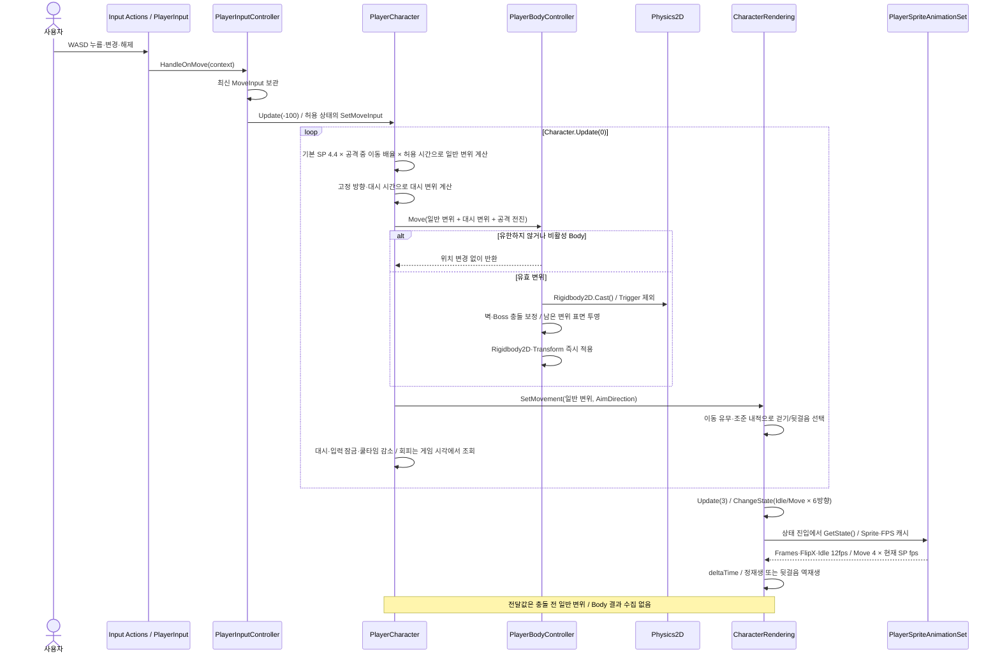
```mermaid
sequenceDiagram
    actor User as 사용자
    participant Actions as Input Actions / PlayerInput
    participant Input as PlayerInputController
    participant Player as PlayerCharacter
    participant Body as PlayerBodyController
    participant Physics as Physics2D
    participant Visual as CharacterRendering
    participant Set as PlayerSpriteAnimationSet
    User->>Actions: WASD 누름·변경·해제
    Actions->>Input: HandleOnMove(context)
    Input->>Input: 최신 MoveInput 보관
    Input->>Player: Update(-100) / 허용 상태의 SetMoveInput
    loop Character.Update(0)
        Player->>Player: 기본 SP 4.4 × 공격 중 이동 배율 × 허용 시간으로 일반 변위 계산
        Player->>Player: 고정 방향·대시 시간으로 대시 변위 계산
        Player->>Body: Move(일반 변위 + 대시 변위 + 공격 전진)
        alt 유한하지 않거나 비활성 Body
            Body-->>Player: 위치 변경 없이 반환
        else 유효 변위
            Body->>Physics: Rigidbody2D.Cast() / Trigger 제외
            Body->>Body: 벽·Boss 충돌 보정 / 남은 변위 표면 투영
            Body->>Body: Rigidbody2D·Transform 즉시 적용
        end
        Player->>Visual: SetMovement(일반 변위, AimDirection)
        Visual->>Visual: 이동 유무·조준 내적으로 걷기/뒷걸음 선택
        Player->>Player: 대시·입력 잠금·쿨타임 감소 / 회피는 게임 시각에서 조회
    end
    Visual->>Visual: Update(3) / ChangeState(Idle/Move × 6방향)
    Visual->>Set: 상태 진입에서 GetState() / Sprite·FPS 캐시
    Set-->>Visual: Frames·FlipX·Idle 12fps / Move 4 × 현재 SP fps
    Visual->>Visual: deltaTime / 정재생 또는 뒷걸음 역재생
    Note over Player,Visual: 전달값은 충돌 전 일반 변위 / Body 결과 수집 없음
```

**② 마우스 이동 → 몸체·무기 방향과 뒷걸음 표현**

화면 좌표를 월드 조준점으로 바꿔 몸체 6방향과 무기의 어깨 회전을 갱신한다.

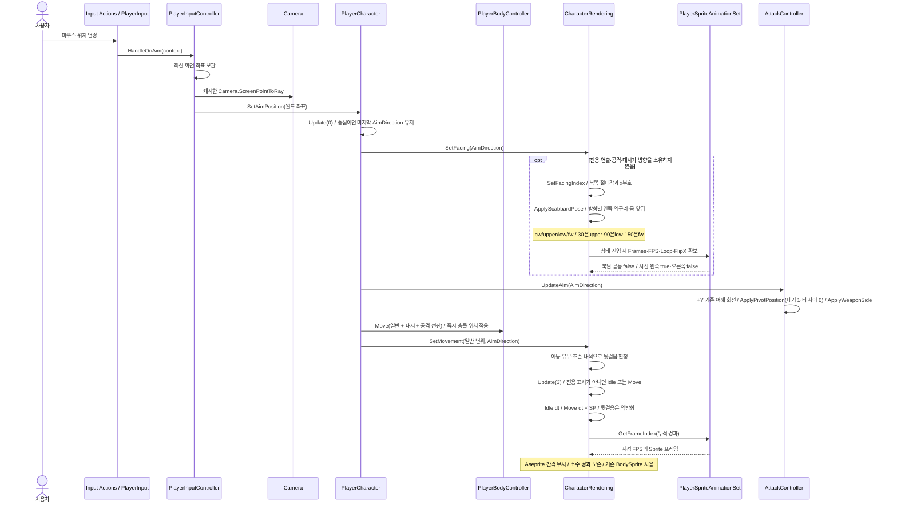
```mermaid
sequenceDiagram
    actor User as 사용자
    participant Actions as Input Actions / PlayerInput
    participant Input as PlayerInputController
    participant Camera
    participant Player as PlayerCharacter
    participant Body as PlayerBodyController
    participant Visual as CharacterRendering
    participant Set as PlayerSpriteAnimationSet
    participant Weapon as AttackController
    User->>Actions: 마우스 위치 변경
    Actions->>Input: HandleOnAim(context)
    Input->>Input: 최신 화면 좌표 보관
    Input->>Camera: 캐시한 Camera.ScreenPointToRay
    Input->>Player: SetAimPosition(월드 좌표)
    Player->>Player: Update(0) / 중심이면 마지막 AimDirection 유지
    Player->>Visual: SetFacing(AimDirection)
    opt 전용 연출·공격·대시가 방향을 소유하지 않음
        Visual->>Visual: SetFacingIndex / 북쪽 절대각과 x부호
        Visual->>Visual: ApplyScabbardPose / 방향별 왼쪽 옆구리·몸 앞뒤
        Note over Visual: bw/upper/low/fw / 30은upper·90은low·150은fw
        Visual->>Set: 상태 진입 시 Frames·FPS·Loop·FlipX 확보
        Set-->>Visual: 북남 공통 false / 사선 왼쪽 true·오른쪽 false
    end
    Player->>Weapon: UpdateAim(AimDirection)
    Weapon->>Weapon: +Y 기준 어깨 회전 / ApplyPivotPosition(대기 1·타 사이 0) / ApplyWeaponSide
    Player->>Body: Move(일반 + 대시 + 공격 전진) / 즉시 충돌·위치 적용
    Player->>Visual: SetMovement(일반 변위, AimDirection)
    Visual->>Visual: 이동 유무·조준 내적으로 뒷걸음 판정
    Visual->>Visual: Update(3) / 전용 표시가 아니면 Idle 또는 Move
    Visual->>Visual: Idle dt / Move dt × SP / 뒷걸음은 역방향
    Visual->>Set: GetFrameIndex(누적 경과)
    Set-->>Visual: 지정 FPS의 Sprite 프레임
    Note over Visual: Aseprite 간격 무시 / 소수 경과 보존 / 기존 BodySprite 사용
```

**③ 씬 서비스 준비·입력 차단 → 멈춤과 재개·Title 정리**

서비스와 대상이 준비된 뒤 입력을 열고 세션 종료 시 참조를 해제한다.

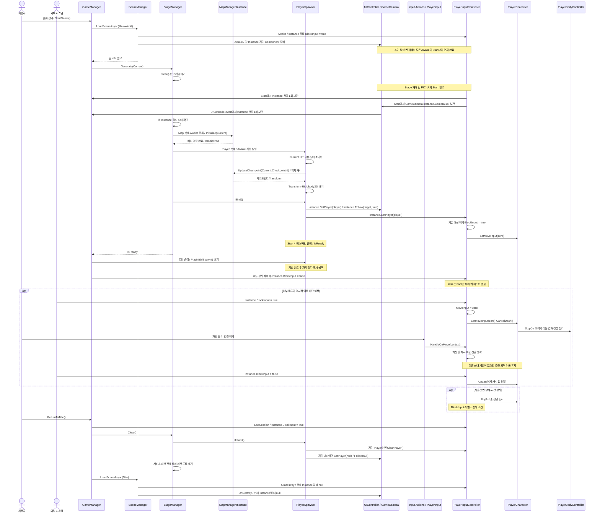
```mermaid
sequenceDiagram
    actor User as 사용자
    actor System as 외부 시스템
    participant GM as GameManager
    participant Scene as SceneManager
    participant Stage as StageManager
    participant Map as MapManager.Instance
    participant Spawner as PlayerSpawner
    participant Services as UIController / GameCamera
    participant Actions as Input Actions / PlayerInput
    participant Input as PlayerInputController
    participant Player as PlayerCharacter
    participant Body as PlayerBodyController
    User->>GM: 슬롯 선택 / StartGame()
    GM->>Scene: LoadSceneAsync(MainWorld)
    Scene->>Input: Awake / Instance 등록·BlockInput = true
    Scene->>Services: Awake / 각 Instance·자기 Component 준비
    Note over Services,Input: 초기 활성 씬 객체의 모든 Awake가 Start보다 먼저 완료
    Scene-->>GM: 씬 로드 완료
    GM->>Stage: Generate(Current)
    Stage->>Stage: Clear()·한 프레임 대기
    Note over Services,Input: Stage 재개 전 PIC·UI의 Start 완료
    Input->>GM: Start에서 Instance 참조 1회 보관
    Input->>Services: Start에서 GameCamera.Instance.Camera 1회 보관
    Services->>GM: UIController.Start에서 Instance 참조 1회 보관
    Stage->>Stage: 세 Instance·활성 상태 확인
    Stage->>Map: Map 복제·Awake 등록 / Initialize(Current)
    Map-->>Stage: 배치 검증 완료 / IsInitialized
    Stage->>Spawner: Player 복제 / Awake 자동 실행
    Spawner->>Spawner: Current HP·기본 상태 초기화
    Spawner->>Map: UpdateCheckpoint(Current.CheckpointId) / 위치 캐시
    Map-->>Spawner: 체크포인트 Transform
    Spawner->>Spawner: Transform·Rigidbody2D 배치
    Stage->>Spawner: Bind()
    Spawner->>Services: Instance.SetPlayer(player) / Instance.Follow(target, true)
    Spawner->>Input: Instance.SetPlayer(player)
    Input->>Input: 기존 대상 해제·BlockInput = true
    Input->>Player: SetMoveInput(zero)
    Note over Spawner: Start 서비스/사건 준비 / IsReady
    Stage-->>GM: IsReady
    GM->>Spawner: 로딩 숨김 / PlayInitialSpawn() 대기
    Note over Spawner: 기상 완료 후 자기 정지·표시 복구
    GM->>Input: 로딩·정지 해제 후 Instance.BlockInput = false
    Note over Input: false는 bool만 해제·키 재조회 없음
    opt 외부 코드가 명시적 이동 차단 설정
        System->>Input: Instance.BlockInput = true
        Input->>Input: MoveInput = zero
        Input->>Player: SetMoveInput(zero)·CancelDash()
        Player->>Body: Stop() / 마지막 이동 결과·관성 정리
        User->>Actions: 차단 중 키 변경·해제
        Actions->>Input: HandleOnMove(context)
        Input->>Input: 최신 값 캐시·이동 전달 생략
        Note over Input,Player: 다른 상태 제한이 없으면 조준·외부 이동 유지
        System->>Input: Instance.BlockInput = false
        Input->>Player: Update에서 캐시 값 전달
    end
    opt 사망·컷씬 상태·시간 정지
        Input->>Player: 이동0·조준 전달 중지
        Note over Input: BlockInput과 별도 상태 조건
    end
    User->>GM: ReturnToTitle()
    GM->>Input: EndSession / Instance.BlockInput = true
    GM->>Stage: Clear()
    Stage->>Spawner: Unbind()
    Spawner->>Input: 자기 Player이면 ClearPlayer()
    Spawner->>Services: 자기 대상이면 SetPlayer(null) / Follow(null)
    Stage->>Stage: 서비스 대상 전체 해제·세션 루트 제거
    GM->>Scene: LoadSceneAsync(Title)
    Scene->>Input: OnDestroy / 현재 Instance일 때 null
    Scene->>Services: OnDestroy / 현재 Instance일 때 null
```

**④ 외부 코드의 Player 재연결·중복 서비스 생성 → 현재 연결 보호**

이전 Player나 중복 서비스가 정리될 때 새 연결을 보존한다.

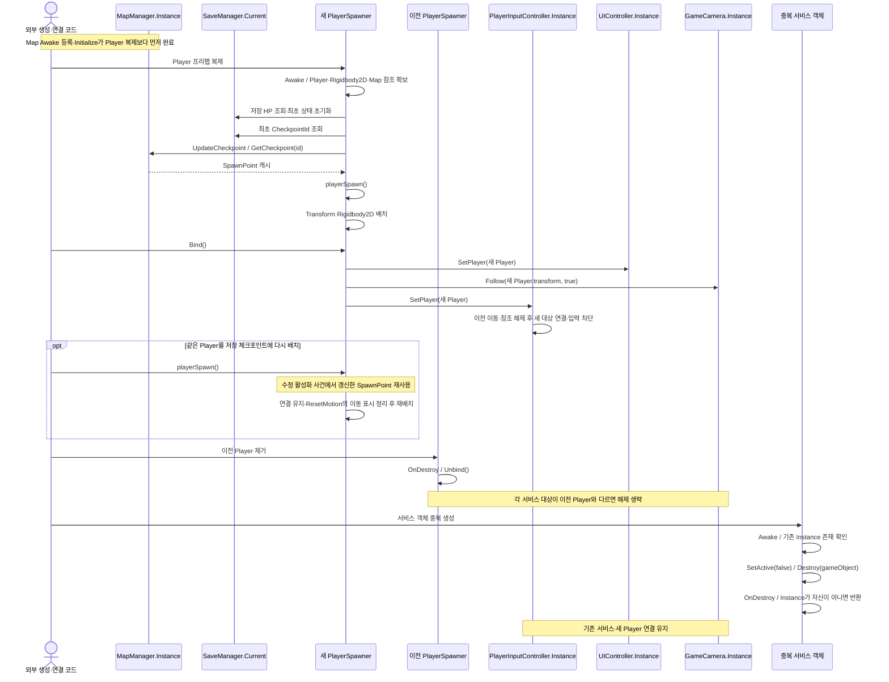
```mermaid
sequenceDiagram
    actor Caller as 외부 생성·연결 코드
    participant Map as MapManager.Instance
    participant Save as SaveManager.Current
    participant New as 새 PlayerSpawner
    participant Old as 이전 PlayerSpawner
    participant Input as PlayerInputController.Instance
    participant UI as UIController.Instance
    participant Camera as GameCamera.Instance
    participant Duplicate as 중복 서비스 객체
    Note over Caller,Map: Map Awake 등록·Initialize가 Player 복제보다 먼저 완료
    Caller->>New: Player 프리팹 복제
    New->>New: Awake / Player·Rigidbody2D·Map 참조 확보
    New->>Save: 저장 HP 조회·최초 상태 초기화
    New->>Save: 최초 CheckpointId 조회
    New->>Map: UpdateCheckpoint / GetCheckpoint(id)
    Map-->>New: SpawnPoint 캐시
    New->>New: playerSpawn()
    New->>New: Transform·Rigidbody2D 배치
    Caller->>New: Bind()
    New->>UI: SetPlayer(새 Player)
    New->>Camera: Follow(새 Player.transform, true)
    New->>Input: SetPlayer(새 Player)
    Input->>Input: 이전 이동·참조 해제 후 새 대상 연결·입력 차단
    opt 같은 Player를 저장 체크포인트에 다시 배치
        Caller->>New: playerSpawn()
        Note over New: 수정 활성화 사건에서 갱신한 SpawnPoint 재사용
        New->>New: 연결 유지·ResetMotion의 이동 표시 정리 후 재배치
    end
    Caller->>Old: 이전 Player 제거
    Old->>Old: OnDestroy / Unbind()
    Note over Old,Camera: 각 서비스 대상이 이전 Player와 다르면 해제 생략
    Caller->>Duplicate: 서비스 객체 중복 생성
    Duplicate->>Duplicate: Awake / 기존 Instance 존재 확인
    Duplicate->>Duplicate: SetActive(false) / Destroy(gameObject)
    Duplicate->>Duplicate: OnDestroy / Instance가 자신이 아니면 반환
    Note over Input,Camera: 기존 서비스·새 Player 연결 유지
```

F-P02 SequenceDiagram

**① Space 입력 → 이동 중/정지 중 방향 확정과 시작 허용**

Space 요청 시 이동 의도와 조준점으로 방향을 정하고 독립 Dash 자세를 고른다.

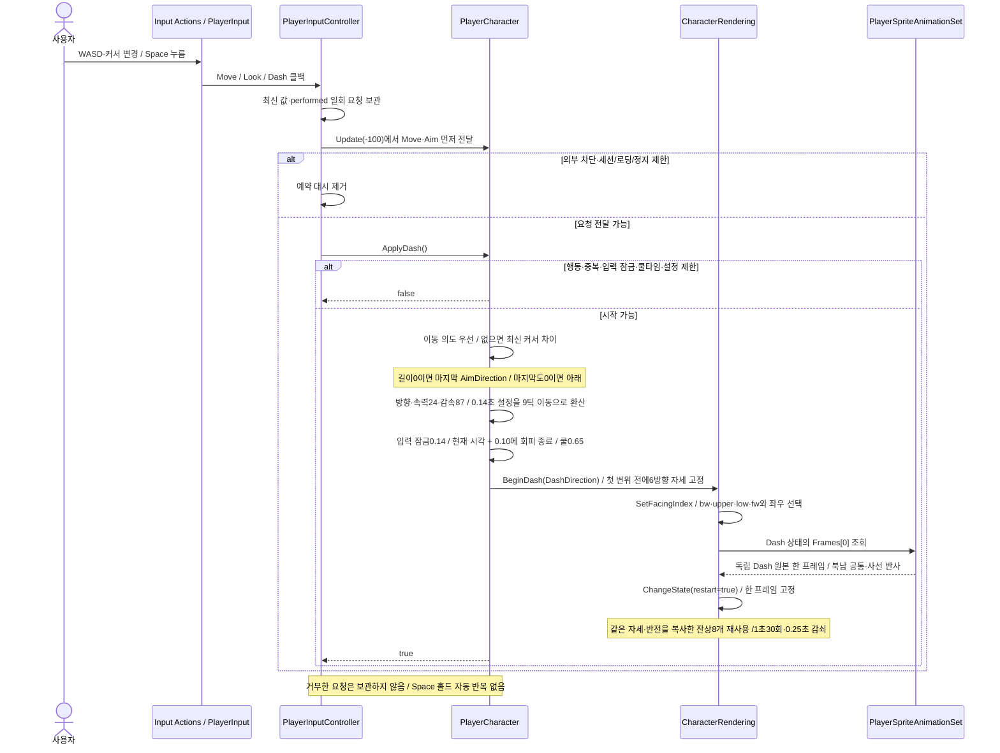
```mermaid
sequenceDiagram
    actor User as 사용자
    participant Actions as Input Actions / PlayerInput
    participant Input as PlayerInputController
    participant Player as PlayerCharacter
    participant Render as CharacterRendering
    participant Set as PlayerSpriteAnimationSet
    User->>Actions: WASD·커서 변경 / Space 누름
    Actions->>Input: Move / Look / Dash 콜백
    Input->>Input: 최신 값·performed 일회 요청 보관
    Input->>Player: Update(-100)에서 Move·Aim 먼저 전달
    alt 외부 차단·세션/로딩/정지 제한
        Input->>Input: 예약 대시 제거
    else 요청 전달 가능
        Input->>Player: ApplyDash()
        alt 행동·중복·입력 잠금·쿨타임·설정 제한
            Player-->>Input: false
        else 시작 가능
            Player->>Player: 이동 의도 우선 / 없으면 최신 커서 차이
            Note over Player: 길이0이면 마지막 AimDirection / 마지막도0이면 아래
            Player->>Player: 방향·속력24·감속87 / 0.14초 설정을 9틱 이동으로 환산
            Player->>Player: 입력 잠금0.14 / 현재 시각 + 0.10에 회피 종료 / 쿨0.65
            Player->>Render: BeginDash(DashDirection) / 첫 변위 전에6방향 자세 고정
            Render->>Render: SetFacingIndex / bw·upper·low·fw와 좌우 선택
            Render->>Set: Dash 상태의 Frames[0] 조회
            Set-->>Render: 독립 Dash 원본 한 프레임 / 북남 공통·사선 반사
            Render->>Render: ChangeState(restart=true) / 한 프레임 고정
            Note over Render: 같은 자세·반전을 복사한 잔상8개 재사용 /1초30회·0.25초 감쇠
            Player-->>Input: true
        end
    end
    Note over Input,Player: 거부한 요청은 보관하지 않음 / Space 홀드 자동 반복 없음
```

**② Character.Update → 대시 변위 계산·즉시 충돌 적용**

렌더 프레임의 게임 시간으로 감속 변위를 계산하고 벽·몸체 충돌을 즉시 반영한다.

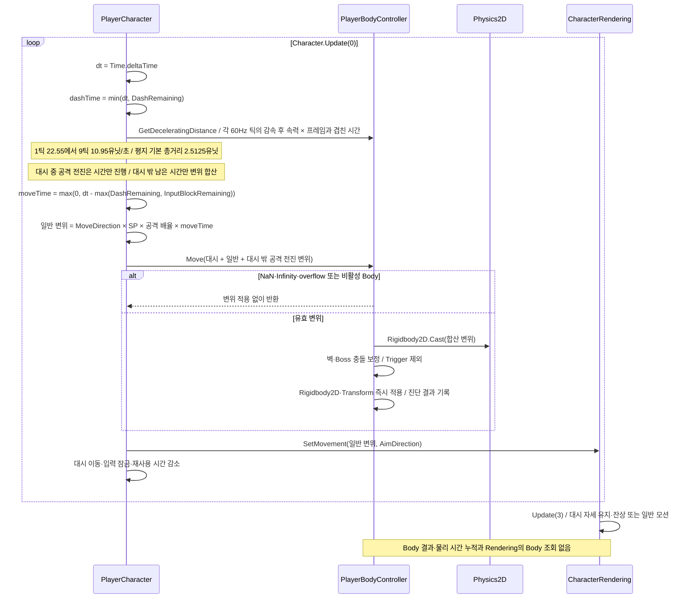
```mermaid
sequenceDiagram
    participant Player as PlayerCharacter
    participant Body as PlayerBodyController
    participant Physics as Physics2D
    participant Visual as CharacterRendering
    loop Character.Update(0)
        Player->>Player: dt = Time.deltaTime
        Player->>Player: dashTime = min(dt, DashRemaining)
        Player->>Body: GetDeceleratingDistance / 각 60Hz 틱의 감속 후 속력 × 프레임과 겹친 시간
        Note over Player: 1틱 22.55에서 9틱 10.95유닛/초 / 평지 기본 총거리 2.5125유닛
        Note over Player: 대시 중 공격 전진은 시간만 진행 / 대시 밖 남은 시간만 변위 합산
        Player->>Player: moveTime = max(0, dt - max(DashRemaining, InputBlockRemaining))
        Player->>Player: 일반 변위 = MoveDirection × SP × 공격 배율 × moveTime
        Player->>Body: Move(대시 + 일반 + 대시 밖 공격 전진 변위)
        alt NaN·Infinity·overflow 또는 비활성 Body
            Body-->>Player: 변위 적용 없이 반환
        else 유효 변위
            Body->>Physics: Rigidbody2D.Cast(합산 변위)
            Body->>Body: 벽·Boss 충돌 보정 / Trigger 제외
            Body->>Body: Rigidbody2D·Transform 즉시 적용 / 진단 결과 기록
        end
        Player->>Visual: SetMovement(일반 변위, AimDirection)
        Player->>Player: 대시 이동·입력 잠금·재사용 시간 감소
    end
    Visual->>Visual: Update(3) / 대시 자세 유지·잔상 또는 일반 모션
    Note over Body,Visual: Body 결과·물리 시간 누적과 Rendering의 Body 조회 없음
```

**③ 키 유지·해제와 시간 경과 → 독립 타이머·일반 이동 복원·재사용**

이동·회피·입력 잠금·재사용 시간은 각각 만료된다.

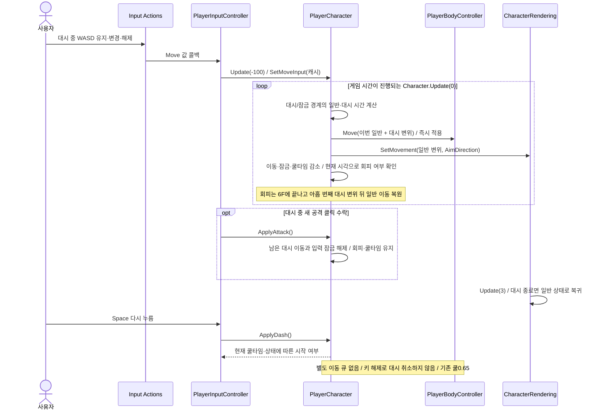
```mermaid
sequenceDiagram
    actor User as 사용자
    participant Actions as Input Actions
    participant Input as PlayerInputController
    participant Player as PlayerCharacter
    participant Body as PlayerBodyController
    participant Visual as CharacterRendering
    User->>Actions: 대시 중 WASD 유지·변경·해제
    Actions->>Input: Move 값 콜백
    Input->>Player: Update(-100) / SetMoveInput(캐시)
    loop 게임 시간이 진행되는 Character.Update(0)
        Player->>Player: 대시/잠금 경계의 일반·대시 시간 계산
        Player->>Body: Move(이번 일반 + 대시 변위) / 즉시 적용
        Player->>Visual: SetMovement(일반 변위, AimDirection)
        Player->>Player: 이동·잠금·쿨타임 감소 / 현재 시각으로 회피 여부 확인
        Note over Player: 회피는 6F에 끝나고 아홉 번째 대시 변위 뒤 일반 이동 복원
    end
    opt 대시 중 새 공격 클릭 수락
        Input->>Player: ApplyAttack()
        Player->>Player: 남은 대시 이동과 입력 잠금 해제 / 회피·쿨타임 유지
    end
    Visual->>Visual: Update(3) / 대시 종료면 일반 상태로 복귀
    User->>Input: Space 다시 누름
    Input->>Player: ApplyDash()
    Player-->>Input: 현재 쿨타임·상태에 따른 시작 여부
    Note over Player,Body: 별도 이동 큐 없음 / 키 해제로 대시 취소하지 않음 / 기존 쿨0.65
```

**④ 외부 차단·사망·컷씬·시간 정지·재배치 → 취소와 리셋**

사망·차단·재배치는 대시를 취소하고, 시간 정지는 진행 중인 타이머를 보존한다.

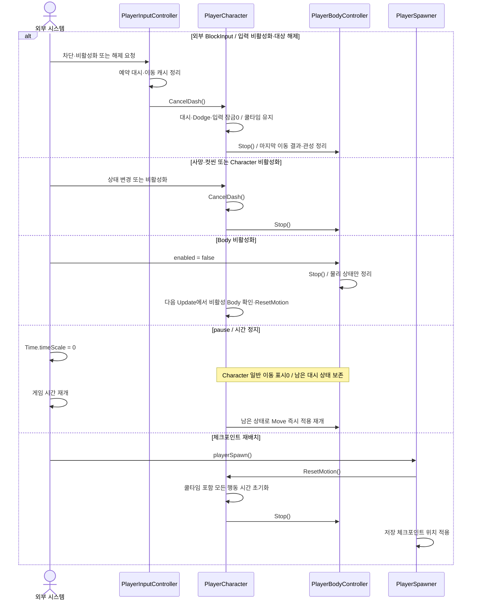
```mermaid
sequenceDiagram
    actor Caller as 외부 시스템
    participant Input as PlayerInputController
    participant Player as PlayerCharacter
    participant Body as PlayerBodyController
    participant Spawner as PlayerSpawner
    alt 외부 BlockInput / 입력 비활성화·대상 해제
        Caller->>Input: 차단·비활성화 또는 해제 요청
        Input->>Input: 예약 대시·이동 캐시 정리
        Input->>Player: CancelDash()
        Player->>Player: 대시·Dodge·입력 잠금0 / 쿨타임 유지
        Player->>Body: Stop() / 마지막 이동 결과·관성 정리
    else 사망·컷씬 또는 Character 비활성화
        Caller->>Player: 상태 변경 또는 비활성화
        Player->>Player: CancelDash()
        Player->>Body: Stop()
    else Body 비활성화
        Caller->>Body: enabled = false
        Body->>Body: Stop() / 물리 상태만 정리
        Player->>Player: 다음 Update에서 비활성 Body 확인·ResetMotion
    else pause / 시간 정지
        Caller->>Caller: Time.timeScale = 0
        Note over Player,Body: Character 일반 이동 표시0 / 남은 대시 상태 보존
        Caller->>Caller: 게임 시간 재개
        Player->>Body: 남은 상태로 Move 즉시 적용 재개
    else 체크포인트 재배치
        Caller->>Spawner: playerSpawn()
        Spawner->>Player: ResetMotion()
        Player->>Player: 쿨타임 포함 모든 행동 시간 초기화
        Player->>Body: Stop()
        Spawner->>Spawner: 저장 체크포인트 위치 적용
    end
```

F-P03 SequenceDiagram

**① 좌클릭 누름·해제 → 일회 눌림·홀드 전달과 공격 허용·방향 확정**

좌클릭 누름·홀드와 유효 조준 방향을 받아 같은 타격을 중복 시작하지 않는다.

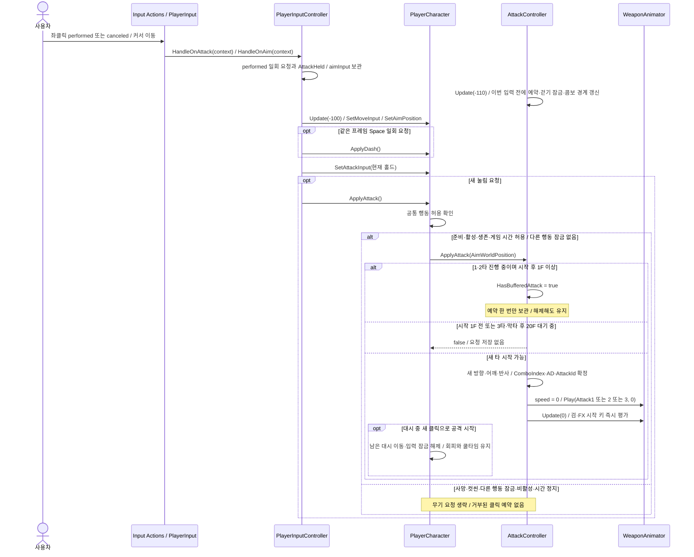
```mermaid
sequenceDiagram
    actor User as 사용자
    participant Actions as Input Actions / PlayerInput
    participant Input as PlayerInputController
    participant Player as PlayerCharacter
    participant Attack as AttackController
    participant Animator as WeaponAnimator
    User->>Actions: 좌클릭 performed 또는 canceled / 커서 이동
    Actions->>Input: HandleOnAttack(context) / HandleOnAim(context)
    Input->>Input: performed 일회 요청과 AttackHeld / aimInput 보관
    Attack->>Attack: Update(-110) / 이번 입력 전에 예약·걷기 잠금·콤보 경계 갱신
    Input->>Player: Update(-100) / SetMoveInput / SetAimPosition
    opt 같은 프레임 Space 일회 요청
        Input->>Player: ApplyDash()
    end
    Input->>Player: SetAttackInput(현재 홀드)
    opt 새 눌림 요청
        Input->>Player: ApplyAttack()
        Player->>Player: 공통 행동 허용 확인
        alt 준비·활성·생존·게임 시간 허용 / 다른 행동 잠금 없음
            Player->>Attack: ApplyAttack(AimWorldPosition)
            alt 1·2타 진행 중이며 시작 후 1F 이상
                Attack->>Attack: HasBufferedAttack = true
                Note over Attack: 예약 한 번만 보관 / 해제해도 유지
            else 시작 1F 전 또는 3타·막타 후 20F 대기 중
                Attack-->>Player: false / 요청 저장 없음
            else 새 타 시작 가능
                Attack->>Attack: 새 방향·어깨·반사 / ComboIndex·AD·AttackId 확정
                Attack->>Animator: speed = 0 / Play(Attack1 또는 2 또는 3, 0)
                Attack->>Animator: Update(0) / 검·FX 시작 키 즉시 평가
                opt 대시 중 새 클릭으로 공격 시작
                    Player->>Player: 남은 대시 이동·입력 잠금 해제 / 회피와 쿨타임 유지
                end
            end
        else 사망·컷씬·다른 행동 잠금·비활성·시간 정지
            Note over Player,Attack: 무기 요청 생략 / 거부된 클릭 예약 없음
        end
    end
```

**② 공격 중 이동·조준 변경 → 입력 이동 차단·강제 전진과 시작 방향 유지**

공격 도중 무기와 FX가 같은 AS 적용 클립을 따르고 몸체 프레임은 별도 재생한다.

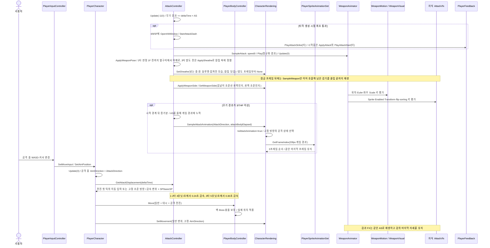
```mermaid
sequenceDiagram
    actor User as 사용자
    participant Input as PlayerInputController
    participant Player as PlayerCharacter
    participant Attack as AttackController
    participant Body as PlayerBodyController
    participant Visual as CharacterRendering
    participant Set as PlayerSpriteAnimationSet
    participant Animator as WeaponAnimator
    participant Motion as WeaponMotion / WeaponVisual
    participant Fx as 자식 AttackVfx
    participant Feedback as PlayerFeedback
    Attack->>Attack: Update(-110) / 무기 경과 += deltaTime × AS
    opt 타격 생성 시점 최초 통과
        Attack->>Attack: 4/8/5F에 OpenHitWindow / StartAttackDash
        Attack->>Feedback: PlayAttackStrike(타) / 시작음은 ApplyAttack의 PlayAttackStart(타)
    end
    Attack->>Animator: SampleAttack: speed0 / Play(정규화 경과) / Update(0)
    Attack->>Attack: ApplyWeaponPose / 1타 판정 1F 전까지 옆구리에서 어깨로, 3타 발도 전은 ApplySheathe로 칼집 축에 정렬
    Attack->>Visual: SetSheathe(넣는 중·흰 실루엣·합쳐진 모습, 칼집 당김) / 발도 프레임부터 None
    Note over Attack,Fx: 잠금 프레임 뒤에는 SampleWeapon만 이어 호출해 남은 검기를 클립 끝까지 재생
    Attack->>Visual: ApplyWeaponSide / SetWeaponSide(검날이 조준선 왼쪽인지, 왼쪽 조준인지)
    Animator->>Motion: 위치·Euler·좌우 Scale 키 평가
    Animator->>Fx: Sprite·Enabled·Transform·flip·sorting 키 평가
    opt 무기 경과가 3/7/4F 이상
        Attack->>Attack: 시작 경계 뒤 증가분 / AS를 몸체 게임 경과에 누적
        Attack->>Visual: SampleAttackAnimation(AttackDirection, attackBodyElapsed)
        Visual->>Visual: IsAttackAnimation=true / 고정 방향의 공격 상태 선택
        Visual->>Set: GetFrameIndex(20fps 게임 경과)
        Set-->>Visual: 3프레임 순서 / 끝은 마지막 프레임 유지
    end
    User->>Input: 공격 중 WASD·커서 변경
    Input->>Player: SetMoveInput / SetAimPosition
    Player->>Player: Update(0) / 공격 중 AimDirection = AttackDirection
    Player->>Attack: GetAttackDisplacement(deltaTime)
    Attack-->>Player: 전진 첫 틱의 이동 입력 또는 고정 조준 방향 / 감속 변위 × SP/basicSP
    Note over Attack,Body: 1·2타 4유닛/초에서 0.24초 감속, 3타 5유닛/초에서 0.30초 감속
    Player->>Body: Move(일반 + 대시 + 공격 전진)
    Body->>Body: 벽·Boss 충돌 보정 / 실제 위치 적용
    Player->>Visual: SetMovement(일반 변위, 고정 AimDirection)
    Note over Animator,Fx: 검과 FX는 같은 AS로 재생하고 검의 마지막 자세를 유지
```

**③ 판정 구간 도달 → 독립 수명·실제 Collider 조회·중복 방지·피해 적용**

타격 시점에 고정한 피해·방향·수신자 목록을 한 공격의 판정 수명 동안 유지한다.

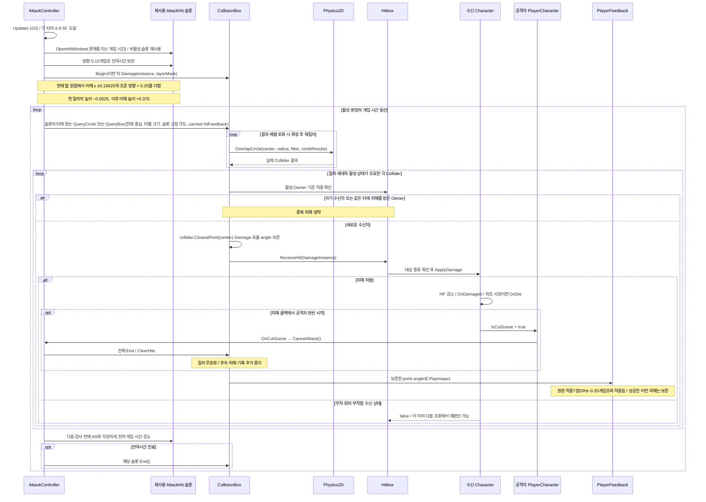
```mermaid
sequenceDiagram
    participant Attack as AttackController
    participant Hit as 재사용 AttackHit 슬롯
    participant HitQuery as CollisionBox
    participant Physics as Physics2D
    participant Hitbox
    participant Target as 수신 Character
    participant Player as 공격자 PlayerCharacter
    participant Feedback as PlayerFeedback
    Attack->>Attack: Update(-110) / 각 타의 4·8·5F 도달
    Attack->>Hit: OpenHitWindow(경계를 지난 게임 시간) / 비활성 슬롯 재사용
    Attack->>Hit: 방향·0.15게임초 잔여시간 보관
    Attack->>HitQuery: Begin(이번 타 DamageInstance, layerMask)
    Note over Attack,Hit: 현재 발 원점에서 어깨 x ±0.15625와 조준 방향 × 0.25를 더함
    Note over Attack,Hit: 첫 질의의 높이 −0.0625, 이후 어깨 높이 +0.375
    loop 활성 판정의 게임 시간 동안
        Attack->>HitQuery: 슬롯의 타에 맞는 QueryCircle 또는 QueryBox(현재 중심, 타별 크기, 슬롯 고정 각도, cached hitFeedback)
        loop 결과 배열 포화 시 확장 후 재질의
            HitQuery->>Physics: OverlapCircle(center, radius, filter, circleResults)
            Physics-->>HitQuery: 실제 Collider 결과
        end
        loop 질의 세대와 활성 상태가 유효한 각 Collider
            HitQuery->>Hitbox: 활성·Owner·기존 적중 확인
            alt 자기 수신자 또는 같은 타에 피해를 받은 Owner
                Note over HitQuery,Hitbox: 중복 피해 생략
            else 새로운 수신자
                HitQuery->>HitQuery: collider.ClosestPoint(center)·Damage·호출 angle 보존
                HitQuery->>Hitbox: ReceiveHit(DamageInstance)
                Hitbox->>Target: 대상 종류 확인 후 ApplyDamage
                alt 피해 허용
                    Target->>Target: HP 감소 / OnDamaged / 최초 사망이면 OnDie
                    opt 피해 콜백에서 공격자 컷씬 시작
                        Target->>Player: IsCutScene = true
                        Player->>Attack: OnCutScene → CancelAttack()
                        Attack->>HitQuery: 전체 End / ClearHits
                        Note over HitQuery: 질의 무효화 / 후속 피해·기록 추가 중지
                    end
                    HitQuery->>Feedback: 보존한 point·angle로 PlayImpact
                    Note over Feedback: 원본 적중7장20Hz·0.35게임초와 적중음 / 성공한 이번 피해는 보존
                else 무적·회피·부적합 수신 상태
                    Target-->>Hitbox: false / 이 타의 다음 조회에서 재판단 가능
                end
            end
        end
        Attack->>Hit: 다음 검사 전에 AS와 무관하게 잔여 게임 시간 감소
        opt 잔여시간 만료
            Attack->>HitQuery: 해당 슬롯 End()
        end
    end
```

**④ 홀드·허용 클릭 예약·해제·시간 만료 →3콤보와 다음 공격**

허용 구간의 다음 클릭을 예약하거나 홀드 상태에서 연속 공격하고 시간이 지나면 콤보를 초기화한다.

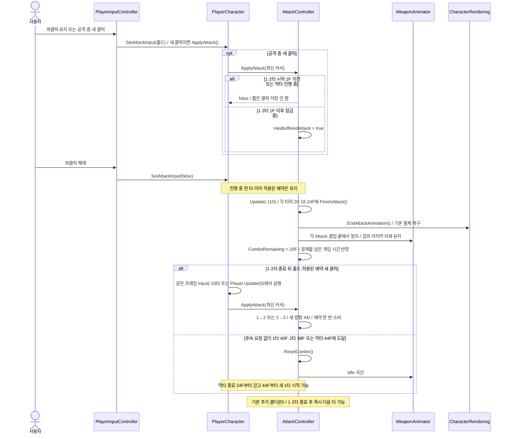
```mermaid
sequenceDiagram
    actor User as 사용자
    participant Input as PlayerInputController
    participant Player as PlayerCharacter
    participant Attack as AttackController
    participant Animator as WeaponAnimator
    participant Visual as CharacterRendering
    User->>Input: 좌클릭 유지 또는 공격 중 새 클릭
    Input->>Player: SetAttackInput(홀드) / 새 클릭이면 ApplyAttack()
    opt 공격 중 새 클릭
        Player->>Attack: ApplyAttack(최신 커서)
        alt 1·2타 시작 1F 이전 또는 막타 진행 중
            Attack-->>Player: false / 짧은 클릭 저장 안 함
        else 1·2타 1F 이후 잠금 중
            Attack->>Attack: HasBufferedAttack = true
        end
    end
    User->>Input: 좌클릭 해제
    Input->>Player: SetAttackInput(false)
    Note over Player,Attack: 진행 중 한 타·이미 허용된 예약은 유지
    Attack->>Attack: Update(-110) / 각 타의 20·18·24F에 FinishAttack()
    Attack->>Visual: EndAttackAnimation() / 기본 몸체 복구
    Attack->>Animator: 각 Attack 클립 끝에서 정지 / 검의 마지막 자세 유지
    Attack->>Attack: ComboRemaining = 20F / 경계를 넘은 게임 시간 반영
    alt 1·2타 종료 뒤 홀드·허용된 예약·새 클릭
        Player->>Player: 같은 프레임 Input(-100) 또는 Player.Update(0)에서 실행
        Player->>Attack: ApplyAttack(최신 커서)
        Attack->>Attack: 1→2 또는 2→3 / 새 방향·AD / 예약 한 번 소비
    else 후속 요청 없이 1타 40F·2타 38F 또는 막타 44F에 도달
        Attack->>Attack: ResetCombo()
        Attack->>Animator: Idle 곡선
        Note over Player,Attack: 막타 종료 24F부터 걷고 44F부터 새 1타 시작 가능
    end
    Note over Attack: 기본 추가 쿨다운0 / 1·2타 종료 후 즉시 다음 타 가능
```

**⑤ 차단·사망·비활성화·시간 정지·재배치 → 중단 또는 상태 보존**

중단 경계에서 전진·판정·예약과 무기 표현을 정리한다.

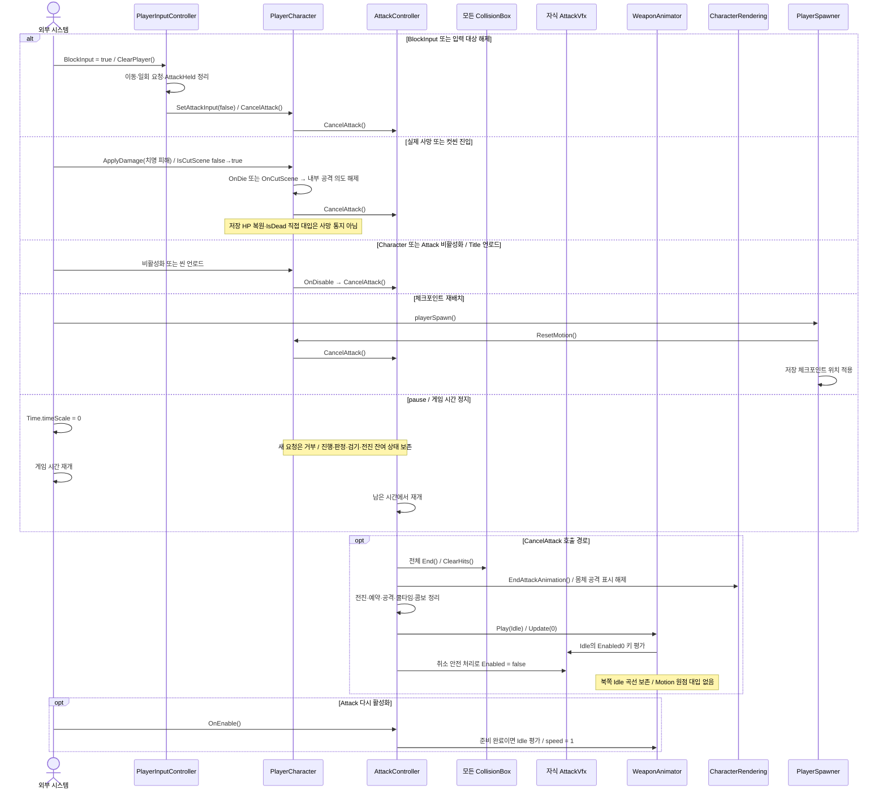
```mermaid
sequenceDiagram
    actor Caller as 외부 시스템
    participant Input as PlayerInputController
    participant Player as PlayerCharacter
    participant Attack as AttackController
    participant HitQuery as 모든 CollisionBox
    participant Fx as 자식 AttackVfx
    participant Animator as WeaponAnimator
    participant Visual as CharacterRendering
    participant Spawner as PlayerSpawner
    alt BlockInput 또는 입력 대상 해제
        Caller->>Input: BlockInput = true / ClearPlayer()
        Input->>Input: 이동·일회 요청·AttackHeld 정리
        Input->>Player: SetAttackInput(false) / CancelAttack()
        Player->>Attack: CancelAttack()
    else 실제 사망 또는 컷씬 진입
        Caller->>Player: ApplyDamage(치명 피해) / IsCutScene false→true
        Player->>Player: OnDie 또는 OnCutScene → 내부 공격 의도 해제
        Player->>Attack: CancelAttack()
        Note over Player: 저장 HP 복원·IsDead 직접 대입은 사망 통지 아님
    else Character 또는 Attack 비활성화 / Title 언로드
        Caller->>Player: 비활성화 또는 씬 언로드
        Player->>Attack: OnDisable → CancelAttack()
    else 체크포인트 재배치
        Caller->>Spawner: playerSpawn()
        Spawner->>Player: ResetMotion()
        Player->>Attack: CancelAttack()
        Spawner->>Spawner: 저장 체크포인트 위치 적용
    else pause / 게임 시간 정지
        Caller->>Caller: Time.timeScale = 0
        Note over Player,Attack: 새 요청은 거부 / 진행·판정·검기·전진 잔여 상태 보존
        Caller->>Caller: 게임 시간 재개
        Attack->>Attack: 남은 시간에서 재개
    end
    opt CancelAttack 호출 경로
        Attack->>HitQuery: 전체 End() / ClearHits()
        Attack->>Visual: EndAttackAnimation() / 몸체 공격 표시 해제
        Attack->>Attack: 전진·예약·공격·쿨타임·콤보 정리
        Attack->>Animator: Play(Idle) / Update(0)
        Animator->>Fx: Idle의 Enabled0 키 평가
        Attack->>Fx: 취소 안전 처리로 Enabled = false
        Note over Animator: 북쪽 Idle 곡선 보존 / Motion 원점 대입 없음
    end
    opt Attack 다시 활성화
        Caller->>Attack: OnEnable()
        Attack->>Animator: 준비 완료이면 Idle 평가 / speed = 1
    end
```

F-P04 SequenceDiagram

**① 일반 Shift → 공통 시작 허용·스킬 진입과 전용 맵 전환**

Shift가 들어오면 행동 가능 여부와 Draw 대기를 검사하고 전용 입력·화면·정지를 적용한다.

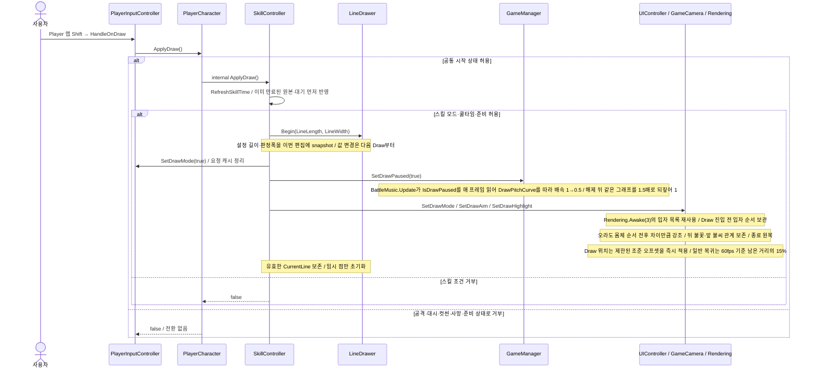
```mermaid
sequenceDiagram
    actor User as 사용자
    participant Input as PlayerInputController
    participant Player as PlayerCharacter
    participant Skill as SkillController
    participant Drawer as LineDrawer
    participant GM as GameManager
    participant View as UIController / GameCamera / Rendering
    User->>Input: Player 맵 Shift → HandleOnDraw
    Input->>Player: ApplyDraw()
    alt 공통 시작 상태 허용
        Player->>Skill: internal ApplyDraw()
        Skill->>Skill: RefreshSkillTime / 이미 만료된 원본·대기 먼저 반영
        alt 스킬 모드·쿨타임·준비 허용
            Skill->>Drawer: Begin(LineLength, LineWidth)
            Note over Skill,Drawer: 설정 길이·판정폭을 이번 편집에 snapshot / 값 변경은 다음 Draw부터
            Skill->>Input: SetDrawMode(true) / 요청 캐시 정리
            Skill->>GM: SetDrawPaused(true)
            Note over GM: BattleMusic.Update가 IsDrawPaused를 매 프레임 읽어 DrawPitchCurve를 따라 배속 1→0.5 / 해제 뒤 같은 그래프를 1.5배로 되짚어 1
            Skill->>View: SetDrawMode / SetDrawAim / SetDrawHighlight
            Note over View: Rendering.Awake(3)의 입자 목록 재사용 / Draw 진입 전 입자 순서 보관
            Note over View: 오라도 몸체 순서 전후 차이만큼 강조 / 뒤 불꽃·앞 불씨 관계 보존 / 종료 원복
            Note over View: Draw 위치는 제한된 조준 오프셋을 즉시 적용 / 일반 복귀는 60fps 기준 남은 거리의 15%
            Note over Skill,Drawer: 유효한 CurrentLine 보존 / 임시 점만 초기화
        else 스킬 조건 거부
            Skill-->>Player: false
        end
    else 공격·대시·컷씬·사망·준비 상태로 거부
        Player-->>Input: false / 전환 없음
    end
```

**② 정지 중 M1·커서·R·F → 임시 기하·표현과 확정 종료**

게임이 정지한 동안 마우스·R·F로 편집하고 확정 시 일반 입력으로 복귀한다.

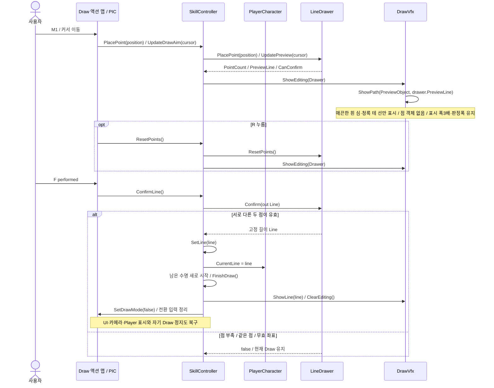
```mermaid
sequenceDiagram
    actor User as 사용자
    participant Input as Draw 액션 맵 / PIC
    participant Skill as SkillController
    participant Player as PlayerCharacter
    participant Drawer as LineDrawer
    participant Vfx as DrawVfx
    User->>Input: M1 / 커서 이동
    Input->>Skill: PlacePoint(position) / UpdateDrawAim(cursor)
    Skill->>Drawer: PlacePoint(position) / UpdatePreview(cursor)
    Drawer-->>Skill: PointCount / PreviewLine / CanConfirm
    Skill->>Vfx: ShowEditing(Drawer)
    Vfx->>Vfx: ShowPath(PreviewObject, drawer.PreviewLine)
    Note over Vfx: 매끈한 흰 심·청록 테 선만 표시 / 점 객체 없음 / 표시 폭3배·판정폭 유지
    opt R 누름
        Input->>Skill: ResetPoints()
        Skill->>Drawer: ResetPoints()
        Skill->>Vfx: ShowEditing(Drawer)
    end
    User->>Input: F performed
    Input->>Skill: ConfirmLine()
    Skill->>Drawer: Confirm(out Line)
    alt 서로 다른 두 점이 유효
        Drawer-->>Skill: 고정 길이 Line
        Skill->>Skill: SetLine(line)
        Skill->>Player: CurrentLine = line
        Skill->>Skill: 남은 수명 새로 시작 / FinishDraw()
        Skill->>Vfx: ShowLine(line) / ClearEditing()
        Skill->>Input: SetDrawMode(false) / 전환 입력 정리
        Note over Skill,Input: UI·카메라·Player 표시와 자기 Draw 정지도 복구
    else 점 부족 / 같은 점 / 무효 좌표
        Drawer-->>Skill: false / 현재 Draw 유지
    end
```

**③ 기존 Line이 있는 재Draw·Shift 취소 → 임시 편집만 정리**

편집 중 Shift 취소는 기존 확정 선을 보존한다.

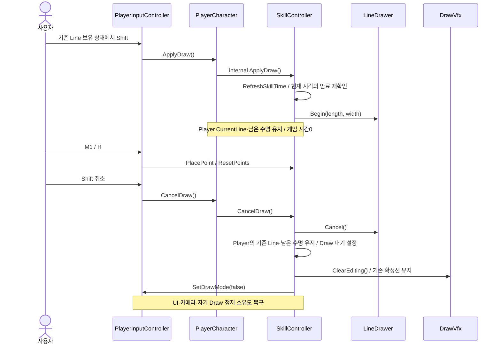
```mermaid
sequenceDiagram
    actor User as 사용자
    participant Input as PlayerInputController
    participant Player as PlayerCharacter
    participant Skill as SkillController
    participant Drawer as LineDrawer
    participant Vfx as DrawVfx
    User->>Input: 기존 Line 보유 상태에서 Shift
    Input->>Player: ApplyDraw()
    Player->>Skill: internal ApplyDraw()
    Skill->>Skill: RefreshSkillTime / 현재 시각의 만료 재확인
    Skill->>Drawer: Begin(length, width)
    Note over Player,Skill: Player.CurrentLine·남은 수명 유지 / 게임 시간0
    User->>Input: M1 / R
    Input->>Skill: PlacePoint / ResetPoints
    User->>Input: Shift 취소
    Input->>Player: CancelDraw()
    Player->>Skill: CancelDraw()
    Skill->>Drawer: Cancel()
    Skill->>Skill: Player의 기존 Line·남은 수명 유지 / Draw 대기 설정
    Skill->>Vfx: ClearEditing() / 기존 확정선 유지
    Skill->>Input: SetDrawMode(false)
    Note over Skill,Input: UI·카메라·자기 Draw 정지 소유도 복구
```

**④ 사망·컷씬·차단·비활성화 → 명시적 중단과 상태 복구**

차단·사망·비활성화 시 중단 원인에 맞춰 편집 상태와 입력을 정리한다.

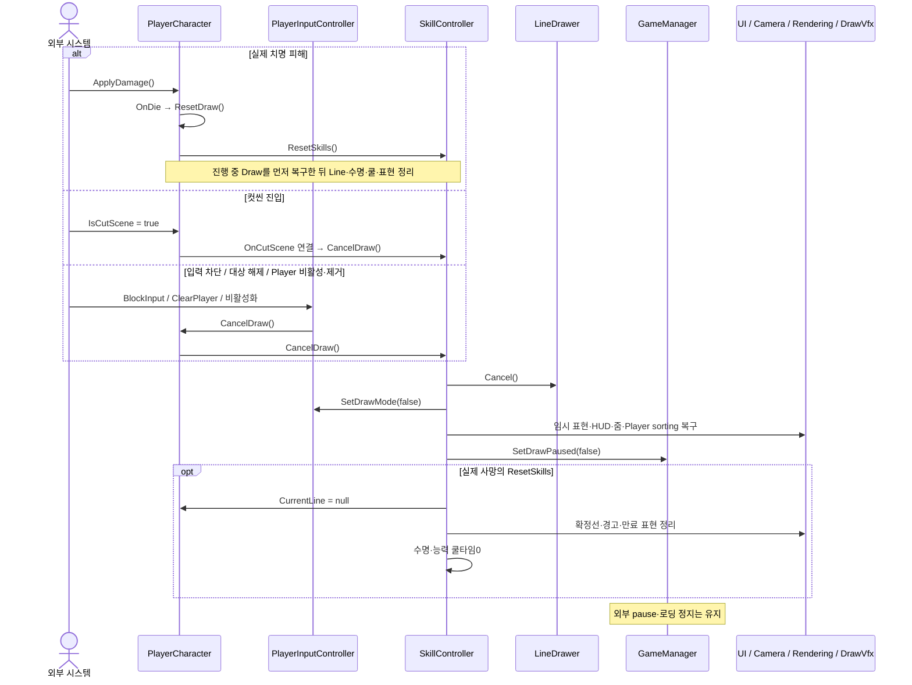
```mermaid
sequenceDiagram
    actor Caller as 외부 시스템
    participant Player as PlayerCharacter
    participant Input as PlayerInputController
    participant Skill as SkillController
    participant Drawer as LineDrawer
    participant GM as GameManager
    participant View as UI / Camera / Rendering / DrawVfx
    alt 실제 치명 피해
        Caller->>Player: ApplyDamage()
        Player->>Player: OnDie → ResetDraw()
        Player->>Skill: ResetSkills()
        Note over Player,Skill: 진행 중 Draw를 먼저 복구한 뒤 Line·수명·쿨·표현 정리
    else 컷씬 진입
        Caller->>Player: IsCutScene = true
        Player->>Skill: OnCutScene 연결 → CancelDraw()
    else 입력 차단 / 대상 해제 / Player 비활성·제거
        Caller->>Input: BlockInput / ClearPlayer / 비활성화
        Input->>Player: CancelDraw()
        Player->>Skill: CancelDraw()
    end
    Skill->>Drawer: Cancel()
    Skill->>Input: SetDrawMode(false)
    Skill->>View: 임시 표현·HUD·줌·Player sorting 복구
    Skill->>GM: SetDrawPaused(false)
    opt 실제 사망의 ResetSkills
        Skill->>Player: CurrentLine = null
        Skill->>View: 확정선·경고·만료 표현 정리
        Skill->>Skill: 수명·능력 쿨타임0
    end
    Note over GM: 외부 pause·로딩 정지는 유지
```

**⑤ 시간0의 커서·ETG식 제한 조준 카메라와 외부 pause 중첩 → 자기 소유만 복구**

조준 카메라는 실제 시간으로 반응하고 외부 정지와 Draw 정지는 독립적으로 해제한다.

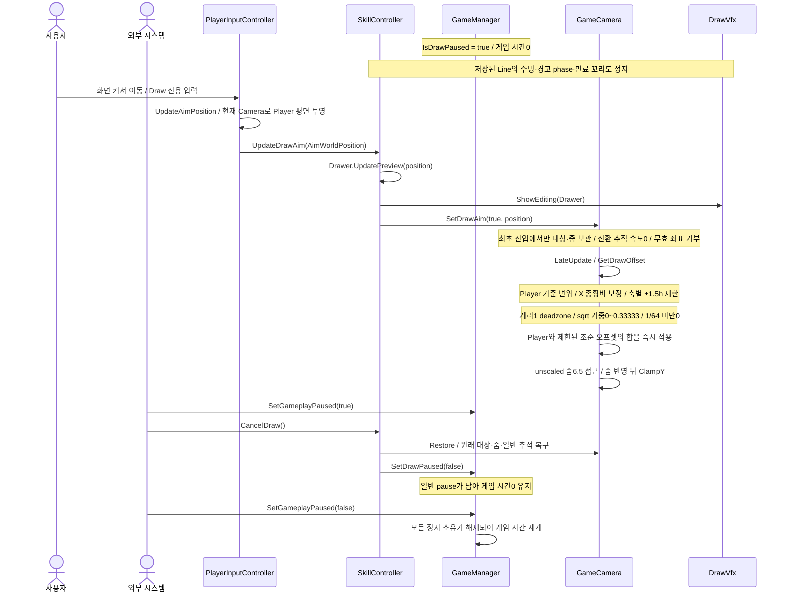
```mermaid
sequenceDiagram
    actor User as 사용자
    actor Caller as 외부 시스템
    participant Input as PlayerInputController
    participant Skill as SkillController
    participant GM as GameManager
    participant Camera as GameCamera
    participant View as DrawVfx
    Note over GM: IsDrawPaused = true / 게임 시간0
    Note over Skill,View: 저장된 Line의 수명·경고 phase·만료 꼬리도 정지
    User->>Input: 화면 커서 이동 / Draw 전용 입력
    Input->>Input: UpdateAimPosition / 현재 Camera로 Player 평면 투영
    Input->>Skill: UpdateDrawAim(AimWorldPosition)
    Skill->>Skill: Drawer.UpdatePreview(position)
    Skill->>View: ShowEditing(Drawer)
    Skill->>Camera: SetDrawAim(true, position)
    Note over Camera: 최초 진입에서만 대상·줌 보관 / 전환 추적 속도0 / 무효 좌표 거부
    Camera->>Camera: LateUpdate / GetDrawOffset
    Note over Camera: Player 기준 변위 / X 종횡비 보정 / 축별 ±1.5h 제한
    Note over Camera: 거리1 deadzone / sqrt 가중0~0.33333 / 1/64 미만0
    Camera->>Camera: Player와 제한된 조준 오프셋의 합을 즉시 적용
    Camera->>Camera: unscaled 줌6.5 접근 / 줌 반영 뒤 ClampY
    Caller->>GM: SetGameplayPaused(true)
    Caller->>Skill: CancelDraw()
    Skill->>Camera: Restore / 원래 대상·줌·일반 추적 복구
    Skill->>GM: SetDrawPaused(false)
    Note over GM: 일반 pause가 남아 게임 시간0 유지
    Caller->>GM: SetGameplayPaused(false)
    GM->>GM: 모든 정지 소유가 해제되어 게임 시간 재개
```

F-P05 SequenceDiagram

**① 첫 클릭·커서 이동 → 시작점과 고정 길이 미리보기**

첫 점을 둔 뒤 커서 방향에 고정 길이의 선을 미리 표시한다.

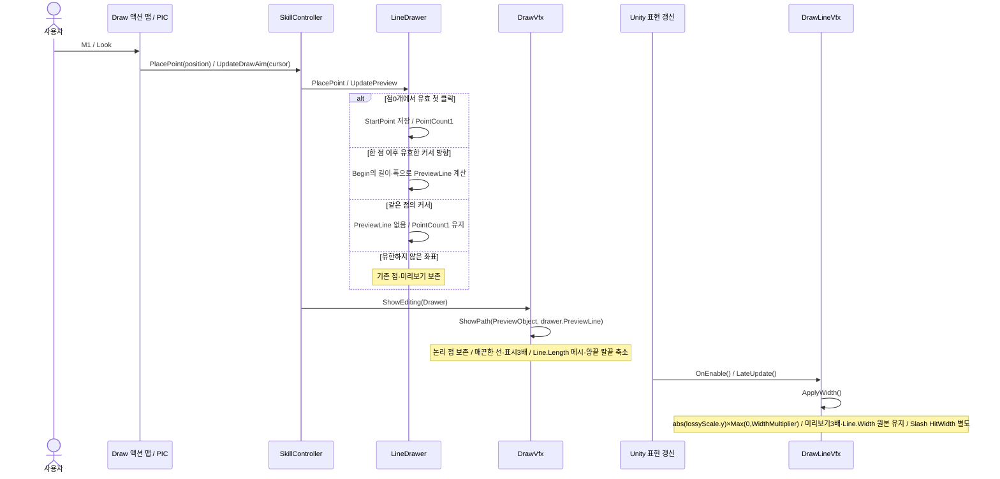
```mermaid
sequenceDiagram
    actor User as 사용자
    participant Input as Draw 액션 맵 / PIC
    participant Skill as SkillController
    participant Drawer as LineDrawer
    participant Vfx as DrawVfx
    participant Unity as Unity 표현 갱신
    participant FX as DrawLineVfx
    User->>Input: M1 / Look
    Input->>Skill: PlacePoint(position) / UpdateDrawAim(cursor)
    Skill->>Drawer: PlacePoint / UpdatePreview
    alt 점0개에서 유효 첫 클릭
        Drawer->>Drawer: StartPoint 저장 / PointCount1
    else 한 점 이후 유효한 커서 방향
        Drawer->>Drawer: Begin의 길이·폭으로 PreviewLine 계산
    else 같은 점의 커서
        Drawer->>Drawer: PreviewLine 없음 / PointCount1 유지
    else 유한하지 않은 좌표
        Note over Drawer: 기존 점·미리보기 보존
    end
    Skill->>Vfx: ShowEditing(Drawer)
    Vfx->>Vfx: ShowPath(PreviewObject, drawer.PreviewLine)
    Note over Vfx: 논리 점 보존 / 매끈한 선·표시3배 / Line.Length 메시·양끝 칼끝 축소
    Unity->>FX: OnEnable() / LateUpdate()
    FX->>FX: ApplyWidth()
    Note over FX: abs(lossyScale.y)×Max(0,WidthMultiplier) / 미리보기3배·Line.Width 원본 유지 / Slash HitWidth 별도
```

**② 두 번째 클릭 → 방향 고정·추가 클릭 무시**

둘째 유효 점이 방향을 고정한다. 같은 점과 이후 추가 입력은 무시한다.

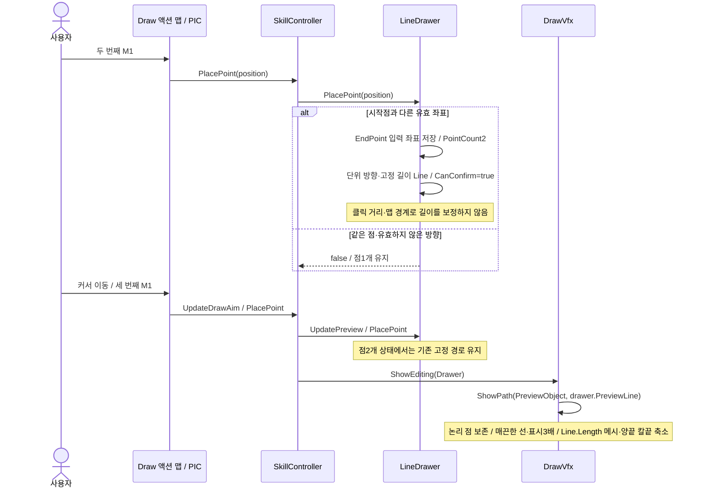
```mermaid
sequenceDiagram
    actor User as 사용자
    participant Input as Draw 액션 맵 / PIC
    participant Skill as SkillController
    participant Drawer as LineDrawer
    participant Vfx as DrawVfx
    User->>Input: 두 번째 M1
    Input->>Skill: PlacePoint(position)
    Skill->>Drawer: PlacePoint(position)
    alt 시작점과 다른 유효 좌표
        Drawer->>Drawer: EndPoint 입력 좌표 저장 / PointCount2
        Drawer->>Drawer: 단위 방향·고정 길이 Line / CanConfirm=true
        Note over Drawer: 클릭 거리·맵 경계로 길이를 보정하지 않음
    else 같은 점·유효하지 않은 방향
        Drawer-->>Skill: false / 점1개 유지
    end
    User->>Input: 커서 이동 / 세 번째 M1
    Input->>Skill: UpdateDrawAim / PlacePoint
    Skill->>Drawer: UpdatePreview / PlacePoint
    Note over Drawer: 점2개 상태에서는 기존 고정 경로 유지
    Skill->>Vfx: ShowEditing(Drawer)
    Vfx->>Vfx: ShowPath(PreviewObject, drawer.PreviewLine)
    Note over Vfx: 논리 점 보존 / 매끈한 선·표시3배 / Line.Length 메시·양끝 칼끝 축소
```

**③ 미완 F·R → Draw와 기존 원본 보존**

R은 편집점만 지우고 두 점이 없는 F는 Draw를 계속한다.

```mermaid
sequenceDiagram
    actor User as 사용자
    participant Input as Draw 액션 맵 / PIC
    participant Skill as SkillController
    participant Drawer as LineDrawer
    participant Player as PlayerCharacter
    participant Vfx as DrawVfx
    User->>Input: 점0/1개에서 F
    Input->>Skill: ConfirmLine()
    Skill->>Drawer: Confirm(out Line)
    Drawer-->>Skill: false / Draw 유지
    User->>Input: 점0/1/2개에서 R
    Input->>Skill: ResetPoints()
    Skill->>Drawer: ResetPoints()
    Drawer->>Drawer: 점0개·미리보기 제거 / Draw 유지
    Skill->>Vfx: ShowEditing(Drawer)
    Note over Player,Skill: 기존 CurrentLine·남은 수명 유지
```

**④ 유효 F 확정·Shift 취소 → 저장 교체와 임시 폐기**

두 점을 확정할 때에만 Player의 선을 교체한다.

```mermaid
sequenceDiagram
    actor User as 사용자
    participant Input as Draw 액션 맵 / PIC
    participant Skill as SkillController
    participant Drawer as LineDrawer
    participant Player as PlayerCharacter
    participant Vfx as DrawVfx
    alt 유효한 두 점에서 F
        User->>Input: F performed
        Input->>Skill: ConfirmLine()
        Skill->>Drawer: Confirm(out Line)
        Drawer-->>Skill: Line 값 / 임시 편집 종료
        Skill->>Skill: SetLine(line)
        Skill->>Player: CurrentLine = line
        Skill->>Vfx: 새 Line·새 수명 표시
    else Shift 취소
        User->>Input: Shift performed
        Input->>Player: CancelDraw()
        Player->>Skill: CancelDraw()
        Skill->>Drawer: Cancel()
        Note over Player,Skill: 기존 Line·남은 수명 보존
    end
    Skill->>Input: FinishDraw / Player 맵 복귀
    Skill->>Vfx: 편집 미리보기 숨김 / 표시 점 없음
```

F-P06 SequenceDiagram

**① Draw F 확정 → Player 원본 저장과 수명 시작**

Player가 확정 선을 보유하고 SkillController가 게임 시각 기준 수명을 시작한다.

```mermaid
sequenceDiagram
    actor User as 사용자
    participant Input as Draw 액션 맵 / PIC
    participant Drawer as LineDrawer
    participant Skill as SkillController
    participant Player as PlayerCharacter
    participant Vfx as DrawVfx
    User->>Input: F performed
    Input->>Skill: ConfirmLine()
    Skill->>Drawer: Confirm(out Line)
    alt 두 점의 기하 유효
        Drawer-->>Skill: 확정 Line
        Skill->>Skill: SetLine(line)
        Skill->>Player: CurrentLine = line
        Skill->>Skill: 시작 총수명 snapshot / LineRemaining 초기화
        Skill->>Vfx: 이전 경고·만료 꼬리 정리 / 새 Line 표시
        Vfx->>Vfx: ShowLine(line) / ShowPath(LineObject, line, false)
        Note over Vfx: LifePhase0·LineOpacity1·이전 입자 Clear / 새 수명 표현 초기화
        Note over Player,Vfx: 저장·표시·후속 Slash는 같은 Line.Length / 표시 배율만3
        Skill->>Input: FinishDraw / Player 맵 복귀
        Note over Vfx: 판정 폭 옅은 면 / 흰 심·청록 테·짧은 발광·옅은 그림자 / 양끝 칼끝·둥근 끝 발광 / 부드러운 빛 실제 시간 흐름
    else 무효 기하
        Drawer-->>Skill: false
        Note over Player,Skill: 기존 Line·남은 수명 유지
    end
```

**② 게임 시간 경과 → 남은 수명과 연속 알파 왕복 경고**

남은 게임 시간에 맞춰 만료 예고의 밝기와 주기를 조절한다.

```mermaid
sequenceDiagram
    participant Unity as 게임 갱신
    participant Player as PlayerCharacter
    participant Skill as SkillController
    participant Vfx as DrawVfx
    participant FX as DrawLineVfx
    participant Renderer as LineRenderer
    Unity->>Skill: Update / RefreshSkillTime()
    Skill->>Skill: Time.timeAsDouble 샘플 / 게임 경과시간 계산
    alt 비활성 또는 경과시간0
        Note over Skill,Vfx: 논리 수명·alpha 위상·입자 진행 없이 반환
    else 게임 시간 진행
        Skill->>Skill: Draw/Slash 쿨타임 진행
        Skill->>Vfx: TickVisuals(elapsed)
        Skill->>Player: CurrentLine 조회
        alt 확정 Line 존재
            Skill->>Skill: LineRemaining 감소
            alt 남은 수명0
                Skill->>Skill: ExpireLine / 자연 만료 Case④
            else 수명 남음
                Skill->>Vfx: UpdateLineLifetime(remaining, total, elapsed)
                alt 경고 비율 이전
                    Vfx->>Vfx: LineOpacity=1 / LifePhase=0
                else 후반 경고 구간
                    Vfx->>Vfx: BlinkInterval 단축 / LifePhase 진행
                    Vfx->>Vfx: cos 왕복 alpha0~1 / 경고 마지막12%는 원본으로 복귀
                end
                Vfx->>FX: SetOpacity(LineOpacity)
                FX->>Renderer: cached MaterialPropertyBlock의 _Opacity 전달
                Note over Vfx,Renderer: 객체 활성 유지 / 원본 PNG alpha×LineOpacity
            end
        else 원본 없음
            Note over Skill: 논리 수명 진행 없음
        end
    end
```

**③ 재Draw·pause·새 확정 → 보존·정지·수명 교체**

재편집 중 기존 선을 보관하고, 새 선을 확정할 때 수명을 다시 시작한다.

```mermaid
sequenceDiagram
    actor User as 사용자
    actor Caller as 외부 시간 시스템
    participant Input as PlayerInputController
    participant Skill as SkillController
    participant Player as PlayerCharacter
    participant GM as GameManager
    participant Vfx as DrawVfx
    User->>Input: 재Draw Shift
    Input->>Player: ApplyDraw()
    Player->>Skill: internal ApplyDraw()
    Skill->>Skill: RefreshSkillTime / Draw 전 만료 재확인
    Note over Player,Skill: 유효한 CurrentLine·남은 수명 보존
    Caller->>GM: Draw 또는 일반 pause 소유 추가
    GM->>GM: 게임 시간0
    Note over Skill: 공유 시각의 경과시간0이면 진행 없이 반환
    Note over Skill,Vfx: 논리 수명·alpha phase·입자 이동/수명 정지
    Caller->>GM: 정지 소유 해제
    Skill->>Skill: 보존한 수명에서 재개
    User->>Input: 새 F 확정
    Input->>Skill: ConfirmLine()
    Skill->>Player: CurrentLine 교체
    Skill->>Skill: 새 총수명·남은 수명 초기화
    Skill->>Vfx: 낡은 경고/만료 꼬리 정리 / 새 표현
```

**④ 자연 수명0 → 원본 제거·실제 빛 조각의 증발 이동**

자연 만료 시 원본을 비우고 선에서 분리된 입자가 사라진다.

```mermaid
sequenceDiagram
    participant Unity as 게임 갱신
    participant Skill as SkillController
    participant Player as PlayerCharacter
    participant Vfx as DrawVfx
    participant FX as DrawLineVfx
    participant Particles as DrawEvaporationVfx
    participant PS as ParticleSystem
    Unity->>Skill: Update / LineRemaining이0에 도달
    Skill->>Player: 마지막 CurrentLine 기하 조회
    Skill->>Skill: SetLine(null)
    Skill->>Player: CurrentLine = null
    Skill->>Vfx: ShowLine(null) / 이전 alpha·입자 정리
    Skill->>Skill: 짧은 Draw 대기
    Skill->>Vfx: PlayLineExpiration(line)
    Vfx->>FX: SetOpacity(1)
    Vfx->>Vfx: ShowPath(ExpiryObject, line, false)
    Vfx->>Particles: Play(line, expiryTotal)
    Particles->>PS: Emit(EmitParams, 1) / Pause(false)
    Note over Vfx,Particles: Setup에서 _LinePaletteTex에 LineVFX.mainTexture 연결 / RGB만 참조
    Note over Particles: 원형·PS직경0.045~0.085 유지 / 화면 외곽1px·AA0.5px / 기존 이동·크기 고정
    loop 소멸 시간이 남고 같은 게임 시간이 진행
        Skill->>Vfx: TickVisuals(deltaTime)
        Vfx->>Vfx: ExpiryProgress=1-remaining/total
        Vfx->>FX: SetOpacity(1-SmoothStep(progress/0.25))
        Vfx->>Particles: Tick(deltaTime)
        Particles->>PS: Simulate(deltaTime, false, false, false) / Pause(false)
        Note over Particles: world 위/양옆으로 퍼짐 / 입자 alpha로 소멸
        Vfx->>Particles: SetVisible(visible and IsExpiryPlaying)
    end
    Vfx->>Particles: Clear()
    Particles->>PS: Stop(false, StopEmittingAndClear) / Simulate(0) / Pause(false)
    Vfx->>Vfx: ExpiryObject 숨김
    Note over Player,Skill: 원본은 이미 null / 같은 자연 만료 중복 발행 없음
```

**⑤ 사망·명시적 제거·표현/능력 비활성화 → 원본과 표현 수명 구분**

사망과 명시적 제거, 표시 컴포넌트 비활성화의 수명 경계를 나눈다.

```mermaid
sequenceDiagram
    actor Caller as 외부 시스템
    participant Player as PlayerCharacter
    participant Skill as SkillController
    participant Vfx as DrawVfx
    alt 실제 사망 또는 명시적 Line 제거
        Caller->>Skill: ResetSkills() / SetLine(null)
        Skill->>Player: CurrentLine = null
        Skill->>Skill: 남은 수명·관련 상태 정리
        Skill->>Vfx: ClearLineEffects()
        Note over Vfx: phase·opacity 초기화 / Evaporation.Clear / 자연 증발을 새로 재생하지 않음
    else Skill 비활성화
        Caller->>Skill: 컴포넌트 비활성화
        Skill->>Vfx: 표현 숨김
        Note over Player,Skill: 원본·남은 수명 보존 / 논리 진행 정지
        Caller->>Skill: 재활성화
        Skill->>Vfx: 같은 수명 단계 복구
    else VFX만 비활성화
        Caller->>Vfx: 표현 비활성화
        Skill->>Skill: Player 원본의 논리 수명은 계속 진행
        Skill->>Vfx: 최신 비율·표현 상태 갱신 / 표시는 숨김
        Caller->>Vfx: 재활성화
        Vfx->>Vfx: OnEnable / 최신 LineOpacity·입자 표시 상태 복구
    end
```

**⑥ 소비 요청 → 같은 게임 시각의 만료 재확인·한 번 전달**

소비 직전 현재 게임 시각으로 만료를 확인하고 같은 선은 한 번만 넘긴다.

```mermaid
sequenceDiagram
    actor Caller as 후속 Line 소비자
    participant Skill as SkillController
    participant Player as PlayerCharacter
    participant Vfx as DrawVfx
    Caller->>Skill: ConsumeLine(out Line)
    Skill->>Skill: 현재 게임 시각까지 수명 갱신
    Note over Skill: Update와 같은 시각은 중복 차감하지 않음
    Skill->>Player: CurrentLine 확인
    alt 갱신 결과 이미 만료
        Skill->>Skill: 자연 만료 / 짧은 Draw 대기
        Skill->>Player: CurrentLine = null
        Skill->>Vfx: 같은 FX 조각의 자연 증발 재생
        Skill-->>Caller: false
    else 유효한 Line 존재
        Skill->>Skill: 반환할 기하 보관 / SetLine(null)
        Skill->>Player: CurrentLine = null
        Skill->>Vfx: 확정선·경고·꼬리 정리
        Skill->>Skill: 일반 Draw 대기 설정
        Skill-->>Caller: true / 한 번 전달한 Line
    else 원본 없음
        Skill-->>Caller: false
    end
    Note over Player,Skill: 반복 요청으로 같은 Line을 다시 소비하지 않음
    Note over Caller,Vfx: Slash 소비자는 반환 snapshot을 ShowSlashLine으로 시전 동안 별도 표시
```

F-P07 SequenceDiagram

⑦ 조정창은 폐기되어 현재 실행 경로가 없다.

**① Player F → 공통 허용·Line 1회 소모·Slash 전환**

F를 받으면 유효한 선을 소비하고 이번 Slash의 기하와 공격 ID를 고정한다.

```mermaid
sequenceDiagram
    actor User as 사용자
    participant Input as PlayerInputController
    participant Player as PlayerCharacter
    participant Skill as SkillController
    participant Slasher as LineSlasher
    participant GM as GameManager
    participant View as UI / GameCamera / Rendering / FX
    User->>Input: Player 맵 Slash F performed
    alt 수정 후보 있음
        Input->>Player: ApplyInteraction(InteractionTarget)
        Note over Input,Player: 거부해도 Slash 재전달 없음 / F-P10
    else 후보 없음
        Input->>Player: ApplySlash()
        alt 공통 행동 허용
            Player->>Skill: ApplySlash()
            Skill->>Skill: 자체 모드·Slash 대기·수치 / 현재 시각 갱신
            alt 유효한 저장 Line과 자체 조건
                Skill->>View: BeginSlashAnimation / 준비 실패면 소비 전 거부
                Skill->>Skill: ConsumeLine(out Line) / 긴 Draw 대기
                Skill->>Player: CurrentLine = null
                Skill->>View: DrawVfx.GetLineEffectWidth(Line)
                View-->>Skill: HitWidth = Line.Width × Max(1,표시 배율)
                Skill->>Slasher: Execute(Line snapshot, HitWidth, damage, mask)
                Skill->>View: DrawVfx.ShowSlashLine(snapshot) / 맵 선 알파1 유지
                Skill->>GM: Slash 전용 정지 소유 설정
                Skill->>View: HUD 숨김·암전·Player 중심 줌
                Skill->>Skill: 시간·배속·줌 목표 snapshot / FastZoom 시작
                Note over Player,View: CurrentLine은 공개 필드 / 60fps 일반 추적은 매 프레임 남은 거리의 15%
                Note over Player,Skill: Slash 전면 보호·행동 잠금 / 기존 무적 보존
            else Line 없음·만료·대기·수치 거부
                Skill-->>Player: false / Slash 시작 없음
            end
        else 공통 상태 거부
            Player-->>Input: false / Line 소비 없음
        end
    end
```

**② unscaled 빠른/느린 확대·발도·납도 → 지연 공간참 순간 한 번 판정·복구**

실제 시간으로 줌·눈·칼을 함께 진행한다. 기본 배속에서 0.2초 동안 칼과 칼집이 따로 돌아 얼굴 왼쪽에서 칼끝이 입구에 일직선으로 닿고, 이때 검집을 쥔 손이 그려진 발도 프레임으로 바뀐다. 0.38초에 납도 70%, 1.24초에 검집 입구 섬광, 1.36초에 닫힘과 납도음, 1.42초에 원래 화면으로 끊는 복귀와 공간참 판정이 일어난다.

```mermaid
sequenceDiagram
    participant Unity as Unity 갱신
    participant Skill as SkillController
    participant Slasher as LineSlasher
    participant Query as CollisionBox
    participant Hitbox as Hitbox / 수신 대상
    participant GM as GameManager
    participant Camera as GameCamera
    participant Render as CharacterRendering
    participant FX as SlashPresentationFx / world pass
    participant View as UI / DrawVfx
    Unity->>Skill: Update / Time.unscaledTimeAsDouble
    Skill->>Skill: unscaled 실제 경과 × 시작 배속 / 단계 시각 샘플
    Note over GM: 게임 시간0 / 행동·탄환·버프·쿨 정지
    Note over Skill,View: CurrentLine은 이미 소비 / 이번 snapshot 선은 전 시전 구간 맵에 유지
    alt 칼·칼집 스윙 / 첫 0.2초
        Skill->>Render: SampleSlashSwing / OpenEyes 10fps·SlashSwing 클립·초반 30%는 장착 자세에서 섞음
        Skill->>Camera: SetSlashZoom(빠른 곡선 / 직교 크기 3.2까지 진행)
    else 빠른 확대 / 0.2~0.38초
        Skill->>Render: SampleSlashPose / 칼끝이 입구에 닿아 발도 검으로 교체·OpenEyes·납도 0~70%
        Skill->>Camera: SetSlashZoom(빠른 곡선 / 직교 크기 3.2)
    else 느린 확대 / 0.38~1.24초
        Skill->>Render: SampleSlashPose / CloseEyes 5fps 반복·남은 칼날을 천천히 납도
        Skill->>Camera: SetSlashZoom(느린 곡선 / 최종 줌)
    else 닫히기 전 마지막 0.12초
        Skill->>FX: PlayBladeGlint(검집 입구) 한 번
        Skill->>Render: SampleSlashPose / 눈 반복과 느린 납도 계속
        Skill->>Camera: 느린 확대 계속
    else 납도 닫힘·공간참 대기 / 기본0.06초
        Skill->>Render: SampleSlashPose / 검집이 닫힌 마지막 장·감은 눈 반복
        Note over Skill,FX: 납도음은 SheathSoundLead(0.56초) 앞서 느린 납도 중 PlaySheathSound로 시작해 이 경계에 탁 최고점
        Skill->>Camera: SetSlashZoom(최종 줌 유지) / 중간 복귀 곡선 없음
        Note over Skill,GM: 판정·전투시간·입력·HUD는 공간참까지 대기
    end
    alt 납도 뒤 지연 공간참 시점 도달
        Skill->>Slasher: ApplyHits(Player, Boss)
        Slasher->>Query: QuerySlash(center, (ActiveLine.Length, HitWidth), angle)
        Note over Slasher,Query: 시전 폭0.75 snapshot / Line.Width0.25 원본·길이/방향 유지
        Query->>Hitbox: 같은 AttackId의 피해·Slash 수신
        Note over Query,Hitbox: 벽 무관 / 수신자1회·고유 부위 별도 전달
        Skill->>Slasher: Complete() / HitWidth0·후속 질의 없음
        Skill->>View: ShowLine(CurrentLine) / 시전 snapshot 표시 종료
        Skill->>FX: EndPreparation / 준비 섬광 종료·납도음 꼬리 보존
        Skill->>Render: EndSlashAnimation / 일반 카타나와 칼집 복구
        Skill->>Camera: SetSlashMode(false) / 원래 대상·줌으로 즉시 컷
        Skill->>View: HUD·암전·입력 복구
        Skill->>GM: 자기 Slash 정지 해제
        Skill->>FX: PlaySpaceSlash(Line snapshot) / 절단음·청록 피해 경로
        FX->>Camera: 화면 끝까지 12px 어긋남·채도 85% 감소 / 하나로 이어진 찢김 모양(양끝 뾰족·톱니): 반전 0.025초 → 검은 가장자리·청록 테·흰 심 0.06초 → 검은 틈으로 열림 → 0.4초 통째로 오므라듦 → 0.8초 함께 사라짐 / UI 제외
        Note over FX,View: 시전선 종료 / 검격 VFX만 unscaled 진행·레거시 막대 없음 / 전투 재개
    else 공간참 시점 전
        Note over Skill,Slasher: 실제 타격 대기 / 반복 피해 없음
    end
```

**③ 일반탄·금색탄 → 제거/반사·게이지·Fever**

일반탄은 제거하고 금색탄은 선의 법선에 반사해 날아간다. 게이지와 각성은 유효한 상호작용에만 적용한다.

```mermaid
sequenceDiagram
    participant Query as CollisionBox
    participant Projectile as Projectile
    participant Player as PlayerCharacter
    participant Boss as BossCharacter
    participant Buff as CharacterBuff
    participant Skill as SkillController
    participant Unity as 다음 프레임
    Query->>Query: angle에서 Line 접선(cos,sin) 한 번 계산
    Query->>Projectile: OnSlashed(Player, Boss, DamageInstance, lineDirection)
    alt 아직 처리하지 않은 일반탄
        Projectile->>Projectile: 판정·표시 종료
        Projectile->>Player: GroggyGain 전달
    else 아직 처리하지 않은 금색탄
        Projectile->>Projectile: Reflect(Boss, Player, lineDirection)
        Note over Projectile: 입사Direction을 Line 수직법선에 반사 / 위치·접촉gate 없음 / Player 무해
        Projectile->>Player: GroggyGain 전달
        Projectile->>Buff: ApplyFever() / 획득 수 예약
    else 이미 처리한 탄
        Note over Projectile,Player: 중복 반응·보상 없음
    end
    opt 반사된 금색탄의 이후 scaled 갱신
        Unity->>Projectile: UpdateReflection(dt) / 고정 Direction CircleCast
        alt 실제 Owner Boss Hitbox가 벽보다 앞
            Projectile->>Boss: Hitbox.ReceiveHit / Slash 피해1회
            Projectile->>Projectile: Despawn
        else 벽이 앞/동거리 또는 양수 수명 만료
            Projectile->>Projectile: Despawn
        else 빗나감
            Projectile->>Projectile: 같은 방향 직진 / Lifetime0 시간 만료 없음
        end
    end
    opt 게이지100 도달
        Player->>Boss: RequestGroggy() / 기절효과 도착 때 그로기
        Player->>Player: 게이지0 소모
    end
    Unity->>Buff: 이전 프레임의 획득 예약 적용
    Buff->>Player: 기본 AD·AS·SP 배율 / 획득마다 Heal
    Buff->>Buff: 기간 갱신 / 동일 프레임 Remove 우선
    Buff->>Skill: RefreshDrawCooldown / 정상 길이 기준 반값 상한
```

**④ 같은 Slash의 여러 부위 → 피해 중복 방지·Boss 집계**

부위별 보고와 같은 수신자의 피해 중복 방지를 분리한다.

```mermaid
sequenceDiagram
    participant Slasher as LineSlasher
    participant Query as CollisionBox
    participant Hitbox as Hitbox
    participant Structure as BossStructure
    participant Boss as BossCharacter
    Slasher->>Query: QuerySlash(AttackId)
    loop 조회한 고유 피격 영역
        Query->>Hitbox: 대상·PartId 확인
        alt 독립 구조물
            Query->>Structure: HandleSlash(DamageInstance)
            Structure->>Boss: ReportSlashPart(AttackId, PartId)
            Structure->>Structure: 독립 HP에 피해1회
        else Boss 피격 영역
            Query->>Boss: ReportSlashPart(AttackId, PartId)
            opt 아직 피해를 받지 않은 수신자
                Query->>Hitbox: ReceiveHit(DamageInstance)
                Hitbox->>Boss: ApplyDamage(Slash)
                Boss->>Boss: 최종 피해 허용 / HP 반영
            end
        end
    end
    Query->>Boss: CompleteSlash(AttackId)
    Note over Boss: 고유 기믹·동시 타격 성공 판단은 Boss 책임
```

**⑤ 사망·외부 차단·비활성화 → 명시적 중단·잔류 판정 제거**

시전 중 중단되면 늦은 판정과 보상을 막고 소비한 선은 복원하지 않는다.

```mermaid
sequenceDiagram
    actor Caller as 외부 시스템
    participant Player as PlayerCharacter
    participant Input as PlayerInputController
    participant Skill as SkillController
    participant Slasher as LineSlasher
    participant Query as CollisionBox
    participant GM as GameManager
    participant View as UI / Camera / DrawVfx
    alt 실제 사망·외부 컷씬
        Caller->>Player: ApplyDamage / IsCutScene 진입
        Player->>Skill: 사건 연결 / ResetSkills 또는 CancelSlash
    else 외부 입력 차단
        Caller->>Input: BlockInput=true
        Input->>Input: StopInput()
        Input->>Player: CancelSlash()
        Player->>Skill: CancelSlash()
    else 재배치·Player/Skill 비활성화
        Caller->>Skill: 명시적 CancelSlash / OnDisable 정리
    end
    Skill->>Slasher: Complete() → Cancel()
    Slasher->>Query: End / 적중 기록 정리
    Note over Slasher,Query: 콜백 취소도 남은 대상 처리 즉시 중단
    Skill->>View: 시전 snapshot 종료·현재 원본 표시 / 발도·섬광·음원·공간참 취소·입력/HUD/줌 복구
    Skill->>GM: 자기 Slash 정지 해제
    Note over Player,Skill: 소모 Line 복원 없음 / 지연 판정·보상 없음
```

**⑥ 외부 pause·기존 무적 → 자기 소유만 해제**

종료·취소 시 시전 전의 외부 정지와 전면 무적을 보존한다.

```mermaid
sequenceDiagram
    actor Caller as 외부 시스템
    participant GM as GameManager
    participant Player as PlayerCharacter
    participant Skill as SkillController
    Note over Skill: 이미 시작한 Slash에 외부 pause가 겹치는 경우
    Caller->>GM: 일반 pause 설정
    Caller->>Player: 기존 전면 무적 설정
    Note over Player,Skill: Slash 실행 중이면 전면 보호는 기존 무적 OR Slash
    Skill->>Skill: unscaled 연출 완료 또는 취소
    Skill->>GM: Slash 정지 소유만 해제
    Note over GM: 일반 pause가 남아 게임 시간0 유지
    Note over Player: Slash 보호만 끝나고 기존 무적 유지
    Caller->>GM: 일반 pause 해제
    GM->>GM: 다른 정지 소유가 없으면 게임 시간 재개
```

F-P08 SequenceDiagram

**① 실제 HP 감소 → 보호 상태와 표시의 사건 구독**

HP가 실제 줄었을 때만 피해 사건을 보내 보호와 색 표시를 시작한다.

```mermaid
sequenceDiagram
    actor Attack as 외부 공격
    participant Hitbox as Hitbox
    participant Character as Character
    participant Player as PlayerCharacter
    participant View as CharacterRendering
    Attack->>Hitbox: ReceiveHit(DamageInstance)
    Hitbox->>Character: ApplyDamage(damage)
    alt 피해 허용 / HP 실제 감소
        Character->>Character: HP·IsDead·이 호출의 치명 여부 확정
        Character-->>Player: OnDamaged(damage)
        alt 생존 / 보호 길이 유효
            Player->>Player: 보호 종료 기한·시작 기간 갱신
            Player-->>View: 새 진입의 OnHitProtectionChanged(true)
            View->>View: 원본 tint/알파 한 번 보관 / 빨강 표시
        else 치명 피해
            Note over Player,View: 새 보호를 열지 않고 사망 Case⑤로 정리
        end
        Note over Character,View: 각 구독자가 자기 책임 처리 / 직접 렌더 호출 없음
    else 피해 거부
        Character-->>Hitbox: false
        Note over Player,View: 새 보호·피격 표시 없음
    end
```

**② 대시·피격 보호·전면 무적·효과 피해 → 최종 허용 구분**

대시 회피·피격 보호·전면 무적을 피해 출처에 맞게 검사한다.

```mermaid
sequenceDiagram
    actor Source as 외부 피해
    participant Character as Character
    participant Player as PlayerCharacter
    participant View as CharacterRendering
    Source->>Character: ApplyDamage(damage)
    alt 외부/Slash 전면 무적·컷씬·사망 또는 무효 피해
        Character-->>Source: false / 사건 없음
    else Hitbox 피해 + 대시 Dodge 또는 피격 보호
        Character-->>Source: false / 사건 없음
    else IsHitboxDamage=false 효과 또는 허용된 Hitbox 피해
        Character->>Character: HP 감소 확정
        Character-->>Player: OnDamaged(damage)
        Player->>Player: 종료 기한 재설정 / Elapsed0
        opt 새 보호 진입
            Player-->>View: OnHitProtectionChanged(true)
        end
        View->>Player: 현재 Elapsed 조회
        View->>View: 원본색 재캡처 없이 빨강 위상 시작
    end
```

**③ 게임 시간 경과 → 빨강/원본 전환·보호 만료**

보호의 게임 시간 경과로 빨강·원래 색을 교대하고 만료 때 복원한다.

```mermaid
sequenceDiagram
    participant Unity as Unity 게임 갱신
    participant Player as PlayerCharacter
    participant View as CharacterRendering
    Unity->>Player: Update / 현재 scaled 시각
    alt 보호 기한이 남음
        Unity->>View: LateUpdate()
        View->>Player: HitProtectionElapsed 조회
        View->>View: 0.08초 위상으로 빨강 또는 원본 tint
        Note over Player,View: 이동·공격·대시와 표시/보호 책임 분리
    else 보호 기한 만료
        Player->>Player: 보호 상태 종료
        Player-->>View: OnHitProtectionChanged(false)
        View->>View: 원본색·알파 복원
    end
```

**④ Draw/Slash/pause·Update 이전 피해 → 동일 시각 기준**

정지 중 보호는 진행하지 않으며 다음 피해 허용 여부는 현재 게임 시각에서 계산한다.

```mermaid
sequenceDiagram
    actor Caller as 외부 시스템
    participant GM as GameManager
    participant Player as PlayerCharacter
    participant Character as Character
    participant View as CharacterRendering
    Caller->>GM: Draw / Slash / 일반 pause 소유 설정
    GM->>GM: 게임 시각 정지
    View->>Player: 같은 Elapsed 조회
    Note over Player,View: 보호 남은 시간·색 위상 유지
    Caller->>GM: 정지 소유 해제
    GM->>GM: 다른 정지가 없으면 게임 시각 재개
    Caller->>Character: Player.Update보다 먼저 새 Hitbox 피해
    Character->>Player: 현재 IsHitProtected 조회
    alt 현재 시각이 이미 기한 이후
        Player-->>Character: false
        Character->>Character: 허용된 피해 적용 / OnDamaged
    else 아직 기한 이전
        Player-->>Character: true
        Character-->>Caller: 보호로 피해 거부
    end
```

**⑤ 치명 피해·비활성화·명시 초기화 → 보호/원본색 정리**

치명 피해·비활성화·재초기화 때 남은 표시를 정리한다.

```mermaid
sequenceDiagram
    actor Caller as 외부 시스템
    participant Character as Character
    participant Player as PlayerCharacter
    participant View as CharacterRendering
    alt 실제 치명 피해
        Caller->>Character: ApplyDamage()
        Character->>Character: HP0·IsDead / fatal snapshot
        Character-->>Player: OnDamaged()
        Character-->>Player: OnDie()
        Player->>Player: ResetHitProtection()
    else Player 비활성화·재배치/명시 초기화
        Caller->>Player: OnDisable / ResetMotion / ResetHitProtection
        Player->>Player: 보호 기한/상태 정리
    else 저장 HP 복원 또는 Heal
        Caller->>Character: InitializeHealth / Heal
        Note over Character,View: OnDamaged·새 보호·새 flash 없음
    end
    opt 기존 보호가 종료됨
        Player-->>View: OnHitProtectionChanged(false)
        View->>View: 원래 tint/알파 복원
    end
    Note over Character,Player: 피격·사망 알림이 Save를 직접 호출하지 않음
    Note over Character: 비치명 OnDamaged 안의 중첩 치명 피해도 각 호출의 snapshot으로 OnDie 중복 방지
```

**⑥ Rendering 비활성화·재활성화 → 표시 수명과 논리 보호 분리**

렌더러 재활성화 시 실제 보호 상태에 맞춰 표시를 복구한다.

```mermaid
sequenceDiagram
    actor Caller as 외부 시스템
    participant Player as PlayerCharacter
    participant View as CharacterRendering
    Caller->>View: 컴포넌트 비활성화
    View->>View: 원본색 복원 / 상태 사건 구독 해제
    Note over Player: 독립 보호 기한은 게임 시간으로 계속 진행
    Caller->>View: 재활성화
    View->>Player: OnHitProtectionChanged 구독
    View->>Player: 현재 보호 상태·Elapsed 조회
    alt 아직 보호 중
        View->>View: 현재 위상으로 빨강/원본 표시
    else 이미 만료
        View->>View: 원본색 유지
    end
    Note over Player,View: 매 프레임 객체 재검색·별도 보호 타이머 없음
```

F-P09 SequenceDiagram

**① 슬롯 진입 → 최초 저장 상태·입장/기상 준비 후 입력 허용**

최초 입장이나 저장 재개에 맞춰 지점·체력·입력 인계를 준비한다.

```mermaid
sequenceDiagram
    actor User as 사용자
    participant GM as GameManager
    participant Stage as StageManager
    participant Tutorial as TutorialController
    participant Map as MapManager
    participant Spawn as PlayerSpawner
    participant Render as CharacterRendering
    participant Player as PlayerCharacter
    participant AnimationSet as PlayerSpriteAnimationSet
    participant Input as PlayerInputController
    participant View as UI_Death / GameCamera
    User->>GM: StartGame(slot, newGame)
    GM->>Stage: Generate(selectedSave)
    Stage->>Map: 복제 / Initialize(save)
    Stage->>Player: Map 준비 후 복제
    Player->>Spawn: Awake()
    Spawn->>Player: InitializeHealth(saved PlayerHP)
    Spawn->>Map: GetCheckpoint(saved CheckpointId)
    Map-->>Spawn: SpawnPoint 캐시
    Spawn->>Spawn: playerSpawn()
    Stage->>Spawn: Bind() / Input·UI·Camera의 Player 연결
    Stage->>Tutorial: Prepare() / 미완 최초 입장만 화면 아래 배치·도착점 카메라 고정
    Note over Spawn,Tutorial: PlacePlayer(EntrySpawn)·별도 StopPoint는 저장 SpawnPoint를 바꾸지 않음
    Note over Tutorial,View: Bind가 연결한 이전 Player 초점 보관 / 숨은 위쪽 pose 준비
    Note over Spawn: Start에서 서비스 캐시 / 사건 구독 / IsReady
    Stage-->>GM: 세션·Spawner 준비 완료
    GM->>GM: Loading.Hide()
    alt Tutorial.HasPendingEntrance
        GM->>GM: IsLoading=false / 일반 pause 해제·입력 차단 유지
        Note over View: Stage가 Player HUD를 숨긴 상태 유지
        GM->>Tutorial: PlayEntrance()
        Tutorial->>Tutorial: 첫 빈 화면1프레임
        Tutorial->>Player: SetCutsceneMoveTarget(stopPoint)
        Note over Player,Render: 기존 Body.Move·SP·보행/실제 발소리 / F-S05 Case②
        Tutorial-->>GM: root 중앙 도착·완료 키 Set/Save 요청·이전 Player 추적/권한 복구
    else 기존 저장의 체크포인트 기상
        GM->>Spawn: PlayInitialSpawn()
        Spawn->>Input: 이전 차단 보관 / BlockInput=true
        Spawn->>GM: SetDeathPaused(true)
        Spawn->>View: 생성 표시·Player 초점
        Note over Player,Spawn: IsSpawning 전면 보호
        opt 최초 저장 HP0
            Spawn->>Player: Revive() / OnRevive 구독 처리
            Note over Spawn: 새 OnDie / DeathCount 증가 없음
        end
        Spawn->>Spawn: 콜백 이후 세대 번호·표시 소유 재확인
        Spawn->>Render: BeginLifecycleAnimation(false)
        Render->>AnimationSet: GetState(Spawn) / 프레임·개별 유지시간 조회
        AnimationSet-->>Render: StateData / 전체 길이 캐시
        Render-->>Spawn: 기상 6장 합계 1.35초
        Render->>Render: 실제 경과로 기상 프레임 선택 / 200·300·250·200·200·200ms
        Note over Spawn,View: 일반 검·칼집 숨김
        Note over Spawn: 같은 실행이면 기상 원본의 전체 길이만큼 대기
        Spawn->>View: 자기 표시·초점 복구
        Spawn->>Render: EndLifecycleAnimation() / 검·Idle 복구
        Render->>AnimationSet: GetState(현재 방향 Idle)
        Render->>Render: 첫 프레임·반전 적용 / 일반 게임시간 재생 복귀
        Spawn->>GM: SetDeathPaused(false)
        Spawn-->>GM: 생성 표현 완료
    end
    GM->>GM: 같은 세션·Player 및 입장/기상 정상 완료 확인
    GM->>View: Player HUD 표시
    GM->>Input: 월드 준비 후 BlockInput=false
```

**② 치명 피해 → 사망 사건·횟수 저장·사망 표현**

치명 피해를 받은 Player가 사망을 한 번 알리고 사망 횟수와 표시를 갱신한다.

```mermaid
sequenceDiagram
    participant Hit as 피해 수신
    participant Base as Character
    participant Player as PlayerCharacter
    participant Buff as CharacterBuff
    participant Spawn as PlayerSpawner
    participant Render as CharacterRendering
    participant Save as SaveManager
    participant AnimationSet as PlayerSpriteAnimationSet
    participant Input as PlayerInputController
    participant GM as GameManager
    participant View as UI_Death / GameCamera
    participant Stage as StageManager
    Hit->>Base: ApplyDamage(damage)
    Base->>Base: HP / IsDead / 이번 치명 여부 확정
    Base-->>Player: OnDamaged(damage)
    Base-->>Player: OnDie
    Player->>Player: 자기 행동·Line·보호 정리
    Base-->>Buff: OnDie
    Buff->>Buff: RemoveAll()
    Base-->>Spawn: OnDie
    alt 연결된 Player의 최초 사망 실행
        Spawn->>Save: Current.DeathCount + 1 / Save()
        Save-->>Spawn: 저장 요청 반환
        Spawn->>Input: 기존 차단 보관 / BlockInput=true
        Spawn->>GM: SetDeathPaused(true)
        Spawn->>View: 텍스처 흑백 재질·암전·Player 강조 / 죽음 초점
        Spawn->>Render: BeginLifecycleAnimation(true)
        Render->>AnimationSet: GetState(Death) / 프레임·개별 유지시간 조회
        AnimationSet-->>Render: StateData / 전체 길이 캐시
        Render->>Render: Update(3) / unscaled 경과로 프레임 선택·마지막 자세 유지
        Render-->>Spawn: 죽음 6장 합계 1.05초 / 200·300·250·100·100·100ms
        Note over Spawn: 전체 프레임 재생 뒤 마지막 자세 유지
        Note over Spawn: unscaled DeathDuration0.8초 대기
        Note over Render: 여기서 Idle로 복귀하지 않음 / ③의 Spawn 전환·종료 또는 ④의 취소에서 복구
    else 이미 진행 중이거나 세션 대상 아님
        Spawn-->>Spawn: 중복 실행·저장 없음
    end
    Base-->>Stage: 전투 중 구독한 OnDie
    Stage->>Stage: HandlePlayerDeath → 연출 취소·전투 구독 해제·Owner 위험물 정리
```

**③ 사망 표현 완료 → 전투 복구·같은 인스턴스 부활**

사망 연출 후 같은 Player와 생존 Boss를 재배치하고 다음 시도를 연다.

```mermaid
sequenceDiagram
    participant Spawn as PlayerSpawner
    participant Render as CharacterRendering
    participant Stage as StageManager
    participant AnimationSet as PlayerSpriteAnimationSet
    participant Boss as BossSpawner / BossCharacter
    participant Map as MapManager
    participant Base as Character
    participant Player as PlayerCharacter
    participant Buff as CharacterBuff
    participant View as UI_Death / GameCamera
    participant GM as GameManager
    participant Input as PlayerInputController
    Spawn->>Stage: ResetEncounter()
    Stage->>Stage: 연출/전투 종료·Owner 위험물 정리
    Stage->>Boss: 같은 전투 상태·HP·위치·부위·패턴 이력 복구
    Note over Boss: 처치된 Boss와 처치 기록 보존
    Stage->>Map: RestoreCheckpointDoors()
    Spawn->>Base: Revive()
    Base->>Base: maxHP / 기본 수치 / 생존 확정
    Base-->>Player: OnRevive
    Player->>Player: ResetForRevive()
    Base-->>Buff: OnRevive
    Buff->>Buff: RemoveAll()
    Base-->>Spawn: OnRevive
    Spawn->>Spawn: playerSpawn() / 캐시 SpawnPoint 적용
    Spawn->>Spawn: OnRevive 이후 세대 번호·presentationActive 확인
    alt 콜백에서 생명주기 취소됨
        Note over Spawn,View: 뒤늦은 기상 UI 재열림 없음
    else 같은 실행이 표시를 소유
        Spawn->>View: 기상 표시
        Spawn->>Render: BeginLifecycleAnimation(false)
        Render->>AnimationSet: GetState(Spawn) / Death 데이터에서 새 상태로 교체
        AnimationSet-->>Render: StateData / 개별 유지시간·전체 길이 캐시
        Render-->>Spawn: 기상 원본의 전체 길이 1.35초
        Render->>Render: 실제 경과로 기상 프레임 선택
        Note over Spawn: 같은 실행이면 기상 원본의 전체 길이만큼 대기
        Spawn->>Render: EndLifecycleAnimation() / 검·Idle 복구
        Render->>AnimationSet: GetState(현재 방향 Idle)
        Render->>Render: 첫 프레임·반전 적용 / 일반 게임시간 재생 복귀
        Spawn->>View: 원본 재질·강조·HUD·초점 복구
        Spawn->>GM: SetDeathPaused(false)
        Spawn->>Input: 진입 전 BlockInput 복구
    end
    Note over Player,Input: 같은 Player / Input·UI·Camera 연결 유지
```

**④ Title 복귀·비활성화 → 지연 실행 중단과 외부 정지 보존**

세션 이탈 시 코루틴·표시를 정리하고 기존 외부 정지는 유지한다.

```mermaid
sequenceDiagram
    actor User as 사용자 / Unity
    participant Stage as StageManager
    participant Spawn as PlayerSpawner
    participant Render as CharacterRendering
    participant View as UI_Death / GameCamera
    participant GM as GameManager
    participant Input as PlayerInputController
    User->>Stage: Title 복귀 / 세션 Clear
    Stage->>Stage: Boss 연출 취소·전투 구독 해제·Owner 위험물 정리
    Stage->>Spawn: Unbind() 또는 OnDisable
    Spawn->>Spawn: CancelLifecycle()
    Spawn->>Spawn: 세대 번호 변경 / 자기 코루틴 중단
    Spawn->>Render: EndLifecycleAnimation() / 검·Idle 복구
    Spawn->>View: 자기 표시·원본 재질·초점 복구
    Spawn->>GM: SetDeathPaused(false)
    GM->>GM: 일반 / Draw / Slash / Death OR 적용
    Spawn->>Input: 자기 대상일 때만 기존 차단 복구
    Stage->>Input: 세션 종료 차단·대상 해제
    Note over Spawn: 취소된 실행의 후속 Revive 없음
```

F-P10 SequenceDiagram

**① 수정 범위 진입·이탈 → 후보와 안내만 변경**

수정 영역에서 후보·안내를 갱신하며 접촉만으로 활성화하지 않는다.

```mermaid
sequenceDiagram
    actor Unity
    participant Crystal as CrystalCheckPoint
    participant Input as PlayerInputController
    participant UI as UIController
    Unity->>Crystal: OnTriggerEnter2D(playerCollider)
    Crystal->>Crystal: 접촉 HashSet 추가 / Player·활성 상태 확인
    Crystal->>Input: SetInteraction(this, true)
    Input-->>UI: OnInteractionChanged(target)
    UI->>UI: 현재 후보·IsInteractionVisible 갱신
    Crystal->>UI: LateUpdate에서 같은 후보·표시 허용 읽기
    Crystal->>Crystal: 미활성·미진행이면 F Sprite 표시
    Unity->>Crystal: OnTriggerExit2D(playerCollider)
    alt 다른 Player Collider 접촉이 남음
        Crystal->>Crystal: 현재 후보 유지
    else 마지막 접촉 종료
        Crystal->>Crystal: CancelActivation()
        Crystal->>Input: SetInteraction(this, false)
        Input-->>UI: OnInteractionChanged(null)
        Note over Crystal: 회복·저장·활성화 없음
    end
```

**② 공통 F → 후보 우선 요청·거부 시 Slash 누출 방지**

F는 수정 후보에 먼저 전달하고 거절되더라도 같은 입력으로 Slash를 쏘지 않는다.

```mermaid
sequenceDiagram
    actor User as 사용자
    participant Actions as Input Actions
    participant Input as PlayerInputController
    participant Player as PlayerCharacter
    participant Crystal as CrystalCheckPoint
    participant Skill as SkillController
    User->>Actions: F performed
    alt Draw 액션 맵
        Actions->>Input: HandleOnDrawConfirm()
        Input->>Player: Draw 확정 요청
    else Player 액션 맵
        Actions->>Input: HandleOnSlash()
        Input->>Input: 세션·UI·외부 입력 게이트
        alt InteractionTarget 있음
            Input->>Player: ApplyInteraction(target)
            Player->>Player: 공통 시작 상태 확인
            alt 허용
                Player->>Crystal: activateCheckPoint(this)
                Crystal-->>Player: 지연 실행 시작 여부
                Player->>Player: 완료 구독 / 이동 정리 / 진행 상태 통지
            else 공통 상태 또는 수정 조건 거부
                Player-->>Input: false / 요청 종료
                Note over Input: 같은 F를 Slash로 전달하지 않음
            end
        else 후보 없음
            Input->>Player: ApplySlash()
            Player->>Skill: Slash 자체 조건 요청
        end
    end
```

**③ 연출 완료 → 회복·데이터 저장 요청·문과 배치 갱신**

상호작용 완료 때 회복과 저장을 요청하고 문과 배치 상태를 갱신한다.

```mermaid
sequenceDiagram
    participant Player as PlayerCharacter
    participant Crystal as CrystalCheckPoint
    participant Save as SaveManager
    participant Map as MapManager
    participant Spawn as PlayerSpawner
    participant UI as UIController
    participant Door as MapDoor
    participant Animator as 문 Animator
    Player->>Crystal: activateCheckPoint(player)
    Crystal->>Crystal: IsActivating=true / unscaled 대기
    Crystal-->>Player: 시작 true
    Note over Player: IsInteracting / 전면 보호 / 다른 행동 잠금
    Note over Crystal: 최소 한 프레임 + ActivationDuration 완료
    Crystal->>Crystal: Player·실제 범위 재확인 / IsActivated=true
    Crystal->>Crystal: CrystalAnimator.Active=true / F Sprite 숨김
    Crystal->>Player: Heal(maxHP) / Groggy=0
    Crystal->>Save: Current.Set(ActivatedCheckpoints, CheckpointId, PlayerHP)
    Crystal->>Save: Save()
    Save-->>Crystal: 요청 반환 / 디스크 처리는 내부
    Crystal->>Crystal: IsActivating=false / Trigger·후보 정리
    Crystal-->>Map: OnActivated(this)
    Map->>Spawn: UpdateCheckpoint(CheckpointId)
    Spawn->>Map: GetCheckpoint(id)
    Map-->>Spawn: 새 SpawnPoint 캐시
    Map->>Map: SetEntryDoorOpen(BossId, true) / 자기 구독 해제
    Map->>Door: 캐시 EntryMotion.SetOpen(true)
    Door->>Door: WantsOpen=true / Collider 차단 유지
    Door->>Animator: Play(opening)
    Crystal-->>Player: OnActivationFinished(this)
    Player->>Player: activeInteraction / 자기 구독 정리
    Note over Door,Animator: 문이 열리는 동안 Player 통과 불가
    Animator-->>Door: LateUpdate에서 open 상태·전이 없음 확인
    Door->>Door: IsOpen=true / Blocker.enabled=false
```

**④ 지연 중 차단·사망·이탈 → 취소·자기 보호 복구**

대기 중 차단·사망·이탈이면 미완료 처리하고 자신이 건 보호만 해제한다.

```mermaid
sequenceDiagram
    actor External as 외부 상태 / Unity
    participant Player as PlayerCharacter
    participant Crystal as CrystalCheckPoint
    participant UI as UIController
    External->>Player: OnDie / OnCutScene / BlockInput / ResetMotion
    Player->>Player: CancelInteraction()
    Player->>Crystal: CancelActivation()
    Crystal->>Crystal: 대기 중단 / IsActivating=false
    Crystal-->>Player: OnActivationFinished(this)
    Player->>Player: 자기 진행 상태·구독 정리
    Note over Crystal: HP·이력·Save·입구 변경 없음
    External->>Crystal: 이미 활성 / 중복 / 범위 밖 요청
    Crystal-->>External: false
    Note over Player: 기존 외부 무적·다른 소유 상태 유지
```

**⑤ 저장 재로드·재도전 → 활성 수정·문·캐시 재구성**

재로드와 재도전 때 저장된 수정·문의 상태를 복원한다.

```mermaid
sequenceDiagram
    participant Stage as StageManager
    participant Map as MapManager
    participant Save as SaveData
    participant Crystal as CrystalCheckPoint
    participant Spawn as PlayerSpawner
    Stage->>Map: Initialize(save)
    alt ActivatedCheckpoints key 없음
        Map->>Save: 기존 CheckpointId를 목록에 메모리 이관
        Note over Save: 이관만으로 Save 요청하지 않음
    end
    Map->>Crystal: Initialize(map, save)
    Crystal->>Save: 활성 이력 조회
    Crystal->>Crystal: CrystalAnimator.Active=저장 이력
    alt 이미 활성
        Crystal->>Crystal: Trigger·후보 제거
    else 미활성
        alt Trigger 있음
            Map->>Crystal: OnActivated 자기 구독
        else Trigger 누락
            break 월드 생성 중단
                Crystal-->>Map: 초기화 오류
                Map-->>Stage: 기존 실패 복구 경로로 전달
            end
        end
    end
    Map->>Map: RestoreCheckpointDoors()
    Note over Map: 처치 Boss의 양쪽 문 / 활성 수정의 입구를 MapDoor.SetOpen(open,true)로 즉시 복구
    Stage->>Spawn: Player 복제 / Awake()
    Spawn->>Map: 저장 CheckpointId 위치 조회·캐시
    Stage->>Map: BindPlayer(spawner)
    Note over Spawn: 수정 OnActivated에서만 새 캐시로 갱신
    Stage->>Map: 재도전 RestoreCheckpointDoors()
    Spawn->>Spawn: playerSpawn() / SpawnPoint 재사용
```

F-P11 SequenceDiagram

**① 효과 요청 → 다음 프레임 적용·획득별 회복**

효과 적용 요청을 모아 다음 프레임에 적용하고 유효한 각성 획득마다 회복한다.

```mermaid
sequenceDiagram
    actor Caller as 외부 효과 요청자
    participant Character as Character
    participant Effects as CharacterBuff
    participant Unity as 다음 프레임
    participant Skill as SkillController
    participant Aura as FeverAuraFx
    Caller->>Character: ApplyBuff(Fever / Slow)
    Character->>Effects: Apply(type)
    Effects->>Effects: 획득 수 또는 적용 예약
    Note over Character,Effects: Has는 아직 적용되지 않은 예약과 구분
    Unity->>Effects: Update / 이전 프레임 예약 처리
    Effects->>Effects: 기간 갱신 / 기본 수치에 한 번 합성
    opt Fever 획득
        Effects->>Skill: RefreshDrawCooldown()
        opt 실제 false에서 true로 진입
            Effects-->>Aura: OnFeverChanged(true)
            Aura->>Aura: SetAura(true) / 자기 입자 Play
        end
        loop 획득 수
            Effects->>Character: Heal(획득별 회복량)
        end
        Note over Skill: 기본 대기 길이 기준 cap / 반복 반감 없음
    end
```

**② Fever·Slow 공존·재적용·만료 → 남은 효과 보존**

각성·슬로우는 독립적으로 갱신하고 제거돼도 남은 효과를 재계산한다.

```mermaid
sequenceDiagram
    actor Caller as 외부 효과 요청자
    participant Effects as CharacterBuff
    participant Character as Character
    participant Aura as FeverAuraFx
    Caller->>Effects: Apply(Slow) / ApplyFever()
    Effects->>Effects: 다음 프레임에 각 효과 적용
    Effects->>Character: SP = 기본SP × Fever × Slow
    Effects->>Character: AD / AS = 기본값 × Fever
    Caller->>Effects: 같은 효과 재적용
    Effects->>Effects: 기간 갱신 / 배율 중첩 없음
    alt Slow만 만료 또는 제거
        Effects->>Effects: Slow/예약 해제
        Effects->>Character: Fever를 유지한 SP/AD/AS 합성
    else Fever만 만료 또는 제거
        Effects->>Effects: Fever/예약 해제
        Effects->>Character: Slow SP 유지 / 기본 AD·AS
        Effects-->>Aura: 실제 해제면 OnFeverChanged(false)
        Aura->>Aura: 자기 입자 StopEmittingAndClear
    end
```

**③ 같은 프레임 Remove·ClearDebuffs → 제거 우선·유익 효과 보존**

같은 프레임에는 제거 요청을 우선하고 디버프 정리는 유익 효과를 보존한다.

```mermaid
sequenceDiagram
    actor Caller as 외부 시스템
    participant Effects as CharacterBuff
    participant Character as Character
    Caller->>Effects: Apply(type)
    Caller->>Effects: Remove(type)
    Effects->>Effects: 적용 상태·예약 제거 / 이번 프레임 제거 기록
    Caller->>Effects: 같은 프레임 Apply(type)
    Effects-->>Caller: false / 제거 우선
    Caller->>Effects: ClearDebuffs()
    Effects->>Effects: Slow·Groggy와 예약만 제거
    Effects->>Character: 남은 Fever 기준 수치 유지
```

**④ 시간 정지·사망·부활 → 수명 보존과 전체 정리**

시간 정지는 남은 수명을 보존하고 사망·부활은 기본 상태를 회복한다.

```mermaid
sequenceDiagram
    actor Caller as 외부 시스템
    participant GM as GameManager
    participant Character as Character
    participant Effects as CharacterBuff
    participant Aura as FeverAuraFx
    Caller->>GM: Draw / Slash / Death / BossCutscene / 일반 pause 설정
    Note over Effects,Aura: 게임 시간0 / 효과 기간·scaled 오라 입자 함께 정지
    Caller->>Character: 치명 피해 또는 Revive()
    Character-->>Effects: OnDie / OnRevive
    Effects->>Effects: RemoveAll() / 예약·효과 제거
    Effects->>Character: 기본 AD·AS·SP 복귀
    opt 실제 Fever가 해제됨
        Effects-->>Aura: OnFeverChanged(false)
        Aura->>Aura: 자기 입자 StopEmittingAndClear
    end
    Note over Character,Effects: Character는 효과 내부를 직접 조작하지 않음
```

**⑤ 일반 그로기 효과·게이지100 → Boss 원본 위임**

그로기는 현재 Boss가 소유하며 게이지 100에서 즉시 위임한다.

```mermaid
sequenceDiagram
    actor Caller as 외부 요청자
    participant Effects as Boss의 CharacterBuff
    participant Player as PlayerCharacter
    participant Boss as BossCharacter
    participant Pattern as 현재 BossPattern
    alt 일반 효과 API
        Caller->>Effects: Apply(Groggy)
        Effects->>Boss: 다음 프레임 EnterGroggy()
    else Player 게이지100
        Caller->>Player: AddGroggy()
        Player->>Player: 상한100 도달 / 게이지0 소모
        Player->>Boss: RequestGroggy() / 기절효과 비행 뒤 EnterGroggy
    end
    Boss->>Boss: 자기 기간 설정 또는 갱신
    Boss->>Player: Target.Buffs.ApplyFever() / 기절 진입마다 각성 획득 한 번
    Boss->>Pattern: CurrentPattern 참조를 먼저 비우고 Cancel
    Caller->>Effects: Has(Groggy) 조회
    Effects->>Boss: IsGroggy 조회
    Caller->>Boss: GroggyRemaining 조회
    Note over Boss,Effects: 타이머 중복 없음 / 이미 발사된 탄 정리 없음
```

**⑥ Player 준비·각성 전환 → 몸에서 상승하는 황금 오라와 표시 정리**

버프 사건을 구독한 입자 효과가 황금 오라를 켜고 종료 때 정리한다.

```mermaid
sequenceDiagram
    actor Caller as 생성·효과 요청자
    participant Unity
    participant Character as PlayerCharacter
    participant Buff as CharacterBuff
    participant Aura as FeverAuraFx
    participant View as CharacterRendering
    participant Fx as 자기 ParticleSystem들
    Caller->>Unity: Player 프리팹 생성
    Unity->>View: Awake(3): 자식 입자 Renderer 목록·순서 보관 배열 캐시
    Unity->>Buff: Awake(30): 자기 대상 준비
    Unity->>Aura: Awake(40): Buff 한 번 캐시·Emitters 검사
    Unity->>Aura: OnEnable()
    Aura->>Buff: OnFeverChanged 구독 / IsFever 한 번 동기화
    Aura->>Aura: SetAura(현재 상태)
    Caller->>Character: ApplyBuff(Fever)
    Character->>Buff: Apply(Fever) / 다음 프레임 예약
    Buff->>Buff: Update(30): IsFever·기간·스탯·Draw대기 갱신
    opt 실제 false에서 true로 진입
        Buff-->>Aura: OnFeverChanged(true)
        Aura->>Fx: Play(false)
    end
    Note over Aura,Fx: local simulation·scaled loop / 별도 Aura.Update 없음
    Note over View,Fx: Draw 강조는 몸체와 같은 순서 차이 적용·복원 / 뒤 불꽃·앞 불씨 관계 유지
    opt 각성 중 재획득
        Caller->>Character: ApplyBuff(Fever)
        Buff->>Buff: 다음 프레임 기간·획득 회복 갱신
        Note over Buff,Fx: OnFeverChanged 재발행 없음 / 기존 오라 계속 재생
    end
    alt 만료·명시 Remove·실제 사망/부활
        Buff->>Buff: Remove(Fever): 상태 false·기간0·스탯 복구
        Buff-->>Aura: OnFeverChanged(false)
        Aura->>Fx: Stop(false, StopEmittingAndClear)
    else Player 또는 오라 비활성화
        Unity->>Aura: OnDisable()
        Aura->>Buff: OnFeverChanged 구독 해제
        Aura->>Fx: Stop(false, StopEmittingAndClear)
        opt 같은 Player/오라 재활성화
            Unity->>Aura: OnEnable()
            Aura->>Buff: 다시 구독 / 현재 IsFever 동기화
            Aura->>Fx: 유지된 각성이면 Play(false)
        end
    end
    Note over Buff,Aura: Buff 컴포넌트만 비활성화하면 기존 IsFever·표시 유지
```

F-B01 SequenceDiagram

**① 슬롯 선택 → 생존/처치 Boss 생성**

저장된 처치 여부에 따라 경비를 전투 가능 또는 사체 상태로 생성한다.

```mermaid
sequenceDiagram
    actor User as 사용자
    participant GM as GameManager
    participant Stage as StageManager
    participant Map as MapManager
    participant Boss as BossCharacter
    participant Spawn as BossSpawner
    participant Save as SaveManager.Current
    User->>GM: 슬롯 선택·MainWorld 진입
    GM->>Stage: Generate(save)
    Stage->>Stage: 저장의 StageIndex로 묶음 선택 / 기록이 없으면 Inspector StageIndex
    Stage->>Map: CreateMap·Initialize(save)
    Stage->>Boss: Instantiate → Awake
    Boss->>Boss: 자기 효과·Selector·패턴 등록
    Stage->>Spawn: Initialize(Map,save)
    Spawn->>Map: GetBossPosition·GetEncounterArea
    Spawn->>Save: DefeatedBosses 조회
    alt 미처치
        Spawn->>Boss: 최대 HP·ResetCombatState·기본 위치
        Stage->>Spawn: 월드 준비 뒤 EncounterTrigger 활성
    else 처치
        Spawn->>Boss: HP0·ShowDefeated
        Spawn->>Spawn: 몸체·부위·Trigger 닫기·회색 표시
    end
```

**② Player 사망 → 같은 Boss 초기 상태 복구**

Player 사망 시 살아 있는 Boss는 같은 인스턴스에서 초기 상태로 돌아간다.

```mermaid
sequenceDiagram
    participant Player as PlayerCharacter
    participant Stage as StageManager
    participant Boss as BossCharacter
    participant Spawn as BossSpawner
    participant Hazard as Projectile 파생형
    participant Map as MapManager
    Player->>Stage: OnDie → HandlePlayerDeath
    Stage->>Stage: CancelBossSequence·EndEncounter
    Stage->>Boss: EndEncounter → CancelPattern
    Stage->>Hazard: 소유 위험물 Despawn
    Player->>Stage: 부활 과정 ResetEncounter
    Stage->>Spawn: ResetEncounter
    Spawn->>Boss: ResetCombatState·저장 처치 상태별 HP
    Boss->>Boss: 패턴 쿨타임·횟수·직전 이력 초기화
    Spawn->>Spawn: 같은 위치·Collider·부위 HP·표시 복원
    Stage->>Map: RestoreCheckpointDoors
```

F-B02 SequenceDiagram

**① 실제 구역 진입 → 첫/재조우 완료 후 전투**

조우 트리거 진입 후 컷씬 정상 완료를 기다려 문·HUD·전투를 전환한다.

```mermaid
sequenceDiagram
    actor User as 사용자
    participant Trigger as EncounterTrigger
    participant Stage as StageManager
    participant Cutscene as CutsceneController
    participant Save as SaveManager
    participant Map as MapManager
    participant UI as UIController
    participant Boss as BossCharacter
    participant Music as BattleMusic
    User->>Trigger: Player를 구역 안으로 이동
    Trigger->>Stage: BeginEncounter(boss)
    Stage->>Stage: 대상·중복 검증·양쪽 OnDie 구독·Trigger 닫기
    Stage->>Save: Current.EncounteredBosses 조회
    alt 첫 조우
        Stage->>Cutscene: Play(BossEncounter,첫 연출 시간)
    else 재조우
        Stage->>Cutscene: Play(BossReencounter,재연출 시간)
    end
    Cutscene->>Cutscene: 기존 Draw/Slash 종료 → 복원 상태 보관 → 자기 차단·표시·정지
    Note over Cutscene: Follow(boss, temporary=true) / 60fps에서 남은 거리의 1/15씩 보스 쪽으로 이동
    Note over Cutscene: Follow(previousTarget)으로 복귀하면 15% 적용 / 게임 정지 중에도 실제 시간으로 추적
    Note over Cutscene: 실제 시간 대기 후 원래 표시·차단 복원
    Cutscene-->>Stage: 정상 완료
    opt 첫 조우
        Stage->>Save: EncounteredBosses 추가·Save 요청
    end
    Stage->>Map: 입구·출구 닫기
    Map->>Map: 캐시 MapDoor.SetOpen(false) / Collider 즉시 차단·closing 모션
    Stage->>UI: SetBoss
    UI->>UI: 준비된 Boss HP Sprite 표시 / 현재 체력 조회
    Stage->>Boss: BeginEncounter(Player)
    Stage->>Music: Play(boss.BattleMusic)
    Music->>Music: 처음부터 반복 재생 / 실제 시간 0.5초에 걸쳐 음량 켬
```

**② 연출 중단·Title 이탈·사망 → 후속 전투 시작 차단**

중단·이탈·사망은 컷씬의 지연된 전투 시작을 취소한다.

```mermaid
sequenceDiagram
    actor External as 연출 중단·Title 이탈·사망
    participant Stage as StageManager
    participant Cutscene as CutsceneController
    participant Boss as BossCharacter
    participant Save as SaveManager
    External->>Stage: Clear 또는 HandlePlayerDeath
    Stage->>Stage: CancelBossSequence·실행 번호 변경·코루틴 중단
    Stage->>Cutscene: Cancel
    Cutscene->>Cutscene: 자기 입력·HUD·초점·정지 복원
    Note over Cutscene: Follow(previousTarget)으로 일반 추적 비율 복구
    Note over Cutscene: 재조우 0.2초가 끝나면 그때의 카메라 위치에서 Player로 복귀
    Stage->>Stage: EndEncounter·양쪽 OnDie 해제
    Stage->>Boss: EndEncounter·현재 패턴 취소
    opt 같은 세션의 미처치 Boss 조우를 중단
        Stage->>Stage: EncounterTrigger 재무장
    end
    Note over Stage,Save: 미완료 첫 조우는 기록하지 않음
```

**③ 조우 전 일반 공격 → 유효 피해 수신**

조우 전 일반 공격도 유효 피해 여부를 정상 판정한다.

```mermaid
sequenceDiagram
    actor User as 사용자
    participant Attack as AttackController
    participant Query as CollisionBox
    participant Hit as Hitbox
    participant Boss as BossCharacter
    User->>Attack: 일반 공격 입력
    Attack->>Query: 타별 QueryCircle 또는 QueryBox(카타나 중심, 타별 크기)
    Query->>Hit: ReceiveHit(damage)
    Hit->>Boss: Character.ApplyDamage(damage)
    alt 생존·무적 아님·유효 피해
        Boss->>Boss: HP 차감·OnDamaged
    else 무효 상태
        Boss-->>Hit: false
    end
```

**④ 전투 시작·종료 → 전투 구역의 벽·가림막·테두리 전환**

조우 영역의 전투 구역이 보스의 전투 상태를 읽어 벽과 표시를 함께 켜고 끈다.

```mermaid
sequenceDiagram
    participant Map as MapManager
    participant Spawn as BossSpawner
    participant Arena as BossArena
    participant Boss as BossCharacter
    Arena->>Arena: Awake / 벽 4개·가림막·테두리 생성 후 끔·조우 감지 영역을 구역 안쪽으로 맞춤
    Map->>Map: 벽 목록 수집 / 꺼 둔 구역 벽 포함
    Spawn->>Arena: Initialize에서 조우 영역의 BossArena 조회·Bind(Boss)
    loop Update
        Arena->>Arena: Size·여백이 바뀌면 ApplyLayout
        Arena->>Boss: IsInCombat·IsDead 조회
        alt 전투 시작
            Arena->>Arena: 벽 충돌 켬 / ShowOverlay일 때만 가림막·테두리 켬
        else 전투 종료·사망
            Arena->>Arena: 벽 충돌·가림막·테두리 끔
        end
    end
    Spawn->>Arena: Release에서 Unbind(Boss) / 구역 끄고 연결 해제
```

**⑤ 문 여닫힘·Player 위치 → 방과 통로의 밝기 전환**

방 안쪽은 들어온 뒤에만, 통로는 그 안에 있거나 그쪽 문이 열려 있을 때만 보이도록 검은 덮개를 서서히 바꾼다.

```mermaid
sequenceDiagram
    participant Game as GameManager
    participant Dark as RoomDarkness
    participant Entry as 입구 MapDoor
    participant Exit as 출구 MapDoor
    Dark->>Dark: Awake / 방 안쪽은 고른 검은 덮개, 두 통로는 방 쪽 끝에서 바깥으로 갈수록 짙어지는 덮개 생성, 모두 가린 상태
    loop LateUpdate / unscaled 시간
        Dark->>Game: CurrentPlayer 조회 / 없거나 꺼지면 다시 확보
        Dark->>Dark: Player 높이로 입구 통로·방·출구 통로 구분
        Dark->>Entry: WantsOpen 조회
        Dark->>Exit: WantsOpen 조회
        opt 닫힌 입구 너머로 옮겨진 재도전
            Dark->>Dark: 처음 들어오는 상태로 되돌림
        end
        Note over Dark: 방 = 들어온 적이 있고 (방 안에 있음 또는 Player 쪽 문이 열림)
        Note over Dark: 통로 = 그 안에 있음 또는 그쪽 문이 열림
        Dark->>Dark: 덮개별 불투명도를 FadeDuration 0.35초에 걸쳐 목표값으로 이동
    end
```

F-B03 SequenceDiagram

②·③은 제출 대상에서 제거된 시험 패턴이다.

**① 전투 Idle → 조건·우선값·가중 추첨**

최소 Idle 시간이 지난 뒤 조건·직전 패턴·우선값을 반영한 후보 가운데 가중 추첨하고, Idle 행동이 끝난 프레임에 시작한다.

```mermaid
sequenceDiagram
    participant Unity
    participant Boss as BossCharacter
    participant Selector as BossPatternSelector
    participant Pattern as BossPattern 파생형
    Unity->>Boss: Update(game deltaTime)
    Boss->>Boss: idleElapsed 누적
    opt idleElapsed가 PatternGap 이상·대기 후보 없음
        Boss->>Selector: GetNextPattern(this)
        loop 등록 목록의 재사용 순회
            Selector->>Pattern: CanRun·GetWeight·GetPriority
            Note over Selector: 직전 제외·유효 가중치·최고 양수 우선값
        end
        Selector->>Selector: 최고 우선값 후보의 누적 가중 추첨
        Selector-->>Boss: 선택 패턴 또는 null
    end
    alt 대기 후보 없음
        Boss->>Boss: TickIdle → 구체 보스의 Idle 행동
    else 대기 후보의 조건이 바뀜
        Boss->>Boss: 후보를 버리고 다음 프레임에 다시 선택
    else Idle 행동 진행 중
        Boss->>Boss: RequestIdleStop·TickIdle로 진행 중인 행동만 마침
    else Idle 행동 없음
        Boss->>Boss: ApplyPattern
        Boss->>Pattern: Begin(this)
        Pattern->>Pattern: 실제 사용 시각 기록
        Pattern->>Boss: HandlePatternStarted
        Boss->>Selector: HandlePatternStarted
        Pattern->>Pattern: OnBegin
    end
```

F-B04 SequenceDiagram

**① Slash 게이지100 → 기절효과 비행 → 도착 순간 그로기·현재 패턴만 중단**

게이지를 소비해 구슬을 날리고, 구슬이 보스 중심에 닿는 순간 그로기를 시작하며 현재 패턴의 남은 실행을 막는다.

```mermaid
sequenceDiagram
    actor User as 사용자
    participant Skill as SkillController
    participant Projectile as Projectile 파생형
    participant Player as PlayerCharacter
    participant Boss as BossCharacter
    participant Fx as BossGroggyFx
    participant Pattern as 현재 BossPattern
    User->>Skill: F → 실제 Slash 판정
    Skill->>Projectile: CollisionBox → OnSlashed
    Projectile->>Player: AddGroggy(GroggyGain,Owner)
    alt 게이지100 도달
        Player->>Player: 게이지0으로 소비
        Player->>Boss: RequestGroggy
        Boss->>Fx: Begin → HUD 게이지 위치에서 구슬 출발
        loop GroggyTravelDuration 동안의 게임 시간
            Fx->>Fx: 꼭짓점 뒤 가속하는 포물선 위치 갱신
            Note over Boss,Pattern: 진행 중인 패턴과 Idle 행동은 계속
        end
        Fx->>Boss: 도착 → 접점 효과 생성·EnterGroggy
        Boss->>Boss: IsGroggy·GroggyRemaining 설정
        Boss->>Player: Target.Buffs.ApplyFever() / 기절 진입마다 각성 획득 한 번
        Boss->>Pattern: CurrentPattern 먼저 비우기·Cancel
        Fx->>Fx: 몸 렌더러에 흰빛 확산·기절 동안 머리 위 별 표시
    else 100 미만
        Player->>Player: 누적 게이지 유지
    end
    Note over Projectile,Pattern: 기존 필드 위험물은 유지 / 이후 발사만 중단
```

**② 그로기 재요청·게임 정지·기간 만료 → Idle 재개**

정지 중에는 그로기 시간을 보존하며 회복하면 Idle에서 다시 선택한다.

```mermaid
sequenceDiagram
    participant External as 효과·고유 기믹
    participant Boss as BossCharacter
    participant Unity
    participant Selector as BossPatternSelector
    External->>Boss: 그로기 중 EnterGroggy
    Boss->>Boss: 기간 갱신
    Unity->>Boss: Update(deltaTime)
    alt 게임 시간0
        Boss->>Boss: 타이머·행동 보존
    else 기간 남음
        Boss->>Boss: GroggyRemaining 차감
    else 기간 만료
        Boss->>Boss: ExitGroggy
        Note over Boss: 다음 Idle 프레임
        Boss->>Selector: GetNextPattern
    end
```

F-B05 SequenceDiagram

**① 치명 피해 → 진행 저장·연출 뒤 문 열림**

치명 피해를 한 번 기록하고 사망 연출 뒤 통로를 개방한다.

```mermaid
sequenceDiagram
    participant Attack as Player 공격 또는 반사탄
    participant Boss as BossCharacter
    participant Stage as StageManager
    participant Save as SaveManager
    participant Spawn as BossSpawner
    participant Cutscene as CutsceneController
    participant Map as MapManager
    participant Door as MapDoor
    participant Animator as 문 Animator
    participant Ending as TempDemoEnding
    Attack->>Boss: ApplyDamage(치명 피해)
    Boss->>Boss: HP0·일회 OnDie·현재 패턴 종료
    Boss->>Stage: HandleBossDeath
    Stage->>Stage: 처치 기록 중복 확인·연출/전투 구독 종료
    Note over Stage: EndEncounter가 BattleMusic.Stop을 불러 배경음을 실제 시간 1.5초에 걸쳐 끔
    Stage->>Stage: Owner 위험물 정리·Player 디버프 해제
    Stage->>Save: DefeatedBosses·PlayerHP 갱신·Save 요청
    Stage->>Spawn: DisableCombatColliders
    Stage->>Spawn: BeginDefeatFade / 사라지는 Boss만 실제 시간으로 알파를 낮추기 시작
    Stage->>Cutscene: Play(BossDeath, max(1.2초, 사라지는 연출 전체 시간))
    alt TempDemoEnding에 연결한 제출 경비
        Boss->>Ending: OnDie / HandleBossDeath
        Ending->>Stage: CancelBossSequence
        Stage->>Cutscene: Cancel / 이전 잠금·표시 복구
        Stage->>Spawn: ShowDefeated
        Stage->>Map: 입구·출구 개방
        Note over Ending,Stage: F-S06 암전·안내·Title 복귀로 인계
    else 임시 엔딩에 연결하지 않은 Boss
        Cutscene-->>Stage: 실제 시간 연출 완료·상태 복원
        Stage->>Spawn: ShowDefeated
        Stage->>Map: 입구·출구 개방
    end
    Map->>Door: SetOpen(true) / 양쪽 문 캐시 사용
    Door->>Animator: 입구 opening / 출구 activation부터 재생
    Note over Door,Animator: 출구 점멸·점등·상승 중 Collider 유지
    Animator-->>Door: LateUpdate에서 open 상태·전이 없음 확인
    Door->>Door: IsOpen=true / Blocker.enabled=false
```

**② 처치 후 추가 피해·Title 재진입 → 처치 상태 유지**

처치 후 추가 피해는 무시하며 새 세션에서 저장된 처치 상태를 복구한다.

```mermaid
sequenceDiagram
    actor User as 사용자
    participant Boss as BossCharacter
    participant Stage as StageManager
    participant Save as SaveManager.Current
    participant Spawn as BossSpawner
    participant Map as MapManager
    User->>Boss: 처치 뒤 추가 피해
    Boss-->>User: 죽은 상태의 피해 거부·OnDie 재발행 없음
    User->>Stage: Title 복귀 후 MainWorld 재진입
    Stage->>Map: Initialize(save) → 처치 구역 통로 복구
    Map->>Map: 캐시 MapDoor.SetOpen(true,true) / 완전 개방 상태·Collider 해제
    Stage->>Spawn: Initialize(Map,save)
    Spawn->>Save: DefeatedBosses 확인
    Spawn->>Boss: HP0·ShowDefeated·Trigger 닫기
```

F-B06 SequenceDiagram

②·③은 제출 대상에서 제거된 시험 위험물·더미 보스의 Case다.

**① 실제 Slash 사각 → 일반탄 제거·금색탄 반사와 보상**

Slash의 실제 사각이 닿은 탄환만 반응하며 일반탄과 반사 가능한 금색탄을 구분한다.

```mermaid
sequenceDiagram
    actor User as 사용자
    participant Skill as SkillController
    participant Query as CollisionBox
    participant Projectile as Projectile 파생형
    participant Player as PlayerCharacter
    participant Boss as 발사 Owner Boss
    User->>Skill: F → Line 소비·Slash 연출 완료
    Skill->>Query: QuerySlash(마지막 사각)
    Query->>Query: Query angle에서 Line 접선(cos,sin) 계산
    Query->>Projectile: 탄환별 OnSlashed(Player,Boss,Slash,lineDirection)
    alt 일반탄
        Projectile->>Projectile: Despawn·추가 판정 닫기
        Projectile->>Player: AddGroggy
    else 금색탄과 유효 목표
        Projectile->>Projectile: Reflect(Boss,Player,lineDirection) / 입사Direction 반사
        Projectile->>Player: ApplyFever·AddGroggy
        Note over Projectile: 중심 위치 무관 / 고정 직진·Player 무해 / scaled 정지
        Projectile->>Projectile: 이후 고정 방향 CircleCast / nearestWall 비교
        alt 실제 Owner Boss Hitbox가 벽보다 앞
            Projectile->>Boss: 실제 Hitbox.ReceiveHit / Slash 피해1회
            Projectile->>Projectile: Despawn
        else 벽이 앞/동거리 또는 양수 수명 만료
            Projectile->>Projectile: Despawn
        else 빗나감
            Projectile->>Projectile: 같은 방향 직진 / Lifetime0 시간 만료 없음
        end
    else 레이저·장판 또는 무효 반사 목표
        Projectile-->>Query: false·보상 없음
    end
```

**④ Player 이동 → Boss 몸체 진입 차단·접촉 피해 없음**

경비 몸체는 Player의 변위를 막으며 접촉 피해를 주지 않는다.

```mermaid
sequenceDiagram
    actor User as 사용자
    participant Input as PlayerInputController
    participant Player as PlayerCharacter
    participant Body as PlayerBodyController
    participant BossBody as Boss non-trigger Collider
    participant Visual as CharacterRendering
    User->>Input: Boss 방향 이동 입력
    Input->>Player: SetMoveInput
    Player->>Body: Update(0) / Move(일반 + 대시 변위)
    Body->>BossBody: 즉시 Rigidbody2D.Cast
    BossBody-->>Body: 충돌 거리·법선
    Body->>Body: 몸 안 진입 보정·위치 적용
    Player->>Visual: SetMovement(충돌 전 일반 변위, AimDirection)
    Visual->>Visual: Update(3) / 일반 이동 모션
    Note over Player,BossBody: 몸 접촉은 DamageInstance를 생성하지 않음
```

**⑤ 공격이 예고 배치 → 예고A·B·C 단계와 소멸**

예고의 형태·크기·색은 위험을 표시하고 피해 처리는 공격이 소유한다.

```mermaid
sequenceDiagram
    participant Attack as 패턴 또는 손 실행체
    participant Warning as AreaWarningVfx
    participant Shape as PixelShapeTexture
    participant Bullet as 지켜볼 Projectile
    Attack->>Warning: ShowOpenPath·ShowRectangle·ShowEllipse·ShowSector
    alt 열린 경로·닫힌 사각형
        Warning->>Warning: 1×5 측선·9분할 마스크를 Sliced 크기로 늘림
    else 타원·부채꼴
        Warning->>Shape: 최종 픽셀 격자의 1px 테두리 마스크 조회
        Shape-->>Warning: 같은 크기는 재사용하는 Sprite
    end
    Attack->>Warning: BeginNotice / 예고A
    Attack->>Warning: BeginImminent(duration) / 예고B
    loop 게임 시간
        Warning->>Warning: 지난 시간 ÷ duration만큼 안쪽 면을 가운데에서 한 칸씩 넓힘 / duration에 다 참
    end
    Attack->>Warning: BeginDanger 또는 BeginDanger(탄환) / 예고C
    loop 게임 시간
        Warning->>Warning: 좌우 1px 진동
        opt 지켜보는 탄환이 있음
            Warning->>Bullet: IsActive·IsReflected 조회
            Warning->>Warning: 모두 제거·반사됐으면 EndDanger
        end
    end
    Attack->>Warning: EndDanger / 위험이 지나간 뒤
    Warning->>Warning: WarningFadeDuration 동안 투명해진 뒤 Hide
    Note over Warning: Collider 없음 / 공격 판정은 공격이 소유
```

**⑥ 실제 탄환 생성 → 4장 반복 표시·특수탄의 방향 회전과 Slash 전용 후방 판정**

탄환 몸체는 4장 클립을 반복하고, 특수탄은 스미어가 진행 반대쪽에 놓이며 이동 구간을 Slash에만 노출한다.

```mermaid
sequenceDiagram
    participant Pattern as BossPattern 발사
    participant Unity
    participant Projectile as Normal 또는 GoldProjectile
    participant Clip as SpriteClipPlayer
    participant Trail as SlashTrail BoxCollider2D
    Pattern->>Unity: 일반탄 또는 특수탄 프리팹 Instantiate
    Unity->>Clip: OnEnable → 4장 클립 반복 재생
    Pattern->>Projectile: Initialize(owner, direction, speed, lifetime, damage)
    opt 특수탄
        Projectile->>Projectile: 표시 자식의 +X를 진행 방향으로 회전
        Projectile->>Trail: 길이0으로 초기화
    end
    loop 게임 시간이 흐르는 비행
        Projectile->>Projectile: CircleCast로 벽·Player 판정 후 이동
        opt 특수탄
            Projectile->>Trail: 이번 프레임 이동 거리만큼 뒤로 연장
            Projectile->>Unity: Physics2D.SyncTransforms
        end
    end
    Note over Projectile,Trail: 후방 판정은 Slash 질의에만 반응 / Player 피해는 몸체 CircleCast만 사용
```

**⑦ 맵 벽 준비·발사 참조 확보 → 가까운 벽/대상 순서와0수명**

비행 경로의 벽과 대상을 비교해 가까운 실제 충돌을 반영한다.

```mermaid
sequenceDiagram
    participant Stage as StageManager
    participant Map as MapManager
    participant Pattern as BossPattern
    participant Bullet as Projectile 파생형
    participant Physics as Physics2D
    participant Hit as Player Hitbox
    participant Target as ReflectionTarget 실제 Boss Hitbox
    Stage->>Map: Initialize(save)
    Map->>Map: inactive 포함 non-trigger Collider HashSet 준비
    Pattern->>Bullet: Instantiate → Initialize
    Bullet->>Bullet: map=MapManager.Instance 한 번 캐시
    loop 양수 게임 시간의 이동
        opt Lifetime 양수
            Bullet->>Bullet: RemainingLifetime 감소·만료 시 Despawn
        end
        Bullet->>Physics: CollectFlightHits / 이동 CircleCast
        loop 수집 Collider
            Bullet->>Map: IsWall(collider)
        end
        Bullet->>Bullet: GetNearestWallDistance
        alt 일반 비행
            opt 가장 가까운 벽보다 앞의 Player
                Bullet->>Hit: ReceiveHit
                Hit-->>Bullet: 성공하면 Despawn
            end
            opt 아직 활성·벽 도달
                Bullet->>Bullet: 벽 접촉 거리까지 이동·Despawn
            end
        else Gold 반사 비행
            alt 벽보다 앞의 실제 Target Hitbox
                Bullet->>Target: ReceiveHit(Slash)
                Bullet->>Bullet: Despawn
            else 벽 먼저/동거리 또는 Target 빗나간 뒤 벽
                Bullet->>Bullet: 벽 접촉에서 Despawn
            end
        end
    end
    Note over Map,Bullet: Lifetime0은 시간 만료 없음 / 문 활성 상태는 Physics 질의에 반영
    Note over Bullet,Target: Gold6초·Slash 보상 유지 / 반사 방향 규칙은 별도 반사 작업 기록 참조
    Note over Bullet: Area와 Laser0수명 거부
```

F-B07-01 SequenceDiagram

튜토리얼 단발은 아직 구현하지 않았다. 구현할 때 Case를 추가한다.

F-B07-02 SequenceDiagram

**① 양 총구 추적 예고A → 고정 예고B → 황금 특수탄 동시 발사·예고C**

두 총구의 경로가 Player를 따라가다 고정되고, 발사된 탄이 경로를 떠나면 예고가 사라진다.

```mermaid
sequenceDiagram
    participant Boss as Boss_01과 Selector
    participant Pattern as TwinShotPattern
    participant Player as PlayerCharacter
    participant Warning as 총구별 AreaWarningVfx
    participant Gold as GoldProjectile 특수탄
    Note over Boss,Pattern: CanRun은 두 총구가 GameCamera.IsVisible(여백 0.5)일 때만 참
    Boss->>Pattern: F-B07-02 선택·Begin
    Pattern->>Warning: 총구→Player→전투 구역 끝 ShowOpenPath·BeginNotice
    loop TwinTrackDuration 0.7초
        Boss->>Pattern: Tick(gameDelta)
        Pattern->>Player: 현재 위치 조회
        Pattern->>Warning: 두 경로 다시 배치
    end
    Pattern->>Pattern: 조준 지점 고정
    Pattern->>Warning: BeginImminent(0.6초) / 두 경로 모두 폭 방향으로 차오름
    Pattern->>Gold: 두 총구에서 Instantiate·Initialize(초속50·수명0)
    Pattern->>Boss: 좌우 발사 섬광 재생 / 발사음 한 번
    Pattern->>Warning: BeginDanger(해당 탄환)
    Warning->>Warning: 탄환이 사라지거나 반사되면 0.2초 소멸
    Pattern->>Pattern: TwinRecovery 뒤 Complete
```

**② 그로기·전투 종료 → 발사 전이면 예고 제거, 발사 후면 탄환과 예고C 유지**

```mermaid
sequenceDiagram
    participant Source as 그로기 도착·전투 종료·컷씬
    participant Boss as BossCharacter
    participant Pattern as TwinShotPattern
    participant Runner as 총구별 AreaWarningVfx
    Source->>Boss: EnterGroggy 또는 EndEncounter
    Boss->>Pattern: CurrentPattern 비우기·Cancel → OnCancel
    alt 발사 전
        Pattern->>Runner: Hide
    else 발사 후
        Runner->>Runner: 탄환이 경로를 떠날 때까지 예고C 유지
    end
    Note over Boss,Runner: 이미 발사한 탄환은 자체 수명 유지
```

F-B07-03 SequenceDiagram

**① Idle → 한 손 추적 예고A → 고정 예고B → 스미어 낙하·착지 1회 피해 → 복귀·반대 손**

선택된 패턴이 없는 동안 두 손이 번갈아 내려찍고, 다음 패턴은 진행 중인 손이 돌아온 뒤 시작한다.

```mermaid
sequenceDiagram
    participant Boss as BossCharacter와 Boss_01
    participant Hand as GuardHandAttack
    participant Player as PlayerCharacter
    participant Warning as 타원 AreaWarningVfx
    participant Hit as Player Hitbox
    Boss->>Boss: Update → 선택 패턴 없음 → TickIdle
    Boss->>Hand: BeginIdleSlam(Target) / 손은 좌우 교대
    Hand->>Warning: ShowEllipse·BeginNotice
    loop Approach 1.0초
        Boss->>Hand: Tick(gameDelta)
        Hand->>Player: 현재 위치 조회
        Hand->>Warning: 타원을 Player 위치로 이동
        Hand->>Hand: 손 지면 위치 추격·높이 상승
    end
    Hand->>Hand: Lock → 착지점 고정
    Hand->>Warning: BeginImminent(0.6초)
    Hand->>Hand: Drop 0.06초 / 스미어 2장·착지점으로 하강
    Hand->>Hand: Land → 주먹 그림 복원·착지 고리·착지음
    Hand->>Warning: BeginDanger → EndDanger
    Hand->>Hit: 타원 안의 피격 영역에 ReceiveHit 1회
    Hand->>Hand: Return → 기본 위치 복귀 후 Mode None
    opt 다음 패턴이 대기 중
        Boss->>Boss: RequestIdleStop → 새 손을 시작하지 않음
        Boss->>Boss: 손이 복귀한 프레임에 ApplyPattern
    end
```

**② 그로기·전투 종료·컷씬 → 손과 예고 즉시 복원**

```mermaid
sequenceDiagram
    participant Source as 그로기 도착·전투 종료·컷씬
    participant Boss as BossCharacter와 Boss_01
    participant Hand as GuardHandAttack
    participant Warning as 타원 AreaWarningVfx
    Source->>Boss: EnterGroggy·EndEncounter 또는 Update의 전투 조건 실패
    Boss->>Boss: CancelIdleAction
    Boss->>Hand: Cancel
    Hand->>Warning: Hide
    Hand->>Hand: 두 손을 기본 위치·기본 그림으로 복원
    Note over Boss,Hand: 아직 오지 않은 착지 피해는 발생하지 않음
```

F-B07-04 SequenceDiagram

**① 두 손 모으기 → 충전 → 예고B → 낙하·착지 피해와 2중 원형 탄막**

합친 주먹이 충전 뒤 착지점을 내려치고 착지 순간 원형 탄막 두 줄을 발사한다.

```mermaid
sequenceDiagram
    participant Boss as Boss_01과 Selector
    participant Pattern as CentralSlamPattern
    participant Hand as GuardHandAttack
    participant Warning as 타원 AreaWarningVfx
    participant Normal as NormalProjectile
    participant Hit as Player Hitbox
    Note over Boss,Pattern: CanRun은 착지점이 GameCamera.IsVisible(여백 0.5)일 때만 참
    Boss->>Pattern: F-B07-04 선택·Begin
    Pattern->>Hand: BeginCentral(Target, 착지점, FireRings)
    loop Hand.IsRunning
        Boss->>Pattern: Tick(gameDelta)
        Pattern->>Hand: Tick(gameDelta)
    end
    Hand->>Hand: Approach 0.5초 / 두 손이 착지점 위로 이동·상승
    Hand->>Hand: Charge 1.5초 / 합친 주먹·충전 전류와 섬광·충전음 반복
    Hand->>Warning: Lock → ShowEllipse·BeginImminent(0.6초) / 충전 효과·충전음 유지
    Hand->>Hand: Drop 0.06초 / 양손 스미어·충전 효과가 손을 따라 하강
    Hand->>Hand: Land → 충전 종료·균열·폭발·ImpactDistortionFx.Play·충전 착지음
    Hand->>Pattern: FireRings(착지점)
    Pattern->>Normal: 20발×2줄 Instantiate / 안쪽 줄은 반 칸 어긋나고 느림
    Hand->>Hit: 타원 안의 피격 영역에 ReceiveHit 1회
    Hand->>Hand: Return → 두 손으로 갈라져 복귀
    Pattern->>Pattern: Hand 종료 확인 → Complete
```

**② 그로기·전투 종료 → 미래 착지와 발사 차단**

```mermaid
sequenceDiagram
    participant Source as 그로기 도착·전투 종료·컷씬
    participant Boss as BossCharacter
    participant Pattern as CentralSlamPattern
    participant Runner as GuardHandAttack
    Source->>Boss: EnterGroggy 또는 EndEncounter
    Boss->>Pattern: CurrentPattern 비우기·Cancel → OnCancel
    Pattern->>Runner: Cancel
    Runner->>Runner: 충전 효과·충전음·예고 정리, 두 손을 기본 위치로 복원
    Note over Boss,Runner: 이미 발사한 탄환은 자체 수명 유지
```

F-B07-05 SequenceDiagram

**① 눈 충전 → 경로 결정 → 피해 타원 가속 이동·두 빔 한 점 수렴·1회 피해**

충전이 끝나는 순간 경로를 정하고, 두 빔이 겹친 지면의 피해 타원이 시작점에서 끝점까지 가속한다.

```mermaid
sequenceDiagram
    participant Boss as Boss_01과 Selector
    participant Pattern as EyeLaserPattern
    participant Laser as GuardEyeLaser
    participant Player as PlayerCharacter
    participant Physics as Physics2D
    participant Hit as Player Hitbox
    Note over Boss,Pattern: CanRun은 두 눈이 GameCamera.IsVisible(여백 0.5)일 때만 참
    Boss->>Pattern: F-B07-05 선택·Begin
    Pattern->>Laser: Begin(Target, 전투 구역)
    Laser->>Laser: 눈 충전 고리 1.2초·충전음
    loop Laser.IsRunning
        Boss->>Pattern: Tick(gameDelta)
        Pattern->>Laser: Tick(gameDelta)
    end
    Laser->>Player: 충전 종료 순간의 위치 조회
    Laser->>Laser: DecidePath / 무작위 시작점·Player가 3/4 지점인 끝점·구역 경계에서 자름
    Laser->>Laser: 눈 발광 반복·두 빔과 빔 위의 주황 피해 타원 표시·발사음 반복
    loop Firing 1.0초
        Laser->>Laser: 타원 중심=Lerp(시작,끝,t²) / 외곽 기둥 깜빡임·불티 방출
        Laser->>Physics: 이전 중심→현재 중심을 타원 반폭 간격으로 OverlapBox
        Physics-->>Laser: 가장 가까운 점이 타원 안에 있는 피격 영역
        Laser->>Hit: 아직 맞지 않은 Player에 ReceiveHit
    end
    Laser->>Laser: 빔·피해 타원·소리 종료 → Recovery 0.5초 → Cancel
    Pattern->>Pattern: Laser 종료 확인 → Complete
```

**② 그로기·사망·재시작 → 현재 빔과 접점 즉시 종료**

```mermaid
sequenceDiagram
    participant Source as 그로기 도착·전투 종료·컷씬
    participant Boss as BossCharacter
    participant Pattern as EyeLaserPattern
    participant Runner as GuardEyeLaser
    Source->>Boss: EnterGroggy 또는 EndEncounter
    Boss->>Pattern: CurrentPattern 비우기·Cancel → OnCancel
    Pattern->>Runner: Cancel
    Runner->>Runner: 눈 효과·두 빔·피해 타원·소리 정리
    Note over Boss,Runner: 이미 발사한 탄환은 자체 수명 유지
```

F-B07-06 SequenceDiagram

**① 두 총구 충전 → 예고 없이 좌·우·좌·우 6발 발사 → 회복**

두 총구가 함께 준비한 뒤 바닥 예고 없이 왼쪽부터 번갈아 부채꼴 탄환을 쏜다.

```mermaid
sequenceDiagram
    participant Boss as Boss_01과 Selector
    participant Pattern as FanShotPattern
    participant Normal as NormalProjectile
    Note over Boss,Pattern: CanRun은 두 총구가 GameCamera.IsVisible(여백 0.5)일 때만 참
    Boss->>Pattern: F-B07-06 선택·Begin
    Pattern->>Boss: SetMuzzleCharge(true, 1.5초) / 준비음 시작
    loop 게임 시간
        Boss->>Pattern: Tick(gameDelta)
    end
    Pattern->>Boss: 충전 종료 → SetMuzzleCharge(false) / 준비음 정지
    loop FanVolleyCount 4회 / 첫 발사는 충전 종료 순간, 이후 0.6초 간격
        Pattern->>Normal: 왼쪽부터 번갈아 6발 Instantiate
        Pattern->>Boss: 해당 총구 발사 섬광 / 발사음
    end
    Pattern->>Pattern: FanRecovery 뒤 Complete
```

**② 그로기·전투 종료 → 남은 발사 취소**

```mermaid
sequenceDiagram
    participant Source as 그로기 도착·전투 종료·컷씬
    participant Boss as BossCharacter
    participant Pattern as FanShotPattern
    Source->>Boss: EnterGroggy 또는 EndEncounter
    Boss->>Pattern: CurrentPattern 비우기·Cancel → OnCancel
    Pattern->>Boss: SetMuzzleCharge(false)
    Note over Boss,Pattern: 이미 발사한 탄환은 자체 수명 유지
```

F-B07-07 SequenceDiagram

**① 한 손 가장자리 이동·충전 → 타원 예고B와 자리별 예고 → 착지 피해 → 자리별 지면 타격**

한 손이 가장자리에서 기를 모아 내려치고, 미리 예고된 자리들이 가까운 곳부터 차례로 터지며 피해를 준다.

```mermaid
sequenceDiagram
    participant Boss as Boss_01과 Selector
    participant Pattern as EdgeWavePattern
    participant Hand as GuardHandAttack
    participant Warning as 타원 AreaWarningVfx
    participant Spot as 자리별 예고·지면 타격
    participant Hit as Player Hitbox
    Boss->>Pattern: F-B07-07 선택·Begin
    Pattern->>Pattern: 무작위 손·같은 쪽 가장자리에서 Player 높이 ±3 안의 무작위 높이·방 중앙 방향
    Pattern->>Pattern: 폭발 허용 영역(경비 바닥 높이 아래의 전투 구역)과 닿을 거리(구역 폭의 3/4 지점까지) 계산
    Pattern->>Hand: BeginEdgeWave(Target, 손, 착지점, 예비 방향, 폭발 허용 영역, 닿을 거리)
    loop Hand.IsRunning 또는 IsWaveActive
        Boss->>Pattern: Tick(gameDelta)
        Pattern->>Hand: Tick(gameDelta)
    end
    Hand->>Hand: Approach 0.5초 → Charge 3.5초 / 충전 효과·충전음·착지점 그림자
    Hand->>Warning: Lock → 타원 BeginImminent(0.6초) / 충전 효과·충전음 유지
    Hand->>Hand: BeginWave / 부채꼴 중심을 이 순간의 Player 쪽으로 잡고 허용 영역 안의 자리와 자리별 폭발 시각 결정·충격파 시각을 착지 전 음수로 시작
    Note over Hand: 원호마다 줄째로 무작위 회전, 자리마다 거리·각도 어긋남과 예고 그림 뒤집기를 이때 함께 정함
    loop 착지 전후의 게임 시간
        Hand->>Spot: 폭발 0.6초 전인 자리에 청록 균열 예고 생성 / 0.3초 성장 뒤 0.3초 유지
    end
    Hand->>Hand: Drop 0.06초 → Land / 충전 종료·균열·폭발·흙먼지·왜곡·충전 착지음
    Hand->>Warning: 타원 BeginDanger → EndDanger
    Hand->>Hit: 타원 안의 피격 영역에 ReceiveHit 1회
    loop WaveDuration 0.6초
        Hand->>Spot: 폭발 시각이 된 자리의 예고를 걷고 지면 타격 생성 / 앞선 소리에서 0.12초가 지났으면 지면 타격음
        Hand->>Hit: 그 자리의 반지름 안에 있는 Player에 충격파당 ReceiveHit 1회
    end
    Hand->>Hand: Return → 기본 위치
    Pattern->>Pattern: 손과 충격파 종료 확인 → Complete
    Note over Hand,Spot: WaveTelegraphClip을 비우면 부채꼴 예고B·C로 대신 표시
```

**② 그로기·전투 종료 → 미래 착지와 진행 중인 충격파 차단**

```mermaid
sequenceDiagram
    participant Source as 그로기 도착·전투 종료·컷씬
    participant Boss as BossCharacter
    participant Pattern as EdgeWavePattern
    participant Runner as GuardHandAttack
    Source->>Boss: EnterGroggy 또는 EndEncounter
    Boss->>Pattern: CurrentPattern 비우기·Cancel → OnCancel
    Pattern->>Runner: Cancel
    Runner->>Runner: 충전·예고·남은 자리의 예고 효과 정리, 손을 기본 위치로 복원
    Note over Boss,Runner: 이미 발사한 탄환은 자체 수명 유지
```

F-B12-01 SequenceDiagram

**① 준비·주황 점화 → 가로선 소실 → 0.1초 뒤 등장 → 손끝 차원문 → 유도탄 한 발, 세 위치 반복**

```mermaid
sequenceDiagram
    participant Boss as Boss_Last와 Selector
    participant Pattern as TeleportVolleyPattern
    participant Fx as 손 효과·차원문·표식
    participant Homing as HomingProjectile
    participant Grid as GridPathfinder
    participant Player as PlayerCharacter
    Boss->>Pattern: F-B12-01 선택·Begin
    loop TeleportOffsets 상단·왼쪽 아래·오른쪽 아래
        Pattern->>Boss: PlayBody(body-attack-ready)
        Pattern->>Fx: 0.10초에 p1-ignition-cast(손끝 주황)
        Pattern->>Boss: 0.25초에 PlayBody(vanish-ready6)
        Pattern->>Fx: 도착 지점에 p1-arrival-front 표식
        Pattern->>Boss: 0.15초 뒤 SetHidden(true) / 피격 영역 닫힘
        Pattern->>Boss: TeleportGap 0.1초 뒤 위치 이동·FaceTowards(Player)·SetHidden(false)·PlayBody(appear-ready8)
        Pattern->>Fx: 손끝 앞 OpenRift(rift-open-rift 0.55초)
        Pattern->>Boss: 0.15초 뒤 PlayBody(body-attack-doing) / 첫 장 0.05초
        Pattern->>Fx: homing-fire-open(0.4초)
        Pattern->>Homing: 차원문이 다 열리면 Instantiate·Initialize(Player SP×1.1, 수명 6초)
        Pattern->>Boss: GetGrid() / 구역이 같으면 기존 격자 재사용
        Pattern->>Homing: BeginHoming(Player, Grid, 구역 중심)
        Pattern->>Fx: homing-fire-release·ReleaseRift
        Pattern->>Boss: PlayBody(body-attack-end), TeleportRecover 0.25초
    end
    Pattern->>Boss: ResetPresentation → Complete
    loop 유도탄 수명 동안 매 프레임
        Homing->>Grid: 0.15초마다 TryGetNextPoint(현재 위치, Player)
        Homing->>Homing: 중앙 방향×(1−w)+경로 방향×w, w는 1.5초에 0→1 / 초당 150°까지만 회전
        Homing->>Homing: 0.1초마다 꼬리 A·B 교대, 수명 75%부터 밝은 몸체 깜빡임
        Homing->>Homing: Player에서 2.5 안이면 몸 중심 직접 추적·초당 360° 회전
        Homing->>Player: 이동 구간 CircleCast → Hitbox.ReceiveHit(피해 10)
        Homing->>Player: 몸 중심과 0.6 안이면 TryContact → Hitbox.ReceiveHit 뒤 Despawn / 회피·보호 중이면 피해 없이
    end
    Homing->>Homing: Player 접촉·벽·Slash·수명 종료 → Despawn → OnDespawning에서 homing-explosion / 전투 종료 정리에서는 생략
    Note over Boss,Pattern: 효과음: 사라짐·나타남(가로선), 손끝 차원문 열림·닫힘, 유도탄 폭발
```

**② 그로기·전투 종료 → 차원문·예고 제거, 현재 자리에서 다시 표시, 쏜 유도탄은 유지**

```mermaid
sequenceDiagram
    participant Source as 그로기 도착·전투 종료·컷씬
    participant Boss as BossCharacter
    participant Pattern as 실행 중인 F-B12 패턴
    participant Last as Boss_Last
    Source->>Boss: EnterGroggy 또는 EndEncounter
    Boss->>Pattern: CurrentPattern 비우기·Cancel → OnCancel
    Pattern->>Last: ResetPresentation
    Last->>Last: 카운터·금빛 강조 끔, SetHidden(false), 높이 0, 손 효과 끔
    Last->>Last: 빌려 준 예고 Hide, 차원문·기둥·수정 Destroy
    Boss->>Last: CancelIdleAction → ResetPresentation
    Note over Boss,Last: 여섯 패턴이 같은 복원 경로를 쓰며 이미 쏜 탄환은 자체 수명 유지
```

F-B12-02 SequenceDiagram

**① 가까운 지정 위치로 잔상 대시 → 준비·시전 → 균열 네 개 → 0.6초 뒤 자수정 융기, 세 번 반복**

```mermaid
sequenceDiagram
    participant Boss as Boss_Last와 Selector
    participant Pattern as AmethystLinePattern
    participant Ghost as SpriteAfterimage
    participant Crystal as 균열·자수정 SpriteClipPlayer
    participant Hit as Player Hitbox
    Boss->>Pattern: F-B12-02 선택·Begin
    Pattern->>Pattern: CastOffsets 중 현재 위치에서 가장 가까운 열린 지점 선택
    loop 도착할 때까지
        Pattern->>Boss: 초속 5로 이동
        Pattern->>Ghost: 0.06초마다 Spawn(현재 몸 그림, 0.3초 소멸)
    end
    loop AmethystCastCount 3회
        Pattern->>Boss: FaceTowards(Player)·PlayBody(body-attack-ready)·손 효과 p2-cast
        Pattern->>Boss: 0.4초 뒤 PlayBody(body-attack-doing) / 첫 장 0.05초
        Pattern->>Pattern: 0.7초에 SpawnLine: 보스→Player×1.5 직선을 4등분, 각 0.6 안쪽 무작위 이동
        loop 자수정 4개, 가까운 것부터 0.06초 간격
            Pattern->>Crystal: amethyst-N-ground(균열)·amethyst-N-body 재생
            Pattern->>Hit: 0.6초 뒤 DamageEllipse(1.6×1, 피해 10)
            Crystal->>Crystal: 약 1.1초 뒤 스스로 가라앉고 Destroy
        end
        Pattern->>Boss: 네 개가 솟으면 손 효과 끔·PlayBody(body-attack-end)
        Pattern->>Pattern: AmethystCastGap 0.6초
    end
    Pattern->>Boss: 마지막 자수정이 사라지면 ResetPresentation → Complete
    Note over Boss,Pattern: 효과음: 시전 시작, 자수정이 솟을 때마다
```

F-B12-03 SequenceDiagram

**① 공중 부상 → 기둥마다 추적 예고B 0.6초·낙하 0.1초·대기 0.5초 → 금빛 강조 → 폭발 예고 0.7초 → 일제 폭발**

```mermaid
sequenceDiagram
    participant Boss as Boss_Last와 Selector
    participant Pattern as ShockPillarPattern
    participant Warning as AreaWarningVfx
    participant Pillar as 기둥 BossStructure
    participant Hit as Player Hitbox
    Boss->>Pattern: F-B12-03 선택·Begin
    Pattern->>Boss: PlayBody(body-wave-begin)·손 효과 p3-lightning·SetAirborne(true)
    loop PillarCount 4개
        Pattern->>Warning: 0번 ShowEllipse(1.5×0.9)·BeginImminent(0.6초)
        Pattern->>Boss: OpenRift(타원 차원문, 지점 위 4.2)
        loop 0.6초
            Pattern->>Warning: Player 위치로 다시 배치
        end
        Pattern->>Pillar: CreateStructure(닫힌 상태)·pillar-drop-body·그림자 재생
        Pattern->>Boss: ReleaseRift
        Pattern->>Hit: 0.1초 뒤 DamageEllipse(1.5×0.9, 피해 10)
        Pattern->>Pillar: Reset(1) / Slash 판정 열림, 흙먼지 세 겹 재생
        Pattern->>Pattern: 0.5초 대기(마지막은 0.6초)
    end
    Pattern->>Pillar: 네 번째 착지 순간 남은 기둥에 GoldMaterial
    Pattern->>Warning: 기둥마다 ShowEllipse(4×2.5)·BeginImminent(0.7초)
    Pattern->>Pillar: 0.07초 간격으로 깜빡임
    Pattern->>Hit: DamageEllipse(4×2.5, 피해 15) / p3-detonation 재생
    Pattern->>Boss: 손 효과 끔·SetAirborne(false), 0.5초 뒤 ResetPresentation → Complete
    Note over Boss,Pattern: 효과음: 하늘 차원문 열림·닫힘, 금빛 강조 순간의 카운터 알림
```

**② 네 기둥을 모두 Slash로 제거 → 보스 그로기**

```mermaid
sequenceDiagram
    participant Slash as CollisionBox.QuerySlash
    participant Pillar as 기둥 BossStructure
    participant Pattern as ShockPillarPattern
    participant Boss as Boss_Last
    Slash->>Pillar: HandleSlash → HP 0 → Remove
    Pattern->>Pillar: 다음 Tick에서 IsActive가 꺼진 기둥 확인
    Pattern->>Pattern: 접점 효과·해당 예고 Hide·기둥 숨김
    alt 지운 기둥 4개
        Pattern->>Boss: p3-detonation·counter-gold 재생 → EnterGroggy
        Boss->>Pattern: Cancel → OnCancel → ResetPresentation
    else 3개 이하
        Pattern->>Pattern: 남은 기둥만 폭발 진행
    end
```

F-B12-05 SequenceDiagram

**① Player 주변에 수정 네 개 융기 → 가로선 소실 → 순서대로 예고B 0.6초·낙하 0.06초·착지와 8방향 탄환**

```mermaid
sequenceDiagram
    participant Boss as Boss_Last와 Selector
    participant Pattern as CrystalDescentPattern
    participant Warning as AreaWarningVfx
    participant Crystal as 수정 BossStructure
    participant Hit as Player Hitbox
    Boss->>Pattern: F-B12-05 선택·Begin
    Pattern->>Boss: PlayBody(body-attack-ready)
    loop 수정 4개, 0.5초 간격
        Pattern->>Boss: GetSpreadPoint(그 순간 Player 주변 1.5~4.5 고리의 후보 24곳 중 기존 수정과 가장 먼 곳)
        Pattern->>Warning: ShowEllipse(1.5×0.9)·BeginImminent(0.6초)
        Pattern->>Crystal: 0.6초 뒤 CreateStructure(닫힌 상태)·crystal-rise → crystal-idle
        Pattern->>Hit: DamageEllipse(1.5×0.9, 피해 10)
    end
    Pattern->>Boss: PlayBody(vanish-ready8) → SetHidden(true) → CrystalHideDelay 1초
    loop 융기 순서대로
        Pattern->>Warning: ShowEllipse(4×2.5)·BeginImminent(0.6초)
        opt 마지막 수정
            Pattern->>Crystal: GoldMaterial·Reset(1) / Slash 판정 열림
        end
        Pattern->>Boss: 수정 옆 착지점으로 이동·SetAltitude(4.5)·PlayBody(body-wave-fall)
        Pattern->>Boss: TickFall 0.06초
        Pattern->>Hit: DamageEllipse(4×2.5, 피해 15)
        Pattern->>Crystal: crystal-shatter·crystal-explosion·p5-impact·ImpactDistortionFx
        Pattern->>Boss: NormalProjectile 8발(초속 8)을 45° 간격으로 발사
        Pattern->>Boss: PlayBody(body-landing-in)
        alt 마지막이 아님
            Pattern->>Boss: 0.5초 유지 → PlayBody(vanish-landing3) → SetHidden(true)
        else 마지막
            Pattern->>Boss: SetBodyGold·SetCounter(true)
            Pattern->>Boss: 0.15초 뒤 카운터 닫고 PlayBody(body-landing-out) → Complete
        end
    end
    Note over Boss,Pattern: 효과음: 사라짐(가로선), 내려찍기 시작, 착지와 수정 폭발, 마지막 착지의 카운터 알림
```

**② 금빛 수정 또는 금빛 보스에 Slash → 남은 수정 파괴·그로기**

```mermaid
sequenceDiagram
    participant Slash as CollisionBox.QuerySlash
    participant Crystal as 마지막 수정 BossStructure
    participant Boss as Boss_Last
    participant Pattern as CrystalDescentPattern
    alt 예고 중 금빛 수정에 적중
        Slash->>Crystal: HandleSlash → Remove
        Pattern->>Pattern: Sort에서 IsActive 꺼짐 확인 → Counter(남은 수정 Break)
        Pattern->>Boss: 착지점으로 이동·counter-gold 재생 → EnterGroggy
    else 마지막 착지 세 장 동안 보스에 적중
        Slash->>Boss: Hitbox.ReceiveHit → ApplyDamage(Slash)
        Boss->>Boss: TriggerCounter → counter-gold·Counter 콜백 → EnterGroggy
    end
    Boss->>Pattern: Cancel → OnCancel → ResetPresentation
```

F-B12-06 SequenceDiagram

**① 공중 부상 → 0.3초마다 차원문 → 열린 순간의 Player로 경로 확정·예고B 0.6초 → 황금 특수탄**

```mermaid
sequenceDiagram
    participant Boss as Boss_Last와 Selector
    participant Pattern as TrackingPortalPattern
    participant Rift as 차원문
    participant Warning as AreaWarningVfx
    participant Gold as GoldProjectile 특수탄
    Boss->>Pattern: F-B12-06 선택·Begin
    Pattern->>Boss: PlayBody(body-wave-begin)·손 효과 p6-sky·SetAirborne(true)
    loop TrackPortalCount 10개, 0.3초 간격
        Pattern->>Boss: GetRandomPoint(Player에서 3 이상, 서로 1.5 이상)
        Pattern->>Rift: OpenRift(Player 방향)
        Pattern->>Warning: ShowOpenPath(문→확정 지점→구역 끝)·BeginImminent(0.6초)
        loop 발사 전
            Pattern->>Rift: Player 쪽으로 회전
        end
        Pattern->>Gold: Instantiate·Initialize(초속 30, 수명 0)
        Pattern->>Warning: BeginDanger(해당 탄환)
        Pattern->>Rift: ReleaseRift
    end
    Pattern->>Boss: TrackRecover 0.5초 뒤 예고가 사라지면 ResetPresentation → Complete
    Note over Boss,Pattern: 효과음: 차원문 열림·닫힘
```

F-B12-07 SequenceDiagram

**① 준비·가로선 소실 0.7초 → 1초 → 추적 예고A 0.7초 → 확정 예고B 0.6초 → 낙하 0.06초·착지, 네 번 반복**

```mermaid
sequenceDiagram
    participant Boss as Boss_Last와 Selector
    participant Pattern as PortalSlamPattern
    participant Warning as AreaWarningVfx
    participant Rift as 타원 차원문
    participant Hit as Player Hitbox
    Boss->>Pattern: F-B12-07 선택·Begin
    Pattern->>Boss: PlayBody(body-attack-ready) → 0.55초에 PlayBody(vanish-ready8) → SetHidden(true)
    Pattern->>Pattern: SlamHideDelay 1초
    loop SlamCount 4회
        Pattern->>Warning: ShowEllipse(5×3)·BeginNotice
        Pattern->>Rift: OpenRift(지점 위 4.5)
        loop SlamTrack 0.7초
            Pattern->>Warning: Player 위치로 다시 배치
            Pattern->>Rift: 같은 지점 위로 이동
        end
        Pattern->>Warning: BeginImminent(0.6초)
        Pattern->>Boss: 고정 지점으로 이동·SetAltitude(4.5)·PlayBody(body-wave-fall)·ReleaseRift
        Pattern->>Boss: TickFall 0.06초
        Pattern->>Hit: DamageEllipse(5×3, 피해 15)
        Pattern->>Boss: p7-impact 세 겹·ImpactDistortionFx·PlayBody(body-landing-in)
        Pattern->>Boss: SetBodyGold(0.3초)·SetCounter(true)
        alt 마지막이 아님
            Pattern->>Boss: 0.45초 뒤 PlayBody(vanish-landing3) → SetCounter(false)·SetHidden(true)
        else 마지막
            Pattern->>Boss: SetCounter(false)·PlayBody(body-landing-out) → Complete
        end
    end
    Note over Boss,Pattern: 효과음: 사라짐(가로선), 차원문 열림·닫힘, 내려찍기 시작, 착지, 착지마다 카운터 알림
```

**② 착지한 동안 Slash 적중 → 그로기**

```mermaid
sequenceDiagram
    participant Slash as CollisionBox.QuerySlash
    participant Boss as Boss_Last
    participant Pattern as PortalSlamPattern
    Slash->>Boss: Hitbox.ReceiveHit → ApplyDamage(Slash)
    Boss->>Boss: counterOpen이면 TriggerCounter → counter-gold 재생
    Boss->>Boss: EnterGroggy
    Boss->>Pattern: Cancel → OnCancel → ResetPresentation
```

F-U01 SequenceDiagram

**① Title 진입 → 회빛 검정 배경·고정 로고·글자 메뉴**

Title 진입·복귀 시 고정 로고와 메뉴를 준비하고 입력을 연다.

```mermaid
sequenceDiagram
    actor User as 사용자
    participant Unity
    participant UI as UI_Title
    participant Save as SaveManager
    participant Game as GameManager
    participant GUI as Unity GUI
    User->>Unity: 게임 실행 또는 Title 복귀
    Unity->>UI: Start → InitializeAsync()
    UI->>Game: Instance 참조를 한 번 확보
    UI->>UI: _introStartedAt = realtimeSinceStartupAsDouble
    UI->>UI: F-S01 슬롯 준비·IntroDuration 병렬 대기
    UI->>Save: IsReady·LoadError 조회
    UI->>UI: 준비 성공 시 IsReady = true
    loop OnGUI
        opt 최초 GUI 호출
            UI->>UI: PF스타더스트 FontStyle.Bold 메뉴 스타일 캐시
            UI->>UI: 메뉴8상태 background=null·scaledBackgrounds 비우기
            UI->>UI: Bold를 상속한 슬롯 글자/제목·SlotFrame8상태·12px border 캐시
        end
        UI->>GUI: 화면 전체 BackgroundColor #151518
        UI->>GUI: 1920×1080 기준 균등 배율·중앙 배치
        alt 준비 완료·슬롯 또는 완료 확인 열림
            UI->>UI: DrawSaveSlots() / 가로3슬롯·완료 확인 표시
        else Title 메뉴 또는 준비 화면
            alt TitleLogo 참조 존재
                UI->>GUI: 원본 로고 그대로 Rect(360,141,1200,480)
            UI->>UI: DrawFissureGlow(elapsed,alpha) / 푸른 틈새 광
                opt TitleLogoGlint 참조 존재
                    UI->>UI: DrawLogoGlint(elapsed,alpha)
                end
            else 원본 로고 누락
                UI->>GUI: DRAW & SLASH 표시
            end
            alt 준비 완료
                UI->>GUI: 시작·설정·종료를 글자만 표시
                Note over UI,GUI: 설정은 Settings 연결 시 F-U08 창 열기 / 세 메뉴는 로딩·설정 창 표시 중 차단
            else 준비 중 또는 실패
                UI->>GUI: 준비 안내 / 가능 시 다시 시도 표시
            end
        end
        UI->>GUI: 오류 안내 / GUI.matrix·color·enabled 복원
    end
    User->>UI: 시작 클릭
    UI->>UI: ShowSlots() / 가로3슬롯 표시
    Note over UI,Game: 슬롯 선택·새게임 확인·종료는 F-S01 기존 API 유지
```

**② 실제 시간 경과 → 칼날 십자 빛 확대·회전·소멸**

별도 칼날 십자광이 실제 시간으로 확대·회전·소멸한다.

```mermaid
sequenceDiagram
    participant Unity as Unity 실제 시간
    participant UI as UI_Title
    participant GUI as Unity GUI
    Unity->>UI: OnGUI / elapsed = realtime - _introStartedAt
    UI->>UI: DrawLogoGlint(elapsed,introAlpha)
    UI->>UI: time = elapsed - Max(0,IntroDuration) - 0.6초
    UI->>UI: duration = Max(0.01,GlintDuration)
    UI->>UI: phase = Repeat(Max(0,time),Max(duration,GlintInterval))
    alt 초기 대기 또는 phase가 duration 이상
        UI-->>UI: 십자 표시 생략
    else 표시 구간
        UI->>UI: progress = phase / duration
        UI->>UI: size 0.15→1.15 / 진행70%까지 SmoothStep 확대
        UI->>UI: 원본 pivot(130.5,31.5) → 화면기준(1143,330)
        UI->>GUI: 기존 matrix·color 보관
        UI->>GUI: pivot 고정·회전 -18도 + GlintRotation × progress
        UI->>GUI: scale(size)·alpha = introAlpha × sin(pi × progress)
        UI->>GUI: 별도 TitleLogoGlint를 pivot 중심320×320 Rect에 겹쳐 표시
        UI->>GUI: matrix·color 복원
    end
    Note over UI,GUI: 기본1.25초 표시 /3.2초 주기 /90도 회전
    Note over UI,GUI: IntroDuration0.25초 뒤0.6초 대기 / 씬 수명 참조 재사용
```

**③ 시작 → 가로3슬롯 프레임·선택·완료 확인**

시작에서 세 슬롯을 표시하고 완료 슬롯 초기화에는 확인을 거친다.

```mermaid
sequenceDiagram
    actor User as 사용자
    participant UI as UI_Title
    participant Save as SaveManager
    participant GUI as Unity GUI
    participant Game as GameManager
    participant Input as TitleBack InputAction
    User->>UI: 시작 클릭 / ShowSlots()
    UI->>UI: _showSlots = true
    UI->>Input: Enable()
    loop 준비 완료된 슬롯 화면 OnGUI
        UI->>UI: DrawSaveSlots()
        UI->>GUI: 기존 화면맞춤 위에640×360 논리좌표3배 적용
        UI->>GUI: saveslot 제목 Rect(80,34,480,36)
        UI->>GUI: 완료 확인 중 카드 입력 차단
        loop slot = 0..2
            UI->>Save: Slots[slot]의 현재 정보 조회
            UI->>UI: GetSlotRect(slot)
            UI->>GUI: SlotFrame 12px9-slice와 Bold·가운데 정렬·항목 사이 빈 줄의 글자를 카드 버튼에 표시
            Note over UI,GUI: Rect(80+168×slot,104,144,206) / 원본256×64 유지
        end
        opt 완료 슬롯 확인창 열림
            UI->>GUI: 배경 어둡게 / SlotFrame 확인창 Rect(160,120,320,132)
            UI->>GUI: 새 게임·취소 글자 버튼 표시
        end
        opt 데이터가 있는 슬롯
            UI->>GUI: 카드 아래 삭제 버튼 표시
        end
        opt 삭제 확인창 열림
            UI->>GUI: 같은 확인창 틀에 삭제·취소 글자 버튼 표시
        end
        UI->>GUI: DrawSaveSlots의 matrix·enabled 복원
        UI->>GUI: OnGUI 종료 시 원래 matrix·enabled·color 복원
    end
    alt 일반 슬롯 클릭
        User->>UI: SelectSlot(slot)
        UI->>UI: SelectedSlot = slot / RequestStart()
        UI->>Game: StartGame(SelectedSlot,false)
    else 완료 슬롯 클릭
        User->>UI: SelectSlot(slot)
        UI->>UI: SelectedSlot = slot / IsRestartConfirmationOpen = true
        UI->>Input: Enable()
        alt 새 게임 확인
            User->>UI: ConfirmRestart(true)
            UI->>UI: 확인창 닫기 / RequestStart(true)
            UI->>Game: StartGame(SelectedSlot,true)
        else 취소
            User->>UI: ConfirmRestart(false)
            UI->>UI: 확인창 닫기·슬롯 목록 유지
            Note over UI,Input: 직접 완료 확인만 열었던 경우 메뉴 복귀·액션 Disable
        end
    end
    opt 삭제 클릭
        User->>UI: RequestDelete(slot) / IsDeleteConfirmationOpen = true
        UI->>Input: Enable()
        alt 삭제 확인
            User->>UI: ConfirmDelete(true)
            UI->>Save: DeleteSlotAsync(slot)
            Save->>Save: FlushAsync() / bak·sav·tmp 삭제
            Save-->>UI: 성공 여부 / 성공 시 Slots[slot]=null·선택 데이터 해제
        else 취소
            User->>UI: ConfirmDelete(false) / 확인창만 닫기
        end
    end
    Note over UI,Input: StartGame 수락 시 IsReady=false·액션 Disable / 거절하면 기존 오류 안내
    Note over UI,Game: 준비·로딩·중복 입력 차단과 저장 데이터 처리는 기존 F-S01 유지
```

**④ 실제 시간 경과 → 틈새 푸른 광 유지·맥동·흐름**

메뉴의 푸른 광이 원본 로고 위에서 시간에 따라 흐른다.

```mermaid
sequenceDiagram
    participant Unity as Unity 실제 시간
    participant UI as UI_Title
    participant Glow as TitleFissureGlowFrames
    participant GUI as Unity GUI
    Unity->>UI: OnGUI / elapsed = realtime - _introStartedAt
    alt 준비 완료·슬롯 또는 완료 확인 열림
        UI->>UI: 기존 DrawSaveSlots() / Case③
    else Title 메뉴 또는 준비 화면
        UI->>GUI: 기존 TitleLogo를 같은 Rect에 표시
        UI->>UI: DrawFissureGlow(elapsed,introAlpha)
        alt 배열 누락 또는 길이0
            UI-->>UI: 푸른 광 표시 생략
        else 준비된 위상 배열
            UI->>UI: phase = Repeat(elapsed / Max(0.01,FissureGlowCycle),1) × Length
            UI->>UI: first = Floor(phase) / next = (first+1) % Length
            UI->>UI: blend = phase-first
            UI->>UI: brightness = 0.8 + 0.12 sin(elapsed×pi) + 0.06 sin(elapsed×pi×3)
            UI->>GUI: 기존 color 보관
            opt first 텍스처 존재
                UI->>Glow: first 위상 참조
                UI->>GUI: alpha = introAlpha × brightness × (1-blend)
                UI->>GUI: Rect(360,141,1200,480)에 첫 위상 표시
            end
            opt next 텍스처 존재
                UI->>Glow: next 위상 참조
                UI->>GUI: alpha = introAlpha × brightness × blend
                UI->>GUI: 같은 Rect에 다음 위상 표시
            end
            UI->>GUI: 기존 color 복원
        end
        UI->>UI: 기존 DrawLogoGlint(elapsed,alpha) / Case②
    end
    Note over UI,Glow: 3위상200×80 / 기본2.4초 주기 / 준비된 씬 참조 재사용
    Note over UI,GUI: 실제 시간으로 timeScale0에도 진행 / 프레임별 생성·시각 누적 없음
```

**⑤ 저장 슬롯·완료 확인에서 Esc → 화면을 닫고 Title 메뉴 복귀**

Esc는 현재 열린 확인·슬롯 화면에서 Title 메뉴로 돌아간다.

```mermaid
sequenceDiagram
    actor User as 사용자
    participant Unity
    participant UI as UI_Title
    participant Input as TitleBack InputAction
    participant Save as SaveManager
    participant GUI as Unity GUI
    Unity->>UI: Awake()
    UI->>Input: new InputAction(Button, Keyboard escape)
    Unity->>UI: OnEnable()
    UI->>Input: performed += HandleBack
    opt 슬롯 또는 완료 확인창이 이미 열림
        UI->>Input: Enable()
    end
    UI->>UI: InitializeAsync() / 슬롯 상태 초기화
    UI->>Input: Disable()
    User->>UI: 시작 / ShowSlots()
    alt IsReady이며 GameManager 존재·로딩 아님
        UI->>UI: _showSlots = true
        UI->>Input: Enable()
    else 준비 전 또는 로딩
        UI-->>User: 슬롯 입력 차단 유지
    end
    opt 완료 슬롯 SelectSlot(slot)
        UI->>UI: IsRestartConfirmationOpen = true
        UI->>Input: Enable()
    end
    User->>Input: Esc 누름
    Input->>UI: performed / HandleBack(context)
    UI->>UI: CloseSlots()
    alt 준비 완료·GameManager 존재·로딩 아님·슬롯 또는 확인창 열림
        UI->>UI: _showSlots = false
        UI->>UI: IsRestartConfirmationOpen = false / SelectedSlot = -1
        UI->>Input: Disable()
        Note over UI,Save: Slots·Current·저장 파일 변경 없음
        Unity->>UI: 다음 OnGUI()
        UI->>GUI: 기존 로고·빛·시작/설정/종료 메뉴 표시
    else 준비 중 또는 로딩 또는 두 화면 모두 닫힘
        UI-->>UI: 상태 변경 없이 반환
    end
    opt 슬롯 시작 요청이 수락됨
        UI->>UI: RequestStart() / IsReady = false
        UI->>Input: Disable()
    end
    opt Title 비활성화
        Unity->>UI: OnDisable()
        UI->>Input: Disable() / performed -= HandleBack
    end
    opt Title 제거
        Unity->>UI: OnDestroy()
        UI->>Input: Dispose()
    end
```

F-U02 SequenceDiagram

**① 게임 진입 → 준비된 HUD·조준점 연결**

월드 준비 뒤 HUD·조준점을 현재 Player에 연결한다.

```mermaid
sequenceDiagram
    participant Stage as StageManager
    participant Spawn as PlayerSpawner
    participant UI as UIController
    participant Input as PlayerInputController
    participant Cursor as Unity Cursor
    participant Canvas as HUD Canvas
    UI->>UI: Awake / Instance·UI_Draw 캐시
    UI->>UI: Start / GameManager·Input 캐시
    UI->>Cursor: ApplyCursor / SetCursor(AimCursor,중앙 핫스폿)
    UI->>Input: OnInteractionChanged 구독
    Stage->>Spawn: Player 생성 뒤 Bind()
    Spawn->>UI: SetPlayer(player)
    Stage->>UI: 준비 전 숨김 / 준비 후 SetPlayerHudVisible(true)
    Note over UI: 최초 기상·Draw·Slash·사망은 기존 모드별 숨김/복구 유지
    UI->>Canvas: LateUpdate / PlayerHudRoot 표시
    Note over Canvas: HP·Groggy·Draw·Slash4개와 Shift/F 이미지
```

**② 체력·게이지·스킬 상태 변경 → 현재 값을 즉시 표시**

HP·게이지·쿨타임 변경이 HUD에 반영된다.

```mermaid
sequenceDiagram
    participant UI as UIController
    participant Player as PlayerCharacter
    participant Boss as BossCharacter
    participant Skill as SkillController
    participant Canvas as HUD Image
    loop LateUpdate
        UI->>Player: HP/maxHP·Groggy 조회
        UI->>Boss: 연결된 Boss HP/maxHP 조회
        UI->>Skill: CanDraw·HasLine·남은 재사용 시간 조회
        UI->>Canvas: HP·Groggy·BossHP fillAmount 즉시 적용
        UI->>Canvas: Draw/Slash 사용 가능 명암·쿨타임 가림 적용
    end
    Note over UI,Canvas: 변하는 수치는 캐시로 고정하지 않음 / UI animation 후속
```

**③ 보스방 진입·사망·Title 복귀 → Boss HUD와 커서 수명**

조우·사망·Title 이탈에 따라 Boss HUD와 커서 상태를 정리한다.

```mermaid
sequenceDiagram
    actor User as 사용자
    participant Stage as StageManager
    participant UI as UIController
    participant Canvas as HUD Canvas
    participant Input as PlayerInputController
    participant Cursor as Unity Cursor
    User->>Stage: 보스 구역 진입
    Note over Stage: F-B02 조우 연출 정상 완료
    Stage->>UI: SetBoss(boss)
    UI->>Canvas: LateUpdate / BossHudRoot 표시
    Stage->>UI: 처치·전투 이탈의 ClearBoss()
    UI->>Canvas: BossHudRoot만 숨김
    User->>Stage: Title 복귀
    Stage->>UI: Unbind()
    UI->>UI: 씬 비활성화 / OnDisable
    UI->>Input: OnInteractionChanged 구독 해제
    UI->>Canvas: Player·Boss HUD 숨김
    UI->>Cursor: SetCursor(null) / 기본 커서 복구
```

F-U04 SequenceDiagram

**① 생성·이동·Draw/사망 줌 → 완성 맵 안의 추적 화면**

모드에 따라 기본 추적·Draw 오프셋·사망 초점을 적용하고 이전 줌과 대상을 복구한다.

```mermaid
sequenceDiagram
    participant Spawn as PlayerSpawner
    participant Mode as SkillController / PlayerSpawner
    participant Camera as GameCamera
    participant UnityCamera as Unity Camera
    Spawn->>Camera: Follow(Player.transform,true)
    Camera->>UnityCamera: 현재 orthographicSize 조회
    Camera->>Camera: ClampY(대상y) / 즉시 위치 적용
    Mode->>Camera: SetDrawAim / SetSlashMode / SetDeathMode
    Camera->>Camera: 기존 target·zoom 보관 / 자기 모드 적용
    loop LateUpdate / unscaled 시간
        Camera->>Camera: 대상 또는 ETG식 제한 Draw 조준 오프셋 계산
        Camera->>Camera: 현재 줌의 반높이로 목표y ClampY
        Camera->>Camera: Draw는 위치를 즉시 적용 / 다른 상태는 남은 거리를 프레임 시간에 맞춰 보간
        Camera->>UnityCamera: Draw·Death만 unscaled MoveTowards / Slash는 Skill의 SetSlashZoom
        Camera->>Camera: 새 줌으로 실제 위치y ClampY
    end
    Mode->>Camera: 모드 종료 / 이전 target·zoom 복구
    Note over Camera: 60fps에서 일반 추적은 15%씩 19F에 95%, 임시 초점은 1/15씩 44F에 95% 접근
    Note over Camera: Spawn snap=true와 Draw 위치는 즉시 / 다음 LateUpdate도 현재 화면 높이 안으로 제한
```

**② 보스 패턴의 공격 시작 지점 → 화면 안 여부 조회**

전투 구역 안에서도 Player 중심 추적을 유지하고, 공격 패턴은 시작 지점이 화면 안에 있는지 조회한다.

```mermaid
sequenceDiagram
    participant Camera as GameCamera
    participant Pattern as Boss_01 패턴
    loop LateUpdate / unscaled 시간
        Camera->>Camera: Player 위치로 추적 / 맵 위아래 경계만 ClampY
    end
    Pattern->>Camera: IsVisible(공격 시작 지점, 여백)
    Camera-->>Pattern: 현재 화면 가장자리에서 여백만큼 안쪽인지 여부
```

F-U07 SequenceDiagram

**① 공격 모션 시점 → 타별 시작음·판정음**

새 타를 시작한 순간과 판정을 연 순간에 타별 효과음을 재생한다.

```mermaid
sequenceDiagram
    actor User as 사용자
    participant Input as PlayerInputController
    participant Player as PlayerCharacter
    participant Attack as AttackController
    participant Feedback as PlayerFeedback
    participant Audio as 자기 FeedbackAudio
    User->>Input: 좌클릭 또는 홀드
    Input->>Player: ApplyAttack 또는 SetAttackInput
    Player->>Attack: 공통 허용 뒤 ApplyAttack(커서)
    Attack->>Feedback: 새 타 0F에 PlayAttackStart(타)
    Feedback->>Audio: 1·2타 스윙음 / 3타 납도음 PlayOneShot(Volume × AttackVolume × SFX)
    Attack->>Attack: Update(-110) / 모션 경과 += deltaTime × AS
    opt 이번 타의 판정·전진 개시 시각에 처음 도달
        Attack->>Feedback: 4/8/26F에 PlayAttackStrike(타)
        Feedback->>Audio: 3타 발도 베기음 PlayOneShot / 빈 칸인 1·2타는 생략
    end
```

**② 일반 공격의 유효 피해 → 원본 적중7장과 적중음**

유효 피해가 들어간 지점에 적중 그림과 소리를 한 번 표시한다.

```mermaid
sequenceDiagram
    actor User as 사용자
    participant Input as PlayerInputController
    participant Player as PlayerCharacter
    participant Attack as AttackController
    participant Box as CollisionBox
    participant Physics as Physics2D
    participant Hitbox
    participant Feedback as PlayerFeedback
    participant Fx as 재사용 적중 Sprite
    participant Audio as 자기 FeedbackAudio
    User->>Input: 좌클릭
    Input->>Player: ApplyAttack()
    Player->>Attack: 공통 허용 뒤 새 타 시작
    Attack->>Attack: Update(-110) / 타격 시점 최초 통과
    Attack->>Box: 1·2타 QueryCircle(center, radius, angle) 또는 3타 QueryBox(center, size, angle, cached hitFeedback)
    Box->>Physics: OverlapCircle 또는 OverlapBox / 타별 크기
    Physics-->>Box: 판정 모양에 겹치는 Collider
    Box->>Box: collider.ClosestPoint(center)·damage·요청 angle 보존
    Box->>Hitbox: ReceiveHit(damage)
    alt 유효 피해 true
        Box->>Feedback: cached PlayImpact(point, angle)
        Feedback->>Fx: 비활성 슬롯 재사용 / 없으면 확장
        Feedback->>Fx: world point + insideUnitCircle × 0.2
        Feedback->>Fx: θ−90+90×sign±10도 / scale.x = sign
        Feedback->>Fx: 원본 frame0·흰 Unlit·order30
        Feedback->>Audio: PlayOneShot(Hit, Volume)
        loop Update(20): scaled 절대 경과
            Feedback->>Fx: floor(age × 20)의 원본 Sprite
        end
        Feedback->>Fx: age가0.35게임초에 도달하면 숨김
    else 무적·회피·피해 거부 또는 같은 타 중복
        Note over Box,Feedback: callback·FX·적중음 없음
    end
    Note over Feedback,Fx: AS 독립 / 생성 당시 월드 위치 유지 / 정지 중 Sprite 경과 정지
```

**③ 실제 일반 걷기 → 거리 기반 발소리**

실제 일반 보행 거리로 등록한 발소리를 차례로 재생한다(현재 한 종).

```mermaid
sequenceDiagram
    actor User as 사용자
    participant Input as PlayerInputController
    participant Player as PlayerCharacter
    participant Body as PlayerBodyController
    participant Feedback as PlayerFeedback
    participant Audio as 자기 FeedbackAudio
    User->>Input: WASD 입력
    Input->>Player: SetMoveInput(방향)
    Player->>Player: 일반·대시·공격 변위 계산
    Player->>Body: Move(합산 변위)
    Body-->>Player: 충돌 후 ActualMovement
    alt 공격 밖·대시 없음·강제 전진 없음·일반 변위 있음
        Player->>Feedback: AddWalkingMovement(ActualMovement)
    else 순수 일반 걷기가 아님
        Player->>Feedback: AddWalkingMovement(Vector2.zero)
    end
    alt 실제 변위0
        Feedback->>Feedback: walkingDistance = 0
    else 실제 이동 누적이 StepDistance1.2 이상
        Feedback->>Feedback: 나머지 거리 보존 / 다음 Road clip 선택
        Feedback->>Audio: PlayOneShot(clip, Volume × FootstepVolume × SFX)
        Note over Feedback,Audio: 등록한 발소리 순환 / 호출당 최대1회 / 초기 발소리 배율3
    else 누적 거리 미달
        Feedback->>Feedback: 거리만 보관
    end
```

**④ 게임 정지·Player 비활성화·Title 복귀 → 자기 표현만 정리**

정지·비활성화·이탈 시 Player가 소유한 효과와 재생 상태를 정리한다.

```mermaid
sequenceDiagram
    actor User as 사용자
    participant Game as GameManager
    participant Unity
    participant Feedback as PlayerFeedback
    participant Audio as 자기 FeedbackAudio
    participant Fx as 적중 Sprite 슬롯
    User->>Game: 게임 정지
    Game->>Unity: 기존 시간 정책으로 timeScale = 0
    Unity->>Feedback: Update(20)
    Feedback->>Feedback: Time.timeAsDouble 경과 유지
    Note over Feedback,Fx: 같은 Sprite 유지 / AS와 독립
    Note over Feedback,Audio: ignoreListenerPause=true / scaled 정지로 OneShot 중단 안 함
    User->>Game: Title 복귀 또는 Player 비활성화
    Game->>Unity: 기존 Player 종료
    Unity->>Feedback: OnDisable()
    Feedback->>Audio: Stop()
    Feedback->>Fx: 모든 Renderer 숨김 / 활성 상태 해제
    Feedback->>Feedback: walkingDistance = 0
    Note over Feedback,Audio: 자기 FeedbackAudio만 정리 / Slash Source 분리
```

**⑤ 대시·Draw 점·Slash 납도·공간참 → 시점별 효과음**

대시 시작, Draw 점이 놓인 순간, Slash 칼이 닫히기 직전과 공간참 순간에 효과음을 재생한다.

```mermaid
sequenceDiagram
    actor User as 사용자
    participant Player as PlayerCharacter
    participant Skill as SkillController
    participant Feedback as PlayerFeedback
    participant Audio as 자기 FeedbackAudio
    participant FX as SlashPresentationFx
    User->>Player: Space
    Player->>Feedback: 허용된 ApplyDash 끝에 PlayDash()
    Feedback->>Audio: PlayOneShot(Dash, Volume × DashVolume × SFX)
    User->>Skill: Draw 중 좌클릭 / PlacePoint
    opt Drawer가 시작점 또는 방향점을 실제로 놓음
        Skill->>Feedback: PlayDrawPoint()
        Feedback->>Audio: PlayOneShot(DrawPoint, Volume × DrawPointVolume × SFX)
    end
    User->>Skill: F / ApplySlash
    Skill->>Skill: 납도음 시작 = 닫힘 − SheathSoundLead × 배속
    loop 실제 시간 UpdateSlashPresentation
        opt 납도음 시작 시각 최초 통과
            Skill->>FX: PlaySheathSound()
            FX->>FX: PlayOneShot(SheathClip, Volume × SFX) / 0.56초 뒤 탁 최고점 = 칼 닫힘
        end
    end
    Skill->>FX: 공간참 순간 PlaySpaceSlash(Line)
    FX->>FX: PlayOneShot(SpaceSlashClip, Volume × SFX)
    Note over Skill,FX: 중단·사망은 Cancel로 Slash 소스 정지 / 정상 완료는 꼬리 보존
```

F-U08 SequenceDiagram

**① 실행 시작 → 저장된 음량·해상도 적용**

첫 씬을 불러오기 전에 슬롯과 별도로 저장한 설정을 읽는다.

```mermaid
sequenceDiagram
    participant Unity
    participant Settings as GameSettings
    participant Prefs as PlayerPrefs
    participant Screen
    Unity->>Settings: Load() / BeforeSceneLoad
    Settings->>Prefs: BGM·SFX 배율 읽기 / 없으면 1
    Settings->>Screen: 현재 화면 모드·높이 ÷ 180으로 배율 추정
    alt 고른 해상도가 저장됨
        Settings->>Settings: 저장 배율을 주 모니터 최대 배율 이하로 제한
        Settings->>Screen: SetResolution(320×배율, 180×배율, 창 전체 화면 또는 창)
    else 저장 해상도 없음
        Settings-->>Unity: 실행 화면 유지
    end
```

**② Title 설정 클릭 → 음량·해상도 변경 → 닫으며 저장**

설정 창이 열린 동안 Title 메뉴 입력을 막고, 바꾼 값은 즉시 반영한 뒤 닫을 때 저장한다.

```mermaid
sequenceDiagram
    actor User as 사용자
    participant Title as UI_Title
    participant UI as UI_Settings
    participant Input as 자기 Esc InputAction
    participant Settings as GameSettings
    participant Music as BattleMusic
    participant Sfx as 효과음 재생 지점
    participant Screen
    participant Prefs as PlayerPrefs
    User->>Title: 설정 클릭
    Title->>Title: OpenSettings() / 준비 완료·로딩 아님·슬롯 닫힘 확인
    Title->>UI: Open()
    UI->>Settings: GetPixelScales() / 3배~주 모니터 최대 배율
    UI->>UI: 고르는 값 = 현재 PixelScale·IsFullScreen
    UI->>Input: Enable()
    loop 창이 열린 동안 OnGUI
        Title->>Title: 메뉴 GUI.enabled = false
        UI->>UI: GUI.depth -10 / 640×360 원본을 3배로 창 표시
        opt 음량 막대 끌기 또는 줄 위 마우스 휠
            UI->>Settings: SetBgmVolume / SetSfxVolume (1% 단위)
        end
        opt 해상도 좌우 화살표
            UI->>UI: StepResolution / _pendingScale = 이웃 배율
        end
        opt 화면 모드 화살표
            UI->>UI: _pendingFullScreen 반전
        end
        opt 고른 값이 적용값과 다름
            UI->>UI: 값·해상도 칸·확정 버튼 청록 / 확정 안내 표시
            User->>UI: 확정 클릭
            UI->>Settings: ApplyResolution(_pendingScale, _pendingFullScreen)
            Settings->>Screen: SetResolution(320×배율, 180×배율, 창 전체 화면 또는 창)
            Note over Settings,Screen: 반높이 5.625 유지 / 화면 높이 ÷ 180 = 도트 한 칸 px
            UI->>Settings: Save()
        end
    end
    Music->>Settings: 매 Update에 BgmVolume 조회 / 소스 음량에 곱함
    Sfx->>Settings: 재생 시작 때 SfxVolume 조회 / OneShot·볼륨에 곱함
    alt 닫기 클릭 또는 Esc
        Input->>UI: performed / HandleBack
        UI->>UI: Close() / IsOpen = false / 확정하지 않은 화면 값 버림
        UI->>Input: Disable()
        UI->>Settings: Save()
        Settings->>Prefs: 음량 / 고른 경우에만 배율·화면 모드 기록
        UI-->>Title: OnClosed / 다음 OnGUI에서 메뉴 입력 복구
    else 창이 열린 채 비활성화
        UI->>Settings: Save()
    end
```

**③ MainWorld Esc → 전투 중 안내 또는 비전투 설정 창**

전투 중에는 Boss 체력바 위에 불가 안내만 띄우고, 일반 조작 중에만 게임 시간을 멈추고 설정 창을 연다.

```mermaid
sequenceDiagram
    actor User as 사용자
    participant Esc as UIController의 Esc InputAction
    participant HUD as UIController
    participant Game as GameManager
    participant Stage as StageManager
    participant Player as PlayerCharacter
    participant UI as UI_Settings
    participant GUI as Unity IMGUI
    User->>Esc: Esc 누름
    Esc->>HUD: performed / HandleEscape
    alt 설정 창이 열림 또는 같은 프레임에 닫힘
        HUD-->>Esc: 무시 / 창의 Esc 닫기에 맡김
    else 세션 없음 또는 로딩 중
        HUD-->>Esc: 무시
    else Player.IsInCombat 또는 Stage.IsBossSequencePlaying
        HUD->>HUD: noticeEndsAt = 실제 시간 + 1.5초
        loop 남은 시간 동안 OnGUI
            HUD->>HUD: BossHealthBar.GetWorldCorners / 틀 위 8px
            HUD->>GUI: 지원되지 않는 기능입니다 / 그림자·마지막 0.3초 흐림
        end
    else timeScale 0·Draw·Slash·사망·BlockInput
        HUD-->>Esc: 무시
    else 일반 조작 중
        HUD->>Game: SetGameplayPaused(true) / ownsSettingsPause
        HUD->>UI: Open()
        Note over HUD,UI: ② 창 표시·음량·해상도 변경과 같음
        User->>UI: 닫기 또는 Esc
        UI->>UI: Close() / Save()
        UI-->>HUD: OnClosed / HandleSettingsClosed
        HUD->>HUD: settingsClosedFrame 기록
        HUD->>Game: SetGameplayPaused(false) / 자기 정지만 해제
    end
    opt 세션 종료 Unbind
        HUD->>HUD: ownsSettingsPause = false
        HUD->>UI: Close() / 세션의 정지는 유지
    end
```

F-U09 SequenceDiagram

**① 이동이 끝난 뒤 발끝 높이로 묶음 순서와 깊이 지정 → 같은 순서 안에서 발끝이 아래인 대상이 위에 그려짐**

```mermaid
sequenceDiagram
    participant Mover as 이동·패턴 코드
    participant Sorter as DepthSorter
    participant Group as SortingGroup
    participant Renderer as 2D 렌더러
    Mover->>Mover: Update·LateUpdate에서 이번 프레임의 위치 확정
    Sorter->>Sorter: LateUpdate(실행 순서 2000) / FootY = GroundPoint 또는 자기 위치의 Y + FootOffset
    Sorter->>Group: sortingOrder = 23 / AlwaysInFront면 24 / SetOrderOverride 중이면 지정 순서
    Sorter->>Sorter: transform의 Z만 FootY × 0.001로 변경
    Renderer->>Renderer: 정렬 순서가 같은 묶음끼리 카메라에 가까운 쪽을 위에 그림
    Note over Sorter,Renderer: DrawOnGround로 뺀 자식은 부모 묶음과 무관하게 지정한 고정 순서로 그려짐
```

**② Draw 강조 → Player 묶음 전체를 암전 위로 올렸다가 복귀**

```mermaid
sequenceDiagram
    participant Rendering as CharacterRendering
    participant Sorter as Player의 DepthSorter
    participant Group as SortingGroup
    Rendering->>Rendering: SetDrawHighlight(true) / 자기 Sprite 순서를 1000부터로 변경
    Rendering->>Sorter: SetOrderOverride(1000)
    Sorter->>Group: sortingOrder = 1000
    Rendering->>Rendering: SetDrawHighlight(false) / 보관한 순서 복원
    Rendering->>Sorter: ClearOrderOverride
    Sorter->>Group: sortingOrder = 23
```

F-S01 SequenceDiagram

**① 앱 실행 → 공통 저장 준비와 Title 자체 준비**

공통 슬롯이 준비되고 Title 자체 초기화가 끝나야 시작 입력을 허용한다.

```mermaid
sequenceDiagram
    actor User
    participant Unity
    participant GameManager
    participant SaveManager
    participant SaveData
    participant Disk
    participant UI_Title

    User->>Unity: 게임 실행
    Unity->>GameManager: Awake()
    GameManager->>GameManager: 단일 시스템 유지·종료 콜백 등록
    GameManager->>SaveData: CommonPath 조회
    SaveData-->>GameManager: 문서/Project_Chrono
    GameManager->>SaveManager: Initialize(저장 경로)
    GameManager-)SaveManager: LoadSlotsAsync()
    par 공통 슬롯 로드
        SaveManager->>SaveManager: IsLoading = true·기존 저장 완료 대기
        SaveManager->>Disk: 저장 폴더가 없으면 생성
        loop 슬롯 3개
            SaveManager->>SaveData: LoadAsync()
            SaveData->>Disk: sav 읽기·실패 시 bak 읽기
            SaveData->>SaveData: 무결성 검사·ProjectChrono 키로 복호화·XML 복원
            SaveData-->>SaveManager: 복원 데이터 또는 빈 슬롯
        end
        SaveManager->>SaveManager: Slots 교체·IsReady 공개·로드 종료
    and Title 자체 준비
        Unity->>UI_Title: Start()
        UI_Title->>UI_Title: InitializeAsync()
        UI_Title->>UI_Title: WhenAll(슬롯 로드 종료 대기, IntroDuration)
        UI_Title->>SaveManager: IsReady·LoadError·Slots 조회
        UI_Title->>UI_Title: 자체 입력·안내 상태 설정
    end
    UI_Title->>UI_Title: OnGUI / 회빛 검정 배경·원본 로고·별도 칼날 VFX·글자3메뉴
    Note over UI_Title: GUIStyle 첫 호출 캐시 /1920×1080 비율 유지 / 원본 하이라이트 유지 / 설정은 F-U08 창 열기
    UI_Title-->>User: 준비 성공 시 시작·설정·종료 입력 허용
```

**② Start·슬롯 선택 → current 확정·MainWorld 시작 요청**

슬롯을 현재 진행으로 선택하고 MainWorld 전환을 요청한다.

```mermaid
sequenceDiagram
    actor User
    participant UI_Title
    participant GameManager
    participant SaveManager

    User->>UI_Title: Start 클릭
    UI_Title->>UI_Title: ShowSlots()
    UI_Title-->>User: saveslot 제목 아래 준비된 Slots 3개를 가로 표시
    User->>UI_Title: 슬롯 클릭
    UI_Title->>UI_Title: SelectSlot(slot)
    alt 완료 슬롯
        UI_Title-->>User: 새 게임 확인창
        alt 취소
            User->>UI_Title: ConfirmRestart(false)
            UI_Title-->>User: 기존 데이터와 슬롯 목록 유지
        else 확인
            User->>UI_Title: ConfirmRestart(true)
            UI_Title->>GameManager: StartGame(slot, true)
            GameManager->>SaveManager: NewSaveFile(slot)
            SaveManager->>SaveManager: 기본값·EntranceCompleted=false·current·SelectSlot 설정·최초 Save()
        end
    else 빈 슬롯
        UI_Title->>GameManager: StartGame(slot)
        GameManager->>SaveManager: NewSaveFile(slot)
        SaveManager->>SaveManager: 기본값·EntranceCompleted=false·current·SelectSlot 설정·최초 Save()
    else 진행 슬롯
        UI_Title->>GameManager: StartGame(slot)
        GameManager->>SaveManager: SetCurrent(slot)
        SaveManager->>SaveManager: current = Slots[slot]·SelectSlot = slot
    end
    opt 시작 요청 수락
        GameManager->>GameManager: 계측 시작·중복 진입 차단·LoadWorld 코루틴
        GameManager-->>UI_Title: true
        UI_Title->>UI_Title: IsReady = false
    end
```

**③ 슬롯 선택 → MainWorld 생성·연결·실패 복구**

월드의 필수 개체와 연결을 준비하고 실패하면 생성한 세션을 정리한다.

```mermaid
sequenceDiagram
    actor User
    participant UI_Title
    participant GameManager
    participant SceneManager
    participant Services as PlayerInputController / UIController / GameCamera
    participant StageManager
    participant MapManager
    participant SaveManager
    participant WorldObjects as Map / Boss / Player
    participant PlayerSpawner
    participant Tutorial as TutorialController
    User->>UI_Title: 슬롯 선택 또는 새 게임 확인
    UI_Title->>GameManager: StartGame(slot, newGame)
    GameManager->>SceneManager: LoadSceneAsync(MainWorld)
    SceneManager->>Services: 씬 루트 Awake / 각 Instance·자기 Component 준비
    Note over Services: Player·다른 서비스 요청 없음 / 입력 차단 상태
    SceneManager-->>GameManager: 씬 로드 완료
    GameManager->>StageManager: Generate(SaveManager.Current)
    StageManager->>StageManager: Clear()·Tutorial.Cancel·한 프레임 대기
    Note over Services,StageManager: 재개 전 초기 활성 서비스의 Awake·Start 완료
    Services->>GameManager: PIC·UI Start에서 Instance 참조 1회 확보
    Services->>Services: PIC Start에서 GameCamera.Camera 참조 1회 확보
    StageManager->>Services: 세 Instance·활성 상태·Camera 확인
    opt 서비스·SaveData·프리팹 유효
        StageManager->>MapManager: Map 복제 / Awake Instance 등록
        StageManager->>MapManager: Initialize(Current) / 배치·Checkpoint 검증
        MapManager-->>StageManager: IsInitialized = true
        StageManager->>WorldObjects: Boss 생성·위치와 처치 상태 적용
        StageManager->>WorldObjects: CreatePlayer() / Player 프리팹 복제
        WorldObjects->>PlayerSpawner: Awake 자동 실행
        PlayerSpawner->>SaveManager: Current.PlayerHP 조회·기본 상태 초기화
        PlayerSpawner->>MapManager: Instance 확보 / UpdateCheckpoint(Current.CheckpointId)
        MapManager-->>PlayerSpawner: 저장 체크포인트 SpawnPoint 캐시
        PlayerSpawner->>WorldObjects: Transform·Rigidbody2D 위치 적용
        StageManager->>PlayerSpawner: Bind()
        PlayerSpawner->>Services: Input/UI의 Player·Camera의 Player추적 연결
        StageManager->>Tutorial: Prepare() / 키 존재&&EntranceCompleted=false 확인
        opt 미완 최초 입장
            Tutorial->>PlayerSpawner: PlacePlayer(EntranceSpawnPoint)
            Tutorial->>WorldObjects: IsCutScene=true / SetCutsceneMoveTarget(stop) → null·위쪽 pose
            Tutorial->>Services: 기존 Camera.Target 보관·Follow(EntranceStopPoint,true)
            Note over PlayerSpawner,Tutorial: 저장 SpawnPoint 유지 / 별도 StopPoint marker / Loading 아래 배치
        end
        StageManager->>StageManager: 한 프레임 대기 / Spawner.Start 준비·대상 연결 확인
        alt HasPendingEntrance
            StageManager->>Services: Camera.Target == Map.EntranceStopPoint 검증
        else 완료 또는 키 없는 기존 저장
            StageManager->>Services: Camera.Target == Player.transform 검증
        end
    end
    alt 초기화 성공
        StageManager->>WorldObjects: 살아 있는 Boss 조우 영역 허용
        StageManager->>Services: SetPlayerHudVisible(!Tutorial.HasPendingEntrance)
        StageManager-->>GameManager: IsReady = true
        GameManager->>GameManager: 로딩 숨김
        alt 미완 최초 입장
            GameManager->>GameManager: IsLoading=false / 일반 정지 해제
            Note over Services: 사용자 입력은 BlockInput=true 유지
            GameManager->>Tutorial: PlayEntrance() / 첫 빈 화면1프레임·실제 scaled 보행 대기
            Note over Tutorial,Services: root가 고정 화면 중앙 도착 → 완료 Save 요청·자기 초점만 Player 추적으로 복구
        else 완료 또는 키 없는 기존 저장
            GameManager->>PlayerSpawner: PlayInitialSpawn() / unscaled 기상 완료 대기
        end
        alt 같은 세션·IsReady·같은 Player이며 입장 또는 기상 성공
            GameManager->>GameManager: 로딩·일반 정지 해제
            GameManager->>Services: SetPlayerHudVisible(true)
            GameManager->>Services: PlayerInputController.Instance.BlockInput = false
        else 이전 세션·Player가 교체됨
            Note over GameManager: 이전 LoadWorld 후속 인계 중단
        else 같은 세션의 입장 실패
            GameManager->>GameManager: Tutorial.LastError → EndSession()·LoadTitle(error)
        end
    else 초기화 실패
        StageManager->>StageManager: 오류 기록·Clear()
        StageManager->>Services: 입력 차단·대상 연결 해제
        StageManager-->>GameManager: IsReady = false·LastError
        GameManager->>GameManager: EndSession()·LoadTitle(error)
        GameManager->>GameManager: 슬롯 재로드 요청·Current 유지
        GameManager->>SceneManager: Title 재로드
        SceneManager->>Services: MainWorld 언로드 / 자기 Instance만 null
        SceneManager->>UI_Title: 새 인스턴스의 Start()
        UI_Title->>UI_Title: 자체 준비 후 GameManager.LastError 표시
        UI_Title-->>User: 오류 확인·재선택 허용
    end
```

**④ 외부 코드의 Current 변경 → Save 요청·내부 파일 처리**

명시적인 저장 요청은 사본을 기록·검사하고 실패 시 재시도와 백업 복구를 처리한다.

```mermaid
sequenceDiagram
    actor Caller
    participant SaveManager
    participant SaveData
    participant Worker
    participant Disk

    Caller->>SaveManager: Current 조회
    SaveManager-->>Caller: 내부 current의 SaveData 참조
    Caller->>SaveData: Set(key, value)
    Caller->>SaveManager: Save()
    SaveManager->>SaveData: LastSavedAt 갱신·Copy()
    SaveData-->>SaveManager: 요청 시점 복사본
    SaveManager->>SaveManager: FIFO 큐에 등록
    SaveManager-->>Caller: 반환·호출자 책임 완료
    loop 내부 대기 요청
        SaveManager->>SaveData: 복사본.SaveAsync()
        SaveData->>Worker: XML 직렬화·ProjectChrono 키로 암호화·인증값 생성
        Worker->>Disk: 문서/Project_Chrono에 임시 파일 기록·검사·sav 교체
        opt 첫 기록 실패
            Worker->>Disk: 동일 요청 한 번 재시도
        end
        alt sav 기록 성공
            Worker->>Disk: 검증된 sav로 bak 한 개 갱신
            Worker-->>SaveData: 완료 또는 백업 갱신 실패
        else 재시도도 실패
            Worker->>Disk: 기존 bak 검사·sav 복원 시도
            Worker-->>SaveData: 실패·복원 결과
        end
        SaveData-->>SaveManager: 내부 처리 결과
        SaveManager->>SaveManager: 실패 로그·다음 요청 처리
    end
```

**⑤ Return to Title 클릭 → 세션 정리·Slots 재로드·Current 유지**

Title 복귀에서 대상·세션을 해제하고 슬롯 목록을 다시 준비한다.

```mermaid
sequenceDiagram
    actor User
    participant UIController
    participant GameManager
    participant StageManager
    participant Tutorial as TutorialController
    participant Services as PlayerInputController / UIController / GameCamera
    participant SaveManager
    participant SceneManager
    participant UI_Title
    User->>UIController: Return to Title 클릭
    UIController->>GameManager: ReturnToTitle()
    GameManager->>GameManager: EndSession()·PlayTime 계측 종료
    GameManager->>Services: PlayerInputController.Instance.BlockInput = true
    GameManager->>StageManager: Clear()
    StageManager->>Tutorial: 먼저 Cancel() / 이동·권한·자기 카메라 초점·이전 세대 정리
    StageManager->>StageManager: PlayerSpawner.Unbind / Boss 연결 해제
    StageManager->>Services: ClearPlayer / UI.Unbind / Follow(null)
    StageManager->>StageManager: MainWorldSession 비활성화·제거 / 생성 참조 비우기
    Note over Services: 씬 서비스 자체는 씬 전환 전까지 유지
    GameManager-)SaveManager: LoadSlotsAsync()
    par 슬롯 재로드
        SaveManager->>SaveManager: 기존 저장 완료 대기·디스크 읽기
        SaveManager->>SaveManager: Slots 교체·current와 SelectSlot 유지
    and Title 씬 전환
        GameManager->>SceneManager: 한 프레임 뒤 LoadSceneAsync(Title)
        SceneManager->>Services: MainWorld 언로드 / OnDestroy
        Services->>Services: 각 Instance가 자신일 때만 null
        SceneManager->>UI_Title: Start()
        UI_Title->>UI_Title: InitializeAsync()
        UI_Title->>UI_Title: 슬롯 로드 종료 대기와 자체 연출
        SceneManager-->>GameManager: 씬 로드 완료
        GameManager->>GameManager: 전환 로딩 해제·시간 재개
    end
    UI_Title->>SaveManager: 준비 상태·Slots 조회
    UI_Title-->>User: Title 입력 허용
```

**⑥ Quit·창 닫기 → 기존 저장 처리 완료 후 종료**

종료 요청은 이미 시작한 파일 쓰기와 복구가 끝날 때까지 기다린다.

```mermaid
sequenceDiagram
    actor User
    participant UI_Title
    participant Application
    participant GameManager
    participant SaveManager

    alt Title의 Quit 클릭
        User->>UI_Title: Quit 클릭
        UI_Title->>GameManager: QuitGame()
    else 운영체제 창 닫기
        User->>Application: 종료 요청
        Application->>GameManager: wantsToQuit 콜백
        GameManager->>GameManager: QuitGame()
        GameManager-->>Application: false·즉시 종료 보류
    end
    GameManager->>GameManager: 중복 종료 차단·EndSession()·시간 정지
    GameManager->>SaveManager: FlushAsync().ToCoroutine()
    SaveManager->>SaveManager: 기존 저장·백업·복구 완료 대기
    SaveManager-->>GameManager: 대기 완료
    GameManager->>GameManager: _allowQuit = true
    alt 플레이어 빌드
        GameManager->>Application: Quit()
        Application->>GameManager: wantsToQuit 콜백
        GameManager-->>Application: true·종료 허용
    else Unity Editor
        GameManager->>Application: EditorApplication.isPlaying = false
    end
```

F-S05 SequenceDiagram

**① 새 슬롯 선택 → 미완 최초 입장 판정·로딩 아래 배치**

걸어 들어오는 맵의 최초 입장 여부를 판단해 로딩 뒤 출발 지점에 배치한다. 깨어나는 맵은 ⑤, 문을 지나 도착한 맵은 ⑥이다.

```mermaid
sequenceDiagram
    actor User as 사용자
    participant Title as UI_Title
    participant Game as GameManager
    participant Save as SaveManager
    participant Stage as StageManager
    participant Map as MapManager
    participant Tutorial as TutorialController
    participant Player as PlayerCharacter
    participant Spawn as PlayerSpawner
    participant Input as PlayerInputController
    participant Camera as GameCamera
    User->>Title: 빈 슬롯 또는 새 게임 확인
    Title->>Game: StartGame(slot, newGame)
    Game->>Save: NewSaveFile(slot)
    Save->>Save: EntranceCompleted=false / 기본 저장 요청
    Game->>Stage: LoadWorld → Generate(Current)
    Stage->>Map: 복제 / Initialize(save)
    Stage->>Player: CreatePlayer() / Awake 자동 준비
    Player->>Spawn: 저장 HP·체크포인트 SpawnPoint 준비
    Stage->>Spawn: Bind() / Input·UI·Camera의 Player 연결
    Stage->>Tutorial: Prepare()
    Tutorial->>Save: Current의 EntranceCompleted 키 존재·false 확인
    Tutorial->>Map: WakesOnFirstEntry=false → WalksIn=true
    Tutorial->>Input: 기존 BlockInput 보관 / true 유지
    Tutorial->>Spawn: PlacePlayer(Map.EntranceSpawnPoint)
    Note over Spawn: Transform·Rigidbody 위치만 배치 / 저장 start(0,−16) 캐시 유지
    Tutorial->>Player: IsCutScene=true / 위쪽 조준 준비
    Tutorial->>Player: SetCutsceneMoveTarget(stopPoint) → null / 몸체·검 위쪽 pose
    Note over Map,Tutorial: 최종 보스 맵 Spawn(0,−19.5) / 독립 Stop(0,−16.5), 기존 start와 별개
    Tutorial->>Camera: 기존 Target 보관·Follow(Map.EntranceStopPoint,true)
    Stage->>Stage: 한 프레임 뒤 대상 연결 검증
    Note over Stage,Camera: 걸어 들어오는 미완 입장은 EntranceStopPoint / 그 외 Player.transform
    Note over Tutorial,Input: Bind 뒤 Prepare / Loading 아래 세션 참조 한 번 확보
```

**② 월드 준비 완료 → 실제 위쪽 보행·정지·완료 요청·입력 인계**

화면 밖에서 중앙 마커까지 걸은 뒤 완료 저장을 요청하고 조작을 넘긴다.

```mermaid
sequenceDiagram
    actor User as 슬롯을 선택한 사용자
    participant Game as GameManager
    participant Stage as StageManager
    participant Tutorial as TutorialController
    participant Player as PlayerCharacter
    participant Body as PlayerBodyController
    participant View as CharacterRendering
    participant Feedback as PlayerFeedback
    participant Input as PlayerInputController
    participant Camera as GameCamera
    participant UI as UIController
    participant Save as SaveManager
    User->>Game: 새 게임 시작
    Game->>Stage: Generate(Current)
    Stage->>UI: SetPlayerHudVisible(false) / 미완 최초 입장
    Stage-->>Game: IsReady / HasPendingEntrance=true
    Game->>Game: Loading.Hide / IsLoading=false / SetGameplayPaused(false)
    Note over Input: BlockInput=true 유지
    Game->>Tutorial: PlayEntrance() → WalkIn()
    Tutorial->>Tutorial: yield return null / 보이기 시작한 빈 화면1프레임
    Tutorial->>Player: SetCutsceneMoveTarget(stopPoint)
    Note over Player,Camera: Camera.Target=독립 EntranceStopPoint 유지 / 문 비가시·아래 화면 밖에서 진입
    loop 목표까지 거리1e−5 초과·같은 실행·활성/생존/컷씬
        Player->>Player: Update(0) → MoveInCutscene()
        Player->>Player: SP × deltaTime / 남은 거리로 clamp·위쪽 조준
        Player->>Body: Move(계산한 변위)
        Body->>Body: Rigidbody2D.Cast·최대3pass / 변위 제곱1e−12까지 처리
        Body-->>Player: 충돌 후 ActualMovement
        Player->>View: SetFacing / SetMovement(계획 변위, 조준)
        Player->>Feedback: AddWalkingMovement(ActualMovement)
        View->>View: Update(3): 일반 보행 Sprite
        Tutorial->>Tutorial: 다음 프레임 도착·scaled 제한시간 검사
    end
    Note over Player,Camera: Player.root 도착 → viewport(0.5,0.5) / Transform 직접 snap 없음
    Tutorial->>Player: SetCutsceneMoveTarget(null)
    Tutorial->>Save: Current.Set(EntranceCompleted,true) / Save()
    Note over Save: 실제 기록·실패는 SaveManager 책임
    Tutorial->>Tutorial: WasCompleted=true / RestoreControl()
    Tutorial->>Player: 이전 IsCutScene 복구
    Tutorial->>Input: 자기 대상이면 이전 차단 상태 복구
    opt Camera.Target이 자기 EntranceStopPoint
        Tutorial->>Camera: Follow(previousCameraTarget) / Player추적 복구
    end
    Tutorial-->>Game: 입장 완료
    Game->>Game: 같은 세션·IsReady·같은 Player·WasCompleted 확인
    Game->>UI: SetPlayerHudVisible(true)
    Game->>Input: BlockInput=false / 사용자 조작 인계
    opt 인계 뒤 남쪽·옆 세계 경계로 걷기 또는 대시
        User->>Input: S·A·D 또는 Space
        Input->>Player: 허용된 이동·대시 입력
        Player->>Body: Move(계산한 변위)
        Body->>Body: 기존 Cast로 월드 경계 앞 정지
    end
```

**③ 이후 계속·실제 부활 → 기존 체크포인트 기상**

기존 저장과 사망 후 부활에는 마지막 활성 수정에서 기상한다.

```mermaid
sequenceDiagram
    actor User as 사용자
    actor Hazard as 전투 피해
    participant Game as GameManager
    participant Stage as StageManager
    participant Tutorial as TutorialController
    participant Save as SaveManager
    participant Spawn as PlayerSpawner
    participant Player as PlayerCharacter
    participant Input as PlayerInputController
    User->>Game: 진행 슬롯 계속
    Game->>Stage: Generate(Current)
    Stage->>Spawn: CreatePlayer 뒤 Bind() / 일반 Player 추적
    Stage->>Tutorial: Prepare()
    Tutorial->>Save: 키 없음 또는 EntranceCompleted=true
    Tutorial-->>Stage: HasPendingEntrance=false
    Note over Spawn: 기존 저장 CheckpointId의 SpawnPoint 유지 / 경비 맵 start는(14.5,10.5)
    Game->>Spawn: PlayInitialSpawn()
    Spawn-->>Game: 기존 기상 완료 / 저장 HP0만 보호 안에서 복구
    Game->>Input: 정상 세션 준비 뒤 BlockInput=false
    opt 이후 실제 전투 사망
        Hazard->>Player: ApplyDamage(치명)
        Player-->>Spawn: OnDie
        Spawn->>Stage: 기존 ResetEncounter
        Spawn->>Player: Revive()
        Player-->>Spawn: OnRevive → playerSpawn()
        Spawn->>Spawn: PlacePlayer(캐시한 SpawnPoint)
        Note over Spawn,Player: 기존 사망/기상·저장 책임은 F-P09 유지
    end
```

**④ Title 복귀·경로 실패·비활성화 → 미완 기록 유지·늦은 인계 차단**

이탈·경로 실패·비활성화 시 완료 키를 기록하지 않고 뒤늦은 입력 인계를 막는다.

```mermaid
sequenceDiagram
    actor Caller as 사용자·외부 시스템
    participant Game as GameManager
    participant Stage as StageManager
    participant Tutorial as TutorialController
    participant Player as 이전 PlayerCharacter
    participant Input as PlayerInputController
    participant Save as SaveManager
    participant Camera as GameCamera
    alt Title 복귀 또는 세션 해제
        Caller->>Game: ReturnToTitle()
        Game->>Stage: Clear()
        Stage->>Tutorial: 다른 생성물 정리보다 먼저 Cancel()
    else 경로 막힘·Player 중단·앱 담당 비활성화
        Caller->>Tutorial: 경로 진행 불가 또는 OnDisable
        Tutorial->>Tutorial: LastError / Cancel()
    end
    Tutorial->>Tutorial: version 증가 / 실행·미완 준비 플래그 정리
    Tutorial->>Player: SetCutsceneMoveTarget(null) / MoveInput0 / 이전 컷씬 복구
    opt Input.Player가 이전 Player와 같음
        Tutorial->>Input: 이전 BlockInput 복구
    end
    opt Camera.Target이 자기 EntranceStopPoint
        Tutorial->>Camera: Follow(previousCameraTarget) / 이전 추적 복구
    end
    Tutorial->>Tutorial: player·input·save·camera 세션 참조 비움
    Note over Stage,Camera: 자기 초점 복구 뒤 Map·Player 제거 / 타 연출이 가져간 초점 보존
    Note over Tutorial,Save: 중단된 첫 입장의 EntranceCompleted=false 유지 / 완료 Save 없음
    Game->>Game: 이전 세션·Player 변경이면 늦은 LoadWorld 재개 중단
    opt 같은 세션에서 입장 실패
        Game->>Game: LastError → EndSession / LoadTitle(error)
    end
```

**⑤ 새 게임의 깨어나는 맵 → 누운 자세·기상·화면 복귀 뒤 입력 인계**

깨어나는 맵은 Player를 옮기지 않고 시작 위치에서 천천히 일어나게 한 뒤 화면이 평소 시야로 돌아오면 조작을 넘긴다.

```mermaid
sequenceDiagram
    actor User as 사용자
    participant Game as GameManager
    participant Stage as StageManager
    participant Map as MapManager
    participant Tutorial as TutorialController
    participant Spawn as PlayerSpawner
    participant View as CharacterRendering
    participant Life as UI_Death
    participant Camera as GameCamera
    participant Input as PlayerInputController
    participant Save as SaveManager
    User->>Game: 새 게임 시작
    Game->>Stage: Generate(Current)
    Stage->>Spawn: CreatePlayer / 저장 start 체크포인트(14.5,10.5)에 배치 → Bind()
    Stage->>Tutorial: Prepare()
    Tutorial->>Save: EntranceCompleted=false 확인
    Tutorial->>Map: WakesOnFirstEntry=true 조회
    Note over Tutorial: WalksIn=false / 위치·카메라·컷씬 상태는 바꾸지 않음
    Stage-->>Game: IsReady / HasPendingEntrance=true / Camera.Target=Player
    Game->>Game: Loading.Hide / IsLoading=false / SetGameplayPaused(false)
    Game->>Tutorial: PlayEntrance() → WakeUp()
    Tutorial->>Spawn: PlayWakeUp(WakeHoldSeconds 1.2, WakeReturnSeconds 1.6)
    Spawn->>Input: BlockInput=true 유지
    Spawn->>Game: SetDeathPaused(true)
    Spawn->>Camera: SetDeathMode(true, Player) → SnapDeathZoom() / 첫 화면부터 줌 3
    Spawn->>Life: Show(false) / 월드 암전·Player 강조·HUD 숨김
    Spawn->>View: BeginLifecycleAnimation(false, 1.2)
    loop 유지 1.2초 + 기상 모션 길이(실제 시간)
        View->>View: 유지 중에는 누운 첫 장 / 이후 원본 ms대로 프레임
    end
    Spawn->>View: EndLifecycleAnimation() / 평소 자세·검 표시
    Spawn->>Life: Hide() / 암전·강조 해제
    loop 실제 시간 1.6초
        Spawn->>Camera: SetDeathZoomReturn(SmoothStep) / 줌 3에서 진입 전 줌으로
    end
    Spawn->>Camera: SetDeathMode(false) / 추적 대상·줌 복구
    Spawn->>Game: SetDeathPaused(false)
    Spawn-->>Tutorial: 기상 완료
    Tutorial->>Save: Current.Set(EntranceCompleted,true) / Save()
    Tutorial-->>Game: WasCompleted=true
    Game->>Input: HUD 표시 / BlockInput=false
```

**⑥ 문을 지나 도착한 맵 → 입구 아래에서 걸어 들어옴**

맵을 넘어가면 최초 입장을 다시 준비하고, 깨어나지 않는 맵에서는 ①②의 걸어 들어오는 입장을 쓴다.

```mermaid
sequenceDiagram
    participant Game as GameManager
    participant Stage as StageManager
    participant Save as SaveManager
    participant Map as 새 MapManager
    participant Tutorial as TutorialController
    participant Spawn as PlayerSpawner
    participant Camera as GameCamera
    Game->>Stage: Advance(Current) / F-S07 ①
    Stage->>Save: EntranceCompleted=false / 맵마다 최초 입장 다시 준비
    Stage->>Spawn: MoveToMap(새 Map, start) → Bind()
    Stage->>Tutorial: Prepare()
    Tutorial->>Map: WakesOnFirstEntry=false → WalksIn=true
    Tutorial->>Spawn: PlacePlayer(EntranceSpawnPoint) / 최종 보스 맵 (0,−19.5)
    Tutorial->>Camera: Follow(EntranceStopPoint,true) / (0,−16.5)
    Stage-->>Game: IsReady / Camera.Target=EntranceStopPoint
    Game->>Tutorial: 로딩을 걷은 뒤 PlayEntrance() → WalkIn()
    Note over Tutorial,Spawn: 이후 보행·도착·저장·인계는 ②와 같음
```

F-S06 SequenceDiagram

**① 마지막 맵의 문 진입 → 화면 덮기·안내·Title 복귀**

마지막 맵의 Boss를 처치한 뒤 문 속으로 들어가면 완료 기록에 이어 화면 덮기·중앙 안내·Title 복귀가 실제 시간으로 진행된다.

```mermaid
sequenceDiagram
    actor User as 사용자
    participant Exit as StageExit
    participant Stage as StageManager
    participant Ending as TempDemoEnding
    participant Save as SaveManager
    participant Player as PlayerCharacter
    participant Input as PlayerInputController
    participant UI as UIController
    participant GM as GameManager
    Stage->>Ending: Bind / Player 생성·Bind 뒤 세션 참조 확보
    Stage->>Exit: CreateMap에서 Map.Exit.Initialize(Stage)
    User->>Player: 처치 뒤 올라온 출구 다리를 건너 빛의 문 속으로 이동
    Player-->>Exit: OnTriggerEnter2D / 문 속 Collider 수 증가
    loop 문 속에 있는 동안 매 프레임
        Exit->>Stage: EnterExit()
    end
    Stage->>Stage: IsReady·전투/연출/로딩 아님·Player 생존/비컷씬·모든 Boss 처치 확인
    Stage->>Stage: HasNextStage=false
    Stage->>Ending: Play()
    Ending->>Save: Current.Set(DemoCompleted,true) / Save()
    Ending->>Player: IsCutScene=true / 진행 중 공격·Draw·Slash 중단
    Ending->>Input: BlockInput=true
    Ending->>UI: SetDeathMode(true) / HUD 숨김
    loop 실제 시간 2초
        Ending->>Ending: unscaledDeltaTime / FadeAlpha 0에서 1 / FadeColor 흰색
    end
    Ending->>GM: SetBossCutscenePaused(true)
    Ending->>Ending: 중앙 Demo는 여기까지입니다.. / 실제 시간 3초
    Ending->>GM: ReturnToTitle
    GM->>Stage: Clear
    Stage->>Ending: Unbind / 표시·정지 복구
    GM->>Save: LoadSlotsAsync / 완료 기록 재로드
    GM->>GM: Title 씬 로드 완료 / 로딩·일반 정지 해제
    Note over GM,Save: 완료 슬롯은 IsSlotCompleted=true / 이어하기 거부·새 게임 확인만 수락
```

**② 암전 또는 안내 중 세션 중단 → 이전 실행 해제·새 게임 재연결**

세션 중단 시 이전 엔딩을 정리하고 다음 게임은 새 세션의 참조만 확보한다.

```mermaid
sequenceDiagram
    participant User as 외부 Title 복귀 또는 세션 중단
    participant GM as GameManager
    participant Stage as StageManager
    participant Ending as TempDemoEnding
    User->>GM: ReturnToTitle
    GM->>Stage: Clear
    Stage->>Ending: Unbind
    Ending->>Ending: StopCoroutine / FadeAlpha0·문구 숨김
    Ending->>Ending: 이전 Player 컷씬·입력·HUD 복구
    opt 엔딩이 화면을 덮은 뒤 시간 정지를 소유
        Ending->>GM: SetBossCutscenePaused(false)
    end
    GM->>GM: Title 로드
    Note over Ending: 앱 객체는 재사용 / 이전 코루틴의 지연 복귀 없음
    User->>GM: 새 게임 확인 후 StartGame
    Stage->>Ending: 새 Player 생성 뒤 Bind / 세션 참조만 확보
```

F-S07 SequenceDiagram

**① 처치 뒤 문 진입 → 로딩 아래 Map·Boss 교체·Player 유지**

처치가 끝난 맵의 문 속으로 들어가면 로딩 화면 아래에서 Map과 Boss만 다음 묶음으로 바꾸고 같은 Player를 새 맵의 입구에 연결한다.

```mermaid
sequenceDiagram
    actor User as 사용자
    participant Exit as StageExit
    participant Stage as StageManager
    participant GM as GameManager
    participant Loading as UI_Loading
    participant Save as SaveManager
    participant OldMap as 떠나는 Map·Boss
    participant Map as 새 MapManager
    participant Boss as 새 Boss / BossSpawner
    participant Spawn as PlayerSpawner
    participant Tutorial as TutorialController
    participant Input as PlayerInputController
    User->>Exit: 출구 통로 끝의 어둠의 문 속으로 이동 / OnTriggerEnter2D
    loop 문 속에 있는 동안 매 프레임
        Exit->>Stage: EnterExit()
    end
    Stage->>Stage: IsReady·전투/연출/로딩 아님·Player 생존/비컷씬·모든 Boss 처치 확인
    Stage->>GM: HasNextStage=true → AdvanceStage()
    GM->>Input: BlockInput=true
    GM->>GM: IsLoading=true / SetGameplayPaused(true) / HUD 숨김
    GM->>Loading: Show() / 검은 면으로 화면 전체 덮음
    GM->>Stage: LoadNextStage → Advance(Current)
    Stage->>Stage: IsReady=false / ReleaseMapAndBosses()
    Stage->>Stage: 엔딩 Unbind·입장 Cancel·연출 취소·EndEncounter·위험물 Despawn
    Stage->>OldMap: OnDie 구독 해제·Release / SetActive(false)·Destroy
    Stage->>Spawn: Player.ResetMotion·Skills.ResetSkills·Buffs.ClearDebuffs
    Stage->>Save: StageIndex+1·CheckpointId=start·ActivatedCheckpoints=[start]·EntranceCompleted=false·PlayerHP / Save()
    Stage->>Stage: 한 프레임 대기 / 떠난 Map의 OnDestroy가 MapManager.Instance 비움
    Stage->>Map: CreateMap / Initialize(save)·카메라 세로 범위·Exit.Initialize
    Stage->>Boss: CreateBosses / Initialize(Map,save)·OnDie 구독·조우 영역 연결
    Stage->>Spawn: MoveToMap(Map,start) / 새 체크포인트 조회·배치
    Stage->>Spawn: Bind() / UI·Camera·Input·Map.BindPlayer 재연결
    Stage->>Tutorial: Prepare() / F-S05 ⑥
    Stage->>Stage: 한 프레임 뒤 ConfirmWorld / 조우 영역 활성·IsReady
    GM->>GM: 로딩 표시 뒤 실제 1초(StageLoadingSeconds)까지 대기
    GM->>Loading: EnterWorld → Hide()
    GM->>Tutorial: PlayEntrance() / 입구 아래에서 걸어 들어옴
    GM->>Input: HUD 표시 / BlockInput=false
    Note over Stage,Spawn: Player 인스턴스·HP·각성은 유지 / 확정한 Line·쿨타임·약화 효과만 비움
```

**② 슬롯 선택 → 저장의 StageIndex 묶음 생성**

새 게임은 Inspector의 시작 묶음을 저장에 적고, 이어하기는 저장에 적힌 묶음을 생성한다.

```mermaid
sequenceDiagram
    actor User as 사용자
    participant Title as UI_Title
    participant GM as GameManager
    participant Save as SaveManager
    participant Stage as StageManager
    User->>Title: 슬롯 선택
    Title->>GM: IsSlotCompleted(slot) / 완료 슬롯은 새 게임 확인
    alt 새 게임
        GM->>Save: NewSaveFile(slot, Stage.StageIndex) / StageIndex·DemoCompleted=false 기록
    else 이어하기
        GM->>Save: SetCurrent(slot)
    end
    GM->>Stage: LoadWorld → Generate(Current)
    alt 저장에 StageIndex 있음
        Stage->>Stage: CurrentStageIndex=저장값
    else 기록이 없는 예전 저장
        Stage->>Stage: CurrentStageIndex=Inspector StageIndex
    end
    Stage->>Stage: Stages[CurrentStageIndex]의 Map·Boss 생성 / 범위 밖이면 MapPrefab·BossPrefab
    Note over Stage: 그 맵의 CheckpointId·처치 기록·EntranceCompleted로 배치와 입장 방식 결정
```

**③ 맵 교체·입장 실패 → Title 복구**

교체나 입장이 끝나지 못하면 로딩 화면 아래에서 세션을 정리하고 Title로 돌아간다.

```mermaid
sequenceDiagram
    participant GM as GameManager
    participant Stage as StageManager
    participant Tutorial as TutorialController
    GM->>Stage: Advance(Current)
    alt 다음 묶음 없음·Player 사망·프리팹·배치·연결 오류
        Stage->>Stage: HandleFailure / LastError·Clear()
        Stage-->>GM: IsReady=false
        GM->>GM: EnterWorld / LastError 전달·실패 표시
    else 입장 걸음이 도착하지 못함
        Tutorial-->>GM: WasCompleted=false / LastError
        GM->>GM: EnterWorld / 실패 표시
    else 종료 요청
        GM->>GM: 종료 중이면 이후 단계 중단
    end
    opt 실패 표시
        GM->>GM: EndSession → LoadTitle(error)
    end
    Note over GM,Stage: 실패해도 로딩 화면 아래에서 Title로 복귀 / 무한 로딩 없음
```

F-A01 SequenceDiagram

①~④는 폐기한 Workbench의 Case다.

**⑤ 작업 창 없이 원본 저장 → 공식 Importer·프레임 순서·게임 바인딩 갱신**

Editor가 지정한 Aseprite 25개의 저장 완료를 기다려 변경 사본을 가져오고, 일반·발도 모션 데이터와 프리팹에 최신 프레임을 연결한다.

```mermaid
sequenceDiagram
    actor User as 사용자
    participant Source as art/archive의 Aseprite 25개
    participant Editor as EditorApplication
    participant Sync as PlayerArtSourceSync
    participant Importer as 공식 Aseprite Importer
    participant Set as PlayerSpriteAnimationSet
    participant Prefab as Player.prefab
    participant Visual as CharacterRendering
    User->>Source: Aseprite 저장
    Editor->>Sync: Poll / .25초 간격 / 컴파일·임포트 중은 대기
    Sync->>Sync: Synchronize / 파일 변화 뒤.35초 안정화
    alt 저장 중 파일 또는 읽기 실패
        Sync->>Sync: 마지막 정상 사본 유지 / 다음 갱신에서 재시도
    else 완전한 원본과 프레임 확인
        Sync->>Sync: Import / 바이트가 바뀐 사본만 복사
        Sync->>Importer: AssetDatabase.ImportAsset
        opt 첫 임포트
            Note over Importer: ArtSpriteImportDefaults는 Assets/Art의 새 Sprite와 Aseprite를 16 PPU로 설정
            Sync->>Importer: 몸체와 일반 무기의 캔버스 피벗 설정
            Note over Importer: sword_with_hand 피벗은 14×52 캔버스에서 검집 손 중심
        end
        Importer-->>Sync: Sprite·공식 클립
        Sync->>Sync: ReadFrames / 반복 그림 포함 원본 순서 복원
        Sync->>Sync: RebuildBindings / RebuildSlashBindings·SetState
        Sync->>Set: 발도 데이터에 뜬 눈 4장·감은 눈 4장·손과 검 21장 연결
        Sync->>Set: Frames 교체 / 일반 상태 첫 연결에만 FPS·Loop·FlipX·빈 FrameDurations
        Sync->>Set: Dash8상태는 독립 Dash 한 장 / Attack 직접 참조 없음 / 방향 FlipX 적용
        Sync->>Set: BindLifecycle / 기상·죽음 프레임과 각 ms를 초로 변환해 저장
        Note over Set: Idle12 / Move4 × runtime SP / Attack20 / 후속 사용자 설정 보존
        Sync->>Visual: RefreshAnimationFrames() / 경과 보존·새 프레임 수 반영
        Sync->>Prefab: 초기 BodySprite·카타나 sword_0·칼집 sword_1·합쳐진 sword_2·흰 sword_3 연결
        Note over Prefab: 새 Sprite 연결 / 기존 계층·키·GUID 보존
    end
    Importer->>Sync: OnPostprocessAllAssets → RequestBindings
    Note over Source,Sync: 원본 쓰기 없음 / 전용 작업 창·화면 제어 없음
```

## 결과 기록

- 운영 문서를 세 파일로 통합했다 (저장소 루트, docs/).
- 슈트 맨·최종 보스의 50×50px 대기 시안과 실제 플레이어를 같은 배율로 배치한 Aseprite 비교본을 제작했다 (art/archive/boss/idle-style-r01/).
- 플레이어의 검은 외곽선에 맞춰 돌진 자세의 슈트 맨과 산발·얼룩진 가운의 연구원 대기 시안을 수정하고, 대기 프레임과 시안의 팔레트를 비교한 분석표 및 전후 비교본을 제작했다 (art/archive/boss/idle-style-r02/).
- 보스 대기 프레임에서 채집한 색으로 슈트 맨과 연구원의 기본 자세를 다시 그리고, 플레이어 fw·low 대기를 나란히 놓은 같은 배율의 비교판을 제작했다 (art/archive/boss/idle-style-r03/).
- 1~4지역 보스 9종의 대기 프레임을 참고해 슈트 맨의 팔다리·장갑·방출기와 연구원의 얼굴·가운·소매를 색면으로 구분한 시안을 제작했다 (art/archive/boss/idle-style-r04/).
- 슈트 맨과 연구원의 고유 팔레트를 각각 33색·31색에서 18색으로 줄이고, 대기 프레임에서 맞닿은 색의 대비를 확인한 뒤 실제 플레이어와 비교한 시안을 제작했다 (art/archive/boss/idle-style-r05/).
- 연구원의 피부와 안경을 정돈하고, 펜 끝·주머니 입구와 슈트의 포구·흉부 코어에 1~2px 강조를 적용한 대기 시안을 실제 플레이어와 비교했다 (art/archive/boss/idle-style-r06/).
- 연구원 대기 시안에 볼에서 턱으로 이어지는 그림자를 넣고, 가운 몸판과 소매의 천 색을 통일하고 양발을 나란히 내린 부유 자세로 수정했다 (art/archive/boss/idle-style-r07/).
- BossPsych 대기 프레임을 참고해 프로젝트 연구원의 부스스한 머리·정면 얼굴의 명암·쥔 손을 수정하고 검은 외곽선을 검수했다 (art/archive/boss/idle-style-r08/).
- 연구원의 대기 자세를 양 주먹이 몸 앞에서 가운을 가리도록 수정하고, 턱과 가운 깃 사이의 셔츠 목 및 바짓단 아래의 낮은 가죽 구두를 구분했다 (art/archive/boss/idle-style-r09/).
- 연구원 전후 비교판과 플레이어·보스 배치에 까만손 모그디 대기 프레임을 같은 픽셀 배율로 추가했다 (art/archive/boss/idle-style-r09/).
- R09 연구원의 가운에서 밝은 천의 면적을 줄여 옷깃에 모은 시안을 만들고, R09 원본·플레이어·까만손 모그디를 같은 배율로 비교했다 (art/archive/boss/idle-style-r10/).
- 연구원이 가슴의 수정에 완전히 잠식된 모습을 검보라색 인간형 괴물의 25px 대기 시안으로 제작하고 플레이어·클리포트 QQQ·아스카드와 비교했다 (art/archive/boss/idle-style-r11/).
- 수정 잠식체를 양발로 서서 비슷한 굵기의 두 팔을 들어 올린 30px 대기 자세로 다시 그리고, 플레이어·모그디와 같은 바닥선에 배치했다 (art/archive/boss/idle-style-r12/).
- 수정 잠식체의 얼굴과 가슴 수정을 정면에 맞추고, 들어 올린 두 손의 엄지를 안으로 접은 30px 대기 시안을 제작했다 (art/archive/boss/idle-style-r13/).
- 수정 잠식체가 양팔을 내린 정면 대기 자세에서 두 눈과 주둥이, 턱이 보이고 갈라진 발가락으로 바닥을 딛도록 30px 시안을 수정했다 (art/archive/boss/idle-style-r14/).
- 수정 잠식체의 30px 정면 대기 자세에서 가슴과 배를 넓히고 골반을 낮춰 다리를 짧게 그렸다 (art/archive/boss/idle-style-r15/).
- 자수정 코어와 분리된 철제 주먹을 갖춘 고대 경비 로봇을 그림자 포함 75×50칸의 정면 도트로 제작하고, 원본 플레이어 두 모습과 같은 바닥선에 배치했다 (art/archive/boss/guard-amethyst-r01/).
- 플레이어 비교용 Sprite-0001 캔버스 오른쪽 75×50칸에 고대 경비 로봇의 몸통·양 주먹·바닥 그림자를 개별 레이어로 완성했다 (art/archive/player/).
- 자수정 경비 로봇의 붉은 렌즈 두 개, 원형 포구 한 쌍, 낮은 복부 코어를 20색 정면 도트로 제작하고 원본 플레이어 두 자세와 비교할 수 있는 Aseprite 사본을 완성했다 (art/archive/boss/guard-amethyst-r02/).
- 사용자 수정본의 기존 색으로 경비 로봇의 얼굴 철판과 목 경계를 정리하고, 양 주먹에서 엄지를 제외한 세 손가락 마디를 각각 7×4픽셀로 맞췄다 (art/archive/boss/guard-amethyst-r03/).
- 경비 로봇 양 주먹을 21×26픽셀로 다듬고, 같은 크기의 세 손가락 사이에 1픽셀 투명 홈과 짙은 관절선을 연결했다 (art/archive/boss/guard-amethyst-r04/).
- Sprite-0003의 주먹을 기존 8색으로 21×21픽셀로 넓히고, 접힌 세 손가락 사이의 그늘과 오른쪽 엄지가 앞을 덮는 형태를 그렸다 (art/archive/player/).
- Sprite-0003 최초 원본으로 만든 Sprite Fusion의 25×25픽셀 주먹과, 기존 8색으로 오른쪽 엄지가 접힌 세 손가락 앞을 덮도록 다듬은 Aseprite를 저장했다 (art/archive/player/).
- 에르마의 골렘 대기를 참고해 레이저 눈 두 개, 복부 포구 한 쌍, 13×13px 자수정 코어와 분리된 양 주먹을 가진 경비 로봇의 75×50px 대기 스프라이트를 제작했다 (art/archive/boss/guard-amethyst-gen01/).
- 까만손 모그디의 대기 자세를 참고해 상체를 오른쪽으로 돌린 35×40px 군용 로봇 대기 시안 4종을 제작하고 원본 격자에서 비교했다 (art/archive/boss/military-robot-idle-gen01/).
- 발파 전문가 오드너를 참고해 왼팔·몸통·오른팔을 겹친 추진 장갑병의 35×25px 우향 부유 대기 시안 5종을 제작하고, 플레이어와의 크기·네 위치·앞뒤 가림을 비교했다 (art/archive/boss/jet-rammer-01/).
- 추진 장갑병 스키드·코멧·케스트럴의 장갑색을 기준 텍스처의 밝은 적색·금색으로 조정하고 모든 부품의 픽셀 배치와 투명도 보존을 검증했다 (art/archive/boss/jet-rammer-02/).
- 흰 망토 밖으로 왼손을 내민 개 머리 악마 소환사의 40×50px 우향 대기 시안 5종을 Aseprite로 제작하고, 보라색 손 모양 기운과 본체를 분리해 기준 텍스처 및 플레이어와 같은 격자에서 비교했다 (art/archive/boss/white-mantle-summoner/).
- 아스카드의 작은 머리와 우하향 시선을 유지한 흰 망토 소환사 대기 시안 5종을 레이어별 Aseprite와 투명 PNG로 제작하고, 각 시안의 망토 앞트임과 왼손 자세를 원본·플레이어와 같은 배율에서 비교했다 (art/archive/boss/white-mantle-summoner-05-studies/).
- 오드너의 대기 자세와 등 추진기 두 개를 참고해 돌진 장갑병의 35×25px 대기 시안 5종을 독립된 Aseprite 원본과 투명 PNG로 제작하고, 기준 프레임·플레이어와 같은 격자에서 비교했다 (art/archive/boss/odner-rammer-five/).
- 오드너의 대기 첫 프레임 23×21px 실루엣을 유지해 붉은 장갑과 1px 금색 장식을 입히고, 부위별 3색과 원본의 불투명 픽셀 388개 위치를 대조했다 (art/archive/boss/odner-crimson-gold/).
- 오드너 적색 배색본의 부위별 면적과 외곽선을 유지해 아이언맨풍 안면판과 가슴 장식 5종을 개별 Aseprite로 제작하고, 기준 프레임·플레이어와 같은 격자에서 비교했다 (art/archive/boss/odner-mask-five/).
- 에르마의 골렘을 참고한 머리 25×22px·상반신 60×35px·손 21×25px를 조립하고, 몸체 하단에서 2px 위에 놓인 9×11px 자수정 핵을 플레이어와 같은 격자에서 확인했다 (art/archive/boss/erma-colossus-r01/).
- 국방색 몸통과 노란 장갑을 갖춘 2족 미사일 로봇의 대기 자세를 24×26px 캔버스에 제작하고, 4px 붉은 발광선 세 줄과 1px 순검정 외곽을 확인했다 (art/archive/boss/missile-walker-01/).
- 가드의 수정 4종·눈 3종·좌우 총구 2종을 VFX 전용 Aseprite와 42프레임 통합본으로 제작하고, 원본 합성과 발사 중 양눈의 3×3px 십자·모서리 색 전환을 확인했다 (art/archive/boss/guard/vfx/).
- 가드 양 주먹의 1px 순환 테두리를 흰색·어두운 바닥에서 대조하고, 수정 점등에 맞춰 몸통과 양어깨로 퍼지는 기동 VFX를 Aseprite로 제작했다 (art/archive/boss/guard/vfx/).
- 가드의 양 총구에서 지름 26px까지 퍼지는 원형 섬광을 기존 일반·황금 투사체와 합성해 확인하고, 조우 전의 온전한 휴면 수정을 기동 미리보기와 통합 Aseprite에 반영했다 (art/archive/boss/guard/vfx/).
- 가드 총구 섬광의 최대 지름을 20px로 줄이고, 몸 파츠 9개와 조립 기준 1장, VFX 15종 317프레임, 투사체 6장을 PNG로 정리해 원본과 대조했다 (art/archive/boss/guard/png/).
- 확정된 오드너의 여섯 파츠로 대기·착지·태클·태클 종료 31프레임을 Aseprite로 제작하고, 기준 프레임과 같은 피벗·재생 시간으로 나란히 비교했다 (art/archive/boss/odner/motions/).
- 오드너의 정면 하향·오른쪽 측면 대시를 여섯 파츠의 정지 스프라이트로 제작하고, 오른쪽 자세의 가시 크기 23×20px와 왼팔·상체·오른팔의 겹침 순서를 확인했다 (art/archive/boss/odner/motions/).
- 압착 집게형·거리측정형 2족 보행 로봇의 우향 대기 도트를 24×26px 투명 PNG로 제작하고 원본 격자의 순검정 외곽과 양발 접지를 확인했다 (art/archive/boss/biped-machine-duo-01/).
- 차원문 회로를 탑재한 군용 이족 로봇 앵커·릴레이의 24×26px 우향 대기 시안을 제작하고, 오드너·해골 염소·플레이어 두 자세와 같은 배율에서 비교했다 (art/archive/boss/portal-robots-24x26/).
- 사용자 보정본 last boss에 아스카드의 웨이브·공격 준비·발동·종료 자세와 흰 망토의 펄럭임을 옮기고, 정면 웨이브에서 목 장신구가 얼굴 뒤에 완전히 가려지도록 했다 (art/archive/boss/last boss/).
- 운반 기계 정령의 원본 실루엣을 보존한 군용 위장·보라 회로 5안과 원본 몸에 직육면체 머리를 장착한 5안을 Aseprite로 제작하고 1배율에서 비교했다 (art/archive/boss/golem-cow-portal-study-01/).
- B03 단안 관측기의 머리와 양손을 보존하고 몸체 6색만 HSV 채도·명도가 같은 국방색 6색으로 치환했다 (art/archive/boss/golem-cow-portal-study-01/03-b03-olive/).
- 운반 기계 정령의 원본색 본체 28장에 B03 단안 머리를 적용하고, 원본 발광 뿔 27장과 대기·돌진 준비·돌진·다운의 재생 타이밍을 Aseprite에서 대조했다 (art/archive/boss/golem-cow-portal-study-01/04-b03-original-poses/).
- B03 단안 관측기 이동 8장을 추가하고 돌진 8장의 얼굴을 보정했다. 이동·돌진에서 대기 머리의 14×13px 형태를 유지하는 5개 동작을 별도 Aseprite 파일로 저장했다 (art/archive/boss/golem-cow-portal-study-01/05-b03-move-charge-r02/).
- B03 돌진 첫 자세에서 양팔을 들어 내린 뒤 두 손바닥으로 발바닥 높이의 땅을 짚는 6프레임 모션을 제작했다 (art/archive/boss/golem-cow-portal-study-01/06-b03-ground-brace/).
- B03의 숙인 상체 아래에 양손을 펼쳐 발바닥과 같은 높이의 바닥을 짚은 정지 자세 한 장을 제작했다 (art/archive/boss/golem-cow-portal-study-01/07-b03-planted-palms/).
- last boss에 아스카드의 맨손 대기 12프레임을 추가하고, 1.2초 반복에서 머리·손끝의 자세와 흰 망토 뒤 자락이 늦게 내려오는 움직임을 원본과 대조했다 (art/archive/boss/last boss/).
- Golem_Cow의 단안 정지 자세를 한 손당 짧은 세 갈래 집게와 작은 원통 손목으로 수정하고, 화면 왼팔을 2px 안으로 넣어 몸통 뒤에 배치했다 (art/archive/boss/golem-cow-portal-study-01/08-b03-ground-claws/).
- last boss의 최신 공격 수정 9프레임을 보존해 대기 12프레임을 다시 병합하고, 대기만 편집할 수 있는 last-idle.aseprite를 함께 저장했다 (art/archive/boss/last boss/).
- last boss의 사용자 보정본에 웨이브 낙하·착지 14~20번 자세를 적용하고, 맨팔과 닫힌 흰 망토를 담은 두 동작을 개별·통합 Aseprite 파일로 저장했다 (art/archive/boss/last boss/wave-fall-landing/).
- last boss의 사망 시작·반복·소멸 3개 동작을 제작하고, 흰 망토가 밑단부터 사라지는 동안 뒷자락과 안감 사이로 배경이 비치지 않는지 검수했다 (art/archive/boss/last boss/die/).
- last boss 사망 3동작을 다시 제작해 팔과 눈의 높이를 고정하고, 원화에서 측정한 좌우 0~2px 이동과 3개 자세의 입 윗선 1px 변화를 반영해 얼굴·손끝·망토를 검수했다 (art/archive/boss/last boss/die/).
- last boss 패턴 1의 손끝 점화·순간이동·차원문·방사탄 등 VFX 9종을 독립 애니메이션으로 제작하고, 보정본과 실험실 바닥에 겹쳐 세 차례의 예고·발사와 Slash의 탄 소거를 확인했다 (art/archive/boss/last boss/pattern-01/).
- last boss 패턴 1의 전용 VFX 6종에 푸른 차원문과 확대 연출을 반영하고, 패턴 2의 대시 잔상·손끝 시전·자수정 2종을 보정본에 합성해 3회 융기와 소멸을 확인했다 (art/archive/boss/last boss/).
- last boss 패턴 2 자수정 두 종의 밑동을 넓히고 갈라진 끝을 가늘게 다듬어 융기·유지·소멸 30프레임과 보스 합성을 확인했다 (art/archive/boss/last boss/pattern-02/).
- last boss 패턴 1 전용 VFX 6종을 아스카드 선별 프레임에 맞춰 보정했다. 흰색·청록색 소실과 재등장, 손끝에서 열리는 푸른 차원문을 보스 세 위치에 합성해 4.8초 재생을 확인했다 (art/archive/boss/last boss/pattern-01/).
- 일반 아스카드의 전투 효과를 최종 보스 7개 패턴에 맞춰 편집하고, Aseprite에서 손끝 시전·차원문·자수정 융기·9×17 전기 기둥·낙하 충격과 Slash 성공 후 그로기 연출을 검수했다 (art/archive/boss/last boss/).
- 최종 보스 패턴 2에 일반 아스카드의 원색 지면 예고와 원본 크기의 자수정색 촉수 3종을 적용하고, 십자의 아랫면과 같은 방향으로 음영을 넣은 타원형 차원문의 열림·유지·닫힘 21프레임을 제작했다 (art/archive/boss/last boss/).
- 최종 보스 패턴 2의 융기 포탈·파편을 푸른색으로 맞추고 3·4·6·7번 타원 포탈의 출구를 낙하·발사 방향에 맞췄다. 5번 수정에 바닥 그림자를 추가하고, 5·7번 착지에 일반 아스카드의 섬광·균열·DemonStampFx를 각각 원본 스프라이트 레이어로 적용했다. 검수 영상에는 착지점 중심의 화면 왜곡을 적용했다 (art/archive/boss/last boss/).
- 오드너 본체의 원본 동작 PNG 111장을 19개 동작별로 정리하고 프레임 번호와 재생 속도를 기록했다 (art/archive/boss/odner/reference/).
- 골렘의 대기·이동·돌진 준비·돌진·다운·바닥 짚기를 Aseprite 한 파일의 6개 태그와 39프레임으로 통합했다 (art/archive/boss/golem/).
- 골렘의 돌진 준비를 charge_ready_ready(15–23프레임)와 charge_ready_throw(24–29프레임)로 나누었다 (art/archive/boss/golem/).
- 확정한 오드너 디자인으로 공중 피격(AIRBORNE)과 옆으로 쓰러진 자세(FALL)를 각각 6개 파츠 레이어의 단일 프레임으로 제작했다 (art/archive/boss/odner/motions/).
- 오드너의 대기·태클·태클 종료·하향 대시·우향 대시·공중 피격·쓰러짐·착지를 6개 파츠 레이어와 8개 태그, 35프레임의 Aseprite 파일 하나로 통합했다 (art/archive/boss/odner/).
- 골렘의 바닥 짚기와 공중 유지 자세 사이에 손발에서 아래로 퍼지는 이륙 잔상 두 프레임을 추가했다 (art/archive/boss/golem/).
- 골렘의 18px 점프에서 이륙 첫 장은 몸이 12px 오르고 잔상 끝이 지면에 남으며, 둘째 장은 잔상 끝이 9px 따라 올라오도록 손발의 색면을 늘렸다 (art/archive/boss/golem/).
- 오드너 통합본에 폭탄을 뺀 투척·찍기 하강·찍기 상승을 추가하고 태클 유지는 태클 종료 첫 자세에 연결해 총 12개 동작·67프레임으로 정리했다 (art/archive/boss/odner/).
- 아스카드의 탑다운 전기 충격 기둥 13×25px 시안 2종과 오드너 배색 충전 회복 장치 15×27·15×22px 시안 2종을 순검정 외곽선 Aseprite로 제작하고, 320×180 화면에서 보스·플레이어 및 반지름 64px 육각형 배치와 비교했다 (art/archive/boss/last boss/shock-pillar-13x25/, art/archive/boss/odner/charge-station/).
- 골렘 토템 구조를 따라 새로 그린 오드너 충전 토템 15×24px과 생성 실루엣·바닥 먼지·몸통 스파크·초록 지속 연결 번개·회복 VFX를 20fps Aseprite로 제작하고, 6개 동시 생성 후 오드너에게 연결·회복되는 320×180 미리보기로 확인했다 (art/archive/boss/odner/charge-station/).
- 오드너 충전 회복 광선을 줄마다 다른 두께 잡음·느린 흔들림, 흡수 구슬의 기준 궤적, 회복 재생 간격·위치·반전 무작위로 바꾸고 시작·유지·끝 연결선과 선 단면 텍스처를 Aseprite로 정리했다 (art/archive/boss/odner/charge-station/v2/).
- 골렘 토템의 길이·튀어나온 테두리·중간 가로 틈 규칙으로 틈 배치를 새로 잡은 15×32px 돌 토템(노랑·초록 코어)과, 흐린 1px 연결선 위에 6종 번개를 토템마다 0.15~0.5초 무작위 간격으로 터뜨리고 회복을 0.5~1.2초 무작위로 띄우는 미리보기를 제작했다 (art/archive/boss/odner/charge-station/stone-totem/).
- VFX 편집 문서에 원본 텍스처의 위치와 지정한 파일에 직접 저장하는 작업 기준을 반영했다.
- 오드너의 픽셀 배치를 유지한 채 안면판·몸통·다리를 한 계열의 빨강, 팔을 철색, 제트팩을 올리브, 가슴 코어를 눈과 같은 청록으로 바꿔 불투명색을 27개에서 20개로 줄였다 (art/archive/boss/odner/).
- 참고 게임의 돌 토템(21×34px)을 Aseprite로 옮겨 실루엣 외곽선을 순검정으로 바꾸고, 참고 게임의 균열광 경로를 따라 #91f77f 기준 초록 5단계 균열광과 돌면 번짐을 별도 레이어로 덧그렸다 (art/archive/boss/odner/heal-totem/).
- 참고 게임의 흙 소환·연결 레이저·흡수 구슬·회복 대상 이펙트와 지속 회복 주기를 원본 텍스처·순서·코드 수치로 오드너 회복 토템에 맞춰 60fps 11레이어 Aseprite로 재현하고, 내보낸 285프레임을 렌더 결과와 픽셀 단위로 대조했다 (art/archive/boss/odner/heal-totem/vfx-r01/).
- 회복 토템 패턴을 등장+흙 소환 0초, 광선·구슬·회복 0.3초, 4초 지속 후 소멸 순서로 재생하고, 광선·구슬·회복 대상 이펙트를 초록 3단계로 바꾼 개별 Aseprite 4종과 300프레임 미리보기를 제작했다. 구슬의 광선 이탈 거리 중앙값을 33px에서 14px로 줄였다 (art/archive/boss/odner/heal-totem/vfx-r01/).
- 회복 광선 가운데를 원본 1·3·5px 단면이 대상 쪽으로 흐르는 잡음에 따라 바뀌는 방식(A)과 새로 그린 7px 단면을 더한 방식(B)으로 나눠 그리고, 구슬을 광선 길이 10~85% 지점·축 ±6px에서 생기게 바꾼 비교 미리보기 2종과 단면 모음을 제작했다 (art/archive/boss/odner/heal-totem/vfx-r01/).
- 가드 몸통·머리를 주먹과 같은 돌색으로 통일하고 회로·포구 테를 낮춘 뒤, 눈 중심과 수정 안쪽 가장자리에 밝은 테를 넣은 19색 배색을 몸체 원본에 적용하고 조립용 파츠 PNG 10장을 갱신했다 (art/archive/boss/guard/).
- 가드 수정의 휴면·가동·붉은 맥동과 몸통 기동 파동, 수정·몸통 동시 기동 효과를 새 수정 색 단계와 밝은 안쪽 가장자리에 맞춰 효과 원본 5개와 PNG 41장에 반영했다 (art/archive/boss/guard/vfx/, art/archive/boss/guard/png/vfx/).
- 보스 공통 예고·탄환·기절의 사양과 세피리아 출처를 정리하고, 기절 접촉 후보 19종과 머리 위 별의 원본 프레임 비교판을 만들었다 (docs/archive/03_Analysis/).
- 기절 접촉 후보 19종과 머리 위 별 비교판을 Aseprite 한 파일과 번호별 GIF 두 장으로 옮겼다 (art/archive/fx/boss-groggy-contact/).
- 기절 접촉 효과로 17번 보호 파괴를 선정하고, 흰 꼬리를 단 별 두 개가 수평 타원을 도는 16프레임 Aseprite와 가드 머리 위 적용 GIF를 제작했다 (art/archive/fx/boss-groggy-contact/).
- 가드 눈 레이저 예고를 네 모서리 호가 지름 11px에서 9px로 조여들며 닫히는 2px 고리로 바꿔 개별·통합 효과 원본과 PNG 6장에 반영했다 (art/archive/boss/guard/vfx/, art/archive/boss/guard/png/vfx/eye-laser-tell/).
- 기절 별의 한 바퀴를 0.90초로 늦추고, 별을 4×4~5×5px, 수평 타원 반경을 좌우 10px·상하 2px로 줄여 편집 원본과 가드 미리보기에 반영했다 (art/archive/fx/boss-groggy-contact/).
- 플레이어의 그로기 게이지에서 가드로 향하는 구슬의 0.70초 비행, 17번 보호 파괴, 0.25초 전신 흰빛 확산과 3초 동안 도는 기절 별을 하나의 Aseprite 연출과 GIF로 제작했다 (art/archive/fx/boss-groggy-contact/).
- 1.60초 비행과 보스 위치별 경로 계산을 Unity 구현 사양에 기록하고, 바깥으로 옅어지는 2px 후광 구슬과 기절 별의 투명 PNG 시트를 저장해 가드 미리보기를 갱신했다 (art/archive/fx/boss-groggy-contact/).
- 그로기 구슬·수평 회전 별의 편집 원본과 투명 시트, 보호 파괴의 원본 11장을 남기고 기절 비교판과 합성 미리보기를 정리했다 (art/archive/fx/boss-groggy-contact/, docs/reference/sephiria/assets/Assets/Texture2D/).
- 일반탄 몸체를 16px에서 18px로 키우고 흰 핵에서 빨강·황금 외곽까지 5단계 색면을 둔 4프레임 시안을 제작해, 현재 탄과 플레이어 정면·사선 대기 도트를 같은 배율로 비교했다 (art/archive/fx/탄환/일반탄/).
- 18px 빨강·황금 일반탄의 8개 프레임을 외곽·중간색·흰 핵 3색으로 줄이고, 각 경계의 연속 1px 대각 계단을 줄여 Aseprite·PNG 시트·비교 GIF에 반영했다 (art/archive/fx/탄환/일반탄/).
- 빨강탄과 황금탄의 내부 픽셀을 모든 프레임에서 고정하고 중간색을 각각 #FFC1B2와 #FFE8A0로 옅게 조정했다 (art/archive/fx/탄환/일반탄/).
- 빨강탄과 황금탄의 중간색 띠를 양쪽에서 1px씩 줄이고 흰 핵을 8×8px에서 10×10px로 넓혔다 (art/archive/fx/탄환/일반탄/).
- 직접 수정한 12×12px 흰 핵을 빨강·노랑 일반탄 전체 프레임에 적용해 색상별 Aseprite·PNG로 정리하고, 같은 몸체에서 뒤로 12px와 24px 뻗는 특수탄 시안을 만들었다 (art/archive/fx/탄환/일반탄/, art/archive/fx/탄환/특수탄/).
- 특수탄 잔상을 몸체 뒤쪽 곡면 전체에 연결하고 가운데 밝은 줄을 없앴다. 12px·24px 잔상이 붙은 빨강탄과 노랑탄을 0.20초·0.30초·0.35초 동안 같은 거리로 내려보내는 비교 GIF를 저장했다 (art/archive/fx/탄환/특수탄/).
- 빨강·노랑 특수탄의 잔상 길이로 몸체 뒤끝 기준 24px를 선택했다 (art/archive/fx/탄환/특수탄/).
- 특수탄의 기본 이동 속도를 초당 50유닛으로 정하고 패턴별 속도 조정을 사양에 반영했다.
- 공격 예고용 공통 마스크 5종과 바닥 미리보기를 저장하고, 일반탄·24px 특수탄은 색상별 최종 원본과 시트로 정리했다 (art/archive/fx/공격예고/, art/archive/fx/탄환/).
- 열린 경로의 양 끝 페이드를 각각 2px로 줄이고, 바닥 미리보기에 48×48px 원과 64×32px 타원을 추가했다 (art/archive/fx/공격예고/).
- 공격 예고 마스크 5종의 Aseprite 원본·PNG와 바닥 미리보기 한 장을 같은 폴더에 모았다 (art/archive/fx/공격예고/).
- README에 공격 예고 마스크의 조합법, 예고색·투명도 설정과 단계별 재생 순서를 정리했다.
- 패턴 3 전기 기둥 후보로 참고 게임의 수정 오벨리스크(몸체 30×48·그림자 18×17) 대기 루프를 실험실 바닥에 플레이어 fw·low, 라스트 보스 대기와 같은 배율로 세우고, 기둥 4개를 320×180 화면에 배치한 Aseprite·GIF를 만들었다 (art/archive/boss/last boss/shock-pillar-obelisk/).
- 패턴 3 전기 기둥 후보를 참고 게임의 마법 수정 기둥(11×25 정지 스프라이트)으로 바꿔, 같은 실험실 바닥에 플레이어 fw·low, 라스트 보스 대기와 같은 배율로 세우고 기둥 4개를 320×180 화면에 배치한 Aseprite·GIF를 만들었다 (art/archive/boss/last boss/shock-pillar-magic-crystal/).
- 사용자 수정 기둥(11×23)의 낙하 연출로 흰 속도선 꼬리 3프레임·착지 수축 3프레임·외곽선 잔상 2종·착지 섬광을 11×60 Aseprite 텍스처로 고안하고, 0.6초 가속 낙하 뒤 회복 토템의 흙 소환을 재활용한 착지와 0.6초 대기를 참고 오벨리스크 등장 원본 순서 옆에 60fps로 비교했다 (art/archive/boss/last boss/shock-pillar-fall/).
- 기둥 낙하 미리보기에서 흙 소환의 바닥 원·앞뒤 조각 중심 열을 기둥 중심 열에 맞춰 1px 옮겼다 (art/archive/boss/last boss/shock-pillar-fall/).
- 가드 7개 패턴의 VFX 제작 범위를 구분하고, 좌우 주먹의 30ms 스미어 두 장과 세피리아 원색 효과·Gol-Set 레이저 분석을 적용한 3~7번 패턴 검수용 Aseprite 및 영상을 제작했다 (art/archive/boss/guard/).
- 가드의 양손 중앙 내려찍기에서 엄지가 뒤로 겹치고 세 손가락 마디가 중앙에서 서로 맞닿는 자세를 충전부터 착지까지 반영했다 (art/archive/boss/guard/pattern-04/).
- 가드의 양손 중앙 내려찍기 미리보기에 사용자가 그린 합친 주먹을 적용하고 충전·하강·착지 자세를 원본 픽셀과 대조했다 (art/archive/boss/guard/pattern-04/).
- 가드의 양손 중앙 내려찍기 미리보기에서 한 손 그림자를 17×7px, 모은 양손 그림자를 27×7px로 줄이고 몸체 그림자를 몸통 하단의 중심에 맞췄다 (art/archive/boss/guard/pattern-04/).
- 가드 3번의 좌우 착지에 흰색·금색 고리를 적용하고, 4·7번은 폭발과 바닥 균열·방사 왜곡을 공유하도록 미리보기를 갱신했다 (art/archive/boss/guard/).
- 참고 오벨리스크 등장 방식을 따라 기둥이 착지점에 바로 나타나는 순간 낙하 시퀀스(늘어난 남색 실루엣·흰 외곽선 속도선·머리 잔상 4단 하강, 20fps 7프레임, 13×64)를 만들고, 0.6초 끝 착지에 흙 소환을 붙여 참고 원본과 같은 시각으로 나란히 비교했다 (art/archive/boss/last boss/shock-pillar-drop/).
- 가드 1~7번 패턴별 VFX의 발생 조건·위치·종료 시점을 기록하고 3~7번의 타임라인을 검수용 Aseprite와 대조했다 (art/archive/boss/guard/).
- 최종 보스 패턴 3의 기둥 낙하를 예고B 0.6초·낙하 0.1초·다음 기둥까지 대기 0.6초로 문구를 고치고, 순간 낙하 미리보기를 0.6초 시작·0.7초 착지·1.3초 주기로 다시 맞췄다 (art/archive/boss/last boss/).
- 세피리아 보스 전장의 벽·바닥·주변 조형을 담은 전경 34종에 가드·오드너·최종 보스를 각각 배치해 지역별로 저장하고, Aseprite에서 다시 내보낸 102개 프레임이 개별 PNG와 일치함을 확인했다 (art/preview/boss-arena-comparisons/).
- 세피리아 보스전 방의 벽·출입구·계단·고정 소품까지 담은 환경 전경 38종을 방마다 PNG 한 장으로 저장하고 지역별로 분류했다 (art/preview/boss-arena-environments/).
- 패턴 3 기둥 크기 문구를 11×23px로 고치고 참고 이미지 연결을 지웠으며, 순간 낙하 시퀀스에 7×2→9×3→11×4로 커지는 바닥 그림자 레이어를 더했다 (art/archive/boss/last boss/shock-pillar-drop/).
- 패턴 5 수정에 땅속에서 솟는 융기 6프레임(흰 끝·절반·1px 솟구침과 참고 소환 섬광)과 9×4 바닥 그림자, 대기 6프레임을 13×17 Aseprite로 만들고, 참고 원본 소환 순서 옆에서 0.6초 예고 후 0.5초 간격 4개 융기를 비교했다 (art/archive/boss/last boss/pattern-05-crystal-rise/).
- 플레이어 원본 21개의 피부·볼터치·눈 색은 유지하고, 도포를 실험실 바닥보다 어두운 연보라빛 파랑으로, 머리카락 그림자를 은빛 라벤더로, 브릿지를 한 단 깊은 파랑으로 바꿨다 (art/archive/player/).
- 패턴 5 수정 깨짐으로 참고 오벨리스크 파괴 순서를 따라 흰 실루엣·흰 조각 뒤 보라 유리 조각 20개가 회전 모양과 흰 반짝임으로 흩어져 바닥에 떨어지는 20fps 17프레임(128×82)을 만들고, 보스 wave fall 2프레임 착지와 맞춘 미리보기를 참고 원본 옆에서 비교했다 (art/archive/boss/last boss/pattern-05-crystal-shatter/).
- 16PPU 플레이어와 카타나 3연격·검기·납도를 연결하고, 이동·대시·공격·카메라 기본값과 Aseprite 생명주기 타이밍을 Unity Play Mode에서 확인했다 (project/Assets/).
- 패턴 5 수정 파편을 2~3px 조각 10개가 수평 약 20px 안에 떨어지는 20fps 12프레임(37×39)으로 줄이고, 미리보기에 기존 패턴 5 착지 VFX(균열·충격 고리·Wave Burst)를 같은 60fps 순서로 넣었다 (art/archive/boss/last boss/pattern-05-crystal-shatter/).
- 패턴 5 수정 깨짐 미리보기의 착지 폭발을 Wave Burst 기둥 대신 참고 보스판 충격파 폭발(41×45, 20fps 10프레임)을 패턴 5 보라 한 색으로 바꾼 Aseprite로 교체하고, 바닥 균열·충격 고리는 유지했다 (art/archive/boss/last boss/pattern-05-crystal-shatter/).
- 경비 패턴 2~7과 공용 예고·탄환·기절효과를 Unity에 구현하고 자동 실행으로 다섯 패턴·Idle 내려찍기·기절을 확인 (project/Assets/Scripts/Enemy/)
- 레이저 피해 타원(어두운 주황)을 빔 위에 표시하고, 패턴 6의 바닥 예고를 없애고, 충전 효과가 착지까지 이어지게 하고, 패턴 7을 자리별 예고·폭발·피해 구조로 변경 (project/Assets/Scripts/Enemy/)
- 패턴 7의 자리별 예고에 청록 균열을 연결하고 자동 실행 화면으로 예고·충전 효과 유지를 확인 (project/Assets/Art/Enemy/Guard/Vfx/wave-telegraph/)
- 패턴 7의 균열 예고를 폭발 0.6초 전 시작, 0.3초 성장 뒤 0.3초 유지로 변경 (project/Assets/Art/Enemy/Guard/Vfx/wave-telegraph/)
- 경비 전투 구역을 Player 중심 카메라 기준의 조절식 19.5×8.125유닛으로 좁히고, 공격 시작 지점이 화면 안에 있을 때만 패턴 2·4·5·6을 고르게 변경 (project/Assets/Scripts/Systems/)
- 일반탄을 12px(판정 반지름 4px)로 줄인 빨강·노랑 원본을 만들어 연결하고, 패턴 6을 140°·초속 4.5, 패턴 4를 초속 6·4.5로 변경 (art/archive/fx/탄환/일반탄/)
- 참고 게임의 석실 전경을 경비 전투 구역 크기로 줄인 방 그림과 닫힌 문 두 장을 맵에 분위기 확인용으로 얹고, 자동 실행 화면으로 배치와 전투 표시를 확인 (art/archive/environment/stone-room-preview/)
- Slash 공간참을 납도 0.06초 뒤 원래 화면으로 끊어 터뜨리고, 화면 끝까지 걸친 원본 격자 절단빛을 두꺼운 임팩트→세 줄→1px 순서로 줄이도록 바꾼 뒤 자동 실행 캡처로 단계 표시를 확인 (project/Assets/Scripts/Player/)
- Draw 선과 공간참 빛을 흐린 띠·격자 계단 대신 매끈한 흰 심·청록 테·짧은 발광으로 바꾸고 선 끝을 칼끝처럼 줄인 뒤 자동 실행 캡처로 확인 (project/Assets/Shaders/)
- 석실 미리보기의 형태·무늬·벽 구성은 그대로 두고 바닥·벽·바깥·문의 색을 실험실 팔레트로 바꾼 판을 맵에 적용하고 자동 실행 화면으로 확인 (art/archive/environment/stone-room-preview/)
- 최종 보스 패턴 문서의 패턴 1을 유도탄 한 발씩 발사로, 패턴 2의 예고를 균열로, 패턴 3의 기둥 사이 대기를 0.5초로 갱신 (art/archive/boss/last boss/)
- 참고 게임 유도탄의 몸체·밝은 몸체·꼬리 2종·발사·폭발을 원본 순서와 시간 그대로 옮긴 128프레임 재현본과, 몸체에 금색 1px 테두리를 두른 게임용 원본 제작 (art/archive/boss/last boss/pattern-01-homing-bullet/)
- 참고 게임 가로선 소실 6·7·8번 장의 행 규칙을 최종 보스의 준비 6번·8번 장과 착지 3번 장에 적용한 소실·등장 원본 제작 (art/archive/boss/last boss/vanish-lines/)
- 최종 보스 일곱 패턴·유도탄·원형 석대 맵을 Unity에 구현하고 StageManager에 맵·Boss 묶음 선택을 추가, 자동 실행으로 일곱 패턴의 시작·종료와 화면 확인 (project/Assets/Scripts/Enemy/)
- Draw 선 끝을 둥근 메시로 감싸 부드럽게 마감하고, 공간참을 화면 끝까지의 12px 어긋남·검은 틈과 피해 선분+연장 구간에만 그리는 흑백·청록 빛으로 바꾼 뒤 자동 실행 캡처로 확인 (project/Assets/Shaders/)
- 유도탄의 Slash 제거와 패턴 3·5·7의 Slash 카운터가 그로기로 이어지는 것을 자동 실행 다섯 건으로 확인 (project/Assets/Scripts/Enemy/)
- 최종 보스 패턴 도중의 Player 사망·재도전 복원 두 건과 보스 사망 정리 한 건을 자동 실행으로 확인하고, 전투 정리 때 유도탄 폭발을 생략하며 사망 동작을 처치 연출 중에도 원래 색으로 바로 재생하도록 수정 (project/Assets/Scripts/Enemy/)
- Draw 선 끝의 실선 삐져나옴을 없애고, 공간참에 화면 전체 채도 감소와 각진 균열 텍스처의 들쭉날쭉한 경계·양끝 지그재그 균열을 더한 뒤 자동 실행 캡처로 확인 (project/Assets/Art/FX/Slash/)
- 유도탄이 Player 몸 중심 0.6 안에서 폭발하고 2.5 안쪽에서는 곧장 쫓도록 바꾼 뒤 정지·보행·대시 세 경우를 자동 실행으로 확인 (project/Assets/Scripts/Enemy/)
- 공간참의 몸통·끝 가닥·화면 끝 검은 틈을 하나로 이어진 찢김 모양으로 합쳐 함께 열리고 오므라들고 사라지게 바꾼 뒤 자동 실행 캡처로 확인 (project/Assets/Shaders/)
- 경비 방을 검은 바깥·몸통 폭 통로·고정 벽으로 다시 짜고, 좌우 개폐 문을 새로 그려 입구·출구에 달고, 경비를 출구 문 앞에 붙이고, 문과 Player 위치에 따른 밝기 전환을 넣어 자동 실행 화면으로 확인 (art/archive/environment/stone-room-preview/)
- 좌우 개폐 문에서 돌기둥을 없애 통로 폭 안의 금속 문설주·상인방(70×32)으로 다시 짜고 색을 방의 벽 띠 범위로 맞췄으며, 닫힌 입구 문이 방 안에서 보이지 않도록 통로 덮개를 문까지 넓히고 자동 실행 화면으로 확인 (art/archive/environment/stone-room-preview/)
- 공간참 찢김 경계에 촘촘한 톱니와 잔 가시를 겹쳐 거칠기 1.6으로 키운 뒤 자동 실행 캡처로 한 모양의 열림·오므라듦·소멸을 확인 (project/Assets/Shaders/)
- 문 높이를 29px로 줄여 상인방을 벽의 돌 줄과 같은 행에 맞추고, 통로 덮개를 방 쪽 끝에서 바깥으로 갈수록 짙어지게 바꿔 자동 실행 화면으로 확인 (art/archive/environment/stone-room-preview/)
- 카타나 대기·3타 클립의 검 위치·회전·좌우 반전을 참고 클립과 같게 옮기고 어깨 높이·타별 검 앞뒤 정렬을 맞췄으며, 칼집을 조준 회전에서 떼어 몸 방향별 왼쪽 옆구리에 달고 편집기 샘플링 수치·이미지로 확인 (project/Assets/Art/Player/Animations/Weapon/)
- 최종 보스의 차원문 일제 사격(패턴 4)을 삭제하고, 패턴 5의 수정을 Player 주변 1.5~4.5 고리 안에 서로 멀리 떨어지게 놓으며 착지마다 8방향 탄환(초속 8)을 쏘도록 바꾼 뒤 세 위치에서 자동 실행으로 확인 (project/Assets/Scripts/Enemy/)
- 경비 패턴 6의 총구 준비 효과를 원이 총구 테두리에 맺히고 연기가 구멍으로 빨려든 뒤 속이 달아오르는 30장 클립으로 새로 만들어 교체하고, 자동 실행 화면으로 두 총구의 재생과 발사 전환을 확인 (art/archive/boss/guard/vfx/)
- 경비 패턴 6의 부채꼴 탄환을 한 번에 6발(28° 간격)·초속 6.5로 변경 (project/Assets/Scripts/Enemy/)
- 발끝 높이로 캐릭터·구조물·탄환의 앞뒤를 정하는 공통 컴포넌트를 만들어 Player·최종 보스·기둥·수정·자수정·탄환 5종·석대 맵의 수정과 문에 적용하고 자동 실행으로 앞뒤 전환을 확인 (project/Assets/Scripts/Systems/)
- 경비의 몸·양손·합친 주먹·주먹 충전 효과와 실험실 체크포인트 수정에 발끝 기준 앞뒤 정렬을 적용하고 문 앞판을 순서 24로 올린 뒤, 자동 실행으로 패턴 6의 6발·초속 6.5·28° 간격, 손·수정의 앞뒤 전환, 다섯 패턴·기절·문 통과를 확인 (project/Assets/Editor/)
- 카타나 검기를 새 원본 5·8·8장으로 바꾸고, 검을 좌우로 뒤집지 않고 오른손에 쥔 채 조준선을 넘을 때 몸 앞뒤가 바뀌게 고친 뒤 편집기 수치·이미지로 확인 (project/Assets/Art/Weapons/AttackVfx/)
- Title 설정 창에서 BGM·SFX 음량 막대와 320×180 정수배 해상도(1080은 도트 한 칸 6px, 900은 5px)·화면 모드를 고르고 슬롯과 별도로 저장하도록 연결했다 (project/Assets/Scripts/UI/, project/Assets/Scripts/Systems/).
- 경비 전투에 배경음을 넣고 패턴 6의 총구 준비음과 패턴 2·6의 총구 발사음을 연결했으며, 자동 실행에서 전투 시작·종료에 따른 배경음 재생·정지와 두 총구 소리의 전환을 재생 상태 기록으로 확인 (art/archive/boss/guard/sfx/)
- MainWorld에서 Boss 전투·조우·처치 연출 중 Esc는 Boss 체력바 아래에 `지원되지 않는 기능입니다`를 잠깐 띄우고, 일반 조작 중 Esc는 게임 시간을 멈추고 설정 창을 열도록 연결했다 (project/Assets/Scripts/UI/, project/Assets/Prefabs/Startup/).
- 최종 보스 맵을 차원의 기운으로 변형된 연구 시설 복도 끝에 장식 없는 원형 석대가 떠 있는 그림으로 바꾸고 계단과 위쪽 출구를 없앤 뒤, 자동 실행으로 걸을 수 있는 범위와 구간별 화면을 확인 (art/archive/boss/last boss/warped-facility-map/)
- Slash 시작에 칼·칼집이 따로 돌다 얼굴 왼쪽에서 일직선으로 닿은 뒤 손이 그려진 발도로 이어지는 전용 클립·리그를 추가하고 미리보기·플레이 캡처로 확인 (project/Assets/Art/Player/Slash/)
- 최종 보스 전투에 배경음을 연결하고 자동 실행에서 전투 시작의 재생과 정지 요청 뒤의 꺼짐을 재생 상태 기록으로 확인 (art/archive/boss/last boss/sfx/)
- 설정 창을 저장 슬롯 프레임 안의 사운드·화면 묶음으로 다시 그리고, 해상도·화면 모드는 화살표로 고른 뒤 확정 버튼으로 적용하도록 바꿨다 (project/Assets/Scripts/UI/).
- 최종 보스 맵의 다리를 처음에는 가라앉아 있다가 수정 활성화로 올라오고 전투 시작으로 다시 내려가는 입구 문으로 바꾸고 수정을 다리 아래로 옮긴 뒤, 자동 실행으로 세 상태의 통행과 화면을 확인 (art/archive/boss/last boss/warped-facility-map/)
- 2타 후딜레이를 1타와 같은 16F로 늘리고, 3타를 칼집에 넣었다가 흰 점멸과 함께 오른편으로 베는 발도술로 다시 만든 뒤 편집기 수치·이미지로 확인 (project/Assets/Art/Player/Animations/Weapon/)
- 검기 한 장을 3F씩 유지하고 3타의 합쳐진 모습을 13~23F로 늘렸으며, 걷기 잠금과 클립 길이를 나눠 잠금 뒤에도 검기가 끝까지 재생되게 한 뒤 편집기 프레임 GIF로 확인 (project/Assets/Art/Player/Animations/Weapon/)
- 최종 보스 패턴 2의 솟는 물체를 기존 돌기와 같은 폭·높이·움직임의 한 꼭짓점 자수정 세 종류로 다시 그려 교체하고 자동 실행 화면으로 확인 (art/archive/boss/last boss/pattern-02-amethyst-crystal/)
- 2타 판정을 검기에 맞춘 반경 2.125 원으로, 3타 판정을 앞으로 긴 4.5×3.75 사각형으로 키우고, 피해 배율을 주기당 피해량 기준 1/0.75/1.85로 정한 뒤 컴파일과 검기 그림 대비 수치로 확인 (project/Assets/Scripts/Player/)
- 패턴 7의 자리별 예고 균열을 X자에서 둥근 몸통에 짧은 다리가 달린 모양으로 다시 그리고, 자리 배열에 원호별 회전·자리별 어긋남·그림 뒤집기를 넣어 자동 실행 화면으로 확인 (art/archive/boss/guard/vfx/)
- 패턴 2 자수정을 구멍보다 좁은 폭으로 줄이고 땅 높이를 구멍 가운데에 맞춰 구멍 안 부분이 어둡게 잠기도록 다시 그린 뒤 자동 실행 화면으로 확인 (art/archive/boss/last boss/pattern-02-amethyst-crystal/)
- 패턴 7의 폭발을 경비 바닥 높이 아래로 한정하고 부채꼴 중심을 Player 쪽으로 조준하며 중심각 35°·구역 폭의 3/4 지점까지로 바꿔 자동 실행의 수치 기록과 화면으로 확인 (project/Assets/Scripts/Enemy/)
- 경비 맵을 시작 통로·경비실·색이 벗겨지는 심층 통로·어둠의 문으로 이어진 석실 양식 한 장으로 다시 짜고 옛 실험실 배치를 걷어냈으며, 최종 보스 맵 위쪽에 처치 뒤 올라오는 출구 다리와 석판·빛의 문을 더한 뒤 자동 실행으로 두 맵의 구간별 화면과 문 통행을 확인 (art/archive/environment/lab-descent-map/)
- 새 게임의 기상 연출, 어둠의 문 진입 시 로딩 화면 아래에서 Player를 유지한 맵·Boss 교체, 빛의 문 진입 데모 엔딩, 저장의 묶음 번호·완료 기록을 구현하고 자동 실행으로 새 게임부터 Title 복귀까지와 중간 이어하기를 확인 (project/Assets/Scripts/Systems/)
- 모든 보스의 예고B에서 점멸과 비프음을 없애고 공격이 적용되는 순간에 맞춰 안쪽 면이 가운데에서 차오르는 표시로 바꿔, 경비 패턴 2·4와 전체 패턴의 자동 실행 화면으로 확인 (project/Assets/Scripts/Enemy/)
- 패턴 7의 지면 타격에 폭발음을 0.12초 간격으로 연결하고 자동 실행에서 한 번의 충격파에 네 번 재생되는 것을 기록으로 확인 (art/archive/sfx/guard/)
- Player의 3연격·대시·발소리·Draw 점·Slash 납도·공간참에 사용자 음원을 연결하고 꺼져 있던 효과음 소스를 켠 뒤, 자동 실행의 재생 상태 기록으로 확인 (project/Assets/Audio/PlayerFeedback/)
- 전투 HUD의 Boss 체력바를 약 8% 얇게(72→66px) 해 하단 중앙으로, Player HP·그로기를 좌상단으로 옮기고 Esc 불가 안내는 체력바 위에 띄우도록 바꿨다 (project/Assets/Prefabs/Startup/, project/Assets/Art/UI/HUD/, project/Assets/Scripts/UI/, art/archive/ui/final/).
- 조우·사망 컷씬을 첫 조우 1.8초·재조우 1초·사망 최소 1.2초로 늘리고, 처치된 경비가 2.8초 컷씬 안에서 투명해지며 사라지게 해 자동 실행의 시간 기록과 화면으로 확인 (project/Assets/Scripts/Systems/)
- 최종 보스의 소실·등장·차원문·카운터 알림·내려찍기·수정 폭발·자수정 시전과 솟음·유도탄 폭발·피격·그로기에 효과음 13종을 연결하고 자동 실행에서 패턴별 재생 상태를 기록으로 확인 (art/archive/sfx/)
- Player 기본 공격력을 100으로, 경비 체력을 3단 콤보 7회분인 2520, 최종 보스 체력을 10회분인 3600으로 변경 (project/Assets/Prefabs/Startup/)
- Draw 편집 안내를 좌하단의 좌클릭 글자와 R·F·Shift 키 그림, 흰 글자 기능 이름으로 바꿨다 (project/Assets/Scripts/UI/, project/Assets/Prefabs/Startup/).
- 황금탄 반사 피해를 탄환 피해와 분리해 Player 기본 공격력과 같은 100으로 변경 (project/Assets/Scripts/Enemy/)
- 보스가 기절에 들어가는 순간에도 전투 중인 Player가 각성을 한 번 획득하도록 추가 (project/Assets/Scripts/Enemy/)
- Draw 정지 동안 전투 배경음을 끄지 않고 그래프에 따라 배속 0.5까지 낮고 느리게 바꿨다가 해제 뒤 되돌리도록 하고, 자동 실행의 배속 기록으로 확인 (project/Assets/Scripts/Systems/)
- 플레이 종료 순간에 실행된 빌더가 꺼진 채 저장한 원형 석대 맵 프리팹을 다시 만들어 최종 보스 묶음에서 새 게임이 시작되지 않던 문제를 고치고, 빌더가 플레이 중에는 실행되지 않게 함 (project/Assets/Editor/)
- MainWorld 우상단의 임시 Title 복귀 버튼을 없앴다 (project/Assets/Scripts/UI/).
- 임시 표시였던 생성·사망 영문 문구와 [F] 체크포인트 대체 상자를 없앴다. Title·설정·로딩·Draw 안내·Esc 안내·데모 종료 화면의 OnGUI는 남겼다 (project/Assets/Scripts/UI/, project/Assets/Scripts/Player/, project/Assets/Prefabs/Startup/).
- 저장 슬롯 화면에 확인을 거쳐 슬롯을 비우고 로컬 저장 파일까지 지우는 삭제 버튼을 추가했다 (project/Assets/Scripts/UI/, project/Assets/Scripts/Systems/).
