# Project Chrono Sequence Diagram

[게임 사양](GAME_SPEC.md)의 기능 ID별 최종 호출 흐름이다. 제목을 열면 Case 번호와 흐름을 볼 수 있다. F-S02 저장 요청과 종료 대기는 F-S01의 ④·⑥을 함께 본다.

F-P01 SequenceDiagram

**① WASD 입력 → 이동·충돌 처리**

입력 콜백이 보관한 일반 변위를 몸체에 전달하고 충돌 보정 뒤 걷기 프레임을 고른다.

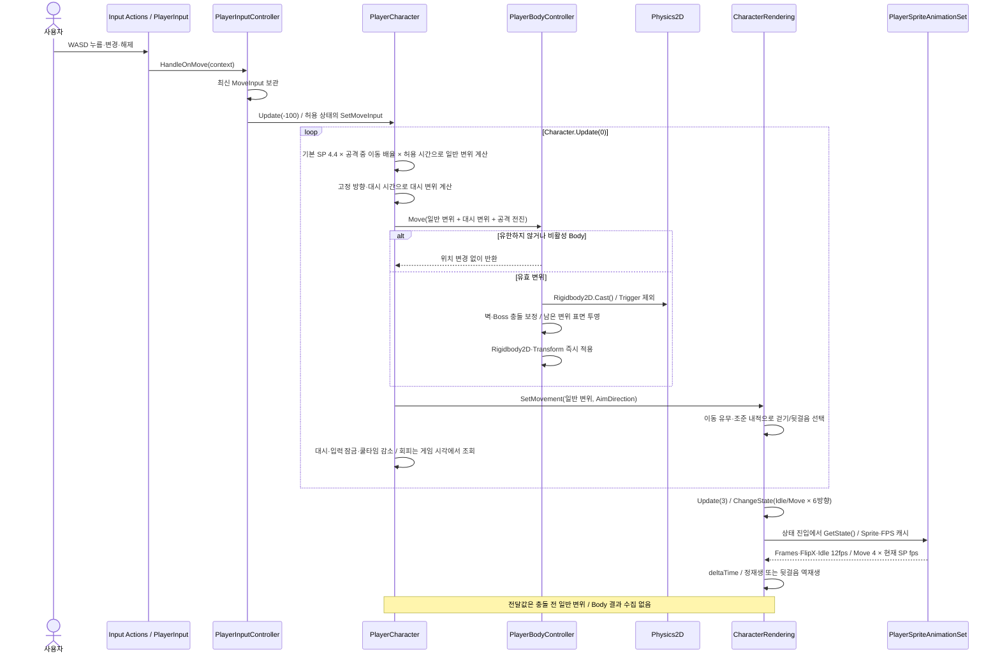
```mermaid
sequenceDiagram
    actor User as 사용자
    participant Actions as Input Actions / PlayerInput
    participant Input as PlayerInputController
    participant Player as PlayerCharacter
    participant Body as PlayerBodyController
    participant Physics as Physics2D
    participant Visual as CharacterRendering
    participant Set as PlayerSpriteAnimationSet
    User->>Actions: WASD 누름·변경·해제
    Actions->>Input: HandleOnMove(context)
    Input->>Input: 최신 MoveInput 보관
    Input->>Player: Update(-100) / 허용 상태의 SetMoveInput
    loop Character.Update(0)
        Player->>Player: 기본 SP 4.4 × 공격 중 이동 배율 × 허용 시간으로 일반 변위 계산
        Player->>Player: 고정 방향·대시 시간으로 대시 변위 계산
        Player->>Body: Move(일반 변위 + 대시 변위 + 공격 전진)
        alt 유한하지 않거나 비활성 Body
            Body-->>Player: 위치 변경 없이 반환
        else 유효 변위
            Body->>Physics: Rigidbody2D.Cast() / Trigger 제외
            Body->>Body: 벽·Boss 충돌 보정 / 남은 변위 표면 투영
            Body->>Body: Rigidbody2D·Transform 즉시 적용
        end
        Player->>Visual: SetMovement(일반 변위, AimDirection)
        Visual->>Visual: 이동 유무·조준 내적으로 걷기/뒷걸음 선택
        Player->>Player: 대시·입력 잠금·쿨타임 감소 / 회피는 게임 시각에서 조회
    end
    Visual->>Visual: Update(3) / ChangeState(Idle/Move × 6방향)
    Visual->>Set: 상태 진입에서 GetState() / Sprite·FPS 캐시
    Set-->>Visual: Frames·FlipX·Idle 12fps / Move 4 × 현재 SP fps
    Visual->>Visual: deltaTime / 정재생 또는 뒷걸음 역재생
    Note over Player,Visual: 전달값은 충돌 전 일반 변위 / Body 결과 수집 없음
```

**② 마우스 이동 → 몸체·무기 방향과 뒷걸음 표현**

화면 좌표를 월드 조준점으로 바꿔 몸체 6방향과 무기의 어깨 회전을 갱신한다.

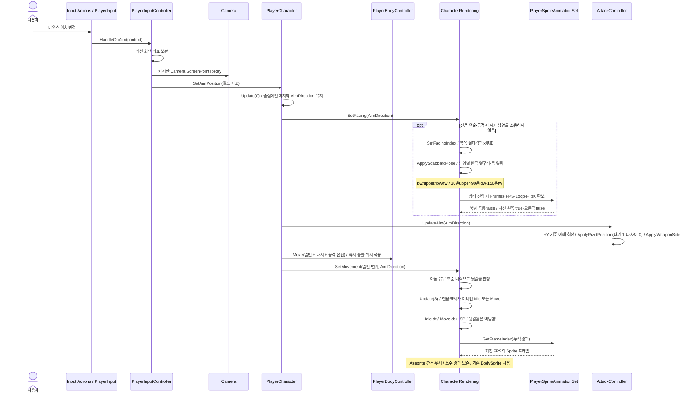
```mermaid
sequenceDiagram
    actor User as 사용자
    participant Actions as Input Actions / PlayerInput
    participant Input as PlayerInputController
    participant Camera
    participant Player as PlayerCharacter
    participant Body as PlayerBodyController
    participant Visual as CharacterRendering
    participant Set as PlayerSpriteAnimationSet
    participant Weapon as AttackController
    User->>Actions: 마우스 위치 변경
    Actions->>Input: HandleOnAim(context)
    Input->>Input: 최신 화면 좌표 보관
    Input->>Camera: 캐시한 Camera.ScreenPointToRay
    Input->>Player: SetAimPosition(월드 좌표)
    Player->>Player: Update(0) / 중심이면 마지막 AimDirection 유지
    Player->>Visual: SetFacing(AimDirection)
    opt 전용 연출·공격·대시가 방향을 소유하지 않음
        Visual->>Visual: SetFacingIndex / 북쪽 절대각과 x부호
        Visual->>Visual: ApplyScabbardPose / 방향별 왼쪽 옆구리·몸 앞뒤
        Note over Visual: bw/upper/low/fw / 30은upper·90은low·150은fw
        Visual->>Set: 상태 진입 시 Frames·FPS·Loop·FlipX 확보
        Set-->>Visual: 북남 공통 false / 사선 왼쪽 true·오른쪽 false
    end
    Player->>Weapon: UpdateAim(AimDirection)
    Weapon->>Weapon: +Y 기준 어깨 회전 / ApplyPivotPosition(대기 1·타 사이 0) / ApplyWeaponSide
    Player->>Body: Move(일반 + 대시 + 공격 전진) / 즉시 충돌·위치 적용
    Player->>Visual: SetMovement(일반 변위, AimDirection)
    Visual->>Visual: 이동 유무·조준 내적으로 뒷걸음 판정
    Visual->>Visual: Update(3) / 전용 표시가 아니면 Idle 또는 Move
    Visual->>Visual: Idle dt / Move dt × SP / 뒷걸음은 역방향
    Visual->>Set: GetFrameIndex(누적 경과)
    Set-->>Visual: 지정 FPS의 Sprite 프레임
    Note over Visual: Aseprite 간격 무시 / 소수 경과 보존 / 기존 BodySprite 사용
```

**③ 씬 서비스 준비·입력 차단 → 멈춤과 재개·Title 정리**

서비스와 대상이 준비된 뒤 입력을 열고 세션 종료 시 참조를 해제한다.

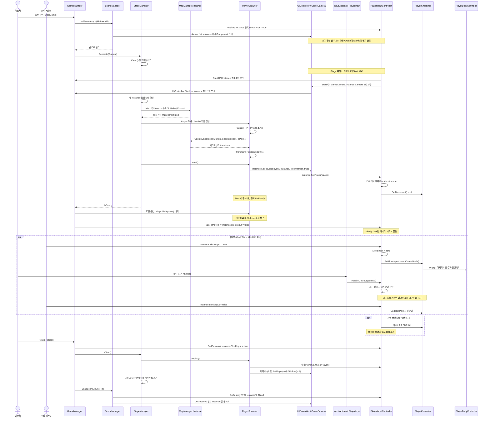
```mermaid
sequenceDiagram
    actor User as 사용자
    actor System as 외부 시스템
    participant GM as GameManager
    participant Scene as SceneManager
    participant Stage as StageManager
    participant Map as MapManager.Instance
    participant Spawner as PlayerSpawner
    participant Services as UIController / GameCamera
    participant Actions as Input Actions / PlayerInput
    participant Input as PlayerInputController
    participant Player as PlayerCharacter
    participant Body as PlayerBodyController
    User->>GM: 슬롯 선택 / StartGame()
    GM->>Scene: LoadSceneAsync(MainWorld)
    Scene->>Input: Awake / Instance 등록·BlockInput = true
    Scene->>Services: Awake / 각 Instance·자기 Component 준비
    Note over Services,Input: 초기 활성 씬 객체의 모든 Awake가 Start보다 먼저 완료
    Scene-->>GM: 씬 로드 완료
    GM->>Stage: Generate(Current)
    Stage->>Stage: Clear()·한 프레임 대기
    Note over Services,Input: Stage 재개 전 PIC·UI의 Start 완료
    Input->>GM: Start에서 Instance 참조 1회 보관
    Input->>Services: Start에서 GameCamera.Instance.Camera 1회 보관
    Services->>GM: UIController.Start에서 Instance 참조 1회 보관
    Stage->>Stage: 세 Instance·활성 상태 확인
    Stage->>Map: Map 복제·Awake 등록 / Initialize(Current)
    Map-->>Stage: 배치 검증 완료 / IsInitialized
    Stage->>Spawner: Player 복제 / Awake 자동 실행
    Spawner->>Spawner: Current HP·기본 상태 초기화
    Spawner->>Map: UpdateCheckpoint(Current.CheckpointId) / 위치 캐시
    Map-->>Spawner: 체크포인트 Transform
    Spawner->>Spawner: Transform·Rigidbody2D 배치
    Stage->>Spawner: Bind()
    Spawner->>Services: Instance.SetPlayer(player) / Instance.Follow(target, true)
    Spawner->>Input: Instance.SetPlayer(player)
    Input->>Input: 기존 대상 해제·BlockInput = true
    Input->>Player: SetMoveInput(zero)
    Note over Spawner: Start 서비스/사건 준비 / IsReady
    Stage-->>GM: IsReady
    GM->>Spawner: 로딩 숨김 / PlayInitialSpawn() 대기
    Note over Spawner: 기상 완료 후 자기 정지·표시 복구
    GM->>Input: 로딩·정지 해제 후 Instance.BlockInput = false
    Note over Input: false는 bool만 해제·키 재조회 없음
    opt 외부 코드가 명시적 이동 차단 설정
        System->>Input: Instance.BlockInput = true
        Input->>Input: MoveInput = zero
        Input->>Player: SetMoveInput(zero)·CancelDash()
        Player->>Body: Stop() / 마지막 이동 결과·관성 정리
        User->>Actions: 차단 중 키 변경·해제
        Actions->>Input: HandleOnMove(context)
        Input->>Input: 최신 값 캐시·이동 전달 생략
        Note over Input,Player: 다른 상태 제한이 없으면 조준·외부 이동 유지
        System->>Input: Instance.BlockInput = false
        Input->>Player: Update에서 캐시 값 전달
    end
    opt 사망·컷씬 상태·시간 정지
        Input->>Player: 이동0·조준 전달 중지
        Note over Input: BlockInput과 별도 상태 조건
    end
    User->>GM: ReturnToTitle()
    GM->>Input: EndSession / Instance.BlockInput = true
    GM->>Stage: Clear()
    Stage->>Spawner: Unbind()
    Spawner->>Input: 자기 Player이면 ClearPlayer()
    Spawner->>Services: 자기 대상이면 SetPlayer(null) / Follow(null)
    Stage->>Stage: 서비스 대상 전체 해제·세션 루트 제거
    GM->>Scene: LoadSceneAsync(Title)
    Scene->>Input: OnDestroy / 현재 Instance일 때 null
    Scene->>Services: OnDestroy / 현재 Instance일 때 null
```

**④ 외부 코드의 Player 재연결·중복 서비스 생성 → 현재 연결 보호**

이전 Player나 중복 서비스가 정리될 때 새 연결을 보존한다.

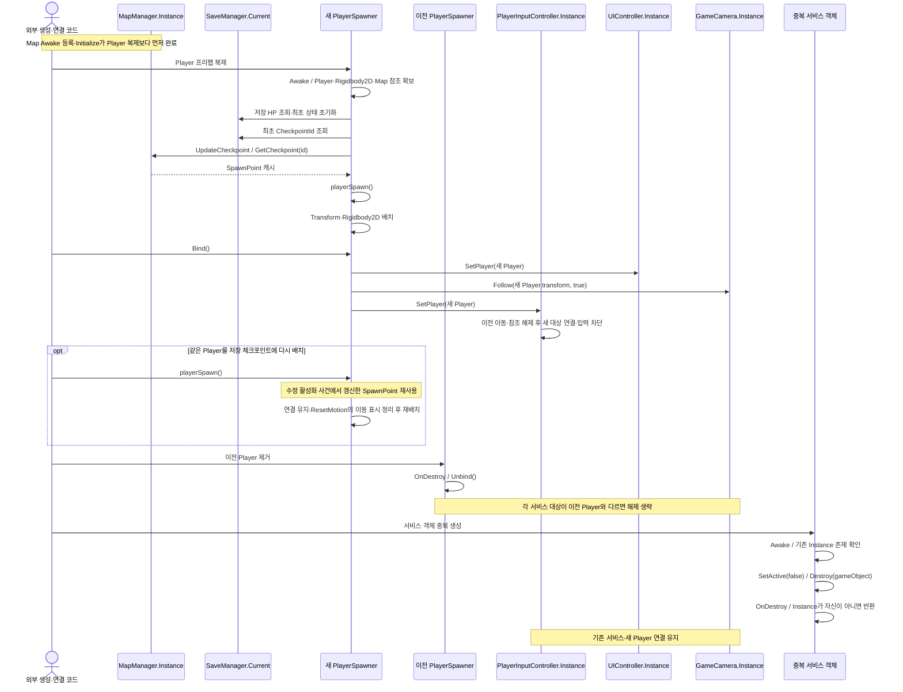
```mermaid
sequenceDiagram
    actor Caller as 외부 생성·연결 코드
    participant Map as MapManager.Instance
    participant Save as SaveManager.Current
    participant New as 새 PlayerSpawner
    participant Old as 이전 PlayerSpawner
    participant Input as PlayerInputController.Instance
    participant UI as UIController.Instance
    participant Camera as GameCamera.Instance
    participant Duplicate as 중복 서비스 객체
    Note over Caller,Map: Map Awake 등록·Initialize가 Player 복제보다 먼저 완료
    Caller->>New: Player 프리팹 복제
    New->>New: Awake / Player·Rigidbody2D·Map 참조 확보
    New->>Save: 저장 HP 조회·최초 상태 초기화
    New->>Save: 최초 CheckpointId 조회
    New->>Map: UpdateCheckpoint / GetCheckpoint(id)
    Map-->>New: SpawnPoint 캐시
    New->>New: playerSpawn()
    New->>New: Transform·Rigidbody2D 배치
    Caller->>New: Bind()
    New->>UI: SetPlayer(새 Player)
    New->>Camera: Follow(새 Player.transform, true)
    New->>Input: SetPlayer(새 Player)
    Input->>Input: 이전 이동·참조 해제 후 새 대상 연결·입력 차단
    opt 같은 Player를 저장 체크포인트에 다시 배치
        Caller->>New: playerSpawn()
        Note over New: 수정 활성화 사건에서 갱신한 SpawnPoint 재사용
        New->>New: 연결 유지·ResetMotion의 이동 표시 정리 후 재배치
    end
    Caller->>Old: 이전 Player 제거
    Old->>Old: OnDestroy / Unbind()
    Note over Old,Camera: 각 서비스 대상이 이전 Player와 다르면 해제 생략
    Caller->>Duplicate: 서비스 객체 중복 생성
    Duplicate->>Duplicate: Awake / 기존 Instance 존재 확인
    Duplicate->>Duplicate: SetActive(false) / Destroy(gameObject)
    Duplicate->>Duplicate: OnDestroy / Instance가 자신이 아니면 반환
    Note over Input,Camera: 기존 서비스·새 Player 연결 유지
```

F-P02 SequenceDiagram

**① Space 입력 → 이동 중/정지 중 방향 확정과 시작 허용**

Space 요청 시 이동 의도와 조준점으로 방향을 정하고 독립 Dash 자세를 고른다.

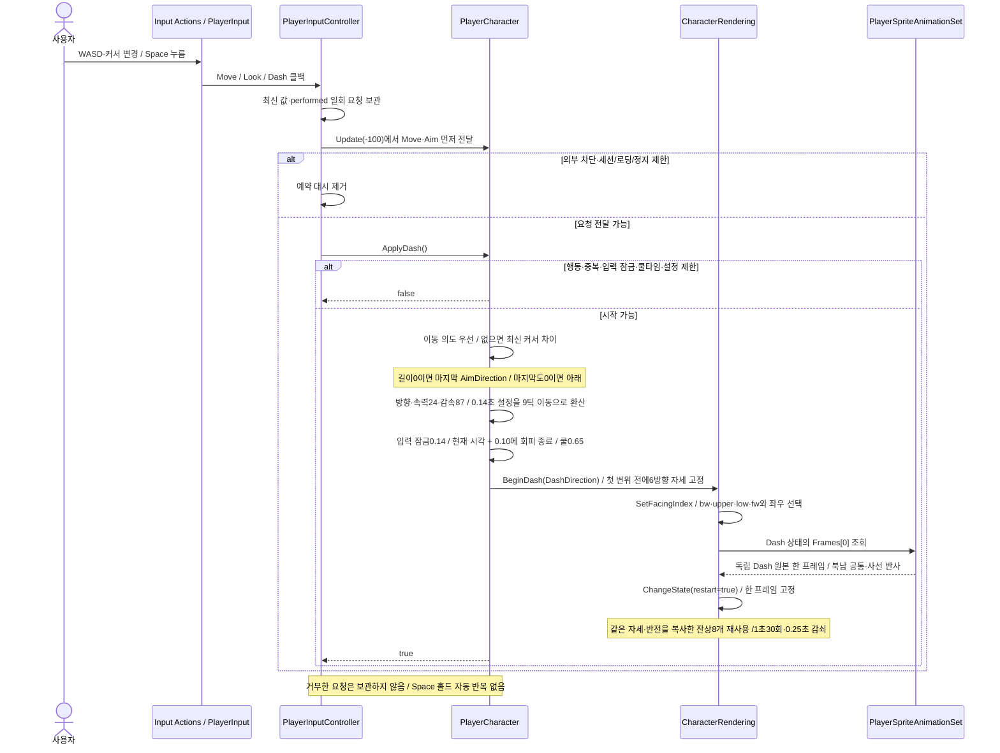
```mermaid
sequenceDiagram
    actor User as 사용자
    participant Actions as Input Actions / PlayerInput
    participant Input as PlayerInputController
    participant Player as PlayerCharacter
    participant Render as CharacterRendering
    participant Set as PlayerSpriteAnimationSet
    User->>Actions: WASD·커서 변경 / Space 누름
    Actions->>Input: Move / Look / Dash 콜백
    Input->>Input: 최신 값·performed 일회 요청 보관
    Input->>Player: Update(-100)에서 Move·Aim 먼저 전달
    alt 외부 차단·세션/로딩/정지 제한
        Input->>Input: 예약 대시 제거
    else 요청 전달 가능
        Input->>Player: ApplyDash()
        alt 행동·중복·입력 잠금·쿨타임·설정 제한
            Player-->>Input: false
        else 시작 가능
            Player->>Player: 이동 의도 우선 / 없으면 최신 커서 차이
            Note over Player: 길이0이면 마지막 AimDirection / 마지막도0이면 아래
            Player->>Player: 방향·속력24·감속87 / 0.14초 설정을 9틱 이동으로 환산
            Player->>Player: 입력 잠금0.14 / 현재 시각 + 0.10에 회피 종료 / 쿨0.65
            Player->>Render: BeginDash(DashDirection) / 첫 변위 전에6방향 자세 고정
            Render->>Render: SetFacingIndex / bw·upper·low·fw와 좌우 선택
            Render->>Set: Dash 상태의 Frames[0] 조회
            Set-->>Render: 독립 Dash 원본 한 프레임 / 북남 공통·사선 반사
            Render->>Render: ChangeState(restart=true) / 한 프레임 고정
            Note over Render: 같은 자세·반전을 복사한 잔상8개 재사용 /1초30회·0.25초 감쇠
            Player-->>Input: true
        end
    end
    Note over Input,Player: 거부한 요청은 보관하지 않음 / Space 홀드 자동 반복 없음
```

**② Character.Update → 대시 변위 계산·즉시 충돌 적용**

렌더 프레임의 게임 시간으로 감속 변위를 계산하고 벽·몸체 충돌을 즉시 반영한다.

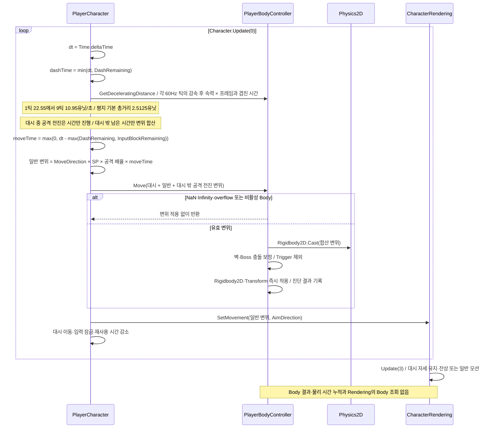
```mermaid
sequenceDiagram
    participant Player as PlayerCharacter
    participant Body as PlayerBodyController
    participant Physics as Physics2D
    participant Visual as CharacterRendering
    loop Character.Update(0)
        Player->>Player: dt = Time.deltaTime
        Player->>Player: dashTime = min(dt, DashRemaining)
        Player->>Body: GetDeceleratingDistance / 각 60Hz 틱의 감속 후 속력 × 프레임과 겹친 시간
        Note over Player: 1틱 22.55에서 9틱 10.95유닛/초 / 평지 기본 총거리 2.5125유닛
        Note over Player: 대시 중 공격 전진은 시간만 진행 / 대시 밖 남은 시간만 변위 합산
        Player->>Player: moveTime = max(0, dt - max(DashRemaining, InputBlockRemaining))
        Player->>Player: 일반 변위 = MoveDirection × SP × 공격 배율 × moveTime
        Player->>Body: Move(대시 + 일반 + 대시 밖 공격 전진 변위)
        alt NaN·Infinity·overflow 또는 비활성 Body
            Body-->>Player: 변위 적용 없이 반환
        else 유효 변위
            Body->>Physics: Rigidbody2D.Cast(합산 변위)
            Body->>Body: 벽·Boss 충돌 보정 / Trigger 제외
            Body->>Body: Rigidbody2D·Transform 즉시 적용 / 진단 결과 기록
        end
        Player->>Visual: SetMovement(일반 변위, AimDirection)
        Player->>Player: 대시 이동·입력 잠금·재사용 시간 감소
    end
    Visual->>Visual: Update(3) / 대시 자세 유지·잔상 또는 일반 모션
    Note over Body,Visual: Body 결과·물리 시간 누적과 Rendering의 Body 조회 없음
```

**③ 키 유지·해제와 시간 경과 → 독립 타이머·일반 이동 복원·재사용**

이동·회피·입력 잠금·재사용 시간은 각각 만료된다.

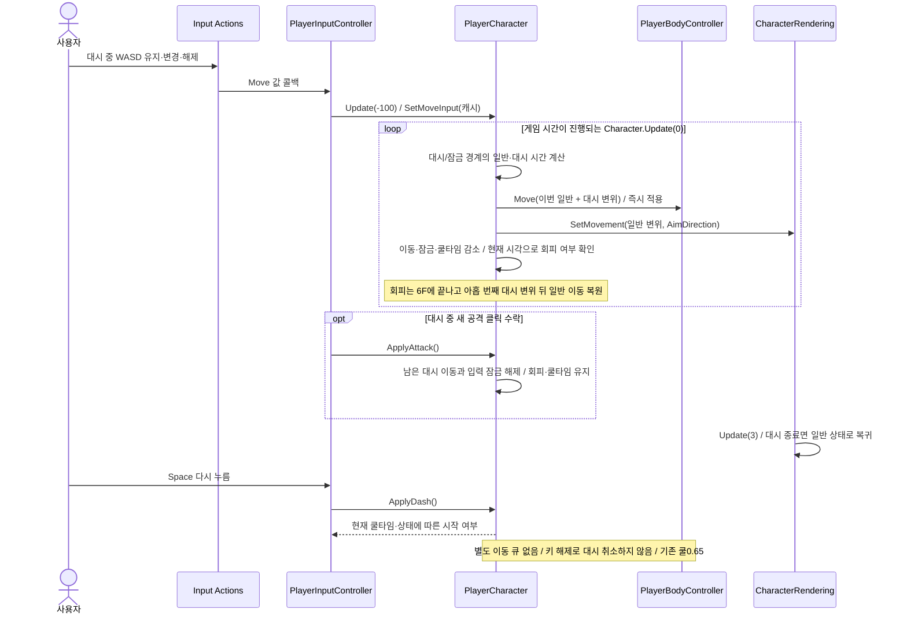
```mermaid
sequenceDiagram
    actor User as 사용자
    participant Actions as Input Actions
    participant Input as PlayerInputController
    participant Player as PlayerCharacter
    participant Body as PlayerBodyController
    participant Visual as CharacterRendering
    User->>Actions: 대시 중 WASD 유지·변경·해제
    Actions->>Input: Move 값 콜백
    Input->>Player: Update(-100) / SetMoveInput(캐시)
    loop 게임 시간이 진행되는 Character.Update(0)
        Player->>Player: 대시/잠금 경계의 일반·대시 시간 계산
        Player->>Body: Move(이번 일반 + 대시 변위) / 즉시 적용
        Player->>Visual: SetMovement(일반 변위, AimDirection)
        Player->>Player: 이동·잠금·쿨타임 감소 / 현재 시각으로 회피 여부 확인
        Note over Player: 회피는 6F에 끝나고 아홉 번째 대시 변위 뒤 일반 이동 복원
    end
    opt 대시 중 새 공격 클릭 수락
        Input->>Player: ApplyAttack()
        Player->>Player: 남은 대시 이동과 입력 잠금 해제 / 회피·쿨타임 유지
    end
    Visual->>Visual: Update(3) / 대시 종료면 일반 상태로 복귀
    User->>Input: Space 다시 누름
    Input->>Player: ApplyDash()
    Player-->>Input: 현재 쿨타임·상태에 따른 시작 여부
    Note over Player,Body: 별도 이동 큐 없음 / 키 해제로 대시 취소하지 않음 / 기존 쿨0.65
```

**④ 외부 차단·사망·컷씬·시간 정지·재배치 → 취소와 리셋**

사망·차단·재배치는 대시를 취소하고, 시간 정지는 진행 중인 타이머를 보존한다.

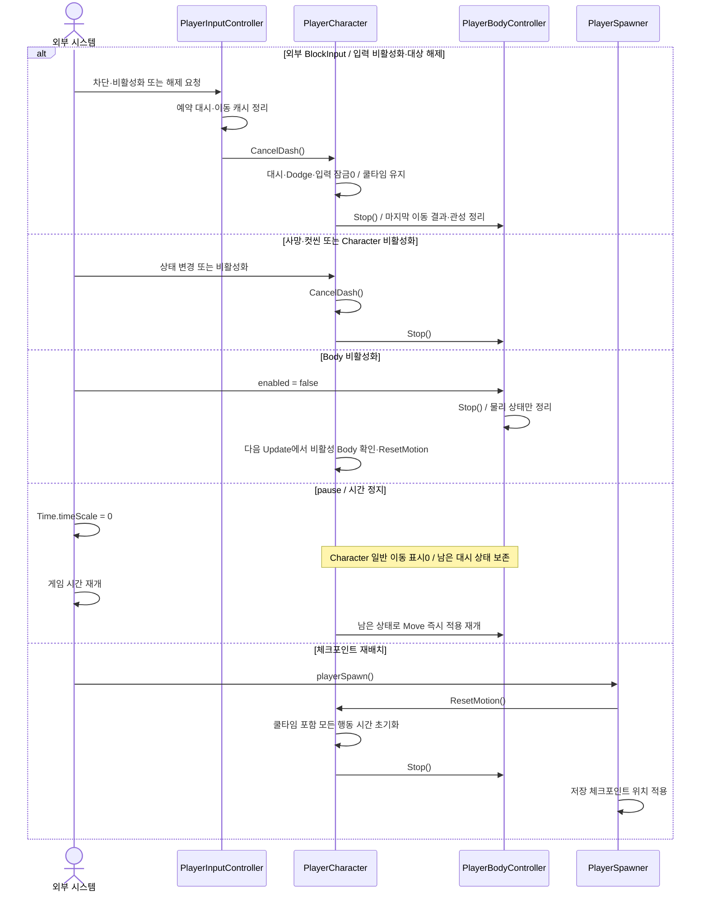
```mermaid
sequenceDiagram
    actor Caller as 외부 시스템
    participant Input as PlayerInputController
    participant Player as PlayerCharacter
    participant Body as PlayerBodyController
    participant Spawner as PlayerSpawner
    alt 외부 BlockInput / 입력 비활성화·대상 해제
        Caller->>Input: 차단·비활성화 또는 해제 요청
        Input->>Input: 예약 대시·이동 캐시 정리
        Input->>Player: CancelDash()
        Player->>Player: 대시·Dodge·입력 잠금0 / 쿨타임 유지
        Player->>Body: Stop() / 마지막 이동 결과·관성 정리
    else 사망·컷씬 또는 Character 비활성화
        Caller->>Player: 상태 변경 또는 비활성화
        Player->>Player: CancelDash()
        Player->>Body: Stop()
    else Body 비활성화
        Caller->>Body: enabled = false
        Body->>Body: Stop() / 물리 상태만 정리
        Player->>Player: 다음 Update에서 비활성 Body 확인·ResetMotion
    else pause / 시간 정지
        Caller->>Caller: Time.timeScale = 0
        Note over Player,Body: Character 일반 이동 표시0 / 남은 대시 상태 보존
        Caller->>Caller: 게임 시간 재개
        Player->>Body: 남은 상태로 Move 즉시 적용 재개
    else 체크포인트 재배치
        Caller->>Spawner: playerSpawn()
        Spawner->>Player: ResetMotion()
        Player->>Player: 쿨타임 포함 모든 행동 시간 초기화
        Player->>Body: Stop()
        Spawner->>Spawner: 저장 체크포인트 위치 적용
    end
```

F-P03 SequenceDiagram

**① 좌클릭 누름·해제 → 일회 눌림·홀드 전달과 공격 허용·방향 확정**

좌클릭 누름·홀드와 유효 조준 방향을 받아 같은 타격을 중복 시작하지 않는다.

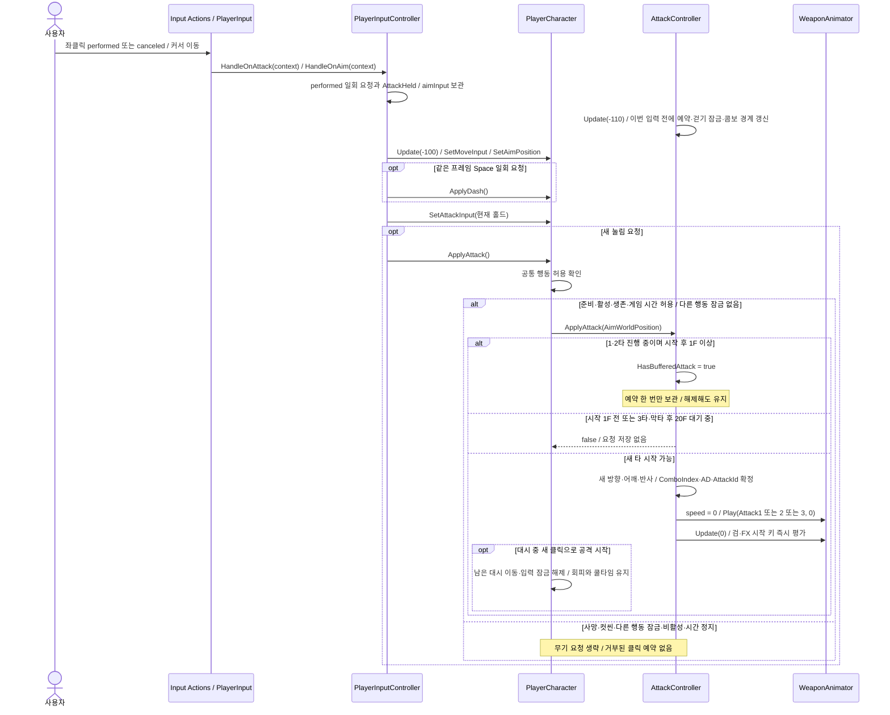
```mermaid
sequenceDiagram
    actor User as 사용자
    participant Actions as Input Actions / PlayerInput
    participant Input as PlayerInputController
    participant Player as PlayerCharacter
    participant Attack as AttackController
    participant Animator as WeaponAnimator
    User->>Actions: 좌클릭 performed 또는 canceled / 커서 이동
    Actions->>Input: HandleOnAttack(context) / HandleOnAim(context)
    Input->>Input: performed 일회 요청과 AttackHeld / aimInput 보관
    Attack->>Attack: Update(-110) / 이번 입력 전에 예약·걷기 잠금·콤보 경계 갱신
    Input->>Player: Update(-100) / SetMoveInput / SetAimPosition
    opt 같은 프레임 Space 일회 요청
        Input->>Player: ApplyDash()
    end
    Input->>Player: SetAttackInput(현재 홀드)
    opt 새 눌림 요청
        Input->>Player: ApplyAttack()
        Player->>Player: 공통 행동 허용 확인
        alt 준비·활성·생존·게임 시간 허용 / 다른 행동 잠금 없음
            Player->>Attack: ApplyAttack(AimWorldPosition)
            alt 1·2타 진행 중이며 시작 후 1F 이상
                Attack->>Attack: HasBufferedAttack = true
                Note over Attack: 예약 한 번만 보관 / 해제해도 유지
            else 시작 1F 전 또는 3타·막타 후 20F 대기 중
                Attack-->>Player: false / 요청 저장 없음
            else 새 타 시작 가능
                Attack->>Attack: 새 방향·어깨·반사 / ComboIndex·AD·AttackId 확정
                Attack->>Animator: speed = 0 / Play(Attack1 또는 2 또는 3, 0)
                Attack->>Animator: Update(0) / 검·FX 시작 키 즉시 평가
                opt 대시 중 새 클릭으로 공격 시작
                    Player->>Player: 남은 대시 이동·입력 잠금 해제 / 회피와 쿨타임 유지
                end
            end
        else 사망·컷씬·다른 행동 잠금·비활성·시간 정지
            Note over Player,Attack: 무기 요청 생략 / 거부된 클릭 예약 없음
        end
    end
```

**② 공격 중 이동·조준 변경 → 입력 이동 차단·강제 전진과 시작 방향 유지**

공격 도중 무기와 FX가 같은 AS 적용 클립을 따르고 몸체 프레임은 별도 재생한다.

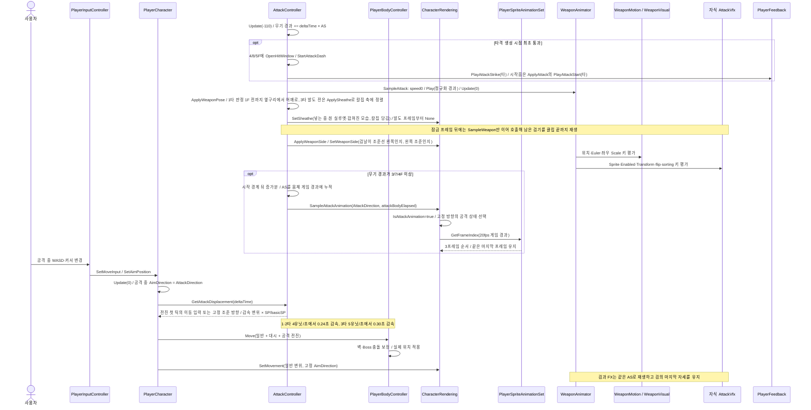
```mermaid
sequenceDiagram
    actor User as 사용자
    participant Input as PlayerInputController
    participant Player as PlayerCharacter
    participant Attack as AttackController
    participant Body as PlayerBodyController
    participant Visual as CharacterRendering
    participant Set as PlayerSpriteAnimationSet
    participant Animator as WeaponAnimator
    participant Motion as WeaponMotion / WeaponVisual
    participant Fx as 자식 AttackVfx
    participant Feedback as PlayerFeedback
    Attack->>Attack: Update(-110) / 무기 경과 += deltaTime × AS
    opt 타격 생성 시점 최초 통과
        Attack->>Attack: 4/8/5F에 OpenHitWindow / StartAttackDash
        Attack->>Feedback: PlayAttackStrike(타) / 시작음은 ApplyAttack의 PlayAttackStart(타)
    end
    Attack->>Animator: SampleAttack: speed0 / Play(정규화 경과) / Update(0)
    Attack->>Attack: ApplyWeaponPose / 1타 판정 1F 전까지 옆구리에서 어깨로, 3타 발도 전은 ApplySheathe로 칼집 축에 정렬
    Attack->>Visual: SetSheathe(넣는 중·흰 실루엣·합쳐진 모습, 칼집 당김) / 발도 프레임부터 None
    Note over Attack,Fx: 잠금 프레임 뒤에는 SampleWeapon만 이어 호출해 남은 검기를 클립 끝까지 재생
    Attack->>Visual: ApplyWeaponSide / SetWeaponSide(검날이 조준선 왼쪽인지, 왼쪽 조준인지)
    Animator->>Motion: 위치·Euler·좌우 Scale 키 평가
    Animator->>Fx: Sprite·Enabled·Transform·flip·sorting 키 평가
    opt 무기 경과가 3/7/4F 이상
        Attack->>Attack: 시작 경계 뒤 증가분 / AS를 몸체 게임 경과에 누적
        Attack->>Visual: SampleAttackAnimation(AttackDirection, attackBodyElapsed)
        Visual->>Visual: IsAttackAnimation=true / 고정 방향의 공격 상태 선택
        Visual->>Set: GetFrameIndex(20fps 게임 경과)
        Set-->>Visual: 3프레임 순서 / 끝은 마지막 프레임 유지
    end
    User->>Input: 공격 중 WASD·커서 변경
    Input->>Player: SetMoveInput / SetAimPosition
    Player->>Player: Update(0) / 공격 중 AimDirection = AttackDirection
    Player->>Attack: GetAttackDisplacement(deltaTime)
    Attack-->>Player: 전진 첫 틱의 이동 입력 또는 고정 조준 방향 / 감속 변위 × SP/basicSP
    Note over Attack,Body: 1·2타 4유닛/초에서 0.24초 감속, 3타 5유닛/초에서 0.30초 감속
    Player->>Body: Move(일반 + 대시 + 공격 전진)
    Body->>Body: 벽·Boss 충돌 보정 / 실제 위치 적용
    Player->>Visual: SetMovement(일반 변위, 고정 AimDirection)
    Note over Animator,Fx: 검과 FX는 같은 AS로 재생하고 검의 마지막 자세를 유지
```

**③ 판정 구간 도달 → 독립 수명·실제 Collider 조회·중복 방지·피해 적용**

타격 시점에 고정한 피해·방향·수신자 목록을 한 공격의 판정 수명 동안 유지한다.

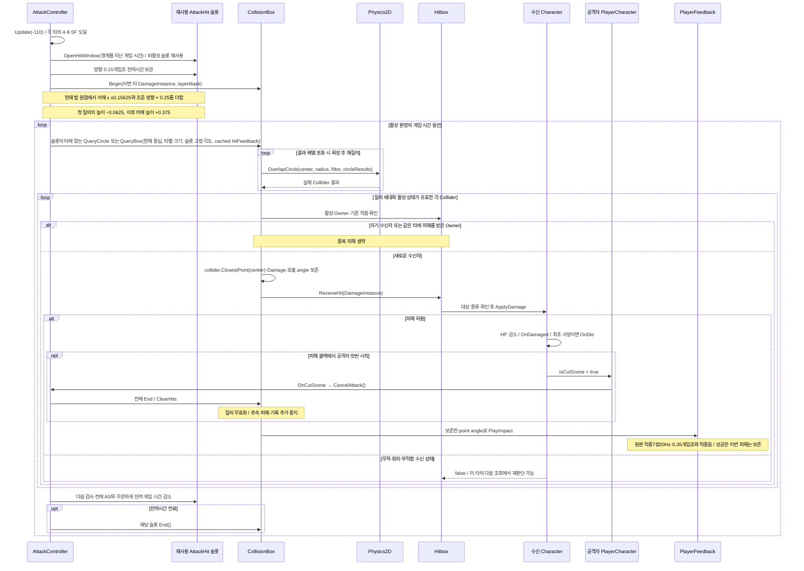
```mermaid
sequenceDiagram
    participant Attack as AttackController
    participant Hit as 재사용 AttackHit 슬롯
    participant HitQuery as CollisionBox
    participant Physics as Physics2D
    participant Hitbox
    participant Target as 수신 Character
    participant Player as 공격자 PlayerCharacter
    participant Feedback as PlayerFeedback
    Attack->>Attack: Update(-110) / 각 타의 4·8·5F 도달
    Attack->>Hit: OpenHitWindow(경계를 지난 게임 시간) / 비활성 슬롯 재사용
    Attack->>Hit: 방향·0.15게임초 잔여시간 보관
    Attack->>HitQuery: Begin(이번 타 DamageInstance, layerMask)
    Note over Attack,Hit: 현재 발 원점에서 어깨 x ±0.15625와 조준 방향 × 0.25를 더함
    Note over Attack,Hit: 첫 질의의 높이 −0.0625, 이후 어깨 높이 +0.375
    loop 활성 판정의 게임 시간 동안
        Attack->>HitQuery: 슬롯의 타에 맞는 QueryCircle 또는 QueryBox(현재 중심, 타별 크기, 슬롯 고정 각도, cached hitFeedback)
        loop 결과 배열 포화 시 확장 후 재질의
            HitQuery->>Physics: OverlapCircle(center, radius, filter, circleResults)
            Physics-->>HitQuery: 실제 Collider 결과
        end
        loop 질의 세대와 활성 상태가 유효한 각 Collider
            HitQuery->>Hitbox: 활성·Owner·기존 적중 확인
            alt 자기 수신자 또는 같은 타에 피해를 받은 Owner
                Note over HitQuery,Hitbox: 중복 피해 생략
            else 새로운 수신자
                HitQuery->>HitQuery: collider.ClosestPoint(center)·Damage·호출 angle 보존
                HitQuery->>Hitbox: ReceiveHit(DamageInstance)
                Hitbox->>Target: 대상 종류 확인 후 ApplyDamage
                alt 피해 허용
                    Target->>Target: HP 감소 / OnDamaged / 최초 사망이면 OnDie
                    opt 피해 콜백에서 공격자 컷씬 시작
                        Target->>Player: IsCutScene = true
                        Player->>Attack: OnCutScene → CancelAttack()
                        Attack->>HitQuery: 전체 End / ClearHits
                        Note over HitQuery: 질의 무효화 / 후속 피해·기록 추가 중지
                    end
                    HitQuery->>Feedback: 보존한 point·angle로 PlayImpact
                    Note over Feedback: 원본 적중7장20Hz·0.35게임초와 적중음 / 성공한 이번 피해는 보존
                else 무적·회피·부적합 수신 상태
                    Target-->>Hitbox: false / 이 타의 다음 조회에서 재판단 가능
                end
            end
        end
        Attack->>Hit: 다음 검사 전에 AS와 무관하게 잔여 게임 시간 감소
        opt 잔여시간 만료
            Attack->>HitQuery: 해당 슬롯 End()
        end
    end
```

**④ 홀드·허용 클릭 예약·해제·시간 만료 →3콤보와 다음 공격**

허용 구간의 다음 클릭을 예약하거나 홀드 상태에서 연속 공격하고 시간이 지나면 콤보를 초기화한다.

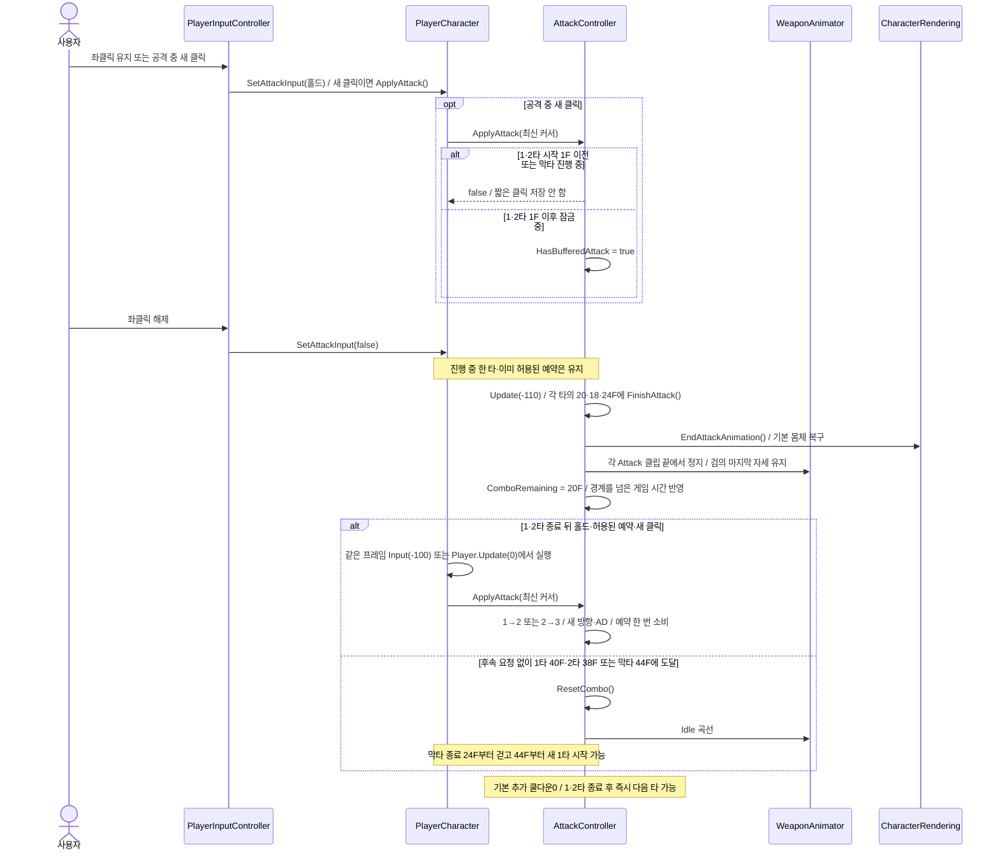
```mermaid
sequenceDiagram
    actor User as 사용자
    participant Input as PlayerInputController
    participant Player as PlayerCharacter
    participant Attack as AttackController
    participant Animator as WeaponAnimator
    participant Visual as CharacterRendering
    User->>Input: 좌클릭 유지 또는 공격 중 새 클릭
    Input->>Player: SetAttackInput(홀드) / 새 클릭이면 ApplyAttack()
    opt 공격 중 새 클릭
        Player->>Attack: ApplyAttack(최신 커서)
        alt 1·2타 시작 1F 이전 또는 막타 진행 중
            Attack-->>Player: false / 짧은 클릭 저장 안 함
        else 1·2타 1F 이후 잠금 중
            Attack->>Attack: HasBufferedAttack = true
        end
    end
    User->>Input: 좌클릭 해제
    Input->>Player: SetAttackInput(false)
    Note over Player,Attack: 진행 중 한 타·이미 허용된 예약은 유지
    Attack->>Attack: Update(-110) / 각 타의 20·18·24F에 FinishAttack()
    Attack->>Visual: EndAttackAnimation() / 기본 몸체 복구
    Attack->>Animator: 각 Attack 클립 끝에서 정지 / 검의 마지막 자세 유지
    Attack->>Attack: ComboRemaining = 20F / 경계를 넘은 게임 시간 반영
    alt 1·2타 종료 뒤 홀드·허용된 예약·새 클릭
        Player->>Player: 같은 프레임 Input(-100) 또는 Player.Update(0)에서 실행
        Player->>Attack: ApplyAttack(최신 커서)
        Attack->>Attack: 1→2 또는 2→3 / 새 방향·AD / 예약 한 번 소비
    else 후속 요청 없이 1타 40F·2타 38F 또는 막타 44F에 도달
        Attack->>Attack: ResetCombo()
        Attack->>Animator: Idle 곡선
        Note over Player,Attack: 막타 종료 24F부터 걷고 44F부터 새 1타 시작 가능
    end
    Note over Attack: 기본 추가 쿨다운0 / 1·2타 종료 후 즉시 다음 타 가능
```

**⑤ 차단·사망·비활성화·시간 정지·재배치 → 중단 또는 상태 보존**

중단 경계에서 전진·판정·예약과 무기 표현을 정리한다.

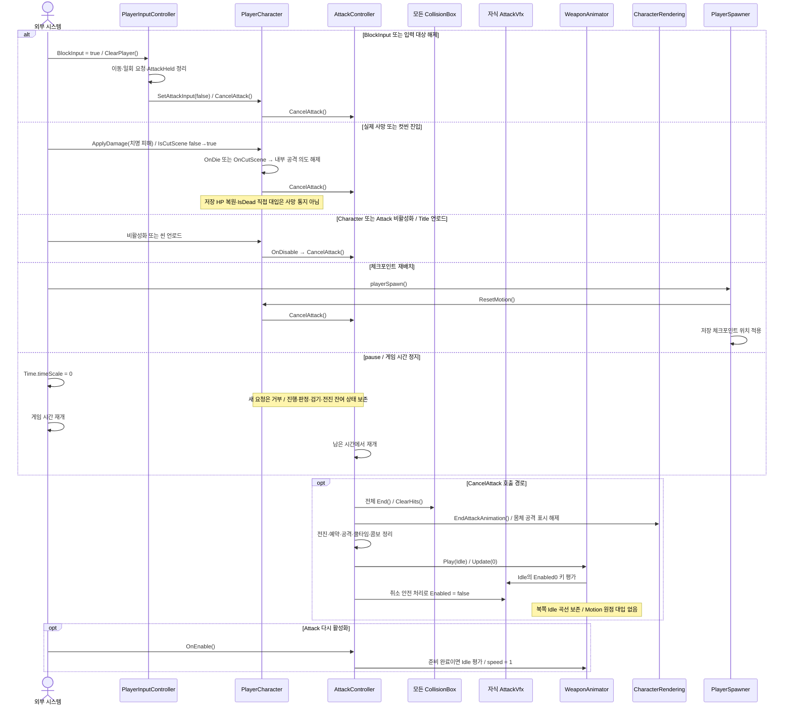
```mermaid
sequenceDiagram
    actor Caller as 외부 시스템
    participant Input as PlayerInputController
    participant Player as PlayerCharacter
    participant Attack as AttackController
    participant HitQuery as 모든 CollisionBox
    participant Fx as 자식 AttackVfx
    participant Animator as WeaponAnimator
    participant Visual as CharacterRendering
    participant Spawner as PlayerSpawner
    alt BlockInput 또는 입력 대상 해제
        Caller->>Input: BlockInput = true / ClearPlayer()
        Input->>Input: 이동·일회 요청·AttackHeld 정리
        Input->>Player: SetAttackInput(false) / CancelAttack()
        Player->>Attack: CancelAttack()
    else 실제 사망 또는 컷씬 진입
        Caller->>Player: ApplyDamage(치명 피해) / IsCutScene false→true
        Player->>Player: OnDie 또는 OnCutScene → 내부 공격 의도 해제
        Player->>Attack: CancelAttack()
        Note over Player: 저장 HP 복원·IsDead 직접 대입은 사망 통지 아님
    else Character 또는 Attack 비활성화 / Title 언로드
        Caller->>Player: 비활성화 또는 씬 언로드
        Player->>Attack: OnDisable → CancelAttack()
    else 체크포인트 재배치
        Caller->>Spawner: playerSpawn()
        Spawner->>Player: ResetMotion()
        Player->>Attack: CancelAttack()
        Spawner->>Spawner: 저장 체크포인트 위치 적용
    else pause / 게임 시간 정지
        Caller->>Caller: Time.timeScale = 0
        Note over Player,Attack: 새 요청은 거부 / 진행·판정·검기·전진 잔여 상태 보존
        Caller->>Caller: 게임 시간 재개
        Attack->>Attack: 남은 시간에서 재개
    end
    opt CancelAttack 호출 경로
        Attack->>HitQuery: 전체 End() / ClearHits()
        Attack->>Visual: EndAttackAnimation() / 몸체 공격 표시 해제
        Attack->>Attack: 전진·예약·공격·쿨타임·콤보 정리
        Attack->>Animator: Play(Idle) / Update(0)
        Animator->>Fx: Idle의 Enabled0 키 평가
        Attack->>Fx: 취소 안전 처리로 Enabled = false
        Note over Animator: 북쪽 Idle 곡선 보존 / Motion 원점 대입 없음
    end
    opt Attack 다시 활성화
        Caller->>Attack: OnEnable()
        Attack->>Animator: 준비 완료이면 Idle 평가 / speed = 1
    end
```

F-P04 SequenceDiagram

**① 일반 Shift → 공통 시작 허용·스킬 진입과 전용 맵 전환**

Shift가 들어오면 행동 가능 여부와 Draw 대기를 검사하고 전용 입력·화면·정지를 적용한다.

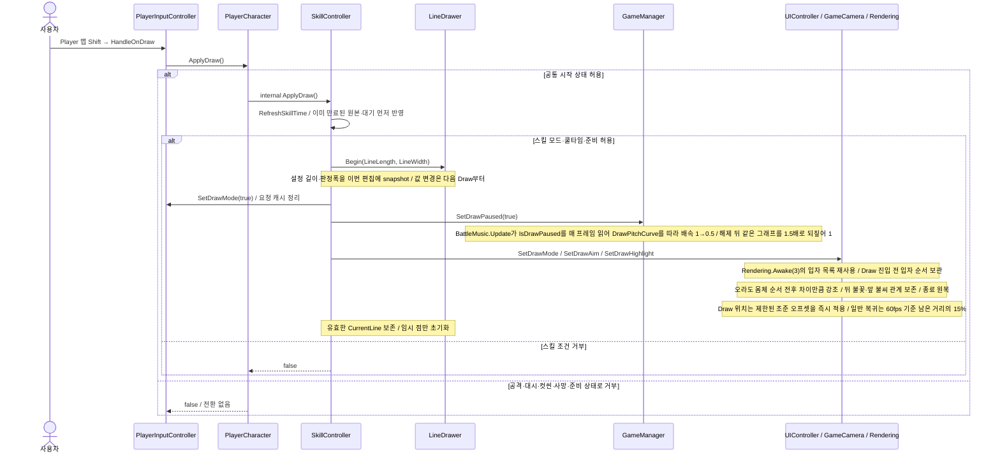
```mermaid
sequenceDiagram
    actor User as 사용자
    participant Input as PlayerInputController
    participant Player as PlayerCharacter
    participant Skill as SkillController
    participant Drawer as LineDrawer
    participant GM as GameManager
    participant View as UIController / GameCamera / Rendering
    User->>Input: Player 맵 Shift → HandleOnDraw
    Input->>Player: ApplyDraw()
    alt 공통 시작 상태 허용
        Player->>Skill: internal ApplyDraw()
        Skill->>Skill: RefreshSkillTime / 이미 만료된 원본·대기 먼저 반영
        alt 스킬 모드·쿨타임·준비 허용
            Skill->>Drawer: Begin(LineLength, LineWidth)
            Note over Skill,Drawer: 설정 길이·판정폭을 이번 편집에 snapshot / 값 변경은 다음 Draw부터
            Skill->>Input: SetDrawMode(true) / 요청 캐시 정리
            Skill->>GM: SetDrawPaused(true)
            Note over GM: BattleMusic.Update가 IsDrawPaused를 매 프레임 읽어 DrawPitchCurve를 따라 배속 1→0.5 / 해제 뒤 같은 그래프를 1.5배로 되짚어 1
            Skill->>View: SetDrawMode / SetDrawAim / SetDrawHighlight
            Note over View: Rendering.Awake(3)의 입자 목록 재사용 / Draw 진입 전 입자 순서 보관
            Note over View: 오라도 몸체 순서 전후 차이만큼 강조 / 뒤 불꽃·앞 불씨 관계 보존 / 종료 원복
            Note over View: Draw 위치는 제한된 조준 오프셋을 즉시 적용 / 일반 복귀는 60fps 기준 남은 거리의 15%
            Note over Skill,Drawer: 유효한 CurrentLine 보존 / 임시 점만 초기화
        else 스킬 조건 거부
            Skill-->>Player: false
        end
    else 공격·대시·컷씬·사망·준비 상태로 거부
        Player-->>Input: false / 전환 없음
    end
```

**② 정지 중 M1·커서·R·F → 임시 기하·표현과 확정 종료**

게임이 정지한 동안 마우스·R·F로 편집하고 확정 시 일반 입력으로 복귀한다.

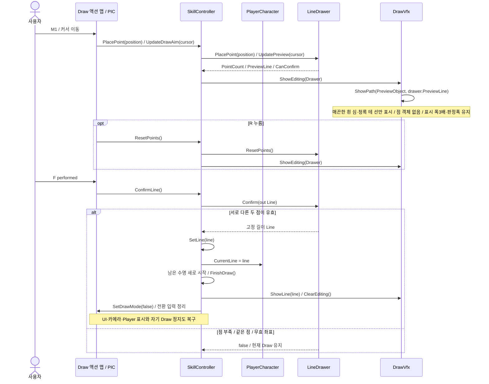
```mermaid
sequenceDiagram
    actor User as 사용자
    participant Input as Draw 액션 맵 / PIC
    participant Skill as SkillController
    participant Player as PlayerCharacter
    participant Drawer as LineDrawer
    participant Vfx as DrawVfx
    User->>Input: M1 / 커서 이동
    Input->>Skill: PlacePoint(position) / UpdateDrawAim(cursor)
    Skill->>Drawer: PlacePoint(position) / UpdatePreview(cursor)
    Drawer-->>Skill: PointCount / PreviewLine / CanConfirm
    Skill->>Vfx: ShowEditing(Drawer)
    Vfx->>Vfx: ShowPath(PreviewObject, drawer.PreviewLine)
    Note over Vfx: 매끈한 흰 심·청록 테 선만 표시 / 점 객체 없음 / 표시 폭3배·판정폭 유지
    opt R 누름
        Input->>Skill: ResetPoints()
        Skill->>Drawer: ResetPoints()
        Skill->>Vfx: ShowEditing(Drawer)
    end
    User->>Input: F performed
    Input->>Skill: ConfirmLine()
    Skill->>Drawer: Confirm(out Line)
    alt 서로 다른 두 점이 유효
        Drawer-->>Skill: 고정 길이 Line
        Skill->>Skill: SetLine(line)
        Skill->>Player: CurrentLine = line
        Skill->>Skill: 남은 수명 새로 시작 / FinishDraw()
        Skill->>Vfx: ShowLine(line) / ClearEditing()
        Skill->>Input: SetDrawMode(false) / 전환 입력 정리
        Note over Skill,Input: UI·카메라·Player 표시와 자기 Draw 정지도 복구
    else 점 부족 / 같은 점 / 무효 좌표
        Drawer-->>Skill: false / 현재 Draw 유지
    end
```

**③ 기존 Line이 있는 재Draw·Shift 취소 → 임시 편집만 정리**

편집 중 Shift 취소는 기존 확정 선을 보존한다.

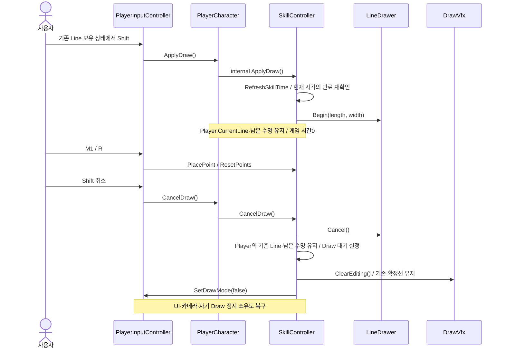
```mermaid
sequenceDiagram
    actor User as 사용자
    participant Input as PlayerInputController
    participant Player as PlayerCharacter
    participant Skill as SkillController
    participant Drawer as LineDrawer
    participant Vfx as DrawVfx
    User->>Input: 기존 Line 보유 상태에서 Shift
    Input->>Player: ApplyDraw()
    Player->>Skill: internal ApplyDraw()
    Skill->>Skill: RefreshSkillTime / 현재 시각의 만료 재확인
    Skill->>Drawer: Begin(length, width)
    Note over Player,Skill: Player.CurrentLine·남은 수명 유지 / 게임 시간0
    User->>Input: M1 / R
    Input->>Skill: PlacePoint / ResetPoints
    User->>Input: Shift 취소
    Input->>Player: CancelDraw()
    Player->>Skill: CancelDraw()
    Skill->>Drawer: Cancel()
    Skill->>Skill: Player의 기존 Line·남은 수명 유지 / Draw 대기 설정
    Skill->>Vfx: ClearEditing() / 기존 확정선 유지
    Skill->>Input: SetDrawMode(false)
    Note over Skill,Input: UI·카메라·자기 Draw 정지 소유도 복구
```

**④ 사망·컷씬·차단·비활성화 → 명시적 중단과 상태 복구**

차단·사망·비활성화 시 중단 원인에 맞춰 편집 상태와 입력을 정리한다.

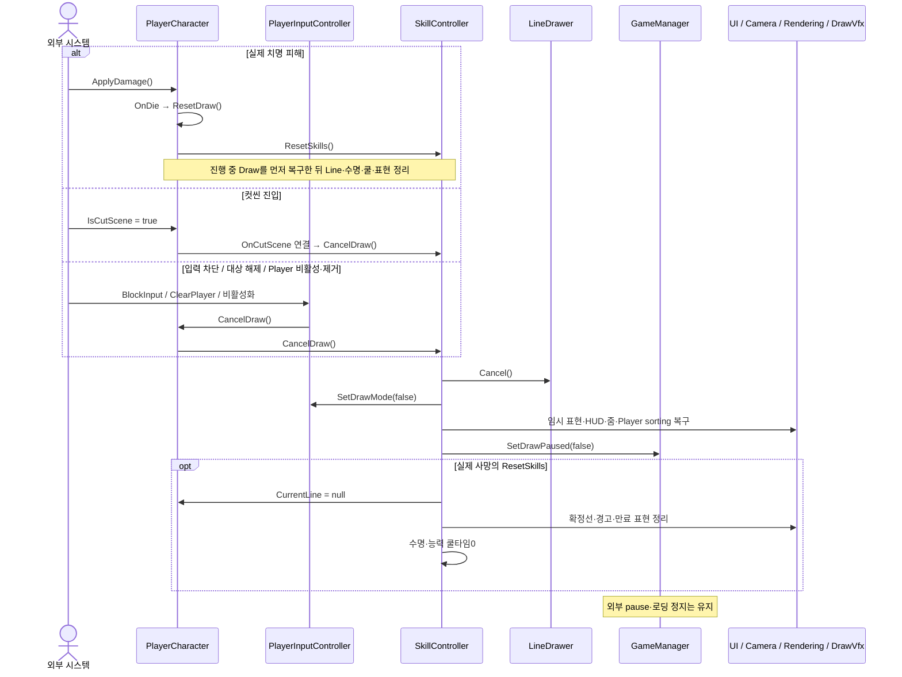
```mermaid
sequenceDiagram
    actor Caller as 외부 시스템
    participant Player as PlayerCharacter
    participant Input as PlayerInputController
    participant Skill as SkillController
    participant Drawer as LineDrawer
    participant GM as GameManager
    participant View as UI / Camera / Rendering / DrawVfx
    alt 실제 치명 피해
        Caller->>Player: ApplyDamage()
        Player->>Player: OnDie → ResetDraw()
        Player->>Skill: ResetSkills()
        Note over Player,Skill: 진행 중 Draw를 먼저 복구한 뒤 Line·수명·쿨·표현 정리
    else 컷씬 진입
        Caller->>Player: IsCutScene = true
        Player->>Skill: OnCutScene 연결 → CancelDraw()
    else 입력 차단 / 대상 해제 / Player 비활성·제거
        Caller->>Input: BlockInput / ClearPlayer / 비활성화
        Input->>Player: CancelDraw()
        Player->>Skill: CancelDraw()
    end
    Skill->>Drawer: Cancel()
    Skill->>Input: SetDrawMode(false)
    Skill->>View: 임시 표현·HUD·줌·Player sorting 복구
    Skill->>GM: SetDrawPaused(false)
    opt 실제 사망의 ResetSkills
        Skill->>Player: CurrentLine = null
        Skill->>View: 확정선·경고·만료 표현 정리
        Skill->>Skill: 수명·능력 쿨타임0
    end
    Note over GM: 외부 pause·로딩 정지는 유지
```

**⑤ 시간0의 커서·ETG식 제한 조준 카메라와 외부 pause 중첩 → 자기 소유만 복구**

조준 카메라는 실제 시간으로 반응하고 외부 정지와 Draw 정지는 독립적으로 해제한다.

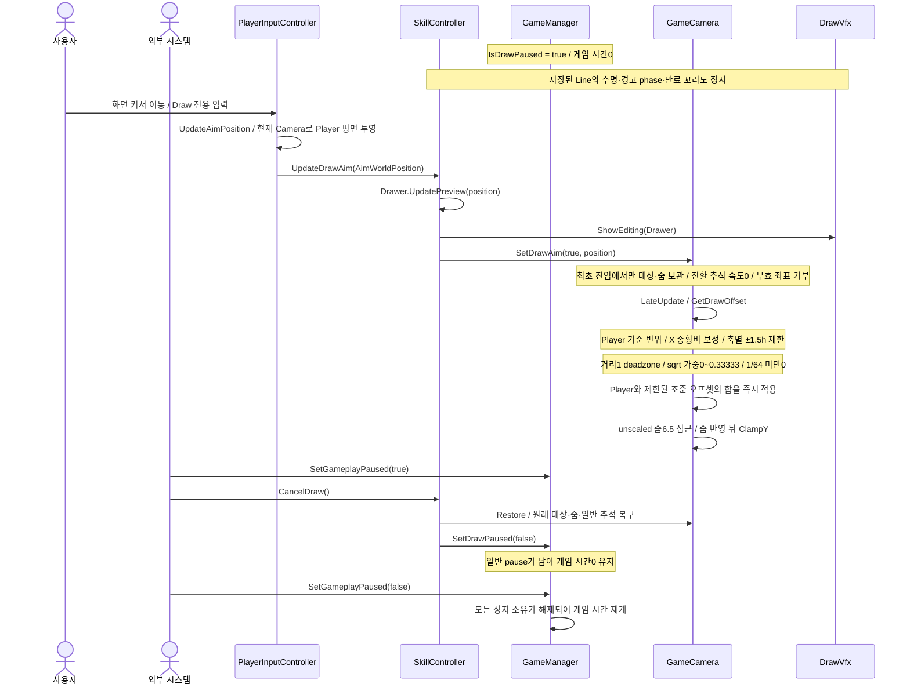
```mermaid
sequenceDiagram
    actor User as 사용자
    actor Caller as 외부 시스템
    participant Input as PlayerInputController
    participant Skill as SkillController
    participant GM as GameManager
    participant Camera as GameCamera
    participant View as DrawVfx
    Note over GM: IsDrawPaused = true / 게임 시간0
    Note over Skill,View: 저장된 Line의 수명·경고 phase·만료 꼬리도 정지
    User->>Input: 화면 커서 이동 / Draw 전용 입력
    Input->>Input: UpdateAimPosition / 현재 Camera로 Player 평면 투영
    Input->>Skill: UpdateDrawAim(AimWorldPosition)
    Skill->>Skill: Drawer.UpdatePreview(position)
    Skill->>View: ShowEditing(Drawer)
    Skill->>Camera: SetDrawAim(true, position)
    Note over Camera: 최초 진입에서만 대상·줌 보관 / 전환 추적 속도0 / 무효 좌표 거부
    Camera->>Camera: LateUpdate / GetDrawOffset
    Note over Camera: Player 기준 변위 / X 종횡비 보정 / 축별 ±1.5h 제한
    Note over Camera: 거리1 deadzone / sqrt 가중0~0.33333 / 1/64 미만0
    Camera->>Camera: Player와 제한된 조준 오프셋의 합을 즉시 적용
    Camera->>Camera: unscaled 줌6.5 접근 / 줌 반영 뒤 ClampY
    Caller->>GM: SetGameplayPaused(true)
    Caller->>Skill: CancelDraw()
    Skill->>Camera: Restore / 원래 대상·줌·일반 추적 복구
    Skill->>GM: SetDrawPaused(false)
    Note over GM: 일반 pause가 남아 게임 시간0 유지
    Caller->>GM: SetGameplayPaused(false)
    GM->>GM: 모든 정지 소유가 해제되어 게임 시간 재개
```

F-P05 SequenceDiagram

**① 첫 클릭·커서 이동 → 시작점과 고정 길이 미리보기**

첫 점을 둔 뒤 커서 방향에 고정 길이의 선을 미리 표시한다.

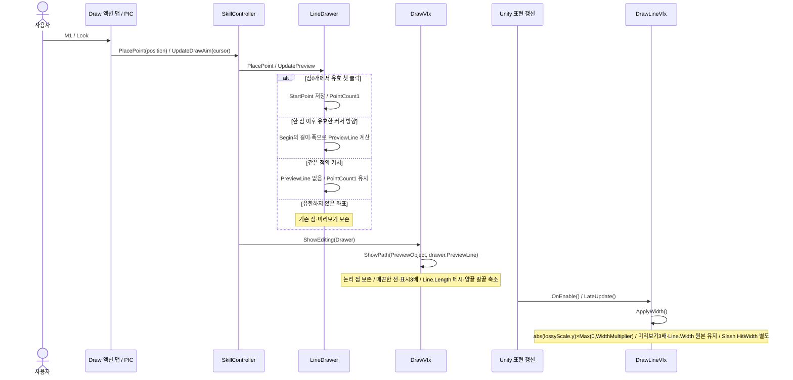
```mermaid
sequenceDiagram
    actor User as 사용자
    participant Input as Draw 액션 맵 / PIC
    participant Skill as SkillController
    participant Drawer as LineDrawer
    participant Vfx as DrawVfx
    participant Unity as Unity 표현 갱신
    participant FX as DrawLineVfx
    User->>Input: M1 / Look
    Input->>Skill: PlacePoint(position) / UpdateDrawAim(cursor)
    Skill->>Drawer: PlacePoint / UpdatePreview
    alt 점0개에서 유효 첫 클릭
        Drawer->>Drawer: StartPoint 저장 / PointCount1
    else 한 점 이후 유효한 커서 방향
        Drawer->>Drawer: Begin의 길이·폭으로 PreviewLine 계산
    else 같은 점의 커서
        Drawer->>Drawer: PreviewLine 없음 / PointCount1 유지
    else 유한하지 않은 좌표
        Note over Drawer: 기존 점·미리보기 보존
    end
    Skill->>Vfx: ShowEditing(Drawer)
    Vfx->>Vfx: ShowPath(PreviewObject, drawer.PreviewLine)
    Note over Vfx: 논리 점 보존 / 매끈한 선·표시3배 / Line.Length 메시·양끝 칼끝 축소
    Unity->>FX: OnEnable() / LateUpdate()
    FX->>FX: ApplyWidth()
    Note over FX: abs(lossyScale.y)×Max(0,WidthMultiplier) / 미리보기3배·Line.Width 원본 유지 / Slash HitWidth 별도
```

**② 두 번째 클릭 → 방향 고정·추가 클릭 무시**

둘째 유효 점이 방향을 고정한다. 같은 점과 이후 추가 입력은 무시한다.

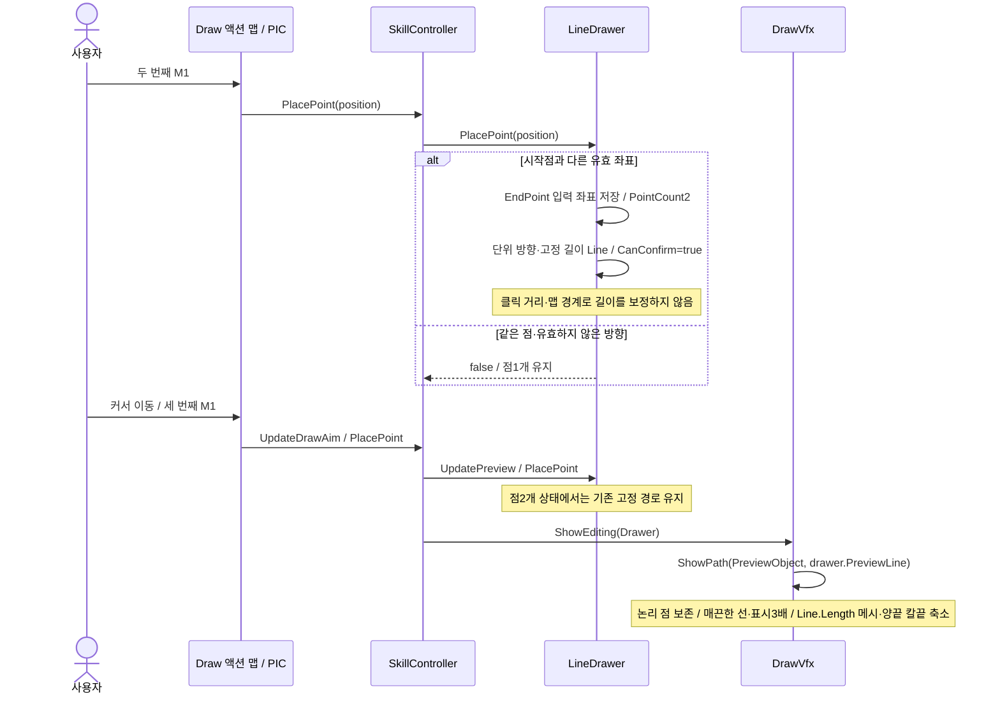
```mermaid
sequenceDiagram
    actor User as 사용자
    participant Input as Draw 액션 맵 / PIC
    participant Skill as SkillController
    participant Drawer as LineDrawer
    participant Vfx as DrawVfx
    User->>Input: 두 번째 M1
    Input->>Skill: PlacePoint(position)
    Skill->>Drawer: PlacePoint(position)
    alt 시작점과 다른 유효 좌표
        Drawer->>Drawer: EndPoint 입력 좌표 저장 / PointCount2
        Drawer->>Drawer: 단위 방향·고정 길이 Line / CanConfirm=true
        Note over Drawer: 클릭 거리·맵 경계로 길이를 보정하지 않음
    else 같은 점·유효하지 않은 방향
        Drawer-->>Skill: false / 점1개 유지
    end
    User->>Input: 커서 이동 / 세 번째 M1
    Input->>Skill: UpdateDrawAim / PlacePoint
    Skill->>Drawer: UpdatePreview / PlacePoint
    Note over Drawer: 점2개 상태에서는 기존 고정 경로 유지
    Skill->>Vfx: ShowEditing(Drawer)
    Vfx->>Vfx: ShowPath(PreviewObject, drawer.PreviewLine)
    Note over Vfx: 논리 점 보존 / 매끈한 선·표시3배 / Line.Length 메시·양끝 칼끝 축소
```

**③ 미완 F·R → Draw와 기존 원본 보존**

R은 편집점만 지우고 두 점이 없는 F는 Draw를 계속한다.

```mermaid
sequenceDiagram
    actor User as 사용자
    participant Input as Draw 액션 맵 / PIC
    participant Skill as SkillController
    participant Drawer as LineDrawer
    participant Player as PlayerCharacter
    participant Vfx as DrawVfx
    User->>Input: 점0/1개에서 F
    Input->>Skill: ConfirmLine()
    Skill->>Drawer: Confirm(out Line)
    Drawer-->>Skill: false / Draw 유지
    User->>Input: 점0/1/2개에서 R
    Input->>Skill: ResetPoints()
    Skill->>Drawer: ResetPoints()
    Drawer->>Drawer: 점0개·미리보기 제거 / Draw 유지
    Skill->>Vfx: ShowEditing(Drawer)
    Note over Player,Skill: 기존 CurrentLine·남은 수명 유지
```

**④ 유효 F 확정·Shift 취소 → 저장 교체와 임시 폐기**

두 점을 확정할 때에만 Player의 선을 교체한다.

```mermaid
sequenceDiagram
    actor User as 사용자
    participant Input as Draw 액션 맵 / PIC
    participant Skill as SkillController
    participant Drawer as LineDrawer
    participant Player as PlayerCharacter
    participant Vfx as DrawVfx
    alt 유효한 두 점에서 F
        User->>Input: F performed
        Input->>Skill: ConfirmLine()
        Skill->>Drawer: Confirm(out Line)
        Drawer-->>Skill: Line 값 / 임시 편집 종료
        Skill->>Skill: SetLine(line)
        Skill->>Player: CurrentLine = line
        Skill->>Vfx: 새 Line·새 수명 표시
    else Shift 취소
        User->>Input: Shift performed
        Input->>Player: CancelDraw()
        Player->>Skill: CancelDraw()
        Skill->>Drawer: Cancel()
        Note over Player,Skill: 기존 Line·남은 수명 보존
    end
    Skill->>Input: FinishDraw / Player 맵 복귀
    Skill->>Vfx: 편집 미리보기 숨김 / 표시 점 없음
```

F-P06 SequenceDiagram

**① Draw F 확정 → Player 원본 저장과 수명 시작**

Player가 확정 선을 보유하고 SkillController가 게임 시각 기준 수명을 시작한다.

```mermaid
sequenceDiagram
    actor User as 사용자
    participant Input as Draw 액션 맵 / PIC
    participant Drawer as LineDrawer
    participant Skill as SkillController
    participant Player as PlayerCharacter
    participant Vfx as DrawVfx
    User->>Input: F performed
    Input->>Skill: ConfirmLine()
    Skill->>Drawer: Confirm(out Line)
    alt 두 점의 기하 유효
        Drawer-->>Skill: 확정 Line
        Skill->>Skill: SetLine(line)
        Skill->>Player: CurrentLine = line
        Skill->>Skill: 시작 총수명 snapshot / LineRemaining 초기화
        Skill->>Vfx: 이전 경고·만료 꼬리 정리 / 새 Line 표시
        Vfx->>Vfx: ShowLine(line) / ShowPath(LineObject, line, false)
        Note over Vfx: LifePhase0·LineOpacity1·이전 입자 Clear / 새 수명 표현 초기화
        Note over Player,Vfx: 저장·표시·후속 Slash는 같은 Line.Length / 표시 배율만3
        Skill->>Input: FinishDraw / Player 맵 복귀
        Note over Vfx: 판정 폭 옅은 면 / 흰 심·청록 테·짧은 발광·옅은 그림자 / 양끝 칼끝·둥근 끝 발광 / 부드러운 빛 실제 시간 흐름
    else 무효 기하
        Drawer-->>Skill: false
        Note over Player,Skill: 기존 Line·남은 수명 유지
    end
```

**② 게임 시간 경과 → 남은 수명과 연속 알파 왕복 경고**

남은 게임 시간에 맞춰 만료 예고의 밝기와 주기를 조절한다.

```mermaid
sequenceDiagram
    participant Unity as 게임 갱신
    participant Player as PlayerCharacter
    participant Skill as SkillController
    participant Vfx as DrawVfx
    participant FX as DrawLineVfx
    participant Renderer as LineRenderer
    Unity->>Skill: Update / RefreshSkillTime()
    Skill->>Skill: Time.timeAsDouble 샘플 / 게임 경과시간 계산
    alt 비활성 또는 경과시간0
        Note over Skill,Vfx: 논리 수명·alpha 위상·입자 진행 없이 반환
    else 게임 시간 진행
        Skill->>Skill: Draw/Slash 쿨타임 진행
        Skill->>Vfx: TickVisuals(elapsed)
        Skill->>Player: CurrentLine 조회
        alt 확정 Line 존재
            Skill->>Skill: LineRemaining 감소
            alt 남은 수명0
                Skill->>Skill: ExpireLine / 자연 만료 Case④
            else 수명 남음
                Skill->>Vfx: UpdateLineLifetime(remaining, total, elapsed)
                alt 경고 비율 이전
                    Vfx->>Vfx: LineOpacity=1 / LifePhase=0
                else 후반 경고 구간
                    Vfx->>Vfx: BlinkInterval 단축 / LifePhase 진행
                    Vfx->>Vfx: cos 왕복 alpha0~1 / 경고 마지막12%는 원본으로 복귀
                end
                Vfx->>FX: SetOpacity(LineOpacity)
                FX->>Renderer: cached MaterialPropertyBlock의 _Opacity 전달
                Note over Vfx,Renderer: 객체 활성 유지 / 원본 PNG alpha×LineOpacity
            end
        else 원본 없음
            Note over Skill: 논리 수명 진행 없음
        end
    end
```

**③ 재Draw·pause·새 확정 → 보존·정지·수명 교체**

재편집 중 기존 선을 보관하고, 새 선을 확정할 때 수명을 다시 시작한다.

```mermaid
sequenceDiagram
    actor User as 사용자
    actor Caller as 외부 시간 시스템
    participant Input as PlayerInputController
    participant Skill as SkillController
    participant Player as PlayerCharacter
    participant GM as GameManager
    participant Vfx as DrawVfx
    User->>Input: 재Draw Shift
    Input->>Player: ApplyDraw()
    Player->>Skill: internal ApplyDraw()
    Skill->>Skill: RefreshSkillTime / Draw 전 만료 재확인
    Note over Player,Skill: 유효한 CurrentLine·남은 수명 보존
    Caller->>GM: Draw 또는 일반 pause 소유 추가
    GM->>GM: 게임 시간0
    Note over Skill: 공유 시각의 경과시간0이면 진행 없이 반환
    Note over Skill,Vfx: 논리 수명·alpha phase·입자 이동/수명 정지
    Caller->>GM: 정지 소유 해제
    Skill->>Skill: 보존한 수명에서 재개
    User->>Input: 새 F 확정
    Input->>Skill: ConfirmLine()
    Skill->>Player: CurrentLine 교체
    Skill->>Skill: 새 총수명·남은 수명 초기화
    Skill->>Vfx: 낡은 경고/만료 꼬리 정리 / 새 표현
```

**④ 자연 수명0 → 원본 제거·실제 빛 조각의 증발 이동**

자연 만료 시 원본을 비우고 선에서 분리된 입자가 사라진다.

```mermaid
sequenceDiagram
    participant Unity as 게임 갱신
    participant Skill as SkillController
    participant Player as PlayerCharacter
    participant Vfx as DrawVfx
    participant FX as DrawLineVfx
    participant Particles as DrawEvaporationVfx
    participant PS as ParticleSystem
    Unity->>Skill: Update / LineRemaining이0에 도달
    Skill->>Player: 마지막 CurrentLine 기하 조회
    Skill->>Skill: SetLine(null)
    Skill->>Player: CurrentLine = null
    Skill->>Vfx: ShowLine(null) / 이전 alpha·입자 정리
    Skill->>Skill: 짧은 Draw 대기
    Skill->>Vfx: PlayLineExpiration(line)
    Vfx->>FX: SetOpacity(1)
    Vfx->>Vfx: ShowPath(ExpiryObject, line, false)
    Vfx->>Particles: Play(line, expiryTotal)
    Particles->>PS: Emit(EmitParams, 1) / Pause(false)
    Note over Vfx,Particles: Setup에서 _LinePaletteTex에 LineVFX.mainTexture 연결 / RGB만 참조
    Note over Particles: 원형·PS직경0.045~0.085 유지 / 화면 외곽1px·AA0.5px / 기존 이동·크기 고정
    loop 소멸 시간이 남고 같은 게임 시간이 진행
        Skill->>Vfx: TickVisuals(deltaTime)
        Vfx->>Vfx: ExpiryProgress=1-remaining/total
        Vfx->>FX: SetOpacity(1-SmoothStep(progress/0.25))
        Vfx->>Particles: Tick(deltaTime)
        Particles->>PS: Simulate(deltaTime, false, false, false) / Pause(false)
        Note over Particles: world 위/양옆으로 퍼짐 / 입자 alpha로 소멸
        Vfx->>Particles: SetVisible(visible and IsExpiryPlaying)
    end
    Vfx->>Particles: Clear()
    Particles->>PS: Stop(false, StopEmittingAndClear) / Simulate(0) / Pause(false)
    Vfx->>Vfx: ExpiryObject 숨김
    Note over Player,Skill: 원본은 이미 null / 같은 자연 만료 중복 발행 없음
```

**⑤ 사망·명시적 제거·표현/능력 비활성화 → 원본과 표현 수명 구분**

사망과 명시적 제거, 표시 컴포넌트 비활성화의 수명 경계를 나눈다.

```mermaid
sequenceDiagram
    actor Caller as 외부 시스템
    participant Player as PlayerCharacter
    participant Skill as SkillController
    participant Vfx as DrawVfx
    alt 실제 사망 또는 명시적 Line 제거
        Caller->>Skill: ResetSkills() / SetLine(null)
        Skill->>Player: CurrentLine = null
        Skill->>Skill: 남은 수명·관련 상태 정리
        Skill->>Vfx: ClearLineEffects()
        Note over Vfx: phase·opacity 초기화 / Evaporation.Clear / 자연 증발을 새로 재생하지 않음
    else Skill 비활성화
        Caller->>Skill: 컴포넌트 비활성화
        Skill->>Vfx: 표현 숨김
        Note over Player,Skill: 원본·남은 수명 보존 / 논리 진행 정지
        Caller->>Skill: 재활성화
        Skill->>Vfx: 같은 수명 단계 복구
    else VFX만 비활성화
        Caller->>Vfx: 표현 비활성화
        Skill->>Skill: Player 원본의 논리 수명은 계속 진행
        Skill->>Vfx: 최신 비율·표현 상태 갱신 / 표시는 숨김
        Caller->>Vfx: 재활성화
        Vfx->>Vfx: OnEnable / 최신 LineOpacity·입자 표시 상태 복구
    end
```

**⑥ 소비 요청 → 같은 게임 시각의 만료 재확인·한 번 전달**

소비 직전 현재 게임 시각으로 만료를 확인하고 같은 선은 한 번만 넘긴다.

```mermaid
sequenceDiagram
    actor Caller as 후속 Line 소비자
    participant Skill as SkillController
    participant Player as PlayerCharacter
    participant Vfx as DrawVfx
    Caller->>Skill: ConsumeLine(out Line)
    Skill->>Skill: 현재 게임 시각까지 수명 갱신
    Note over Skill: Update와 같은 시각은 중복 차감하지 않음
    Skill->>Player: CurrentLine 확인
    alt 갱신 결과 이미 만료
        Skill->>Skill: 자연 만료 / 짧은 Draw 대기
        Skill->>Player: CurrentLine = null
        Skill->>Vfx: 같은 FX 조각의 자연 증발 재생
        Skill-->>Caller: false
    else 유효한 Line 존재
        Skill->>Skill: 반환할 기하 보관 / SetLine(null)
        Skill->>Player: CurrentLine = null
        Skill->>Vfx: 확정선·경고·꼬리 정리
        Skill->>Skill: 일반 Draw 대기 설정
        Skill-->>Caller: true / 한 번 전달한 Line
    else 원본 없음
        Skill-->>Caller: false
    end
    Note over Player,Skill: 반복 요청으로 같은 Line을 다시 소비하지 않음
    Note over Caller,Vfx: Slash 소비자는 반환 snapshot을 ShowSlashLine으로 시전 동안 별도 표시
```

F-P07 SequenceDiagram

⑦ 조정창은 폐기되어 현재 실행 경로가 없다.

**① Player F → 공통 허용·Line 1회 소모·Slash 전환**

F를 받으면 유효한 선을 소비하고 이번 Slash의 기하와 공격 ID를 고정한다.

```mermaid
sequenceDiagram
    actor User as 사용자
    participant Input as PlayerInputController
    participant Player as PlayerCharacter
    participant Skill as SkillController
    participant Slasher as LineSlasher
    participant GM as GameManager
    participant View as UI / GameCamera / Rendering / FX
    User->>Input: Player 맵 Slash F performed
    alt 수정 후보 있음
        Input->>Player: ApplyInteraction(InteractionTarget)
        Note over Input,Player: 거부해도 Slash 재전달 없음 / F-P10
    else 후보 없음
        Input->>Player: ApplySlash()
        alt 공통 행동 허용
            Player->>Skill: ApplySlash()
            Skill->>Skill: 자체 모드·Slash 대기·수치 / 현재 시각 갱신
            alt 유효한 저장 Line과 자체 조건
                Skill->>View: BeginSlashAnimation / 준비 실패면 소비 전 거부
                Skill->>Skill: ConsumeLine(out Line) / 긴 Draw 대기
                Skill->>Player: CurrentLine = null
                Skill->>View: DrawVfx.GetLineEffectWidth(Line)
                View-->>Skill: HitWidth = Line.Width × Max(1,표시 배율)
                Skill->>Slasher: Execute(Line snapshot, HitWidth, damage, mask)
                Skill->>View: DrawVfx.ShowSlashLine(snapshot) / 맵 선 알파1 유지
                Skill->>GM: Slash 전용 정지 소유 설정
                Skill->>View: HUD 숨김·암전·Player 중심 줌
                Skill->>Skill: 시간·배속·줌 목표 snapshot / FastZoom 시작
                Note over Player,View: CurrentLine은 공개 필드 / 60fps 일반 추적은 매 프레임 남은 거리의 15%
                Note over Player,Skill: Slash 전면 보호·행동 잠금 / 기존 무적 보존
            else Line 없음·만료·대기·수치 거부
                Skill-->>Player: false / Slash 시작 없음
            end
        else 공통 상태 거부
            Player-->>Input: false / Line 소비 없음
        end
    end
```

**② unscaled 빠른/느린 확대·발도·납도 → 지연 공간참 순간 한 번 판정·복구**

실제 시간으로 줌·눈·칼을 함께 진행한다. 기본 배속에서 0.2초 동안 칼과 칼집이 따로 돌아 얼굴 왼쪽에서 칼끝이 입구에 일직선으로 닿고, 이때 검집을 쥔 손이 그려진 발도 프레임으로 바뀐다. 0.38초에 납도 70%, 1.24초에 검집 입구 섬광, 1.36초에 닫힘과 납도음, 1.42초에 원래 화면으로 끊는 복귀와 공간참 판정이 일어난다.

```mermaid
sequenceDiagram
    participant Unity as Unity 갱신
    participant Skill as SkillController
    participant Slasher as LineSlasher
    participant Query as CollisionBox
    participant Hitbox as Hitbox / 수신 대상
    participant GM as GameManager
    participant Camera as GameCamera
    participant Render as CharacterRendering
    participant FX as SlashPresentationFx / world pass
    participant View as UI / DrawVfx
    Unity->>Skill: Update / Time.unscaledTimeAsDouble
    Skill->>Skill: unscaled 실제 경과 × 시작 배속 / 단계 시각 샘플
    Note over GM: 게임 시간0 / 행동·탄환·버프·쿨 정지
    Note over Skill,View: CurrentLine은 이미 소비 / 이번 snapshot 선은 전 시전 구간 맵에 유지
    alt 칼·칼집 스윙 / 첫 0.2초
        Skill->>Render: SampleSlashSwing / OpenEyes 10fps·SlashSwing 클립·초반 30%는 장착 자세에서 섞음
        Skill->>Camera: SetSlashZoom(빠른 곡선 / 직교 크기 3.2까지 진행)
    else 빠른 확대 / 0.2~0.38초
        Skill->>Render: SampleSlashPose / 칼끝이 입구에 닿아 발도 검으로 교체·OpenEyes·납도 0~70%
        Skill->>Camera: SetSlashZoom(빠른 곡선 / 직교 크기 3.2)
    else 느린 확대 / 0.38~1.24초
        Skill->>Render: SampleSlashPose / CloseEyes 5fps 반복·남은 칼날을 천천히 납도
        Skill->>Camera: SetSlashZoom(느린 곡선 / 최종 줌)
    else 닫히기 전 마지막 0.12초
        Skill->>FX: PlayBladeGlint(검집 입구) 한 번
        Skill->>Render: SampleSlashPose / 눈 반복과 느린 납도 계속
        Skill->>Camera: 느린 확대 계속
    else 납도 닫힘·공간참 대기 / 기본0.06초
        Skill->>Render: SampleSlashPose / 검집이 닫힌 마지막 장·감은 눈 반복
        Note over Skill,FX: 납도음은 SheathSoundLead(0.56초) 앞서 느린 납도 중 PlaySheathSound로 시작해 이 경계에 탁 최고점
        Skill->>Camera: SetSlashZoom(최종 줌 유지) / 중간 복귀 곡선 없음
        Note over Skill,GM: 판정·전투시간·입력·HUD는 공간참까지 대기
    end
    alt 납도 뒤 지연 공간참 시점 도달
        Skill->>Slasher: ApplyHits(Player, Boss)
        Slasher->>Query: QuerySlash(center, (ActiveLine.Length, HitWidth), angle)
        Note over Slasher,Query: 시전 폭0.75 snapshot / Line.Width0.25 원본·길이/방향 유지
        Query->>Hitbox: 같은 AttackId의 피해·Slash 수신
        Note over Query,Hitbox: 벽 무관 / 수신자1회·고유 부위 별도 전달
        Skill->>Slasher: Complete() / HitWidth0·후속 질의 없음
        Skill->>View: ShowLine(CurrentLine) / 시전 snapshot 표시 종료
        Skill->>FX: EndPreparation / 준비 섬광 종료·납도음 꼬리 보존
        Skill->>Render: EndSlashAnimation / 일반 카타나와 칼집 복구
        Skill->>Camera: SetSlashMode(false) / 원래 대상·줌으로 즉시 컷
        Skill->>View: HUD·암전·입력 복구
        Skill->>GM: 자기 Slash 정지 해제
        Skill->>FX: PlaySpaceSlash(Line snapshot) / 절단음·청록 피해 경로
        FX->>Camera: 화면 끝까지 12px 어긋남·채도 85% 감소 / 하나로 이어진 찢김 모양(양끝 뾰족·톱니): 반전 0.025초 → 검은 가장자리·청록 테·흰 심 0.06초 → 검은 틈으로 열림 → 0.4초 통째로 오므라듦 → 0.8초 함께 사라짐 / UI 제외
        Note over FX,View: 시전선 종료 / 검격 VFX만 unscaled 진행·레거시 막대 없음 / 전투 재개
    else 공간참 시점 전
        Note over Skill,Slasher: 실제 타격 대기 / 반복 피해 없음
    end
```

**③ 일반탄·금색탄 → 제거/반사·게이지·Fever**

일반탄은 제거하고 금색탄은 선의 법선에 반사해 날아간다. 게이지와 각성은 유효한 상호작용에만 적용한다.

```mermaid
sequenceDiagram
    participant Query as CollisionBox
    participant Projectile as Projectile
    participant Player as PlayerCharacter
    participant Boss as BossCharacter
    participant Buff as CharacterBuff
    participant Skill as SkillController
    participant Unity as 다음 프레임
    Query->>Query: angle에서 Line 접선(cos,sin) 한 번 계산
    Query->>Projectile: OnSlashed(Player, Boss, DamageInstance, lineDirection)
    alt 아직 처리하지 않은 일반탄
        Projectile->>Projectile: 판정·표시 종료
        Projectile->>Player: GroggyGain 전달
    else 아직 처리하지 않은 금색탄
        Projectile->>Projectile: Reflect(Boss, Player, lineDirection)
        Note over Projectile: 입사Direction을 Line 수직법선에 반사 / 위치·접촉gate 없음 / Player 무해
        Projectile->>Player: GroggyGain 전달
        Projectile->>Buff: ApplyFever() / 획득 수 예약
    else 이미 처리한 탄
        Note over Projectile,Player: 중복 반응·보상 없음
    end
    opt 반사된 금색탄의 이후 scaled 갱신
        Unity->>Projectile: UpdateReflection(dt) / 고정 Direction CircleCast
        alt 실제 Owner Boss Hitbox가 벽보다 앞
            Projectile->>Boss: Hitbox.ReceiveHit / Slash 피해1회
            Projectile->>Projectile: Despawn
        else 벽이 앞/동거리 또는 양수 수명 만료
            Projectile->>Projectile: Despawn
        else 빗나감
            Projectile->>Projectile: 같은 방향 직진 / Lifetime0 시간 만료 없음
        end
    end
    opt 게이지100 도달
        Player->>Boss: RequestGroggy() / 기절효과 도착 때 그로기
        Player->>Player: 게이지0 소모
    end
    Unity->>Buff: 이전 프레임의 획득 예약 적용
    Buff->>Player: 기본 AD·AS·SP 배율 / 획득마다 Heal
    Buff->>Buff: 기간 갱신 / 동일 프레임 Remove 우선
    Buff->>Skill: RefreshDrawCooldown / 정상 길이 기준 반값 상한
```

**④ 같은 Slash의 여러 부위 → 피해 중복 방지·Boss 집계**

부위별 보고와 같은 수신자의 피해 중복 방지를 분리한다.

```mermaid
sequenceDiagram
    participant Slasher as LineSlasher
    participant Query as CollisionBox
    participant Hitbox as Hitbox
    participant Structure as BossStructure
    participant Boss as BossCharacter
    Slasher->>Query: QuerySlash(AttackId)
    loop 조회한 고유 피격 영역
        Query->>Hitbox: 대상·PartId 확인
        alt 독립 구조물
            Query->>Structure: HandleSlash(DamageInstance)
            Structure->>Boss: ReportSlashPart(AttackId, PartId)
            Structure->>Structure: 독립 HP에 피해1회
        else Boss 피격 영역
            Query->>Boss: ReportSlashPart(AttackId, PartId)
            opt 아직 피해를 받지 않은 수신자
                Query->>Hitbox: ReceiveHit(DamageInstance)
                Hitbox->>Boss: ApplyDamage(Slash)
                Boss->>Boss: 최종 피해 허용 / HP 반영
            end
        end
    end
    Query->>Boss: CompleteSlash(AttackId)
    Note over Boss: 고유 기믹·동시 타격 성공 판단은 Boss 책임
```

**⑤ 사망·외부 차단·비활성화 → 명시적 중단·잔류 판정 제거**

시전 중 중단되면 늦은 판정과 보상을 막고 소비한 선은 복원하지 않는다.

```mermaid
sequenceDiagram
    actor Caller as 외부 시스템
    participant Player as PlayerCharacter
    participant Input as PlayerInputController
    participant Skill as SkillController
    participant Slasher as LineSlasher
    participant Query as CollisionBox
    participant GM as GameManager
    participant View as UI / Camera / DrawVfx
    alt 실제 사망·외부 컷씬
        Caller->>Player: ApplyDamage / IsCutScene 진입
        Player->>Skill: 사건 연결 / ResetSkills 또는 CancelSlash
    else 외부 입력 차단
        Caller->>Input: BlockInput=true
        Input->>Input: StopInput()
        Input->>Player: CancelSlash()
        Player->>Skill: CancelSlash()
    else 재배치·Player/Skill 비활성화
        Caller->>Skill: 명시적 CancelSlash / OnDisable 정리
    end
    Skill->>Slasher: Complete() → Cancel()
    Slasher->>Query: End / 적중 기록 정리
    Note over Slasher,Query: 콜백 취소도 남은 대상 처리 즉시 중단
    Skill->>View: 시전 snapshot 종료·현재 원본 표시 / 발도·섬광·음원·공간참 취소·입력/HUD/줌 복구
    Skill->>GM: 자기 Slash 정지 해제
    Note over Player,Skill: 소모 Line 복원 없음 / 지연 판정·보상 없음
```

**⑥ 외부 pause·기존 무적 → 자기 소유만 해제**

종료·취소 시 시전 전의 외부 정지와 전면 무적을 보존한다.

```mermaid
sequenceDiagram
    actor Caller as 외부 시스템
    participant GM as GameManager
    participant Player as PlayerCharacter
    participant Skill as SkillController
    Note over Skill: 이미 시작한 Slash에 외부 pause가 겹치는 경우
    Caller->>GM: 일반 pause 설정
    Caller->>Player: 기존 전면 무적 설정
    Note over Player,Skill: Slash 실행 중이면 전면 보호는 기존 무적 OR Slash
    Skill->>Skill: unscaled 연출 완료 또는 취소
    Skill->>GM: Slash 정지 소유만 해제
    Note over GM: 일반 pause가 남아 게임 시간0 유지
    Note over Player: Slash 보호만 끝나고 기존 무적 유지
    Caller->>GM: 일반 pause 해제
    GM->>GM: 다른 정지 소유가 없으면 게임 시간 재개
```

F-P08 SequenceDiagram

**① 실제 HP 감소 → 보호 상태와 표시의 사건 구독**

HP가 실제 줄었을 때만 피해 사건을 보내 보호와 색 표시를 시작한다.

```mermaid
sequenceDiagram
    actor Attack as 외부 공격
    participant Hitbox as Hitbox
    participant Character as Character
    participant Player as PlayerCharacter
    participant View as CharacterRendering
    Attack->>Hitbox: ReceiveHit(DamageInstance)
    Hitbox->>Character: ApplyDamage(damage)
    alt 피해 허용 / HP 실제 감소
        Character->>Character: HP·IsDead·이 호출의 치명 여부 확정
        Character-->>Player: OnDamaged(damage)
        alt 생존 / 보호 길이 유효
            Player->>Player: 보호 종료 기한·시작 기간 갱신
            Player-->>View: 새 진입의 OnHitProtectionChanged(true)
            View->>View: 원본 tint/알파 한 번 보관 / 빨강 표시
        else 치명 피해
            Note over Player,View: 새 보호를 열지 않고 사망 Case⑤로 정리
        end
        Note over Character,View: 각 구독자가 자기 책임 처리 / 직접 렌더 호출 없음
    else 피해 거부
        Character-->>Hitbox: false
        Note over Player,View: 새 보호·피격 표시 없음
    end
```

**② 대시·피격 보호·전면 무적·효과 피해 → 최종 허용 구분**

대시 회피·피격 보호·전면 무적을 피해 출처에 맞게 검사한다.

```mermaid
sequenceDiagram
    actor Source as 외부 피해
    participant Character as Character
    participant Player as PlayerCharacter
    participant View as CharacterRendering
    Source->>Character: ApplyDamage(damage)
    alt 외부/Slash 전면 무적·컷씬·사망 또는 무효 피해
        Character-->>Source: false / 사건 없음
    else Hitbox 피해 + 대시 Dodge 또는 피격 보호
        Character-->>Source: false / 사건 없음
    else IsHitboxDamage=false 효과 또는 허용된 Hitbox 피해
        Character->>Character: HP 감소 확정
        Character-->>Player: OnDamaged(damage)
        Player->>Player: 종료 기한 재설정 / Elapsed0
        opt 새 보호 진입
            Player-->>View: OnHitProtectionChanged(true)
        end
        View->>Player: 현재 Elapsed 조회
        View->>View: 원본색 재캡처 없이 빨강 위상 시작
    end
```

**③ 게임 시간 경과 → 빨강/원본 전환·보호 만료**

보호의 게임 시간 경과로 빨강·원래 색을 교대하고 만료 때 복원한다.

```mermaid
sequenceDiagram
    participant Unity as Unity 게임 갱신
    participant Player as PlayerCharacter
    participant View as CharacterRendering
    Unity->>Player: Update / 현재 scaled 시각
    alt 보호 기한이 남음
        Unity->>View: LateUpdate()
        View->>Player: HitProtectionElapsed 조회
        View->>View: 0.08초 위상으로 빨강 또는 원본 tint
        Note over Player,View: 이동·공격·대시와 표시/보호 책임 분리
    else 보호 기한 만료
        Player->>Player: 보호 상태 종료
        Player-->>View: OnHitProtectionChanged(false)
        View->>View: 원본색·알파 복원
    end
```

**④ Draw/Slash/pause·Update 이전 피해 → 동일 시각 기준**

정지 중 보호는 진행하지 않으며 다음 피해 허용 여부는 현재 게임 시각에서 계산한다.

```mermaid
sequenceDiagram
    actor Caller as 외부 시스템
    participant GM as GameManager
    participant Player as PlayerCharacter
    participant Character as Character
    participant View as CharacterRendering
    Caller->>GM: Draw / Slash / 일반 pause 소유 설정
    GM->>GM: 게임 시각 정지
    View->>Player: 같은 Elapsed 조회
    Note over Player,View: 보호 남은 시간·색 위상 유지
    Caller->>GM: 정지 소유 해제
    GM->>GM: 다른 정지가 없으면 게임 시각 재개
    Caller->>Character: Player.Update보다 먼저 새 Hitbox 피해
    Character->>Player: 현재 IsHitProtected 조회
    alt 현재 시각이 이미 기한 이후
        Player-->>Character: false
        Character->>Character: 허용된 피해 적용 / OnDamaged
    else 아직 기한 이전
        Player-->>Character: true
        Character-->>Caller: 보호로 피해 거부
    end
```

**⑤ 치명 피해·비활성화·명시 초기화 → 보호/원본색 정리**

치명 피해·비활성화·재초기화 때 남은 표시를 정리한다.

```mermaid
sequenceDiagram
    actor Caller as 외부 시스템
    participant Character as Character
    participant Player as PlayerCharacter
    participant View as CharacterRendering
    alt 실제 치명 피해
        Caller->>Character: ApplyDamage()
        Character->>Character: HP0·IsDead / fatal snapshot
        Character-->>Player: OnDamaged()
        Character-->>Player: OnDie()
        Player->>Player: ResetHitProtection()
    else Player 비활성화·재배치/명시 초기화
        Caller->>Player: OnDisable / ResetMotion / ResetHitProtection
        Player->>Player: 보호 기한/상태 정리
    else 저장 HP 복원 또는 Heal
        Caller->>Character: InitializeHealth / Heal
        Note over Character,View: OnDamaged·새 보호·새 flash 없음
    end
    opt 기존 보호가 종료됨
        Player-->>View: OnHitProtectionChanged(false)
        View->>View: 원래 tint/알파 복원
    end
    Note over Character,Player: 피격·사망 알림이 Save를 직접 호출하지 않음
    Note over Character: 비치명 OnDamaged 안의 중첩 치명 피해도 각 호출의 snapshot으로 OnDie 중복 방지
```

**⑥ Rendering 비활성화·재활성화 → 표시 수명과 논리 보호 분리**

렌더러 재활성화 시 실제 보호 상태에 맞춰 표시를 복구한다.

```mermaid
sequenceDiagram
    actor Caller as 외부 시스템
    participant Player as PlayerCharacter
    participant View as CharacterRendering
    Caller->>View: 컴포넌트 비활성화
    View->>View: 원본색 복원 / 상태 사건 구독 해제
    Note over Player: 독립 보호 기한은 게임 시간으로 계속 진행
    Caller->>View: 재활성화
    View->>Player: OnHitProtectionChanged 구독
    View->>Player: 현재 보호 상태·Elapsed 조회
    alt 아직 보호 중
        View->>View: 현재 위상으로 빨강/원본 표시
    else 이미 만료
        View->>View: 원본색 유지
    end
    Note over Player,View: 매 프레임 객체 재검색·별도 보호 타이머 없음
```

F-P09 SequenceDiagram

**① 슬롯 진입 → 최초 저장 상태·입장/기상 준비 후 입력 허용**

최초 입장이나 저장 재개에 맞춰 지점·체력·입력 인계를 준비한다.

```mermaid
sequenceDiagram
    actor User as 사용자
    participant GM as GameManager
    participant Stage as StageManager
    participant Tutorial as TutorialController
    participant Map as MapManager
    participant Spawn as PlayerSpawner
    participant Render as CharacterRendering
    participant Player as PlayerCharacter
    participant AnimationSet as PlayerSpriteAnimationSet
    participant Input as PlayerInputController
    participant View as UI_Death / GameCamera
    User->>GM: StartGame(slot, newGame)
    GM->>Stage: Generate(selectedSave)
    Stage->>Map: 복제 / Initialize(save)
    Stage->>Player: Map 준비 후 복제
    Player->>Spawn: Awake()
    Spawn->>Player: InitializeHealth(saved PlayerHP)
    Spawn->>Map: GetCheckpoint(saved CheckpointId)
    Map-->>Spawn: SpawnPoint 캐시
    Spawn->>Spawn: playerSpawn()
    Stage->>Spawn: Bind() / Input·UI·Camera의 Player 연결
    Stage->>Tutorial: Prepare() / 미완 최초 입장만 화면 아래 배치·도착점 카메라 고정
    Note over Spawn,Tutorial: PlacePlayer(EntrySpawn)·별도 StopPoint는 저장 SpawnPoint를 바꾸지 않음
    Note over Tutorial,View: Bind가 연결한 이전 Player 초점 보관 / 숨은 위쪽 pose 준비
    Note over Spawn: Start에서 서비스 캐시 / 사건 구독 / IsReady
    Stage-->>GM: 세션·Spawner 준비 완료
    GM->>GM: Loading.Hide()
    alt Tutorial.HasPendingEntrance
        GM->>GM: IsLoading=false / 일반 pause 해제·입력 차단 유지
        Note over View: Stage가 Player HUD를 숨긴 상태 유지
        GM->>Tutorial: PlayEntrance()
        Tutorial->>Tutorial: 첫 빈 화면1프레임
        Tutorial->>Player: SetCutsceneMoveTarget(stopPoint)
        Note over Player,Render: 기존 Body.Move·SP·보행/실제 발소리 / F-S05 Case②
        Tutorial-->>GM: root 중앙 도착·완료 키 Set/Save 요청·이전 Player 추적/권한 복구
    else 기존 저장의 체크포인트 기상
        GM->>Spawn: PlayInitialSpawn()
        Spawn->>Input: 이전 차단 보관 / BlockInput=true
        Spawn->>GM: SetDeathPaused(true)
        Spawn->>View: 생성 표시·Player 초점
        Note over Player,Spawn: IsSpawning 전면 보호
        opt 최초 저장 HP0
            Spawn->>Player: Revive() / OnRevive 구독 처리
            Note over Spawn: 새 OnDie / DeathCount 증가 없음
        end
        Spawn->>Spawn: 콜백 이후 세대 번호·표시 소유 재확인
        Spawn->>Render: BeginLifecycleAnimation(false)
        Render->>AnimationSet: GetState(Spawn) / 프레임·개별 유지시간 조회
        AnimationSet-->>Render: StateData / 전체 길이 캐시
        Render-->>Spawn: 기상 6장 합계 1.35초
        Render->>Render: 실제 경과로 기상 프레임 선택 / 200·300·250·200·200·200ms
        Note over Spawn,View: 일반 검·칼집 숨김
        Note over Spawn: 같은 실행이면 기상 원본의 전체 길이만큼 대기
        Spawn->>View: 자기 표시·초점 복구
        Spawn->>Render: EndLifecycleAnimation() / 검·Idle 복구
        Render->>AnimationSet: GetState(현재 방향 Idle)
        Render->>Render: 첫 프레임·반전 적용 / 일반 게임시간 재생 복귀
        Spawn->>GM: SetDeathPaused(false)
        Spawn-->>GM: 생성 표현 완료
    end
    GM->>GM: 같은 세션·Player 및 입장/기상 정상 완료 확인
    GM->>View: Player HUD 표시
    GM->>Input: 월드 준비 후 BlockInput=false
```

**② 치명 피해 → 사망 사건·횟수 저장·사망 표현**

치명 피해를 받은 Player가 사망을 한 번 알리고 사망 횟수와 표시를 갱신한다.

```mermaid
sequenceDiagram
    participant Hit as 피해 수신
    participant Base as Character
    participant Player as PlayerCharacter
    participant Buff as CharacterBuff
    participant Spawn as PlayerSpawner
    participant Render as CharacterRendering
    participant Save as SaveManager
    participant AnimationSet as PlayerSpriteAnimationSet
    participant Input as PlayerInputController
    participant GM as GameManager
    participant View as UI_Death / GameCamera
    participant Stage as StageManager
    Hit->>Base: ApplyDamage(damage)
    Base->>Base: HP / IsDead / 이번 치명 여부 확정
    Base-->>Player: OnDamaged(damage)
    Base-->>Player: OnDie
    Player->>Player: 자기 행동·Line·보호 정리
    Base-->>Buff: OnDie
    Buff->>Buff: RemoveAll()
    Base-->>Spawn: OnDie
    alt 연결된 Player의 최초 사망 실행
        Spawn->>Save: Current.DeathCount + 1 / Save()
        Save-->>Spawn: 저장 요청 반환
        Spawn->>Input: 기존 차단 보관 / BlockInput=true
        Spawn->>GM: SetDeathPaused(true)
        Spawn->>View: 텍스처 흑백 재질·암전·Player 강조 / 죽음 초점
        Spawn->>Render: BeginLifecycleAnimation(true)
        Render->>AnimationSet: GetState(Death) / 프레임·개별 유지시간 조회
        AnimationSet-->>Render: StateData / 전체 길이 캐시
        Render->>Render: Update(3) / unscaled 경과로 프레임 선택·마지막 자세 유지
        Render-->>Spawn: 죽음 6장 합계 1.05초 / 200·300·250·100·100·100ms
        Note over Spawn: 전체 프레임 재생 뒤 마지막 자세 유지
        Note over Spawn: unscaled DeathDuration0.8초 대기
        Note over Render: 여기서 Idle로 복귀하지 않음 / ③의 Spawn 전환·종료 또는 ④의 취소에서 복구
    else 이미 진행 중이거나 세션 대상 아님
        Spawn-->>Spawn: 중복 실행·저장 없음
    end
    Base-->>Stage: 전투 중 구독한 OnDie
    Stage->>Stage: HandlePlayerDeath → 연출 취소·전투 구독 해제·Owner 위험물 정리
```

**③ 사망 표현 완료 → 전투 복구·같은 인스턴스 부활**

사망 연출 후 같은 Player와 생존 Boss를 재배치하고 다음 시도를 연다.

```mermaid
sequenceDiagram
    participant Spawn as PlayerSpawner
    participant Render as CharacterRendering
    participant Stage as StageManager
    participant AnimationSet as PlayerSpriteAnimationSet
    participant Boss as BossSpawner / BossCharacter
    participant Map as MapManager
    participant Base as Character
    participant Player as PlayerCharacter
    participant Buff as CharacterBuff
    participant View as UI_Death / GameCamera
    participant GM as GameManager
    participant Input as PlayerInputController
    Spawn->>Stage: ResetEncounter()
    Stage->>Stage: 연출/전투 종료·Owner 위험물 정리
    Stage->>Boss: 같은 전투 상태·HP·위치·부위·패턴 이력 복구
    Note over Boss: 처치된 Boss와 처치 기록 보존
    Stage->>Map: RestoreCheckpointDoors()
    Spawn->>Base: Revive()
    Base->>Base: maxHP / 기본 수치 / 생존 확정
    Base-->>Player: OnRevive
    Player->>Player: ResetForRevive()
    Base-->>Buff: OnRevive
    Buff->>Buff: RemoveAll()
    Base-->>Spawn: OnRevive
    Spawn->>Spawn: playerSpawn() / 캐시 SpawnPoint 적용
    Spawn->>Spawn: OnRevive 이후 세대 번호·presentationActive 확인
    alt 콜백에서 생명주기 취소됨
        Note over Spawn,View: 뒤늦은 기상 UI 재열림 없음
    else 같은 실행이 표시를 소유
        Spawn->>View: 기상 표시
        Spawn->>Render: BeginLifecycleAnimation(false)
        Render->>AnimationSet: GetState(Spawn) / Death 데이터에서 새 상태로 교체
        AnimationSet-->>Render: StateData / 개별 유지시간·전체 길이 캐시
        Render-->>Spawn: 기상 원본의 전체 길이 1.35초
        Render->>Render: 실제 경과로 기상 프레임 선택
        Note over Spawn: 같은 실행이면 기상 원본의 전체 길이만큼 대기
        Spawn->>Render: EndLifecycleAnimation() / 검·Idle 복구
        Render->>AnimationSet: GetState(현재 방향 Idle)
        Render->>Render: 첫 프레임·반전 적용 / 일반 게임시간 재생 복귀
        Spawn->>View: 원본 재질·강조·HUD·초점 복구
        Spawn->>GM: SetDeathPaused(false)
        Spawn->>Input: 진입 전 BlockInput 복구
    end
    Note over Player,Input: 같은 Player / Input·UI·Camera 연결 유지
```

**④ Title 복귀·비활성화 → 지연 실행 중단과 외부 정지 보존**

세션 이탈 시 코루틴·표시를 정리하고 기존 외부 정지는 유지한다.

```mermaid
sequenceDiagram
    actor User as 사용자 / Unity
    participant Stage as StageManager
    participant Spawn as PlayerSpawner
    participant Render as CharacterRendering
    participant View as UI_Death / GameCamera
    participant GM as GameManager
    participant Input as PlayerInputController
    User->>Stage: Title 복귀 / 세션 Clear
    Stage->>Stage: Boss 연출 취소·전투 구독 해제·Owner 위험물 정리
    Stage->>Spawn: Unbind() 또는 OnDisable
    Spawn->>Spawn: CancelLifecycle()
    Spawn->>Spawn: 세대 번호 변경 / 자기 코루틴 중단
    Spawn->>Render: EndLifecycleAnimation() / 검·Idle 복구
    Spawn->>View: 자기 표시·원본 재질·초점 복구
    Spawn->>GM: SetDeathPaused(false)
    GM->>GM: 일반 / Draw / Slash / Death OR 적용
    Spawn->>Input: 자기 대상일 때만 기존 차단 복구
    Stage->>Input: 세션 종료 차단·대상 해제
    Note over Spawn: 취소된 실행의 후속 Revive 없음
```

F-P10 SequenceDiagram

**① 수정 범위 진입·이탈 → 후보와 안내만 변경**

수정 영역에서 후보·안내를 갱신하며 접촉만으로 활성화하지 않는다.

```mermaid
sequenceDiagram
    actor Unity
    participant Crystal as CrystalCheckPoint
    participant Input as PlayerInputController
    participant UI as UIController
    Unity->>Crystal: OnTriggerEnter2D(playerCollider)
    Crystal->>Crystal: 접촉 HashSet 추가 / Player·활성 상태 확인
    Crystal->>Input: SetInteraction(this, true)
    Input-->>UI: OnInteractionChanged(target)
    UI->>UI: 현재 후보·IsInteractionVisible 갱신
    Crystal->>UI: LateUpdate에서 같은 후보·표시 허용 읽기
    Crystal->>Crystal: 미활성·미진행이면 F Sprite 표시
    Unity->>Crystal: OnTriggerExit2D(playerCollider)
    alt 다른 Player Collider 접촉이 남음
        Crystal->>Crystal: 현재 후보 유지
    else 마지막 접촉 종료
        Crystal->>Crystal: CancelActivation()
        Crystal->>Input: SetInteraction(this, false)
        Input-->>UI: OnInteractionChanged(null)
        Note over Crystal: 회복·저장·활성화 없음
    end
```

**② 공통 F → 후보 우선 요청·거부 시 Slash 누출 방지**

F는 수정 후보에 먼저 전달하고 거절되더라도 같은 입력으로 Slash를 쏘지 않는다.

```mermaid
sequenceDiagram
    actor User as 사용자
    participant Actions as Input Actions
    participant Input as PlayerInputController
    participant Player as PlayerCharacter
    participant Crystal as CrystalCheckPoint
    participant Skill as SkillController
    User->>Actions: F performed
    alt Draw 액션 맵
        Actions->>Input: HandleOnDrawConfirm()
        Input->>Player: Draw 확정 요청
    else Player 액션 맵
        Actions->>Input: HandleOnSlash()
        Input->>Input: 세션·UI·외부 입력 게이트
        alt InteractionTarget 있음
            Input->>Player: ApplyInteraction(target)
            Player->>Player: 공통 시작 상태 확인
            alt 허용
                Player->>Crystal: activateCheckPoint(this)
                Crystal-->>Player: 지연 실행 시작 여부
                Player->>Player: 완료 구독 / 이동 정리 / 진행 상태 통지
            else 공통 상태 또는 수정 조건 거부
                Player-->>Input: false / 요청 종료
                Note over Input: 같은 F를 Slash로 전달하지 않음
            end
        else 후보 없음
            Input->>Player: ApplySlash()
            Player->>Skill: Slash 자체 조건 요청
        end
    end
```

**③ 연출 완료 → 회복·데이터 저장 요청·문과 배치 갱신**

상호작용 완료 때 회복과 저장을 요청하고 문과 배치 상태를 갱신한다.

```mermaid
sequenceDiagram
    participant Player as PlayerCharacter
    participant Crystal as CrystalCheckPoint
    participant Save as SaveManager
    participant Map as MapManager
    participant Spawn as PlayerSpawner
    participant UI as UIController
    participant Door as MapDoor
    participant Animator as 문 Animator
    Player->>Crystal: activateCheckPoint(player)
    Crystal->>Crystal: IsActivating=true / unscaled 대기
    Crystal-->>Player: 시작 true
    Note over Player: IsInteracting / 전면 보호 / 다른 행동 잠금
    Note over Crystal: 최소 한 프레임 + ActivationDuration 완료
    Crystal->>Crystal: Player·실제 범위 재확인 / IsActivated=true
    Crystal->>Crystal: CrystalAnimator.Active=true / F Sprite 숨김
    Crystal->>Player: Heal(maxHP) / Groggy=0
    Crystal->>Save: Current.Set(ActivatedCheckpoints, CheckpointId, PlayerHP)
    Crystal->>Save: Save()
    Save-->>Crystal: 요청 반환 / 디스크 처리는 내부
    Crystal->>Crystal: IsActivating=false / Trigger·후보 정리
    Crystal-->>Map: OnActivated(this)
    Map->>Spawn: UpdateCheckpoint(CheckpointId)
    Spawn->>Map: GetCheckpoint(id)
    Map-->>Spawn: 새 SpawnPoint 캐시
    Map->>Map: SetEntryDoorOpen(BossId, true) / 자기 구독 해제
    Map->>Door: 캐시 EntryMotion.SetOpen(true)
    Door->>Door: WantsOpen=true / Collider 차단 유지
    Door->>Animator: Play(opening)
    Crystal-->>Player: OnActivationFinished(this)
    Player->>Player: activeInteraction / 자기 구독 정리
    Note over Door,Animator: 문이 열리는 동안 Player 통과 불가
    Animator-->>Door: LateUpdate에서 open 상태·전이 없음 확인
    Door->>Door: IsOpen=true / Blocker.enabled=false
```

**④ 지연 중 차단·사망·이탈 → 취소·자기 보호 복구**

대기 중 차단·사망·이탈이면 미완료 처리하고 자신이 건 보호만 해제한다.

```mermaid
sequenceDiagram
    actor External as 외부 상태 / Unity
    participant Player as PlayerCharacter
    participant Crystal as CrystalCheckPoint
    participant UI as UIController
    External->>Player: OnDie / OnCutScene / BlockInput / ResetMotion
    Player->>Player: CancelInteraction()
    Player->>Crystal: CancelActivation()
    Crystal->>Crystal: 대기 중단 / IsActivating=false
    Crystal-->>Player: OnActivationFinished(this)
    Player->>Player: 자기 진행 상태·구독 정리
    Note over Crystal: HP·이력·Save·입구 변경 없음
    External->>Crystal: 이미 활성 / 중복 / 범위 밖 요청
    Crystal-->>External: false
    Note over Player: 기존 외부 무적·다른 소유 상태 유지
```

**⑤ 저장 재로드·재도전 → 활성 수정·문·캐시 재구성**

재로드와 재도전 때 저장된 수정·문의 상태를 복원한다.

```mermaid
sequenceDiagram
    participant Stage as StageManager
    participant Map as MapManager
    participant Save as SaveData
    participant Crystal as CrystalCheckPoint
    participant Spawn as PlayerSpawner
    Stage->>Map: Initialize(save)
    alt ActivatedCheckpoints key 없음
        Map->>Save: 기존 CheckpointId를 목록에 메모리 이관
        Note over Save: 이관만으로 Save 요청하지 않음
    end
    Map->>Crystal: Initialize(map, save)
    Crystal->>Save: 활성 이력 조회
    Crystal->>Crystal: CrystalAnimator.Active=저장 이력
    alt 이미 활성
        Crystal->>Crystal: Trigger·후보 제거
    else 미활성
        alt Trigger 있음
            Map->>Crystal: OnActivated 자기 구독
        else Trigger 누락
            break 월드 생성 중단
                Crystal-->>Map: 초기화 오류
                Map-->>Stage: 기존 실패 복구 경로로 전달
            end
        end
    end
    Map->>Map: RestoreCheckpointDoors()
    Note over Map: 처치 Boss의 양쪽 문 / 활성 수정의 입구를 MapDoor.SetOpen(open,true)로 즉시 복구
    Stage->>Spawn: Player 복제 / Awake()
    Spawn->>Map: 저장 CheckpointId 위치 조회·캐시
    Stage->>Map: BindPlayer(spawner)
    Note over Spawn: 수정 OnActivated에서만 새 캐시로 갱신
    Stage->>Map: 재도전 RestoreCheckpointDoors()
    Spawn->>Spawn: playerSpawn() / SpawnPoint 재사용
```

F-P11 SequenceDiagram

**① 효과 요청 → 다음 프레임 적용·획득별 회복**

효과 적용 요청을 모아 다음 프레임에 적용하고 유효한 각성 획득마다 회복한다.

```mermaid
sequenceDiagram
    actor Caller as 외부 효과 요청자
    participant Character as Character
    participant Effects as CharacterBuff
    participant Unity as 다음 프레임
    participant Skill as SkillController
    participant Aura as FeverAuraFx
    Caller->>Character: ApplyBuff(Fever / Slow)
    Character->>Effects: Apply(type)
    Effects->>Effects: 획득 수 또는 적용 예약
    Note over Character,Effects: Has는 아직 적용되지 않은 예약과 구분
    Unity->>Effects: Update / 이전 프레임 예약 처리
    Effects->>Effects: 기간 갱신 / 기본 수치에 한 번 합성
    opt Fever 획득
        Effects->>Skill: RefreshDrawCooldown()
        opt 실제 false에서 true로 진입
            Effects-->>Aura: OnFeverChanged(true)
            Aura->>Aura: SetAura(true) / 자기 입자 Play
        end
        loop 획득 수
            Effects->>Character: Heal(획득별 회복량)
        end
        Note over Skill: 기본 대기 길이 기준 cap / 반복 반감 없음
    end
```

**② Fever·Slow 공존·재적용·만료 → 남은 효과 보존**

각성·슬로우는 독립적으로 갱신하고 제거돼도 남은 효과를 재계산한다.

```mermaid
sequenceDiagram
    actor Caller as 외부 효과 요청자
    participant Effects as CharacterBuff
    participant Character as Character
    participant Aura as FeverAuraFx
    Caller->>Effects: Apply(Slow) / ApplyFever()
    Effects->>Effects: 다음 프레임에 각 효과 적용
    Effects->>Character: SP = 기본SP × Fever × Slow
    Effects->>Character: AD / AS = 기본값 × Fever
    Caller->>Effects: 같은 효과 재적용
    Effects->>Effects: 기간 갱신 / 배율 중첩 없음
    alt Slow만 만료 또는 제거
        Effects->>Effects: Slow/예약 해제
        Effects->>Character: Fever를 유지한 SP/AD/AS 합성
    else Fever만 만료 또는 제거
        Effects->>Effects: Fever/예약 해제
        Effects->>Character: Slow SP 유지 / 기본 AD·AS
        Effects-->>Aura: 실제 해제면 OnFeverChanged(false)
        Aura->>Aura: 자기 입자 StopEmittingAndClear
    end
```

**③ 같은 프레임 Remove·ClearDebuffs → 제거 우선·유익 효과 보존**

같은 프레임에는 제거 요청을 우선하고 디버프 정리는 유익 효과를 보존한다.

```mermaid
sequenceDiagram
    actor Caller as 외부 시스템
    participant Effects as CharacterBuff
    participant Character as Character
    Caller->>Effects: Apply(type)
    Caller->>Effects: Remove(type)
    Effects->>Effects: 적용 상태·예약 제거 / 이번 프레임 제거 기록
    Caller->>Effects: 같은 프레임 Apply(type)
    Effects-->>Caller: false / 제거 우선
    Caller->>Effects: ClearDebuffs()
    Effects->>Effects: Slow·Groggy와 예약만 제거
    Effects->>Character: 남은 Fever 기준 수치 유지
```

**④ 시간 정지·사망·부활 → 수명 보존과 전체 정리**

시간 정지는 남은 수명을 보존하고 사망·부활은 기본 상태를 회복한다.

```mermaid
sequenceDiagram
    actor Caller as 외부 시스템
    participant GM as GameManager
    participant Character as Character
    participant Effects as CharacterBuff
    participant Aura as FeverAuraFx
    Caller->>GM: Draw / Slash / Death / BossCutscene / 일반 pause 설정
    Note over Effects,Aura: 게임 시간0 / 효과 기간·scaled 오라 입자 함께 정지
    Caller->>Character: 치명 피해 또는 Revive()
    Character-->>Effects: OnDie / OnRevive
    Effects->>Effects: RemoveAll() / 예약·효과 제거
    Effects->>Character: 기본 AD·AS·SP 복귀
    opt 실제 Fever가 해제됨
        Effects-->>Aura: OnFeverChanged(false)
        Aura->>Aura: 자기 입자 StopEmittingAndClear
    end
    Note over Character,Effects: Character는 효과 내부를 직접 조작하지 않음
```

**⑤ 일반 그로기 효과·게이지100 → Boss 원본 위임**

그로기는 현재 Boss가 소유하며 게이지 100에서 즉시 위임한다.

```mermaid
sequenceDiagram
    actor Caller as 외부 요청자
    participant Effects as Boss의 CharacterBuff
    participant Player as PlayerCharacter
    participant Boss as BossCharacter
    participant Pattern as 현재 BossPattern
    alt 일반 효과 API
        Caller->>Effects: Apply(Groggy)
        Effects->>Boss: 다음 프레임 EnterGroggy()
    else Player 게이지100
        Caller->>Player: AddGroggy()
        Player->>Player: 상한100 도달 / 게이지0 소모
        Player->>Boss: RequestGroggy() / 기절효과 비행 뒤 EnterGroggy
    end
    Boss->>Boss: 자기 기간 설정 또는 갱신
    Boss->>Player: Target.Buffs.ApplyFever() / 기절 진입마다 각성 획득 한 번
    Boss->>Pattern: CurrentPattern 참조를 먼저 비우고 Cancel
    Caller->>Effects: Has(Groggy) 조회
    Effects->>Boss: IsGroggy 조회
    Caller->>Boss: GroggyRemaining 조회
    Note over Boss,Effects: 타이머 중복 없음 / 이미 발사된 탄 정리 없음
```

**⑥ Player 준비·각성 전환 → 몸에서 상승하는 황금 오라와 표시 정리**

버프 사건을 구독한 입자 효과가 황금 오라를 켜고 종료 때 정리한다.

```mermaid
sequenceDiagram
    actor Caller as 생성·효과 요청자
    participant Unity
    participant Character as PlayerCharacter
    participant Buff as CharacterBuff
    participant Aura as FeverAuraFx
    participant View as CharacterRendering
    participant Fx as 자기 ParticleSystem들
    Caller->>Unity: Player 프리팹 생성
    Unity->>View: Awake(3): 자식 입자 Renderer 목록·순서 보관 배열 캐시
    Unity->>Buff: Awake(30): 자기 대상 준비
    Unity->>Aura: Awake(40): Buff 한 번 캐시·Emitters 검사
    Unity->>Aura: OnEnable()
    Aura->>Buff: OnFeverChanged 구독 / IsFever 한 번 동기화
    Aura->>Aura: SetAura(현재 상태)
    Caller->>Character: ApplyBuff(Fever)
    Character->>Buff: Apply(Fever) / 다음 프레임 예약
    Buff->>Buff: Update(30): IsFever·기간·스탯·Draw대기 갱신
    opt 실제 false에서 true로 진입
        Buff-->>Aura: OnFeverChanged(true)
        Aura->>Fx: Play(false)
    end
    Note over Aura,Fx: local simulation·scaled loop / 별도 Aura.Update 없음
    Note over View,Fx: Draw 강조는 몸체와 같은 순서 차이 적용·복원 / 뒤 불꽃·앞 불씨 관계 유지
    opt 각성 중 재획득
        Caller->>Character: ApplyBuff(Fever)
        Buff->>Buff: 다음 프레임 기간·획득 회복 갱신
        Note over Buff,Fx: OnFeverChanged 재발행 없음 / 기존 오라 계속 재생
    end
    alt 만료·명시 Remove·실제 사망/부활
        Buff->>Buff: Remove(Fever): 상태 false·기간0·스탯 복구
        Buff-->>Aura: OnFeverChanged(false)
        Aura->>Fx: Stop(false, StopEmittingAndClear)
    else Player 또는 오라 비활성화
        Unity->>Aura: OnDisable()
        Aura->>Buff: OnFeverChanged 구독 해제
        Aura->>Fx: Stop(false, StopEmittingAndClear)
        opt 같은 Player/오라 재활성화
            Unity->>Aura: OnEnable()
            Aura->>Buff: 다시 구독 / 현재 IsFever 동기화
            Aura->>Fx: 유지된 각성이면 Play(false)
        end
    end
    Note over Buff,Aura: Buff 컴포넌트만 비활성화하면 기존 IsFever·표시 유지
```

F-B01 SequenceDiagram

**① 슬롯 선택 → 생존/처치 Boss 생성**

저장된 처치 여부에 따라 경비를 전투 가능 또는 사체 상태로 생성한다.

```mermaid
sequenceDiagram
    actor User as 사용자
    participant GM as GameManager
    participant Stage as StageManager
    participant Map as MapManager
    participant Boss as BossCharacter
    participant Spawn as BossSpawner
    participant Save as SaveManager.Current
    User->>GM: 슬롯 선택·MainWorld 진입
    GM->>Stage: Generate(save)
    Stage->>Stage: 저장의 StageIndex로 묶음 선택 / 기록이 없으면 Inspector StageIndex
    Stage->>Map: CreateMap·Initialize(save)
    Stage->>Boss: Instantiate → Awake
    Boss->>Boss: 자기 효과·Selector·패턴 등록
    Stage->>Spawn: Initialize(Map,save)
    Spawn->>Map: GetBossPosition·GetEncounterArea
    Spawn->>Save: DefeatedBosses 조회
    alt 미처치
        Spawn->>Boss: 최대 HP·ResetCombatState·기본 위치
        Stage->>Spawn: 월드 준비 뒤 EncounterTrigger 활성
    else 처치
        Spawn->>Boss: HP0·ShowDefeated
        Spawn->>Spawn: 몸체·부위·Trigger 닫기·회색 표시
    end
```

**② Player 사망 → 같은 Boss 초기 상태 복구**

Player 사망 시 살아 있는 Boss는 같은 인스턴스에서 초기 상태로 돌아간다.

```mermaid
sequenceDiagram
    participant Player as PlayerCharacter
    participant Stage as StageManager
    participant Boss as BossCharacter
    participant Spawn as BossSpawner
    participant Hazard as Projectile 파생형
    participant Map as MapManager
    Player->>Stage: OnDie → HandlePlayerDeath
    Stage->>Stage: CancelBossSequence·EndEncounter
    Stage->>Boss: EndEncounter → CancelPattern
    Stage->>Hazard: 소유 위험물 Despawn
    Player->>Stage: 부활 과정 ResetEncounter
    Stage->>Spawn: ResetEncounter
    Spawn->>Boss: ResetCombatState·저장 처치 상태별 HP
    Boss->>Boss: 패턴 쿨타임·횟수·직전 이력 초기화
    Spawn->>Spawn: 같은 위치·Collider·부위 HP·표시 복원
    Stage->>Map: RestoreCheckpointDoors
```

F-B02 SequenceDiagram

**① 실제 구역 진입 → 첫/재조우 완료 후 전투**

조우 트리거 진입 후 컷씬 정상 완료를 기다려 문·HUD·전투를 전환한다.

```mermaid
sequenceDiagram
    actor User as 사용자
    participant Trigger as EncounterTrigger
    participant Stage as StageManager
    participant Cutscene as CutsceneController
    participant Save as SaveManager
    participant Map as MapManager
    participant UI as UIController
    participant Boss as BossCharacter
    participant Music as BattleMusic
    User->>Trigger: Player를 구역 안으로 이동
    Trigger->>Stage: BeginEncounter(boss)
    Stage->>Stage: 대상·중복 검증·양쪽 OnDie 구독·Trigger 닫기
    Stage->>Save: Current.EncounteredBosses 조회
    alt 첫 조우
        Stage->>Cutscene: Play(BossEncounter,첫 연출 시간)
    else 재조우
        Stage->>Cutscene: Play(BossReencounter,재연출 시간)
    end
    Cutscene->>Cutscene: 기존 Draw/Slash 종료 → 복원 상태 보관 → 자기 차단·표시·정지
    Note over Cutscene: Follow(boss, temporary=true) / 60fps에서 남은 거리의 1/15씩 보스 쪽으로 이동
    Note over Cutscene: Follow(previousTarget)으로 복귀하면 15% 적용 / 게임 정지 중에도 실제 시간으로 추적
    Note over Cutscene: 실제 시간 대기 후 원래 표시·차단 복원
    Cutscene-->>Stage: 정상 완료
    opt 첫 조우
        Stage->>Save: EncounteredBosses 추가·Save 요청
    end
    Stage->>Map: 입구·출구 닫기
    Map->>Map: 캐시 MapDoor.SetOpen(false) / Collider 즉시 차단·closing 모션
    Stage->>UI: SetBoss
    UI->>UI: 준비된 Boss HP Sprite 표시 / 현재 체력 조회
    Stage->>Boss: BeginEncounter(Player)
    Stage->>Music: Play(boss.BattleMusic)
    Music->>Music: 처음부터 반복 재생 / 실제 시간 0.5초에 걸쳐 음량 켬
```

**② 연출 중단·Title 이탈·사망 → 후속 전투 시작 차단**

중단·이탈·사망은 컷씬의 지연된 전투 시작을 취소한다.

```mermaid
sequenceDiagram
    actor External as 연출 중단·Title 이탈·사망
    participant Stage as StageManager
    participant Cutscene as CutsceneController
    participant Boss as BossCharacter
    participant Save as SaveManager
    External->>Stage: Clear 또는 HandlePlayerDeath
    Stage->>Stage: CancelBossSequence·실행 번호 변경·코루틴 중단
    Stage->>Cutscene: Cancel
    Cutscene->>Cutscene: 자기 입력·HUD·초점·정지 복원
    Note over Cutscene: Follow(previousTarget)으로 일반 추적 비율 복구
    Note over Cutscene: 재조우 0.2초가 끝나면 그때의 카메라 위치에서 Player로 복귀
    Stage->>Stage: EndEncounter·양쪽 OnDie 해제
    Stage->>Boss: EndEncounter·현재 패턴 취소
    opt 같은 세션의 미처치 Boss 조우를 중단
        Stage->>Stage: EncounterTrigger 재무장
    end
    Note over Stage,Save: 미완료 첫 조우는 기록하지 않음
```

**③ 조우 전 일반 공격 → 유효 피해 수신**

조우 전 일반 공격도 유효 피해 여부를 정상 판정한다.

```mermaid
sequenceDiagram
    actor User as 사용자
    participant Attack as AttackController
    participant Query as CollisionBox
    participant Hit as Hitbox
    participant Boss as BossCharacter
    User->>Attack: 일반 공격 입력
    Attack->>Query: 타별 QueryCircle 또는 QueryBox(카타나 중심, 타별 크기)
    Query->>Hit: ReceiveHit(damage)
    Hit->>Boss: Character.ApplyDamage(damage)
    alt 생존·무적 아님·유효 피해
        Boss->>Boss: HP 차감·OnDamaged
    else 무효 상태
        Boss-->>Hit: false
    end
```

**④ 전투 시작·종료 → 전투 구역의 벽·가림막·테두리 전환**

조우 영역의 전투 구역이 보스의 전투 상태를 읽어 벽과 표시를 함께 켜고 끈다.

```mermaid
sequenceDiagram
    participant Map as MapManager
    participant Spawn as BossSpawner
    participant Arena as BossArena
    participant Boss as BossCharacter
    Arena->>Arena: Awake / 벽 4개·가림막·테두리 생성 후 끔·조우 감지 영역을 구역 안쪽으로 맞춤
    Map->>Map: 벽 목록 수집 / 꺼 둔 구역 벽 포함
    Spawn->>Arena: Initialize에서 조우 영역의 BossArena 조회·Bind(Boss)
    loop Update
        Arena->>Arena: Size·여백이 바뀌면 ApplyLayout
        Arena->>Boss: IsInCombat·IsDead 조회
        alt 전투 시작
            Arena->>Arena: 벽 충돌 켬 / ShowOverlay일 때만 가림막·테두리 켬
        else 전투 종료·사망
            Arena->>Arena: 벽 충돌·가림막·테두리 끔
        end
    end
    Spawn->>Arena: Release에서 Unbind(Boss) / 구역 끄고 연결 해제
```

**⑤ 문 여닫힘·Player 위치 → 방과 통로의 밝기 전환**

방 안쪽은 들어온 뒤에만, 통로는 그 안에 있거나 그쪽 문이 열려 있을 때만 보이도록 검은 덮개를 서서히 바꾼다.

```mermaid
sequenceDiagram
    participant Game as GameManager
    participant Dark as RoomDarkness
    participant Entry as 입구 MapDoor
    participant Exit as 출구 MapDoor
    Dark->>Dark: Awake / 방 안쪽은 고른 검은 덮개, 두 통로는 방 쪽 끝에서 바깥으로 갈수록 짙어지는 덮개 생성, 모두 가린 상태
    loop LateUpdate / unscaled 시간
        Dark->>Game: CurrentPlayer 조회 / 없거나 꺼지면 다시 확보
        Dark->>Dark: Player 높이로 입구 통로·방·출구 통로 구분
        Dark->>Entry: WantsOpen 조회
        Dark->>Exit: WantsOpen 조회
        opt 닫힌 입구 너머로 옮겨진 재도전
            Dark->>Dark: 처음 들어오는 상태로 되돌림
        end
        Note over Dark: 방 = 들어온 적이 있고 (방 안에 있음 또는 Player 쪽 문이 열림)
        Note over Dark: 통로 = 그 안에 있음 또는 그쪽 문이 열림
        Dark->>Dark: 덮개별 불투명도를 FadeDuration 0.35초에 걸쳐 목표값으로 이동
    end
```

F-B03 SequenceDiagram

②·③은 제출 대상에서 제거된 시험 패턴이다.

**① 전투 Idle → 조건·우선값·가중 추첨**

최소 Idle 시간이 지난 뒤 조건·직전 패턴·우선값을 반영한 후보 가운데 가중 추첨하고, Idle 행동이 끝난 프레임에 시작한다.

```mermaid
sequenceDiagram
    participant Unity
    participant Boss as BossCharacter
    participant Selector as BossPatternSelector
    participant Pattern as BossPattern 파생형
    Unity->>Boss: Update(game deltaTime)
    Boss->>Boss: idleElapsed 누적
    opt idleElapsed가 PatternGap 이상·대기 후보 없음
        Boss->>Selector: GetNextPattern(this)
        loop 등록 목록의 재사용 순회
            Selector->>Pattern: CanRun·GetWeight·GetPriority
            Note over Selector: 직전 제외·유효 가중치·최고 양수 우선값
        end
        Selector->>Selector: 최고 우선값 후보의 누적 가중 추첨
        Selector-->>Boss: 선택 패턴 또는 null
    end
    alt 대기 후보 없음
        Boss->>Boss: TickIdle → 구체 보스의 Idle 행동
    else 대기 후보의 조건이 바뀜
        Boss->>Boss: 후보를 버리고 다음 프레임에 다시 선택
    else Idle 행동 진행 중
        Boss->>Boss: RequestIdleStop·TickIdle로 진행 중인 행동만 마침
    else Idle 행동 없음
        Boss->>Boss: ApplyPattern
        Boss->>Pattern: Begin(this)
        Pattern->>Pattern: 실제 사용 시각 기록
        Pattern->>Boss: HandlePatternStarted
        Boss->>Selector: HandlePatternStarted
        Pattern->>Pattern: OnBegin
    end
```

**④ 시연용 추첨 → 이번 바퀴에 남은 패턴을 같은 확률로 하나씩, 다 돌면 다시 채움**

`BossPatternSelector.CycleAllPatterns`가 켜져 있는 동안 ①의 가중 추첨 대신 쓴다.

```mermaid
sequenceDiagram
    participant Boss as BossCharacter
    participant Selector as BossPatternSelector
    participant Pattern as BossPattern 파생형
    Boss->>Selector: GetNextPattern(this)
    opt 남은 패턴 목록이 비어 있음
        Selector->>Selector: 등록한 패턴 전체로 다시 채움(새 바퀴)
    end
    loop 남은 패턴
        Selector->>Pattern: IgnoreCooldown = true, CanRun
        Note over Selector: 직전 패턴과 지금 실행할 수 없는 패턴 제외
    end
    alt 후보 있음
        Selector-->>Boss: 후보 중 같은 확률로 하나
    else 후보 없음, 기다린 시간이 6초 미만
        Selector-->>Boss: null (Idle 유지, Idle 행동이 끝나면 남은 패턴이 실행 가능해짐)
    else 6초를 넘김
        Selector->>Selector: 남은 패턴을 건너뛰고 전체로 다시 채움
        Selector-->>Boss: 새 후보 중 하나 또는 null
    end
    Boss->>Pattern: Begin(this)
    Pattern->>Boss: HandlePatternStarted
    Boss->>Selector: HandlePatternStarted / 남은 목록에서 제거
```

F-B04 SequenceDiagram

**① Slash 게이지100 → 기절효과 비행 → 도착 순간 그로기·현재 패턴만 중단**

게이지를 소비해 구슬을 날리고, 구슬이 보스 중심에 닿는 순간 그로기를 시작하며 현재 패턴의 남은 실행을 막는다.

```mermaid
sequenceDiagram
    actor User as 사용자
    participant Skill as SkillController
    participant Projectile as Projectile 파생형
    participant Player as PlayerCharacter
    participant Boss as BossCharacter
    participant Fx as BossGroggyFx
    participant Pattern as 현재 BossPattern
    User->>Skill: F → 실제 Slash 판정
    Skill->>Projectile: CollisionBox → OnSlashed
    Projectile->>Player: AddGroggy(GroggyGain,Owner)
    alt 게이지100 도달
        Player->>Player: 게이지0으로 소비
        Player->>Boss: RequestGroggy
        Boss->>Fx: Begin → HUD 게이지 위치에서 구슬 출발
        loop GroggyTravelDuration 동안의 게임 시간
            Fx->>Fx: 꼭짓점 뒤 가속하는 포물선 위치 갱신
            Note over Boss,Pattern: 진행 중인 패턴과 Idle 행동은 계속
        end
        Fx->>Boss: 도착 → 접점 효과 생성·EnterGroggy
        Boss->>Boss: IsGroggy·GroggyRemaining 설정
        Boss->>Player: Target.Buffs.ApplyFever() / 기절 진입마다 각성 획득 한 번
        Boss->>Pattern: CurrentPattern 먼저 비우기·Cancel
        Fx->>Fx: 몸 렌더러에 흰빛 확산·기절 동안 머리 위 별 표시
    else 100 미만
        Player->>Player: 누적 게이지 유지
    end
    Note over Projectile,Pattern: 기존 필드 위험물은 유지 / 이후 발사만 중단
```

**② 그로기 재요청·게임 정지·기간 만료 → Idle 재개**

정지 중에는 그로기 시간을 보존하며 회복하면 Idle에서 다시 선택한다.

```mermaid
sequenceDiagram
    participant External as 효과·고유 기믹
    participant Boss as BossCharacter
    participant Unity
    participant Selector as BossPatternSelector
    External->>Boss: 그로기 중 EnterGroggy
    Boss->>Boss: 기간 갱신
    Unity->>Boss: Update(deltaTime)
    alt 게임 시간0
        Boss->>Boss: 타이머·행동 보존
    else 기간 남음
        Boss->>Boss: GroggyRemaining 차감
    else 기간 만료
        Boss->>Boss: ExitGroggy
        Note over Boss: 다음 Idle 프레임
        Boss->>Selector: GetNextPattern
    end
```

F-B05 SequenceDiagram

**① 치명 피해 → 진행 저장·연출 뒤 문 열림**

치명 피해를 한 번 기록하고 사망 연출 뒤 통로를 개방한다.

```mermaid
sequenceDiagram
    participant Attack as Player 공격 또는 반사탄
    participant Boss as BossCharacter
    participant Stage as StageManager
    participant Save as SaveManager
    participant Spawn as BossSpawner
    participant Cutscene as CutsceneController
    participant Map as MapManager
    participant Door as MapDoor
    participant Animator as 문 Animator
    participant Ending as TempDemoEnding
    Attack->>Boss: ApplyDamage(치명 피해)
    Boss->>Boss: HP0·일회 OnDie·현재 패턴 종료
    Boss->>Stage: HandleBossDeath
    Stage->>Stage: 처치 기록 중복 확인·연출/전투 구독 종료
    Note over Stage: EndEncounter가 BattleMusic.Stop을 불러 배경음을 실제 시간 1.5초에 걸쳐 끔
    Stage->>Stage: Owner 위험물 정리·Player 디버프 해제
    Stage->>Save: DefeatedBosses·PlayerHP 갱신·Save 요청
    Stage->>Spawn: DisableCombatColliders
    Stage->>Spawn: BeginDefeatFade / 사라지는 Boss만 실제 시간으로 알파를 낮추기 시작
    Stage->>Cutscene: Play(BossDeath, max(1.2초, 사라지는 연출 전체 시간))
    alt TempDemoEnding에 연결한 제출 경비
        Boss->>Ending: OnDie / HandleBossDeath
        Ending->>Stage: CancelBossSequence
        Stage->>Cutscene: Cancel / 이전 잠금·표시 복구
        Stage->>Spawn: ShowDefeated
        Stage->>Map: 입구·출구 개방
        Note over Ending,Stage: F-S06 암전·안내·Title 복귀로 인계
    else 임시 엔딩에 연결하지 않은 Boss
        Cutscene-->>Stage: 실제 시간 연출 완료·상태 복원
        Stage->>Spawn: ShowDefeated
        Stage->>Map: 입구·출구 개방
    end
    Map->>Door: SetOpen(true) / 양쪽 문 캐시 사용
    Door->>Animator: 입구 opening / 출구 activation부터 재생
    Note over Door,Animator: 출구 점멸·점등·상승 중 Collider 유지
    Animator-->>Door: LateUpdate에서 open 상태·전이 없음 확인
    Door->>Door: IsOpen=true / Blocker.enabled=false
```

**② 처치 후 추가 피해·Title 재진입 → 처치 상태 유지**

처치 후 추가 피해는 무시하며 새 세션에서 저장된 처치 상태를 복구한다.

```mermaid
sequenceDiagram
    actor User as 사용자
    participant Boss as BossCharacter
    participant Stage as StageManager
    participant Save as SaveManager.Current
    participant Spawn as BossSpawner
    participant Map as MapManager
    User->>Boss: 처치 뒤 추가 피해
    Boss-->>User: 죽은 상태의 피해 거부·OnDie 재발행 없음
    User->>Stage: Title 복귀 후 MainWorld 재진입
    Stage->>Map: Initialize(save) → 처치 구역 통로 복구
    Map->>Map: 캐시 MapDoor.SetOpen(true,true) / 완전 개방 상태·Collider 해제
    Stage->>Spawn: Initialize(Map,save)
    Spawn->>Save: DefeatedBosses 확인
    Spawn->>Boss: HP0·ShowDefeated·Trigger 닫기
```

F-B06 SequenceDiagram

②·③은 제출 대상에서 제거된 시험 위험물·더미 보스의 Case다.

**① 실제 Slash 사각 → 일반탄 제거·금색탄 반사와 보상**

Slash의 실제 사각이 닿은 탄환만 반응하며 일반탄과 반사 가능한 금색탄을 구분한다.

```mermaid
sequenceDiagram
    actor User as 사용자
    participant Skill as SkillController
    participant Query as CollisionBox
    participant Projectile as Projectile 파생형
    participant Player as PlayerCharacter
    participant Boss as 발사 Owner Boss
    User->>Skill: F → Line 소비·Slash 연출 완료
    Skill->>Query: QuerySlash(마지막 사각)
    Query->>Query: Query angle에서 Line 접선(cos,sin) 계산
    Query->>Projectile: 탄환별 OnSlashed(Player,Boss,Slash,lineDirection)
    alt 일반탄
        Projectile->>Projectile: Despawn·추가 판정 닫기
        Projectile->>Player: AddGroggy
    else 금색탄과 유효 목표
        Projectile->>Projectile: Reflect(Boss,Player,lineDirection) / 입사Direction 반사
        Projectile->>Player: ApplyFever·AddGroggy
        Note over Projectile: 중심 위치 무관 / 고정 직진·Player 무해 / scaled 정지
        Projectile->>Projectile: 이후 고정 방향 CircleCast / nearestWall 비교
        alt 실제 Owner Boss Hitbox가 벽보다 앞
            Projectile->>Boss: 실제 Hitbox.ReceiveHit / Slash 피해1회
            Projectile->>Projectile: Despawn
        else 벽이 앞/동거리 또는 양수 수명 만료
            Projectile->>Projectile: Despawn
        else 빗나감
            Projectile->>Projectile: 같은 방향 직진 / Lifetime0 시간 만료 없음
        end
    else 레이저·장판 또는 무효 반사 목표
        Projectile-->>Query: false·보상 없음
    end
```

**④ Player 이동 → Boss 몸체 진입 차단·접촉 피해 없음**

경비 몸체는 Player의 변위를 막으며 접촉 피해를 주지 않는다.

```mermaid
sequenceDiagram
    actor User as 사용자
    participant Input as PlayerInputController
    participant Player as PlayerCharacter
    participant Body as PlayerBodyController
    participant BossBody as Boss non-trigger Collider
    participant Visual as CharacterRendering
    User->>Input: Boss 방향 이동 입력
    Input->>Player: SetMoveInput
    Player->>Body: Update(0) / Move(일반 + 대시 변위)
    Body->>BossBody: 즉시 Rigidbody2D.Cast
    BossBody-->>Body: 충돌 거리·법선
    Body->>Body: 몸 안 진입 보정·위치 적용
    Player->>Visual: SetMovement(충돌 전 일반 변위, AimDirection)
    Visual->>Visual: Update(3) / 일반 이동 모션
    Note over Player,BossBody: 몸 접촉은 DamageInstance를 생성하지 않음
```

**⑤ 공격이 예고 배치 → 예고A·B·C 단계와 소멸**

예고의 형태·크기·색은 위험을 표시하고 피해 처리는 공격이 소유한다.

```mermaid
sequenceDiagram
    participant Attack as 패턴 또는 손 실행체
    participant Warning as AreaWarningVfx
    participant Shape as PixelShapeTexture
    participant Bullet as 지켜볼 Projectile
    Attack->>Warning: ShowOpenPath·ShowRectangle·ShowEllipse·ShowSector
    alt 열린 경로·닫힌 사각형
        Warning->>Warning: 1×5 측선·9분할 마스크를 Sliced 크기로 늘림
    else 타원·부채꼴
        Warning->>Shape: 최종 픽셀 격자의 1px 테두리 마스크 조회
        Shape-->>Warning: 같은 크기는 재사용하는 Sprite
    end
    Attack->>Warning: BeginNotice / 예고A
    Attack->>Warning: BeginImminent(duration) / 예고B
    loop 게임 시간
        Warning->>Warning: 지난 시간 ÷ duration만큼 안쪽 면을 가운데에서 한 칸씩 넓힘 / duration에 다 참
    end
    Attack->>Warning: BeginDanger 또는 BeginDanger(탄환) / 예고C
    loop 게임 시간
        Warning->>Warning: 좌우 1px 진동
        opt 지켜보는 탄환이 있음
            Warning->>Bullet: IsActive·IsReflected 조회
            Warning->>Warning: 모두 제거·반사됐으면 EndDanger
        end
    end
    Attack->>Warning: EndDanger / 위험이 지나간 뒤
    Warning->>Warning: WarningFadeDuration 동안 투명해진 뒤 Hide
    Note over Warning: Collider 없음 / 공격 판정은 공격이 소유
```

**⑥ 실제 탄환 생성 → 4장 반복 표시·특수탄의 방향 회전과 Slash 전용 후방 판정**

탄환 몸체는 4장 클립을 반복하고, 특수탄은 스미어가 진행 반대쪽에 놓이며 이동 구간을 Slash에만 노출한다.

```mermaid
sequenceDiagram
    participant Pattern as BossPattern 발사
    participant Unity
    participant Projectile as Normal 또는 GoldProjectile
    participant Clip as SpriteClipPlayer
    participant Trail as SlashTrail BoxCollider2D
    Pattern->>Unity: 일반탄 또는 특수탄 프리팹 Instantiate
    Unity->>Clip: OnEnable → 4장 클립 반복 재생
    Pattern->>Projectile: Initialize(owner, direction, speed, lifetime, damage)
    opt 특수탄
        Projectile->>Projectile: 표시 자식의 +X를 진행 방향으로 회전
        Projectile->>Trail: 길이0으로 초기화
    end
    loop 게임 시간이 흐르는 비행
        Projectile->>Projectile: CircleCast로 벽·Player 판정 후 이동
        opt 특수탄
            Projectile->>Trail: 이번 프레임 이동 거리만큼 뒤로 연장
            Projectile->>Unity: Physics2D.SyncTransforms
        end
    end
    Note over Projectile,Trail: 후방 판정은 Slash 질의에만 반응 / Player 피해는 몸체 CircleCast만 사용
```

**⑦ 맵 벽 준비·발사 참조 확보 → 가까운 벽/대상 순서와0수명**

비행 경로의 벽과 대상을 비교해 가까운 실제 충돌을 반영한다.

```mermaid
sequenceDiagram
    participant Stage as StageManager
    participant Map as MapManager
    participant Pattern as BossPattern
    participant Bullet as Projectile 파생형
    participant Physics as Physics2D
    participant Hit as Player Hitbox
    participant Target as ReflectionTarget 실제 Boss Hitbox
    Stage->>Map: Initialize(save)
    Map->>Map: inactive 포함 non-trigger Collider HashSet 준비
    Pattern->>Bullet: Instantiate → Initialize
    Bullet->>Bullet: map=MapManager.Instance 한 번 캐시
    loop 양수 게임 시간의 이동
        opt Lifetime 양수
            Bullet->>Bullet: RemainingLifetime 감소·만료 시 Despawn
        end
        Bullet->>Physics: CollectFlightHits / 이동 CircleCast
        loop 수집 Collider
            Bullet->>Map: IsWall(collider)
        end
        Bullet->>Bullet: GetNearestWallDistance
        alt 일반 비행
            opt 가장 가까운 벽보다 앞의 Player
                Bullet->>Hit: ReceiveHit
                Hit-->>Bullet: 성공하면 Despawn
            end
            opt 아직 활성·벽 도달
                Bullet->>Bullet: 벽 접촉 거리까지 이동·Despawn
            end
        else Gold 반사 비행
            alt 벽보다 앞의 실제 Target Hitbox
                Bullet->>Target: ReceiveHit(Slash)
                Bullet->>Bullet: Despawn
            else 벽 먼저/동거리 또는 Target 빗나간 뒤 벽
                Bullet->>Bullet: 벽 접촉에서 Despawn
            end
        end
    end
    Note over Map,Bullet: Lifetime0은 시간 만료 없음 / 문 활성 상태는 Physics 질의에 반영
    Note over Bullet,Target: Gold6초·Slash 보상 유지 / 반사 방향 규칙은 별도 반사 작업 기록 참조
    Note over Bullet: Area와 Laser0수명 거부
```

F-B07-01 SequenceDiagram

튜토리얼 단발은 아직 구현하지 않았다. 구현할 때 Case를 추가한다.

F-B07-02 SequenceDiagram

**① 양 총구 추적 예고A → 고정 예고B → 황금 특수탄 동시 발사·예고C**

두 총구의 경로가 Player를 따라가다 고정되고, 발사된 탄이 경로를 떠나면 예고가 사라진다.

```mermaid
sequenceDiagram
    participant Boss as Boss_01과 Selector
    participant Pattern as TwinShotPattern
    participant Player as PlayerCharacter
    participant Warning as 총구별 AreaWarningVfx
    participant Gold as GoldProjectile 특수탄
    Note over Boss,Pattern: CanRun은 두 총구가 GameCamera.IsVisible(여백 0.5)일 때만 참
    Boss->>Pattern: F-B07-02 선택·Begin
    Pattern->>Warning: 총구→Player→전투 구역 끝 ShowOpenPath·BeginNotice
    loop TwinTrackDuration 0.7초
        Boss->>Pattern: Tick(gameDelta)
        Pattern->>Player: 현재 위치 조회
        Pattern->>Warning: 두 경로 다시 배치
    end
    Pattern->>Pattern: 조준 지점 고정
    Pattern->>Warning: BeginImminent(0.6초) / 두 경로 모두 폭 방향으로 차오름
    Pattern->>Gold: 두 총구에서 Instantiate·Initialize(초속50·수명0)
    Pattern->>Boss: 좌우 발사 섬광 재생 / 발사음 한 번
    Pattern->>Warning: BeginDanger(해당 탄환)
    Warning->>Warning: 탄환이 사라지거나 반사되면 0.2초 소멸
    Pattern->>Pattern: TwinRecovery 뒤 Complete
```

**② 그로기·전투 종료 → 발사 전이면 예고 제거, 발사 후면 탄환과 예고C 유지**

```mermaid
sequenceDiagram
    participant Source as 그로기 도착·전투 종료·컷씬
    participant Boss as BossCharacter
    participant Pattern as TwinShotPattern
    participant Runner as 총구별 AreaWarningVfx
    Source->>Boss: EnterGroggy 또는 EndEncounter
    Boss->>Pattern: CurrentPattern 비우기·Cancel → OnCancel
    alt 발사 전
        Pattern->>Runner: Hide
    else 발사 후
        Runner->>Runner: 탄환이 경로를 떠날 때까지 예고C 유지
    end
    Note over Boss,Runner: 이미 발사한 탄환은 자체 수명 유지
```

F-B07-03 SequenceDiagram

**① Idle → 한 손 추적 예고A → 고정 예고B → 스미어 낙하·착지 1회 피해 → 복귀·반대 손**

선택된 패턴이 없는 동안 두 손이 번갈아 내려찍고, 다음 패턴은 진행 중인 손이 돌아온 뒤 시작한다.

```mermaid
sequenceDiagram
    participant Boss as BossCharacter와 Boss_01
    participant Hand as GuardHandAttack
    participant Player as PlayerCharacter
    participant Warning as 타원 AreaWarningVfx
    participant Hit as Player Hitbox
    Boss->>Boss: Update → 선택 패턴 없음 → TickIdle
    Boss->>Hand: BeginIdleSlam(Target) / 손은 좌우 교대
    Hand->>Warning: ShowEllipse·BeginNotice
    loop Approach 1.0초
        Boss->>Hand: Tick(gameDelta)
        Hand->>Player: 현재 위치 조회
        Hand->>Warning: 타원을 Player 위치로 이동
        Hand->>Hand: 손 지면 위치 추격·높이 상승
    end
    Hand->>Hand: Lock → 착지점 고정
    Hand->>Warning: BeginImminent(0.6초)
    Hand->>Hand: Drop 0.06초 / 스미어 2장·착지점으로 하강
    Hand->>Hand: Land → 주먹 그림 복원·착지 고리·착지음
    Hand->>Warning: BeginDanger → EndDanger
    Hand->>Hit: 타원 안의 피격 영역에 ReceiveHit 1회
    Hand->>Hand: Return → 기본 위치 복귀 후 Mode None
    opt 다음 패턴이 대기 중
        Boss->>Boss: RequestIdleStop → 새 손을 시작하지 않음
        Boss->>Boss: 손이 복귀한 프레임에 ApplyPattern
    end
```

**② 그로기·전투 종료·컷씬 → 손과 예고 즉시 복원**

```mermaid
sequenceDiagram
    participant Source as 그로기 도착·전투 종료·컷씬
    participant Boss as BossCharacter와 Boss_01
    participant Hand as GuardHandAttack
    participant Warning as 타원 AreaWarningVfx
    Source->>Boss: EnterGroggy·EndEncounter 또는 Update의 전투 조건 실패
    Boss->>Boss: CancelIdleAction
    Boss->>Hand: Cancel
    Hand->>Warning: Hide
    Hand->>Hand: 두 손을 기본 위치·기본 그림으로 복원
    Note over Boss,Hand: 아직 오지 않은 착지 피해는 발생하지 않음
```

F-B07-04 SequenceDiagram

**① 두 손 모으기 → 충전 → 예고B → 낙하·착지 피해와 2중 원형 탄막**

합친 주먹이 충전 뒤 착지점을 내려치고 착지 순간 원형 탄막 두 줄을 발사한다.

```mermaid
sequenceDiagram
    participant Boss as Boss_01과 Selector
    participant Pattern as CentralSlamPattern
    participant Hand as GuardHandAttack
    participant Warning as 타원 AreaWarningVfx
    participant Normal as NormalProjectile
    participant Hit as Player Hitbox
    Note over Boss,Pattern: CanRun은 착지점이 GameCamera.IsVisible(여백 0.5)일 때만 참
    Boss->>Pattern: F-B07-04 선택·Begin
    Pattern->>Hand: BeginCentral(Target, 착지점, FireRings)
    loop Hand.IsRunning
        Boss->>Pattern: Tick(gameDelta)
        Pattern->>Hand: Tick(gameDelta)
    end
    Hand->>Hand: Approach 0.5초 / 두 손이 착지점 위로 이동·상승
    Hand->>Hand: Charge 1.5초 / 합친 주먹·충전 전류와 섬광·충전음 반복
    Hand->>Warning: Lock → ShowEllipse·BeginImminent(0.6초) / 충전 효과·충전음 유지
    Hand->>Hand: Drop 0.06초 / 양손 스미어·충전 효과가 손을 따라 하강
    Hand->>Hand: Land → 충전 종료·균열·폭발·ImpactDistortionFx.Play·충전 착지음
    Hand->>Pattern: FireRings(착지점)
    Pattern->>Normal: 20발×2줄 Instantiate / 안쪽 줄은 반 칸 어긋나고 느림
    Hand->>Hit: 타원 안의 피격 영역에 ReceiveHit 1회
    Hand->>Hand: Return → 두 손으로 갈라져 복귀
    Pattern->>Pattern: Hand 종료 확인 → Complete
```

**② 그로기·전투 종료 → 미래 착지와 발사 차단**

```mermaid
sequenceDiagram
    participant Source as 그로기 도착·전투 종료·컷씬
    participant Boss as BossCharacter
    participant Pattern as CentralSlamPattern
    participant Runner as GuardHandAttack
    Source->>Boss: EnterGroggy 또는 EndEncounter
    Boss->>Pattern: CurrentPattern 비우기·Cancel → OnCancel
    Pattern->>Runner: Cancel
    Runner->>Runner: 충전 효과·충전음·예고 정리, 두 손을 기본 위치로 복원
    Note over Boss,Runner: 이미 발사한 탄환은 자체 수명 유지
```

F-B07-05 SequenceDiagram

**① 눈 충전 → 경로 결정 → 피해 타원 가속 이동·두 빔 한 점 수렴·1회 피해**

충전이 끝나는 순간 경로를 정하고, 두 빔이 겹친 지면의 피해 타원이 시작점에서 끝점까지 가속한다.

```mermaid
sequenceDiagram
    participant Boss as Boss_01과 Selector
    participant Pattern as EyeLaserPattern
    participant Laser as GuardEyeLaser
    participant Player as PlayerCharacter
    participant Physics as Physics2D
    participant Hit as Player Hitbox
    Note over Boss,Pattern: CanRun은 두 눈이 GameCamera.IsVisible(여백 0.5)일 때만 참
    Boss->>Pattern: F-B07-05 선택·Begin
    Pattern->>Laser: Begin(Target, 전투 구역)
    Laser->>Laser: 눈 충전 고리 1.2초·충전음
    loop Laser.IsRunning
        Boss->>Pattern: Tick(gameDelta)
        Pattern->>Laser: Tick(gameDelta)
    end
    Laser->>Player: 충전 종료 순간의 위치 조회
    Laser->>Laser: DecidePath / 무작위 시작점·Player가 3/4 지점인 끝점·구역 경계에서 자름
    Laser->>Laser: 눈 발광 반복·두 빔과 빔 위의 주황 피해 타원 표시·발사음 반복
    loop Firing 1.0초
        Laser->>Laser: 타원 중심=Lerp(시작,끝,t²) / 외곽 기둥 깜빡임·불티 방출
        Laser->>Physics: 이전 중심→현재 중심을 타원 반폭 간격으로 OverlapBox
        Physics-->>Laser: 가장 가까운 점이 타원 안에 있는 피격 영역
        Laser->>Hit: 아직 맞지 않은 Player에 ReceiveHit
    end
    Laser->>Laser: 빔·피해 타원·소리 종료 → Recovery 0.5초 → Cancel
    Pattern->>Pattern: Laser 종료 확인 → Complete
```

**② 그로기·사망·재시작 → 현재 빔과 접점 즉시 종료**

```mermaid
sequenceDiagram
    participant Source as 그로기 도착·전투 종료·컷씬
    participant Boss as BossCharacter
    participant Pattern as EyeLaserPattern
    participant Runner as GuardEyeLaser
    Source->>Boss: EnterGroggy 또는 EndEncounter
    Boss->>Pattern: CurrentPattern 비우기·Cancel → OnCancel
    Pattern->>Runner: Cancel
    Runner->>Runner: 눈 효과·두 빔·피해 타원·소리 정리
    Note over Boss,Runner: 이미 발사한 탄환은 자체 수명 유지
```

F-B07-06 SequenceDiagram

**① 두 총구 충전 → 예고 없이 좌·우·좌·우 6발 발사 → 회복**

두 총구가 함께 준비한 뒤 바닥 예고 없이 왼쪽부터 번갈아 부채꼴 탄환을 쏜다.

```mermaid
sequenceDiagram
    participant Boss as Boss_01과 Selector
    participant Pattern as FanShotPattern
    participant Normal as NormalProjectile
    Note over Boss,Pattern: CanRun은 두 총구가 GameCamera.IsVisible(여백 0.5)일 때만 참
    Boss->>Pattern: F-B07-06 선택·Begin
    Pattern->>Boss: SetMuzzleCharge(true, 1.5초) / 준비음 시작
    loop 게임 시간
        Boss->>Pattern: Tick(gameDelta)
    end
    Pattern->>Boss: 충전 종료 → SetMuzzleCharge(false) / 준비음 정지
    loop FanVolleyCount 4회 / 첫 발사는 충전 종료 순간, 이후 0.6초 간격
        Pattern->>Normal: 왼쪽부터 번갈아 6발 Instantiate
        Pattern->>Boss: 해당 총구 발사 섬광 / 발사음
    end
    Pattern->>Pattern: FanRecovery 뒤 Complete
```

**② 그로기·전투 종료 → 남은 발사 취소**

```mermaid
sequenceDiagram
    participant Source as 그로기 도착·전투 종료·컷씬
    participant Boss as BossCharacter
    participant Pattern as FanShotPattern
    Source->>Boss: EnterGroggy 또는 EndEncounter
    Boss->>Pattern: CurrentPattern 비우기·Cancel → OnCancel
    Pattern->>Boss: SetMuzzleCharge(false)
    Note over Boss,Pattern: 이미 발사한 탄환은 자체 수명 유지
```

F-B07-07 SequenceDiagram

**① 한 손 가장자리 이동·충전 → 타원 예고B와 자리별 예고 → 착지 피해 → 자리별 지면 타격**

한 손이 가장자리에서 기를 모아 내려치고, 미리 예고된 자리들이 가까운 곳부터 차례로 터지며 피해를 준다.

```mermaid
sequenceDiagram
    participant Boss as Boss_01과 Selector
    participant Pattern as EdgeWavePattern
    participant Hand as GuardHandAttack
    participant Warning as 타원 AreaWarningVfx
    participant Spot as 자리별 예고·지면 타격
    participant Hit as Player Hitbox
    Boss->>Pattern: F-B07-07 선택·Begin
    Pattern->>Pattern: 무작위 손·같은 쪽 가장자리에서 Player 높이 ±3 안의 무작위 높이·방 중앙 방향
    Pattern->>Pattern: 폭발 허용 영역(경비 바닥 높이 아래의 전투 구역)과 닿을 거리(구역 폭의 3/4 지점까지) 계산
    Pattern->>Hand: BeginEdgeWave(Target, 손, 착지점, 예비 방향, 폭발 허용 영역, 닿을 거리)
    loop Hand.IsRunning 또는 IsWaveActive
        Boss->>Pattern: Tick(gameDelta)
        Pattern->>Hand: Tick(gameDelta)
    end
    Hand->>Hand: Approach 0.5초 → Charge 3.5초 / 충전 효과·충전음·착지점 그림자
    Hand->>Warning: Lock → 타원 BeginImminent(0.6초) / 충전 효과·충전음 유지
    Hand->>Hand: BeginWave / 부채꼴 중심을 이 순간의 Player 쪽으로 잡고 허용 영역 안의 자리와 자리별 폭발 시각 결정·충격파 시각을 착지 전 음수로 시작
    Note over Hand: 원호마다 줄째로 무작위 회전, 자리마다 거리·각도 어긋남과 예고 그림 뒤집기를 이때 함께 정함
    loop 착지 전후의 게임 시간
        Hand->>Spot: 폭발 0.6초 전인 자리에 청록 균열 예고 생성 / 0.3초 성장 뒤 0.3초 유지
    end
    Hand->>Hand: Drop 0.06초 → Land / 충전 종료·균열·폭발·흙먼지·왜곡·충전 착지음
    Hand->>Warning: 타원 BeginDanger → EndDanger
    Hand->>Hit: 타원 안의 피격 영역에 ReceiveHit 1회
    loop WaveDuration 0.6초
        Hand->>Spot: 폭발 시각이 된 자리의 예고를 걷고 지면 타격 생성 / 앞선 소리에서 0.12초가 지났으면 지면 타격음
        Hand->>Hit: 그 자리의 반지름 안에 있는 Player에 충격파당 ReceiveHit 1회
    end
    Hand->>Hand: Return → 기본 위치
    Pattern->>Pattern: 손과 충격파 종료 확인 → Complete
    Note over Hand,Spot: WaveTelegraphClip을 비우면 부채꼴 예고B·C로 대신 표시
```

**② 그로기·전투 종료 → 미래 착지와 진행 중인 충격파 차단**

```mermaid
sequenceDiagram
    participant Source as 그로기 도착·전투 종료·컷씬
    participant Boss as BossCharacter
    participant Pattern as EdgeWavePattern
    participant Runner as GuardHandAttack
    Source->>Boss: EnterGroggy 또는 EndEncounter
    Boss->>Pattern: CurrentPattern 비우기·Cancel → OnCancel
    Pattern->>Runner: Cancel
    Runner->>Runner: 충전·예고·남은 자리의 예고 효과 정리, 손을 기본 위치로 복원
    Note over Boss,Runner: 이미 발사한 탄환은 자체 수명 유지
```

F-B12-01 SequenceDiagram

**① 준비·주황 점화 → 가로선 소실 → 0.1초 뒤 등장 → 손끝 차원문 → 유도탄 한 발, 세 위치 반복**

```mermaid
sequenceDiagram
    participant Boss as Boss_Last와 Selector
    participant Pattern as TeleportVolleyPattern
    participant Fx as 손 효과·차원문·표식
    participant Homing as HomingProjectile
    participant Grid as GridPathfinder
    participant Player as PlayerCharacter
    Boss->>Pattern: F-B12-01 선택·Begin
    loop TeleportOffsets 상단·왼쪽 아래·오른쪽 아래
        Pattern->>Boss: PlayBody(body-attack-ready)
        Pattern->>Fx: 0.10초에 p1-ignition-cast(손끝 주황)
        Pattern->>Boss: 0.25초에 PlayBody(vanish-ready6)
        Pattern->>Fx: 도착 지점에 p1-arrival-front 표식
        Pattern->>Boss: 0.15초 뒤 SetHidden(true) / 피격 영역 닫힘
        Pattern->>Boss: TeleportGap 0.1초 뒤 위치 이동·FaceTowards(Player)·SetHidden(false)·PlayBody(appear-ready8)
        Pattern->>Fx: 손끝 앞 OpenRift(rift-open-rift 0.55초)
        Pattern->>Boss: 0.15초 뒤 PlayBody(body-attack-doing) / 첫 장 0.05초
        Pattern->>Fx: homing-fire-open(0.4초)
        Pattern->>Homing: 차원문이 다 열리면 Instantiate·Initialize(Player SP×1.1, 수명 6초)
        Pattern->>Boss: GetGrid() / 구역이 같으면 기존 격자 재사용
        Pattern->>Homing: BeginHoming(Player, Grid, 구역 중심)
        Pattern->>Fx: homing-fire-release·ReleaseRift
        Pattern->>Boss: PlayBody(body-attack-end), TeleportRecover 0.25초
    end
    Pattern->>Boss: ResetPresentation → Complete
    loop 유도탄 수명 동안 매 프레임
        Homing->>Grid: 0.15초마다 TryGetNextPoint(현재 위치, Player)
        Homing->>Homing: 중앙 방향×(1−w)+경로 방향×w, w는 1.5초에 0→1 / 초당 150°까지만 회전
        Homing->>Homing: 0.1초마다 꼬리 A·B 교대, 수명 75%부터 밝은 몸체 깜빡임
        Homing->>Homing: Player에서 2.5 안이면 몸 중심 직접 추적·초당 360° 회전
        Homing->>Player: 이동 구간 CircleCast → Hitbox.ReceiveHit(피해 10)
        Homing->>Player: 몸 중심과 0.6 안이면 TryContact → Hitbox.ReceiveHit 뒤 Despawn / 회피·보호 중이면 피해 없이
    end
    Homing->>Homing: Player 접촉·벽·Slash·수명 종료 → Despawn → OnDespawning에서 homing-explosion / 전투 종료 정리에서는 생략
    Note over Boss,Pattern: 효과음: 사라짐·나타남(가로선), 손끝 차원문 열림·닫힘, 유도탄 폭발
```

**② 그로기·전투 종료 → 차원문·예고 제거, 현재 자리에서 다시 표시, 쏜 유도탄은 유지**

```mermaid
sequenceDiagram
    participant Source as 그로기 도착·전투 종료·컷씬
    participant Boss as BossCharacter
    participant Pattern as 실행 중인 F-B12 패턴
    participant Last as Boss_Last
    Source->>Boss: EnterGroggy 또는 EndEncounter
    Boss->>Pattern: CurrentPattern 비우기·Cancel → OnCancel
    Pattern->>Last: ResetPresentation
    Last->>Last: 카운터·금빛 강조 끔, SetHidden(false), 높이 0, 손 효과 끔
    Last->>Last: 빌려 준 예고 Hide, 차원문·기둥·수정 Destroy
    Boss->>Last: CancelIdleAction → ResetPresentation
    Note over Boss,Last: 여섯 패턴이 같은 복원 경로를 쓰며 이미 쏜 탄환은 자체 수명 유지
```

F-B12-02 SequenceDiagram

**① 가까운 지정 위치로 잔상 대시 → 준비·시전 → 균열 네 개 → 0.6초 뒤 자수정 융기, 세 번 반복**

```mermaid
sequenceDiagram
    participant Boss as Boss_Last와 Selector
    participant Pattern as AmethystLinePattern
    participant Ghost as SpriteAfterimage
    participant Crystal as 균열·자수정 SpriteClipPlayer
    participant Hit as Player Hitbox
    Boss->>Pattern: F-B12-02 선택·Begin
    Pattern->>Pattern: CastOffsets 중 현재 위치에서 가장 가까운 열린 지점 선택
    loop 도착할 때까지
        Pattern->>Boss: 초속 5로 이동
        Pattern->>Ghost: 0.06초마다 Spawn(현재 몸 그림, 0.3초 소멸)
    end
    loop AmethystCastCount 3회
        Pattern->>Boss: FaceTowards(Player)·PlayBody(body-attack-ready)·손 효과 p2-cast
        Pattern->>Boss: 0.4초 뒤 PlayBody(body-attack-doing) / 첫 장 0.05초
        Pattern->>Pattern: 0.7초에 SpawnLine: 보스→Player×1.5 직선을 4등분, 각 0.6 안쪽 무작위 이동
        loop 자수정 4개, 가까운 것부터 0.06초 간격
            Pattern->>Crystal: amethyst-N-ground(균열)·amethyst-N-body 재생
            Pattern->>Hit: 0.6초 뒤 DamageEllipse(1.6×1, 피해 10)
            Crystal->>Crystal: 약 1.1초 뒤 스스로 가라앉고 Destroy
        end
        Pattern->>Boss: 네 개가 솟으면 손 효과 끔·PlayBody(body-attack-end)
        Pattern->>Pattern: AmethystCastGap 0.6초
    end
    Pattern->>Boss: 마지막 자수정이 사라지면 ResetPresentation → Complete
    Note over Boss,Pattern: 효과음: 시전 시작, 자수정이 솟을 때마다
```

F-B12-03 SequenceDiagram

**① 공중 부상 → 기둥마다 추적 예고B 0.6초·낙하 0.1초·대기 0.5초 → 금빛 강조 → 폭발 예고 0.7초 → 일제 폭발**

```mermaid
sequenceDiagram
    participant Boss as Boss_Last와 Selector
    participant Pattern as ShockPillarPattern
    participant Warning as AreaWarningVfx
    participant Pillar as 기둥 BossStructure
    participant Hit as Player Hitbox
    Boss->>Pattern: F-B12-03 선택·Begin
    Pattern->>Boss: PlayBody(body-wave-begin)·손 효과 p3-lightning·SetAirborne(true)
    loop PillarCount 4개
        Pattern->>Warning: 0번 ShowEllipse(1.5×0.9)·BeginImminent(0.6초)
        Pattern->>Boss: OpenRift(타원 차원문, 지점 위 4.2)
        loop 0.6초
            Pattern->>Warning: Player 위치로 다시 배치
        end
        Pattern->>Pillar: CreateStructure(닫힌 상태)·pillar-drop-body·그림자 재생
        Pattern->>Boss: ReleaseRift
        Pattern->>Hit: 0.1초 뒤 DamageEllipse(1.5×0.9, 피해 10)
        Pattern->>Pillar: Reset(1) / Slash 판정 열림, 흙먼지 세 겹 재생
        Pattern->>Pattern: 0.5초 대기(마지막은 0.6초)
    end
    Pattern->>Pillar: 네 번째 착지 순간 남은 기둥에 GoldMaterial
    Pattern->>Warning: 기둥마다 ShowEllipse(4×2.5)·BeginImminent(0.7초)
    Pattern->>Pillar: 0.07초 간격으로 깜빡임
    Pattern->>Hit: DamageEllipse(4×2.5, 피해 15) / p3-detonation 재생
    Pattern->>Boss: 손 효과 끔·SetAirborne(false), 0.5초 뒤 ResetPresentation → Complete
    Note over Boss,Pattern: 효과음: 하늘 차원문 열림·닫힘, 금빛 강조 순간의 카운터 알림
```

**② 네 기둥을 모두 Slash로 제거 → 보스 그로기**

```mermaid
sequenceDiagram
    participant Slash as CollisionBox.QuerySlash
    participant Pillar as 기둥 BossStructure
    participant Pattern as ShockPillarPattern
    participant Boss as Boss_Last
    Slash->>Pillar: HandleSlash → HP 0 → Remove
    Pattern->>Pillar: 다음 Tick에서 IsActive가 꺼진 기둥 확인
    Pattern->>Pattern: 접점 효과·해당 예고 Hide·기둥 숨김
    alt 지운 기둥 4개
        Pattern->>Boss: p3-detonation·counter-gold 재생 → EnterGroggy
        Boss->>Pattern: Cancel → OnCancel → ResetPresentation
    else 3개 이하
        Pattern->>Pattern: 남은 기둥만 폭발 진행
    end
```

F-B12-05 SequenceDiagram

**① Player 주변에 수정 네 개 융기 → 가로선 소실 → 순서대로 예고B 0.6초·낙하 0.06초·착지와 8방향 탄환**

```mermaid
sequenceDiagram
    participant Boss as Boss_Last와 Selector
    participant Pattern as CrystalDescentPattern
    participant Warning as AreaWarningVfx
    participant Crystal as 수정 BossStructure
    participant Hit as Player Hitbox
    Boss->>Pattern: F-B12-05 선택·Begin
    Pattern->>Boss: PlayBody(body-attack-ready)
    loop 수정 4개, 0.5초 간격
        Pattern->>Boss: GetSpreadPoint(그 순간 Player 주변 1.5~4.5 고리의 후보 24곳 중 기존 수정과 가장 먼 곳)
        Pattern->>Warning: ShowEllipse(1.5×0.9)·BeginImminent(0.6초)
        Pattern->>Crystal: 0.6초 뒤 CreateStructure(닫힌 상태)·crystal-rise → crystal-idle
        Pattern->>Hit: DamageEllipse(1.5×0.9, 피해 10)
    end
    Pattern->>Boss: PlayBody(vanish-ready8) → SetHidden(true) → CrystalHideDelay 1초
    loop 융기 순서대로
        Pattern->>Warning: ShowEllipse(4×2.5)·BeginImminent(0.6초)
        opt 마지막 수정
            Pattern->>Crystal: GoldMaterial·Reset(1) / Slash 판정 열림
        end
        Pattern->>Boss: 수정 옆 착지점으로 이동·SetAltitude(4.5)·PlayBody(body-wave-fall)
        Pattern->>Boss: TickFall 0.06초
        Pattern->>Hit: DamageEllipse(4×2.5, 피해 15)
        Pattern->>Crystal: crystal-shatter·crystal-explosion·p5-impact·ImpactDistortionFx
        Pattern->>Boss: NormalProjectile 8발(초속 8)을 45° 간격으로 발사
        Pattern->>Boss: PlayBody(body-landing-in)
        alt 마지막이 아님
            Pattern->>Boss: 0.5초 유지 → PlayBody(vanish-landing3) → SetHidden(true)
        else 마지막
            Pattern->>Boss: SetBodyGold·SetCounter(true)
            Pattern->>Boss: 0.15초 뒤 카운터 닫고 PlayBody(body-landing-out) → Complete
        end
    end
    Note over Boss,Pattern: 효과음: 사라짐(가로선), 내려찍기 시작, 착지와 수정 폭발, 마지막 착지의 카운터 알림
```

**② 금빛 수정 또는 금빛 보스에 Slash → 남은 수정 파괴·그로기**

```mermaid
sequenceDiagram
    participant Slash as CollisionBox.QuerySlash
    participant Crystal as 마지막 수정 BossStructure
    participant Boss as Boss_Last
    participant Pattern as CrystalDescentPattern
    alt 예고 중 금빛 수정에 적중
        Slash->>Crystal: HandleSlash → Remove
        Pattern->>Pattern: Sort에서 IsActive 꺼짐 확인 → Counter(남은 수정 Break)
        Pattern->>Boss: 착지점으로 이동·counter-gold 재생 → EnterGroggy
    else 마지막 착지 세 장 동안 보스에 적중
        Slash->>Boss: Hitbox.ReceiveHit → ApplyDamage(Slash)
        Boss->>Boss: TriggerCounter → counter-gold·Counter 콜백 → EnterGroggy
    end
    Boss->>Pattern: Cancel → OnCancel → ResetPresentation
```

F-B12-06 SequenceDiagram

**① 공중 부상 → 0.3초마다 차원문 → 열린 순간의 Player로 경로 확정·예고B 0.6초 → 황금 특수탄**

```mermaid
sequenceDiagram
    participant Boss as Boss_Last와 Selector
    participant Pattern as TrackingPortalPattern
    participant Rift as 차원문
    participant Warning as AreaWarningVfx
    participant Gold as GoldProjectile 특수탄
    Boss->>Pattern: F-B12-06 선택·Begin
    Pattern->>Boss: PlayBody(body-wave-begin)·손 효과 p6-sky·SetAirborne(true)
    loop TrackPortalCount 10개, 0.3초 간격
        Pattern->>Boss: GetRandomPoint(Player에서 3 이상, 서로 1.5 이상)
        Pattern->>Rift: OpenRift(Player 방향)
        Pattern->>Warning: ShowOpenPath(문→확정 지점→구역 끝)·BeginImminent(0.6초)
        loop 발사 전
            Pattern->>Rift: Player 쪽으로 회전
        end
        Pattern->>Gold: Instantiate·Initialize(초속 30, 수명 0)
        Pattern->>Warning: BeginDanger(해당 탄환)
        Pattern->>Rift: ReleaseRift
    end
    Pattern->>Boss: TrackRecover 0.5초 뒤 예고가 사라지면 ResetPresentation → Complete
    Note over Boss,Pattern: 효과음: 차원문 열림·닫힘
```

F-B12-07 SequenceDiagram

**① 준비·가로선 소실 0.7초 → 1초 → 추적 예고A 0.7초 → 확정 예고B 0.6초 → 낙하 0.06초·착지, 네 번 반복**

```mermaid
sequenceDiagram
    participant Boss as Boss_Last와 Selector
    participant Pattern as PortalSlamPattern
    participant Warning as AreaWarningVfx
    participant Rift as 타원 차원문
    participant Hit as Player Hitbox
    Boss->>Pattern: F-B12-07 선택·Begin
    Pattern->>Boss: PlayBody(body-attack-ready) → 0.55초에 PlayBody(vanish-ready8) → SetHidden(true)
    Pattern->>Pattern: SlamHideDelay 1초
    loop SlamCount 4회
        Pattern->>Warning: ShowEllipse(5×3)·BeginNotice
        Pattern->>Rift: OpenRift(지점 위 4.5)
        loop SlamTrack 0.7초
            Pattern->>Warning: Player 위치로 다시 배치
            Pattern->>Rift: 같은 지점 위로 이동
        end
        Pattern->>Warning: BeginImminent(0.6초)
        Pattern->>Boss: 고정 지점으로 이동·SetAltitude(4.5)·PlayBody(body-wave-fall)·ReleaseRift
        Pattern->>Boss: TickFall 0.06초
        Pattern->>Hit: DamageEllipse(5×3, 피해 15)
        Pattern->>Boss: p7-impact 세 겹·ImpactDistortionFx·PlayBody(body-landing-in)
        Pattern->>Boss: SetBodyGold(0.3초)·SetCounter(true)
        alt 마지막이 아님
            Pattern->>Boss: 0.45초 뒤 PlayBody(vanish-landing3) → SetCounter(false)·SetHidden(true)
        else 마지막
            Pattern->>Boss: SetCounter(false)·PlayBody(body-landing-out) → Complete
        end
    end
    Note over Boss,Pattern: 효과음: 사라짐(가로선), 차원문 열림·닫힘, 내려찍기 시작, 착지, 착지마다 카운터 알림
```

**② 착지한 동안 Slash 적중 → 그로기**

```mermaid
sequenceDiagram
    participant Slash as CollisionBox.QuerySlash
    participant Boss as Boss_Last
    participant Pattern as PortalSlamPattern
    Slash->>Boss: Hitbox.ReceiveHit → ApplyDamage(Slash)
    Boss->>Boss: counterOpen이면 TriggerCounter → counter-gold 재생
    Boss->>Boss: EnterGroggy
    Boss->>Pattern: Cancel → OnCancel → ResetPresentation
```

F-U01 SequenceDiagram

**① Title 진입 → 회빛 검정 배경·고정 로고·글자 메뉴**

Title 진입·복귀 시 고정 로고와 메뉴를 준비하고 입력을 연다.

```mermaid
sequenceDiagram
    actor User as 사용자
    participant Unity
    participant UI as UI_Title
    participant Save as SaveManager
    participant Game as GameManager
    participant GUI as Unity GUI
    User->>Unity: 게임 실행 또는 Title 복귀
    Unity->>UI: Start → InitializeAsync()
    UI->>Game: Instance 참조를 한 번 확보
    UI->>UI: _introStartedAt = realtimeSinceStartupAsDouble
    UI->>UI: F-S01 슬롯 준비·IntroDuration 병렬 대기
    UI->>Save: IsReady·LoadError 조회
    UI->>UI: 준비 성공 시 IsReady = true
    loop OnGUI
        opt 최초 GUI 호출
            UI->>UI: PF스타더스트 FontStyle.Bold 메뉴 스타일 캐시
            UI->>UI: 메뉴8상태 background=null·scaledBackgrounds 비우기
            UI->>UI: Bold를 상속한 슬롯 글자/제목·SlotFrame8상태·12px border 캐시
        end
        UI->>GUI: 화면 전체 BackgroundColor #151518
        UI->>GUI: 1920×1080 기준 균등 배율·중앙 배치
        alt 준비 완료·슬롯 또는 완료 확인 열림
            UI->>UI: DrawSaveSlots() / 가로3슬롯·완료 확인 표시
        else Title 메뉴 또는 준비 화면
            alt TitleLogo 참조 존재
                UI->>GUI: 원본 로고 그대로 Rect(360,141,1200,480)
            UI->>UI: DrawFissureGlow(elapsed,alpha) / 푸른 틈새 광
                opt TitleLogoGlint 참조 존재
                    UI->>UI: DrawLogoGlint(elapsed,alpha)
                end
            else 원본 로고 누락
                UI->>GUI: DRAW & SLASH 표시
            end
            alt 준비 완료
                UI->>GUI: 시작·설정·종료를 글자만 표시
                Note over UI,GUI: 설정은 Settings 연결 시 F-U08 창 열기 / 세 메뉴는 로딩·설정 창 표시 중 차단
            else 준비 중 또는 실패
                UI->>GUI: 준비 안내 / 가능 시 다시 시도 표시
            end
        end
        UI->>GUI: 오류 안내 / GUI.matrix·color·enabled 복원
    end
    User->>UI: 시작 클릭
    UI->>UI: ShowSlots() / 가로3슬롯 표시
    Note over UI,Game: 슬롯 선택·새게임 확인·종료는 F-S01 기존 API 유지
```

**② 실제 시간 경과 → 칼날 십자 빛 확대·회전·소멸**

별도 칼날 십자광이 실제 시간으로 확대·회전·소멸한다.

```mermaid
sequenceDiagram
    participant Unity as Unity 실제 시간
    participant UI as UI_Title
    participant GUI as Unity GUI
    Unity->>UI: OnGUI / elapsed = realtime - _introStartedAt
    UI->>UI: DrawLogoGlint(elapsed,introAlpha)
    UI->>UI: time = elapsed - Max(0,IntroDuration) - 0.6초
    UI->>UI: duration = Max(0.01,GlintDuration)
    UI->>UI: phase = Repeat(Max(0,time),Max(duration,GlintInterval))
    alt 초기 대기 또는 phase가 duration 이상
        UI-->>UI: 십자 표시 생략
    else 표시 구간
        UI->>UI: progress = phase / duration
        UI->>UI: size 0.15→1.15 / 진행70%까지 SmoothStep 확대
        UI->>UI: 원본 pivot(130.5,31.5) → 화면기준(1143,330)
        UI->>GUI: 기존 matrix·color 보관
        UI->>GUI: pivot 고정·회전 -18도 + GlintRotation × progress
        UI->>GUI: scale(size)·alpha = introAlpha × sin(pi × progress)
        UI->>GUI: 별도 TitleLogoGlint를 pivot 중심320×320 Rect에 겹쳐 표시
        UI->>GUI: matrix·color 복원
    end
    Note over UI,GUI: 기본1.25초 표시 /3.2초 주기 /90도 회전
    Note over UI,GUI: IntroDuration0.25초 뒤0.6초 대기 / 씬 수명 참조 재사용
```

**③ 시작 → 가로3슬롯 프레임·선택·완료 확인**

시작에서 세 슬롯을 표시하고 완료 슬롯 초기화에는 확인을 거친다.

```mermaid
sequenceDiagram
    actor User as 사용자
    participant UI as UI_Title
    participant Save as SaveManager
    participant GUI as Unity GUI
    participant Game as GameManager
    participant Input as TitleBack InputAction
    User->>UI: 시작 클릭 / ShowSlots()
    UI->>UI: _showSlots = true
    UI->>Input: Enable()
    loop 준비 완료된 슬롯 화면 OnGUI
        UI->>UI: DrawSaveSlots()
        UI->>GUI: 기존 화면맞춤 위에640×360 논리좌표3배 적용
        UI->>GUI: saveslot 제목 Rect(80,34,480,36)
        UI->>GUI: 완료 확인 중 카드 입력 차단
        loop slot = 0..2
            UI->>Save: Slots[slot]의 현재 정보 조회
            UI->>UI: GetSlotRect(slot)
            UI->>GUI: SlotFrame 12px9-slice와 Bold·가운데 정렬·항목 사이 빈 줄의 글자를 카드 버튼에 표시
            Note over UI,GUI: Rect(80+168×slot,104,144,206) / 원본256×64 유지
        end
        opt 완료 슬롯 확인창 열림
            UI->>GUI: 배경 어둡게 / SlotFrame 확인창 Rect(160,120,320,132)
            UI->>GUI: 새 게임·취소 글자 버튼 표시
        end
        opt 데이터가 있는 슬롯
            UI->>GUI: 카드 아래 삭제 버튼 표시
        end
        opt 삭제 확인창 열림
            UI->>GUI: 같은 확인창 틀에 삭제·취소 글자 버튼 표시
        end
        UI->>GUI: DrawSaveSlots의 matrix·enabled 복원
        UI->>GUI: OnGUI 종료 시 원래 matrix·enabled·color 복원
    end
    alt 일반 슬롯 클릭
        User->>UI: SelectSlot(slot)
        UI->>UI: SelectedSlot = slot / RequestStart()
        UI->>Game: StartGame(SelectedSlot,false)
    else 완료 슬롯 클릭
        User->>UI: SelectSlot(slot)
        UI->>UI: SelectedSlot = slot / IsRestartConfirmationOpen = true
        UI->>Input: Enable()
        alt 새 게임 확인
            User->>UI: ConfirmRestart(true)
            UI->>UI: 확인창 닫기 / RequestStart(true)
            UI->>Game: StartGame(SelectedSlot,true)
        else 취소
            User->>UI: ConfirmRestart(false)
            UI->>UI: 확인창 닫기·슬롯 목록 유지
            Note over UI,Input: 직접 완료 확인만 열었던 경우 메뉴 복귀·액션 Disable
        end
    end
    opt 삭제 클릭
        User->>UI: RequestDelete(slot) / IsDeleteConfirmationOpen = true
        UI->>Input: Enable()
        alt 삭제 확인
            User->>UI: ConfirmDelete(true)
            UI->>Save: DeleteSlotAsync(slot)
            Save->>Save: FlushAsync() / bak·sav·tmp 삭제
            Save-->>UI: 성공 여부 / 성공 시 Slots[slot]=null·선택 데이터 해제
        else 취소
            User->>UI: ConfirmDelete(false) / 확인창만 닫기
        end
    end
    Note over UI,Input: StartGame 수락 시 IsReady=false·액션 Disable / 거절하면 기존 오류 안내
    Note over UI,Game: 준비·로딩·중복 입력 차단과 저장 데이터 처리는 기존 F-S01 유지
```

**④ 실제 시간 경과 → 틈새 푸른 광 유지·맥동·흐름**

메뉴의 푸른 광이 원본 로고 위에서 시간에 따라 흐른다.

```mermaid
sequenceDiagram
    participant Unity as Unity 실제 시간
    participant UI as UI_Title
    participant Glow as TitleFissureGlowFrames
    participant GUI as Unity GUI
    Unity->>UI: OnGUI / elapsed = realtime - _introStartedAt
    alt 준비 완료·슬롯 또는 완료 확인 열림
        UI->>UI: 기존 DrawSaveSlots() / Case③
    else Title 메뉴 또는 준비 화면
        UI->>GUI: 기존 TitleLogo를 같은 Rect에 표시
        UI->>UI: DrawFissureGlow(elapsed,introAlpha)
        alt 배열 누락 또는 길이0
            UI-->>UI: 푸른 광 표시 생략
        else 준비된 위상 배열
            UI->>UI: phase = Repeat(elapsed / Max(0.01,FissureGlowCycle),1) × Length
            UI->>UI: first = Floor(phase) / next = (first+1) % Length
            UI->>UI: blend = phase-first
            UI->>UI: brightness = 0.8 + 0.12 sin(elapsed×pi) + 0.06 sin(elapsed×pi×3)
            UI->>GUI: 기존 color 보관
            opt first 텍스처 존재
                UI->>Glow: first 위상 참조
                UI->>GUI: alpha = introAlpha × brightness × (1-blend)
                UI->>GUI: Rect(360,141,1200,480)에 첫 위상 표시
            end
            opt next 텍스처 존재
                UI->>Glow: next 위상 참조
                UI->>GUI: alpha = introAlpha × brightness × blend
                UI->>GUI: 같은 Rect에 다음 위상 표시
            end
            UI->>GUI: 기존 color 복원
        end
        UI->>UI: 기존 DrawLogoGlint(elapsed,alpha) / Case②
    end
    Note over UI,Glow: 3위상200×80 / 기본2.4초 주기 / 준비된 씬 참조 재사용
    Note over UI,GUI: 실제 시간으로 timeScale0에도 진행 / 프레임별 생성·시각 누적 없음
```

**⑤ 저장 슬롯·완료 확인에서 Esc → 화면을 닫고 Title 메뉴 복귀**

Esc는 현재 열린 확인·슬롯 화면에서 Title 메뉴로 돌아간다.

```mermaid
sequenceDiagram
    actor User as 사용자
    participant Unity
    participant UI as UI_Title
    participant Input as TitleBack InputAction
    participant Save as SaveManager
    participant GUI as Unity GUI
    Unity->>UI: Awake()
    UI->>Input: new InputAction(Button, Keyboard escape)
    Unity->>UI: OnEnable()
    UI->>Input: performed += HandleBack
    opt 슬롯 또는 완료 확인창이 이미 열림
        UI->>Input: Enable()
    end
    UI->>UI: InitializeAsync() / 슬롯 상태 초기화
    UI->>Input: Disable()
    User->>UI: 시작 / ShowSlots()
    alt IsReady이며 GameManager 존재·로딩 아님
        UI->>UI: _showSlots = true
        UI->>Input: Enable()
    else 준비 전 또는 로딩
        UI-->>User: 슬롯 입력 차단 유지
    end
    opt 완료 슬롯 SelectSlot(slot)
        UI->>UI: IsRestartConfirmationOpen = true
        UI->>Input: Enable()
    end
    User->>Input: Esc 누름
    Input->>UI: performed / HandleBack(context)
    UI->>UI: CloseSlots()
    alt 준비 완료·GameManager 존재·로딩 아님·슬롯 또는 확인창 열림
        UI->>UI: _showSlots = false
        UI->>UI: IsRestartConfirmationOpen = false / SelectedSlot = -1
        UI->>Input: Disable()
        Note over UI,Save: Slots·Current·저장 파일 변경 없음
        Unity->>UI: 다음 OnGUI()
        UI->>GUI: 기존 로고·빛·시작/설정/종료 메뉴 표시
    else 준비 중 또는 로딩 또는 두 화면 모두 닫힘
        UI-->>UI: 상태 변경 없이 반환
    end
    opt 슬롯 시작 요청이 수락됨
        UI->>UI: RequestStart() / IsReady = false
        UI->>Input: Disable()
    end
    opt Title 비활성화
        Unity->>UI: OnDisable()
        UI->>Input: Disable() / performed -= HandleBack
    end
    opt Title 제거
        Unity->>UI: OnDestroy()
        UI->>Input: Dispose()
    end
```

F-U02 SequenceDiagram

**① 게임 진입 → 준비된 HUD·조준점 연결**

월드 준비 뒤 HUD·조준점을 현재 Player에 연결한다.

```mermaid
sequenceDiagram
    participant Stage as StageManager
    participant Spawn as PlayerSpawner
    participant UI as UIController
    participant Input as PlayerInputController
    participant Cursor as Unity Cursor
    participant Canvas as HUD Canvas
    UI->>UI: Awake / Instance·UI_Draw 캐시
    UI->>UI: Start / GameManager·Input 캐시
    UI->>Cursor: ApplyCursor / SetCursor(AimCursor,중앙 핫스폿)
    UI->>Input: OnInteractionChanged 구독
    Stage->>Spawn: Player 생성 뒤 Bind()
    Spawn->>UI: SetPlayer(player)
    Stage->>UI: 준비 전 숨김 / 준비 후 SetPlayerHudVisible(true)
    Note over UI: 최초 기상·Draw·Slash·사망은 기존 모드별 숨김/복구 유지
    UI->>Canvas: LateUpdate / PlayerHudRoot 표시
    Note over Canvas: HP·Groggy·Draw·Slash4개와 Shift/F 이미지
```

**② 체력·게이지·스킬 상태 변경 → 현재 값을 즉시 표시**

HP·게이지·쿨타임 변경이 HUD에 반영된다.

```mermaid
sequenceDiagram
    participant UI as UIController
    participant Player as PlayerCharacter
    participant Boss as BossCharacter
    participant Skill as SkillController
    participant Canvas as HUD Image
    loop LateUpdate
        UI->>Player: HP/maxHP·Groggy 조회
        UI->>Boss: 연결된 Boss HP/maxHP 조회
        UI->>Skill: CanDraw·HasLine·남은 재사용 시간 조회
        UI->>Canvas: HP·Groggy·BossHP fillAmount 즉시 적용
        UI->>Canvas: Draw/Slash 사용 가능 명암·쿨타임 가림 적용
    end
    Note over UI,Canvas: 변하는 수치는 캐시로 고정하지 않음 / UI animation 후속
```

**③ 보스방 진입·사망·Title 복귀 → Boss HUD와 커서 수명**

조우·사망·Title 이탈에 따라 Boss HUD와 커서 상태를 정리한다.

```mermaid
sequenceDiagram
    actor User as 사용자
    participant Stage as StageManager
    participant UI as UIController
    participant Canvas as HUD Canvas
    participant Input as PlayerInputController
    participant Cursor as Unity Cursor
    User->>Stage: 보스 구역 진입
    Note over Stage: F-B02 조우 연출 정상 완료
    Stage->>UI: SetBoss(boss)
    UI->>Canvas: LateUpdate / BossHudRoot 표시
    Stage->>UI: 처치·전투 이탈의 ClearBoss()
    UI->>Canvas: BossHudRoot만 숨김
    User->>Stage: Title 복귀
    Stage->>UI: Unbind()
    UI->>UI: 씬 비활성화 / OnDisable
    UI->>Input: OnInteractionChanged 구독 해제
    UI->>Canvas: Player·Boss HUD 숨김
    UI->>Cursor: SetCursor(null) / 기본 커서 복구
```

F-U04 SequenceDiagram

**① 생성·이동·Draw/사망 줌 → 완성 맵 안의 추적 화면**

모드에 따라 기본 추적·Draw 오프셋·사망 초점을 적용하고 이전 줌과 대상을 복구한다.

```mermaid
sequenceDiagram
    participant Spawn as PlayerSpawner
    participant Mode as SkillController / PlayerSpawner
    participant Camera as GameCamera
    participant UnityCamera as Unity Camera
    Spawn->>Camera: Follow(Player.transform,true)
    Camera->>UnityCamera: 현재 orthographicSize 조회
    Camera->>Camera: ClampY(대상y) / 즉시 위치 적용
    Mode->>Camera: SetDrawAim / SetSlashMode / SetDeathMode
    Camera->>Camera: 기존 target·zoom 보관 / 자기 모드 적용
    loop LateUpdate / unscaled 시간
        Camera->>Camera: 대상 또는 ETG식 제한 Draw 조준 오프셋 계산
        Camera->>Camera: 현재 줌의 반높이로 목표y ClampY
        Camera->>Camera: Draw는 위치를 즉시 적용 / 다른 상태는 남은 거리를 프레임 시간에 맞춰 보간
        Camera->>UnityCamera: Draw·Death만 unscaled MoveTowards / Slash는 Skill의 SetSlashZoom
        Camera->>Camera: 새 줌으로 실제 위치y ClampY
    end
    Mode->>Camera: 모드 종료 / 이전 target·zoom 복구
    Note over Camera: 60fps에서 일반 추적은 15%씩 19F에 95%, 임시 초점은 1/15씩 44F에 95% 접근
    Note over Camera: Spawn snap=true와 Draw 위치는 즉시 / 다음 LateUpdate도 현재 화면 높이 안으로 제한
```

**② 보스 패턴의 공격 시작 지점 → 화면 안 여부 조회**

전투 구역 안에서도 Player 중심 추적을 유지하고, 공격 패턴은 시작 지점이 화면 안에 있는지 조회한다.

```mermaid
sequenceDiagram
    participant Camera as GameCamera
    participant Pattern as Boss_01 패턴
    loop LateUpdate / unscaled 시간
        Camera->>Camera: Player 위치로 추적 / 맵 위아래 경계만 ClampY
    end
    Pattern->>Camera: IsVisible(공격 시작 지점, 여백)
    Camera-->>Pattern: 현재 화면 가장자리에서 여백만큼 안쪽인지 여부
```

F-U07 SequenceDiagram

**① 공격 모션 시점 → 타별 시작음·판정음**

새 타를 시작한 순간과 판정을 연 순간에 타별 효과음을 재생한다.

```mermaid
sequenceDiagram
    actor User as 사용자
    participant Input as PlayerInputController
    participant Player as PlayerCharacter
    participant Attack as AttackController
    participant Feedback as PlayerFeedback
    participant Audio as 자기 FeedbackAudio
    User->>Input: 좌클릭 또는 홀드
    Input->>Player: ApplyAttack 또는 SetAttackInput
    Player->>Attack: 공통 허용 뒤 ApplyAttack(커서)
    Attack->>Feedback: 새 타 0F에 PlayAttackStart(타)
    Feedback->>Audio: 1·2타 스윙음 / 3타 납도음 PlayOneShot(Volume × AttackVolume × SFX)
    Attack->>Attack: Update(-110) / 모션 경과 += deltaTime × AS
    opt 이번 타의 판정·전진 개시 시각에 처음 도달
        Attack->>Feedback: 4/8/26F에 PlayAttackStrike(타)
        Feedback->>Audio: 3타 발도 베기음 PlayOneShot / 빈 칸인 1·2타는 생략
    end
```

**② 일반 공격의 유효 피해 → 원본 적중7장과 적중음**

유효 피해가 들어간 지점에 적중 그림과 소리를 한 번 표시한다.

```mermaid
sequenceDiagram
    actor User as 사용자
    participant Input as PlayerInputController
    participant Player as PlayerCharacter
    participant Attack as AttackController
    participant Box as CollisionBox
    participant Physics as Physics2D
    participant Hitbox
    participant Feedback as PlayerFeedback
    participant Fx as 재사용 적중 Sprite
    participant Audio as 자기 FeedbackAudio
    User->>Input: 좌클릭
    Input->>Player: ApplyAttack()
    Player->>Attack: 공통 허용 뒤 새 타 시작
    Attack->>Attack: Update(-110) / 타격 시점 최초 통과
    Attack->>Box: 1·2타 QueryCircle(center, radius, angle) 또는 3타 QueryBox(center, size, angle, cached hitFeedback)
    Box->>Physics: OverlapCircle 또는 OverlapBox / 타별 크기
    Physics-->>Box: 판정 모양에 겹치는 Collider
    Box->>Box: collider.ClosestPoint(center)·damage·요청 angle 보존
    Box->>Hitbox: ReceiveHit(damage)
    alt 유효 피해 true
        Box->>Feedback: cached PlayImpact(point, angle)
        Feedback->>Fx: 비활성 슬롯 재사용 / 없으면 확장
        Feedback->>Fx: world point + insideUnitCircle × 0.2
        Feedback->>Fx: θ−90+90×sign±10도 / scale.x = sign
        Feedback->>Fx: 원본 frame0·흰 Unlit·order30
        Feedback->>Audio: PlayOneShot(Hit, Volume)
        loop Update(20): scaled 절대 경과
            Feedback->>Fx: floor(age × 20)의 원본 Sprite
        end
        Feedback->>Fx: age가0.35게임초에 도달하면 숨김
    else 무적·회피·피해 거부 또는 같은 타 중복
        Note over Box,Feedback: callback·FX·적중음 없음
    end
    Note over Feedback,Fx: AS 독립 / 생성 당시 월드 위치 유지 / 정지 중 Sprite 경과 정지
```

**③ 실제 일반 걷기 → 거리 기반 발소리**

실제 일반 보행 거리로 등록한 발소리를 차례로 재생한다(현재 한 종).

```mermaid
sequenceDiagram
    actor User as 사용자
    participant Input as PlayerInputController
    participant Player as PlayerCharacter
    participant Body as PlayerBodyController
    participant Feedback as PlayerFeedback
    participant Audio as 자기 FeedbackAudio
    User->>Input: WASD 입력
    Input->>Player: SetMoveInput(방향)
    Player->>Player: 일반·대시·공격 변위 계산
    Player->>Body: Move(합산 변위)
    Body-->>Player: 충돌 후 ActualMovement
    alt 공격 밖·대시 없음·강제 전진 없음·일반 변위 있음
        Player->>Feedback: AddWalkingMovement(ActualMovement)
    else 순수 일반 걷기가 아님
        Player->>Feedback: AddWalkingMovement(Vector2.zero)
    end
    alt 실제 변위0
        Feedback->>Feedback: walkingDistance = 0
    else 실제 이동 누적이 StepDistance1.2 이상
        Feedback->>Feedback: 나머지 거리 보존 / 다음 Road clip 선택
        Feedback->>Audio: PlayOneShot(clip, Volume × FootstepVolume × SFX)
        Note over Feedback,Audio: 등록한 발소리 순환 / 호출당 최대1회 / 초기 발소리 배율3
    else 누적 거리 미달
        Feedback->>Feedback: 거리만 보관
    end
```

**④ 게임 정지·Player 비활성화·Title 복귀 → 자기 표현만 정리**

정지·비활성화·이탈 시 Player가 소유한 효과와 재생 상태를 정리한다.

```mermaid
sequenceDiagram
    actor User as 사용자
    participant Game as GameManager
    participant Unity
    participant Feedback as PlayerFeedback
    participant Audio as 자기 FeedbackAudio
    participant Fx as 적중 Sprite 슬롯
    User->>Game: 게임 정지
    Game->>Unity: 기존 시간 정책으로 timeScale = 0
    Unity->>Feedback: Update(20)
    Feedback->>Feedback: Time.timeAsDouble 경과 유지
    Note over Feedback,Fx: 같은 Sprite 유지 / AS와 독립
    Note over Feedback,Audio: ignoreListenerPause=true / scaled 정지로 OneShot 중단 안 함
    User->>Game: Title 복귀 또는 Player 비활성화
    Game->>Unity: 기존 Player 종료
    Unity->>Feedback: OnDisable()
    Feedback->>Audio: Stop()
    Feedback->>Fx: 모든 Renderer 숨김 / 활성 상태 해제
    Feedback->>Feedback: walkingDistance = 0
    Note over Feedback,Audio: 자기 FeedbackAudio만 정리 / Slash Source 분리
```

**⑤ 대시·Draw 점·Slash 납도·공간참 → 시점별 효과음**

대시 시작, Draw 점이 놓인 순간, Slash 칼이 닫히기 직전과 공간참 순간에 효과음을 재생한다.

```mermaid
sequenceDiagram
    actor User as 사용자
    participant Player as PlayerCharacter
    participant Skill as SkillController
    participant Feedback as PlayerFeedback
    participant Audio as 자기 FeedbackAudio
    participant FX as SlashPresentationFx
    User->>Player: Space
    Player->>Feedback: 허용된 ApplyDash 끝에 PlayDash()
    Feedback->>Audio: PlayOneShot(Dash, Volume × DashVolume × SFX)
    User->>Skill: Draw 중 좌클릭 / PlacePoint
    opt Drawer가 시작점 또는 방향점을 실제로 놓음
        Skill->>Feedback: PlayDrawPoint()
        Feedback->>Audio: PlayOneShot(DrawPoint, Volume × DrawPointVolume × SFX)
    end
    User->>Skill: F / ApplySlash
    Skill->>Skill: 납도음 시작 = 닫힘 − SheathSoundLead × 배속
    loop 실제 시간 UpdateSlashPresentation
        opt 납도음 시작 시각 최초 통과
            Skill->>FX: PlaySheathSound()
            FX->>FX: PlayOneShot(SheathClip, Volume × SFX) / 0.56초 뒤 탁 최고점 = 칼 닫힘
        end
    end
    Skill->>FX: 공간참 순간 PlaySpaceSlash(Line)
    FX->>FX: PlayOneShot(SpaceSlashClip, Volume × SFX)
    Note over Skill,FX: 중단·사망은 Cancel로 Slash 소스 정지 / 정상 완료는 꼬리 보존
```

F-U08 SequenceDiagram

**① 실행 시작 → 저장된 음량·해상도 적용**

첫 씬을 불러오기 전에 슬롯과 별도로 저장한 설정을 읽는다.

```mermaid
sequenceDiagram
    participant Unity
    participant Settings as GameSettings
    participant Prefs as PlayerPrefs
    participant Screen
    Unity->>Settings: Load() / BeforeSceneLoad
    Settings->>Prefs: BGM·SFX 배율 읽기 / 없으면 1
    Settings->>Screen: 현재 화면 모드·높이 ÷ 180으로 배율 추정
    alt 고른 해상도가 저장됨
        Settings->>Settings: 저장 배율을 주 모니터 최대 배율 이하로 제한
        Settings->>Screen: SetResolution(320×배율, 180×배율, 창 전체 화면 또는 창)
    else 저장 해상도 없음
        Settings-->>Unity: 실행 화면 유지
    end
```

**② Title 설정 클릭 → 음량·해상도 변경 → 닫으며 저장**

설정 창이 열린 동안 Title 메뉴 입력을 막고, 바꾼 값은 즉시 반영한 뒤 닫을 때 저장한다.

```mermaid
sequenceDiagram
    actor User as 사용자
    participant Title as UI_Title
    participant UI as UI_Settings
    participant Input as 자기 Esc InputAction
    participant Settings as GameSettings
    participant Music as BattleMusic
    participant Sfx as 효과음 재생 지점
    participant Screen
    participant Prefs as PlayerPrefs
    User->>Title: 설정 클릭
    Title->>Title: OpenSettings() / 준비 완료·로딩 아님·슬롯 닫힘 확인
    Title->>UI: Open()
    UI->>Settings: GetPixelScales() / 3배~주 모니터 최대 배율
    UI->>UI: 고르는 값 = 현재 PixelScale·IsFullScreen
    UI->>Input: Enable()
    loop 창이 열린 동안 OnGUI
        Title->>Title: 메뉴 GUI.enabled = false
        UI->>UI: GUI.depth -10 / 640×360 원본을 3배로 창 표시
        opt 음량 막대 끌기 또는 줄 위 마우스 휠
            UI->>Settings: SetBgmVolume / SetSfxVolume (1% 단위)
        end
        opt 해상도 좌우 화살표
            UI->>UI: StepResolution / _pendingScale = 이웃 배율
        end
        opt 화면 모드 화살표
            UI->>UI: _pendingFullScreen 반전
        end
        opt 고른 값이 적용값과 다름
            UI->>UI: 값·해상도 칸·확정 버튼 청록 / 확정 안내 표시
            User->>UI: 확정 클릭
            UI->>Settings: ApplyResolution(_pendingScale, _pendingFullScreen)
            Settings->>Screen: SetResolution(320×배율, 180×배율, 창 전체 화면 또는 창)
            Note over Settings,Screen: 반높이 5.625 유지 / 화면 높이 ÷ 180 = 도트 한 칸 px
            UI->>Settings: Save()
        end
    end
    Music->>Settings: 매 Update에 BgmVolume 조회 / 소스 음량에 곱함
    Sfx->>Settings: 재생 시작 때 SfxVolume 조회 / OneShot·볼륨에 곱함
    alt 닫기 클릭 또는 Esc
        Input->>UI: performed / HandleBack
        UI->>UI: Close() / IsOpen = false / 확정하지 않은 화면 값 버림
        UI->>Input: Disable()
        UI->>Settings: Save()
        Settings->>Prefs: 음량 / 고른 경우에만 배율·화면 모드 기록
        UI-->>Title: OnClosed / 다음 OnGUI에서 메뉴 입력 복구
    else 창이 열린 채 비활성화
        UI->>Settings: Save()
    end
```

**③ MainWorld Esc → 전투 중 안내 또는 비전투 설정 창**

전투 중에는 Boss 체력바 위에 불가 안내만 띄우고, 일반 조작 중에만 게임 시간을 멈추고 설정 창을 연다.

```mermaid
sequenceDiagram
    actor User as 사용자
    participant Esc as UIController의 Esc InputAction
    participant HUD as UIController
    participant Game as GameManager
    participant Stage as StageManager
    participant Player as PlayerCharacter
    participant UI as UI_Settings
    participant GUI as Unity IMGUI
    User->>Esc: Esc 누름
    Esc->>HUD: performed / HandleEscape
    alt 설정 창이 열림 또는 같은 프레임에 닫힘
        HUD-->>Esc: 무시 / 창의 Esc 닫기에 맡김
    else 세션 없음 또는 로딩 중
        HUD-->>Esc: 무시
    else Player.IsInCombat 또는 Stage.IsBossSequencePlaying
        HUD->>HUD: noticeEndsAt = 실제 시간 + 1.5초
        loop 남은 시간 동안 OnGUI
            HUD->>HUD: BossHealthBar.GetWorldCorners / 틀 위 8px
            HUD->>GUI: 지원되지 않는 기능입니다 / 그림자·마지막 0.3초 흐림
        end
    else timeScale 0·Draw·Slash·사망·BlockInput
        HUD-->>Esc: 무시
    else 일반 조작 중
        HUD->>Game: SetGameplayPaused(true) / ownsSettingsPause
        HUD->>UI: Open()
        Note over HUD,UI: ② 창 표시·음량·해상도 변경과 같음
        User->>UI: 닫기 또는 Esc
        UI->>UI: Close() / Save()
        UI-->>HUD: OnClosed / HandleSettingsClosed
        HUD->>HUD: settingsClosedFrame 기록
        HUD->>Game: SetGameplayPaused(false) / 자기 정지만 해제
    end
    opt 세션 종료 Unbind
        HUD->>HUD: ownsSettingsPause = false
        HUD->>UI: Close() / 세션의 정지는 유지
    end
```

F-U09 SequenceDiagram

**① 이동이 끝난 뒤 발끝 높이로 묶음 순서와 깊이 지정 → 같은 순서 안에서 발끝이 아래인 대상이 위에 그려짐**

```mermaid
sequenceDiagram
    participant Mover as 이동·패턴 코드
    participant Sorter as DepthSorter
    participant Group as SortingGroup
    participant Renderer as 2D 렌더러
    Mover->>Mover: Update·LateUpdate에서 이번 프레임의 위치 확정
    Sorter->>Sorter: LateUpdate(실행 순서 2000) / FootY = GroundPoint 또는 자기 위치의 Y + FootOffset
    Sorter->>Group: sortingOrder = 23 / AlwaysInFront면 24 / SetOrderOverride 중이면 지정 순서
    Sorter->>Sorter: transform의 Z만 FootY × 0.001로 변경
    Renderer->>Renderer: 정렬 순서가 같은 묶음끼리 카메라에 가까운 쪽을 위에 그림
    Note over Sorter,Renderer: DrawOnGround로 뺀 자식은 부모 묶음과 무관하게 지정한 고정 순서로 그려짐
```

**② Draw 강조 → Player 묶음 전체를 암전 위로 올렸다가 복귀**

```mermaid
sequenceDiagram
    participant Rendering as CharacterRendering
    participant Sorter as Player의 DepthSorter
    participant Group as SortingGroup
    Rendering->>Rendering: SetDrawHighlight(true) / 자기 Sprite 순서를 1000부터로 변경
    Rendering->>Sorter: SetOrderOverride(1000)
    Sorter->>Group: sortingOrder = 1000
    Rendering->>Rendering: SetDrawHighlight(false) / 보관한 순서 복원
    Rendering->>Sorter: ClearOrderOverride
    Sorter->>Group: sortingOrder = 23
```

F-S01 SequenceDiagram

**① 앱 실행 → 공통 저장 준비와 Title 자체 준비**

공통 슬롯이 준비되고 Title 자체 초기화가 끝나야 시작 입력을 허용한다.

```mermaid
sequenceDiagram
    actor User
    participant Unity
    participant GameManager
    participant SaveManager
    participant SaveData
    participant Disk
    participant UI_Title

    User->>Unity: 게임 실행
    Unity->>GameManager: Awake()
    GameManager->>GameManager: 단일 시스템 유지·종료 콜백 등록
    GameManager->>SaveData: CommonPath 조회
    SaveData-->>GameManager: 문서/Project_Chrono
    GameManager->>SaveManager: Initialize(저장 경로)
    GameManager-)SaveManager: LoadSlotsAsync()
    par 공통 슬롯 로드
        SaveManager->>SaveManager: IsLoading = true·기존 저장 완료 대기
        SaveManager->>Disk: 저장 폴더가 없으면 생성
        loop 슬롯 3개
            SaveManager->>SaveData: LoadAsync()
            SaveData->>Disk: sav 읽기·실패 시 bak 읽기
            SaveData->>SaveData: 무결성 검사·ProjectChrono 키로 복호화·XML 복원
            SaveData-->>SaveManager: 복원 데이터 또는 빈 슬롯
        end
        SaveManager->>SaveManager: Slots 교체·IsReady 공개·로드 종료
    and Title 자체 준비
        Unity->>UI_Title: Start()
        UI_Title->>UI_Title: InitializeAsync()
        UI_Title->>UI_Title: WhenAll(슬롯 로드 종료 대기, IntroDuration)
        UI_Title->>SaveManager: IsReady·LoadError·Slots 조회
        UI_Title->>UI_Title: 자체 입력·안내 상태 설정
    end
    UI_Title->>UI_Title: OnGUI / 회빛 검정 배경·원본 로고·별도 칼날 VFX·글자3메뉴
    Note over UI_Title: GUIStyle 첫 호출 캐시 /1920×1080 비율 유지 / 원본 하이라이트 유지 / 설정은 F-U08 창 열기
    UI_Title-->>User: 준비 성공 시 시작·설정·종료 입력 허용
```

**② Start·슬롯 선택 → current 확정·MainWorld 시작 요청**

슬롯을 현재 진행으로 선택하고 MainWorld 전환을 요청한다.

```mermaid
sequenceDiagram
    actor User
    participant UI_Title
    participant GameManager
    participant SaveManager

    User->>UI_Title: Start 클릭
    UI_Title->>UI_Title: ShowSlots()
    UI_Title-->>User: saveslot 제목 아래 준비된 Slots 3개를 가로 표시
    User->>UI_Title: 슬롯 클릭
    UI_Title->>UI_Title: SelectSlot(slot)
    alt 완료 슬롯
        UI_Title-->>User: 새 게임 확인창
        alt 취소
            User->>UI_Title: ConfirmRestart(false)
            UI_Title-->>User: 기존 데이터와 슬롯 목록 유지
        else 확인
            User->>UI_Title: ConfirmRestart(true)
            UI_Title->>GameManager: StartGame(slot, true)
            GameManager->>SaveManager: NewSaveFile(slot)
            SaveManager->>SaveManager: 기본값·EntranceCompleted=false·current·SelectSlot 설정·최초 Save()
        end
    else 빈 슬롯
        UI_Title->>GameManager: StartGame(slot)
        GameManager->>SaveManager: NewSaveFile(slot)
        SaveManager->>SaveManager: 기본값·EntranceCompleted=false·current·SelectSlot 설정·최초 Save()
    else 진행 슬롯
        UI_Title->>GameManager: StartGame(slot)
        GameManager->>SaveManager: SetCurrent(slot)
        SaveManager->>SaveManager: current = Slots[slot]·SelectSlot = slot
    end
    opt 시작 요청 수락
        GameManager->>GameManager: 계측 시작·중복 진입 차단·LoadWorld 코루틴
        GameManager-->>UI_Title: true
        UI_Title->>UI_Title: IsReady = false
    end
```

**③ 슬롯 선택 → MainWorld 생성·연결·실패 복구**

월드의 필수 개체와 연결을 준비하고 실패하면 생성한 세션을 정리한다.

```mermaid
sequenceDiagram
    actor User
    participant UI_Title
    participant GameManager
    participant SceneManager
    participant Services as PlayerInputController / UIController / GameCamera
    participant StageManager
    participant MapManager
    participant SaveManager
    participant WorldObjects as Map / Boss / Player
    participant PlayerSpawner
    participant Tutorial as TutorialController
    User->>UI_Title: 슬롯 선택 또는 새 게임 확인
    UI_Title->>GameManager: StartGame(slot, newGame)
    GameManager->>SceneManager: LoadSceneAsync(MainWorld)
    SceneManager->>Services: 씬 루트 Awake / 각 Instance·자기 Component 준비
    Note over Services: Player·다른 서비스 요청 없음 / 입력 차단 상태
    SceneManager-->>GameManager: 씬 로드 완료
    GameManager->>StageManager: Generate(SaveManager.Current)
    StageManager->>StageManager: Clear()·Tutorial.Cancel·한 프레임 대기
    Note over Services,StageManager: 재개 전 초기 활성 서비스의 Awake·Start 완료
    Services->>GameManager: PIC·UI Start에서 Instance 참조 1회 확보
    Services->>Services: PIC Start에서 GameCamera.Camera 참조 1회 확보
    StageManager->>Services: 세 Instance·활성 상태·Camera 확인
    opt 서비스·SaveData·프리팹 유효
        StageManager->>MapManager: Map 복제 / Awake Instance 등록
        StageManager->>MapManager: Initialize(Current) / 배치·Checkpoint 검증
        MapManager-->>StageManager: IsInitialized = true
        StageManager->>WorldObjects: Boss 생성·위치와 처치 상태 적용
        StageManager->>WorldObjects: CreatePlayer() / Player 프리팹 복제
        WorldObjects->>PlayerSpawner: Awake 자동 실행
        PlayerSpawner->>SaveManager: Current.PlayerHP 조회·기본 상태 초기화
        PlayerSpawner->>MapManager: Instance 확보 / UpdateCheckpoint(Current.CheckpointId)
        MapManager-->>PlayerSpawner: 저장 체크포인트 SpawnPoint 캐시
        PlayerSpawner->>WorldObjects: Transform·Rigidbody2D 위치 적용
        StageManager->>PlayerSpawner: Bind()
        PlayerSpawner->>Services: Input/UI의 Player·Camera의 Player추적 연결
        StageManager->>Tutorial: Prepare() / 키 존재&&EntranceCompleted=false 확인
        opt 미완 최초 입장
            Tutorial->>PlayerSpawner: PlacePlayer(EntranceSpawnPoint)
            Tutorial->>WorldObjects: IsCutScene=true / SetCutsceneMoveTarget(stop) → null·위쪽 pose
            Tutorial->>Services: 기존 Camera.Target 보관·Follow(EntranceStopPoint,true)
            Note over PlayerSpawner,Tutorial: 저장 SpawnPoint 유지 / 별도 StopPoint marker / Loading 아래 배치
        end
        StageManager->>StageManager: 한 프레임 대기 / Spawner.Start 준비·대상 연결 확인
        alt HasPendingEntrance
            StageManager->>Services: Camera.Target == Map.EntranceStopPoint 검증
        else 완료 또는 키 없는 기존 저장
            StageManager->>Services: Camera.Target == Player.transform 검증
        end
    end
    alt 초기화 성공
        StageManager->>WorldObjects: 살아 있는 Boss 조우 영역 허용
        StageManager->>Services: SetPlayerHudVisible(!Tutorial.HasPendingEntrance)
        StageManager-->>GameManager: IsReady = true
        GameManager->>GameManager: 로딩 숨김
        alt 미완 최초 입장
            GameManager->>GameManager: IsLoading=false / 일반 정지 해제
            Note over Services: 사용자 입력은 BlockInput=true 유지
            GameManager->>Tutorial: PlayEntrance() / 첫 빈 화면1프레임·실제 scaled 보행 대기
            Note over Tutorial,Services: root가 고정 화면 중앙 도착 → 완료 Save 요청·자기 초점만 Player 추적으로 복구
        else 완료 또는 키 없는 기존 저장
            GameManager->>PlayerSpawner: PlayInitialSpawn() / unscaled 기상 완료 대기
        end
        alt 같은 세션·IsReady·같은 Player이며 입장 또는 기상 성공
            GameManager->>GameManager: 로딩·일반 정지 해제
            GameManager->>Services: SetPlayerHudVisible(true)
            GameManager->>Services: PlayerInputController.Instance.BlockInput = false
        else 이전 세션·Player가 교체됨
            Note over GameManager: 이전 LoadWorld 후속 인계 중단
        else 같은 세션의 입장 실패
            GameManager->>GameManager: Tutorial.LastError → EndSession()·LoadTitle(error)
        end
    else 초기화 실패
        StageManager->>StageManager: 오류 기록·Clear()
        StageManager->>Services: 입력 차단·대상 연결 해제
        StageManager-->>GameManager: IsReady = false·LastError
        GameManager->>GameManager: EndSession()·LoadTitle(error)
        GameManager->>GameManager: 슬롯 재로드 요청·Current 유지
        GameManager->>SceneManager: Title 재로드
        SceneManager->>Services: MainWorld 언로드 / 자기 Instance만 null
        SceneManager->>UI_Title: 새 인스턴스의 Start()
        UI_Title->>UI_Title: 자체 준비 후 GameManager.LastError 표시
        UI_Title-->>User: 오류 확인·재선택 허용
    end
```

**④ 외부 코드의 Current 변경 → Save 요청·내부 파일 처리**

명시적인 저장 요청은 사본을 기록·검사하고 실패 시 재시도와 백업 복구를 처리한다.

```mermaid
sequenceDiagram
    actor Caller
    participant SaveManager
    participant SaveData
    participant Worker
    participant Disk

    Caller->>SaveManager: Current 조회
    SaveManager-->>Caller: 내부 current의 SaveData 참조
    Caller->>SaveData: Set(key, value)
    Caller->>SaveManager: Save()
    SaveManager->>SaveData: LastSavedAt 갱신·Copy()
    SaveData-->>SaveManager: 요청 시점 복사본
    SaveManager->>SaveManager: FIFO 큐에 등록
    SaveManager-->>Caller: 반환·호출자 책임 완료
    loop 내부 대기 요청
        SaveManager->>SaveData: 복사본.SaveAsync()
        SaveData->>Worker: XML 직렬화·ProjectChrono 키로 암호화·인증값 생성
        Worker->>Disk: 문서/Project_Chrono에 임시 파일 기록·검사·sav 교체
        opt 첫 기록 실패
            Worker->>Disk: 동일 요청 한 번 재시도
        end
        alt sav 기록 성공
            Worker->>Disk: 검증된 sav로 bak 한 개 갱신
            Worker-->>SaveData: 완료 또는 백업 갱신 실패
        else 재시도도 실패
            Worker->>Disk: 기존 bak 검사·sav 복원 시도
            Worker-->>SaveData: 실패·복원 결과
        end
        SaveData-->>SaveManager: 내부 처리 결과
        SaveManager->>SaveManager: 실패 로그·다음 요청 처리
    end
```

**⑤ Return to Title 클릭 → 세션 정리·Slots 재로드·Current 유지**

Title 복귀에서 대상·세션을 해제하고 슬롯 목록을 다시 준비한다.

```mermaid
sequenceDiagram
    actor User
    participant UIController
    participant GameManager
    participant StageManager
    participant Tutorial as TutorialController
    participant Services as PlayerInputController / UIController / GameCamera
    participant SaveManager
    participant SceneManager
    participant UI_Title
    User->>UIController: Return to Title 클릭
    UIController->>GameManager: ReturnToTitle()
    GameManager->>GameManager: EndSession()·PlayTime 계측 종료
    GameManager->>Services: PlayerInputController.Instance.BlockInput = true
    GameManager->>StageManager: Clear()
    StageManager->>Tutorial: 먼저 Cancel() / 이동·권한·자기 카메라 초점·이전 세대 정리
    StageManager->>StageManager: PlayerSpawner.Unbind / Boss 연결 해제
    StageManager->>Services: ClearPlayer / UI.Unbind / Follow(null)
    StageManager->>StageManager: MainWorldSession 비활성화·제거 / 생성 참조 비우기
    Note over Services: 씬 서비스 자체는 씬 전환 전까지 유지
    GameManager-)SaveManager: LoadSlotsAsync()
    par 슬롯 재로드
        SaveManager->>SaveManager: 기존 저장 완료 대기·디스크 읽기
        SaveManager->>SaveManager: Slots 교체·current와 SelectSlot 유지
    and Title 씬 전환
        GameManager->>SceneManager: 한 프레임 뒤 LoadSceneAsync(Title)
        SceneManager->>Services: MainWorld 언로드 / OnDestroy
        Services->>Services: 각 Instance가 자신일 때만 null
        SceneManager->>UI_Title: Start()
        UI_Title->>UI_Title: InitializeAsync()
        UI_Title->>UI_Title: 슬롯 로드 종료 대기와 자체 연출
        SceneManager-->>GameManager: 씬 로드 완료
        GameManager->>GameManager: 전환 로딩 해제·시간 재개
    end
    UI_Title->>SaveManager: 준비 상태·Slots 조회
    UI_Title-->>User: Title 입력 허용
```

**⑥ Quit·창 닫기 → 기존 저장 처리 완료 후 종료**

종료 요청은 이미 시작한 파일 쓰기와 복구가 끝날 때까지 기다린다.

```mermaid
sequenceDiagram
    actor User
    participant UI_Title
    participant Application
    participant GameManager
    participant SaveManager

    alt Title의 Quit 클릭
        User->>UI_Title: Quit 클릭
        UI_Title->>GameManager: QuitGame()
    else 운영체제 창 닫기
        User->>Application: 종료 요청
        Application->>GameManager: wantsToQuit 콜백
        GameManager->>GameManager: QuitGame()
        GameManager-->>Application: false·즉시 종료 보류
    end
    GameManager->>GameManager: 중복 종료 차단·EndSession()·시간 정지
    GameManager->>SaveManager: FlushAsync().ToCoroutine()
    SaveManager->>SaveManager: 기존 저장·백업·복구 완료 대기
    SaveManager-->>GameManager: 대기 완료
    GameManager->>GameManager: _allowQuit = true
    alt 플레이어 빌드
        GameManager->>Application: Quit()
        Application->>GameManager: wantsToQuit 콜백
        GameManager-->>Application: true·종료 허용
    else Unity Editor
        GameManager->>Application: EditorApplication.isPlaying = false
    end
```

F-S05 SequenceDiagram

**① 새 슬롯 선택 → 미완 최초 입장 판정·로딩 아래 배치**

걸어 들어오는 맵의 최초 입장 여부를 판단해 로딩 뒤 출발 지점에 배치한다. 깨어나는 맵은 ⑤, 문을 지나 도착한 맵은 ⑥이다.

```mermaid
sequenceDiagram
    actor User as 사용자
    participant Title as UI_Title
    participant Game as GameManager
    participant Save as SaveManager
    participant Stage as StageManager
    participant Map as MapManager
    participant Tutorial as TutorialController
    participant Player as PlayerCharacter
    participant Spawn as PlayerSpawner
    participant Input as PlayerInputController
    participant Camera as GameCamera
    User->>Title: 빈 슬롯 또는 새 게임 확인
    Title->>Game: StartGame(slot, newGame)
    Game->>Save: NewSaveFile(slot)
    Save->>Save: EntranceCompleted=false / 기본 저장 요청
    Game->>Stage: LoadWorld → Generate(Current)
    Stage->>Map: 복제 / Initialize(save)
    Stage->>Player: CreatePlayer() / Awake 자동 준비
    Player->>Spawn: 저장 HP·체크포인트 SpawnPoint 준비
    Stage->>Spawn: Bind() / Input·UI·Camera의 Player 연결
    Stage->>Tutorial: Prepare()
    Tutorial->>Save: Current의 EntranceCompleted 키 존재·false 확인
    Tutorial->>Map: WakesOnFirstEntry=false → WalksIn=true
    Tutorial->>Input: 기존 BlockInput 보관 / true 유지
    Tutorial->>Spawn: PlacePlayer(Map.EntranceSpawnPoint)
    Note over Spawn: Transform·Rigidbody 위치만 배치 / 저장 start(0,−16) 캐시 유지
    Tutorial->>Player: IsCutScene=true / 위쪽 조준 준비
    Tutorial->>Player: SetCutsceneMoveTarget(stopPoint) → null / 몸체·검 위쪽 pose
    Note over Map,Tutorial: 최종 보스 맵 Spawn(0,−19.5) / 독립 Stop(0,−16.5), 기존 start와 별개
    Tutorial->>Camera: 기존 Target 보관·Follow(Map.EntranceStopPoint,true)
    Stage->>Stage: 한 프레임 뒤 대상 연결 검증
    Note over Stage,Camera: 걸어 들어오는 미완 입장은 EntranceStopPoint / 그 외 Player.transform
    Note over Tutorial,Input: Bind 뒤 Prepare / Loading 아래 세션 참조 한 번 확보
```

**② 월드 준비 완료 → 실제 위쪽 보행·정지·완료 요청·입력 인계**

화면 밖에서 중앙 마커까지 걸은 뒤 완료 저장을 요청하고 조작을 넘긴다.

```mermaid
sequenceDiagram
    actor User as 슬롯을 선택한 사용자
    participant Game as GameManager
    participant Stage as StageManager
    participant Tutorial as TutorialController
    participant Player as PlayerCharacter
    participant Body as PlayerBodyController
    participant View as CharacterRendering
    participant Feedback as PlayerFeedback
    participant Input as PlayerInputController
    participant Camera as GameCamera
    participant UI as UIController
    participant Save as SaveManager
    User->>Game: 새 게임 시작
    Game->>Stage: Generate(Current)
    Stage->>UI: SetPlayerHudVisible(false) / 미완 최초 입장
    Stage-->>Game: IsReady / HasPendingEntrance=true
    Game->>Game: Loading.Hide / IsLoading=false / SetGameplayPaused(false)
    Note over Input: BlockInput=true 유지
    Game->>Tutorial: PlayEntrance() → WalkIn()
    Tutorial->>Tutorial: yield return null / 보이기 시작한 빈 화면1프레임
    Tutorial->>Player: SetCutsceneMoveTarget(stopPoint)
    Note over Player,Camera: Camera.Target=독립 EntranceStopPoint 유지 / 문 비가시·아래 화면 밖에서 진입
    loop 목표까지 거리1e−5 초과·같은 실행·활성/생존/컷씬
        Player->>Player: Update(0) → MoveInCutscene()
        Player->>Player: SP × deltaTime / 남은 거리로 clamp·위쪽 조준
        Player->>Body: Move(계산한 변위)
        Body->>Body: Rigidbody2D.Cast·최대3pass / 변위 제곱1e−12까지 처리
        Body-->>Player: 충돌 후 ActualMovement
        Player->>View: SetFacing / SetMovement(계획 변위, 조준)
        Player->>Feedback: AddWalkingMovement(ActualMovement)
        View->>View: Update(3): 일반 보행 Sprite
        Tutorial->>Tutorial: 다음 프레임 도착·scaled 제한시간 검사
    end
    Note over Player,Camera: Player.root 도착 → viewport(0.5,0.5) / Transform 직접 snap 없음
    Tutorial->>Player: SetCutsceneMoveTarget(null)
    Tutorial->>Save: Current.Set(EntranceCompleted,true) / Save()
    Note over Save: 실제 기록·실패는 SaveManager 책임
    Tutorial->>Tutorial: WasCompleted=true / RestoreControl()
    Tutorial->>Player: 이전 IsCutScene 복구
    Tutorial->>Input: 자기 대상이면 이전 차단 상태 복구
    opt Camera.Target이 자기 EntranceStopPoint
        Tutorial->>Camera: Follow(previousCameraTarget) / Player추적 복구
    end
    Tutorial-->>Game: 입장 완료
    Game->>Game: 같은 세션·IsReady·같은 Player·WasCompleted 확인
    Game->>UI: SetPlayerHudVisible(true)
    Game->>Input: BlockInput=false / 사용자 조작 인계
    opt 인계 뒤 남쪽·옆 세계 경계로 걷기 또는 대시
        User->>Input: S·A·D 또는 Space
        Input->>Player: 허용된 이동·대시 입력
        Player->>Body: Move(계산한 변위)
        Body->>Body: 기존 Cast로 월드 경계 앞 정지
    end
```

**③ 이후 계속·실제 부활 → 기존 체크포인트 기상**

기존 저장과 사망 후 부활에는 마지막 활성 수정에서 기상한다.

```mermaid
sequenceDiagram
    actor User as 사용자
    actor Hazard as 전투 피해
    participant Game as GameManager
    participant Stage as StageManager
    participant Tutorial as TutorialController
    participant Save as SaveManager
    participant Spawn as PlayerSpawner
    participant Player as PlayerCharacter
    participant Input as PlayerInputController
    User->>Game: 진행 슬롯 계속
    Game->>Stage: Generate(Current)
    Stage->>Spawn: CreatePlayer 뒤 Bind() / 일반 Player 추적
    Stage->>Tutorial: Prepare()
    Tutorial->>Save: 키 없음 또는 EntranceCompleted=true
    Tutorial-->>Stage: HasPendingEntrance=false
    Note over Spawn: 기존 저장 CheckpointId의 SpawnPoint 유지 / 경비 맵 start는(14.5,10.5)
    Game->>Spawn: PlayInitialSpawn()
    Spawn-->>Game: 기존 기상 완료 / 저장 HP0만 보호 안에서 복구
    Game->>Input: 정상 세션 준비 뒤 BlockInput=false
    opt 이후 실제 전투 사망
        Hazard->>Player: ApplyDamage(치명)
        Player-->>Spawn: OnDie
        Spawn->>Stage: 기존 ResetEncounter
        Spawn->>Player: Revive()
        Player-->>Spawn: OnRevive → playerSpawn()
        Spawn->>Spawn: PlacePlayer(캐시한 SpawnPoint)
        Note over Spawn,Player: 기존 사망/기상·저장 책임은 F-P09 유지
    end
```

**④ Title 복귀·경로 실패·비활성화 → 미완 기록 유지·늦은 인계 차단**

이탈·경로 실패·비활성화 시 완료 키를 기록하지 않고 뒤늦은 입력 인계를 막는다.

```mermaid
sequenceDiagram
    actor Caller as 사용자·외부 시스템
    participant Game as GameManager
    participant Stage as StageManager
    participant Tutorial as TutorialController
    participant Player as 이전 PlayerCharacter
    participant Input as PlayerInputController
    participant Save as SaveManager
    participant Camera as GameCamera
    alt Title 복귀 또는 세션 해제
        Caller->>Game: ReturnToTitle()
        Game->>Stage: Clear()
        Stage->>Tutorial: 다른 생성물 정리보다 먼저 Cancel()
    else 경로 막힘·Player 중단·앱 담당 비활성화
        Caller->>Tutorial: 경로 진행 불가 또는 OnDisable
        Tutorial->>Tutorial: LastError / Cancel()
    end
    Tutorial->>Tutorial: version 증가 / 실행·미완 준비 플래그 정리
    Tutorial->>Player: SetCutsceneMoveTarget(null) / MoveInput0 / 이전 컷씬 복구
    opt Input.Player가 이전 Player와 같음
        Tutorial->>Input: 이전 BlockInput 복구
    end
    opt Camera.Target이 자기 EntranceStopPoint
        Tutorial->>Camera: Follow(previousCameraTarget) / 이전 추적 복구
    end
    Tutorial->>Tutorial: player·input·save·camera 세션 참조 비움
    Note over Stage,Camera: 자기 초점 복구 뒤 Map·Player 제거 / 타 연출이 가져간 초점 보존
    Note over Tutorial,Save: 중단된 첫 입장의 EntranceCompleted=false 유지 / 완료 Save 없음
    Game->>Game: 이전 세션·Player 변경이면 늦은 LoadWorld 재개 중단
    opt 같은 세션에서 입장 실패
        Game->>Game: LastError → EndSession / LoadTitle(error)
    end
```

**⑤ 새 게임의 깨어나는 맵 → 누운 자세·기상·화면 복귀 뒤 입력 인계**

깨어나는 맵은 Player를 옮기지 않고 시작 위치에서 천천히 일어나게 한 뒤 화면이 평소 시야로 돌아오면 조작을 넘긴다.

```mermaid
sequenceDiagram
    actor User as 사용자
    participant Game as GameManager
    participant Stage as StageManager
    participant Map as MapManager
    participant Tutorial as TutorialController
    participant Spawn as PlayerSpawner
    participant View as CharacterRendering
    participant Life as UI_Death
    participant Camera as GameCamera
    participant Input as PlayerInputController
    participant Save as SaveManager
    User->>Game: 새 게임 시작
    Game->>Stage: Generate(Current)
    Stage->>Spawn: CreatePlayer / 저장 start 체크포인트(14.5,10.5)에 배치 → Bind()
    Stage->>Tutorial: Prepare()
    Tutorial->>Save: EntranceCompleted=false 확인
    Tutorial->>Map: WakesOnFirstEntry=true 조회
    Note over Tutorial: WalksIn=false / 위치·카메라·컷씬 상태는 바꾸지 않음
    Stage-->>Game: IsReady / HasPendingEntrance=true / Camera.Target=Player
    Game->>Game: Loading.Hide / IsLoading=false / SetGameplayPaused(false)
    Game->>Tutorial: PlayEntrance() → WakeUp()
    Tutorial->>Spawn: PlayWakeUp(WakeHoldSeconds 1.2, WakeReturnSeconds 1.6)
    Spawn->>Input: BlockInput=true 유지
    Spawn->>Game: SetDeathPaused(true)
    Spawn->>Camera: SetDeathMode(true, Player) → SnapDeathZoom() / 첫 화면부터 줌 3
    Spawn->>Life: Show(false) / 월드 암전·Player 강조·HUD 숨김
    Spawn->>View: BeginLifecycleAnimation(false, 1.2)
    loop 유지 1.2초 + 기상 모션 길이(실제 시간)
        View->>View: 유지 중에는 누운 첫 장 / 이후 원본 ms대로 프레임
    end
    Spawn->>View: EndLifecycleAnimation() / 평소 자세·검 표시
    Spawn->>Life: Hide() / 암전·강조 해제
    loop 실제 시간 1.6초
        Spawn->>Camera: SetDeathZoomReturn(SmoothStep) / 줌 3에서 진입 전 줌으로
    end
    Spawn->>Camera: SetDeathMode(false) / 추적 대상·줌 복구
    Spawn->>Game: SetDeathPaused(false)
    Spawn-->>Tutorial: 기상 완료
    Tutorial->>Save: Current.Set(EntranceCompleted,true) / Save()
    Tutorial-->>Game: WasCompleted=true
    Game->>Input: HUD 표시 / BlockInput=false
```

**⑥ 문을 지나 도착한 맵 → 입구 아래에서 걸어 들어옴**

맵을 넘어가면 최초 입장을 다시 준비하고, 깨어나지 않는 맵에서는 ①②의 걸어 들어오는 입장을 쓴다.

```mermaid
sequenceDiagram
    participant Game as GameManager
    participant Stage as StageManager
    participant Save as SaveManager
    participant Map as 새 MapManager
    participant Tutorial as TutorialController
    participant Spawn as PlayerSpawner
    participant Camera as GameCamera
    Game->>Stage: Advance(Current) / F-S07 ①
    Stage->>Save: EntranceCompleted=false / 맵마다 최초 입장 다시 준비
    Stage->>Spawn: MoveToMap(새 Map, start) → Bind()
    Stage->>Tutorial: Prepare()
    Tutorial->>Map: WakesOnFirstEntry=false → WalksIn=true
    Tutorial->>Spawn: PlacePlayer(EntranceSpawnPoint) / 최종 보스 맵 (0,−19.5)
    Tutorial->>Camera: Follow(EntranceStopPoint,true) / (0,−16.5)
    Stage-->>Game: IsReady / Camera.Target=EntranceStopPoint
    Game->>Tutorial: 로딩을 걷은 뒤 PlayEntrance() → WalkIn()
    Note over Tutorial,Spawn: 이후 보행·도착·저장·인계는 ②와 같음
```

F-S06 SequenceDiagram

**① 마지막 맵의 문 진입 → 화면 덮기·안내·Title 복귀**

마지막 맵의 Boss를 처치한 뒤 문 속으로 들어가면 완료 기록에 이어 화면 덮기·중앙 안내·Title 복귀가 실제 시간으로 진행된다.

```mermaid
sequenceDiagram
    actor User as 사용자
    participant Exit as StageExit
    participant Stage as StageManager
    participant Ending as TempDemoEnding
    participant Save as SaveManager
    participant Player as PlayerCharacter
    participant Input as PlayerInputController
    participant UI as UIController
    participant GM as GameManager
    Stage->>Ending: Bind / Player 생성·Bind 뒤 세션 참조 확보
    Stage->>Exit: CreateMap에서 Map.Exit.Initialize(Stage)
    User->>Player: 처치 뒤 올라온 출구 다리를 건너 빛의 문 속으로 이동
    Player-->>Exit: OnTriggerEnter2D / 문 속 Collider 수 증가
    loop 문 속에 있는 동안 매 프레임
        Exit->>Stage: EnterExit()
    end
    Stage->>Stage: IsReady·전투/연출/로딩 아님·Player 생존/비컷씬·모든 Boss 처치 확인
    Stage->>Stage: HasNextStage=false
    Stage->>Ending: Play()
    Ending->>Save: Current.Set(DemoCompleted,true) / Save()
    Ending->>Player: IsCutScene=true / 진행 중 공격·Draw·Slash 중단
    Ending->>Input: BlockInput=true
    Ending->>UI: SetDeathMode(true) / HUD 숨김
    loop 실제 시간 2초
        Ending->>Ending: unscaledDeltaTime / FadeAlpha 0에서 1 / FadeColor 흰색
    end
    Ending->>GM: SetBossCutscenePaused(true)
    Ending->>Ending: 중앙 Demo는 여기까지입니다.. / 실제 시간 3초
    Ending->>GM: ReturnToTitle
    GM->>Stage: Clear
    Stage->>Ending: Unbind / 표시·정지 복구
    GM->>Save: LoadSlotsAsync / 완료 기록 재로드
    GM->>GM: Title 씬 로드 완료 / 로딩·일반 정지 해제
    Note over GM,Save: 완료 슬롯은 IsSlotCompleted=true / 이어하기 거부·새 게임 확인만 수락
```

**② 암전 또는 안내 중 세션 중단 → 이전 실행 해제·새 게임 재연결**

세션 중단 시 이전 엔딩을 정리하고 다음 게임은 새 세션의 참조만 확보한다.

```mermaid
sequenceDiagram
    participant User as 외부 Title 복귀 또는 세션 중단
    participant GM as GameManager
    participant Stage as StageManager
    participant Ending as TempDemoEnding
    User->>GM: ReturnToTitle
    GM->>Stage: Clear
    Stage->>Ending: Unbind
    Ending->>Ending: StopCoroutine / FadeAlpha0·문구 숨김
    Ending->>Ending: 이전 Player 컷씬·입력·HUD 복구
    opt 엔딩이 화면을 덮은 뒤 시간 정지를 소유
        Ending->>GM: SetBossCutscenePaused(false)
    end
    GM->>GM: Title 로드
    Note over Ending: 앱 객체는 재사용 / 이전 코루틴의 지연 복귀 없음
    User->>GM: 새 게임 확인 후 StartGame
    Stage->>Ending: 새 Player 생성 뒤 Bind / 세션 참조만 확보
```

F-S07 SequenceDiagram

**① 처치 뒤 문 진입 → 로딩 아래 Map·Boss 교체·Player 유지**

처치가 끝난 맵의 문 속으로 들어가면 로딩 화면 아래에서 Map과 Boss만 다음 묶음으로 바꾸고 같은 Player를 새 맵의 입구에 연결한다.

```mermaid
sequenceDiagram
    actor User as 사용자
    participant Exit as StageExit
    participant Stage as StageManager
    participant GM as GameManager
    participant Loading as UI_Loading
    participant Save as SaveManager
    participant OldMap as 떠나는 Map·Boss
    participant Map as 새 MapManager
    participant Boss as 새 Boss / BossSpawner
    participant Spawn as PlayerSpawner
    participant Tutorial as TutorialController
    participant Input as PlayerInputController
    User->>Exit: 출구 통로 끝의 어둠의 문 속으로 이동 / OnTriggerEnter2D
    loop 문 속에 있는 동안 매 프레임
        Exit->>Stage: EnterExit()
    end
    Stage->>Stage: IsReady·전투/연출/로딩 아님·Player 생존/비컷씬·모든 Boss 처치 확인
    Stage->>GM: HasNextStage=true → AdvanceStage()
    GM->>Input: BlockInput=true
    GM->>GM: IsLoading=true / SetGameplayPaused(true) / HUD 숨김
    GM->>Loading: Show() / 검은 면으로 화면 전체 덮음
    GM->>Stage: LoadNextStage → Advance(Current)
    Stage->>Stage: IsReady=false / ReleaseMapAndBosses()
    Stage->>Stage: 엔딩 Unbind·입장 Cancel·연출 취소·EndEncounter·위험물 Despawn
    Stage->>OldMap: OnDie 구독 해제·Release / SetActive(false)·Destroy
    Stage->>Spawn: Player.ResetMotion·Skills.ResetSkills·Buffs.ClearDebuffs
    Stage->>Save: StageIndex+1·CheckpointId=start·ActivatedCheckpoints=[start]·EntranceCompleted=false·PlayerHP / Save()
    Stage->>Stage: 한 프레임 대기 / 떠난 Map의 OnDestroy가 MapManager.Instance 비움
    Stage->>Map: CreateMap / Initialize(save)·카메라 세로 범위·Exit.Initialize
    Stage->>Boss: CreateBosses / Initialize(Map,save)·OnDie 구독·조우 영역 연결
    Stage->>Spawn: MoveToMap(Map,start) / 새 체크포인트 조회·배치
    Stage->>Spawn: Bind() / UI·Camera·Input·Map.BindPlayer 재연결
    Stage->>Tutorial: Prepare() / F-S05 ⑥
    Stage->>Stage: 한 프레임 뒤 ConfirmWorld / 조우 영역 활성·IsReady
    GM->>GM: 로딩 표시 뒤 실제 1초(StageLoadingSeconds)까지 대기
    GM->>Loading: EnterWorld → Hide()
    GM->>Tutorial: PlayEntrance() / 입구 아래에서 걸어 들어옴
    GM->>Input: HUD 표시 / BlockInput=false
    Note over Stage,Spawn: Player 인스턴스·HP·각성은 유지 / 확정한 Line·쿨타임·약화 효과만 비움
```

**② 슬롯 선택 → 저장의 StageIndex 묶음 생성**

새 게임은 Inspector의 시작 묶음을 저장에 적고, 이어하기는 저장에 적힌 묶음을 생성한다.

```mermaid
sequenceDiagram
    actor User as 사용자
    participant Title as UI_Title
    participant GM as GameManager
    participant Save as SaveManager
    participant Stage as StageManager
    User->>Title: 슬롯 선택
    Title->>GM: IsSlotCompleted(slot) / 완료 슬롯은 새 게임 확인
    alt 새 게임
        GM->>Save: NewSaveFile(slot, Stage.StageIndex) / StageIndex·DemoCompleted=false 기록
    else 이어하기
        GM->>Save: SetCurrent(slot)
    end
    GM->>Stage: LoadWorld → Generate(Current)
    alt 저장에 StageIndex 있음
        Stage->>Stage: CurrentStageIndex=저장값
    else 기록이 없는 예전 저장
        Stage->>Stage: CurrentStageIndex=Inspector StageIndex
    end
    Stage->>Stage: Stages[CurrentStageIndex]의 Map·Boss 생성 / 범위 밖이면 MapPrefab·BossPrefab
    Note over Stage: 그 맵의 CheckpointId·처치 기록·EntranceCompleted로 배치와 입장 방식 결정
```

**③ 맵 교체·입장 실패 → Title 복구**

교체나 입장이 끝나지 못하면 로딩 화면 아래에서 세션을 정리하고 Title로 돌아간다.

```mermaid
sequenceDiagram
    participant GM as GameManager
    participant Stage as StageManager
    participant Tutorial as TutorialController
    GM->>Stage: Advance(Current)
    alt 다음 묶음 없음·Player 사망·프리팹·배치·연결 오류
        Stage->>Stage: HandleFailure / LastError·Clear()
        Stage-->>GM: IsReady=false
        GM->>GM: EnterWorld / LastError 전달·실패 표시
    else 입장 걸음이 도착하지 못함
        Tutorial-->>GM: WasCompleted=false / LastError
        GM->>GM: EnterWorld / 실패 표시
    else 종료 요청
        GM->>GM: 종료 중이면 이후 단계 중단
    end
    opt 실패 표시
        GM->>GM: EndSession → LoadTitle(error)
    end
    Note over GM,Stage: 실패해도 로딩 화면 아래에서 Title로 복귀 / 무한 로딩 없음
```

F-A01 SequenceDiagram

①~④는 폐기한 Workbench의 Case다.

**⑤ 작업 창 없이 원본 저장 → 공식 Importer·프레임 순서·게임 바인딩 갱신**

Editor가 지정한 Aseprite 25개의 저장 완료를 기다려 변경 사본을 가져오고, 일반·발도 모션 데이터와 프리팹에 최신 프레임을 연결한다.

```mermaid
sequenceDiagram
    actor User as 사용자
    participant Source as art/archive의 Aseprite 25개
    participant Editor as EditorApplication
    participant Sync as PlayerArtSourceSync
    participant Importer as 공식 Aseprite Importer
    participant Set as PlayerSpriteAnimationSet
    participant Prefab as Player.prefab
    participant Visual as CharacterRendering
    User->>Source: Aseprite 저장
    Editor->>Sync: Poll / .25초 간격 / 컴파일·임포트 중은 대기
    Sync->>Sync: Synchronize / 파일 변화 뒤.35초 안정화
    alt 저장 중 파일 또는 읽기 실패
        Sync->>Sync: 마지막 정상 사본 유지 / 다음 갱신에서 재시도
    else 완전한 원본과 프레임 확인
        Sync->>Sync: Import / 바이트가 바뀐 사본만 복사
        Sync->>Importer: AssetDatabase.ImportAsset
        opt 첫 임포트
            Note over Importer: ArtSpriteImportDefaults는 Assets/Art의 새 Sprite와 Aseprite를 16 PPU로 설정
            Sync->>Importer: 몸체와 일반 무기의 캔버스 피벗 설정
            Note over Importer: sword_with_hand 피벗은 14×52 캔버스에서 검집 손 중심
        end
        Importer-->>Sync: Sprite·공식 클립
        Sync->>Sync: ReadFrames / 반복 그림 포함 원본 순서 복원
        Sync->>Sync: RebuildBindings / RebuildSlashBindings·SetState
        Sync->>Set: 발도 데이터에 뜬 눈 4장·감은 눈 4장·손과 검 21장 연결
        Sync->>Set: Frames 교체 / 일반 상태 첫 연결에만 FPS·Loop·FlipX·빈 FrameDurations
        Sync->>Set: Dash8상태는 독립 Dash 한 장 / Attack 직접 참조 없음 / 방향 FlipX 적용
        Sync->>Set: BindLifecycle / 기상·죽음 프레임과 각 ms를 초로 변환해 저장
        Note over Set: Idle12 / Move4 × runtime SP / Attack20 / 후속 사용자 설정 보존
        Sync->>Visual: RefreshAnimationFrames() / 경과 보존·새 프레임 수 반영
        Sync->>Prefab: 초기 BodySprite·카타나 sword_0·칼집 sword_1·합쳐진 sword_2·흰 sword_3 연결
        Note over Prefab: 새 Sprite 연결 / 기존 계층·키·GUID 보존
    end
    Importer->>Sync: OnPostprocessAllAssets → RequestBindings
    Note over Source,Sync: 원본 쓰기 없음 / 전용 작업 창·화면 제어 없음
```

